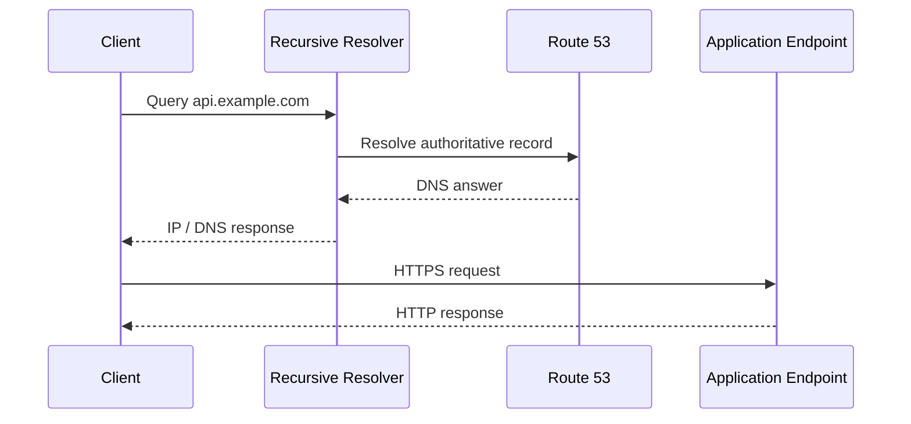
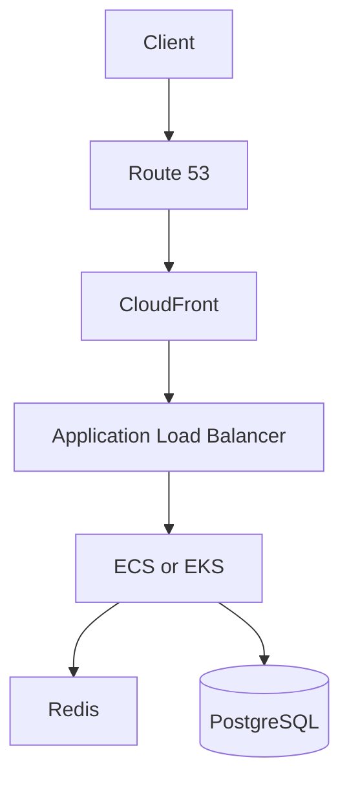

# 01- Introduction

## Overview

Amazon Route 53 is AWS's managed DNS service used to register domains, host DNS zones, resolve domain names, and control how clients are directed to application endpoints.

For backend engineers, Route 53 is more than a service used to create `A` records. It sits at an important boundary between **DNS resolution, application architecture, traffic management, service discovery, security, and disaster recovery**.

A production backend commonly uses Route 53 together with services such as Application Load Balancer, CloudFront, API Gateway, ECS, EKS, and multi-region deployments.

A simplified architecture is:

```text
Client
  │
  │ DNS query
  ▼
Recursive DNS Resolver
  │
  │ authoritative query
  ▼
Route 53
  │
  │ DNS response
  ▼
Client
  │
  │ HTTP/HTTPS request
  ▼
CloudFront / ALB / API Gateway
  │
  ▼
Backend Services
```

The critical distinction is that **Route 53 participates in DNS resolution; it does not normally proxy the application's HTTP or gRPC traffic**.

---

## Why Route 53 Matters to Backend Engineers

DNS is part of the production request path even though it is not part of the application protocol itself.

A backend service may be perfectly healthy while users are still unable to reach it because:

- The DNS record points to the wrong endpoint.
- The domain delegation is incorrect.
- A private hosted zone is associated with the wrong VPC.
- A DNS response is cached.
- A routing policy returns an unexpected endpoint.
- A health check is incorrectly configured.
- A domain has expired.
- DNSSEC configuration is invalid.
- Infrastructure as Code deployed an unintended record change.

This means DNS configuration can have an application-wide blast radius.

For senior backend engineers, Route 53 should therefore be understood in terms of:

- Request resolution
- Traffic routing
- Failure domains
- Availability
- Caching
- Security
- Infrastructure as Code
- Disaster recovery
- Operational troubleshooting

---

## DNS and Route 53

DNS translates human-readable names into network endpoints.

For example:

```text
api.example.com
       │
       ▼
   DNS resolution
       │
       ▼
203.0.113.20
```

A backend client can then establish a connection to the returned endpoint.

However, the complete process normally involves multiple DNS components.



Route 53 is typically authoritative for the DNS zone hosted in AWS, while the client usually queries a recursive resolver rather than Route 53 directly.

---

## What Route 53 Provides

Route 53 provides several related capabilities.

| Capability | Purpose |
|---|---|
| Domain registration | Register and manage supported domain names |
| Public hosted zones | Authoritative DNS for internet-facing domains |
| Private hosted zones | DNS resolution inside associated VPCs |
| DNS records | Map names to IP addresses, AWS resources, or other DNS names |
| Routing policies | Control which DNS answers are returned |
| Health checks | Determine endpoint health for supported routing scenarios |
| Resolver | DNS resolution and forwarding for AWS networking environments |
| DNSSEC | Protect DNS data integrity and authenticity for supported configurations |

These capabilities solve different problems and should not be treated as interchangeable.

---

## Hosted Zones

A hosted zone contains DNS records for a domain.

For example, a public hosted zone for:

```text
example.com
```

could contain:

```text
example.com          A       ...
api.example.com      A       ...
www.example.com      A       ...
mail.example.com     MX      ...
```

A hosted zone is therefore an administrative boundary for DNS records.

### Public Hosted Zones

A public hosted zone is used when DNS names must be resolvable from the public internet.

Example:

```text
api.example.com
      │
      ▼
Internet DNS
      │
      ▼
Route 53 public hosted zone
      │
      ▼
Public AWS endpoint
```

Typical use cases include:

- Public REST APIs
- Public websites
- CloudFront distributions
- Public load balancers
- Internet-facing applications

### Private Hosted Zones

A private hosted zone is used for DNS names that should resolve only within associated VPCs.

Example:

```text
VPC
│
├── app.internal.example.com
├── db.internal.example.com
└── redis.internal.example.com
```

This is useful for internal service communication without exposing internal DNS names to the public internet.

For example:

```text
orders.internal.example.com
        │
        ▼
Internal Load Balancer
        │
        ▼
Orders Service
```

Private hosted zones require deliberate VPC association and DNS configuration.

A common production mistake is creating the correct private record but associating the hosted zone with the wrong VPC.

---

## DNS Records

Route 53 supports common DNS record types such as:

- `A`
- `AAAA`
- `CNAME`
- `MX`
- `TXT`
- `NS`
- `SOA`
- `SRV`
- `CAA`

The correct record type depends on what the name represents.

### A Record

An `A` record maps a hostname to an IPv4 address.

```text
api.example.com → 203.0.113.20
```

Example:

```text
api.example.com.    A    203.0.113.20
```

### AAAA Record

An `AAAA` record maps a hostname to an IPv6 address.

```text
api.example.com → 2001:db8::20
```

### CNAME Record

A `CNAME` maps one DNS name to another DNS name.

```text
api.example.com → backend.example.net
```

CNAME records do not directly map names to IP addresses.

A major DNS constraint is that a CNAME generally cannot coexist with other records at the same name, which is one reason AWS provides alias records for supported resources.

---

## Route 53 Alias Records

Alias records provide AWS-specific DNS integration.

They can be used with supported AWS resources such as:

- Application Load Balancers
- Network Load Balancers
- CloudFront distributions
- API Gateway endpoints
- S3 website endpoints
- Other supported AWS targets

For example:

```text
api.example.com
       │
       ▼
Route 53 Alias
       │
       ▼
Application Load Balancer
       │
       ▼
Backend
```

Alias records are not the same thing as CNAME records.

| Characteristic | CNAME | Alias |
|---|---|---|
| Maps to DNS name | Yes | AWS resource target / supported endpoint |
| Maps directly to IP | No | AWS manages target resolution |
| Supported at zone apex | No | Yes, where supported |
| AWS-specific | No | Yes |
| Typical ALB integration | Possible through DNS target patterns, but alias is preferred | Yes |
| Additional Route 53 charge for query itself | Standard DNS pricing applies | No additional charge for alias queries in supported cases |

The zone apex limitation is important.

For:

```text
example.com
```

a traditional CNAME cannot normally be used because the zone apex already requires authoritative records such as `NS` and `SOA`.

Alias records solve this problem for supported AWS resources.

---

## DNS Request Lifecycle

A backend engineer should understand what happens when a client accesses:

```text
https://api.example.com/orders
```

The DNS portion happens before the application request.

```text
Application
    │
    │ Resolve api.example.com
    ▼
Operating System / Local DNS Cache
    │
    ▼
Recursive Resolver
    │
    ▼
Root / TLD / Authoritative DNS
    │
    ▼
Route 53
    │
    ▼
DNS Answer
    │
    ▼
Client
    │
    │ HTTPS request
    ▼
ALB / CloudFront / API Gateway
    │
    ▼
Backend
```

The DNS response may be cached at several layers.

This is why changing a Route 53 record does not necessarily mean every client immediately sees the new value.

---

## TTL and DNS Caching

TTL, or Time To Live, controls how long a DNS response can be cached.

For example:

```text
api.example.com
TTL = 60 seconds
```

A resolver may cache the response for the configured TTL.

A simplified flow is:

```text
Route 53
   │
   │ DNS response
   ▼
Recursive Resolver
   │
   │ Cache
   ▼
Client
```

TTL is important for:

- DNS migrations
- Failover
- Traffic shifting
- Operational changes
- Reducing DNS query volume

However, TTL should not be interpreted as an exact guarantee that all clients will switch after that amount of time.

Caching behavior exists outside Route 53, and DNS behavior depends on the complete resolution chain.

---

## Route 53 Routing Policies

Route 53 can return different DNS answers according to routing policies.

Common policies include:

| Routing Policy | Typical Use |
|---|---|
| Simple | Basic single-endpoint DNS |
| Weighted | Traffic splitting and controlled migrations |
| Latency-based | Direct users toward lower-latency AWS regions |
| Failover | Primary/secondary architectures |
| Geolocation | Route based on geographic location |
| Geoproximity | Route based on geographic proximity with optional bias |
| IP-based | Route based on client IP ranges |
| Multivalue answer | Return multiple healthy records |

These policies operate at the DNS level.

They should not be confused with application-layer load balancing.

---

## Route 53 and Load Balancing

A common production architecture is:

```text
                    Route 53
                       │
                       ▼
              Application Load Balancer
                       │
              ┌────────┴────────┐
              ▼                 ▼
          Backend A          Backend B
```

The responsibilities are different.

### Route 53

Responsible for:

- DNS resolution
- DNS-level routing
- Domain management
- DNS health-based decisions

### Application Load Balancer

Responsible for:

- HTTP/HTTPS traffic distribution
- Target health
- Listener rules
- Path-based routing
- Host-based routing
- Connection handling

Therefore:

> Route 53 does not replace an ALB.

Similarly, Route 53 does not replace CloudFront, which operates as a content delivery and edge networking layer.

---

## Route 53 in a Microservices Architecture

Internal services may use private DNS names.

For example:

```text
api.internal.example.com
        │
        ▼
API Service
        │
        ├── orders.internal.example.com
        │
        ├── payments.internal.example.com
        │
        └── users.internal.example.com
```

This can provide stable service names while the underlying infrastructure changes.

For example, the `orders` service could move from:

```text
EC2
```

to:

```text
ECS
```

without requiring every application client to know the new infrastructure address.

However, service discovery should be designed intentionally. DNS is not automatically the best mechanism for every microservice communication requirement.

For Kubernetes workloads, Kubernetes-native service discovery commonly handles in-cluster service resolution, while Route 53 can still be relevant for external and AWS-integrated DNS requirements.

---

## Route 53 and Disaster Recovery

DNS can be an important component of disaster recovery.

For example:

```text
                  Route 53
                     │
             ┌───────┴───────┐
             ▼               ▼
        Region A          Region B
        Primary           Secondary
             │               │
             ▼               ▼
          ALB A             ALB B
             │               │
          Backend          Backend
```

A failover architecture may direct traffic to a secondary region when the primary is considered unhealthy.

But DNS failover alone does not create disaster recovery.

A production DR design must also consider:

- Data replication
- Database recovery
- Application deployment
- Infrastructure provisioning
- Secrets
- Capacity
- Dependency availability
- Monitoring
- RTO
- RPO
- Operational runbooks

A Route 53 health check can determine whether a configured endpoint satisfies a health condition, but it cannot guarantee that the entire business system is operational.

---

## Health Checks

Health checks can be used to determine whether endpoints are healthy for supported Route 53 routing scenarios.

A health check may evaluate an endpoint using supported protocols and conditions.

For example:

```text
Route 53 Health Check
        │
        ▼
https://api.example.com/health
        │
        ▼
Application
        │
        ├── 200 → Healthy
        └── Failure → Unhealthy
```

The endpoint should expose a health check designed for the routing decision.

A poor health check might return HTTP `200` even when:

- The database is unavailable.
- Critical dependencies are failing.
- The application cannot serve real traffic.

A production health endpoint should therefore be designed according to the desired failure semantics.

---

## Route 53 Resolver

Route 53 Resolver provides DNS resolution capabilities for AWS networking environments.

It supports use cases such as:

- DNS resolution within VPCs
- Forwarding DNS queries
- Resolving private DNS names
- Integrating AWS VPC DNS with external DNS environments

A hybrid environment may look like:

```text
AWS VPC
   │
   ▼
Route 53 Resolver
   │
   │ DNS forwarding
   ▼
Corporate DNS
   │
   ▼
On-Premises Services
```

This becomes important in hybrid cloud architectures where workloads need to resolve both AWS and corporate DNS names.

---

## Security Considerations

DNS configuration is security-sensitive because unauthorized changes can redirect users and services.

Important controls include:

- Least-privilege IAM permissions
- Separation of DNS administration privileges
- MFA for privileged AWS identities
- CloudTrail auditing
- Infrastructure as Code
- Change review
- Protected CI/CD workflows
- DNSSEC where appropriate
- Careful management of private hosted zones

For example, avoid granting broad DNS permissions to application deployment roles when the application does not need to modify DNS.

A safer separation is:

```text
Application Deployment Role
        │
        └── Application resources only

DNS Administration Role
        │
        └── Route 53 changes
```

This reduces the blast radius of a compromised application deployment identity.

---

## Infrastructure as Code

Production DNS configuration should generally be managed through Infrastructure as Code.

For example, Terraform can define a Route 53 record:

```hcl
resource "aws_route53_record" "api" {
  zone_id = aws_route53_zone.public.zone_id
  name    = "api.example.com"
  type    = "A"

  alias {
    name                   = aws_lb.api.dns_name
    zone_id                = aws_lb.api.zone_id
    evaluate_target_health = true
  }
}
```

The important production properties are:

- Version control
- Peer review
- Automated validation
- Controlled deployment
- Change history
- Repeatability
- Environment separation

DNS should not become an undocumented collection of manual console changes.

---

## Monitoring and Operations

Route 53 should be considered part of the production control plane.

Operational monitoring should cover relevant areas such as:

- DNS health checks
- Resolver behavior
- Application endpoint health
- DNS configuration changes
- Route 53 query behavior where applicable
- CloudTrail events
- Domain expiration
- DNSSEC status
- Infrastructure as Code drift

A useful production approach is to correlate DNS signals with application signals.

For example:

```text
DNS Failure
   │
   ├── Route 53 configuration
   ├── Health check
   ├── Resolver
   ├── TTL / cache
   │
   ▼
Network Failure
   │
   ├── Load balancer
   ├── Security groups
   └── Connectivity
   │
   ▼
Application Failure
   │
   ├── API
   ├── Database
   └── Dependencies
```

This prevents teams from treating every availability issue as a DNS problem.

---

## Cost Considerations

Route 53 costs depend on the capabilities being used and the associated DNS infrastructure.

Relevant cost areas can include:

- Hosted zones
- DNS queries
- Health checks
- Resolver endpoints and rules
- Domain registration
- Traffic management features where applicable

Cost optimization should not compromise DNS reliability.

For example, aggressively reducing health-check coverage simply to save cost can create a larger operational risk if health-based routing is part of the availability strategy.

The appropriate design should balance:

```text
Reliability
     +
Operational Requirements
     +
Traffic Volume
     +
DNS Architecture
     +
Cost
```

---

## Common Beginner Mistakes

### Treating Route 53 as an HTTP Load Balancer

Route 53 returns DNS answers. It does not normally inspect every HTTP request.

Use:

- Route 53 for DNS
- ALB for HTTP load balancing
- CloudFront for edge delivery and caching

### Assuming DNS Changes Are Instant

DNS responses can be cached.

Always consider TTL and resolver caching during DNS changes.

### Using Public DNS for Internal Services

Internal services should not automatically be exposed through public DNS.

Use private DNS and appropriate networking controls for internal-only services.

### Confusing Alias and CNAME

Alias records provide AWS-specific integration and can support zone-apex use cases where CNAME records cannot.

### Assuming Health Checks Understand Application Health

A health check only evaluates what it is configured to evaluate.

A simple `200 OK` endpoint may not represent the health of the complete system.

### Giving Applications Broad Route 53 Permissions

Most applications do not need permission to modify production DNS.

Separate application permissions from DNS administration.

---

## Production Architecture Example

A production public API might use:



The responsibilities remain separated:

| Layer | Responsibility |
|---|---|
| Route 53 | DNS and DNS-level routing |
| CloudFront | Edge delivery and caching |
| ALB | HTTP load balancing |
| ECS/EKS | Application execution |
| Redis | Caching / ephemeral application state |
| PostgreSQL | Persistent application data |

This separation makes failures easier to reason about and allows each component to scale independently.

---

## Senior Engineering Perspective

At senior level, Route 53 questions are rarely about remembering the definition of an `A` record.

The important questions are architectural:

- What happens when the primary region fails?
- How quickly can DNS changes propagate operationally?
- What does the health check actually prove?
- What happens if recursive resolvers have cached an old answer?
- How do you prevent unauthorized DNS modifications?
- How do private DNS names resolve across VPCs?
- How would you migrate traffic without causing an outage?
- What is the blast radius of a DNS failure?
- When should DNS routing be used instead of an application load balancer?
- How does DNS participate in a multi-region architecture?
- What happens if Route 53 is configured correctly but the target application is unhealthy?

The strongest design answers explain the **failure mode, caching behavior, architectural boundary, and operational trade-off**, not just the Route 53 feature being used.

---

## Key Takeaways

- Amazon Route 53 is a managed DNS service and should not be confused with an HTTP load balancer.
- Hosted zones provide the authoritative DNS boundary for domains.
- Public hosted zones serve internet-facing DNS requirements, while private hosted zones support internal VPC DNS.
- DNS records such as `A`, `AAAA`, and `CNAME` serve different purposes; alias records provide AWS-specific integration for supported targets.
- DNS resolution happens before the client establishes the application connection.
- Recursive resolver caching means DNS changes are not necessarily observed immediately by every client.
- TTL influences DNS caching but should not be treated as an exact failover guarantee.
- Route 53 routing policies operate at the DNS layer and do not provide precise request-level traffic distribution.
- Health checks should represent meaningful failure conditions for the routing decision.
- Route 53 can participate in multi-region disaster recovery, but DNS failover alone does not constitute a complete DR strategy.
- Private DNS and Route 53 Resolver are important components of modern AWS and hybrid networking architectures.
- DNS administration should be protected using least-privilege IAM, auditing, controlled changes, and Infrastructure as Code.
- Production Route 53 design should consider reliability, security, observability, cost, caching, and disaster recovery together.