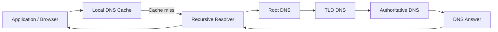
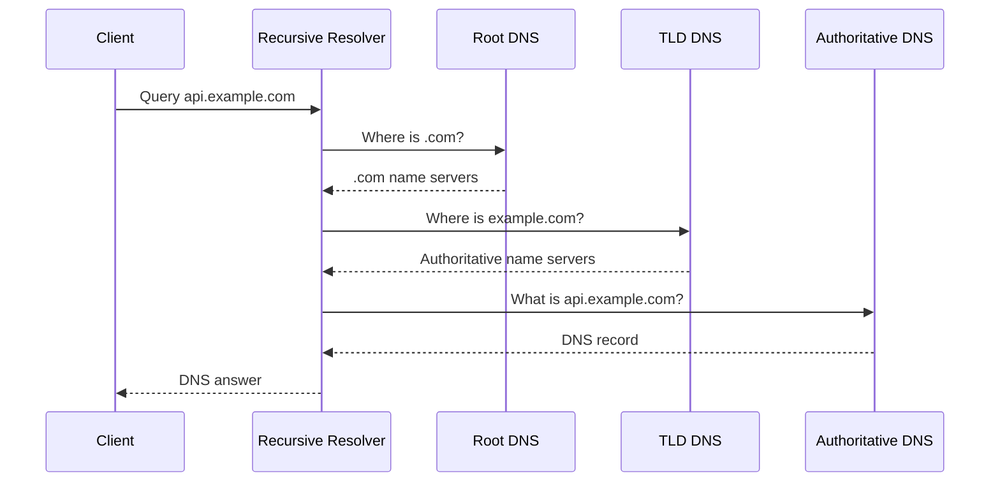

# 02- DNS Fundamentals

## Overview

Domain Name System (DNS) is the distributed naming system that maps human-readable names to network endpoints and other service metadata. Backend systems depend on DNS for public APIs, load balancers, service discovery, email delivery, cloud resources, and multi-region architectures.

For example:

```text
api.example.com
       │
       ▼
DNS resolution
       │
       ▼
203.0.113.20
       │
       ▼
HTTPS connection
       │
       ▼
Backend service
```

DNS is not an HTTP routing layer. It normally provides information that allows a client or resolver to determine **where it should connect**. Once the DNS resolution is complete, the application protocol such as HTTP, HTTPS, or gRPC establishes communication with the returned endpoint.

In AWS architectures, Amazon Route 53 can act as the authoritative DNS service and provide routing policies, health-based DNS responses, private DNS, and integration with AWS infrastructure.

---

## Why DNS Exists

Applications need stable names while infrastructure changes underneath them.

Without DNS, clients would need to know IP addresses directly:

```text
https://203.0.113.20
```

That creates operational problems when infrastructure changes.

With DNS:

```text
https://api.example.com
```

the infrastructure behind the name can change without requiring clients to know the new address.

For example:

```text
api.example.com
       │
       ├── Old deployment → 203.0.113.20
       │
       └── New deployment → 203.0.113.50
```

The application can continue using:

```text
api.example.com
```

while DNS infrastructure controls how the name resolves.

DNS therefore provides an important abstraction between:

- Application identity
- Network addressing
- Infrastructure
- Traffic routing

---

## DNS Naming Hierarchy

DNS uses a hierarchical namespace.

For:

```text
api.prod.example.com
```

the hierarchy can be viewed as:

```text
.
└── com
    └── example
        └── prod
            └── api
```

The components are commonly described as:

| Component | Example | Purpose |
|---|---|---|
| Root | `.` | Top of DNS hierarchy |
| TLD | `com` | Top-level domain |
| Domain | `example.com` | Registered domain |
| Subdomain | `prod.example.com` | Delegated or organizational namespace |
| Host/service name | `api.prod.example.com` | Specific DNS name |

The trailing dot in a fully qualified domain name is usually omitted in application configuration:

```text
api.example.com
```

but technically the fully qualified name is:

```text
api.example.com.
```

The final dot represents the DNS root.

---

## Fully Qualified Domain Name

A Fully Qualified Domain Name (FQDN) uniquely identifies a DNS name within the hierarchy.

Examples:

```text
api.example.com.
db.internal.example.com.
www.example.com.
```

An FQDN is useful because it removes ambiguity about where the name exists in the DNS namespace.

In configuration files, you will commonly see the trailing dot omitted:

```text
api.example.com
```

DNS tooling may display the canonical form with the trailing dot.

---

## DNS Components

A production DNS lookup typically involves several components.



The major roles are:

### Stub Resolver

The client operating system or application environment typically sends DNS queries to a configured recursive resolver.

It may also use local caching.

### Recursive Resolver

A recursive resolver performs DNS resolution on behalf of the client.

Examples include:

- ISP-provided resolvers
- Enterprise DNS resolvers
- Public DNS resolvers
- VPC DNS infrastructure

The recursive resolver can cache responses and avoid repeating the complete resolution process for every client request.

### Root Name Servers

Root DNS servers provide information about the authoritative servers for top-level domains.

They do not normally contain the final answer for:

```text
api.example.com
```

Instead, they help the resolver move down the DNS hierarchy.

### TLD Name Servers

A TLD such as:

```text
.com
```

has authoritative infrastructure that directs resolvers toward the authoritative servers for domains under that TLD.

### Authoritative Name Server

The authoritative server owns the DNS data for a zone.

For an AWS-managed public DNS zone, Route 53 can provide this authoritative service.

---

## Recursive vs Authoritative DNS

This distinction is fundamental.

| Type | Responsibility |
|---|---|
| Recursive resolver | Finds the answer on behalf of the client |
| Authoritative server | Provides authoritative DNS data for a zone |

For example:

```text
Client
  │
  │ "What is api.example.com?"
  ▼
Recursive Resolver
  │
  │ "I need to find the authoritative answer."
  ▼
Authoritative DNS
  │
  │ "api.example.com = ..."
  ▼
Recursive Resolver
  │
  ▼
Client
```

Route 53 can operate as the authoritative DNS provider for domains hosted in Route 53.

This distinction matters when troubleshooting DNS because the authoritative record can be correct while a recursive resolver is still returning a cached value.

---

## DNS Resolution Flow

Consider:

```text
https://api.example.com/orders
```

The client first needs to resolve:

```text
api.example.com
```

A simplified resolution process is:



In reality, caching often removes many of these steps.

If the recursive resolver already has a valid cached answer, it can return the answer without querying the authoritative server.

---

## DNS Records

DNS records describe how a DNS name should behave.

Common record types include:

| Record | Purpose | Example |
|---|---|---|
| `A` | IPv4 address | `api.example.com → 203.0.113.20` |
| `AAAA` | IPv6 address | `api.example.com → 2001:db8::20` |
| `CNAME` | Alias to another DNS name | `www.example.com → app.example.net` |
| `MX` | Mail delivery | `example.com → mail.example.com` |
| `TXT` | Arbitrary text / verification | Domain verification, SPF-related data |
| `NS` | Authoritative name servers | Delegation |
| `SOA` | Zone authority metadata | Zone-level DNS information |
| `SRV` | Service location | `_grpc._tcp.example.com` |
| `CAA` | Certificate authority authorization | Restrict certificate issuers |

The correct record type depends on the architectural requirement.

---

## A Records

An `A` record maps a DNS name to an IPv4 address.

```text
api.example.com → 203.0.113.20
```

Example:

```text
api.example.com.    A    203.0.113.20
```

A common misconception is that an `A` record always represents a physical server.

It does not.

The address may belong to:

- A load balancer
- A reverse proxy
- A virtual machine
- A public service endpoint
- Another network endpoint

In production architectures, applications should generally connect through stable service endpoints rather than directly exposing individual backend instances.

---

## AAAA Records

An `AAAA` record maps a name to an IPv6 address.

```text
api.example.com → 2001:db8::20
```

A production service supporting IPv6 may therefore expose both:

```text
api.example.com
    ├── A     → IPv4
    └── AAAA  → IPv6
```

When both records are available, client behavior determines which address family is used.

Backend engineers should account for this when applications, firewalls, access-control policies, observability, and infrastructure are expected to support IPv6.

---

## CNAME Records

A CNAME creates an alias from one DNS name to another DNS name.

```text
api.example.com
       │
       ▼
backend.example.net
       │
       ▼
DNS resolution
```

For example:

```text
api.example.com.    CNAME    backend.example.net.
```

The target of a CNAME is another DNS name, not an IP address.

### Important CNAME Limitation

A CNAME generally cannot coexist with other records at the same DNS name.

It also cannot normally be used at the zone apex because the apex requires records such as:

```text
NS
SOA
```

This is one reason cloud DNS providers often provide alias-like mechanisms.

In Route 53, alias records can point supported DNS names such as the zone apex to supported AWS resources.

---

## MX Records

MX records control where email for a domain should be delivered.

Example:

```text
example.com.    MX    10 mail.example.com.
```

The number represents priority.

Lower preference values have higher priority.

MX records are therefore different from application endpoint records such as `A` or `CNAME`.

---

## TXT Records

TXT records store text associated with a DNS name.

Common uses include:

- Domain ownership verification
- Email authentication
- SPF-related configuration
- Service verification
- Certificate validation workflows

For example:

```text
example.com.    TXT    "verification-token"
```

TXT records should not be treated as a generic application configuration store.

They are publicly visible when stored in a public DNS zone and should never contain secrets.

---

## NS Records

NS records identify authoritative name servers for a DNS zone.

For example:

```text
example.com
    │
    └── NS
        ├── ns-123.awsdns-45.com
        ├── ns-456.awsdns-67.net
        └── ...
```

Delegation from a parent zone to authoritative name servers is fundamental to DNS.

If the parent domain points to the wrong name servers, a correctly configured Route 53 hosted zone may still not answer queries for the public domain.

This is a common production troubleshooting issue.

---

## SOA Records

The Start of Authority (SOA) record contains authoritative metadata for a DNS zone.

It identifies information such as:

- Primary authoritative server
- Responsible administrative contact
- Zone serial information
- Refresh-related values
- Retry-related values
- Expiration-related values
- Negative caching information

Most application developers do not modify SOA records directly, but senior engineers should understand that SOA is part of the authoritative DNS structure.

---

## SRV Records

SRV records provide service discovery information.

Conceptually:

```text
_service._protocol.example.com
```

can resolve to information describing:

- Priority
- Weight
- Port
- Target hostname

For example:

```text
_grpc._tcp.example.com
```

can represent a gRPC service endpoint.

SRV records can be useful for service discovery, but they do not automatically make a client capable of using the service. The client application must understand SRV semantics.

---

## CAA Records

CAA records allow domain owners to specify which certificate authorities are authorized to issue certificates for the domain.

Conceptually:

```text
example.com
    │
    ▼
CAA
    │
    └── Authorized certificate authority
```

This provides an additional control over certificate issuance.

For production domains, CAA can be part of a broader certificate-management security strategy.

---

## DNS Zones

A DNS zone is a portion of the DNS namespace managed by a particular authoritative DNS configuration.

For example:

```text
example.com
├── api.example.com
├── www.example.com
├── db.internal.example.com
└── mail.example.com
```

A zone does not necessarily have to represent an entire registered domain.

Subdomains can be delegated into separate zones.

For example:

```text
example.com
      │
      └── prod.example.com
                │
                └── api.prod.example.com
```

The delegation boundary can be useful for organizational and operational separation.

---

## Domain vs Hosted Zone

These concepts are frequently confused.

| Concept | Meaning |
|---|---|
| Domain name | The namespace registered or controlled by an organization |
| Hosted zone | DNS data and authority for a specific DNS namespace |
| DNS record | Individual mapping/configuration inside a zone |
| Name server | Server responsible for authoritative DNS answers |

For example:

```text
Domain:
example.com

Hosted Zone:
example.com

Records:
api.example.com
www.example.com
mail.example.com
```

Registering a domain and hosting DNS for that domain are related but distinct operations.

---

## TTL and DNS Caching

TTL controls how long a DNS answer may be cached.

Example:

```text
api.example.com
TTL = 60 seconds
```

A recursive resolver receiving this response may cache it according to the TTL.

The next client querying the same resolver may receive the cached response without causing another authoritative lookup.

```text
Client A ──┐
           ├──> Recursive Resolver ──> Route 53
Client B ──┘              │
                          └── Cached response
```

### Why Caching Matters

Caching provides:

- Lower DNS query load
- Faster responses
- Reduced latency
- Lower authoritative DNS traffic

But caching also means DNS changes are not necessarily visible immediately everywhere.

### TTL Trade-Off

| Lower TTL | Higher TTL |
|---|---|
| Faster changes | Longer caching |
| Better for migration/failover | Better cache efficiency |
| More DNS queries | Fewer DNS queries |
| Potentially higher DNS cost | Potentially lower DNS query cost |

TTL should be selected according to operational requirements rather than using a universally low or high value.

---

## Negative DNS Caching

DNS caching also applies to negative answers.

For example, if:

```text
does-not-exist.example.com
```

does not exist, a resolver can cache that negative result.

This matters when introducing a new DNS record.

A team may create:

```text
api.example.com
```

and immediately test from an environment that previously cached a negative response.

The record can exist authoritatively while the client still receives the cached negative result.

This is an important DNS troubleshooting scenario.

---

## DNS Propagation

The phrase "DNS propagation" is often used loosely.

DNS does not normally send a new record to every resolver on the internet.

Instead:

1. The authoritative DNS configuration changes.
2. Recursive resolvers continue using cached responses until their cache entries expire.
3. New queries eventually retrieve the updated authoritative response.
4. Different recursive resolvers can therefore observe changes at different times.

A better mental model is:

```text
Authoritative state changes
        │
        ▼
Existing caches expire
        │
        ▼
Resolvers query authority again
        │
        ▼
New DNS response cached
```

This is why DNS migrations should account for TTLs and operational timing.

---

## DNS Delegation

Delegation determines which authoritative DNS infrastructure is responsible for a domain or subdomain.

For example:

```text
Parent Zone
example.com
      │
      │ delegation
      ▼
Child Zone
prod.example.com
```

The parent zone can specify authoritative name servers for the child zone.

Delegation is particularly important when:

- Moving DNS providers
- Splitting ownership between teams
- Managing subdomains independently
- Migrating environments
- Integrating external DNS providers

A delegation error can make an otherwise correct DNS zone effectively unreachable.

---

## DNS Lookup Types

DNS queries can be resolved through different approaches.

### Recursive Query

The client asks the resolver to obtain the final answer.

```text
Client → Resolver
"Give me the answer."
```

### Iterative Resolution

A DNS server can provide a referral to another DNS server rather than resolving the entire request itself.

Conceptually:

```text
Resolver → Root
Root → TLD server

Resolver → TLD
TLD → Authoritative server

Resolver → Authoritative
Authoritative → Final answer
```

Recursive resolvers perform this process on behalf of clients.

---

## DNS Response Types

A DNS response can represent different outcomes.

| Response | Meaning |
|---|---|
| Successful answer | Requested record exists |
| `NXDOMAIN` | Name does not exist |
| `NOERROR` with no answer | Domain exists but requested record type may not exist |
| `SERVFAIL` | Resolver/server failed to produce a valid answer |
| `REFUSED` | Server refused the query |

Understanding these distinctions is important during troubleshooting.

For example, `NXDOMAIN` and `SERVFAIL` represent fundamentally different failure modes.

---

## DNS and HTTP Are Different Layers

A common backend misconception is:

> "Route 53 routes the HTTP request."

DNS generally determines the endpoint.

HTTP determines what happens after the connection is established.

```text
DNS
│
│ api.example.com → endpoint
▼
Network connection
│
▼
TLS
│
▼
HTTP
│
├── GET /orders
├── POST /payments
└── GET /users
```

This separation is important when debugging.

If DNS resolution works but HTTP returns `503`, the DNS layer may be functioning correctly while the load balancer or backend is failing.

---

## DNS and TLS

DNS and TLS are separate systems but interact during application connection setup.

For:

```text
https://api.example.com
```

the client typically:

1. Resolves `api.example.com`.
2. Connects to the returned endpoint.
3. Performs TLS negotiation.
4. Sends the HTTP request.

The TLS certificate must be valid for the hostname the client uses.

Therefore, changing DNS without considering certificate configuration can create application failures.

For example:

```text
api.example.com
      │
      ▼
New Load Balancer
      │
      ▼
Certificate must cover api.example.com
```

DNS does not provide TLS encryption.

---

## DNS and Load Balancers

A common production architecture is:

```text
Client
  │
  ▼
Route 53
  │
  ▼
Application Load Balancer
  │
  ├── Target 1
  ├── Target 2
  └── Target 3
```

Route 53 provides the DNS mapping.

The load balancer provides request-level traffic distribution.

This distinction becomes important when designing highly available APIs.

### Route 53

Handles:

- DNS resolution
- DNS routing policies
- Domain-level failover
- DNS health-based routing

### Load Balancer

Handles:

- TCP/HTTP connections
- Request distribution
- Target health
- Listener rules
- Application-layer routing

Do not use DNS mechanisms when request-level routing is required.

---

## DNS in Microservices

DNS can provide stable service identities.

For example:

```text
orders.internal.example.com
payments.internal.example.com
users.internal.example.com
```

Applications can communicate using stable names rather than infrastructure-specific IP addresses.

```text
Order Service
      │
      │ gRPC
      ▼
payments.internal.example.com
      │
      ▼
Payment Service
```

This is especially useful when service instances are replaced dynamically.

However, DNS-based service discovery introduces considerations around:

- TTL
- Client-side caching
- Resolver behavior
- Connection pooling
- Service health
- Failure detection

For high-scale service-to-service communication, DNS should be considered alongside service discovery systems and load balancing rather than treated as a universal service-discovery mechanism.

---

## DNS in AWS

AWS environments commonly use DNS for both public and private workloads.

A simplified architecture is:

```text
                    Route 53
                   /        \
                  /          \
         Public DNS          Private DNS
              │                  │
              ▼                  ▼
         CloudFront / ALB     VPC Services
                                  │
                         ┌────────┼────────┐
                         ▼        ▼        ▼
                       ECS      EKS      Internal ALB
```

Route 53 can integrate with AWS resources through alias records and routing policies.

Private DNS can provide internal names for resources that should not be publicly resolvable.

---

## Public vs Private DNS

| Property | Public DNS | Private DNS |
|---|---|---|
| Resolution scope | Internet | Associated private network/VPC |
| Typical use | Public APIs/websites | Internal services |
| Internet accessible | Potentially | No, by design |
| Example | `api.example.com` | `orders.internal.example.com` |
| Common AWS mechanism | Public hosted zone | Private hosted zone |

Private DNS should be preferred when a service is intended to remain internal.

Using public DNS for internal services can increase unnecessary exposure and complicate security boundaries.

---

## DNS Security

DNS configuration is part of the infrastructure security boundary.

Important considerations include:

### Least-Privilege DNS Administration

Application roles should not automatically have permission to modify DNS.

Separate:

```text
Application Deployment
        │
        └── Application resources

DNS Administration
        │
        └── DNS resources
```

### DNSSEC

DNSSEC provides cryptographic mechanisms that help protect DNS responses from certain forms of tampering.

It should be evaluated according to domain requirements and operational capabilities.

### CAA

CAA records can restrict which certificate authorities are authorized to issue certificates for a domain.

### Secrets

Never store secrets in public DNS records.

TXT records are not secure secret storage.

---

## DNS Reliability

DNS is part of the application's dependency chain.

A production architecture should consider:

- Authoritative DNS availability
- Resolver availability
- Multiple authoritative name servers
- Appropriate TTLs
- Health-based routing where required
- DNS configuration backups
- Infrastructure as Code
- Change auditing
- Domain expiration management

DNS reliability should also be tested.

For example:

```text
Application availability test
        │
        ├── DNS resolution
        ├── TCP connectivity
        ├── TLS
        ├── HTTP
        └── Application health
```

Testing only the application endpoint without testing DNS can miss a significant class of production failures.

---

## Common DNS Mistakes

### Using an IP Address Everywhere

Hardcoding infrastructure IP addresses couples applications to infrastructure.

Prefer stable service names where appropriate.

### Assuming TTL Is a Propagation Timer

TTL controls caching behavior. It does not mean every client will switch exactly after the configured number of seconds.

### Confusing `NXDOMAIN` and `SERVFAIL`

They represent different failure conditions and require different troubleshooting paths.

### Assuming Route 53 Handles HTTP Routing

Route 53 operates at the DNS layer.

Use an ALB, reverse proxy, API Gateway, or application-level routing mechanism for HTTP request routing.

### Exposing Internal Services Publicly

Internal services should normally use private networking and private DNS.

### Putting Secrets in TXT Records

Public DNS records are observable by clients and DNS infrastructure.

DNS is not a secret store.

### Ignoring IPv6

If IPv6 is enabled, applications and security controls must be tested for IPv6 behavior rather than assuming IPv4-only behavior.

---

## Practical DNS Troubleshooting Commands

### `dig`

`dig` is one of the most useful tools for DNS troubleshooting.

```bash
dig api.example.com
```

Query a specific record type:

```bash
dig api.example.com A
```

```bash
dig api.example.com AAAA
```

Query a specific DNS server:

```bash
dig @8.8.8.8 api.example.com
```

Query the authoritative name servers:

```bash
dig NS example.com
```

Trace the resolution path:

```bash
dig +trace api.example.com
```

Check the TTL returned by the authoritative DNS server:

```bash
dig +noall +answer api.example.com
```

### `nslookup`

`nslookup` is another commonly available DNS troubleshooting tool.

```bash
nslookup api.example.com
```

Specify a resolver:

```bash
nslookup api.example.com 8.8.8.8
```

For production troubleshooting, `dig` generally provides richer diagnostic information.

---

## Example: Debugging an API DNS Failure

Suppose:

```text
https://api.example.com
```

is suddenly unavailable.

Do not immediately change the Route 53 record.

Start by separating the failure layers.

### Check DNS Resolution

```bash
dig api.example.com
```

If there is no expected answer, investigate:

- Record configuration
- Hosted zone
- Delegation
- Resolver
- DNS caching
- Record type

### Check Authoritative DNS

```bash
dig NS example.com
```

Then query an authoritative server directly if known:

```bash
dig @<authoritative-server> api.example.com
```

This helps determine whether the authoritative configuration itself is correct.

### Check Connectivity

If DNS resolves correctly:

```bash
curl -v https://api.example.com/health
```

Now investigate:

- Load balancer
- TLS
- Security groups
- Network ACLs
- Backend targets
- Application health

The troubleshooting model becomes:

```text
DNS
 │
 ├── Name resolution
 ├── Delegation
 ├── Record
 └── Cache
 │
 ▼
Network
 │
 ├── Connectivity
 ├── Routing
 └── Security
 │
 ▼
TLS
 │
 ▼
HTTP
 │
 ▼
Application
```

This layered approach prevents unrelated DNS changes from making an existing incident worse.

---

## Production DNS Checklist

Before putting a production service behind DNS, verify:

- [ ] Domain delegation is correct.
- [ ] Authoritative name servers are correct.
- [ ] Hosted zone is correct.
- [ ] DNS records point to the intended target.
- [ ] Record type is appropriate.
- [ ] TTL matches operational requirements.
- [ ] Public vs private DNS scope is intentional.
- [ ] TLS certificates cover the DNS hostname.
- [ ] Health checks represent meaningful service health.
- [ ] DNS changes are managed through controlled deployment.
- [ ] Route 53 permissions follow least privilege.
- [ ] DNS configuration is auditable.
- [ ] Domain expiration is monitored.
- [ ] Disaster recovery behavior has been tested where applicable.
- [ ] IPv6 behavior has been considered where applicable.

---

## Key Takeaways

- DNS provides a naming abstraction between application identities and network endpoints.
- DNS is hierarchical and relies on recursive resolvers and authoritative name servers.
- Recursive resolvers find and cache DNS answers on behalf of clients.
- Authoritative DNS servers provide the actual DNS data for a zone.
- Route 53 can act as an authoritative DNS service for AWS-hosted domains.
- `A` records map names to IPv4 addresses, while `AAAA` records map names to IPv6 addresses.
- `CNAME` records map one DNS name to another and have important restrictions, particularly at the zone apex.
- `MX`, `TXT`, `NS`, `SOA`, `SRV`, and `CAA` records serve different infrastructure and application requirements.
- TTL controls DNS caching and directly affects operational behavior during migrations and failures.
- DNS changes do not propagate by pushing state to every resolver; cached answers expire and are refreshed.
- `NXDOMAIN`, `SERVFAIL`, and successful empty responses represent different DNS conditions.
- DNS resolution and HTTP request routing are separate layers.
- DNS can provide stable service identities in backend and microservice architectures, but TTL and caching must be considered.
- Public and private DNS serve different security and networking requirements.
- DNS configuration is part of the production security boundary and should be managed with least privilege and controlled changes.
- Effective DNS troubleshooting starts by separating DNS, networking, TLS, HTTP, and application failures.