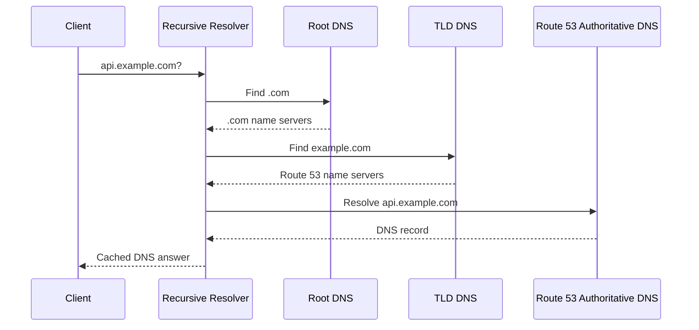
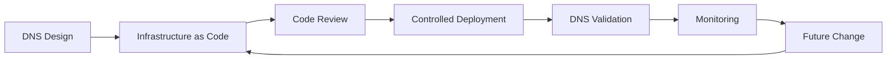

# 03- Hosted Zones

## Overview

A Route 53 hosted zone is the authoritative DNS container for a domain or subdomain. It stores the DNS records that Route 53 uses to answer queries for that namespace.

For a production backend system, understanding hosted zones is more important than simply knowing how to create one. Hosted zones define the **administrative and authoritative boundary** for DNS records and determine how public or private names are resolved.

A typical public architecture looks like:

```text
                    Domain Registrar
                           │
                           │ NS delegation
                           ▼
                  Route 53 Public
                    Hosted Zone
                           │
              ┌────────────┼────────────┐
              ▼            ▼            ▼
         api.example.com  www.example.com  mail.example.com
              │
              ▼
       Application Load Balancer
              │
              ▼
       Backend Services
```

A private architecture can use a private hosted zone:

```text
                         VPC
                          │
                ┌─────────┴─────────┐
                │                   │
                ▼                   ▼
        Private Hosted Zone    Internal Services
        internal.example.com
                │
        ┌───────┼────────┐
        ▼       ▼        ▼
      orders  payments  users
```

The key distinction is:

> A hosted zone contains authoritative DNS data; it is not the same thing as a registered domain.

---

## Hosted Zone vs Domain Registration

These concepts are frequently confused.

| Concept | Responsibility |
|---|---|
| Domain registration | Establishes ownership/control of a domain name |
| Hosted zone | Stores authoritative DNS records for a DNS namespace |
| DNS record | Defines behavior for an individual name |
| Name server | Serves authoritative DNS responses |
| Recursive resolver | Finds and caches DNS answers for clients |

For example:

```text
Domain:
example.com

Hosted Zone:
example.com

Records:
api.example.com
www.example.com
mail.example.com
```

You can register a domain with one provider and host its DNS with another provider.

For example:

```text
Domain Registrar
      │
      │ NS delegation
      ▼
Route 53 Hosted Zone
      │
      ├── api.example.com
      ├── www.example.com
      └── mail.example.com
```

The registrar does not need to be Route 53 for Route 53 to be the authoritative DNS provider.

---

## Why Hosted Zones Exist

A hosted zone establishes an authoritative boundary for DNS data.

Without a hosted-zone concept, DNS records would not have a clear administrative scope.

For example:

```text
example.com
├── api.example.com
├── www.example.com
├── staging.example.com
└── mail.example.com
```

A hosted zone can manage these records as a single DNS namespace.

Hosted zones also allow organizations to divide responsibility.

For example:

```text
example.com
│
├── Public Hosted Zone
│   ├── www.example.com
│   └── api.example.com
│
└── Private Hosted Zone
    └── internal.example.com
        ├── orders.internal.example.com
        └── payments.internal.example.com
```

This separation is useful for security, operational ownership, and environment design.

---

## Types of Route 53 Hosted Zones

Route 53 primarily uses two hosted-zone models:

| Hosted Zone | Resolution Scope | Typical Use |
|---|---|---|
| Public hosted zone | Internet | Public websites and APIs |
| Private hosted zone | Associated VPCs | Internal services and infrastructure |

The most important difference is **who can resolve the DNS namespace**.

### Public Hosted Zone

A public hosted zone contains DNS records that can be queried through the public DNS system.

Typical examples:

```text
example.com
api.example.com
www.example.com
```

Use a public hosted zone when external clients need to resolve the service.

Typical architecture:

```text
Internet
   │
   ▼
Public DNS
   │
   ▼
Route 53 Public Hosted Zone
   │
   ▼
ALB / CloudFront
   │
   ▼
Backend
```

### Private Hosted Zone

A private hosted zone is associated with one or more VPCs and is used for private DNS resolution.

Example:

```text
orders.internal.example.com
payments.internal.example.com
```

These names can resolve within associated VPC networking environments without being exposed as public DNS records.

Typical architecture:

```text
VPC
 │
 ├── ECS
 │    └── orders service
 │
 ├── EKS
 │    └── payments service
 │
 └── Private Route 53 Hosted Zone
      └── internal.example.com
```

Private hosted zones are useful for:

- Internal APIs
- Microservices
- Internal load balancers
- Database endpoints
- Private infrastructure
- Environment-specific service names

---

## Public Hosted Zone Request Flow

When a client resolves a name managed by a public Route 53 hosted zone, the high-level flow is:



The resolver may skip some or all upstream queries when cached data is available.

The important architectural point is that Route 53 is acting as the **authoritative DNS provider**.

---

## Private Hosted Zone Resolution Flow

Private DNS behaves differently because the namespace is associated with VPCs.

Conceptually:


For example:

```text
orders.internal.example.com
              │
              ▼
        VPC DNS Resolver
              │
              ▼
     Private Hosted Zone
              │
              ▼
       Internal ALB
```

The application does not need a public DNS path to resolve the private name.

This is useful for keeping service discovery and internal infrastructure private.

---

## Hosted Zone Authority

A hosted zone is authoritative for the DNS namespace it represents.

For example:

```text
example.com
```

can contain:

```text
api.example.com
www.example.com
```

The hosted zone does not automatically control unrelated names such as:

```text
example.net
other-company.com
```

Authority is based on DNS hierarchy and delegation.

This becomes particularly important when subdomains are delegated.

---

## Zone Apex

The zone apex is the root name of the hosted zone.

For:

```text
example.com
```

the apex is:

```text
example.com
```

The apex is sometimes called the root of the zone.

Records at the apex behave differently from records below it because the zone apex must contain mandatory DNS records such as:

```text
NS
SOA
```

This is one reason traditional CNAME behavior cannot simply be applied to the zone apex.

In Route 53, alias records provide an AWS-specific mechanism for routing supported apex names to supported AWS resources.

For example:

```text
example.com
     │
     │ Alias
     ▼
Application Load Balancer
```

---

## Hosted Zone Records

A hosted zone can contain many DNS record types.

Example:

| Name | Type | Purpose |
|---|---|---|
| `example.com` | `A` / Alias | Public application endpoint |
| `api.example.com` | `A` / Alias | API endpoint |
| `www.example.com` | `CNAME` | Website alias |
| `example.com` | `MX` | Mail routing |
| `example.com` | `TXT` | Domain verification |
| `example.com` | `CAA` | Certificate issuance restrictions |

A record belongs to a specific hosted zone, but the same DNS name can exist in different public and private DNS contexts.

---

## Public and Private Hosted Zones With the Same Name

A production AWS architecture may intentionally use the same domain name in public and private contexts.

For example:

```text
Public Hosted Zone
example.com
└── api.example.com
    └── Public ALB

Private Hosted Zone
example.com
└── api.example.com
    └── Internal ALB
```

This can allow internal clients to resolve the same hostname to a private endpoint while external clients resolve it publicly.

This pattern is commonly associated with split-horizon DNS.

However, it increases operational complexity and should be used deliberately.

Teams must understand:

- Which VPCs are associated with the private zone
- Which clients use the private resolver
- Which record is returned in each context
- How failover behaves
- How DNS changes are tested

---

## Split-Horizon DNS

Split-horizon DNS means the same DNS name can return different answers depending on the resolver context.

Example:

```text
api.example.com
       │
       ├── Internet client
       │       │
       │       ▼
       │   Public ALB
       │
       └── Internal VPC client
               │
               ▼
          Internal ALB
```

This is useful when internal traffic should remain inside AWS networking infrastructure.

Benefits include:

- Reduced public exposure
- Private network paths
- Different internal/external endpoints
- Simplified application configuration

The main limitation is operational complexity.

A DNS incident can become difficult to diagnose if engineers test from the wrong network context.

---

## Subdomain Delegation

A parent zone can delegate a subdomain to another authoritative DNS service.

For example:

```text
example.com
     │
     │ delegation
     ▼
prod.example.com
```

The parent zone can contain NS records pointing the child namespace toward different authoritative name servers.

This allows different teams or systems to manage:

```text
prod.example.com
```

independently from:

```text
example.com
```

### Example Architecture

```text
example.com
│
├── www.example.com
├── api.example.com
│
└── prod.example.com
       │
       ├── api.prod.example.com
       ├── worker.prod.example.com
       └── db.prod.example.com
```

Subdomain delegation is useful for:

- Organizational boundaries
- Separate AWS accounts
- Environment ownership
- Business-unit separation
- Migration between DNS providers

---

## Cross-Account Private Hosted Zones

Private hosted zones can be used across AWS accounts by associating them with VPCs outside the account that owns the hosted zone.

This is useful in multi-account architectures.

For example:

```text
DNS Account
    │
    └── Private Hosted Zone
            │
            ├── VPC in Production Account
            ├── VPC in Staging Account
            └── VPC in Shared Services Account
```

A common enterprise model is:

```text
AWS Organization
│
├── Networking / Shared Services Account
│      └── Central DNS
│
├── Production Account
│      └── Application VPC
│
├── Staging Account
│      └── Application VPC
│
└── Development Account
       └── Application VPC
```

Centralized DNS can simplify governance, but it creates an important dependency on the networking/shared-services ownership model.

---

## VPC Association

Private hosted zones must be associated with the VPCs from which they should be resolvable.

Conceptually:

```text
Private Hosted Zone
        │
        ├── VPC A
        ├── VPC B
        └── VPC C
```

If an application runs in a VPC that is not associated with the relevant private hosted zone, the expected private DNS name may not resolve.

This is a common troubleshooting issue in multi-VPC architectures.

---

## Private DNS and VPC DNS Settings

Private DNS depends on VPC DNS functionality being configured correctly.

Important VPC DNS settings include:

- DNS resolution
- DNS hostnames

If these capabilities are disabled or incorrectly configured, applications may experience DNS resolution failures even though the hosted zone itself is correct.

A useful troubleshooting hierarchy is:

```text
Application
   │
   ▼
DNS configuration
   │
   ▼
VPC DNS settings
   │
   ▼
Hosted zone association
   │
   ▼
DNS record
   │
   ▼
Target resource
```

Do not assume that a correct Route 53 record guarantees successful resolution from every network.

---

## Hosted Zone and Infrastructure as Code

Production hosted zones should generally be managed through Infrastructure as Code.

Common choices include:

- Terraform
- AWS CloudFormation
- AWS CDK

A simplified Terraform example:

```hcl
resource "aws_route53_zone" "public" {
  name = "example.com"
}

resource "aws_route53_record" "api" {
  zone_id = aws_route53_zone.public.zone_id
  name    = "api.example.com"
  type    = "A"

  alias {
    name                   = aws_lb.api.dns_name
    zone_id                = aws_lb.api.zone_id
    evaluate_target_health = true
  }
}
```

The important production principle is to make DNS configuration:

- Reviewable
- Version-controlled
- Reproducible
- Auditable
- Deployable through CI/CD

Avoid manually modifying production DNS when the same resources are managed by IaC.

---

## Hosted Zone Lifecycle

A production hosted zone should have a controlled lifecycle.



A DNS change should normally follow the same engineering controls as other production infrastructure.

For high-risk changes:

1. Validate the intended records.
2. Check delegation.
3. Review TTL implications.
4. Apply through controlled deployment.
5. Verify authoritative answers.
6. Verify recursive resolution.
7. Verify application connectivity.
8. Monitor after deployment.

---

## Hosted Zone Migration

Migrating DNS between providers requires careful planning because authority is controlled by delegation.

A typical migration is:

```text
Current DNS Provider
        │
        │ Existing NS delegation
        ▼
     Domain

Prepare new Route 53 hosted zone
        │
        ▼
Replicate DNS records
        │
        ▼
Validate new authoritative answers
        │
        ▼
Update domain NS delegation
        │
        ▼
Resolvers gradually use new authority
```

The most dangerous mistake is changing delegation before the new hosted zone contains the required records.

A safer migration sequence is:

1. Create the new hosted zone.
2. Recreate required DNS records.
3. Validate the new authoritative name servers directly.
4. Confirm critical records exist.
5. Reduce TTLs where appropriate before the migration.
6. Update the parent-domain delegation.
7. Monitor resolution from multiple networks.
8. Keep the old DNS provider available during the transition.

---

## Hosted Zone Deletion Risks

Deleting a hosted zone can remove the DNS records contained within it.

This can cause production outages if the zone is authoritative for active services.

Potential impact includes:

- API resolution failures
- Website failures
- Email delivery problems
- Certificate validation issues
- Domain verification failures
- Internal service discovery failures

DNS infrastructure should therefore have stronger change controls than its apparent simplicity suggests.

A production DNS deletion should require:

- Ownership verification
- Dependency analysis
- Change approval
- IaC review
- Backup/export where appropriate
- Post-change validation

---

## Hosted Zone Security

DNS administration should follow least privilege.

Applications normally do not need permission to modify Route 53 hosted zones.

A deployment role may require narrowly scoped permissions such as:

```text
route53:ChangeResourceRecordSets
route53:ListResourceRecordSets
route53:GetHostedZone
```

Permissions should be scoped to the required hosted zones wherever possible.

Avoid giving broad administrative access merely because DNS changes are operationally convenient.

### Security Boundaries

Separate responsibilities where practical:

```text
Application Team
    │
    └── Deploy application

Platform / Networking Team
    │
    └── Manage DNS infrastructure

Security Team
    │
    └── Audit DNS and certificate controls
```

The exact ownership model depends on organizational scale, but the principle is consistent: DNS is infrastructure and should be treated as a production security boundary.

---

## Hosted Zone Reliability

Route 53 public hosted zones use multiple authoritative name servers.

The production engineer should still protect against configuration-level failures.

Reliability practices include:

- Multiple authoritative name servers through the managed service
- IaC-managed records
- Change review
- DNS monitoring
- Domain expiration monitoring
- Delegation validation
- Tested recovery procedures
- Controlled TTLs
- Health checks where appropriate

The major DNS reliability risk is often not authoritative server availability but **incorrect configuration or delegation**.

---

## Monitoring Hosted Zones

Monitoring should cover both infrastructure configuration and DNS behavior.

Useful checks include:

| Check | Purpose |
|---|---|
| Authoritative query | Confirms Route 53 data |
| Recursive query | Confirms real client resolution |
| NS lookup | Confirms delegation |
| Record existence | Detects missing records |
| TTL | Validates caching behavior |
| Health check | Validates service availability |
| Application endpoint | Confirms end-to-end behavior |

For critical APIs, synthetic checks should validate the complete path:

```text
DNS resolution
      │
      ▼
TCP
      │
      ▼
TLS
      │
      ▼
HTTP
      │
      ▼
Application health
```

Monitoring only Route 53 configuration is insufficient.

---

## Troubleshooting Hosted Zone Problems

When DNS behaves unexpectedly, isolate the failure.

### Check the Hosted Zone

Verify:

- Zone name
- Public/private type
- Expected records
- Record types
- Record values
- TTL
- Routing policy

### Check Delegation

For a public domain:

```bash
dig NS example.com
```

Compare the returned name servers with the Route 53 hosted zone.

### Query an Authoritative Server

```bash
dig @<authoritative-name-server> api.example.com
```

This separates authoritative configuration problems from recursive-cache problems.

### Query a Recursive Resolver

```bash
dig @8.8.8.8 api.example.com
```

Compare the result with the authoritative response.

### Check From Inside the VPC

For private DNS, test from an associated VPC:

```bash
dig api.internal.example.com
```

If private resolution fails, investigate:

- VPC association
- VPC DNS settings
- Resolver configuration
- Private hosted zone records
- Overlapping namespaces

---

## Common Hosted Zone Mistakes

### Creating the Wrong Hosted Zone

A common error is creating a second hosted zone for the same domain and assuming Route 53 will automatically use it.

For example:

```text
Hosted Zone A
example.com
```

and:

```text
Hosted Zone B
example.com
```

can both exist.

The authoritative zone used publicly depends on the domain's delegation.

Always identify which hosted zone is actually authoritative before modifying DNS.

### Forgetting Name Server Delegation

Creating a hosted zone does not automatically make it authoritative for a domain registered elsewhere.

The parent domain must delegate authority to the hosted zone's name servers.

### Confusing Public and Private Hosted Zones

A private hosted zone does not become publicly resolvable simply because it has a familiar domain name.

The resolution context matters.

### Assuming Private Hosted Zones Work Everywhere

Private hosted zones are associated with VPCs.

A workload in an unrelated VPC may not resolve the name unless the DNS architecture provides the required connectivity and resolution path.

### Mixing Manual and IaC Changes

If Terraform owns the hosted zone and an engineer manually changes records, the next deployment can overwrite the manual change.

Use one authoritative configuration path.

### Ignoring Duplicate Namespaces

Multiple private hosted zones and overlapping DNS namespaces can create confusing resolution behavior.

Design namespace ownership explicitly.

---

## Production Design Patterns

### Centralized DNS Account

Large AWS organizations may centralize DNS management.

```text
                Shared DNS Account
                       │
               Private Hosted Zones
                       │
          ┌────────────┼────────────┐
          ▼            ▼            ▼
       Prod VPC     Stage VPC     Dev VPC
```

Advantages:

- Central governance
- Consistent naming
- Easier auditing
- Centralized ownership

Limitations:

- Cross-account dependencies
- More complex IAM
- Central operational ownership
- Potential blast radius from incorrect DNS changes

### Environment-Specific Subdomains

A simpler model is:

```text
example.com
├── prod.example.com
├── staging.example.com
└── dev.example.com
```

This can make environment ownership clearer.

### Internal Namespace

For private services:

```text
internal.example.com
├── orders.internal.example.com
├── payments.internal.example.com
└── users.internal.example.com
```

This clearly separates internal service discovery from public endpoints.

---

## Hosted Zone Cost Considerations

Hosted zones have associated Route 53 charges, and DNS queries can also incur costs depending on configuration and usage.

Cost optimization should not be based on removing necessary hosted zones.

Instead:

- Avoid unnecessary duplicate zones.
- Remove unused hosted zones.
- Consolidate zones when operationally appropriate.
- Avoid unnecessarily aggressive DNS query patterns.
- Use sensible TTLs.
- Review health-check usage.
- Monitor DNS query volume.

Cost decisions should not compromise DNS isolation or reliability.

---

## Disaster Recovery Considerations

DNS can be part of application disaster recovery.

For example:

```text
                 Route 53
                    │
          ┌─────────┴─────────┐
          ▼                   ▼
      Region A             Region B
          │                   │
       ALB A                ALB B
          │                   │
      App Stack A          App Stack B
```

Route 53 routing policies can help direct clients toward healthy endpoints.

However, DNS failover has limitations:

- Existing DNS caches may continue using old answers.
- Client behavior varies.
- Long-lived connections are not redirected by DNS.
- DNS health checks do not automatically prove full application correctness.
- Failover logic must be tested.

A mature disaster-recovery design therefore combines DNS with:

- Application health checks
- Load balancer health
- Database replication
- Data recovery
- Infrastructure automation
- Regional capacity
- Operational runbooks

DNS is one part of disaster recovery, not the complete mechanism.

---

## Interview Questions

### What is a Route 53 hosted zone?

A hosted zone is a container for DNS records that defines the authoritative DNS configuration for a domain or subdomain.

### What is the difference between a public and private hosted zone?

A public hosted zone serves DNS data through the public DNS system. A private hosted zone provides DNS resolution within associated VPC networking environments.

### Does creating a Route 53 hosted zone automatically make Route 53 authoritative?

Not necessarily. For public DNS, the domain must be delegated to the hosted zone's Route 53 name servers.

### Can you have multiple hosted zones with the same domain name?

Yes. Route 53 can contain multiple hosted zones with the same name. The relevant authoritative configuration depends on delegation and, for private zones, VPC association and DNS resolution context.

### What happens if I create a Route 53 hosted zone but do not update the domain's NS records?

If the domain is using another DNS provider's authoritative name servers, the new Route 53 hosted zone may not receive public DNS queries.

### Why use a private hosted zone?

To provide internal DNS names that should resolve within private AWS networking environments without exposing those names through public DNS.

### What is split-horizon DNS?

It is a design where the same DNS name can return different answers depending on whether the query comes from an internal or external resolution context.

### Can a private hosted zone be associated with multiple VPCs?

Yes. This is useful when multiple VPCs need access to the same internal DNS namespace, including appropriate cross-account designs.

### Why is hosted-zone delegation important during DNS migration?

Delegation determines which authoritative DNS infrastructure answers public queries. The new hosted zone must be fully prepared before traffic is delegated to it.

### What is the biggest operational risk with Route 53 hosted zones?

Configuration and delegation errors. The managed DNS service can be highly available while an incorrect record, missing delegation, or accidental zone deletion still causes an outage.

---

## Key Takeaways

- A Route 53 hosted zone is an authoritative container for DNS records.
- A hosted zone and a registered domain are separate concepts.
- Public hosted zones provide DNS authority for publicly resolvable names.
- Private hosted zones provide DNS resolution within associated VPC environments.
- Creating a public hosted zone does not automatically make it authoritative; delegation must point the domain to the hosted zone's name servers.
- Multiple hosted zones with the same name can exist, so engineers must identify which zone is actually authoritative.
- The zone apex has special DNS requirements because it contains records such as `NS` and `SOA`.
- Alias records provide an important Route 53 mechanism for routing supported names, including zone-apex names, to supported AWS resources.
- Private hosted zones depend on VPC association and appropriate VPC DNS configuration.
- Split-horizon DNS can provide different internal and external answers for the same hostname.
- Subdomain delegation allows separate teams, accounts, or DNS providers to manage child namespaces.
- Cross-account private DNS is useful in multi-account AWS architectures but introduces additional IAM and operational dependencies.
- Production DNS should be managed through Infrastructure as Code and controlled CI/CD workflows.
- DNS migrations should validate the new authoritative zone before changing delegation.
- DNS monitoring should test authoritative answers, recursive resolution, delegation, and application-level behavior.
- The largest production DNS risks are usually configuration, delegation, namespace, and change-management errors rather than Route 53 service availability.
- DNS should be treated as critical production infrastructure with strong security, auditability, reliability, and disaster-recovery practices.