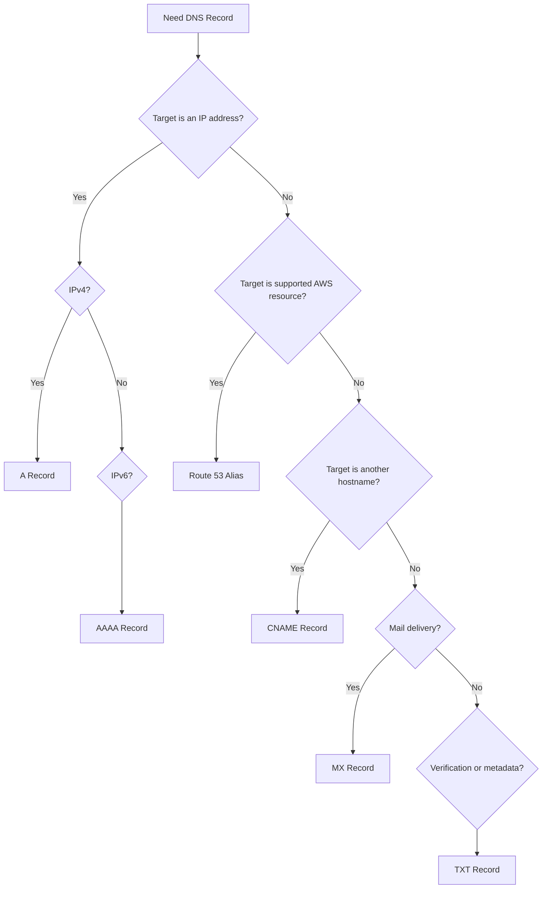

# 04- DNS Record Types

## Overview

DNS records define how a DNS name behaves. In Route 53, records are stored inside hosted zones and determine whether a name resolves to an IP address, another hostname, a mail server, a verification value, or an AWS resource.

For backend engineers, DNS records are operational infrastructure rather than merely configuration. A single incorrect record can make an API unreachable, redirect traffic to the wrong environment, break email delivery, invalidate domain verification, or interfere with service discovery.

A typical production application may use several record types simultaneously:

```text
example.com
│
├── A / Alias ───────► CloudFront / ALB
├── AAAA / Alias ────► CloudFront / ALB
├── CNAME ───────────► external.example.net
├── MX ──────────────► mail.example.com
├── TXT ─────────────► SPF / verification data
├── CAA ─────────────► Certificate authority policy
└── NS ──────────────► Delegated DNS namespace
```

The most important distinction is between:

- **Address records** — map names to IP addresses.
- **Alias records** — Route 53-specific routing to supported AWS resources.
- **Canonical-name records** — map one DNS name to another DNS name.
- **Mail records** — define mail delivery.
- **Metadata and policy records** — provide verification, security, or delegation information.

---

## DNS Record Anatomy

A DNS record generally contains:

| Component | Purpose |
|---|---|
| Name | DNS name represented by the record |
| Type | Record type such as `A`, `AAAA`, `CNAME`, `MX`, or `TXT` |
| Value | Data returned by DNS |
| TTL | How long recursive resolvers may cache the response |
| Routing policy | How Route 53 selects an answer when multiple records exist |
| Health evaluation | Optional health-based routing behavior |

Example:

```text
Name:     api.example.com
Type:     A
Value:    203.0.113.20
TTL:      60
```

A DNS resolver may cache this result for the configured TTL.

The operational consequence is important:

> Changing a DNS record does not guarantee that every client immediately observes the new value.

Existing recursive caches may continue serving the previous answer until the TTL expires.

---

## Record Type Selection

A practical decision process is:



This is only a starting point. Production designs also need to consider the zone apex, routing policies, health checks, DNSSEC, and the capabilities of the target service.

---

## A Records

An `A` record maps a DNS name to an IPv4 address.

Example:

```text
api.example.com → 203.0.113.10
```

Example CLI query:

```bash
dig A api.example.com
```

Example response:

```text
api.example.com. 60 IN A 203.0.113.10
```

### When to Use

Use an `A` record when the DNS answer should contain an IPv4 address.

Typical examples include:

- Static public IPs
- Dedicated infrastructure
- Network appliances
- External services exposing fixed IPv4 addresses

### Production Considerations

Avoid pointing production application names directly at individual EC2 instance IPs unless there is a specific architectural reason.

For scalable applications, prefer:

```text
api.example.com
       │
       ▼
Application Load Balancer
       │
       ▼
Application instances
```

rather than:

```text
api.example.com
       │
       ▼
Single EC2 instance
```

A load balancer provides a more stable abstraction over changing backend instances.

---

## AAAA Records

An `AAAA` record maps a DNS name to an IPv6 address.

Example:

```text
api.example.com → 2001:db8::10
```

Query:

```bash
dig AAAA api.example.com
```

IPv6 support matters when clients operate on IPv6-only or dual-stack networks.

For production systems, decide deliberately whether the service should support:

- IPv4 only
- IPv6 only
- Dual stack

Do not publish IPv6 records unless the complete application path supports IPv6 correctly.

This includes:

- Load balancers
- Network security controls
- Application listeners
- Firewalls
- Upstream dependencies
- Monitoring
- Logging
- Client behavior

---

## CNAME Records

A `CNAME` record maps one DNS name to another DNS name.

Example:

```text
www.example.com → application.example.net
```

The resolver follows the target hostname to obtain the final address.

Example:

```bash
dig CNAME www.example.com
```

### When to Use

CNAME records are useful when:

- An external provider gives you a hostname.
- One application hostname should follow another hostname.
- A service endpoint is represented by a stable DNS name rather than an IP.

Example:

```text
api.example.com
       │
       ▼
api.vendor.example.net
       │
       ▼
203.0.113.20
```

### Important Limitation

A CNAME cannot generally coexist with other record data at the same DNS name, and it cannot be used at the zone apex in normal DNS.

For example, this is problematic:

```text
example.com CNAME another.example.net
example.com MX ...
example.com TXT ...
```

The zone apex also requires records such as `NS` and `SOA`.

For AWS resources, Route 53 alias records are often the appropriate alternative.

---

## Alias Records

An alias is a Route 53-specific mechanism that maps a DNS name to supported AWS resources or selected Route 53 endpoints.

Common targets include:

- Application Load Balancers
- Network Load Balancers
- CloudFront distributions
- API Gateway endpoints
- S3 website endpoints
- Route 53 resources supported by the alias feature

Example:

```text
api.example.com
       │
       │ Alias
       ▼
Application Load Balancer
```

Alias records are especially important because they can be used at the zone apex.

Example:

```text
example.com
     │
     │ Alias
     ▼
CloudFront distribution
```

### Alias vs CNAME

| Feature | Alias | CNAME |
|---|---|---|
| Route 53 specific | Yes | No |
| Points to hostname | AWS resource-aware | DNS hostname |
| Zone apex | Supported for supported targets | Not normally allowed |
| AWS resource integration | Strong | Generic |
| Health evaluation | Supported for applicable configurations | Not equivalent |
| DNS standard record | No, Route 53 feature | Yes |

An alias does not behave exactly like a traditional CNAME internally. Route 53 can use knowledge of the AWS target to return the appropriate DNS answer.

### Production Example

For a FastAPI or Django application behind an ALB:

```text
api.example.com
       │
       ▼
Route 53 Alias
       │
       ▼
ALB
       │
       ▼
ECS / EKS / EC2
       │
       ▼
Application
```

This avoids coupling the public DNS name to individual backend instances.

---

## Alias vs A Record

An alias and an `A` record are not interchangeable.

An `A` record contains an IPv4 address:

```text
api.example.com → 203.0.113.10
```

An alias can point to an AWS resource:

```text
api.example.com → ALB
```

If the AWS resource changes its underlying IP addresses, Route 53 can continue resolving the alias to the current target infrastructure.

This is one reason aliases are preferable to manually tracking AWS service IP addresses.

---

## MX Records

`MX` records define mail-exchange servers for a domain.

Example:

```text
example.com
    │
    ▼
MX
    │
    ├── 10 mail1.example.com
    └── 20 mail2.example.com
```

The numeric value is the **priority**. Lower values represent higher preference.

Example:

```text
example.com. 300 IN MX 10 mail1.example.com.
example.com. 300 IN MX 20 mail2.example.com.
```

Mail systems generally attempt the lower-priority value first.

### Production Considerations

When configuring email infrastructure, MX records are only one part of the DNS configuration.

Modern email deployments may also require:

- SPF
- DKIM
- DMARC
- Verification TXT records

A common mistake is assuming that adding an MX record is sufficient to make email secure and reliable.

---

## TXT Records

`TXT` records store arbitrary text data associated with a DNS name.

They are commonly used for:

- Domain verification
- SPF policies
- Email configuration
- Certificate validation
- Third-party service verification

Example:

```text
example.com TXT "v=spf1 include:example-mail-provider.com ~all"
```

Another example is certificate validation:

```text
_acme-challenge.example.com
```

with a provider-generated TXT value.

### Production Considerations

TXT records are frequently modified by automation.

Do not manually overwrite an existing TXT record when a provider requires adding another value to the same DNS name.

Before changing TXT records, inspect the existing configuration:

```bash
dig TXT example.com
```

This is especially important for domains using multiple verification mechanisms.

---

## CAA Records

`CAA` records restrict which certificate authorities are allowed to issue certificates for a domain.

Example:

```text
example.com CAA 0 issue "amazon.com"
```

A CAA policy can reduce the risk of unauthorized certificate issuance through an unintended certificate authority.

A production organization may deliberately restrict certificate issuance to its approved CA ecosystem.

### Why CAA Matters

Without appropriate certificate issuance controls, a compromised DNS or account workflow could potentially create opportunities for unauthorized certificate issuance.

CAA is therefore part of the domain's security posture.

### Operational Consideration

Before adding restrictive CAA records, verify all legitimate certificate authorities used by:

- AWS Certificate Manager
- External certificate providers
- CDN providers
- Security tooling
- Internal PKI workflows

An overly restrictive CAA policy can break certificate issuance.

---

## NS Records

`NS` records identify authoritative name servers for a DNS zone.

For a Route 53 hosted zone, Route 53 provides a set of authoritative name servers.

Conceptually:

```text
example.com
     │
     ▼
NS records
     │
     ├── ns-xxx.awsdns-xx.com
     ├── ns-xxx.awsdns-xx.net
     ├── ns-xxx.awsdns-xx.org
     └── ns-xxx.awsdns-xx.co.uk
```

The parent DNS infrastructure uses delegation to direct queries for the zone toward these authoritative servers.

### Why NS Records Matter

If delegation points to the wrong name servers, the correct records inside your Route 53 hosted zone may never be used by public resolvers.

This creates a common troubleshooting scenario:

```text
Route 53 record is correct
        │
        ▼
But domain delegation is wrong
        │
        ▼
Public clients receive incorrect answers
```

Check delegation with:

```bash
dig NS example.com
```

---

## SOA Records

`SOA` stands for **Start of Authority**.

The SOA record contains authoritative metadata for the DNS zone.

It includes information such as:

- Primary name server
- Responsible party
- Serial number
- Refresh information
- Retry information
- Expiration information
- Negative caching-related parameters

Example:

```bash
dig SOA example.com
```

The SOA record is generally managed by the DNS service rather than manually designed as an application record.

For Route 53 users, understanding what the SOA represents is more important than manually manipulating its values.

---

## PTR Records

A `PTR` record performs reverse DNS mapping:

```text
IP address → hostname
```

Normal DNS performs:

```text
hostname → IP address
```

Reverse DNS performs:

```text
IP address → hostname
```

Example:

```text
203.0.113.10 → mail.example.com
```

Reverse DNS is especially relevant for:

- Email infrastructure
- Network diagnostics
- Security systems
- Logging
- Infrastructure requiring hostname verification

Reverse DNS uses the special `in-addr.arpa` namespace for IPv4.

For IPv6, reverse DNS uses `ip6.arpa`.

---

## SRV Records

`SRV` records describe the location of services.

They can contain:

- Priority
- Weight
- Port
- Target hostname

Conceptually:

```text
_service._protocol.example.com
```

Example:

```text
_sip._tcp.example.com
```

SRV records are useful for systems that need DNS-based service location.

They are less common in typical REST API architectures, where service discovery is often handled through:

- Kubernetes Services
- Internal load balancers
- Cloud Map
- Application configuration
- Service meshes

However, SRV remains important when integrating with systems that explicitly support the record type.

---

## NAPTR Records

`NAPTR` records provide more advanced service discovery and rewriting capabilities.

They are commonly associated with specialized telecommunications and service-discovery systems.

They are not typically required for standard Django, FastAPI, REST, gRPC, or conventional AWS application architectures.

The key engineering principle is to use NAPTR only when the protocol or platform specifically requires it.

---

## DNS Record Types in Backend Architecture

A production API may use multiple records together.

Example:

```text
example.com
│
├── A/AAAA Alias
│      │
│      ▼
│   CloudFront
│      │
│      ▼
│   ALB
│      │
│      ▼
│   FastAPI / Django
│
├── TXT
│      └── Domain verification
│
├── CAA
│      └── Certificate issuance policy
│
├── MX
│      └── Email provider
│
└── NS
       └── DNS delegation
```

DNS therefore becomes a shared dependency across several infrastructure systems.

---

## Record Types for Microservices

A microservices environment may use public and private DNS records differently.

```text
Public
api.example.com
       │
       ▼
Public ALB
       │
       ▼
API Gateway / Backend

Private
orders.internal.example.com
       │
       ▼
Internal ALB
       │
       ▼
Orders Service

payments.internal.example.com
       │
       ▼
Internal ALB
       │
       ▼
Payments Service
```

For example, a Python service might call:

```python
import httpx

response = httpx.get(
    "https://orders.internal.example.com/orders/123",
    timeout=5.0,
)
response.raise_for_status()
```

The application does not need to know the underlying IP addresses.

This is a key architectural benefit of DNS abstraction:

```text
Application
    │
    ▼
Stable DNS name
    │
    ▼
Changing infrastructure
```

The infrastructure can change while the application configuration remains stable.

---

## DNS Records and Kubernetes

Kubernetes usually provides its own internal DNS system, but Route 53 can still participate in external and broader AWS DNS architecture.

Typical flow:

```text
Internet
   │
   ▼
Route 53
   │
   ▼
ALB / NLB
   │
   ▼
Kubernetes
   │
   ▼
Service
   │
   ▼
Pod
```

Inside Kubernetes:

```text
service.namespace.svc.cluster.local
```

is generally resolved by CoreDNS.

Route 53 becomes relevant when:

- Exposing Kubernetes services externally
- Managing public domains
- Managing private AWS DNS
- Integrating with other AWS VPC resources
- Implementing broader multi-VPC DNS architecture

Do not replace Kubernetes service discovery with public Route 53 records simply because Route 53 is already used for the organization's public DNS.

---

## TTL and Record Types

TTL controls how long recursive resolvers may cache a DNS response.

Example:

```text
api.example.com
TTL = 60 seconds
```

A shorter TTL can make changes propagate more quickly through recursive caches, while a longer TTL can reduce repeated DNS queries.

| TTL Strategy | Advantages | Limitations |
|---|---|---|
| Very short | Faster change propagation | More DNS queries |
| Moderate | Balanced behavior | Changes are not immediate |
| Long | Lower query frequency | Slower changes and failover visibility |

Do not choose TTL purely based on a generic rule.

Consider:

- Change frequency
- Failover requirements
- Query volume
- Cost
- Application tolerance for stale DNS
- Deployment strategy

---

## Routing Policies and Record Types

Route 53 can associate routing policies with records.

Common policies include:

| Policy | Typical Use |
|---|---|
| Simple | Single endpoint |
| Weighted | Traffic distribution |
| Latency-based | Route to lower-latency region |
| Failover | Primary/secondary |
| Geolocation | Location-based routing |
| Geoproximity | Geographic traffic steering |
| Multivalue answer | Multiple healthy answers |

The DNS record type and routing policy solve different problems.

For example:

```text
A / Alias
    +
Weighted Routing
    +
Health Evaluation
```

can provide controlled traffic distribution across multiple load balancers.

Do not confuse:

> **What should the DNS answer contain?**

with:

> **Which DNS answer should Route 53 return?**

The first is primarily a record-type concern; the second is a routing-policy concern.

---

## Record Type Selection for Common Backend Systems

| Requirement | Recommended Approach |
|---|---|
| Public API behind ALB | A/AAAA Alias |
| CloudFront distribution | A/AAAA Alias |
| Static IPv4 endpoint | A |
| Static IPv6 endpoint | AAAA |
| External hostname | CNAME |
| Zone apex pointing to supported AWS resource | Alias |
| Email delivery | MX |
| Domain verification | TXT |
| Certificate issuance restriction | CAA |
| DNS delegation | NS |
| Zone authority metadata | SOA |
| Reverse DNS | PTR |
| Protocol-specific service discovery | SRV / NAPTR |

---

## Production Change Example

Suppose a production FastAPI service currently uses:

```text
api.example.com
       │
       ▼
ALB A
```

and needs to move to:

```text
api.example.com
       │
       ▼
ALB B
```

If Route 53 uses an alias record, the change is at the DNS abstraction layer rather than the application layer.

Conceptually:

```text
Before:

api.example.com
       │
       ▼
ALB A
       │
       ▼
FastAPI


After:

api.example.com
       │
       ▼
ALB B
       │
       ▼
FastAPI
```

A controlled deployment can update the DNS target while keeping the application hostname unchanged.

For larger migrations, weighted routing can provide gradual traffic movement rather than an immediate 100% cutover.

---

## AWS CLI Examples

### List Hosted Zones

```bash
aws route53 list-hosted-zones
```

### List Records

```bash
aws route53 list-resource-record-sets \
  --hosted-zone-id Z1234567890ABC
```

### Query a Specific Record

Use a DNS client rather than the AWS CLI when testing actual resolution:

```bash
dig A api.example.com
```

### Query All Common Record Types

```bash
dig ANY example.com
```

Do not rely on `ANY` queries for production diagnostics. Many DNS systems intentionally restrict or minimize responses to `ANY`.

Prefer targeted queries:

```bash
dig A api.example.com
dig AAAA api.example.com
dig CNAME www.example.com
dig MX example.com
dig TXT example.com
```

---

## Infrastructure as Code Example

A production DNS record can be managed with Terraform:

```hcl
resource "aws_route53_record" "api" {
  zone_id = aws_route53_zone.public.zone_id
  name    = "api.example.com"
  type    = "A"

  alias {
    name                   = aws_lb.api.dns_name
    zone_id                = aws_lb.api.zone_id
    evaluate_target_health = true
  }
}
```

This is preferable to manually changing production DNS because the desired state becomes:

- Version controlled
- Reviewable
- Reproducible
- Auditable
- Deployable through CI/CD

---

## Security Considerations

DNS records can expose infrastructure information and influence application traffic.

Important controls include:

- Restrict Route 53 modification permissions.
- Use least-privilege IAM roles.
- Protect CI/CD credentials.
- Review DNS changes.
- Enable logging and auditing appropriate to the environment.
- Use DNSSEC where required by the domain security model.
- Use CAA to control certificate issuance when appropriate.
- Avoid exposing private infrastructure through public records.
- Avoid embedding secrets in TXT records.

TXT records are public in public DNS.

Never treat:

```text
TXT "secret-value"
```

as a secure secret-storage mechanism.

---

## Performance and Scalability Considerations

DNS performance depends on both authoritative service behavior and recursive caching.

For backend systems:

- Use sensible TTLs.
- Avoid unnecessarily frequent DNS changes.
- Use stable DNS names for application dependencies.
- Avoid hardcoding infrastructure IPs.
- Use AWS-native alias targets where appropriate.
- Design failover with DNS caching behavior in mind.

DNS itself should not become application-level service discovery for every ephemeral workload.

For highly dynamic internal systems, dedicated service discovery mechanisms may be more appropriate.

---

## Common Mistakes

### Using CNAME at the Zone Apex

Incorrect conceptual design:

```text
example.com CNAME cloudfront.example.net
```

For supported AWS resources, use an alias record instead.

### Hardcoding EC2 IP Addresses

This couples application access to infrastructure instances.

Prefer:

```text
api.example.com
       │
       ▼
ALB
       │
       ▼
Dynamic backend
```

### Treating Alias as a Standard DNS Record

Alias is a Route 53 feature, not a standard DNS record type.

It should be understood as AWS-aware DNS routing functionality.

### Ignoring TTL During Deployments

Changing a record with a 60-second TTL does not guarantee every client changes within exactly 60 seconds.

Resolver behavior, client caching, and application DNS behavior can differ.

### Overwriting TXT Records

A domain may already have several TXT values.

Inspect existing records before replacing them.

### Publishing Unnecessary Private Infrastructure

Avoid creating public records for internal services when private DNS can satisfy the requirement.

### Assuming DNS Change Means Immediate Traffic Change

Existing connections are unaffected by DNS changes, and cached DNS responses may continue pointing clients toward the previous destination.

### Using DNS for Application-Level Failover Without Testing

DNS failover is not instantaneous and does not terminate existing TCP/TLS connections.

---

## Troubleshooting Record Problems

A disciplined troubleshooting process should move from DNS data to delegation to application behavior.

```text
Application failure
       │
       ▼
Check hostname
       │
       ▼
Query record
       │
       ▼
Check authoritative answer
       │
       ▼
Check recursive answer
       │
       ▼
Check routing policy
       │
       ▼
Check target health
       │
       ▼
Check application
```

Useful commands:

```bash
dig A api.example.com
dig AAAA api.example.com
dig CNAME www.example.com
dig MX example.com
dig TXT example.com
dig NS example.com
dig +trace api.example.com
```

`dig +trace` is particularly useful for understanding delegation and the DNS resolution chain.

---

## Interview Traps

### Is an Alias an A Record?

No.

An alias is a Route 53-specific feature that can map a DNS name to supported AWS resources. It can return address information appropriate for the target without requiring a traditional CNAME.

### Can CNAME Be Used at the Zone Apex?

Traditional DNS does not permit a CNAME at the zone apex because the apex must also contain required records such as `NS` and `SOA`.

Route 53 alias records solve many AWS zone-apex use cases.

### Does CNAME Return an IP Address?

Not directly.

A CNAME points to another DNS name, which is then resolved to obtain the final address.

### Does Route 53 Automatically Update an A Record When an ALB IP Changes?

An A record containing manually configured IP addresses does not track an ALB.

A Route 53 alias pointing to the ALB is the appropriate AWS-integrated approach.

### Does a Short TTL Guarantee Fast DNS Failover?

No.

TTL affects recursive caching, but client behavior, resolver behavior, existing connections, and other caching layers also influence how quickly traffic changes.

### Can an A Record Point to a Hostname?

No.

An `A` record contains IPv4 address data. A hostname-to-hostname mapping uses a CNAME or another appropriate DNS mechanism.

### Can Multiple A Records Exist for the Same Name?

Yes.

Multiple records can be used for DNS-based distribution, depending on the Route 53 routing policy and record configuration.

---

## Production Best Practices

1. Prefer Route 53 aliases for supported AWS resources rather than hardcoding AWS infrastructure IP addresses.
2. Use `A` and `AAAA` records when the DNS answer genuinely needs to contain IPv4 or IPv6 addresses.
3. Use CNAME for hostname-to-hostname relationships where the zone-apex restriction does not apply.
4. Treat TXT records as public data when using public DNS.
5. Use CAA deliberately when certificate issuance should be restricted.
6. Keep public and private DNS namespaces clearly separated unless split-horizon DNS is intentionally designed.
7. Manage production records through Infrastructure as Code.
8. Use version control and CI/CD for significant DNS changes.
9. Choose TTLs based on operational requirements rather than blindly using very short values.
10. Test DNS changes from both authoritative and recursive perspectives.
11. Validate delegation before diagnosing application-level DNS problems.
12. Avoid using public DNS as a replacement for private service discovery.
13. Document ownership of critical DNS records.
14. Audit DNS changes and protect Route 53 IAM permissions.
15. Test DNS-based disaster recovery before relying on it during an incident.

---

## Key Takeaways

- DNS record types define how DNS names resolve and what information DNS returns.
- `A` maps a name to an IPv4 address.
- `AAAA` maps a name to an IPv6 address.
- `CNAME` maps one hostname to another hostname.
- Route 53 aliases provide AWS-aware routing to supported resources and are especially important for zone-apex records.
- `MX` controls mail delivery.
- `TXT` is commonly used for verification and email-related policies.
- `CAA` controls which certificate authorities may issue certificates for a domain.
- `NS` records define authoritative name servers and are central to DNS delegation.
- `SOA` contains authoritative zone metadata.
- `PTR` provides reverse DNS mapping.
- `SRV` and `NAPTR` support specialized service-discovery use cases.
- TTL controls recursive caching and therefore influences how quickly DNS changes become visible.
- Record type and routing policy solve different problems: the record type describes the DNS data, while the routing policy controls how Route 53 selects among possible answers.
- For AWS backends behind ALB, CloudFront, or other supported resources, aliases generally provide a better production abstraction than hardcoded IP addresses.
- DNS changes are not instantaneous, and existing connections are unaffected by DNS changes.
- DNS records should be treated as critical production infrastructure and managed with the same review, security, automation, and observability practices as other infrastructure.