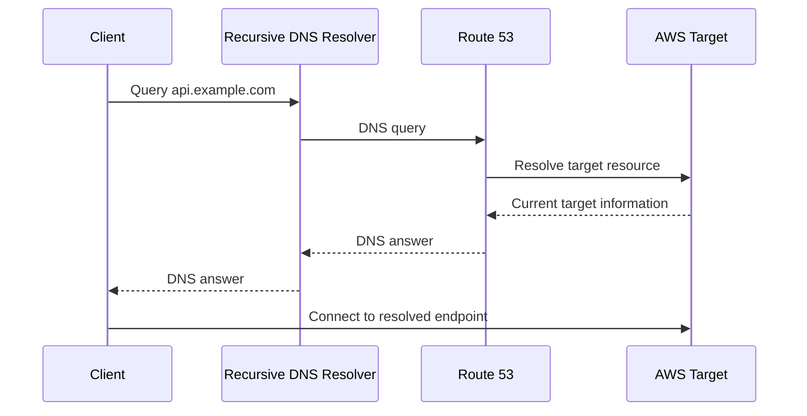

# 05- Alias Records

## Overview

Route 53 alias records provide AWS-aware DNS routing from a DNS name to supported AWS resources. They are particularly important in production architectures because they allow application hostnames to remain stable while the underlying AWS infrastructure changes.

A typical backend architecture might expose:

```text
api.example.com
       │
       ▼
Route 53 Alias
       │
       ▼
Application Load Balancer
       │
       ├── EC2
       ├── ECS
       └── EKS
```

The application and clients use `api.example.com`. They do not need to know the load balancer's changing IP addresses.

Alias records are not a standard DNS record type. They are a Route 53 capability that allows Route 53 to answer DNS queries using information about supported AWS resources.

---

## Why Alias Records Exist

Traditional DNS records operate on DNS data.

For example, an `A` record contains an IPv4 address:

```text
api.example.com → 203.0.113.10
```

A CNAME contains another hostname:

```text
api.example.com → service.example.net
```

AWS services such as Application Load Balancers and CloudFront distributions are different. Their underlying addresses can change, and AWS manages those addresses.

Hardcoding those addresses would create an operational dependency on infrastructure that the application owner does not control.

Alias records solve this by allowing Route 53 to reference the AWS resource directly:

```text
api.example.com
       │
       ▼
Alias
       │
       ▼
AWS Resource
       │
       ▼
Current DNS endpoints
```

This allows AWS infrastructure to evolve without requiring application-level DNS changes.

---

## Alias Record vs Standard DNS Record

The most important distinction is that an alias is not simply another spelling of an `A` record.

| Characteristic | A Record | CNAME | Route 53 Alias |
|---|---|---|---|
| Standard DNS record | Yes | Yes | No |
| Contains IPv4 address | Yes | No | No |
| Points to hostname | No | Yes | AWS-aware target |
| Points directly to supported AWS resource | No | Indirectly | Yes |
| Zone apex supported | Yes | No | Yes, for supported targets |
| Route 53 specific | No | No | Yes |
| AWS resource awareness | No | No | Yes |
| Can evaluate target health | Not inherently | No | Supported for applicable targets |

The key architectural difference is:

```text
A:
DNS name → IP address

CNAME:
DNS name → DNS name

Alias:
DNS name → supported AWS resource
```

---

## How Alias Resolution Works

At a high level, a client resolves an alias-backed name like this:



The exact internal implementation is AWS-managed, but the important engineering behavior is that Route 53 maintains awareness of the supported AWS target.

The client does not perform an additional DNS CNAME lookup simply because the Route 53 record is an alias.

---

## Supported Alias Targets

Route 53 supports aliases for several AWS resources and Route 53-specific endpoints.

Common production targets include:

- Amazon CloudFront distributions
- Application Load Balancers
- Network Load Balancers
- API Gateway
- Amazon S3 website endpoints
- Route 53 resources such as records configured for supported routing scenarios

The exact supported target types and restrictions can change over time, so production infrastructure should be validated against the current Route 53 documentation before implementation.

---

## Application Load Balancer Example

A common backend architecture is:

```text
                    Internet
                       │
                       ▼
              api.example.com
                       │
                       ▼
                 Route 53
                   Alias
                       │
                       ▼
             Application Load
                 Balancer
                       │
          ┌────────────┴────────────┐
          ▼                         ▼
      Backend 1                  Backend 2
       EC2/ECS                    EC2/ECS
          │                         │
          └────────────┬────────────┘
                       ▼
                 Application
```

For a Django or FastAPI application, the public hostname might be:

```text
https://api.example.com
```

The application does not need to know the ALB's IP addresses.

This provides a stable application endpoint while allowing the infrastructure behind the ALB to scale or change.

---

## CloudFront Example

A production frontend or API may use CloudFront:

```text
www.example.com
       │
       ▼
Route 53 Alias
       │
       ▼
CloudFront
       │
       ├── S3
       └── ALB
```

The domain can remain:

```text
www.example.com
```

while CloudFront manages its distributed infrastructure.

For supported configurations, an alias record is preferable to trying to manually maintain CloudFront IP addresses.

---

## Zone Apex and Alias Records

One of the most important reasons to understand aliases is the DNS zone apex.

Suppose the domain is:

```text
example.com
```

The zone apex is:

```text
example.com
```

A traditional CNAME cannot normally be used at the zone apex because the apex must also contain records such as:

```text
NS
SOA
```

Therefore, this is not a normal DNS configuration:

```text
example.com CNAME something.example.net
```

Route 53 aliases provide an AWS-specific solution for supported targets:

```text
example.com
     │
     ▼
Alias
     │
     ▼
CloudFront / ALB
```

This makes aliases especially useful for root-domain production endpoints.

---

## Alias vs CNAME at a Practical Level

Consider:

```text
api.example.com
```

If an external SaaS provider gives you:

```text
service.vendor.com
```

a CNAME is typically appropriate:

```text
api.example.com
       │
       ▼
CNAME
       │
       ▼
service.vendor.com
```

If AWS gives you an Application Load Balancer:

```text
my-alb-123456.region.elb.amazonaws.com
```

use a Route 53 alias:

```text
api.example.com
       │
       ▼
Alias
       │
       ▼
Application Load Balancer
```

The distinction is:

> Use CNAME for generic DNS hostname-to-hostname relationships; use an alias when Route 53 should directly reference a supported AWS resource.

---

## Alias Records and TTL

TTL determines how long recursive DNS resolvers may cache the response.

Alias records do not eliminate DNS caching.

For example:

```text
api.example.com
Alias → ALB
TTL → 60 seconds
```

A resolver that receives the answer may cache it for the applicable TTL.

This matters during:

- Deployments
- Traffic migrations
- Disaster recovery
- Blue/green deployments
- DNS-based failover

A DNS change is therefore not necessarily visible to every client immediately.

---

## Alias Records and Target IP Changes

Consider an ALB:

```text
api.example.com
       │
       ▼
Alias
       │
       ▼
ALB
       │
       ▼
Changing infrastructure
```

The ALB's underlying addresses can change as AWS manages the service.

If you instead attempted to manually maintain:

```text
api.example.com A 10.x.x.x
api.example.com A 10.x.x.x
```

you would be coupling DNS configuration to infrastructure details that AWS controls.

This is fragile and operationally expensive.

The alias abstraction removes that coupling.

---

## Alias Records and Health Evaluation

Route 53 aliases can be configured with target health evaluation where supported.

For example:

```text
api.example.com
       │
       ├── Alias → ALB A
       │
       └── Alias → ALB B
```

With appropriate routing configuration, Route 53 can consider target health when determining which answer should be returned.

This can be useful for:

- Multi-region deployments
- Failover architectures
- Disaster recovery
- Active/passive systems
- Traffic migration

However, DNS health-based routing should not be treated as an instantaneous failover mechanism.

DNS caching and existing connections still matter.

---

## Alias Records with Routing Policies

Alias records can participate in Route 53 routing policies.

For example:

```text
                    api.example.com
                           │
                    Route 53 Alias
                           │
                 Weighted Routing
                    /           \
                   /             \
                  ▼               ▼
               ALB A           ALB B
                90%              10%
```

This can support gradual traffic migration.

A common production pattern is:

```text
100% → Old environment

then

90%  → Old
10%  → New

then

50%  → Old
50%  → New

then

0%   → Old
100% → New
```

This is useful for blue/green deployments and controlled migrations.

The application must still be designed to tolerate traffic arriving at either environment during the transition.

---

## Alias Records for Multi-Region Architectures

A multi-region backend may use:

```text
                 api.example.com
                        │
                        ▼
                  Route 53 Alias
                        │
                Latency Routing
                   /         \
                  /           \
                 ▼             ▼
              ALB US        ALB EU
                 │             │
                 ▼             ▼
             US Backend     EU Backend
```

Route 53 can use latency-based routing to direct clients toward the region expected to provide lower network latency.

This is a DNS-level traffic management decision, not an application-level request router.

For more advanced architectures, the design should consider:

- Region health
- Data replication
- Session state
- Database topology
- Cache locality
- DNS TTL
- Failover behavior
- Client DNS caching

DNS routing alone does not create a multi-region application.

---

## Alias Records and S3

Route 53 aliases can be used with supported S3 website endpoints.

A common architecture is:

```text
www.example.com
       │
       ▼
Route 53 Alias
       │
       ▼
CloudFront
       │
       ▼
S3
```

For production static websites, CloudFront is often used in front of S3 for caching, TLS, security controls, and global delivery.

Do not confuse:

- S3 REST endpoints
- S3 website endpoints
- CloudFront distributions

They have different DNS and access characteristics.

---

## Alias Records and API Gateway

A custom API domain can use Route 53 with API Gateway.

Conceptually:

```text
api.example.com
       │
       ▼
Route 53 Alias
       │
       ▼
API Gateway
       │
       ▼
Lambda / Backend
```

This allows backend clients to use a stable organization-owned domain rather than an AWS-generated service hostname.

For example:

```text
https://api.example.com/users
```

can remain stable even if the underlying backend implementation changes.

---

## Alias Records and Backend Architecture

Aliases are most valuable when DNS should represent an infrastructure abstraction rather than an individual machine.

Avoid:

```text
api.example.com
       │
       ▼
EC2 instance IP
```

Prefer:

```text
api.example.com
       │
       ▼
Route 53 Alias
       │
       ▼
Load Balancer
       │
       ▼
Compute Layer
```

This architecture allows:

- Horizontal scaling
- Instance replacement
- Container replacement
- Rolling deployments
- Auto Scaling
- Kubernetes node replacement
- Backend migration

without changing the public application hostname.

---

## Alias Records with Kubernetes

A typical EKS architecture might be:

```text
Internet
   │
   ▼
Route 53
   │
   ▼
Alias
   │
   ▼
AWS Load Balancer
   │
   ▼
Kubernetes Service
   │
   ▼
Pods
```

The Route 53 record should normally target the AWS load-balancing abstraction rather than individual Kubernetes pods.

Pods are ephemeral.

A production DNS architecture should not expose pod IP addresses as public application endpoints.

---

## Infrastructure as Code

Production DNS should generally be managed through Infrastructure as Code.

Terraform example:

```hcl
resource "aws_route53_record" "api" {
  zone_id = aws_route53_zone.public.zone_id
  name    = "api.example.com"
  type    = "A"

  alias {
    name                   = aws_lb.api.dns_name
    zone_id                = aws_lb.api.zone_id
    evaluate_target_health = true
  }
}
```

The important design characteristics are:

- DNS configuration is version controlled.
- Changes are reviewed.
- Infrastructure can be recreated.
- CI/CD can validate changes.
- Production modifications are auditable.

A common workflow is:

```text
Developer
    │
    ▼
Git commit
    │
    ▼
Pull Request
    │
    ▼
Terraform plan
    │
    ▼
Review
    │
    ▼
Terraform apply
    │
    ▼
Route 53
```

---

## AWS CLI and DNS Verification

List hosted zones:

```bash
aws route53 list-hosted-zones
```

List records:

```bash
aws route53 list-resource-record-sets \
  --hosted-zone-id Z1234567890ABC
```

Inspect the actual DNS response:

```bash
dig A api.example.com
```

For alias-backed endpoints, verify both the DNS response and the target service.

Useful commands include:

```bash
dig A api.example.com
dig AAAA api.example.com
dig +trace api.example.com
```

For HTTPS endpoints:

```bash
curl -I https://api.example.com
```

DNS resolution and application reachability are separate checks.

---

## Production Change Strategy

Suppose an existing service is:

```text
api.example.com
       │
       ▼
ALB-A
```

and the new environment is:

```text
ALB-B
```

A simple cutover can update the alias:

```text
Before:

api.example.com → ALB-A


After:

api.example.com → ALB-B
```

For a critical production migration, weighted routing may be safer:

```text
api.example.com
       │
       ▼
Weighted Alias
       │
       ├── 95% → ALB-A
       └── 5%  → ALB-B
```

Then gradually increase the new environment's traffic.

This provides an operational rollback path, although DNS caching means rollback is also not instantaneous.

---

## Monitoring and Observability

DNS should be monitored as infrastructure.

Useful checks include:

| Check | Purpose |
|---|---|
| DNS resolution | Detect missing or incorrect records |
| Record correctness | Detect configuration drift |
| DNS latency | Detect resolution performance issues |
| Health checks | Detect unavailable targets |
| Route 53 query metrics | Understand DNS traffic |
| Change auditing | Identify unauthorized modifications |
| Application reachability | Verify end-to-end behavior |

A useful production synthetic check is:

```text
Resolve api.example.com
        │
        ▼
Connect to HTTPS endpoint
        │
        ▼
Validate TLS
        │
        ▼
Validate HTTP response
```

A DNS-only check can pass while the application remains unavailable.

---

## Security Considerations

Route 53 alias records should be protected like other production infrastructure.

### IAM

Limit who can modify DNS records.

A CI/CD role might have permissions only for the required hosted zones rather than unrestricted Route 53 administration.

### DNSSEC

For domains requiring stronger DNS authenticity guarantees, evaluate DNSSEC.

DNSSEC addresses DNS response authenticity and integrity. It does not encrypt DNS queries or replace TLS.

### Public vs Private DNS

Do not expose internal services through public DNS unnecessarily.

Prefer architectures such as:

```text
Public DNS
api.example.com
       │
       ▼
Public ALB


Private DNS
orders.internal.example.com
       │
       ▼
Internal service
```

### Certificate Management

When aliases point to CloudFront or load balancers, ensure TLS certificates cover the public hostname.

For example:

```text
api.example.com
```

requires an appropriate certificate for:

```text
api.example.com
```

DNS configuration and TLS configuration must be treated as separate dependencies.

---

## Cost Considerations

Alias records themselves do not have the same cost model as DNS queries to arbitrary external services, but Route 53 costs are still affected by overall DNS query volume and related hosted-zone usage.

Cost optimization should focus on architecture rather than trying to avoid aliases.

For example, do not replace an appropriate alias architecture with hardcoded IP addresses simply to reduce DNS configuration.

The operational risk is usually far greater than the potential savings.

---

## Reliability Considerations

Alias records improve reliability by keeping DNS coupled to supported AWS infrastructure rather than manually maintained IP addresses.

However, aliases do not automatically solve:

- Application failures
- Database failures
- Region failures
- Network failures
- Incorrect deployments
- DNS delegation problems

A reliable architecture requires multiple layers:

```text
Route 53
   │
   ▼
Load Balancer
   │
   ▼
Multiple application instances
   │
   ▼
Highly available data layer
```

DNS is one component of the reliability strategy.

---

## Common Mistakes

### Treating Alias as a Generic CNAME Replacement

Aliases are AWS-aware and have different semantics from CNAME records.

Use them because the target is a supported AWS resource, not simply because they "look like CNAMEs."

### Hardcoding AWS IP Addresses

This defeats the purpose of AWS-managed services.

Avoid:

```text
api.example.com → manually maintained AWS IP
```

Prefer:

```text
api.example.com → Route 53 Alias → AWS resource
```

### Using CNAME at the Zone Apex

For supported AWS targets, use an alias instead.

### Assuming Alias Means No DNS Caching

Aliases are still DNS responses and are subject to caching behavior.

### Assuming Failover Is Instantaneous

Resolvers and clients may retain cached responses.

Existing connections also continue independently of DNS changes.

### Pointing DNS at Individual Containers

Containers and pods are ephemeral.

Use stable load-balancing or service-discovery abstractions instead.

### Ignoring Target Health

If the architecture depends on health-aware routing, verify the health evaluation configuration rather than assuming the alias automatically performs application-level health checking.

### Manually Editing Production DNS

Manual changes create configuration drift and make rollback and auditing harder.

Prefer Infrastructure as Code.

---

## Troubleshooting Alias Records

When an alias-backed hostname fails, isolate the layers.

### Verify the Route 53 Record

```bash
aws route53 list-resource-record-sets \
  --hosted-zone-id Z1234567890ABC
```

Confirm:

- Record name
- Record type
- Alias target
- Routing policy
- Health evaluation
- Hosted zone

### Verify DNS Resolution

```bash
dig A api.example.com
```

Then inspect the chain:

```bash
dig +trace api.example.com
```

### Verify the AWS Target

Confirm that the target resource exists and is healthy.

For an ALB, check:

- Load balancer state
- Listeners
- Target groups
- Target health
- Security groups
- Network connectivity

### Verify Application Reachability

```bash
curl -v https://api.example.com/health
```

This separates DNS problems from TLS and application problems.

---

## Alias Records vs CNAME: Interview Comparison

| Question | Alias | CNAME |
|---|---|---|
| Standard DNS record? | No | Yes |
| AWS-specific? | Yes | No |
| Points to supported AWS resource? | Yes | Can point to a hostname representing it |
| Zone apex? | Yes, where supported | No |
| Requires another DNS lookup because it is a CNAME? | No | Yes |
| Tracks AWS resource endpoints | Yes, where supported | Only follows the referenced hostname |
| Best for ALB in Route 53 | Yes | Usually unnecessary |
| Best for arbitrary external hostname | No | Yes |

The important interview answer is not simply "alias is faster."

The architectural distinction is that an alias is a Route 53-aware mechanism for supported AWS resources, while CNAME is a standard DNS hostname-to-hostname record.

---

## Interview Traps

### Is Alias a DNS Record Type?

No.

Alias is a Route 53-specific feature. It is not one of the standard DNS record types such as `A`, `AAAA`, or `CNAME`.

### Does an Alias Point to an IP Address?

Conceptually, it points to a supported AWS resource. Route 53 handles the DNS response based on that target.

### Why Use an Alias Instead of an A Record for an ALB?

Because an A record requires IP address data, while an alias can reference the ALB directly. AWS manages the underlying load balancer infrastructure and addresses.

### Why Use an Alias Instead of a CNAME?

For supported AWS resources, aliases provide AWS-aware integration and can be used at the zone apex.

### Can Alias Records Be Used at the Root Domain?

Yes, for supported alias targets.

For example:

```text
example.com → Alias → CloudFront
```

### Does Alias Eliminate DNS Propagation?

No.

Resolvers can cache DNS responses according to TTL and other DNS behavior.

### Does Alias Guarantee Application Availability?

No.

It only provides DNS routing to the configured target. The target and application still need appropriate high-availability architecture.

### Can Alias Records Be Weighted?

Yes, where the target and Route 53 configuration support the relevant routing policy.

This can be useful for controlled traffic migration and multi-endpoint architectures.

---

## Production Best Practices

- Prefer Route 53 aliases for supported AWS resources.
- Use ALB or NLB abstractions instead of hardcoded instance IP addresses.
- Use aliases at the zone apex when targeting supported AWS resources.
- Use CNAME for generic hostname-to-hostname relationships.
- Manage DNS configuration through Infrastructure as Code.
- Review production DNS changes through CI/CD.
- Choose TTL values based on actual operational requirements.
- Do not assume DNS changes propagate instantaneously.
- Combine DNS health behavior with application-level health monitoring.
- Use weighted routing for controlled migrations when appropriate.
- Keep public and private DNS responsibilities clearly separated.
- Avoid exposing ephemeral containers or pods directly through public DNS.
- Protect Route 53 modification permissions with least-privilege IAM.
- Monitor both DNS resolution and end-to-end application availability.
- Test DNS-based failover and rollback before depending on it during an incident.
- Document ownership and purpose for critical production records.
- Treat DNS configuration as production infrastructure, not as an application afterthought.

---

## Key Takeaways

- A Route 53 alias is an AWS-aware DNS mechanism, not a standard DNS record type.
- Aliases can target supported AWS resources such as ALBs, NLBs, CloudFront, API Gateway, and supported S3 endpoints.
- Aliases are particularly valuable for the zone apex because traditional CNAME records cannot normally be used there.
- An alias provides a stable DNS abstraction over AWS-managed infrastructure.
- Avoid hardcoding IP addresses belonging to dynamic AWS resources.
- CNAME remains the appropriate choice for many generic hostname-to-hostname relationships.
- Alias records can participate in Route 53 routing policies such as weighted, latency-based, and failover routing where supported.
- Alias records do not eliminate DNS caching or make DNS changes instantaneous.
- Alias configuration should be managed and reviewed like other production infrastructure.
- DNS routing is only one layer of reliability; the target application still requires proper high-availability design.
- For backend systems, a common production pattern is `application hostname → Route 53 alias → load balancer → compute layer`.
- The key interview distinction is that CNAME is a standard DNS record, while an alias is a Route 53 feature designed to integrate DNS with supported AWS resources.