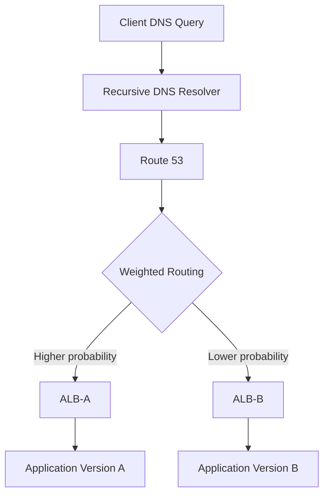

# 06- Simple and Weighted Routing

## Overview

Route 53 routing policies determine how Route 53 responds when multiple records exist for the same DNS name. Two foundational policies are **simple routing** and **weighted routing**.

Simple routing is appropriate when a DNS name should resolve to one or more straightforward targets without Route 53 making a routing decision based on weights, latency, health, geography, or other policies.

Weighted routing is used when traffic should be distributed across multiple resources according to configured weights. It is particularly useful for blue/green deployments, gradual migrations, canary releases, and controlled traffic shifting.

The important engineering distinction is:

```text
Simple Routing
    DNS name
       │
       ▼
   Route 53
       │
       ▼
Configured record value(s)


Weighted Routing
    DNS name
       │
       ▼
   Route 53
       │
       ▼
Weighted selection
    ┌───┴────┐
    ▼        ▼
Target A   Target B
  90%        10%
```

Routing occurs at the DNS layer. It does not replace an application load balancer, service mesh, API gateway, or application-level traffic-management system.

---

## Route 53 Routing Policy Model

A Route 53 record contains more than just a DNS name and target. The routing policy determines how Route 53 selects the response when multiple records represent the same logical endpoint.

Common Route 53 routing policies include:

| Policy | Primary decision |
|---|---|
| Simple | Return configured record value(s) |
| Weighted | Configured weight |
| Latency-based | Lowest expected network latency |
| Failover | Primary/secondary health state |
| Geolocation | Client geographic location |
| Geoproximity | Geographic proximity with optional bias |
| Multivalue answer | Multiple healthy records |
| IP-based | Client IP mapping |

This document focuses on simple and weighted routing because they establish the foundation for understanding more advanced DNS traffic-management strategies.

---

## Simple Routing

### What It Is

Simple routing is the default-style routing behavior used when Route 53 does not need to make a sophisticated routing decision.

A simple record can contain one value or multiple values.

For example:

```text
api.example.com
       │
       ▼
Route 53
       │
       ▼
ALB
```

Or a record may contain multiple values:

```text
api.example.com
       │
       ▼
Route 53
       │
       ├── Target A
       └── Target B
```

Route 53 does not assign percentages or perform latency-based selection for a simple record.

---

## When to Use Simple Routing

Simple routing is appropriate when the DNS architecture is straightforward.

Typical examples include:

- A hostname pointing to one ALB
- A domain pointing to one CloudFront distribution
- A static website endpoint
- A service with one authoritative DNS target
- A basic development or staging environment

A common production backend configuration is:

```text
api.example.com
       │
       ▼
Route 53
       │
       ▼
Alias
       │
       ▼
Application Load Balancer
       │
       ▼
ECS / EC2 / EKS
```

The load balancer itself handles backend distribution.

In this case, Route 53 does not need to perform weighted routing.

---

## Simple Routing with an Alias

Simple routing and alias records are independent concepts.

An alias describes **what the record targets**.

A routing policy describes **how Route 53 chooses between records**.

For example:

```text
api.example.com
       │
       ▼
Simple routing
       │
       ▼
Alias
       │
       ▼
Application Load Balancer
```

The alias could also be used with other supported AWS resources.

This distinction is important in interviews:

> Alias and routing policy solve different problems.

---

## Simple Routing with Multiple Values

A simple record can contain multiple values.

For example:

```text
api.example.com
    │
    ├── 203.0.113.10
    └── 203.0.113.20
```

This should not be confused with weighted routing.

There is no configuration such as:

```text
Target A = 80%
Target B = 20%
```

Route 53 simply returns the configured values according to simple-record behavior.

If deterministic traffic distribution or controlled percentages are required, weighted routing is a better fit.

---

## Simple Routing and Health Checks

A common misconception is that attaching a health check to a simple record turns it into sophisticated failover routing.

It does not.

If the architecture requires explicit primary/secondary behavior, use the **failover routing policy**.

For example:

```text
Primary Region
      │
      ▼
   ALB A
      │
      X
   unhealthy

Secondary Region
      │
      ▼
   ALB B
```

This is a failover-routing problem rather than a simple-routing problem.

---

## Weighted Routing

### What It Is

Weighted routing allows Route 53 to distribute DNS responses among multiple records according to configured weights.

For example:

```text
api.example.com
       │
       ▼
Weighted Routing
       │
       ├── 90 → ALB A
       │
       └── 10 → ALB B
```

The weights are relative values.

If the records have:

```text
ALB A = 90
ALB B = 10
```

the intended traffic distribution is approximately:

```text
ALB A → 90%
ALB B → 10%
```

It is important to say **approximately**, because DNS routing operates through recursive resolvers and cached responses rather than directly controlling every individual HTTP request.

---

## Why Weighted Routing Exists

Weighted routing provides controlled traffic distribution without requiring the application to implement traffic splitting.

It is useful when infrastructure needs to transition gradually.

For example:

```text
Current production:
100% → Version A

Migration:
90%  → Version A
10%  → Version B

Further migration:
50%  → Version A
50%  → Version B

Final:
0%   → Version A
100% → Version B
```

This can reduce deployment risk compared with an immediate DNS cutover.

---

## How Weighted Routing Works

Consider:

```text
api.example.com

Record A:
Weight = 90
Target = ALB-A

Record B:
Weight = 10
Target = ALB-B
```

Conceptually:



Route 53 selects among the weighted records when answering DNS queries.

The recursive resolver may then cache the result according to the record's TTL.

This means Route 53 is distributing **DNS answers**, not directly distributing individual HTTP requests.

---

## Relative Weights

Weights do not have to add up to 100.

For example:

```text
Target A = 9
Target B = 1
```

represents approximately the same ratio as:

```text
Target A = 90
Target B = 10
```

The important relationship is:

```text
Target weight
--------------------
Total configured weight
```

For example:

```text
A = 70
B = 20
C = 10

Total = 100
```

approximately corresponds to:

```text
A = 70%
B = 20%
C = 10%
```

You could also configure:

```text
A = 7
B = 2
C = 1
```

with the same relative distribution.

---

## Weight Zero

A weighted record can be configured with a weight of `0`.

This is useful when a target should normally receive no traffic while remaining configured.

For example:

```text
Production A = 100
New Version B = 0
```

Later:

```text
Production A = 95
New Version B = 5
```

This can be useful for controlled rollout workflows.

A zero-weight record is not equivalent to deleting the record. Keeping it configured can simplify staged deployment and rollback procedures.

---

## Weighted Routing for Blue/Green Deployment

A common production pattern is:

```text
                    api.example.com
                           │
                           ▼
                     Route 53
                           │
                    Weighted Routing
                       /       \
                      /         \
                     ▼           ▼
                  ALB Blue    ALB Green
                     │           │
                     ▼           ▼
                Version A    Version B
```

Initial state:

```text
Blue  = 100
Green = 0
```

Migration:

```text
Blue  = 95
Green = 5
```

Then:

```text
Blue  = 75
Green = 25
```

Then:

```text
Blue  = 50
Green = 50
```

Finally:

```text
Blue  = 0
Green = 100
```

The deployment pipeline should monitor application health between each transition.

---

## Weighted Routing for Canary Releases

Weighted routing can implement DNS-level canary releases.

For example:

```text
Version A = 99
Version B = 1
```

This is useful when the new version must receive a small fraction of DNS traffic.

However, a DNS canary has limitations.

The effective distribution may vary because:

- Recursive resolvers cache DNS responses.
- Different clients use different resolvers.
- DNS queries are not equivalent to HTTP requests.
- Clients may reuse existing TCP or HTTP connections.
- Long-lived connections may remain on the original target.

Therefore:

> DNS weighted routing is not an exact per-request traffic splitter.

For precise request-level canarying, application-aware mechanisms such as load balancers, service meshes, API gateways, or deployment platforms may be more appropriate.

---

## Weighted Routing and TTL

TTL is a major operational consideration.

Suppose:

```text
ALB A = 90
ALB B = 10
TTL = 300 seconds
```

A resolver may cache the response for up to the configured TTL.

If you change the weights immediately to:

```text
ALB A = 50
ALB B = 50
```

existing cached responses may continue influencing traffic until their cache lifetime expires.

Therefore:

```text
Change Route 53
       │
       ▼
Resolvers gradually observe change
       │
       ▼
Clients gradually observe change
```

Do not expect an instantaneous global traffic redistribution.

---

## Weighted Routing and Existing Connections

DNS operates before an application connection is established.

Consider:

```text
DNS Query
    │
    ▼
ALB A selected
    │
    ▼
TCP/TLS connection
    │
    ▼
HTTP requests
    │
    ├── Request 1
    ├── Request 2
    └── Request 3
```

Changing the DNS weight does not move existing connections to ALB B.

This matters for:

- HTTP keep-alive
- HTTP/2
- gRPC
- WebSockets
- Long-running connections

For example, a gRPC client may maintain a long-lived connection to one endpoint. DNS changes do not necessarily cause that connection to move.

---

## Weighted Routing with ALBs

A common AWS backend architecture is:

```text
api.example.com
       │
       ▼
Route 53
       │
       ▼
Weighted Alias Records
       │
       ├── ALB Blue
       │      │
       │      ▼
       │   ECS Blue
       │
       └── ALB Green
              │
              ▼
           ECS Green
```

This provides DNS-level traffic distribution while the ALBs handle request-level load balancing within each environment.

The layers have different responsibilities:

| Layer | Responsibility |
|---|---|
| Route 53 | DNS-level endpoint selection |
| ALB | HTTP request distribution |
| ECS/EKS/EC2 | Application execution |
| Application | Business logic |

Do not attempt to use Route 53 as a replacement for the ALB's request routing functionality.

---

## Weighted Routing with CloudFront

Weighted routing can also be used when supported targets are CloudFront distributions.

Conceptually:

```text
www.example.com
       │
       ▼
Route 53
       │
       ▼
Weighted routing
       │
       ├── CloudFront A
       └── CloudFront B
```

This can support controlled migrations between distributions.

However, CloudFront has its own caching behavior, so DNS traffic distribution does not necessarily translate into equal origin request distribution.

When debugging such a design, distinguish:

```text
DNS traffic
    ↓
CloudFront traffic
    ↓
Origin traffic
```

Each layer has independent caching and routing behavior.

---

## Weighted Routing with Health Checks

Weighted records can be associated with health checks.

Conceptually:

```text
api.example.com
       │
       ▼
Weighted Routing
       │
       ├── Target A
       │    │
       │    └── Healthy
       │
       └── Target B
            │
            └── Unhealthy
```

Health-aware routing can prevent unhealthy targets from being selected in supported configurations.

However, health checks should not be confused with application observability.

A target can be:

```text
HTTP /health = 200
```

while still experiencing:

- Database failures
- High latency
- Partial dependency failures
- Business-level failures
- Incorrect application behavior

Health checks should therefore be designed deliberately.

---

## Weighted Routing and Failover

Weighted routing and failover solve different problems.

### Weighted Routing

Answers:

> How should traffic be distributed among available targets?

Example:

```text
90% → Region A
10% → Region B
```

### Failover Routing

Answers:

> Which target should receive traffic when the preferred target is unavailable?

Example:

```text
Primary → Region A

if unhealthy

Secondary → Region B
```

A senior engineer should not choose weighted routing merely because it can point to multiple endpoints.

The routing policy should match the failure and traffic-management requirement.

---

## Weighted Routing for Multi-Region Systems

Weighted routing can distribute traffic between regions:

```text
                    api.example.com
                           │
                           ▼
                     Route 53
                           │
                    Weighted Routing
                     /           \
                    /             \
                   ▼               ▼
              US Region        EU Region
                  70%              30%
                   │                │
                   ▼                ▼
                 ALB US           ALB EU
```

This can be useful for:

- Gradual regional migrations
- Capacity management
- Testing a new region
- Disaster recovery preparation
- Controlled expansion

But DNS weights do not automatically account for:

- Database replication lag
- Region capacity
- User session locality
- Data sovereignty
- Application state
- Dependency availability

Those concerns must be handled by the overall architecture.

---

## Weighted Routing for Disaster Recovery

Weighted routing can be part of a disaster-recovery strategy, but it is not inherently a disaster-recovery policy.

For example:

```text
Primary Region = 100
DR Region      = 0
```

The DR region remains available but receives no normal traffic.

During a planned migration:

```text
Primary = 80
DR      = 20
```

Eventually:

```text
Primary = 0
DR      = 100
```

For automatic primary/secondary failover, Route 53 failover routing is usually a better semantic fit.

---

## Simple vs Weighted Routing

| Aspect | Simple | Weighted |
|---|---|---|
| Complexity | Low | Moderate |
| Multiple targets | Supported | Supported |
| Traffic percentages | No | Yes |
| Blue/green deployments | Limited | Good fit |
| Canary releases | Limited | Good fit |
| Basic single endpoint | Excellent | Unnecessary |
| Controlled migration | Poor fit | Good fit |
| Relative weights | No | Yes |
| Health-aware behavior | Limited | Supported with appropriate configuration |
| DNS caching considerations | Yes | Yes |
| Exact request distribution | No | No |

---

## Weighted Routing vs Load Balancing

This distinction is frequently tested in backend interviews.

### Route 53 Weighted Routing

Operates at:

```text
DNS layer
```

It decides which DNS answer a resolver receives.

### Application Load Balancer

Operates at:

```text
HTTP/HTTPS request layer
```

It decides which backend target receives an incoming request.

For example:

```text
                    Route 53
                       │
              Weighted Routing
                 /         \
                ▼           ▼
             ALB A        ALB B
               │             │
        ┌──────┴─────┐ ┌─────┴──────┐
        ▼            ▼ ▼            ▼
      App A1       App A2 App B1   App B2
```

Route 53 might perform:

```text
90% → ALB A
10% → ALB B
```

while ALB A independently performs:

```text
Request 1 → App A1
Request 2 → App A2
Request 3 → App A1
```

These are separate routing layers.

---

## Production Deployment Strategy

For a high-risk backend migration, a controlled rollout might look like:

### Initial State

```text
Version A = 100
Version B = 0
```

### Canary

```text
Version A = 99
Version B = 1
```

Monitor:

- HTTP 5xx rate
- HTTP latency
- CPU
- Memory
- Database errors
- Dependency failures
- Application logs
- Business metrics

### Expansion

```text
Version A = 95
Version B = 5
```

Then:

```text
Version A = 75
Version B = 25
```

Then:

```text
Version A = 50
Version B = 50
```

### Completion

```text
Version A = 0
Version B = 100
```

At every stage, define explicit rollback criteria.

---

## Rollback Strategy

Suppose the new environment is:

```text
A = 90
B = 10
```

and monitoring detects elevated errors.

A rollback can restore:

```text
A = 100
B = 0
```

However, DNS caching means clients may not immediately follow the new distribution.

Therefore, rollback planning must account for:

- TTL
- Resolver caching
- Existing connections
- Client-side caching
- Application session behavior
- Long-lived gRPC/WebSocket connections

For critical deployments, DNS-based rollback should not be the only recovery mechanism.

---

## Infrastructure as Code

Weighted Route 53 records should be managed through Infrastructure as Code in production.

Example Terraform configuration:

```hcl
resource "aws_route53_record" "api_blue" {
  zone_id = aws_route53_zone.public.zone_id
  name    = "api.example.com"
  type    = "A"
  set_identifier = "blue"

  weighted_routing_policy {
    weight = 90
  }

  alias {
    name                   = aws_lb.blue.dns_name
    zone_id                = aws_lb.blue.zone_id
    evaluate_target_health = true
  }
}

resource "aws_route53_record" "api_green" {
  zone_id = aws_route53_zone.public.zone_id
  name    = "api.example.com"
  type    = "A"
  set_identifier = "green"

  weighted_routing_policy {
    weight = 10
  }

  alias {
    name                   = aws_lb.green.dns_name
    zone_id                = aws_lb.green.zone_id
    evaluate_target_health = true
  }
}
```

The important production properties are:

- Each weighted record has a unique `set_identifier`.
- Weights are explicitly version controlled.
- Changes are reviewed.
- Rollbacks can be represented as code.
- CI/CD can validate infrastructure changes.

---

## AWS CLI Inspection

List records:

```bash
aws route53 list-resource-record-sets \
  --hosted-zone-id Z1234567890ABC
```

Inspect DNS behavior:

```bash
dig A api.example.com
```

Repeat queries from different resolvers or environments when validating a traffic migration.

For end-to-end validation:

```bash
curl -I https://api.example.com/health
```

DNS inspection should be combined with application telemetry.

---

## Monitoring Weighted Deployments

A weighted DNS deployment should have both infrastructure and application observability.

Useful metrics include:

| Metric | Why it matters |
|---|---|
| DNS query volume | Detect traffic changes |
| HTTP request volume | Validate actual application traffic |
| HTTP 5xx | Detect failures |
| p95/p99 latency | Detect performance regressions |
| Database errors | Detect dependency issues |
| CPU/memory | Detect capacity problems |
| Application-specific metrics | Detect business regressions |
| Target health | Validate infrastructure health |

Do not infer actual application traffic distribution from Route 53 weights alone.

If you configure:

```text
A = 90
B = 10
```

verify actual request volume using load balancer or application metrics.

---

## Security Considerations

Weighted routing does not introduce a fundamentally different DNS security model, but production DNS changes remain security-sensitive.

Use:

- Least-privilege IAM
- Protected CI/CD credentials
- Infrastructure-as-Code review
- Change auditing
- AWS CloudTrail
- Controlled production access

Avoid giving application deployment roles unrestricted Route 53 permissions when only a specific hosted zone or record needs modification.

A compromised DNS-management role can redirect users to an attacker-controlled endpoint, making DNS configuration a high-impact security boundary.

---

## Reliability Considerations

Weighted routing can improve deployment safety by reducing the blast radius of a new version.

For example:

```text
100% new version
```

has a much larger initial blast radius than:

```text
1% new version
```

However, the system must still handle cases where:

- The new target fails.
- DNS responses remain cached.
- Existing connections remain established.
- Health checks are too shallow.
- Application dependencies fail.
- The new version is incompatible with shared data.

A particularly important backend concern is database compatibility.

If both versions share a database:

```text
Version A ──┐
            ├── PostgreSQL
Version B ──┘
```

schema changes must generally be backward compatible during the migration period.

Weighted DNS does not solve incompatible database migrations.

---

## Performance Considerations

DNS routing adds no application-level request routing logic to the backend itself, but DNS resolution is part of connection establishment.

Performance is affected by:

- DNS TTL
- Resolver caching
- Client caching
- DNS lookup latency
- Connection reuse
- Application protocol

For high-performance systems, remember that DNS selection occurs before the application connection is established.

With gRPC or HTTP/2, a single long-lived connection can carry many requests after the initial DNS decision.

Therefore:

```text
DNS weight ≠ exact request weight
```

This is one of the most important limitations of DNS-based traffic splitting.

---

## Common Mistakes

### Assuming 90/10 Means Every 10 Requests Produce 9/1

It does not.

Weighted routing is probabilistic at the DNS-answer level and is affected by caching.

### Treating Route 53 Like an ALB

Route 53 chooses DNS answers.

The ALB chooses backend request targets.

### Ignoring DNS Caching

Changing weights does not instantly change every client's behavior.

### Using Weighted Routing for Automatic Failover

Weighted routing is primarily for traffic distribution.

Use failover routing when the requirement is explicitly primary/secondary failover.

### Using DNS for Precise Canary Percentages

DNS cannot guarantee exact per-request percentages.

Use application-aware traffic management when precise request-level control is required.

### Ignoring Long-Lived Connections

gRPC, WebSockets, and HTTP/2 connections may remain attached to the original target.

### Forgetting Unique Set Identifiers

Weighted records for the same name and type require unique identifiers.

### Managing Production Weights Manually

Manual changes make controlled rollout, auditing, and rollback harder.

Prefer Infrastructure as Code.

### Changing Weights Without Monitoring

A weighted deployment without application telemetry is not a safe canary deployment.

---

## Interview Questions

### What is simple routing in Route 53?

Simple routing is the basic Route 53 routing behavior where DNS responses are returned from the configured record values without weighted, latency-based, geolocation, or failover selection.

### What is weighted routing?

Weighted routing distributes DNS responses among multiple records according to configured relative weights.

### Do weights have to add up to 100?

No.

Weights are relative values. For example, `90/10` and `9/1` represent the same ratio.

### Is weighted routing exact?

No.

It controls DNS answer selection rather than individual HTTP requests, and DNS caching affects the observed distribution.

### Can weighted routing be used for blue/green deployments?

Yes.

It is a common use case for gradually shifting DNS traffic between two environments.

### Can a weighted record have weight zero?

Yes.

A zero-weight record can be useful for keeping a target configured while preventing it from receiving normal weighted traffic.

### What happens when you change a weighted record?

The new configuration becomes authoritative at Route 53, but recursive resolvers may continue returning cached responses until their cache lifetime expires.

### Is Route 53 weighted routing a replacement for an ALB?

No.

Route 53 operates at the DNS layer. An ALB operates at the HTTP/HTTPS load-balancing layer.

### When would you choose failover instead of weighted routing?

Choose failover when the primary/secondary availability relationship is the requirement. Choose weighted routing when controlled traffic distribution is the requirement.

### Can weighted routing be used for multi-region deployments?

Yes.

It can distribute DNS traffic between regional endpoints, but the broader architecture must address data replication, state, health, capacity, and regional dependencies.

---

## Interview Traps

| Trap | Correct interpretation |
|---|---|
| `90/10` means exactly 90% of HTTP requests | No, it is DNS-level weighted routing |
| Route 53 replaces an ALB | No, they operate at different layers |
| Changing weights immediately moves all clients | No, DNS caching delays convergence |
| Weighted routing automatically detects every application failure | Only configured health mechanisms can influence routing |
| Weight values must total 100 | No, they are relative |
| DNS can move an existing gRPC connection | No, existing connections are independent of DNS changes |
| Weighted routing is the same as failover | No, traffic distribution and primary/secondary failover are different requirements |
| Lower DNS TTL guarantees instant traffic migration | No, caching behavior and client behavior still matter |

---

## Production Best Practices

- Use simple routing when there is no requirement for DNS-level traffic distribution.
- Use weighted routing for controlled traffic shifting between multiple endpoints.
- Treat Route 53 as a DNS routing layer, not a request-level load balancer.
- Use relative weights rather than assuming weights must total 100.
- Account for recursive DNS caching when planning deployments and rollbacks.
- Monitor actual HTTP traffic rather than relying solely on configured DNS weights.
- Use health evaluation where appropriate and design health checks carefully.
- Use failover routing when the requirement is primary/secondary disaster recovery.
- Use Infrastructure as Code for production DNS configuration.
- Give weighted records unique and meaningful identifiers.
- Define rollback thresholds before starting a weighted migration.
- Consider gRPC, WebSockets, and HTTP/2 connection reuse when estimating traffic movement.
- Ensure both application versions can safely coexist during a rollout.
- Use backward-compatible database migrations when old and new versions share data stores.
- Validate weighted routing behavior from multiple client networks and resolvers.
- Keep Route 53 permissions tightly scoped through IAM.

---

## Key Takeaways

- Simple routing is appropriate for straightforward DNS configurations where Route 53 does not need to select between traffic-management strategies.
- Weighted routing distributes DNS responses according to relative weights.
- Weights are ratios, not percentages that must total 100.
- A `90/10` configuration means approximately 90/10 DNS-answer distribution, not exactly 90/10 HTTP-request distribution.
- DNS caching means weighted traffic changes converge gradually.
- Existing TCP, HTTP/2, gRPC, and WebSocket connections are not moved by DNS changes.
- Weighted routing is useful for blue/green deployments, canary releases, migrations, and controlled multi-region traffic distribution.
- Route 53 weighted routing operates at the DNS layer, while ALB routing operates at the request layer.
- Use failover routing when the requirement is primary/secondary availability rather than traffic distribution.
- Health checks can improve weighted-routing behavior but do not replace application observability.
- Production weighted deployments should be managed through Infrastructure as Code and monitored using actual application traffic metrics.
- DNS-based traffic shifting is powerful but inherently less precise than application-aware request routing.
- The senior-level design question is not "Can Route 53 distribute traffic?" but "At which layer should traffic distribution occur, and what failure semantics does the system require?"