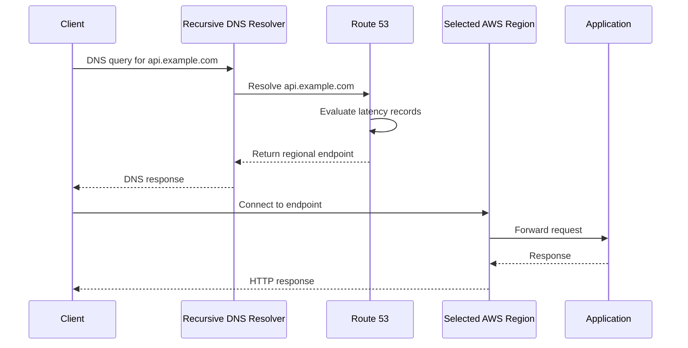
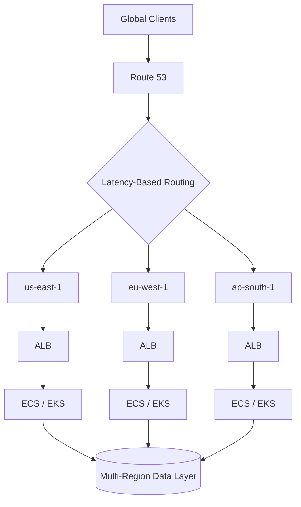

# 07- Latency-Based Routing

## Overview

Latency-based routing directs DNS queries to the AWS Region that Route 53 determines will provide the lowest network latency for the requesting client.

It is primarily useful for applications deployed across multiple AWS Regions where reducing network latency is more important than distributing traffic according to fixed percentages.

A typical architecture is:

```text
                         api.example.com
                                │
                                ▼
                            Route 53
                                │
                  Lowest-latency Region
                         /      |      \
                        /       |       \
                       ▼        ▼        ▼
                  us-east-1  eu-west-1  ap-south-1
                      │          │          │
                     ALB        ALB        ALB
                      │          │          │
                    Apps       Apps       Apps
```

The key point is that Route 53 does not measure the latency of every individual application request. It uses AWS's latency measurements between AWS Regions and DNS resolver locations to determine which configured Region is expected to provide the lowest latency.

Latency-based routing is therefore a **DNS-level regional routing mechanism**, not a request-level global load balancer.

---

## Why Latency-Based Routing Exists

A single-region architecture can force geographically distant users to communicate with infrastructure that is unnecessarily far away.

For example:

```text
User in India
     │
     │ long network path
     ▼
us-east-1
```

If the application is also deployed in:

```text
ap-south-1
```

latency-based routing can direct the DNS query toward the Region that Route 53 considers lower latency.

Conceptually:

```text
                    Route 53
                       │
             ┌─────────┴─────────┐
             │                   │
        us-east-1            ap-south-1
             │                   │
         ~higher             ~lower
         latency             latency
             │                   │
             └─────────┬─────────┘
                       ▼
                 Client receives
                 regional target
```

This is particularly valuable for:

- Global REST APIs
- Multi-region web applications
- Globally distributed backend services
- Multi-region static or dynamic workloads
- Applications where user-perceived latency matters

---

## Latency-Based Routing vs Geographic Routing

Latency-based routing and geographic routing answer different questions.

### Latency-Based Routing

> Which configured AWS Region is expected to provide the lowest network latency for this client?

### Geolocation Routing

> Which target should this client receive based on its geographic location?

For example:

```text
Client location:
India

Latency-based:
Choose the Region with the lowest measured network latency.

Geolocation:
Choose the Region explicitly configured for India.
```

The two can produce different results.

A geographically nearby Region is not always the lowest-latency Region because actual network paths, ISP routing, congestion, and interconnection topology affect latency.

---

## How Latency-Based Routing Works

A client normally does not query Route 53 directly.

The flow typically looks like:



The important separation is:

```text
DNS resolution
      ↓
Regional endpoint selection
      ↓
Application connection
      ↓
HTTP/gRPC request
```

Route 53 makes the regional decision during DNS resolution.

---

## Latency Records

A latency-based Route 53 configuration normally contains multiple records for the same DNS name, with each record associated with an AWS Region.

For example:

```text
api.example.com

Latency record:
    us-east-1 → ALB US

Latency record:
    eu-west-1 → ALB EU

Latency record:
    ap-south-1 → ALB India
```

Conceptually:

```text
api.example.com
       │
       ▼
Route 53
       │
       ├── us-east-1
       │      └── ALB US
       │
       ├── eu-west-1
       │      └── ALB EU
       │
       └── ap-south-1
              └── ALB India
```

Route 53 evaluates the latency routing configuration and returns the endpoint associated with the selected Region.

---

## Region Is Not the Same as Client Country

A common mistake is to think latency-based routing means:

```text
India → ap-south-1
USA → us-east-1
Europe → eu-west-1
```

That is not guaranteed.

Latency-based routing is not a country-to-region mapping system.

The actual decision depends on AWS's latency measurements and the configured Regions.

Therefore:

```text
Client geography
        ≠
Guaranteed Route 53 Region
```

If the business requirement is explicitly:

```text
India users → India infrastructure
EU users → EU infrastructure
US users → US infrastructure
```

geolocation or another routing strategy may be more appropriate.

---

## What Route 53 Actually Optimizes

Latency-based routing optimizes for network latency between the client-side DNS resolver and AWS infrastructure, rather than application-level latency.

This distinction matters.

Suppose:

```text
Region A

DNS/network latency = 40 ms
Application response = 300 ms
```

and:

```text
Region B

DNS/network latency = 50 ms
Application response = 100 ms
```

Route 53 does not know your complete application execution time when making its routing decision.

Your application could therefore have:

```text
lower DNS/network latency
but
higher database/application latency
```

This is why application-level observability remains essential.

---

## Latency-Based Routing with Application Load Balancers

A common production design is to deploy the application in multiple Regions:

```text
                         Route 53
                            │
                 Latency-based routing
                     /          \
                    /            \
                   ▼              ▼
              us-east-1       ap-south-1
                   │              │
                  ALB            ALB
                   │              │
             ECS / EKS        ECS / EKS
                   │              │
             Application      Application
```

Each regional ALB provides a stable regional endpoint.

Route 53 selects between them at the DNS layer.

The ALB then performs request-level load balancing within that Region.

This gives each layer a clear responsibility:

| Layer | Responsibility |
|---|---|
| Route 53 | Regional DNS selection |
| ALB | Regional request distribution |
| ECS/EKS/EC2 | Application execution |
| PostgreSQL/Redis/etc. | Data and state |
| Application | Business logic |

---

## Latency-Based Routing with Alias Records

For AWS resources such as Application Load Balancers, latency-based routing can be combined with Route 53 alias records.

Conceptually:

```text
api.example.com
       │
       ▼
Latency routing
       │
       ├── us-east-1
       │      └── Alias → ALB US
       │
       └── ap-south-1
              └── Alias → ALB India
```

This is a common production pattern because the application hostname remains stable:

```text
api.example.com
```

while the underlying regional infrastructure can change.

---

## Multi-Region API Architecture

A production API might use:



The difficult part is usually not DNS.

The difficult part is making the application and data layer genuinely multi-region.

You must consider:

- Database replication
- Write locality
- Conflict resolution
- Session state
- Cache consistency
- Message delivery
- File storage
- Authentication state
- Third-party dependencies
- Region-specific capacity
- Disaster recovery

Latency-based routing only solves one part of the architecture.

---

## Health Checks and Latency Routing

Health checks are important when routing users to multiple regional deployments.

Without health-aware routing, DNS may direct clients toward a Region whose application is unhealthy.

A production design can associate health evaluation with the regional records so that unhealthy endpoints are excluded where supported.

Conceptually:

```text
                         Route 53
                            │
                   Latency evaluation
                            │
              ┌─────────────┴─────────────┐
              │                           │
         us-east-1                    ap-south-1
              │                           │
           Healthy                     Unhealthy
              │                           X
              │
              ▼
          Return US
```

However, a health check is only as good as the signal it measures.

A weak health endpoint such as:

```http
GET /health
200 OK
```

may only prove that the HTTP server is responding.

A production readiness check may need to account for:

- Database connectivity
- Critical dependency availability
- Application initialization
- Required configuration
- Regional service health

Avoid putting expensive dependency checks into a health endpoint that is called at high frequency.

---

## Health Checks vs Application Monitoring

Route 53 health evaluation and application observability solve different problems.

| Mechanism | Purpose |
|---|---|
| Route 53 health check | Routing decision |
| ALB target health | Regional load balancing |
| CloudWatch metrics | Infrastructure/service monitoring |
| Application metrics | Runtime behavior |
| Distributed tracing | Request-level diagnosis |
| Logs | Detailed debugging |

For example:

```text
Route 53:
"Is this endpoint healthy enough to receive DNS traffic?"

CloudWatch:
"Are error rates increasing?"

Application telemetry:
"Why are checkout requests failing?"

```

A mature production system uses all of these at the appropriate layers.

---

## TTL and Latency-Based Routing

DNS caching affects how quickly routing changes propagate.

For example:

```text
TTL = 60 seconds
```

A resolver may cache the DNS response for the TTL period.

If infrastructure changes from:

```text
Region A
```

to:

```text
Region B
```

existing cached responses can continue directing clients to Region A until they expire.

Therefore:

```text
Route 53 configuration change
             │
             ▼
Authoritative DNS changes
             │
             ▼
Resolvers refresh
             │
             ▼
Clients gradually observe new endpoint
```

TTL should be selected based on operational requirements rather than simply choosing the lowest possible value.

Lower TTL can improve routing agility but may increase DNS query volume and does not guarantee instantaneous client behavior.

---

## Latency-Based Routing and DNS Caching

Latency-based routing is inherently influenced by DNS caching.

Suppose a client resolves:

```text
api.example.com → ap-south-1
```

The resolver may cache that result.

A later network condition change does not necessarily cause the client to immediately receive a different Region.

Therefore:

> Latency-based routing is a DNS-level optimization, not continuous per-request latency steering.

This distinction is important when designing systems that require rapid dynamic routing decisions.

---

## Latency-Based Routing and Long-Lived Connections

DNS selection happens when the client establishes or refreshes the connection path.

It does not continuously re-evaluate every request.

This matters for:

- HTTP keep-alive
- HTTP/2
- gRPC
- WebSockets
- Long-running TCP connections

For example:

```text
DNS
 │
 ▼
ap-south-1
 │
 ▼
gRPC connection
 │
 ├── Request 1
 ├── Request 2
 ├── Request 3
 └── Request 4
```

Changing DNS conditions does not automatically move that existing gRPC connection to another Region.

This is especially important for systems using long-lived connections.

---

## Latency-Based Routing and gRPC

gRPC commonly uses HTTP/2 and long-lived connections.

A typical architecture might be:

```text
Service Client
      │
      ▼
api.example.com
      │
      ▼
Route 53
      │
      ▼
Regional ALB
      │
      ▼
gRPC Service
```

The initial DNS resolution influences which regional endpoint the client connects to.

Once the HTTP/2 connection is established, subsequent RPCs can use the same connection.

Therefore, latency-based DNS routing is useful for **initial regional endpoint selection**, but it is not a complete global gRPC traffic-management strategy.

For advanced service-to-service traffic management, service discovery, client-side load balancing, or a service mesh may be more appropriate depending on the architecture.

---

## Latency-Based Routing and Microservices

Latency-based routing is generally more useful for traffic entering a multi-region application than for internal microservice-to-microservice communication.

For example:

```text
Internet Client
       │
       ▼
Route 53
       │
       ▼
Regional API
       │
       ├── Auth Service
       ├── Order Service
       ├── Payment Service
       └── Inventory Service
```

Internal services may instead use:

- Kubernetes service discovery
- AWS service discovery
- Internal load balancers
- Client-side service discovery
- gRPC service discovery
- Service mesh

Using public Route 53 latency routing for every internal microservice call is usually unnecessary and can introduce unwanted complexity.

---

## Latency-Based Routing vs Weighted Routing

The two policies solve different problems.

| Aspect | Latency-Based | Weighted |
|---|---|---|
| Primary goal | Reduce network latency | Control traffic proportions |
| Decision | Lowest-latency Region | Configured relative weight |
| Typical use | Multi-region applications | Canary/blue-green |
| Traffic percentage control | No | Yes |
| Region-aware | Yes | Not inherently |
| Geographic proximity | Indirectly | No |
| Exact request distribution | No | No |
| DNS caching impact | Yes | Yes |
| Multi-region deployment | Excellent fit | Possible |
| Gradual rollout | Poorer fit | Excellent fit |

For example:

```text
Latency-based:

Client → lowest-latency Region
```

while:

```text
Weighted:

Client → approximately configured distribution
```

The correct policy depends on the desired behavior.

---

## Latency-Based Routing vs Geolocation Routing

| Aspect | Latency-Based | Geolocation |
|---|---|---|
| Decision basis | Network latency | Client geographic location |
| Explicit country mapping | No | Yes |
| User proximity | Indirect | Geographic |
| Regulatory routing | Poor fit | Better fit |
| Lowest network latency | Primary goal | Not primary goal |
| Multi-region APIs | Strong fit | Strong fit for geographic policies |
| Data residency | Not sufficient alone | Can help implement policy |
| Traffic percentages | No | No |

If the requirement is:

```text
"Send users to whichever Region is fastest."
```

latency-based routing is appropriate.

If the requirement is:

```text
"European users must use EU infrastructure."
```

geolocation routing may be more appropriate.

---

## Latency-Based Routing vs Global Load Balancers

Route 53 operates primarily through DNS resolution.

A global traffic-management service can operate closer to the actual connection or request path and may provide different routing semantics.

The architectural distinction is:

```text
DNS-based routing:

Client
  │
  ▼
DNS resolution
  │
  ▼
Regional endpoint
  │
  ▼
Application
```

versus connection-aware or proxy-based global routing:

```text
Client
  │
  ▼
Global traffic layer
  │
  ▼
Optimal backend
  │
  ▼
Application
```

The latter can provide more dynamic control, but introduces additional infrastructure, cost, and operational complexity.

Choose based on the actual requirement rather than assuming the most sophisticated option is automatically better.

---

## Data Layer Considerations

Latency-based routing becomes significantly harder when applications require writes.

Consider:

```text
                    Route 53
                       │
             ┌─────────┴─────────┐
             ▼                   ▼
        US Application       India Application
             │                   │
             ▼                   ▼
          Database A          Database B
```

Now the architecture must answer:

- Where is authoritative data stored?
- Are writes local or global?
- How is replication handled?
- What happens during replication lag?
- What happens during a regional partition?
- Can users switch Regions safely?
- How are conflicts resolved?
- What happens to transactions spanning Regions?

DNS routing does not solve these problems.

For stateful multi-region systems, data architecture often determines whether latency-based routing is practical.

---

## Session Management

Session state can also affect multi-region routing.

A poorly designed application might have:

```text
User
  │
  ▼
Region A
  │
  ▼
In-memory session
```

If the user later resolves to:

```text
Region B
```

the session may not exist there.

Prefer architectures where state is appropriately externalized or replicated.

Examples include:

- Stateless authentication using signed tokens
- Shared session storage
- Region-aware session architecture
- Distributed caches
- Globally accessible identity systems

Redis can be useful for shared application state, but simply placing Redis in one Region can create a new cross-region latency dependency.

---

## Failure Scenarios

### Regional Application Failure

```text
Route 53
   │
   ├── Region A → unhealthy
   │
   └── Region B → healthy
```

If health-aware routing is configured correctly, traffic can move toward the healthy Region.

### Regional Database Failure

This is more complicated.

The application may remain healthy at the HTTP layer while its database is unavailable.

A shallow health check may therefore produce:

```text
Route 53:
"Region is healthy."

Application:
"Database is unavailable."
```

Health signals must reflect the failure semantics the routing layer actually needs.

---

## Disaster Recovery

Latency-based routing can participate in a multi-region disaster-recovery architecture.

For example:

```text
Normal Operation:

US Region      → active
EU Region      → active
India Region   → active
```

If one Region fails:

```text
US Region      → unhealthy
EU Region      → active
India Region   → active
```

However, latency-based routing should not automatically be considered a complete DR strategy.

A complete multi-region DR design also requires:

- Data replication
- Backup strategy
- Infrastructure recreation
- Secrets management
- Deployment automation
- DNS recovery
- Dependency recovery
- Capacity planning
- Operational runbooks
- Failure testing

---

## Monitoring and Observability

Monitor both DNS behavior and application behavior.

### DNS-Level Signals

Track:

- DNS query volume
- DNS errors
- Health-check status
- Record configuration changes
- Route 53 operational events

### Application-Level Signals

Track:

- Request rate
- HTTP 4xx/5xx
- p50/p95/p99 latency
- TCP connection failures
- TLS failures
- Database latency
- Cache latency
- Dependency errors
- Region-specific saturation

A useful multi-region dashboard might compare:

```text
Region             Requests     p95      5xx
------------------------------------------------
us-east-1          1.2M/min     120ms    0.2%
eu-west-1          900K/min     110ms    0.1%
ap-south-1         700K/min      85ms    0.1%
```

The objective is not merely to confirm that DNS routing is configured. It is to verify that the selected Region actually provides acceptable application performance.

---

## Security Considerations

DNS configuration is part of the production security boundary.

Protect Route 53 changes through:

- Least-privilege IAM
- Separate deployment roles
- MFA for sensitive administrative access
- Infrastructure-as-Code review
- CloudTrail auditing
- Protected CI/CD pipelines
- Restricted production permissions

A compromised DNS-management role could redirect a production hostname to an attacker-controlled endpoint.

Treat DNS configuration with the same operational discipline as load balancer, IAM, and network configuration.

---

## Scalability Considerations

Latency-based routing scales well from a DNS infrastructure perspective because Route 53 is managed infrastructure.

The difficult scalability problem is usually the application architecture behind it.

Each Region should have enough capacity to handle:

- Normal regional traffic
- Expected traffic growth
- Failure traffic from another Region
- Deployment capacity
- Operational headroom

For example, if Region A normally handles 40% of global traffic and Region B handles 30%, the remaining capacity should not be assumed to be sufficient for an unexpected regional failure.

A DR design must explicitly calculate:

```text
Failure capacity
=
Normal local traffic
+
Transferred traffic
+
Expected growth
+
Operational headroom
```

---

## Cost Considerations

Latency-based routing itself is only one component of a multi-region architecture.

The larger cost drivers can include:

- Running compute in multiple Regions
- Load balancers
- Databases
- Cross-region replication
- Cross-region data transfer
- Redis/cache infrastructure
- Observability
- Backup storage
- NAT gateways
- Multi-region CI/CD

Do not adopt multi-region architecture solely to reduce latency without measuring the actual business benefit.

A practical engineering process is:

```text
Measure current latency
        │
        ▼
Identify problematic user regions
        │
        ▼
Estimate multi-region benefit
        │
        ▼
Estimate infrastructure + operational cost
        │
        ▼
Evaluate business requirement
```

---

## Infrastructure as Code

Latency-based records should normally be managed through Infrastructure as Code.

Example Terraform:

```hcl
resource "aws_route53_record" "api_us" {
  zone_id = aws_route53_zone.public.zone_id
  name    = "api.example.com"
  type    = "A"
  set_identifier = "us-east-1"

  latency_routing_policy {
    region = "us-east-1"
  }

  alias {
    name                   = aws_lb.us.dns_name
    zone_id                = aws_lb.us.zone_id
    evaluate_target_health = true
  }
}

resource "aws_route53_record" "api_india" {
  zone_id = aws_route53_zone.public.zone_id
  name    = "api.example.com"
  type    = "A"
  set_identifier = "ap-south-1"

  latency_routing_policy {
    region = "ap-south-1"
  }

  alias {
    name                   = aws_lb.india.dns_name
    zone_id                = aws_lb.india.zone_id
    evaluate_target_health = true
  }
}
```

Benefits include:

- Version-controlled routing configuration
- Peer review
- Repeatable deployments
- Auditable changes
- Easier rollback
- Reduced manual configuration errors

---

## AWS CLI Inspection

List records in a hosted zone:

```bash
aws route53 list-resource-record-sets \
  --hosted-zone-id Z1234567890ABC
```

Inspect DNS resolution:

```bash
dig A api.example.com
```

Inspect the DNS response through a specific resolver:

```bash
dig @8.8.8.8 A api.example.com
```

Test application behavior:

```bash
curl -I https://api.example.com/health
```

For multi-region validation, test from multiple network locations rather than assuming one machine represents global behavior.

---

## Operational Best Practices

- Use latency-based routing when reducing network latency across multiple AWS Regions is the primary requirement.
- Do not assume geographic proximity always equals lowest network latency.
- Use ALBs or equivalent regional endpoints behind Route 53 rather than exposing individual application instances.
- Use alias records for supported AWS resources where appropriate.
- Configure meaningful health signals for regional endpoints.
- Monitor actual application latency by region.
- Keep regional capacity sufficient for both normal traffic and failure scenarios.
- Account for DNS caching and TTL during operational changes.
- Do not treat DNS routing as exact request-level traffic steering.
- Design session state for regional movement when users may switch Regions.
- Design the database layer explicitly before adopting active-active multi-region application routing.
- Use Infrastructure as Code for production DNS configuration.
- Protect Route 53 changes through least-privilege IAM and CI/CD controls.
- Test regional failure scenarios rather than relying solely on configuration review.
- Consider long-lived HTTP/2, gRPC, and WebSocket connections when evaluating routing behavior.
- Use geolocation routing when the requirement is geographic policy rather than lowest network latency.
- Use weighted routing when the requirement is controlled traffic percentages rather than latency optimization.
- Validate the architecture from multiple client locations and DNS resolvers.

---

## Common Mistakes

### Assuming the Nearest Region Always Wins

Latency-based routing does not simply calculate geographic distance.

Network topology and AWS latency measurements influence the result.

### Treating It as Per-Request Routing

Route 53 makes its decision during DNS resolution.

It does not inspect every HTTP request.

### Assuming DNS Changes Are Instant

Resolvers and clients can cache DNS responses.

Operational changes therefore converge over time.

### Using Latency Routing for Data Residency

Latency-based routing does not enforce data residency.

If data must remain within a jurisdiction, use an explicit geographic and data architecture strategy.

### Ignoring Database Architecture

Adding multiple application Regions without designing the data layer can create consistency and failure problems.

### Ignoring Long-Lived Connections

gRPC and WebSockets may continue using an existing regional connection even after DNS conditions change.

### Using Public DNS for Internal Service Discovery

Internal microservices often have better options such as Kubernetes service discovery, AWS service discovery, internal load balancers, or service-mesh mechanisms.

### Assuming Health Checks Detect Every Failure

A simple HTTP 200 response does not necessarily prove the application is operational.

### Assuming Multi-Region Automatically Means Highly Available

Multiple Regions do not help if:

- Data exists in only one Region.
- Deployment is not automated.
- Failover is untested.
- Dependencies remain single-region.
- Capacity cannot absorb transferred traffic.

---

## Interview Questions

### What is latency-based routing in Route 53?

Latency-based routing directs DNS queries to the configured AWS Region that Route 53 determines will provide the lowest latency for the requesting client.

### Does latency-based routing route HTTP requests?

No. It routes DNS responses. The selected DNS endpoint then receives application traffic.

### How does Route 53 determine the lowest-latency Region?

Route 53 uses AWS's latency measurements between AWS Regions and DNS resolver locations to determine which configured Region is expected to provide the lowest latency.

### Is the geographically closest AWS Region always selected?

No. Network latency does not necessarily correlate directly with geographic distance.

### What is the main use case for latency-based routing?

Multi-region applications where reducing network latency for users is a primary requirement.

### How is latency-based routing different from weighted routing?

Latency-based routing chooses a Region based on expected network latency. Weighted routing distributes DNS responses according to configured relative weights.

### How is latency-based routing different from geolocation routing?

Latency-based routing optimizes for network latency. Geolocation routing makes decisions based on the geographic location of the request.

### Can latency-based routing provide exact traffic percentages?

No. It is not designed for percentage-based traffic control.

### Does lowering TTL make latency routing more accurate?

No. Lower TTL can make DNS changes propagate faster, but it does not change the underlying latency-selection mechanism.

### Can latency-based routing automatically fail over?

Health-aware configurations can prevent unhealthy endpoints from receiving traffic where supported, but latency-based routing itself should not be treated as a complete failover strategy.

### Can latency-based routing be used for multi-region APIs?

Yes. It is a common pattern for routing users toward regional API endpoints.

### Does Route 53 know application latency?

Not in the sense of continuously measuring your application's complete request execution time. Application latency must be monitored separately.

### What happens to an existing gRPC connection when DNS routing changes?

The existing connection normally remains connected to its current endpoint. DNS changes affect subsequent DNS resolution rather than forcibly moving established connections.

---

## Interview Traps

| Trap | Correct interpretation |
|---|---|
| Closest Region always wins | No, latency is based on network measurements, not simple geographic distance |
| Route 53 routes every HTTP request | No, Route 53 operates through DNS |
| Latency routing guarantees the lowest application latency | No, it primarily addresses DNS/network path latency |
| Latency routing is the same as geolocation | No, one uses latency and the other uses geographic policy |
| Latency routing provides 50/50 traffic | No, weighted routing is designed for percentage-based distribution |
| DNS changes immediately move clients | No, DNS caching affects convergence |
| Existing gRPC connections move after DNS changes | No, established connections generally remain in place |
| Multiple Regions automatically solve DR | No, data, dependencies, capacity, deployment, and failover must also be designed |
| Nearby Region means lowest latency | Not necessarily |
| Health checks guarantee application correctness | No, health checks are only signals used for routing decisions |
| Multi-region application means multi-region database | No, the data architecture must be designed separately |
| Route 53 latency routing is ideal for internal microservices | Usually not; service discovery or internal routing mechanisms are often more appropriate |

---

## Key Takeaways

- Latency-based routing selects among configured AWS Regions based on expected network latency.
- It is primarily useful for multi-region applications where user-perceived network latency matters.
- Route 53 makes the routing decision at DNS resolution time, not per HTTP request.
- Geographic proximity does not guarantee the lowest network latency.
- Latency-based routing is different from weighted routing and geolocation routing.
- Weighted routing is appropriate for controlled traffic percentages; latency routing is appropriate for latency optimization.
- DNS caching means routing decisions do not instantly change for every client.
- Long-lived HTTP/2, gRPC, and WebSocket connections can remain connected to their existing Region.
- Health-aware routing can improve resilience, but health checks must represent meaningful application availability.
- Multi-region DNS is only one part of a multi-region architecture.
- Database replication, session state, cache architecture, capacity planning, deployment automation, and dependency availability must be designed separately.
- Latency-based routing does not guarantee the lowest complete application response time.
- Regional application latency should be measured using application and infrastructure telemetry, not inferred solely from Route 53 configuration.
- Use Infrastructure as Code and least-privilege IAM for production DNS management.
- The senior-level question is not simply "Which Region is closest?" but "Which routing policy matches the application's latency, availability, data, and operational requirements?"