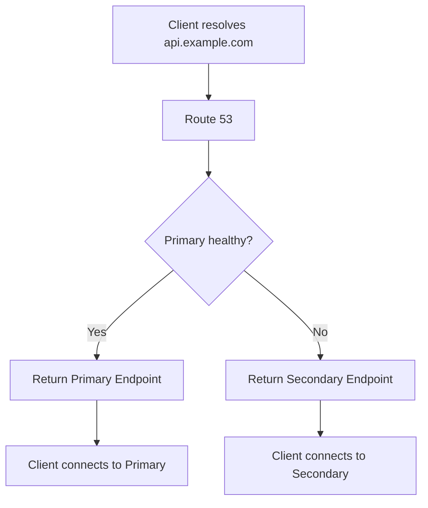

# 08- Failover Routing

## Overview

Amazon Route 53 failover routing is designed to direct DNS traffic between a **primary** and **secondary** resource based on health status.

The common production use case is:

```text
                         Route 53
                            │
                     Failover Policy
                            │
                 ┌──────────┴──────────┐
                 │                     │
              PRIMARY              SECONDARY
                 │                     │
              Region A              Region B
                 │                     │
              Healthy?             Standby
                 │                     │
                 ▼                     ▼
             Application          DR Application
```

The important architectural distinction is that Route 53 failover routing is **DNS-level failover**. It does not move an existing TCP connection, migrate application state, replicate a database, or automatically recreate infrastructure.

A senior engineer should therefore treat Route 53 failover as one component of a broader disaster-recovery architecture.

---

## Why Failover Routing Exists

A production backend may have a primary endpoint and a standby endpoint:

```text
api.example.com
       │
       ▼
Route 53
       │
       ▼
Primary ALB
       │
       ▼
Production application
```

If the primary becomes unhealthy, Route 53 can return the secondary endpoint:

```text
api.example.com
       │
       ▼
Route 53
       │
       X Primary unhealthy
       │
       ▼
Secondary ALB
       │
       ▼
DR application
```

This provides a controlled DNS mechanism for redirecting new DNS resolutions toward an alternative endpoint.

Typical use cases include:

- Regional disaster recovery
- Active-passive architectures
- Primary/standby APIs
- Primary/backup web applications
- Multi-region failover
- Disaster recovery environments
- Migration between infrastructure environments

---

## What Failover Routing Does

Failover routing answers a relatively simple question:

> Which endpoint should Route 53 return when the primary is healthy, and which endpoint should it return when the primary is unhealthy?

For a basic configuration:

```text
Primary:
    api-primary.example.com

Secondary:
    api-secondary.example.com
```

Route 53 evaluates the primary's health state and returns the appropriate record.

The decision can be visualized as:



---

## Failover Routing Is Not Application Failover

This distinction is critical in senior-level interviews.

Route 53 can change the DNS response:

```text
api.example.com
       │
       ▼
Secondary ALB
```

It does not automatically perform:

```text
Database failover
Application deployment
Container recreation
Data replication
Cache replication
Session migration
Infrastructure provisioning
```

Therefore:

```text
DNS failover
     ≠
Complete disaster recovery
```

A complete DR architecture requires coordination across multiple layers.

---

## Primary and Secondary Records

A failover configuration normally contains two records with the same DNS name and record type:

| Record | Role | Purpose |
|---|---|---|
| Primary | PRIMARY | Normal production endpoint |
| Secondary | SECONDARY | Backup endpoint |

For example:

```text
api.example.com
        │
        ├── PRIMARY
        │      └── ALB in us-east-1
        │
        └── SECONDARY
               └── ALB in eu-west-1
```

The primary is used during normal operation.

The secondary becomes eligible when the primary is considered unhealthy.

---

## How Health Checks Drive Failover

Health checks are central to failover routing.

A simplified flow is:

```text
Route 53 Health Check
        │
        ▼
Primary Endpoint
        │
        ├── Healthy ──────► PRIMARY record
        │
        └── Unhealthy ────► SECONDARY record
```

A health check can verify whether a configured endpoint is responding according to the health-check configuration.

The health signal should represent whether the endpoint is suitable to receive production traffic.

A superficial health check may not be sufficient.

For example:

```http
GET /health
200 OK
```

may only prove that the web server is running.

It may not prove that:

- The application can reach its database.
- Required configuration is available.
- Critical dependencies are functioning.
- The application can process real requests.
- The service is accepting production traffic safely.

---

## Health Check Design

A production health endpoint should be deliberately designed.

A useful distinction is:

### Liveness

Answers:

> Is the process running?

Example:

```http
GET /health/live
```

### Readiness

Answers:

> Is this instance capable of serving application traffic?

Example:

```http
GET /health/ready
```

For Route 53 failover, the signal should normally represent **service availability**, not merely process existence.

However, blindly checking every dependency can also be dangerous.

For example:

```text
Route 53
   │
   ▼
Health check
   │
   ├── API
   ├── PostgreSQL
   ├── Redis
   ├── Kafka
   └── External payment API
```

If every dependency failure marks the Region unhealthy, a transient dependency problem could cause unnecessary regional failover.

The health-check design should therefore match the actual failure policy.

---

## Health Check Failure Semantics

Suppose the primary application is:

```text
us-east-1
```

and the secondary is:

```text
eu-west-1
```

Normal operation:

```text
Primary health = HEALTHY

Route 53
   │
   ▼
us-east-1
```

Failure:

```text
Primary health = UNHEALTHY

Route 53
   │
   ▼
eu-west-1
```

Recovery:

```text
Primary health = HEALTHY

Route 53
   │
   ▼
us-east-1
```

The recovery behavior must be considered carefully.

If the primary is unstable and repeatedly transitions between healthy and unhealthy states, traffic can oscillate between endpoints.

This is one reason health-check thresholds, failure detection, recovery validation, and operational runbooks matter.

---

## Failover Routing with Application Load Balancers

A common architecture is:

```text
                       Route 53
                          │
                    Failover Policy
                     /           \
                    /             \
                   ▼               ▼
              PRIMARY          SECONDARY
                   │               │
                  ALB             ALB
                   │               │
                ECS/EKS         ECS/EKS
                   │               │
             Application      Application
```

For example:

```text
api.example.com

PRIMARY:
    ALB in us-east-1

SECONDARY:
    ALB in eu-west-1
```

Each ALB provides a stable regional endpoint.

Route 53 determines which endpoint should be returned to DNS resolvers.

The ALB then handles request distribution inside the selected Region.

---

## Alias Records with Failover Routing

Route 53 failover records can be combined with alias records for supported AWS resources.

A common design is:

```text
api.example.com
       │
       ▼
Route 53
       │
       ├── PRIMARY
       │      └── Alias → ALB us-east-1
       │
       └── SECONDARY
              └── Alias → ALB eu-west-1
```

This avoids exposing the underlying ALB hostname to application users.

The public contract remains:

```text
https://api.example.com
```

while the underlying infrastructure can change.

---

## Evaluate Target Health

When using alias records for supported AWS resources, `evaluate_target_health` can allow Route 53 to consider the health of the aliased target.

For example:

```hcl
alias {
  name                   = aws_lb.primary.dns_name
  zone_id                = aws_lb.primary.zone_id
  evaluate_target_health = true
}
```

This can be useful when the target's own health state should influence DNS routing.

However, understand exactly which health signal is being evaluated.

Do not assume:

```text
ALB target health
=
complete application health
=
database health
=
business transaction health
```

These are different signals.

---

## Terraform Example

A simplified primary failover record:

```hcl
resource "aws_route53_record" "api_primary" {
  zone_id = aws_route53_zone.public.zone_id
  name    = "api.example.com"
  type    = "A"

  set_identifier = "primary"

  failover_routing_policy {
    type = "PRIMARY"
  }

  alias {
    name                   = aws_lb.primary.dns_name
    zone_id                = aws_lb.primary.zone_id
    evaluate_target_health = true
  }
}
```

Secondary record:

```hcl
resource "aws_route53_record" "api_secondary" {
  zone_id = aws_route53_zone.public.zone_id
  name    = "api.example.com"
  type    = "A"

  set_identifier = "secondary"

  failover_routing_policy {
    type = "SECONDARY"
  }

  alias {
    name                   = aws_lb.secondary.dns_name
    zone_id                = aws_lb.secondary.zone_id
    evaluate_target_health = true
  }
}
```

For production Infrastructure as Code, health checks, dependencies, IAM permissions, and regional infrastructure should also be managed consistently rather than manually.

---

## Active-Passive Architecture

Failover routing is particularly well suited to active-passive architectures.

```text
                 Route 53
                    │
              Failover Policy
                    │
             ┌──────┴──────┐
             │             │
          PRIMARY       SECONDARY
             │             │
        Active App      Standby App
             │             │
        Primary DB     Replica/DR DB
```

The primary handles normal production traffic.

The secondary may be:

- Fully active but receiving no production traffic
- Warm standby
- Scaled down
- Partially provisioned
- Infrastructure ready to scale

The correct choice depends on the recovery objectives.

---

## RTO and Failover Design

Failover architecture should be designed around **Recovery Time Objective (RTO)** and **Recovery Point Objective (RPO)**.

### RTO

How quickly must the service become operational after a failure?

Example:

```text
RTO = 5 minutes
```

### RPO

How much data loss is acceptable?

Example:

```text
RPO = 1 minute
```

These requirements influence the architecture.

| DR Design | Typical Characteristics |
|---|---|
| Backup only | High recovery time |
| Cold standby | Lower cost, slower recovery |
| Warm standby | Faster recovery, moderate cost |
| Hot standby | Fast recovery, higher cost |
| Active-active | Very high availability potential, high complexity |

Route 53 failover only addresses part of the RTO.

For example:

```text
DNS failover
     │
     ▼
Secondary endpoint available
     │
     ▼
Application starts
     │
     ▼
Database available
     │
     ▼
Caches warm
     │
     ▼
Traffic succeeds
```

The total recovery time is determined by the entire chain.

---

## DNS TTL and Failover Time

DNS caching affects failover behavior.

Suppose:

```text
TTL = 60 seconds
```

A recursive resolver can cache the response for the TTL period.

If Route 53 changes the answer:

```text
Before:
api.example.com → Primary

After:
api.example.com → Secondary
```

clients using cached DNS answers may continue using the primary until their cached record expires.

Conceptually:

```text
Primary fails
    │
    ▼
Route 53 detects failure
    │
    ▼
Route 53 returns secondary
    │
    ▼
Resolvers refresh
    │
    ▼
Clients receive secondary
```

Therefore, DNS failover should never be described as instantaneous.

---

## Existing Connections During Failover

DNS failover affects new DNS resolution.

It does not forcibly move an existing connection.

For example:

```text
Client
  │
  ▼
Primary ALB
  │
  └── Existing TCP/HTTP connection
```

If DNS changes:

```text
api.example.com
       │
       ▼
Secondary ALB
```

the existing connection does not automatically migrate to the secondary endpoint.

This matters for:

- HTTP keep-alive
- HTTP/2
- gRPC
- WebSockets
- Long-lived TCP connections

Applications and clients must tolerate connection failures and reconnect appropriately.

---

## Failover and gRPC

gRPC frequently maintains long-lived HTTP/2 connections.

Consider:

```text
Client
  │
  ▼
api.example.com
  │
  ▼
Route 53
  │
  ▼
Primary ALB
  │
  ▼
gRPC Service
```

If the primary Region fails, DNS may eventually return the secondary endpoint.

But an existing gRPC connection may fail before the client performs another DNS lookup.

Therefore, a resilient gRPC client should have appropriate:

- Connection retry behavior
- Backoff
- Dead-channel handling
- Name resolution behavior
- Timeout configuration
- Idempotency strategy

DNS failover and application retry behavior must work together.

---

## Failover and Stateless APIs

Failover is significantly easier when backend APIs are stateless.

For example:

```text
Client
   │
   ▼
Route 53
   │
   ├── Region A
   │
   └── Region B
```

Both Regions can process the same request without depending on local in-memory session state.

Stateless authentication mechanisms such as appropriately designed signed tokens can reduce the need for session migration.

If sessions exist only in:

```text
Region A memory
```

moving a user to:

```text
Region B
```

may cause authentication or application-state failures.

---

## Database Failover

The hardest part of many DNS failover designs is the database.

Consider:

```text
              Route 53
                 │
        ┌────────┴────────┐
        ▼                 ▼
     Region A          Region B
        │                 │
      App A             App B
        │                 │
      DB A              DB B
```

If Region A fails, Route 53 can direct traffic to Region B.

But what happens to the data?

Possible designs include:

- Read replicas
- Cross-region database replication
- Managed database global architectures
- Backup restoration
- Application-level replication
- Active-active data architectures

Each has different RPO, RTO, consistency, and operational characteristics.

DNS cannot solve database consistency.

---

## Failover and Redis

Redis introduces similar concerns.

Suppose:

```text
Region A
   │
   └── Redis A
```

while the application fails over to:

```text
Region B
   │
   └── Redis B
```

If Redis is being used only as a cache, losing cached data may be acceptable.

If Redis contains:

- Sessions
- Locks
- Queues
- Rate-limit state
- Business-critical state

then failover requirements become much more complicated.

A senior engineer should always ask:

> Is Redis disposable cache data, or authoritative application state?

---

## Failover and Kafka

Kafka introduces another important consideration.

If the application moves from:

```text
Region A
```

to:

```text
Region B
```

the secondary Region needs an appropriate strategy for:

- Event availability
- Consumer offsets
- Producer behavior
- Replication
- Duplicate processing
- Ordering
- Idempotency

A DNS failover record does not replicate Kafka state.

This is why multi-region event-driven systems require explicit messaging architecture.

---

## Failure Detection vs Failure Recovery

These are separate problems.

### Failure Detection

```text
Is the primary unhealthy?
```

### Failure Recovery

```text
Can the secondary successfully serve production traffic?
```

A system can detect failure correctly but still fail to recover.

Example:

```text
Primary fails
    │
    ▼
Route 53 detects failure
    │
    ▼
Secondary selected
    │
    ▼
Secondary database unavailable
    │
    ▼
Service remains unavailable
```

Therefore:

> Successful DNS failover does not prove successful service recovery.

---

## Health Check Design: Common Production Pattern

A practical architecture is:

```text
Route 53
    │
    ▼
Regional ALB
    │
    ▼
Health endpoint
    │
    ▼
Application readiness
```

The endpoint should be designed specifically for routing decisions.

For example:

```python
from fastapi import FastAPI, Response, status

app = FastAPI()


@app.get("/health/ready")
async def readiness_check() -> dict[str, str]:
    # Keep the check lightweight. Validate only dependencies
    # whose failure means this instance cannot serve traffic.
    return {"status": "ready"}
```

In a real production system, the readiness check would be connected to meaningful application state rather than returning a constant response.

Avoid expensive checks that:

- Execute complex database queries
- Call multiple external APIs
- Perform large Redis operations
- Trigger downstream business logic

A health endpoint should remain cheap and deterministic.

---

## Failover Testing

A failover configuration that has never been tested should not be considered reliable.

A useful test sequence is:

```text
Normal operation
      │
      ▼
Verify primary traffic
      │
      ▼
Simulate primary failure
      │
      ▼
Verify Route 53 health state
      │
      ▼
Verify DNS response
      │
      ▼
Verify secondary application
      │
      ▼
Verify database state
      │
      ▼
Verify client behavior
      │
      ▼
Restore primary
      │
      ▼
Verify recovery
```

Test failure at multiple layers:

- Application
- Load balancer
- Compute
- Database
- Cache
- Messaging
- Network dependencies
- External dependencies

Do not only test whether the DNS record changes.

---

## Operational Failover Runbook

A production runbook should define:

1. Failure detection criteria.
2. Who is authorized to initiate manual failover.
3. How automatic failover is validated.
4. How secondary capacity is verified.
5. How database replication state is checked.
6. How DNS behavior is verified.
7. How application errors are monitored.
8. How the primary is repaired.
9. How traffic is restored.
10. How the incident is documented.

This converts failover from an architectural diagram into an executable operational process.

---

## Monitoring

Monitor failover at multiple layers.

### Route 53

Monitor:

- Health-check status
- DNS query behavior
- Record changes
- Route 53-related CloudTrail events
- Failover state

### Load Balancer

Monitor:

- Healthy host count
- HTTP 4xx
- HTTP 5xx
- Target response time
- Connection errors

### Application

Monitor:

- Request rate
- Error rate
- p50/p95/p99 latency
- Dependency failures
- Database errors
- Cache failures

### Database

Monitor:

- Replication lag
- Connection count
- CPU
- Storage
- Failover state
- Read/write errors

A good DR dashboard should make it possible to answer:

> If the primary fails right now, can the secondary serve production traffic?

---

## Security Considerations

DNS failover configuration is part of the production control plane.

Protect it with:

- Least-privilege IAM
- Dedicated deployment roles
- Restricted Route 53 permissions
- CI/CD approval controls
- CloudTrail auditing
- Infrastructure-as-Code review
- MFA for privileged access
- Protected production accounts

A compromised Route 53 write permission could redirect a production hostname to an attacker-controlled endpoint.

Avoid granting broad permissions such as unrestricted Route 53 modification to application runtime roles.

DNS administration should be separated from normal application execution permissions.

---

## Scalability and Capacity Planning

The secondary Region must have enough capacity to absorb the expected failover traffic.

Suppose:

```text
Primary Region:
    100,000 requests/sec

Secondary Region:
    20,000 requests/sec capacity
```

Failover will not produce high availability.

The DNS layer may successfully redirect traffic, but the secondary application will become overloaded.

Capacity planning should consider:

```text
Secondary capacity
≥
Expected failover traffic
+
Growth
+
Operational headroom
```

For active-passive systems, decide whether the secondary is:

- Fully provisioned
- Warm standby
- Auto-scaled from a low baseline
- Provisioned on demand

The choice directly affects RTO.

---

## Cost Considerations

A fully provisioned standby Region can be expensive because infrastructure runs even when it receives little or no production traffic.

A lower-cost design might use:

```text
Primary:
    Full capacity

Secondary:
    Minimal warm capacity
    +
    Automated scaling
```

However, reducing standby capacity can increase recovery time.

Therefore:

```text
Lower cost
    ↕
Faster recovery
```

There is no universally correct configuration.

The correct architecture is determined by:

- RTO
- RPO
- Business impact
- Traffic volume
- Infrastructure cost
- Operational maturity

---

## Failover Routing vs Other Routing Policies

| Routing Policy | Primary Use Case | Typical Behavior |
|---|---|---|
| Simple | Single endpoint | Return one record |
| Weighted | Controlled distribution | Distribute according to weights |
| Latency | Multi-region latency optimization | Select lower-latency Region |
| Geolocation | Geographic policy | Select based on client location |
| Failover | Active-passive DR | Primary unless unhealthy |
| Geoproximity | Geographic traffic shifting | Route based on geographic proximity |
| Multivalue answer | Multiple healthy endpoints | Return multiple records |

The important interview distinction is:

```text
Failover:
"Is primary healthy?"

Latency:
"Which Region should provide lower latency?"

Weighted:
"How much traffic should each record receive?"

Geolocation:
"Which endpoint should this geographic location use?"
```

---

## Common Production Pitfalls

### Treating DNS Failover as Instant

DNS caching means existing resolvers may continue returning the old endpoint.

### Having an Unusable Secondary

A secondary endpoint that has not been tested is not a reliable DR system.

### Forgetting Data Replication

Application failover without data availability can still produce an outage.

### Health Check Is Too Shallow

A simple HTTP 200 response may not represent real service availability.

### Health Check Is Too Deep

Checking every dependency can create unnecessary failovers due to transient downstream failures.

### Ignoring Capacity

A standby Region may not have enough compute capacity to handle production traffic.

### Ignoring Client Retry Behavior

Clients must tolerate connection failures and reconnect to the newly resolved endpoint.

### Forgetting Long-Lived Connections

Existing gRPC or WebSocket connections may continue pointing toward the failed Region until they reconnect.

### Manual DNS Configuration

Manual changes are difficult to audit and easy to misconfigure.

Prefer Infrastructure as Code.

### No Failback Strategy

Teams often design failover but do not define how and when traffic returns to the primary.

---

## Failback

Failover is only half of the operational story.

After the primary is repaired:

```text
Secondary
    │
    ▼
Serving production
```

the team must determine when it is safe to return traffic:

```text
Primary repaired
      │
      ▼
Health verified
      │
      ▼
Data synchronized
      │
      ▼
Capacity verified
      │
      ▼
Failback approved
      │
      ▼
Primary receives traffic
```

Do not immediately restore traffic simply because the primary health check turns green.

A service can pass a health check while still recovering:

- Database replication may be incomplete.
- Caches may be cold.
- Capacity may be insufficient.
- Dependencies may still be degraded.

Failback should therefore be an explicit operational decision.

---

## Practical AWS CLI Checks

List Route 53 records:

```bash
aws route53 list-resource-record-sets \
  --hosted-zone-id Z1234567890ABC
```

List health checks:

```bash
aws route53 list-health-checks
```

Inspect a specific health check:

```bash
aws route53 get-health-check \
  --health-check-id 12345678-1234-1234-1234-123456789012
```

Test DNS resolution:

```bash
dig A api.example.com
```

Test the application:

```bash
curl -fsS https://api.example.com/health
```

For a real failover exercise, validate DNS from multiple recursive resolvers and network locations.

---

## Troubleshooting Failover

When failover does not behave as expected, troubleshoot from the DNS layer downward.

### Step 1: Verify the Record Configuration

Confirm:

- Same DNS name
- Correct record type
- One PRIMARY record
- One SECONDARY record
- Correct routing policy
- Correct target endpoints

### Step 2: Verify Health Status

Check whether Route 53 considers the primary healthy.

Do not assume an application outage automatically means the Route 53 health check is failing.

### Step 3: Verify the Target

Confirm:

- ALB exists
- ALB is reachable
- Targets are healthy
- Security groups allow traffic
- Application is responding

### Step 4: Verify DNS Caching

Check:

```bash
dig api.example.com
```

Compare results from different resolvers.

### Step 5: Verify Secondary Readiness

Confirm that the secondary can actually serve:

- Authentication
- Application requests
- Database operations
- Required dependencies
- Background processing

### Step 6: Verify Client Behavior

Check whether clients:

- Cache DNS aggressively
- Maintain long-lived connections
- Retry failed requests
- Respect connection timeouts
- Re-resolve DNS after failure

---

## Interview Questions

### What is Route 53 failover routing?

Failover routing is a DNS routing policy that uses primary and secondary records and health evaluation to direct DNS responses toward a backup endpoint when the primary is unhealthy.

### What is the typical use case?

Active-passive disaster recovery, where one endpoint serves production traffic normally and another endpoint is available as a backup.

### Does failover routing move existing connections?

No. DNS failover affects DNS resolution. Existing TCP, HTTP/2, gRPC, or WebSocket connections are not automatically migrated.

### Does Route 53 automatically replicate application data?

No. Data replication must be designed separately.

### Does failover routing guarantee disaster recovery?

No. It only provides DNS-level traffic redirection. The secondary infrastructure, data, dependencies, capacity, and operational process must also be designed.

### How does Route 53 know the primary is unhealthy?

It can use Route 53 health checks and, for supported alias targets, target health evaluation.

### What happens when the primary becomes healthy again?

The primary can become eligible to receive DNS traffic again according to the failover configuration and DNS caching behavior. Production systems should still validate the recovered environment before intentionally restoring normal traffic.

### Why is TTL important?

Resolvers cache DNS responses. A cached primary response can remain in use until its TTL expires, so DNS failover is not instantaneous.

### What is the difference between failover and latency-based routing?

Failover selects a secondary when the primary is unhealthy. Latency-based routing selects among Regions based on expected network latency.

### What is the difference between failover and weighted routing?

Failover is primarily active-passive. Weighted routing controls the relative distribution of DNS responses across records.

### Can failover routing be used with ALBs?

Yes. Alias records can be used to point primary and secondary records at supported AWS load balancers.

### What is a major limitation of DNS failover?

DNS caching and existing connections mean that traffic does not necessarily move immediately after the primary becomes unhealthy.

---

## Interview Traps

| Trap | Correct Answer |
|---|---|
| Route 53 immediately moves all users to the secondary | No, DNS caching delays convergence |
| Existing connections move to the secondary | No, existing connections are not migrated by DNS |
| Route 53 replicates databases | No |
| A healthy DNS endpoint guarantees the application is healthy | No |
| A secondary Region automatically provides DR | No |
| Failover routing distributes traffic 50/50 | No, that is closer to weighted routing |
| Latency-based routing is the same as failover | No |
| Failover eliminates database RTO/RPO concerns | No |
| A standby that has never been tested is reliable | No |
| DNS failover is request-level load balancing | No |
| A low TTL guarantees instant failover | No |
| A green health check guarantees business functionality | No |
| Failover means the primary can be immediately restored after recovery | Not necessarily; data, capacity, dependencies, and stability must be verified |
| Route 53 can fix an unavailable secondary database | No |

---

## Production Design Example

Consider a Django or FastAPI API deployed in two AWS Regions:

```text
                         api.example.com
                                │
                                ▼
                           Route 53
                                │
                         Failover Policy
                       ┌────────┴────────┐
                       │                 │
                    PRIMARY          SECONDARY
                       │                 │
                    us-east-1         eu-west-1
                       │                 │
                      ALB               ALB
                       │                 │
                    ECS/EKS           ECS/EKS
                       │                 │
                    API App           API App
                       │                 │
                       └────────┬────────┘
                                │
                         Regional Data
                         Architecture
```

A production implementation should additionally define:

```text
DNS
 ├── Failover records
 └── Health checks

Application
 ├── Stateless deployment
 ├── Readiness checks
 └── Retry/reconnect behavior

Data
 ├── Replication
 ├── RPO
 └── RTO

Infrastructure
 ├── Capacity
 ├── Auto Scaling
 └── IaC

Operations
 ├── Monitoring
 ├── Alerting
 ├── Runbook
 └── Failover testing
```

This is the difference between merely configuring a Route 53 failover record and designing a production-grade disaster recovery system.

---

## Key Takeaways

- Route 53 failover routing provides DNS-level primary/secondary traffic switching.
- It is primarily designed for active-passive and disaster-recovery architectures.
- A PRIMARY record receives normal traffic while the SECONDARY record provides the backup endpoint.
- Health evaluation determines whether the primary should continue receiving DNS traffic.
- Route 53 failover does not migrate existing TCP, HTTP/2, gRPC, or WebSocket connections.
- DNS caching means failover is not instantaneous.
- Failover routing does not replicate databases, Redis state, Kafka data, application state, or infrastructure.
- The secondary environment must be tested and capable of serving production traffic.
- RTO and RPO should drive the design of the entire DR architecture.
- Health checks must represent meaningful service availability without being excessively dependent on transient downstream failures.
- Secondary capacity must be sufficient to handle expected failover traffic.
- Stateless applications are easier to fail over between Regions.
- Database and state management are usually harder than the DNS portion of multi-region failover.
- Failover testing must validate more than DNS; verify application, data, dependencies, capacity, and client behavior.
- Failback requires its own operational procedure and should not happen merely because the primary health check becomes healthy.
- Route 53 failover should be managed through Infrastructure as Code and protected with least-privilege IAM.
- The senior-level perspective is to treat Route 53 as the **traffic-switching mechanism**, not the complete disaster-recovery solution.