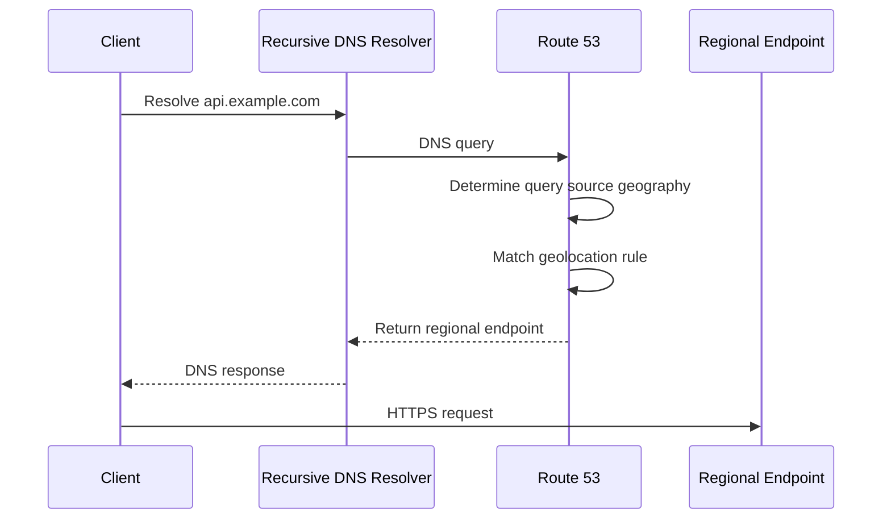
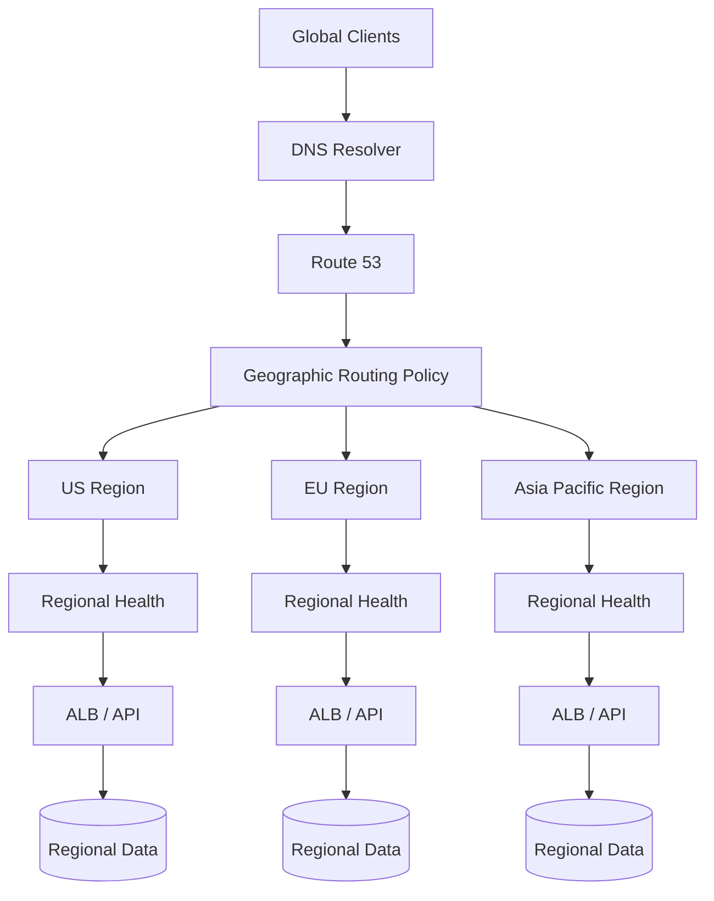

# 09- Geolocation and Geoproximity Routing

## Overview

Amazon Route 53 provides two routing policies that use geographic information to influence DNS responses:

- **Geolocation routing** — routes requests according to the geographic location from which the DNS query originates.
- **Geoproximity routing** — routes requests according to the geographic location of the resources and can shift the effective geographic boundary using a **bias**.

They solve related but different problems.

```text
                         Route 53
                            │
              ┌─────────────┴─────────────┐
              │                           │
       Geolocation                  Geoproximity
              │                           │
     "Where is the user?"        "Where are resources?"
              │                           │
       Country/continent/          Resource distance
       US state/default             + optional bias
```

The distinction matters in multi-region backend architectures. Choosing the wrong policy can result in unexpected traffic distribution, poor latency, incorrect regionalization, or difficult operational behavior.

---

## Why Geographic Routing Matters

Consider an API deployed in three AWS Regions:

```text
                 api.example.com
                        │
                     Route 53
                        │
          ┌─────────────┼─────────────┐
          │             │             │
       US East       Europe        Asia Pacific
          │             │             │
         ALB           ALB           ALB
          │             │             │
       API App       API App       API App
```

A global application may want to:

- Keep European users in Europe.
- Keep US users in the US.
- Serve Asian users from Asia.
- Keep regulated traffic within a specific geography.
- Shift more traffic toward an underutilized Region.
- Gradually rebalance traffic between Regions.

Route 53's geographic routing policies provide different mechanisms for accomplishing these goals.

---

## Geolocation Routing

### What It Is

Geolocation routing selects a DNS response based on the **location of the user or DNS query source**.

You define geographic rules such as:

```text
United States  → us-east-1
Germany        → eu-central-1
Japan          → ap-northeast-1
Default        → us-east-1
```

The important mental model is:

> Geolocation asks which geographic rule matches the DNS query source.

It does not calculate which application server is physically closest.

---

## How Geolocation Routing Works

A simplified request flow is:



Route 53 determines the location associated with the DNS query and selects the most specific matching geolocation record.

The returned endpoint could be:

- An ALB
- A CloudFront distribution
- An API endpoint
- An EC2-based service
- Another supported Route 53 target

---

## Geolocation Matching

Geolocation supports several geographic levels, including:

- Continent
- Country
- United States state
- Default location

A more specific rule takes precedence over a broader rule.

For example:

```text
Europe
   │
   ├── Germany → Frankfurt
   ├── France  → Paris
   └── Default Europe → another European endpoint
```

This allows routing policies to be progressively refined.

---

## Default Geolocation Record

A default record is important in production.

Not every query can necessarily be mapped to a geographic rule you explicitly configured.

For example:

```text
United States → US endpoint
Germany       → EU endpoint
Japan         → AP endpoint
Default       → Global endpoint
```

Without an appropriate fallback strategy, users whose locations do not match the configured rules can receive unexpected results or no applicable answer.

A default record is therefore commonly used to provide a safe fallback.

---

## Geolocation Example

Suppose a company operates:

```text
api.example.com

United States → ALB in us-east-1
Germany       → ALB in eu-central-1
Japan         → ALB in ap-northeast-1
Default       → ALB in us-east-1
```

The policy expresses a business/geographic decision:

```text
User location
     │
     ├── United States ──► US application
     │
     ├── Germany ────────► EU application
     │
     ├── Japan ──────────► Japan application
     │
     └── Other ──────────► Default application
```

This is fundamentally different from latency-based routing.

The decision is based on geographic classification, not measured network latency.

---

## Geolocation and Compliance

Geolocation can be useful when geographic placement is a business or regulatory requirement.

For example:

```text
EU users
   │
   ▼
EU endpoint
   │
   ▼
EU application/data architecture
```

However, DNS routing alone does **not** guarantee data residency.

If the application can subsequently call:

```text
EU API
   │
   ▼
US database
```

the DNS policy has not established data residency.

A compliance architecture must consider the entire data path:

```text
DNS
 │
 ▼
Application
 │
 ▼
Database
 │
 ▼
Object Storage
 │
 ▼
Logs
 │
 ▼
Backups
```

Geolocation is therefore a routing mechanism, not a complete compliance control.

---

## Geolocation vs User's Physical Location

A common interview trap is assuming that Route 53 always knows the client's exact physical location.

DNS infrastructure does not necessarily have the client's precise GPS location.

Route 53 estimates query-source geography using DNS information and mechanisms such as EDNS-related location information.

Therefore:

```text
DNS-derived location
        ≠
Exact physical location
```

VPNs, corporate networks, proxies, recursive resolvers, and other network configurations can affect the observed location.

This matters when geographic routing is used for strict business decisions.

---

## Geoproximity Routing

### What It Is

Geoproximity routing routes traffic according to the geographic relationship between:

- The user/query source
- The configured resource locations

It can also use **bias** to expand or shrink the geographic area associated with a resource.

The mental model is:

> Geoproximity asks which resource is geographically closest after applying the configured bias.

AWS resources can be associated with:

- AWS Regions
- AWS Local Zone groups

Non-AWS resources can be represented using:

- Latitude
- Longitude

:contentReference[oaicite:0]{index=0}

---

## Geoproximity Without Bias

Suppose resources exist in:

```text
US East
Europe
Asia Pacific
```

Conceptually:

```text
                  Europe
                     ●
                    / \
                   /   \
                  /     \
                 /       \
          US ●────────────● Asia
```

Route 53 determines which resource is geographically closest to the source of the DNS query and routes traffic accordingly.

The geographic boundaries are therefore determined by the relative positions of the configured resources.

---

## Geoproximity With Bias

Bias allows an engineer to deliberately change those effective boundaries.

A **positive bias** expands the geographic area from which Route 53 routes traffic to that resource.

A **negative bias** shrinks it.

AWS documents the effective calculation as:

```text
Biased distance =
    actual distance × (1 - bias / 100)
```

For example, with a bias of `50`:

```text
Actual distance = 150 km

Biased distance =
150 × (1 - 0.50)

= 75 km
```

The resource is effectively treated as being closer for routing purposes. :contentReference[oaicite:1]{index=1}

---

## Why Bias Exists

Bias provides controlled geographic traffic shifting.

Suppose:

```text
US East
    70% traffic

US West
    30% traffic
```

and the engineering team wants to shift more traffic toward US West.

Instead of changing every user manually, the geoproximity boundary can be adjusted.

Conceptually:

```text
Before:

Users
 ├──────────────► US East
 └──────► US West


After positive bias toward US West:

Users
 ├──────► US East
 └──────────────────► US West
```

This can be useful for:

- Capacity management
- Regional migrations
- Gradual infrastructure changes
- Traffic rebalancing
- Regional scaling
- Controlled geographic traffic shifts

---

## Bias Is Relative

A major production consideration is that bias does not represent:

> "Send exactly 20% more traffic to this Region."

Instead, it changes the geographic boundary relative to the other resources.

AWS explicitly describes the effect as relative to the locations of other resources, which means small bias changes can sometimes produce large traffic shifts, especially around geographic boundaries. AWS recommends changing bias incrementally and evaluating the result. :contentReference[oaicite:2]{index=2}

Therefore:

```text
Bias = 10
```

does **not** mean:

```text
10% of traffic
```

This is an important interview trap.

---

## Geoproximity Resource Locations

For AWS resources, Route 53 can use the resource's:

- AWS Region
- AWS Local Zone group

For non-AWS resources, you specify geographic coordinates.

For example:

```text
AWS Region:
    us-east-1

Non-AWS resource:
    latitude  = 51.51
    longitude = -0.13
```

This allows geoproximity routing to work across hybrid or multi-cloud architectures.

:contentReference[oaicite:3]{index=3}

---

## Geolocation vs Geoproximity

The most important comparison is:

| Characteristic | Geolocation | Geoproximity |
|---|---|---|
| Primary input | User/query geography | User geography + resource locations |
| Main question | Which geographic rule matches? | Which resource is closest? |
| Geographic configuration | Country, continent, US state, default | AWS Region, Local Zone group, or coordinates |
| Bias | No | Yes |
| Traffic shifting | Limited | Stronger geographic control |
| Non-AWS resources | Can route to them | Can define location with coordinates |
| Best for | Geographic policy | Geographic distribution and traffic shifting |
| Exact percentage control | No | No |
| Typical use | Regional/business routing | Multi-region geographic balancing |

A strong interview answer should not simply say:

> "Both route users geographically."

The decision mechanism is different.

---

## Geolocation vs Latency-Based Routing

These policies are frequently confused.

### Geolocation

```text
Question:

"Where is the user?"

        │
        ▼
Geographic rule
        │
        ▼
Configured endpoint
```

### Latency-Based

```text
Question:

"Which AWS Region provides the best latency?"

        │
        ▼
Route 53 latency data
        │
        ▼
Selected Region
```

For example, a user in Germany might receive:

```text
Geolocation:
Germany → Frankfurt
```

even if another endpoint happens to have lower measured latency.

With latency-based routing, Route 53 chooses the Region that provides the best latency according to its routing data.

:contentReference[oaicite:4]{index=4}

---

## Geoproximity vs Latency-Based Routing

| Requirement | Better Fit |
|---|---|
| Route Germany to Germany | Geolocation |
| Route users toward geographically closest resource | Geoproximity |
| Optimize for network latency | Latency-based |
| Shift geographic boundaries | Geoproximity |
| Explicit country policy | Geolocation |
| Route based on AWS Region latency | Latency-based |
| Regulatory/geographic application policy | Geolocation |
| Gradually move traffic toward another Region | Geoproximity |

The key distinction is:

```text
Geoproximity
    = geographic distance + optional bias

Latency-based
    = AWS latency-oriented routing
```

Geographic closeness and network latency are not the same thing.

---

## Geolocation vs Geoproximity vs Failover

These policies solve different operational problems.

| Policy | Primary Question | Example |
|---|---|---|
| Geolocation | Where is the query coming from? | Germany → Frankfurt |
| Geoproximity | Which resource should serve this geography? | Shift more users toward Frankfurt |
| Failover | Is the primary healthy? | Primary unhealthy → DR |
| Latency | Which Region provides best latency? | User → lowest-latency Region |
| Weighted | What proportion should each endpoint receive? | 90/10 traffic split |

This distinction is useful when designing multi-region systems.

---

## Combining Geographic Routing With Health

Geographic routing does not eliminate availability requirements.

For example:

```text
Germany
   │
   ▼
Frankfurt
   │
   X unhealthy
```

The system needs an appropriate health/fallback strategy.

A production design might look like:

```text
                     Route 53
                        │
                Geographic rule
                        │
                 Germany users
                        │
                        ▼
                   Frankfurt
                        │
                  Health check
                   /         \
              Healthy       Unhealthy
                 │              │
                 ▼              ▼
             Frankfurt       Fallback
```

The exact fallback architecture depends on the routing policy and record configuration.

The important principle is:

> Geographic preference should not override service availability.

---

## Geolocation and Health Checks

When a health check is associated with a geolocation record, Route 53 can use the record only when the associated endpoint is considered healthy.

This makes it possible to combine:

```text
Geographic preference
        +
Health state
```

For example:

```text
Germany
   │
   ▼
EU endpoint
   │
   X unhealthy
   │
   ▼
Default/fallback endpoint
```

The fallback must be designed intentionally rather than assumed.

---

## Geoproximity and Health

Geoproximity rules can also incorporate health evaluation.

For alias records, Route 53 can evaluate target health where supported.

For non-alias endpoints, an explicit Route 53 health check can be associated with the record.

The important distinction is:

```text
Routing decision
        +
Endpoint health
```

rather than:

```text
Routing decision
=
Health detection
```

These are separate concerns.

:contentReference[oaicite:5]{index=5}

---

## Multi-Region Backend Architecture

Consider a FastAPI or Django API deployed globally:

```text
                         api.example.com
                                │
                              Route 53
                                │
                  ┌─────────────┼─────────────┐
                  │             │             │
              US East        Europe         Tokyo
                  │             │             │
                 ALB           ALB           ALB
                  │             │             │
                ECS/EKS       ECS/EKS       ECS/EKS
                  │             │             │
                API App       API App       API App
```

A geolocation policy might define:

```text
US users      → US East
German users  → Europe
Japanese users → Tokyo
```

A geoproximity policy instead considers the relative geographic positions of these endpoints and can use bias to influence the boundaries.

The choice depends on whether the routing requirement is:

```text
Business/geographic rule
```

or:

```text
Geographic proximity + controlled boundary shifting
```

---

## Practical Geolocation Example

Suppose an API has regional endpoints:

```text
api-us.example.com
api-eu.example.com
api-ap.example.com
```

The public DNS name is:

```text
api.example.com
```

The Route 53 policy maps:

```text
United States → api-us.example.com
Germany       → api-eu.example.com
Japan         → api-ap.example.com
Default       → api-us.example.com
```

The application clients do not need to know which Region they are using.

From the application perspective:

```python
import httpx

response = httpx.get(
    "https://api.example.com/orders",
    timeout=5.0,
)

response.raise_for_status()
```

The DNS layer determines the regional endpoint.

---

## Practical Geoproximity Example

Suppose:

```text
Resource A:
    us-east-1

Resource B:
    us-west-2

Resource C:
    eu-central-1
```

Initially:

```text
Bias:
    us-east-1 = 0
    us-west-2 = 0
    eu-central-1 = 0
```

The system uses geographic proximity.

Now suppose the US West infrastructure has excess capacity and the team wants to expand its effective geographic area.

They can apply a positive bias to the US West resource.

Conceptually:

```text
Before:

       US East          US West
          │                │
          └──── boundary ──┘


After positive bias toward US West:

       US East
          │
          └──────── boundary ─────────── US West
```

The actual traffic shift depends on the relative locations of all resources and the distribution of users.

---

## Bias and Capacity Management

Geoproximity bias can be useful during regional capacity changes.

Example:

```text
Region A
Capacity: 90%

Region B
Capacity: 40%
```

An engineer may want to shift some geographic traffic from A toward B.

A controlled approach is:

```text
Bias change
    │
    ▼
Observe traffic
    │
    ▼
Observe latency/errors
    │
    ▼
Increase bias gradually
    │
    ▼
Repeat
```

Do not make large bias changes blindly.

AWS specifically warns that traffic shifts can be significant depending on the geographic distribution of users and resource locations. :contentReference[oaicite:6]{index=6}

---

## Geoproximity Limitations

Geoproximity has important constraints.

A single geoproximity routing policy cannot contain multiple locations that are geographically situated within the same metropolitan area.

For example, AWS notes that some AWS Regions and Local Zones are too geographically close to be used together in the same geoproximity routing policy.

If multiple endpoints need to share traffic within the same metropolitan area, AWS recommends using another routing design such as weighted routing. :contentReference[oaicite:7]{index=7}

This matters when designing architectures involving:

- AWS Regions
- Local Zones
- Private infrastructure
- Colocation facilities
- Multi-cloud endpoints

---

## Geolocation Limitations

Geolocation has different limitations.

### Geographic Classification Is Not Exact

DNS-based location inference is an approximation.

### It Does Not Optimize Latency

A geographically nearby endpoint may have worse network performance.

### It Does Not Automatically Provide DR

A regional endpoint can still fail.

### Geographic Rules Can Become Complex

Large numbers of country/state-specific rules can become difficult to reason about.

### Compliance Requires More Than DNS

Routing a user to a particular Region does not guarantee that all data remains there.

---

## DNS Caching and Geographic Routing

Geographic routing happens at DNS resolution time.

Consider:

```text
Client
  │
  ▼
Recursive Resolver
  │
  ▼
Route 53
  │
  ▼
Geographic decision
```

The resolver may cache the DNS answer.

Therefore, changing a geolocation or geoproximity configuration does not necessarily cause every client to immediately receive the new endpoint.

This matters during:

- Traffic migrations
- Regional incidents
- Bias changes
- Infrastructure deployments
- Failover

DNS routing should therefore be treated as eventually convergent rather than an instantaneous request-level control plane.

---

## Long-Lived Connections

DNS routing is especially important to understand for gRPC and WebSockets.

Consider:

```text
Client
   │
   ▼
DNS
   │
   ▼
Region A
   │
   └── Long-lived connection
```

If the DNS answer changes:

```text
api.example.com
       │
       ▼
Region B
```

the existing connection does not automatically migrate.

The client must reconnect and resolve the hostname again as appropriate.

For gRPC-based services, production clients should therefore have appropriate:

- Connection timeout handling
- Retry policies
- Backoff
- Reconnection logic
- Idempotency handling

---

## Security Considerations

Geographic DNS routing should not be treated as a security boundary by itself.

For example:

```text
Germany → EU endpoint
```

does not prevent an attacker from sending traffic through:

- VPNs
- Proxies
- Cloud infrastructure
- Other networks

If access control is required, use appropriate controls such as:

- Authentication
- Authorization
- WAF rules
- Network controls
- Application-level policy
- Data access controls

Geolocation is primarily a routing mechanism.

---

## Observability

Geographic routing should be observable from both DNS and application perspectives.

Monitor:

### DNS

- DNS query volume
- Returned endpoints
- Record changes
- Routing policy changes
- Health-check state

### Application

- Requests by Region
- Requests by country
- Error rate by Region
- Latency by Region
- 4xx/5xx rates
- Saturation
- Capacity utilization

A useful operational dashboard might look conceptually like:

```text
Region       Traffic      Error Rate      p95       Capacity
-------------------------------------------------------------
US East       45%           0.2%          120ms       62%
EU            30%           0.3%          105ms       58%
Asia          25%           0.4%          140ms       71%
```

This allows engineers to detect unexpected geographic traffic shifts.

---

## Testing Geographic Routing

Do not validate geographic routing from a single machine.

A single test location can only show one routing perspective.

Use testing from multiple geographic networks or locations:

```text
US client
   │
   ▼
Expected: US endpoint

EU client
   │
   ▼
Expected: EU endpoint

Asia client
   │
   ▼
Expected: Asia endpoint
```

Useful commands include:

```bash
dig api.example.com
```

and:

```bash
dig +trace api.example.com
```

For production validation, test from multiple independent DNS resolvers and network locations.

Also verify the actual application endpoint after DNS resolution.

---

## Operational Best Practices

### Define the Routing Intent First

Before selecting a policy, write the requirement in plain language.

Examples:

```text
"German users must use the EU endpoint."
```

This suggests geolocation.

```text
"Route users toward the geographically closest Region."
```

This suggests geoproximity.

```text
"Route users to the Region with the best network latency."
```

This suggests latency-based routing.

```text
"Shift more geographic traffic toward Region B."
```

This suggests geoproximity with bias.

---

### Use Infrastructure as Code

Manage routing policies through Terraform, CloudFormation, or another approved IaC system.

This provides:

- Version control
- Review
- Auditability
- Repeatability
- Rollback
- Environment consistency

Avoid making undocumented production routing changes manually.

---

### Change Bias Gradually

Treat bias changes like production traffic migrations.

Use:

```text
Small change
    │
    ▼
Observe
    │
    ▼
Validate
    │
    ▼
Small change
```

not:

```text
Large bias change
    │
    ▼
Unexpected traffic migration
```

---

### Validate Secondary Capacity

If geographic routing sends traffic toward a Region, that Region must have sufficient capacity.

Monitor:

- CPU
- Memory
- Connection counts
- Request rate
- Queue depth
- Database capacity
- Autoscaling behavior

---

## Common Mistakes

### Confusing Geolocation With Geoproximity

**Mistake:**

> Geolocation sends users to the nearest Region.

**Correction:**

Geolocation matches the query source against configured geographic rules. Geoproximity considers the relative geographic location of users and resources.

---

### Confusing Geoproximity With Latency Routing

**Mistake:**

> Geoproximity always chooses the fastest Region.

**Correction:**

Geoproximity uses geographic proximity and optional bias. Latency-based routing is intended to route toward Regions that provide the best latency according to Route 53's latency data.

---

### Treating Bias as a Percentage

**Mistake:**

```text
Bias = 20
```

means:

```text
20% of traffic
```

**Correction:**

Bias changes the effective geographic area associated with a resource. It is not a direct traffic percentage.

---

### Assuming Geographic Location Is Exact

DNS-based location information is not equivalent to GPS coordinates.

VPNs, proxies, recursive resolvers, and enterprise networks can affect the observed source location.

---

### Using Geolocation for Exact Compliance

Routing EU users to EU infrastructure does not by itself guarantee data residency.

The complete data path must be controlled.

---

### Ignoring DNS Caching

Changing a routing policy does not guarantee that all clients immediately receive the new DNS response.

---

### Making Large Bias Changes

A small bias adjustment can produce a disproportionately large traffic shift near geographic boundaries.

---

### Forgetting the Default Geolocation Rule

Unmatched geographic queries need an intentional fallback.

---

### Assuming Geographic Proximity Means Low Latency

Network topology, ISP routing, congestion, peering, and other factors can make a geographically distant endpoint faster than a nearby endpoint.

---

## Interview Questions

### What is Route 53 geolocation routing?

Geolocation routing selects a DNS response based on the geographic location associated with the DNS query source. Rules can be configured by continent, country, US state, and a default location.

### What is Route 53 geoproximity routing?

Geoproximity routing selects resources based on the geographic relationship between users and configured resource locations. It also supports a bias that expands or shrinks the effective geographic region associated with a resource.

### What is the main difference between geolocation and geoproximity?

Geolocation is rule-based:

```text
Country → Endpoint
```

Geoproximity is distance-based:

```text
User + Resource Locations + Bias → Endpoint
```

### What does a positive geoproximity bias do?

It expands the geographic area from which Route 53 routes traffic to that resource by making the resource effectively appear closer for routing calculations.

### Does a bias of 50 mean 50% traffic?

No. Bias modifies geographic routing boundaries. It is not a traffic percentage.

### What is the difference between geoproximity and latency-based routing?

Geoproximity uses geographic proximity and optional bias. Latency-based routing selects the Region that provides the best latency according to Route 53's latency routing data.

### Can geoproximity route traffic to non-AWS resources?

Yes. Non-AWS resources can be represented using latitude and longitude coordinates.

### Can geoproximity use AWS resources?

Yes. AWS Regions and supported AWS Local Zone groups can be used as resource locations.

### Can geolocation routing be used for compliance?

It can support geographic routing requirements, but DNS routing alone does not establish data residency or compliance.

### Does geographic routing immediately move existing users?

No. DNS responses can be cached, and existing application connections are not automatically migrated.

### Can geoproximity replace failover routing?

Not conceptually. Geoproximity answers a geographic routing problem. Failover routing answers an availability/failover problem.

### Can geolocation guarantee that a request originated from a particular country?

No. DNS-derived geographic information is an estimate and can be affected by network topology and recursive DNS infrastructure.

---

## Interview Traps

| Trap | Correct Answer |
|---|---|
| Geolocation always selects the nearest Region | No |
| Geoproximity routes based on network latency | No, it uses geographic proximity |
| Bias represents a traffic percentage | No |
| `bias = 50` means 50% traffic | No |
| Geolocation guarantees data residency | No |
| Geoproximity is the same as latency routing | No |
| Geographic proximity guarantees lowest latency | No |
| DNS changes immediately affect all clients | No |
| Existing gRPC connections move to another Region after DNS changes | No |
| Geolocation does not need a fallback | Usually incorrect; unmatched locations need an intentional default strategy |
| Geoproximity can only target AWS resources | No |
| Positive bias decreases the resource's effective geographic area | No, positive bias expands it |
| Negative bias expands a resource's effective geographic area | No, it shrinks it |
| Geoproximity bias of 10 means 10% more traffic | No |
| Geographic routing is an application authorization mechanism | No |
| Geoproximity automatically performs disaster recovery | No |

---

## Decision Guide

Use the following decision model when choosing a Route 53 routing policy:

```text
What is the routing requirement?
             │
             ├── One endpoint
             │      └── Simple
             │
             ├── Primary + standby
             │      └── Failover
             │
             ├── Explicit country/continent/state rules
             │      └── Geolocation
             │
             ├── Geographic proximity + boundary shifting
             │      └── Geoproximity
             │
             ├── Lowest expected network latency
             │      └── Latency-based
             │
             └── Explicit traffic proportions
                    └── Weighted
```

The senior engineering decision is therefore driven by the **business and operational requirement**, not by the fact that several policies appear to "route geographically."

---

## Production Architecture Pattern

A robust multi-region architecture may combine geographic routing with regional health, application resilience, and independent data architecture:



The DNS layer decides **where the client should attempt to connect**.

The application architecture determines whether that Region can actually serve the request.

The data architecture determines whether the service can maintain the required consistency, durability, RPO, and RTO.

---

## Key Takeaways

- **Geolocation routing** selects DNS responses based on the geographic location associated with the query source.
- **Geoproximity routing** considers the geographic relationship between users and configured resources.
- Geolocation is primarily a **geographic rule** mechanism.
- Geoproximity is primarily a **geographic proximity and traffic-shifting** mechanism.
- Geoproximity supports AWS Regions, supported Local Zone groups, and coordinates for non-AWS resources.
- A positive geoproximity bias expands the effective geographic area associated with a resource.
- A negative bias shrinks that area.
- Bias is **not a traffic percentage**.
- Geoproximity bias changes are relative to other resource locations and can cause unexpectedly large traffic shifts.
- Geolocation does not mean "nearest Region."
- Geoproximity does not mean "lowest network latency."
- Latency-based routing is the better fit when network latency, rather than geographic distance, is the primary requirement.
- Geolocation can be useful for geographic business policies and can support regional data-routing strategies.
- DNS routing alone does not guarantee compliance or data residency.
- Geographic routing does not automatically provide disaster recovery.
- DNS caching means routing changes are not instantaneous for every client.
- Existing TCP, HTTP/2, gRPC, and WebSocket connections are not migrated by changing DNS.
- Geographic routing should be combined with health checks, application resilience, monitoring, and sufficient regional capacity.
- Use Infrastructure as Code for production routing policies.
- Change geoproximity bias incrementally and observe traffic, latency, errors, and capacity after each change.
- The senior-level distinction is simple: **geolocation expresses where traffic should go based on geographic rules; geoproximity uses resource proximity and bias to shape geographic traffic boundaries.**