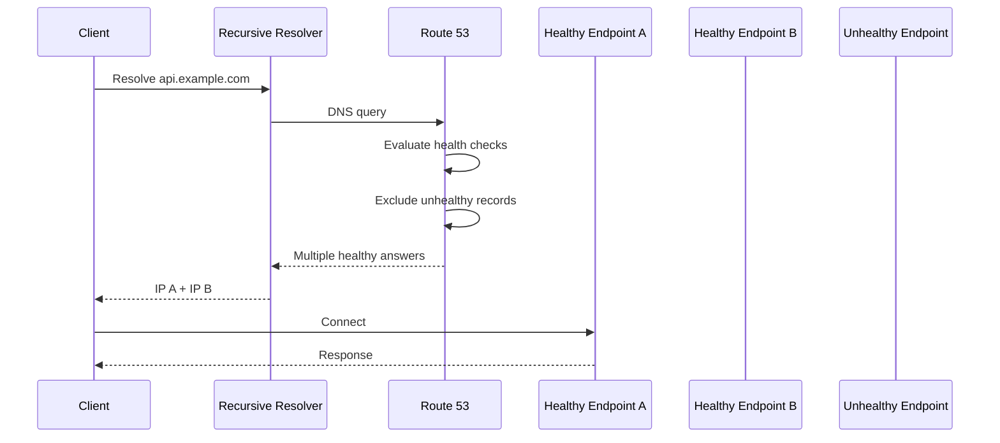

# 10- Multivalue Answer Routing

## Overview

Amazon Route 53 **multivalue answer routing** returns multiple healthy records for the same DNS name. It is designed to improve availability by allowing DNS responses to contain several IP addresses or endpoints, with Route 53 capable of excluding unhealthy records from the response.

The key mental model is:

```text
Multivalue answer routing
        │
        ├── Multiple records
        │
        ├── Health evaluation
        │
        └── Return multiple healthy answers
```

It is useful when a service has multiple independently reachable endpoints and the client can attempt another returned address when one endpoint is unavailable.

Multivalue routing is not the same as:

- Load balancing
- Weighted routing
- Failover routing
- Latency-based routing
- Application-level retries

It is primarily a **DNS-level availability mechanism**.

---

## Why Multivalue Answer Routing Exists

A traditional DNS name might resolve to one endpoint:

```text
api.example.com
        │
        ▼
10.0.10.20
```

If that endpoint becomes unavailable, clients may continue receiving the same address until DNS caching and health-based behavior cause the answer to change.

With multivalue routing:

```text
api.example.com
        │
        ├── 10.0.10.20
        ├── 10.0.20.20
        └── 10.0.30.20
```

A client can receive multiple healthy addresses.

If one endpoint fails, the client can potentially connect to another returned address.

This can provide a simple availability mechanism for services that expose multiple independent endpoints.

---

## How Multivalue Answer Routing Works

A simplified flow is:



Route 53 evaluates the health of records that have associated health checks and returns multiple healthy values.

The DNS response is therefore conceptually:

```text
api.example.com

A:
    203.0.113.10
    203.0.113.20
    203.0.113.30
```

The client or resolver receives multiple answers rather than a single selected endpoint.

---

## What Multivalue Answer Routing Returns

For a multivalue routing policy, Route 53 can return multiple values associated with the DNS name.

A common example is:

```text
api.example.com
    │
    ├── 203.0.113.10
    ├── 203.0.113.20
    ├── 203.0.113.30
    └── 203.0.113.40
```

The important distinction is that Route 53 is not necessarily selecting one endpoint and hiding the others.

Instead, the DNS response can contain several healthy answers.

AWS documents multivalue answer routing as a way to configure Route 53 to return multiple values and use health checks to remove unhealthy resources from the DNS response.

---

## Health Checks

Health checks are central to the production usefulness of multivalue routing.

Consider:

```text
Endpoint A → Healthy
Endpoint B → Healthy
Endpoint C → Unhealthy
Endpoint D → Healthy
```

Route 53 can return:

```text
A
B
D
```

instead of:

```text
A
B
C
D
```

This prevents Route 53 from intentionally advertising an endpoint that its health-check configuration considers unhealthy.

A useful mental model is:

```text
Configured endpoints
        │
        ▼
Health evaluation
        │
        ├── Healthy ──────► Candidate
        │
        └── Unhealthy ────► Excluded
                                │
                                ▼
                       DNS response
```

---

## What Route 53 Health Checks Actually Mean

A Route 53 health check represents an external health signal.

Depending on the configuration, Route 53 can evaluate:

- HTTP
- HTTPS
- TCP
- Other supported health-check configurations
- Calculated health checks
- CloudWatch-based health signals through supported mechanisms

The health check should represent whether the endpoint is capable of serving the traffic that DNS is directing toward it.

For an API endpoint, checking only whether TCP port `443` is open may not be sufficient.

A better health endpoint might verify application readiness:

```text
GET /health/ready

200 OK
```

But avoid putting expensive dependency checks into a DNS health endpoint.

---

## Liveness vs Readiness

A common production mistake is using an overly shallow health check.

For example:

```text
TCP 443 open
```

does not prove:

```text
Application can serve requests
```

A backend service may have:

- A running process
- An open port
- A broken database connection
- A failed dependency
- An overloaded worker pool

Therefore, distinguish between:

```text
Liveness
    = Is the process alive?

Readiness
    = Can this endpoint accept production traffic?
```

For DNS routing, the health signal should generally be aligned with **traffic-serving readiness**, while avoiding excessive dependency coupling.

---

## Multivalue Answer Routing vs Simple Routing

These policies have different purposes.

| Characteristic | Simple | Multivalue |
|---|---|---|
| Multiple records | Not the routing-policy mechanism | Yes |
| Health-aware routing | Limited | Yes, through health checks |
| Multiple answers returned | No policy-level selection | Yes |
| Primary use | Single endpoint configuration | Multiple healthy endpoints |
| Client can receive several values | Not the defining behavior | Yes |
| Availability strategy | Minimal | Improved through multiple healthy endpoints |

Simple routing is appropriate when one DNS record is sufficient.

Multivalue routing is useful when multiple independently reachable resources should be returned.

---

## Multivalue Answer Routing vs Weighted Routing

These are commonly confused.

### Weighted Routing

Weighted routing answers:

> Which resource should receive the configured proportion of DNS responses?

For example:

```text
API A → 90
API B → 10
```

The weights express relative traffic distribution.

### Multivalue Routing

Multivalue routing answers:

> Which healthy values should be included in the DNS response?

Conceptually:

```text
API A ──┐
API B ──┼──► DNS response
API C ──┘
```

The purpose is not to express a `90/10` traffic split.

| Requirement | Routing Policy |
|---|---|
| Return multiple healthy endpoints | Multivalue |
| Send approximately 90/10 traffic | Weighted |
| Primary/standby | Failover |
| Lowest expected latency | Latency-based |
| Geographic rules | Geolocation |
| Geographic proximity and bias | Geoproximity |

---

## Multivalue Answer Routing vs Failover Routing

Failover routing defines a primary and secondary relationship:

```text
Primary
   │
   X unhealthy
   │
   ▼
Secondary
```

Multivalue routing does not fundamentally define:

```text
Primary
Secondary
```

Instead, it can expose several healthy endpoints:

```text
A ──┐
B ──┼──► DNS response
C ──┘
```

This makes multivalue routing more appropriate when multiple resources are expected to serve traffic concurrently.

Use failover when the business requirement is explicitly:

> Use this primary resource unless it becomes unhealthy, then use the secondary.

---

## Multivalue Answer Routing vs Load Balancing

This is one of the most important interview distinctions.

Multivalue routing is **not a replacement for a load balancer**.

A load balancer can:

- Accept connections
- Distribute requests
- Perform connection management
- Perform health checks
- Apply routing rules
- Maintain backend target state
- Support application-layer behavior

DNS operates earlier:

```text
Client
   │
   ▼
DNS resolution
   │
   ▼
Multiple addresses
   │
   ▼
Client selects/connects
   │
   ▼
Application endpoint
```

A load balancer operates after DNS resolution:

```text
Client
   │
   ▼
DNS
   │
   ▼
Load Balancer
   │
   ├── Backend A
   ├── Backend B
   └── Backend C
```

Therefore, multivalue routing does not provide the same control as ALB, NLB, or another application/network load-balancing layer.

---

## Client Behavior Matters

A subtle but important issue is that DNS returns multiple values, but the **client ultimately determines how those values are used**.

For example:

```text
DNS response:

10.0.0.10
10.0.0.20
10.0.0.30
```

The client may:

- Try the first address
- Select an address according to its resolver/network stack
- Retry another address after connection failure
- Cache the result
- Behave differently depending on the language/runtime/library

Therefore:

> Returning multiple DNS answers does not guarantee that every client will distribute requests evenly across every address.

This is one reason multivalue routing should not be treated as deterministic load balancing.

---

## DNS Resolver Caching

DNS responses are cached.

The request flow is:

```text
Client
  │
  ▼
Recursive Resolver
  │
  │ cache hit?
  ├──────────────► Yes → Return cached answer
  │
  ▼
Route 53
  │
  ▼
Health evaluation
  │
  ▼
Multiple answers
```

If an endpoint becomes unhealthy, clients or recursive resolvers may still have cached DNS information.

The exact behavior depends on:

- TTL
- Resolver caching
- Client caching
- Application DNS behavior
- Existing connections

Therefore:

```text
Health check
    ≠
Instant client migration
```

---

## TTL and Availability

TTL is a trade-off.

A shorter TTL can allow DNS changes to propagate more quickly:

```text
Short TTL
   │
   ├── Faster DNS changes
   └── More DNS queries
```

A longer TTL provides more caching:

```text
Long TTL
   │
   ├── Fewer DNS queries
   └── Slower propagation of changes
```

Do not assume that a low TTL makes DNS an instantaneous failover mechanism.

Existing clients and connections may continue using previously resolved addresses.

---

## Production Architecture

A common architecture is:

```text
                         api.example.com
                                │
                              Route 53
                                │
                     Multivalue Answers
                                │
               ┌────────────────┼────────────────┐
               │                │                │
             ALB A            ALB B            ALB C
               │                │                │
             API A            API B            API C
               │                │                │
              DB A             DB B             DB C
```

However, if each endpoint is already an ALB, the need for multivalue routing should be evaluated carefully.

Often the architecture can instead be:

```text
api.example.com
       │
       ▼
Route 53
       │
       ▼
Regional / Global Routing
       │
       ▼
ALB
       │
       ├── API instance
       ├── API instance
       └── API instance
```

The routing policy should solve a specific architectural requirement rather than simply adding another DNS feature.

---

## Backend Example

Suppose a FastAPI service is independently deployed to three endpoints:

```text
api-a.example.com
api-b.example.com
api-c.example.com
```

The public endpoint is:

```text
api.example.com
```

Route 53 can return multiple healthy addresses associated with the public name.

The application still uses a normal URL:

```python
import httpx

response = httpx.get(
    "https://api.example.com/orders",
    timeout=5.0,
)

response.raise_for_status()
```

The application does not need to know which endpoint Route 53 selected.

This is useful when DNS should abstract multiple equivalent service endpoints.

---

## Multivalue Routing With Microservices

Multivalue routing can be relevant to independently deployed service endpoints, but it should not be confused with service discovery.

For example:

```text
orders.example.com
        │
        ▼
Route 53
        │
        ├── endpoint A
        ├── endpoint B
        └── endpoint C
```

This may be acceptable for coarse-grained external service routing.

Inside a Kubernetes cluster, however, Kubernetes Services and service discovery mechanisms are usually more appropriate:

```text
orders-service
       │
       ├── Pod A
       ├── Pod B
       └── Pod C
```

DNS-level routing should be selected according to the network boundary and operational requirement.

---

## Multivalue Routing and Kubernetes

For Kubernetes workloads exposed externally:

```text
Internet
   │
   ▼
Route 53
   │
   ▼
Load Balancer
   │
   ▼
Kubernetes Service
   │
   ├── Pod A
   ├── Pod B
   └── Pod C
```

The Kubernetes service/load balancer already provides backend endpoint distribution.

Adding Route 53 multivalue routing is justified only when there is another independent routing requirement, such as exposing multiple independent regional or network endpoints.

---

## Health Check Design

A production health check should be:

- Fast
- Deterministic
- Cheap
- Representative of serving readiness
- Observable
- Independent enough to avoid cascading failures

Avoid:

```text
/health
   │
   ├── PostgreSQL query
   ├── Redis query
   ├── Kafka request
   ├── External API request
   └── Complex application computation
```

This can cause a dependency failure to make the entire service appear unhealthy even when the service could still safely serve some traffic.

Prefer a deliberately designed endpoint:

```text
/health/ready
      │
      └── Verify only critical serving dependencies
```

The exact checks should reflect the service's failure model.

---

## Health Check Failure Scenario

Suppose:

```text
Endpoint A → Healthy
Endpoint B → Healthy
Endpoint C → Unhealthy
```

Route 53 can return:

```text
A
B
```

instead of:

```text
A
B
C
```

If B later becomes unhealthy:

```text
Endpoint A → Healthy
Endpoint B → Unhealthy
Endpoint C → Unhealthy
```

the available DNS answer set can shrink further.

This means the architecture must still be able to operate with reduced capacity.

---

## Capacity Planning

Multivalue routing does not create capacity.

Suppose:

```text
A → 40% normal capacity
B → 30%
C → 30%
```

If B fails:

```text
A → potentially receives more traffic
C → potentially receives more traffic
```

The surviving endpoints must be capable of handling the increased load.

This creates a production requirement:

> Every endpoint that may remain available during a failure must have enough capacity for the expected failure scenario.

Use:

- Autoscaling
- Load testing
- Capacity planning
- Rate limiting
- Circuit breakers
- Backpressure

where appropriate.

---

## Application-Level Resilience

Multivalue routing works best when application clients are resilient.

A robust client may implement:

```text
DNS resolution
      │
      ▼
Multiple addresses
      │
      ▼
Connection attempt
      │
      ├── Success → Request
      │
      └── Failure
             │
             ▼
        Retry another
        available path
```

However, retries must be designed carefully.

For write operations:

```text
POST /orders
```

blind retries can create duplicate operations.

Use:

- Idempotency keys
- Safe retry policies
- Exponential backoff
- Appropriate retry budgets

when the application requires retry behavior.

---

## Python Client Considerations

A Python application using `httpx` or another HTTP client may rely on the underlying resolver and connection pool behavior.

For example:

```python
import httpx

with httpx.Client(
    timeout=httpx.Timeout(5.0),
) as client:
    response = client.get("https://api.example.com/orders")
    response.raise_for_status()
```

The application should not assume that one DNS resolution automatically means perfect distribution across every returned address.

For critical multi-endpoint systems, test the actual runtime, DNS resolver, HTTP client, connection pooling, and retry behavior together.

---

## gRPC Considerations

gRPC commonly uses long-lived HTTP/2 connections.

This creates an important interaction with DNS:

```text
DNS
 │
 ▼
Multiple addresses
 │
 ▼
gRPC client
 │
 ▼
HTTP/2 connection
 │
 ▼
One selected backend path
```

Once a connection is established, changing the DNS answer does not automatically move that connection to another endpoint.

A production gRPC architecture should therefore consider:

- Resolver behavior
- Connection management
- Retry policy
- Backoff
- Connection lifetime
- Endpoint health
- Load-balancing strategy

Do not assume multivalue DNS provides request-level balancing for gRPC.

---

## Advantages

### Simple Multi-Endpoint Exposure

Multiple endpoints can be represented behind one DNS name.

### Health-Aware Answers

Unhealthy endpoints can be excluded when health checks are configured appropriately.

### Improved Availability

Clients can receive multiple viable endpoints.

### No Central Load Balancer Required

For suitable architectures, DNS can provide endpoint-level distribution without introducing another load-balancing layer.

### Useful for Independent Resources

It can work well when endpoints are independently reachable and equivalent.

---

## Limitations

### Not a Load Balancer

It does not provide application-level request distribution.

### Client Behavior Varies

Clients and resolvers may handle multiple answers differently.

### DNS Caching Delays Changes

Cached answers may remain in use.

### Existing Connections Persist

Changing DNS does not move established connections.

### No Guaranteed Even Distribution

Multiple DNS values do not imply equal request distribution.

### Health Checks Are External Signals

A health check may not perfectly represent application behavior.

### Capacity Must Be Planned

Removing unhealthy endpoints can increase load on remaining endpoints.

---

## Security Considerations

Multivalue routing does not replace security controls.

Production endpoints should still use:

- TLS
- Authentication
- Authorization
- WAF where appropriate
- Network security controls
- Rate limiting
- Application validation

Do not expose sensitive internal endpoints through public DNS simply because multivalue routing can represent multiple addresses.

Also ensure that health-check endpoints do not expose sensitive information.

Prefer:

```text
GET /health/ready
200 OK
```

over returning internal infrastructure details such as:

```json
{
  "database": "postgres-prod.internal",
  "redis": "redis-prod.internal",
  "kafka": "kafka-prod.internal"
}
```

---

## Monitoring and Observability

Monitor the system at multiple layers.

### Route 53

Monitor:

- Health-check status
- DNS record changes
- Query volume
- Routing configuration
- Hosted-zone changes

### Application

Monitor:

- Request rate
- Error rate
- p50/p95/p99 latency
- Saturation
- Connection failures
- Regional traffic
- Endpoint-specific traffic

### Infrastructure

Monitor:

- CPU
- Memory
- Network utilization
- Load balancer health
- Autoscaling events
- Connection counts

A useful dashboard might look like:

| Endpoint | Traffic | Error Rate | p95 | Health |
|---|---:|---:|---:|---|
| Endpoint A | 38% | 0.2% | 120 ms | Healthy |
| Endpoint B | 34% | 0.3% | 135 ms | Healthy |
| Endpoint C | 28% | 0.1% | 110 ms | Healthy |

The exact traffic percentages are not guaranteed by multivalue routing and should be treated as observed behavior rather than contractual distribution.

---

## Troubleshooting

### Endpoint Is Not Returned

Check:

1. Route 53 record configuration.
2. Associated health check.
3. Health-check status.
4. DNS response using `dig`.
5. TTL and resolver caching.
6. Whether the endpoint is actually reachable.

Example:

```bash
dig api.example.com A
```

Check the response section:

```text
;; ANSWER SECTION:
api.example.com. 60 IN A 203.0.113.10
api.example.com. 60 IN A 203.0.113.20
api.example.com. 60 IN A 203.0.113.30
```

If one configured endpoint is missing, verify whether Route 53 considers its associated health check unhealthy.

---

## Unexpected Traffic Distribution

Do not assume:

```text
3 DNS answers
=
33.3% traffic each
```

DNS answers are not a deterministic load-balancing mechanism.

Investigate:

- Recursive resolver behavior
- Client behavior
- Connection reuse
- HTTP keep-alive
- gRPC connection persistence
- DNS caching
- Network topology
- Endpoint capacity

---

## Endpoint Remains in Client Traffic After Failure

Check:

```text
Health check
     │
     ▼
Route 53
     │
     ▼
DNS response
     │
     ▼
Recursive resolver cache
     │
     ▼
Client DNS cache
     │
     ▼
Existing connection
```

A failed endpoint can continue appearing in client behavior because the client may be using a cached DNS answer or an existing connection.

DNS should not be treated as an instantaneous connection termination mechanism.

---

## Production Best Practices

### Use Multivalue Routing for the Right Problem

Use it when multiple healthy endpoints should be exposed through DNS.

Do not use it simply because the system needs load balancing.

### Make Endpoints Independently Useful

Each returned endpoint should be capable of serving the expected request independently.

### Use Meaningful Health Checks

Health checks should reflect whether the endpoint can safely receive traffic.

### Plan for Endpoint Failure

Calculate capacity assuming one or more endpoints may be unavailable.

### Test Real Client Behavior

Test:

- Browsers
- Python clients
- JVM clients
- Go clients
- gRPC clients

when those runtimes are part of the production architecture.

### Manage DNS With IaC

Use:

- Terraform
- CloudFormation
- CDK
- Another approved infrastructure-as-code system

Avoid undocumented manual changes.

### Monitor Before and After Changes

Track:

- DNS behavior
- Endpoint traffic
- Errors
- Latency
- Health-check state
- Capacity

---

## Common Mistakes

### Assuming Multivalue Means Round-Robin

**Incorrect:**

> Route 53 sends one request to each endpoint in rotation.

**Correct:**

Multivalue routing returns multiple DNS values. Client and resolver behavior determines how those values are subsequently used.

---

### Treating It as a Load Balancer

**Incorrect:**

> Route 53 will distribute HTTP requests evenly across the returned IPs.

**Correct:**

DNS operates at name-resolution time. A load balancer operates on connections or requests after DNS resolution.

---

### Assuming Health Checks Terminate Existing Connections

Health checks influence future DNS responses. They do not forcibly terminate already-established TCP or HTTP connections.

---

### Assuming All Clients Use All Answers

A DNS response containing multiple addresses does not guarantee that every client will attempt every address.

---

### Ignoring DNS Caching

A resolver can continue returning a cached answer after the underlying endpoint health changes.

---

### Using an Expensive Health Endpoint

A health check that performs many dependency operations can itself become a source of load or cascading failure.

---

### Ignoring Capacity After Failure

If one endpoint disappears, remaining endpoints may receive significantly more traffic.

---

### Using It for Kubernetes Pod Distribution

Kubernetes Services and load balancers are generally better suited for distributing traffic among Pods.

Multivalue routing is more appropriate for independently reachable infrastructure endpoints.

---

## Interview Questions

### What is multivalue answer routing in Route 53?

It is a Route 53 routing policy that can return multiple healthy values for a DNS name, allowing clients to receive several possible endpoints.

### Why would you use multivalue answer routing?

It is useful when multiple independently reachable resources should be exposed under one DNS name and unhealthy resources should be excluded through health checks.

### Is multivalue routing a load balancer?

No. It operates at DNS resolution time and does not provide request-level load-balancing capabilities.

### Does multivalue routing guarantee equal traffic distribution?

No. DNS resolvers, client behavior, connection reuse, caching, and application protocols affect actual traffic distribution.

### How does health checking interact with multivalue routing?

Route 53 can use associated health checks to determine which records are healthy and return healthy values in the DNS response.

### What happens if one endpoint becomes unhealthy?

The unhealthy endpoint can be removed from the set of values returned by Route 53, assuming the record's health-check configuration correctly detects the failure.

### Does an existing connection move to another endpoint when health changes?

No. DNS does not migrate existing TCP, HTTP, HTTP/2, or gRPC connections.

### How is multivalue routing different from weighted routing?

Weighted routing controls the relative weight assigned to records. Multivalue routing returns multiple healthy values rather than implementing a percentage-based traffic split.

### How is multivalue routing different from failover routing?

Failover defines primary and secondary behavior. Multivalue routing exposes multiple healthy endpoints concurrently.

### Can multivalue routing replace an ALB?

Not generally. It does not provide application-level load balancing, connection management, target selection, or Layer 7 routing.

### Does returning three IP addresses mean each receives one-third of the traffic?

No. DNS answer distribution is not equivalent to deterministic request distribution.

### Why is client behavior important?

Because Route 53 returns DNS answers, while the client and resolver determine how those addresses are cached, selected, retried, and connected to.

### What should a health endpoint check?

It should provide a fast and meaningful signal that the endpoint is ready to serve traffic without creating expensive dependency checks or cascading failures.

### Is multivalue routing useful with gRPC?

It can be useful for exposing multiple endpoints, but gRPC's long-lived HTTP/2 connections mean DNS-level multiple answers should not be confused with request-level load balancing.

---

## Interview Traps

| Trap | Correct Answer |
|---|---|
| Multivalue routing means round-robin | No |
| Three returned IPs guarantee 33/33/33 traffic | No |
| Multivalue routing is a load balancer | No |
| Health checks terminate existing connections | No |
| DNS changes immediately migrate all clients | No |
| All clients must use every returned IP | No |
| Multivalue routing guarantees equal traffic | No |
| Weighted routing and multivalue routing are equivalent | No |
| Multivalue routing provides primary/secondary semantics | No |
| DNS health checks guarantee application correctness | No |
| Multivalue routing removes the need for capacity planning | No |
| Multivalue routing is ideal for Kubernetes Pod-level balancing | Usually no |
| Existing gRPC connections move when DNS changes | No |
| Lower TTL guarantees instant failover | No |
| A TCP-open health check always proves application readiness | No |

---

## When to Use Multivalue Routing

Multivalue answer routing is a good fit when:

- Several endpoints can independently serve the same application.
- Clients can handle multiple DNS answers.
- DNS-level endpoint abstraction is desirable.
- Health checks can identify endpoints that should be removed from DNS answers.
- The architecture does not require deterministic request-level load balancing.

Typical examples include:

```text
Public API
    │
    ▼
Route 53
    │
    ├── Endpoint A
    ├── Endpoint B
    └── Endpoint C
```

It is less appropriate when the requirement is:

```text
Exactly 80% → A
Exactly 20% → B
```

Use weighted routing for that type of routing intent.

It is also less appropriate when the requirement is:

```text
Distribute every HTTP request across backend instances.
```

Use an appropriate load balancer or application-level mechanism instead.

---

## Decision Guide

```text
What problem are you solving?
             │
             ├── Multiple healthy DNS values
             │       └── Multivalue
             │
             ├── Percentage-based DNS distribution
             │       └── Weighted
             │
             ├── Primary/secondary failover
             │       └── Failover
             │
             ├── Request-level distribution
             │       └── Load Balancer
             │
             └── Kubernetes Pod distribution
                     └── Kubernetes Service / Load Balancer
```

The senior-level decision is to recognize that DNS routing and request-level traffic management solve different problems.

---

## Key Takeaways

- Multivalue answer routing returns **multiple DNS values** for a name.
- Route 53 can use health checks to exclude unhealthy records from the answer set.
- It is primarily a **DNS-level availability and endpoint-selection mechanism**.
- It is **not a load balancer**.
- Multiple returned IP addresses do not guarantee equal traffic distribution.
- Client, resolver, DNS caching, connection reuse, and protocol behavior affect actual traffic.
- DNS operates before the application connection is established.
- Existing TCP, HTTP, HTTP/2, WebSocket, and gRPC connections are not automatically migrated when DNS answers change.
- Weighted routing is better when the requirement is proportional traffic distribution.
- Failover routing is better when the requirement is primary/secondary behavior.
- Load balancers are better for request-level traffic distribution.
- Kubernetes Services are generally better for distributing traffic among Kubernetes Pods.
- Health checks should represent meaningful serving readiness without introducing expensive dependency checks.
- Remaining endpoints must have sufficient capacity to handle failures.
- DNS caching means health changes are not necessarily visible to every client immediately.
- Test actual client and runtime behavior instead of assuming that DNS semantics imply application traffic semantics.
- Monitor DNS configuration, health checks, endpoint traffic, errors, latency, and capacity together.
- Manage production Route 53 configuration through Infrastructure as Code.
- The key interview distinction is: **multivalue routing returns multiple healthy DNS answers; it does not perform deterministic request-level load balancing.**