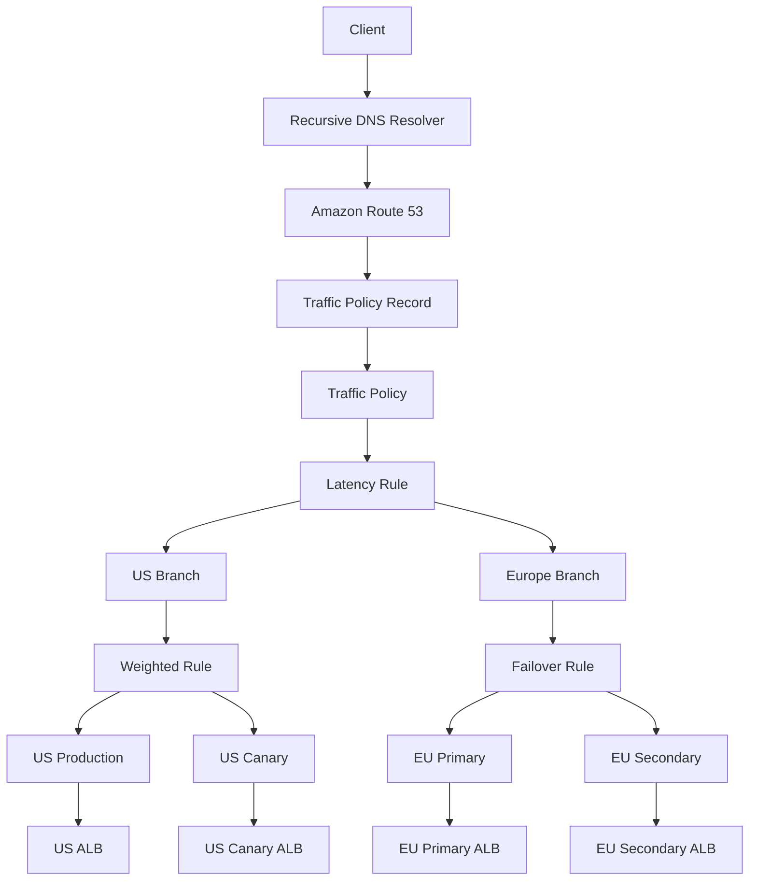

# 11- Traffic Flow

## Overview

Amazon Route 53 **Traffic Flow** is a feature for designing and managing complex DNS routing configurations as reusable, versioned **traffic policies**.

A normal Route 53 record can already use routing policies such as:

- Simple
- Weighted
- Latency-based
- Failover
- Geolocation
- Geoproximity
- Multivalue answer

The problem appears when these policies need to be **combined**.

For example:

```text
User
 │
 ▼
Latency routing
 │
 ├── US
 │    └── Weighted routing
 │         ├── Production → 95%
 │         └── Canary    → 5%
 │
 └── Europe
      └── Failover routing
           ├── Primary
           └── Secondary
```

Managing such a configuration as many independent Route 53 records can become difficult to understand and operate.

Traffic Flow provides a visual and versioned representation of this routing tree.

AWS describes Traffic Flow as a way to simplify large and complex Route 53 configurations by representing related records and routing policies as a traffic policy. :contentReference[oaicite:0]{index=0}

---

## Why Traffic Flow Exists

Simple Route 53 configurations are easy to reason about:

```text
api.example.com
       │
       ▼
ALB
```

A more advanced architecture might require:

```text
api.example.com
       │
       ▼
Latency
 ┌─────┴─────┐
 │           │
US          EU
 │           │
 ▼           ▼
Weighted    Failover
 │           │
 ├─ Prod     ├─ Primary
 └─ Canary   └─ Secondary
```

At this point, the DNS configuration becomes a graph of related records.

Without Traffic Flow, engineers must understand many individual record sets and their relationships.

Traffic Flow provides:

- A visual editor
- Traffic policy definitions
- Policy versioning
- Reusable routing configurations
- Automatic creation and updating of related records
- Rollback to previous policy versions

AWS states that a traffic policy can represent dozens or hundreds of records and that Traffic Flow can automatically create the corresponding records when a policy record is created. :contentReference[oaicite:1]{index=1}

---

## Core Mental Model

The most important distinction is:

```text
Traffic policy
      │
      ▼
Routing logic
      │
      ├── Latency
      ├── Weighted
      ├── Failover
      ├── Geolocation
      ├── Geoproximity
      └── Endpoints
```

A **traffic policy** describes how DNS routing should work.

A **policy record** associates a particular traffic policy version with a DNS name in a hosted zone.

Conceptually:

```text
Traffic Policy
      │
      │ version
      ▼
Policy Record
      │
      │ associated with
      ▼
Hosted Zone
      │
      ▼
DNS Name
```

AWS distinguishes between the reusable traffic policy and the policy record that applies a specific version of that policy to a DNS name. :contentReference[oaicite:2]{index=2}

---

## Traffic Flow Architecture

A simplified architecture looks like this:



The important point is that Traffic Flow is **DNS routing configuration**, not a request-processing proxy.

Traffic Flow does not sit in the HTTP request path.

---

## Traffic Flow vs Route 53 Routing Policies

A routing policy answers:

> How should Route 53 respond to a DNS query?

Traffic Flow answers a different operational question:

> How do I manage a complex tree of multiple routing policies and records?

| Concept | Purpose |
|---|---|
| Simple routing | Select a single/simple DNS response |
| Weighted routing | Distribute DNS responses using relative weights |
| Latency routing | Route based on lowest latency |
| Failover routing | Active-passive DNS failover |
| Geolocation routing | Route based on user's geographic location |
| Geoproximity routing | Route based on resource/user proximity and optional bias |
| Multivalue answer | Return multiple healthy values |
| Traffic Flow | Compose and manage complex routing configurations |

Traffic Flow therefore should not be thought of as another independent routing algorithm.

It is a **management and composition mechanism for complex Route 53 routing configurations**.

---

## Traffic Policies

A traffic policy is a versioned configuration describing:

- DNS record type
- Endpoints
- Routing rules
- Relationships between rules
- Health-check references
- Routing behavior

A policy can represent a routing tree such as:

```text
Latency
├── Region A
│   └── Weighted
│       ├── Production
│       └── Canary
└── Region B
    └── Failover
        ├── Primary
        └── Secondary
```

This is much easier to reason about as one logical object than as a collection of unrelated record sets.

---

## Traffic Policy Versions

Traffic Flow supports versioning.

When a traffic policy is edited, Route 53 creates a new version rather than overwriting the existing version. Previous versions remain available until deleted. AWS currently documents a default maximum of **1,000 versions per traffic policy**. :contentReference[oaicite:3]{index=3}

Conceptually:

```text
Traffic Policy
      │
      ├── Version 1
      ├── Version 2
      ├── Version 3
      └── Version 4 ← Current candidate
```

This is particularly useful for DNS configurations because a routing change can have a large blast radius.

For example:

```text
Version 12
    │
    ├── US → Production
    └── EU → Production

Version 13
    │
    ├── US → Production + Canary
    └── EU → Production
```

If version 13 does not behave as expected, you can update the policy record to use an earlier version.

AWS explicitly supports using previous traffic policy versions for rollback. :contentReference[oaicite:4]{index=4}

---

## Policy Versioning and Production Safety

DNS changes are infrastructure changes.

A production change should therefore follow the same discipline as application deployment:

```text
Design
  │
  ▼
Review
  │
  ▼
Create new policy version
  │
  ▼
Validate
  │
  ▼
Apply
  │
  ▼
Observe
  │
  ├── Healthy → Keep
  │
  └── Problem → Roll back
```

This is much safer than manually modifying many related DNS records independently.

---

## Policy Records

A **policy record** connects a traffic policy version to an actual DNS name.

For example:

```text
Traffic Policy
     │
     ▼
Version 7
     │
     ▼
Policy Record
     │
     ├── Hosted Zone: example.com
     ├── DNS Name: api.example.com
     └── TTL: 60
```

The policy record identifies:

- Traffic policy
- Policy version
- Hosted zone
- DNS name
- TTL

AWS documentation describes the policy record as the mechanism used to route Internet traffic according to the selected traffic policy version. :contentReference[oaicite:5]{index=5}

---

## Traffic Policy vs Policy Record

This distinction is important in interviews.

| Traffic Policy | Policy Record |
|---|---|
| Describes routing configuration | Applies configuration to a DNS name |
| Versioned | References a specific policy version |
| Reusable | Associated with a hosted zone and DNS name |
| Contains routing tree | Represents the entry point into that tree |
| Can be reused | Creates the actual DNS routing configuration |

Think:

```text
Traffic Policy
= "How should routing work?"

Policy Record
= "Apply this routing policy here."
```

---

## Example: Multi-Region Backend

Suppose a company operates an API in:

```text
us-east-1
eu-west-1
ap-southeast-1
```

Each region has an ALB:

```text
US ALB
EU ALB
APAC ALB
```

A basic latency-based configuration might be:

```text
api.example.com
       │
       ▼
Latency Routing
       │
       ├── US
       ├── EU
       └── APAC
```

A more complex design could be:

```text
api.example.com
       │
       ▼
Geoproximity
       │
       ├── Americas
       │     └── Weighted
       │          ├── Production 95%
       │          └── Canary     5%
       │
       ├── Europe
       │     └── Failover
       │          ├── Primary
       │          └── Secondary
       │
       └── Asia
             └── Production
```

This is where Traffic Flow becomes useful.

---

## Combining Routing Policies

One of the major strengths of Traffic Flow is that routing policies can be composed into a tree.

For example:

```text
Geographic decision
        │
        ├── US
        │    │
        │    ▼
        │  Weighted
        │    ├── 95% Production
        │    └── 5% Canary
        │
        └── EU
             │
             ▼
           Failover
             ├── Primary
             └── Secondary
```

This allows the routing decision to be expressed as a hierarchy.

The senior-level concern is not simply knowing that these policies exist, but understanding **how their composition affects the final DNS answer**.

---

## Request Resolution Flow

Consider:

```text
api.example.com
```

A client starts with:

```text
Client
   │
   ▼
Recursive Resolver
   │
   ▼
Route 53
```

Route 53 evaluates the traffic-policy tree.

For example:

```text
Traffic Policy
     │
     ▼
Geoproximity
     │
     ▼
US branch
     │
     ▼
Weighted
     │
     ├── Production
     └── Canary
```

The resulting DNS answer may point toward the selected endpoint.

The important distinction is:

```text
DNS routing decision
        │
        ▼
DNS answer
        │
        ▼
Client connects to endpoint
        │
        ▼
HTTP/gRPC request
```

Traffic Flow does not inspect the HTTP request itself.

---

## Traffic Flow Is Not a Load Balancer

This is a common interview trap.

Traffic Flow operates during DNS resolution:

```text
DNS query
   │
   ▼
Route 53
   │
   ▼
DNS answer
```

A load balancer operates after resolution:

```text
Client
   │
   ▼
DNS
   │
   ▼
ALB / NLB
   │
   ├── Backend A
   ├── Backend B
   └── Backend C
```

Traffic Flow does not:

- Inspect HTTP headers
- Route individual HTTP requests
- Maintain TCP connections
- Maintain HTTP/2 streams
- Perform application-level retries
- Replace ALB/NLB behavior

---

## Traffic Flow and Health Checks

Traffic Flow can incorporate health-check-aware routing.

For example:

```text
Weighted
   │
   ├── Production
   │      │
   │      └── Health Check
   │
   └── Canary
          │
          └── Health Check
```

Health checks can influence which resources participate in the DNS routing decision.

However, a health check is still an external signal.

It does not prove that:

```text
Every request will succeed
```

A health check should therefore be designed carefully.

---

## Health Check Design

A production health check should answer a meaningful question:

> Should this endpoint continue receiving traffic?

Avoid an unnecessarily expensive health check:

```text
/health
   │
   ├── PostgreSQL
   ├── Redis
   ├── Kafka
   ├── External API
   └── Multiple expensive queries
```

A failure in an optional dependency could incorrectly remove an otherwise healthy endpoint from DNS routing.

Instead, define health semantics based on the service's actual serving requirements.

For example:

```text
/health/ready
      │
      └── Critical readiness checks
```

---

## Traffic Flow and TTL

TTL remains important because Traffic Flow is DNS-based.

Suppose:

```text
TTL = 60 seconds
```

A resolver may cache the DNS answer for approximately the configured TTL.

If the traffic policy changes:

```text
Version 5
   │
   ▼
Version 6
```

clients do not necessarily observe the new routing behavior immediately.

The actual propagation behavior is affected by:

- Resolver caching
- Client DNS caching
- Application DNS behavior
- Existing connections
- TTL

AWS notes that TTL determines how long recursive resolvers cache information, and longer TTLs reduce Route 53 query volume while making changes take longer to take effect. :contentReference[oaicite:6]{index=6}

---

## Traffic Flow and gRPC

gRPC introduces an important operational consideration.

A typical flow is:

```text
DNS
 │
 ▼
Route 53
 │
 ▼
Endpoint
 │
 ▼
HTTP/2 connection
 │
 └── Multiple RPCs
```

Once the gRPC client establishes a connection, changing the DNS response does not automatically move existing RPC traffic to another endpoint.

Therefore, Traffic Flow should not be interpreted as a request-level gRPC load-balancing mechanism.

For production gRPC systems, also consider:

- Resolver behavior
- Connection lifecycle
- Client-side load balancing
- Retry policy
- Backoff
- Health checking
- Connection draining

---

## Traffic Flow and HTTP APIs

For Django or FastAPI services, the typical architecture is:

```text
Client
  │
  ▼
Route 53 Traffic Flow
  │
  ▼
ALB
  │
  ▼
FastAPI / Django
  │
  ├── Redis
  ├── PostgreSQL
  └── Kafka
```

Traffic Flow can determine which regional or environmental endpoint the client reaches.

The application itself remains unaware of the DNS routing decision.

---

## Traffic Flow for Canary Releases

A useful production pattern is:

```text
api.example.com
       │
       ▼
Weighted Routing
       │
       ├── Production 99%
       └── Canary      1%
```

This can be useful for DNS-level canary testing.

However, DNS-based canaries have important limitations:

- DNS caching affects traffic distribution.
- Resolver behavior affects actual proportions.
- Existing connections remain established.
- Traffic is not necessarily distributed exactly according to the configured weights.

For precise request-level canarying, an application-aware or load-balancer-based approach may provide better control.

---

## Traffic Flow for Multi-Region Architecture

Consider:

```text
                 api.example.com
                        │
                        ▼
                  Route 53
                        │
              ┌─────────┴─────────┐
              │                   │
          Americas              Europe
              │                   │
             ALB                 ALB
              │                   │
         API cluster        API cluster
```

A more sophisticated configuration could use:

```text
Geoproximity
     │
     ├── Americas
     │      └── Failover
     │           ├── Primary
     │           └── Secondary
     │
     └── Europe
            └── Weighted
                 ├── Production
                 └── Canary
```

Traffic Flow makes this routing tree explicit and manageable.

---

## Traffic Flow and Disaster Recovery

Traffic Flow can be useful in disaster recovery designs where DNS decisions need to change across multiple layers.

For example:

```text
Primary Region
     │
     ├── Production
     └── Canary

          ↓ Failure

Secondary Region
     │
     ├── Production
     └── Standby
```

However, DNS routing is not a complete disaster-recovery strategy.

You must also consider:

- Database replication
- Data consistency
- Backup recovery
- Infrastructure availability
- Secrets
- Configuration
- Queue state
- Object storage
- Dependency availability
- Capacity in the recovery region

DNS can redirect traffic, but it cannot make the underlying application state available.

---

## Versioned Rollback

One of Traffic Flow's strongest operational features is version-based rollback.

Suppose:

```text
Version 20
   │
   └── Stable production routing
```

A new version is created:

```text
Version 21
   │
   └── New regional routing
```

If monitoring shows unexpected behavior:

```text
Version 21
   │
   └── Errors increase
          │
          ▼
       Roll back
          │
          ▼
Version 20
```

AWS specifically supports updating a traffic policy record to use an earlier policy version, allowing previous routing configurations to be restored. :contentReference[oaicite:7]{index=7}

---

## Policy Versioning vs Git Versioning

Traffic Flow versioning should not replace Infrastructure as Code or source control.

A production workflow should ideally have:

```text
Git
 │
 ├── Traffic policy definition
 ├── Review
 └── Change history
       │
       ▼
CI/CD
       │
       ▼
AWS Route 53
       │
       ▼
Traffic Policy Version
```

Route 53's built-in versions are useful for operational rollback, while Git provides:

- Code review
- Auditability
- Change history
- Collaboration
- Automated validation
- Deployment automation

Use both when appropriate.

---

## JSON Traffic Policies

Traffic policies can also be represented programmatically as JSON.

AWS supports creating traffic policies through the Route 53 API, AWS SDKs, AWS CLI, and related tooling. :contentReference[oaicite:8]{index=8}

A simplified structure looks conceptually like:

```json
{
  "AWSPolicyFormatVersion": "2015-10-01",
  "RecordType": "A",
  "StartRule": "root",
  "Rules": {
    "root": {
      "RuleType": "latency",
      "Locations": {
        "us-east-1": "us",
        "eu-west-1": "eu"
      }
    }
  }
}
```

The exact JSON structure depends on the routing policy and endpoints being represented.

For production automation, use the AWS API/CLI documentation and validate the policy definition before applying it.

---

## AWS CLI

The AWS CLI can be used to inspect and manage traffic policies.

For example:

```bash
aws route53 list-traffic-policies
```

To retrieve a specific traffic policy version:

```bash
aws route53 get-traffic-policy \
  --id <traffic-policy-id> \
  --version 3
```

AWS exposes traffic policy versions through the Route 53 API and CLI. :contentReference[oaicite:9]{index=9}

For production workflows, avoid embedding account-specific IDs directly into scripts when they can be discovered or injected through deployment configuration.

---

## Inspecting a Policy Before a Change

A useful operational workflow is:

```text
Current DNS
    │
    ▼
Get current policy version
    │
    ▼
Review routing tree
    │
    ▼
Create new version
    │
    ▼
Validate
    │
    ▼
Apply
```

This is particularly important for policies containing nested routing decisions.

A mistake in one branch can affect a large number of users.

---

## Reusing Traffic Policies

Traffic policies can be reused for multiple public hosted zones.

For example:

```text
Traffic Policy
      │
      ├── example.com
      │
      ├── example.org
      │
      └── example.net
```

AWS documents this as a supported Traffic Flow capability. :contentReference[oaicite:10]{index=10}

This is useful when several domains should share the same routing architecture.

However, reuse should be deliberate.

A shared policy means:

```text
One policy change
       │
       ├── Domain A
       ├── Domain B
       └── Domain C
```

A single mistake can therefore have a wider blast radius.

---

## Cost Considerations

Traffic Flow policies themselves can be created without a charge, but **traffic policy records incur monthly charges**. AWS also documents DNS query charges associated with Route 53 usage. :contentReference[oaicite:11]{index=11}

This matters when designing reusable configurations.

For example:

```text
100 domains
   │
   └── 100 policy records
```

may have a different cost profile from:

```text
1 policy record
   │
   └── Multiple aliases/CNAMEs
```

AWS documents using aliases or CNAMEs to reference a policy record as a way to reduce the number of policy records and therefore reduce policy-record charges. :contentReference[oaicite:12]{index=12}

Always verify current Route 53 pricing before finalizing a large deployment.

---

## Operational Limits

Traffic Flow has service quotas.

AWS currently documents:

| Resource | Default quota |
|---|---:|
| Traffic policies | 50 per AWS account |
| Traffic policy versions | 1,000 per traffic policy |
| Traffic policy records | 5 per AWS account |

These quotas can be increased where supported through AWS Service Quotas. :contentReference[oaicite:13]{index=13}

The policy-record quota is particularly important when designing large multi-domain architectures.

Do not design an architecture assuming quotas are infinite.

---

## Security Considerations

Traffic Flow controls DNS behavior, so unauthorized changes can have significant consequences.

An attacker or compromised deployment role that can modify Route 53 routing could potentially redirect users toward an unintended endpoint.

Apply least-privilege IAM permissions.

Separate permissions for:

- Reading Route 53 configuration
- Creating traffic policies
- Updating policy records
- Changing hosted zones
- Managing health checks

Use:

- IAM least privilege
- AWS CloudTrail
- Change review
- Infrastructure as Code
- Protected CI/CD pipelines
- Multi-person approval for high-impact DNS changes

---

## Monitoring and Observability

DNS routing should be monitored alongside application behavior.

Useful signals include:

| Layer | Signals |
|---|---|
| Route 53 | Health-check state, DNS queries, configuration changes |
| Traffic policy | Active version, policy-record changes |
| Load balancer | Healthy targets, request count, latency, 5xx |
| Application | Error rate, latency, saturation |
| Infrastructure | CPU, memory, network |
| Database | Connections, latency, replication health |
| Client | DNS failures, connection failures |

A DNS policy can appear healthy while the application is failing.

For example:

```text
Route 53
  │
  └── Endpoint = Healthy

ALB
  │
  └── Healthy

Application
  │
  └── 500 errors = 40%
```

A health check that only verifies TCP availability may not detect this application-level failure.

---

## Deployment Strategy

A production Traffic Flow deployment should be treated as an infrastructure release.

A strong workflow is:

```text
Developer
   │
   ▼
Git change
   │
   ▼
Code review
   │
   ▼
Validation
   │
   ▼
CI/CD
   │
   ▼
New Traffic Policy Version
   │
   ▼
Controlled deployment
   │
   ▼
Monitoring
   │
   ├── Healthy → Keep
   │
   └── Unhealthy → Rollback
```

Avoid manual console-only changes for critical production routing unless there is an incident-response reason.

---

## Infrastructure as Code

For complex DNS architectures, Infrastructure as Code is strongly recommended.

The repository might contain:

```text
infrastructure/
├── route53/
│   ├── traffic-policy/
│   │   ├── policy.json
│   │   └── variables.tf
│   └── hosted-zones/
│       └── production.tf
└── environments/
    ├── staging/
    └── production/
```

The exact tooling can vary.

Common choices include:

- Terraform
- AWS CloudFormation
- AWS CDK
- AWS CLI/API automation

The important engineering principle is:

> DNS routing configuration should be reproducible and reviewable.

---

## Failure Scenario

Consider:

```text
             Traffic Flow
                  │
          ┌───────┴───────┐
          │               │
        US/East          EU/West
          │               │
       Production       Production
          │               │
        Healthy         Healthy
```

Suppose the US endpoint fails.

A health-check-aware policy can remove or avoid the unhealthy destination according to the configured routing tree.

However:

```text
Health failure
     │
     ▼
Route 53 decision changes
     │
     ▼
New DNS answers
     │
     ▼
Resolver/client cache
     │
     ▼
New connections
```

This is not equivalent to:

```text
Failure
   │
   ▼
Every active connection immediately moves
```

DNS operates through resolution and caching.

---

## Common Mistakes

### Treating Traffic Flow as a Traffic Proxy

Traffic Flow does not proxy requests.

It controls DNS routing.

---

### Confusing Traffic Flow With a Routing Policy

Traffic Flow is the mechanism for managing complex routing configurations.

Policies such as weighted, latency, failover, geolocation, and geoproximity define the actual routing behavior.

---

### Assuming Versioning Is the Same as Deployment Control

Traffic policy versions provide rollback capability, but you still need:

- Review
- Testing
- Deployment controls
- Monitoring
- Access control

---

### Ignoring DNS TTL

A policy can be changed immediately in Route 53 while clients continue using cached DNS answers.

---

### Assuming DNS Routing Equals Request Routing

This is especially dangerous with:

- gRPC
- HTTP/2
- Keep-alive connections
- WebSockets

Existing connections are not automatically redistributed because DNS changes.

---

### Using Complex Traffic Flow When Simple Routing Is Enough

Traffic Flow adds conceptual and operational complexity.

If the architecture is:

```text
api.example.com
      │
      ▼
ALB
```

a simple Route 53 record may be sufficient.

Do not introduce Traffic Flow merely because it exists.

---

### Ignoring Policy-Record Costs

Traffic policies may be free to create, but policy records have monthly charges.

Large multi-domain deployments should account for this.

---

### Creating a Shared Policy Without Considering Blast Radius

Reusing a traffic policy across many domains means one policy change can affect many domains.

---

### Treating Health Checks as Perfect Application Monitoring

A health check is a routing signal, not a complete application-observability system.

---

## Production Design Principles

### Keep the Routing Tree Understandable

Prefer:

```text
Geoproximity
   │
   ├── Region A
   └── Region B
```

over unnecessarily deep policy nesting.

Every additional decision increases operational complexity.

### Define Explicit Failure Semantics

For each branch, answer:

> What happens if this endpoint becomes unhealthy?

### Define Capacity for Failure

If a region disappears:

```text
Region A
   X
   │
   ▼
Region B
```

Region B must have enough capacity to handle the expected additional traffic.

### Version Every Significant Change

Use meaningful descriptions such as:

```text
"Route 15% of US traffic to v2 canary"
```

rather than:

```text
"update"
```

### Monitor the Result, Not Just the Configuration

A successful Route 53 API call does not mean the routing change is operationally correct.

---

## When to Use Traffic Flow

Traffic Flow is appropriate when:

- DNS routing is complex.
- Multiple routing policies need to be composed.
- The routing configuration contains many related records.
- Visual representation improves operational understanding.
- Policy versioning and rollback are valuable.
- The same routing policy should be reused.
- The DNS architecture needs explicit versioned configurations.

It is usually unnecessary when:

```text
One DNS name
   │
   ▼
One ALB
```

can be represented cleanly with a standard Route 53 record.

---

## When Not to Use Traffic Flow

Avoid using Traffic Flow simply because:

- The application has multiple servers.
- You need ordinary load balancing.
- You need HTTP request routing.
- You need Kubernetes Pod distribution.
- You need service-to-service discovery.
- You need exact traffic percentages at request level.

Use the appropriate layer:

| Requirement | Better Mechanism |
|---|---|
| HTTP request balancing | ALB / application load balancer |
| Network connection balancing | NLB |
| Kubernetes Pod distribution | Kubernetes Service / ingress/load balancer |
| Service discovery | Kubernetes DNS / Cloud Map / appropriate discovery system |
| DNS geographic routing | Route 53 routing policies |
| Complex DNS policy composition | Route 53 Traffic Flow |

---

## Interview Questions

### What is Route 53 Traffic Flow?

Traffic Flow is a Route 53 feature for creating and managing complex DNS routing configurations using versioned traffic policies.

### Why does Traffic Flow exist?

It simplifies complex configurations where multiple Route 53 routing policies and records need to be combined and maintained as one logical routing structure.

### What is a traffic policy?

A traffic policy is a versioned definition of DNS routing logic, including rules and endpoints.

### What is a policy record?

A policy record associates a specific traffic policy version with a DNS name in a hosted zone.

### Is Traffic Flow a load balancer?

No. Traffic Flow controls DNS responses. It does not process application requests.

### Can Traffic Flow combine routing policies?

Yes. Complex routing trees can combine policies such as latency, weighted, failover, geolocation, and geoproximity routing.

### Why is versioning useful?

DNS changes can have a large blast radius. Versioning provides a controlled way to create new configurations and roll back to previous versions.

### Can a traffic policy be reused?

Yes. AWS supports using traffic policies with multiple public hosted zones. :contentReference[oaicite:14]{index=14}

### Does Traffic Flow work with private hosted zones?

Traffic Flow is for creating records in **public hosted zones**. :contentReference[oaicite:15]{index=15}

### Does Traffic Flow eliminate DNS caching?

No. DNS responses are still cached according to TTL and resolver behavior.

### Can Traffic Flow instantly move an existing gRPC connection?

No. DNS routing does not migrate an established HTTP/2 connection.

### How should Traffic Flow changes be deployed?

Prefer a version-controlled, reviewed, automated infrastructure workflow with monitoring and rollback capability.

---

## Interview Traps

| Question | Correct Understanding |
|---|---|
| Traffic Flow is another load balancer | False |
| Traffic Flow replaces ALB | False |
| Traffic Flow performs HTTP routing | False |
| Traffic Flow controls DNS routing | True |
| A traffic policy is the same as a policy record | False |
| Policy versions help with rollback | True |
| Traffic Flow removes DNS caching | False |
| Traffic Flow guarantees instant failover | False |
| Traffic Flow can combine routing policies | True |
| Traffic Flow can represent complex routing trees | True |
| Traffic Flow can automatically create related records | True |
| Traffic Flow is intended for public hosted zones | True |
| A successful policy update guarantees application health | False |
| Traffic Flow provides request-level load balancing | False |
| Traffic Flow versioning replaces Git | False |
| Policy records can incur monthly charges | True |

---

## Key Takeaways

- **Traffic Flow is a Route 53 configuration-management and routing-composition feature**, not a request proxy.
- A **traffic policy** defines a routing tree.
- A **policy record** applies a specific traffic policy version to a DNS name.
- Traffic Flow is most valuable when routing configurations become too complex to manage safely as independent records.
- Routing policies such as weighted, latency, failover, geolocation, and geoproximity can be composed into more sophisticated DNS routing trees.
- Traffic policies are versioned, making rollback safer for production DNS changes.
- Traffic Flow does not eliminate DNS caching or TTL behavior.
- Traffic Flow does not replace ALB, NLB, Kubernetes Services, or application-level load balancing.
- DNS routing determines where clients resolve, while load balancing determines how traffic is handled after resolution.
- gRPC and HTTP/2 require special attention because long-lived connections are not automatically redistributed after DNS changes.
- Health checks should provide meaningful traffic-serving signals without becoming expensive or overly dependent on application internals.
- Traffic policies can be reused across multiple public hosted zones, but shared policies increase the potential blast radius of changes.
- Policy records have associated costs, so large deployments should account for the number of policy records.
- Route 53 Traffic Flow has service quotas, including limits on policies, versions, and policy records. :contentReference[oaicite:16]{index=16}
- Production DNS changes should be version-controlled, reviewed, monitored, and reversible.
- The senior-level mental model is: **Traffic Flow manages complex DNS decision trees; it does not manage application requests.**