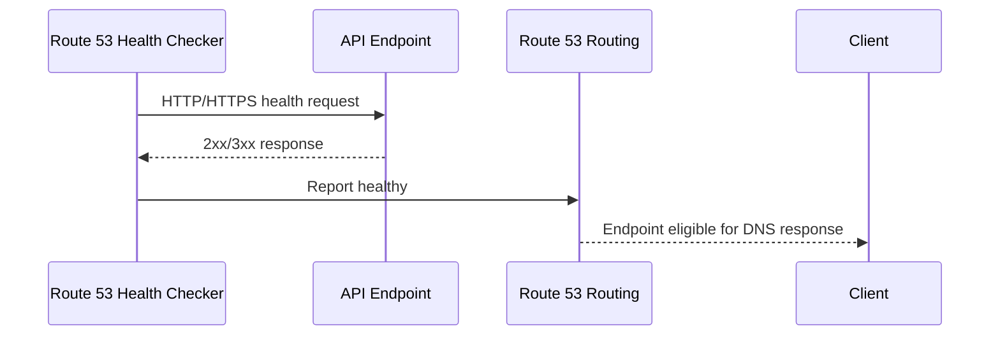
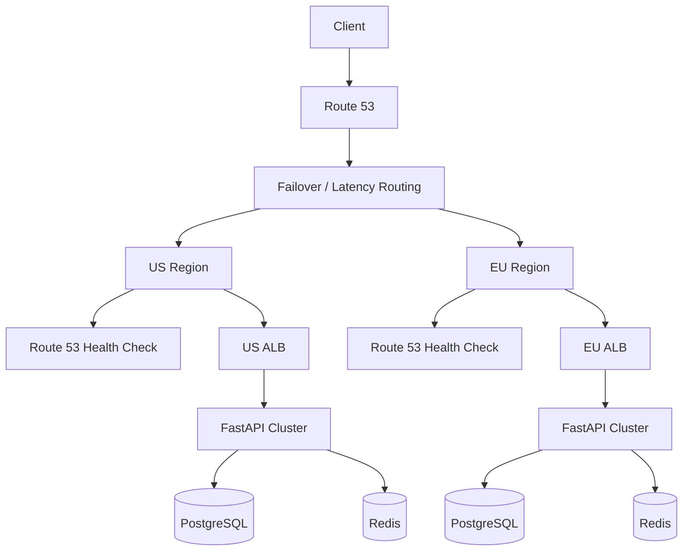

# 12- Health Checks

## Overview

Amazon Route 53 health checks provide an external health signal that Route 53 can use to determine whether an endpoint, another Route 53 health check, a CloudWatch alarm, or a Route 53 Application Recovery Controller routing control is healthy.

Health checks become important when DNS routing must react to failures.

A common production architecture is:

```text
                    Route 53
                       │
                Health-aware routing
                       │
             ┌─────────┴─────────┐
             │                   │
        Primary Region      Secondary Region
             │                   │
             ▼                   ▼
            ALB                 ALB
             │                   │
             ▼                   ▼
        API Cluster          API Cluster
```

If the primary endpoint becomes unhealthy, an appropriate Route 53 routing policy can stop returning that endpoint and direct new DNS resolutions toward another healthy destination.

The critical mental model is:

> A Route 53 health check is a DNS routing signal, not a general-purpose application monitoring system.

It does not move existing TCP connections, HTTP requests, or gRPC streams. It influences future DNS answers.

---

## Why Route 53 Health Checks Exist

Without health-aware DNS routing:

```text
api.example.com
       │
       ▼
Primary ALB
       │
       X
    Failure
```

Route 53 can continue returning the failed endpoint because DNS itself does not inherently know whether the application is serving traffic correctly.

With a health check:

```text
api.example.com
       │
       ▼
Route 53
       │
       ├── Health Check → Healthy
       │
       └── DNS Answer → Primary
```

During failure:

```text
api.example.com
       │
       ▼
Route 53
       │
       ├── Health Check → Unhealthy
       │
       └── DNS Answer → Secondary
```

This is particularly useful with:

- Failover routing
- Weighted routing
- Latency-based routing
- Geolocation routing
- Geoproximity routing
- Multivalue answer routing

Route 53 health checks can also be used independently for monitoring and alerting through CloudWatch.

---

## Health Check Types

Route 53 currently supports several health-check types:

| Type | What it evaluates | Typical use |
|---|---|---|
| HTTP | HTTP endpoint response | Web/API availability |
| HTTPS | HTTPS endpoint response | Secure web/API availability |
| HTTP string match | HTTP response plus body string | Application-level endpoint validation |
| HTTPS string match | HTTPS response plus body string | Secure application-level validation |
| TCP | TCP connection establishment | Network/service availability |
| Calculated | Other Route 53 health checks | Aggregate health |
| CloudWatch metric | CloudWatch alarm state | AWS/internal metrics |
| Recovery Control | Route 53 Application Recovery Controller routing control | Controlled failover |

AWS documents these health-check types in the Route 53 API and Developer Guide. :contentReference[oaicite:0]{index=0}

---

## Endpoint Health Checks

Endpoint health checks directly monitor a resource.

The endpoint can be specified by:

- IP address
- Domain name

For HTTP and HTTPS checks, Route 53 makes an HTTP request and considers the endpoint healthy when the response status is in the `2xx` or `3xx` range. TCP checks validate that a TCP connection can be established. :contentReference[oaicite:1]{index=1}

A simplified request flow is:



For a failed endpoint:

```text
Route 53 Health Checker
          │
          │ request
          ▼
      API Endpoint
          │
          X
      timeout/error
          │
          ▼
    Health = Unhealthy
          │
          ▼
Routing policy excludes endpoint
```

---

## HTTP Health Checks

An HTTP health check validates that Route 53 can:

1. Establish a TCP connection.
2. Send an HTTP request.
3. Receive an HTTP response.
4. Receive a successful HTTP status code.

Route 53 considers HTTP status codes from `200` through `399` healthy for endpoint checks. :contentReference[oaicite:2]{index=2}

A production endpoint might expose:

```text
GET /health
```

or:

```text
GET /ready
```

For a FastAPI service:

```python
from fastapi import FastAPI

app = FastAPI()


@app.get("/health")
async def health() -> dict[str, str]:
    return {"status": "ok"}
```

For a Django application, the same principle applies: expose a lightweight endpoint that can be safely called by the health checker.

The endpoint should be intentionally designed for machine health checking rather than reusing an arbitrary business endpoint.

---

## HTTPS Health Checks

HTTPS health checks work similarly but establish TLS before sending the HTTP request.

```text
Route 53 Health Checker
        │
        ▼
TCP connection
        │
        ▼
TLS handshake
        │
        ▼
HTTPS request
        │
        ▼
HTTP response
```

This allows Route 53 to detect problems such as:

- TCP connectivity failure
- TLS handshake failure
- Certificate-related problems
- HTTP-level failure

AWS currently documents HTTPS health checks as requiring support for TLS versions supported by Route 53's health-check implementation. :contentReference[oaicite:3]{index=3}

For production APIs, HTTPS is generally preferable when the endpoint is publicly exposed.

---

## String Matching Health Checks

A status code alone may not prove that the application is functioning correctly.

For example:

```text
GET /health
HTTP 200
```

could still return:

```text
{"status":"degraded"}
```

A string-matching health check allows Route 53 to inspect the response body for a configured string.

AWS limits the string search to the first **5,120 bytes** of the response body. :contentReference[oaicite:4]{index=4}

For example:

```json
{
  "status": "healthy"
}
```

A configured search string might be:

```text
"healthy"
```

The health decision then becomes:

```text
TCP connection
      │
      ▼
HTTP response
      │
      ├── Status 2xx/3xx
      │
      └── Expected string present
                │
                ▼
             Healthy
```

This is stronger than a pure connectivity check but should still be kept lightweight.

---

## Designing a Good Health Endpoint

A health endpoint should be:

- Cheap
- Deterministic
- Fast
- Safe to call frequently
- Independent of unnecessary dependencies
- Representative of the service's ability to serve traffic

A poor health endpoint might do this:

```text
/health
  │
  ├── PostgreSQL query
  ├── Redis query
  ├── Kafka request
  ├── External API call
  ├── S3 request
  └── Multiple expensive checks
```

This creates a dependency chain:

```text
Route 53
   │
   ▼
/health
   │
   ├── PostgreSQL
   ├── Redis
   └── External API
```

If an optional dependency fails, the entire service may incorrectly appear unhealthy.

A better design separates concerns:

```text
/liveness
    │
    └── Process/application is running

/readiness
    │
    └── Service can serve required traffic

/deep-health
    │
    └── Detailed dependency diagnostics
```

Route 53 should generally use the smallest health signal that accurately represents whether the endpoint should receive traffic.

---

## TCP Health Checks

A TCP health check validates that Route 53 can establish a TCP connection to the endpoint.

Conceptually:

```text
Route 53
   │
   │ TCP SYN
   ▼
Endpoint
   │
   │ SYN/ACK
   ▼
Healthy
```

This is useful when the service is not HTTP-based.

Examples include:

- Custom TCP services
- Certain database/network services
- Non-HTTP infrastructure

However, TCP success does not prove application correctness.

For example:

```text
TCP connection succeeds
        │
        ▼
Process accepts connections
        │
        X
Application internally broken
```

For HTTP APIs, an HTTP/HTTPS health check usually provides a more meaningful signal.

---

## Calculated Health Checks

A calculated health check combines the status of multiple child health checks.

For example:

```text
                 Calculated Health
                        │
             ┌──────────┼──────────┐
             │          │          │
           API-1      API-2      API-3
           Healthy    Healthy   Unhealthy
```

Suppose the configured threshold is:

```text
2 healthy children required
```

Then:

```text
Healthy children = 2
Required         = 2

Result = Healthy
```

If only one child remains healthy:

```text
Healthy children = 1
Required         = 2

Result = Unhealthy
```

AWS describes calculated health checks as a mechanism for determining health based on the number of healthy child checks. :contentReference[oaicite:5]{index=5}

This is useful when the requirement is not:

> Is every endpoint healthy?

but:

> Is enough capacity healthy to continue serving traffic?

---

## Example: Regional Capacity

Suppose a region has three API endpoints:

```text
API-1 → Healthy
API-2 → Healthy
API-3 → Unhealthy
```

A calculated health check can express:

```text
Minimum healthy endpoints = 2
```

This prevents a single instance failure from unnecessarily triggering regional failover.

The architecture becomes:

```text
                    Calculated Check
                          │
              ┌───────────┼───────────┐
              │           │           │
             API-1       API-2       API-3
              │           │           │
            Healthy     Healthy    Unhealthy
              └───────────┬───────────┘
                          │
                    2 healthy
                          │
                          ▼
                       Healthy
```

This is a more sophisticated availability model than simply checking one endpoint.

---

## CloudWatch-Based Health Checks

Route 53 can derive health from a CloudWatch alarm.

The flow becomes:

```text
Application
    │
    ▼
CloudWatch Metric
    │
    ▼
CloudWatch Alarm
    │
    ▼
Route 53 Health Check
    │
    ▼
DNS Routing Decision
```

This is useful when the resource cannot be directly checked from Route 53 or when application/infrastructure metrics provide a better health signal.

For example:

```text
EC2 StatusCheckFailed
        │
        ▼
CloudWatch Alarm
        │
        ▼
Route 53 Health Check
        │
        ▼
Failover Routing
```

AWS supports CloudWatch-based health checks and allows configuration for how insufficient alarm data should affect health status. :contentReference[oaicite:6]{index=6}

---

## Recovery Control Health Checks

Route 53 also supports health checks based on Route 53 Application Recovery Controller routing controls.

The conceptual model is:

```text
Operator / Automation
        │
        ▼
Routing Control
        │
    ┌───┴───┐
   ON      OFF
    │        │
 Healthy  Unhealthy
    │        │
    └───┬────┘
        ▼
 Route 53 Routing
```

This is different from endpoint monitoring.

The routing-control state is deliberately controlled rather than inferred from a normal HTTP request.

This can be useful for controlled disaster recovery operations where operators need explicit authority over which region receives traffic.

---

## Health Checkers and Distributed Evaluation

Route 53 health checks are performed by health checkers distributed across AWS locations.

This matters because health is not determined from a single monitoring point.

A simplified model is:

```text
            Route 53 Health Checkers

        ┌────────┬────────┬────────┐
        │        │        │        │
      Region A Region B Region C Region D
        │        │        │        │
        └────────┴────────┴────────┘
                   │
                   ▼
             Health status
```

AWS documents that Route 53 health checkers operate from multiple locations and communicate health information across Route 53 infrastructure. :contentReference[oaicite:7]{index=7}

This distributed model improves resilience but introduces an important operational concept:

> Health is based on Route 53's distributed view of endpoint reachability, not necessarily the application's internal view of health.

---

## Failure Threshold

Health checks use a failure threshold to avoid immediately changing health status because of a single transient failure.

Conceptually:

```text
Healthy
   │
   │ failure #1
   ▼
Still Healthy

   │ failure #2
   ▼
Still Healthy

   │ failure #3
   ▼
Unhealthy
```

The exact behavior depends on the health-check configuration and Route 53's health-evaluation logic.

This provides a trade-off:

| Lower failure threshold | Higher failure threshold |
|---|---|
| Faster reaction | Slower reaction |
| More sensitive | Less sensitive |
| Higher risk of reacting to transient failures | Higher risk of delaying failover |

Senior-level design means choosing thresholds based on the failure characteristics of the application rather than simply choosing the fastest possible setting.

---

## Health Check Interval

Route 53 supports health-check intervals including:

- Standard: 30 seconds
- Fast: 10 seconds

AWS notes that the 10-second interval incurs additional charges. :contentReference[oaicite:8]{index=8}

A 10-second check is not automatically better.

For example:

```text
Fast detection
      │
      ▼
More frequent requests
      │
      ▼
Higher monitoring load/cost
```

Use fast checks when the recovery objective justifies the additional sensitivity and cost.

---

## Health Checks and DNS TTL

Health checks do not bypass DNS caching.

Consider:

```text
TTL = 300 seconds
```

A resolver may continue returning a previously cached answer even after Route 53 changes its routing decision.

The sequence is:

```text
Endpoint failure
      │
      ▼
Health check detects failure
      │
      ▼
Route 53 changes routing decision
      │
      ▼
New DNS queries receive new answer
      │
      ▼
Cached clients may still use old answer
```

Therefore:

> Health-check detection time and actual user traffic movement are different things.

For systems requiring fast failover, TTL must be designed together with the recovery objective.

---

## Health Checks and Existing Connections

Health checks affect DNS answers, not established connections.

Suppose:

```text
Client
  │
  ▼
Route 53
  │
  ▼
Primary ALB
  │
  ▼
API
```

After the primary becomes unhealthy:

```text
Route 53
   │
   ▼
Secondary endpoint
```

Existing connections may still be connected to the primary.

This matters especially for:

- gRPC
- HTTP/2
- WebSockets
- Long polling
- Long-lived TCP connections

For gRPC:

```text
DNS resolution
      │
      ▼
Primary endpoint
      │
      ▼
HTTP/2 connection
      │
      ├── RPC 1
      ├── RPC 2
      └── RPC 3
```

Changing DNS does not automatically move the existing HTTP/2 connection.

---

## Health Checks and Failover Routing

The most common Route 53 use case is DNS failover.

For example:

```text
api.example.com
       │
       ▼
Failover Routing
       │
   ┌───┴────┐
   │        │
Primary  Secondary
   │        │
   ▼        ▼
Health    Health
Check     Check
```

When the primary is healthy:

```text
Client
  │
  ▼
Primary
```

When the primary becomes unhealthy:

```text
Client
  │
  ▼
Secondary
```

This provides active-passive DNS failover.

---

## Health Checks and Weighted Routing

Health checks can also be associated with weighted records.

For example:

```text
Weighted Routing
       │
       ├── Production 90%
       │      └── Health Check
       │
       └── Canary 10%
              └── Health Check
```

If a weighted record is unhealthy, Route 53 can exclude it from the eligible set according to the routing configuration.

This can be useful for:

- Canary environments
- Regional traffic distribution
- Controlled migration
- Blue/green deployments

However, DNS weights should not be interpreted as exact request-level percentages because resolver caching changes the observed distribution.

---

## Health Checks and Latency Routing

Consider:

```text
Latency Routing
      │
      ├── us-east-1
      │      └── Health Check
      │
      └── eu-west-1
             └── Health Check
```

If the lowest-latency region is unhealthy, Route 53 can select another eligible record according to the routing policy.

This allows routing decisions to consider both:

```text
Performance
+
Availability
```

But the health check must represent actual serving capability.

---

## Health Checks and Multivalue Answer Routing

Multivalue answer routing can return multiple healthy records.

For example:

```text
api.example.com
      │
      ▼
Multiple healthy endpoints
      │
      ├── API-1
      ├── API-2
      └── API-3
```

Health checks can prevent unhealthy endpoints from being returned.

This provides a simple form of DNS-level distribution and availability.

It should not be confused with a full load balancer.

---

## Health Checks and Private Hosted Zones

A critical limitation is that Route 53 health checkers operate outside your VPC.

Therefore, a direct Route 53 endpoint health check cannot simply reach an arbitrary private IP address inside a VPC.

AWS explicitly documents that Route 53 health checkers are outside the VPC. :contentReference[oaicite:9]{index=9}

For private resources, a common architecture is:

```text
Private Resource
      │
      ▼
CloudWatch Metric
      │
      ▼
CloudWatch Alarm
      │
      ▼
Route 53 Health Check
      │
      ▼
Private Hosted Zone Routing
```

For example:

```text
EC2 private instance
       │
       ▼
StatusCheckFailed metric
       │
       ▼
CloudWatch Alarm
       │
       ▼
Route 53 Health Check
```

This allows Route 53 routing decisions to incorporate internal resource health without exposing the resource publicly.

---

## Health Checks in Private Hosted Zones

Route 53 supports associating health checks with several routing policies in private hosted zones, including:

- Failover
- Multivalue answer
- Weighted
- Latency
- Geolocation
- Geoproximity

AWS documents these supported combinations for private hosted zones. :contentReference[oaicite:10]{index=10}

The important distinction is:

```text
Private DNS
+
Health-aware routing
```

does not mean Route 53 health checkers can directly access every private endpoint.

The health signal may need to come from CloudWatch or another supported mechanism.

---

## Health Checks and Load Balancers

A common mistake is creating Route 53 health checks for individual EC2 instances that are already behind an Elastic Load Balancer.

AWS specifically recommends using the load balancer's own health checks rather than creating Route 53 health checks for the individual instances registered behind the load balancer. :contentReference[oaicite:11]{index=11}

The architecture should usually be:

```text
Route 53
   │
   ▼
ALB
   │
   ├── Target 1 ── ALB health check
   ├── Target 2 ── ALB health check
   └── Target 3 ── ALB health check
```

rather than:

```text
Route 53
   │
   ├── EC2-1 health check
   ├── EC2-2 health check
   └── EC2-3 health check
```

The ALB already has responsibility for determining which targets can serve traffic.

Route 53 should generally evaluate the load-balanced service endpoint.

---

## Choosing the Health-Check Target

For a production API:

```text
api.example.com
       │
       ▼
ALB
       │
       ▼
/health
```

The Route 53 health check should usually target the service endpoint that represents the actual traffic entry point.

For example:

```text
Route 53
    │
    ▼
https://api.example.com/health
    │
    ▼
ALB
    │
    ▼
Healthy application target
```

This tests more of the actual serving path than directly checking an individual EC2 instance.

---

## Health Check Security

Health-check endpoints are publicly reachable when they are monitored by public Route 53 health checkers.

Avoid exposing sensitive information:

```json
{
  "database_password": "...",
  "redis_url": "...",
  "internal_host": "...",
  "aws_credentials": "..."
}
```

A health endpoint should return minimal information:

```json
{
  "status": "ok"
}
```

Avoid making the endpoint reveal:

- Secrets
- Internal topology
- Database credentials
- Infrastructure details
- Sensitive configuration
- Stack traces

If authentication is required for the health endpoint, verify that the chosen Route 53 health-check mechanism supports the required behavior before designing around it.

---

## Avoiding Health Check Amplification

Health checks can generate recurring traffic.

A poorly designed endpoint can become unnecessarily expensive:

```text
Many Route 53 Health Checkers
          │
          ├── request
          ├── request
          ├── request
          └── request
                │
                ▼
          Expensive /health
                │
                ├── DB
                ├── Redis
                └── External API
```

The health endpoint should therefore be optimized for repeated execution.

Prefer:

```text
/health
  │
  └── lightweight application check
```

over:

```text
/health
  │
  └── full dependency integration test
```

---

## Health Check Observability

Health checks should be observable independently of application logs.

Route 53 health checks can expose CloudWatch metrics such as:

- Health-check status
- Number of healthy child checks for calculated health checks
- TCP connection time
- TLS handshake time
- Time to first byte for HTTP/HTTPS checks

AWS documents these Route 53 health-check metrics for CloudWatch monitoring. :contentReference[oaicite:12]{index=12}

A useful operational dashboard might include:

| Signal | Purpose |
|---|---|
| HealthCheckStatus | Endpoint availability |
| TCP connection time | Network latency |
| TLS handshake time | TLS/network health |
| Time to first byte | Application responsiveness |
| ALB 5xx | Application failure |
| ALB target health | Backend capacity |
| API latency | User-facing performance |
| Database health | Dependency health |

This gives a much stronger picture than looking at the Route 53 health status alone.

---

## Health Checks and Application Monitoring

Do not use Route 53 health checks as the only observability mechanism.

A production system should have multiple layers:

```text
                Observability
                     │
       ┌─────────────┼─────────────┐
       │             │             │
     DNS          Network       Application
       │             │             │
  Route 53        ALB/NLB       Metrics
  Health Check    Metrics       Logs
                                 Traces
```

For example:

```text
Route 53 = "Can the endpoint be reached?"
ALB      = "Can targets serve traffic?"
App      = "Is business/application behavior healthy?"
DB       = "Can critical data operations succeed?"
```

These are different questions.

---

## Health Checks and Dependency Failures

Suppose:

```text
FastAPI
  │
  ├── PostgreSQL
  ├── Redis
  └── Kafka
```

PostgreSQL becomes unavailable.

Should Route 53 mark the entire service unhealthy?

It depends.

If the API cannot serve any meaningful request without PostgreSQL:

```text
PostgreSQL down
      │
      ▼
API cannot serve
      │
      ▼
Unhealthy
```

But if Redis is temporarily unavailable while the API can continue serving with degraded behavior:

```text
Redis down
   │
   ▼
API still serves
   │
   ▼
Healthy
```

Therefore:

> Health-check design should follow service semantics, not dependency count.

---

## False Positives and False Negatives

Health checks can produce two important classes of errors.

### False Positive

The endpoint is actually unhealthy, but the health check reports healthy.

Example:

```text
/health → 200 OK
        │
        ▼
Application cannot process real requests
```

Cause:

- Health endpoint too shallow
- Only checks process availability
- Does not test critical serving path

### False Negative

The endpoint is healthy, but the health check reports unhealthy.

Example:

```text
Application healthy
      │
      ▼
Health checker network path fails
      │
      ▼
Reported unhealthy
```

Cause:

- Network partition
- Regional connectivity issue
- Overly aggressive threshold
- Health endpoint dependency failure

A senior engineer should design health checks with both failure modes in mind.

---

## Distributed Failure and Health Decisions

Because Route 53 health checkers operate from multiple locations, network partitions can create different views of an endpoint's health.

AWS documents that during certain Internet partitions, different Route 53 locations may have access to different subsets of health-check results. Route 53 uses health information to avoid unnecessarily declaring endpoints unhealthy based on partial visibility. :contentReference[oaicite:13]{index=13}

This is an important distributed-systems concept:

```text
Health Checker A ── Healthy
Health Checker B ── Healthy
Health Checker C ── Unreachable
Health Checker D ── Healthy
```

The system must distinguish:

```text
Endpoint failure
```

from:

```text
Monitoring-path failure
```

This is one reason why Route 53 health evaluation is more sophisticated than simply asking one monitoring node whether an endpoint is reachable.

---

## Health Checks and Disaster Recovery

Health checks are one component of DNS-based disaster recovery.

A typical architecture is:

```text
                    Route 53
                       │
                 Failover Routing
                  ┌────┴────┐
                  │         │
               Primary   Secondary
                  │         │
               Health    Health
                Check     Check
```

But health-based DNS failover does not solve:

- Database replication
- Data consistency
- Infrastructure provisioning
- Secret replication
- Queue recovery
- Object storage dependencies
- Capacity planning
- Application state

The complete DR architecture must include those layers.

---

## Failover Timing

A common interview question is:

> If the health check fails, how quickly does Route 53 move traffic?

There is no single universal number.

The effective time depends on:

```text
Health-check interval
+
Failure threshold
+
Health evaluation
+
DNS TTL
+
Resolver caching
+
Client DNS behavior
+
Existing connections
```

For example:

```text
Endpoint failure
      │
      ▼
Health checks detect failure
      │
      ▼
Route 53 changes eligibility
      │
      ▼
New DNS queries receive new answer
      │
      ▼
Resolvers expire cached answer
      │
      ▼
Clients resolve again
```

Therefore, a health-check interval of 10 seconds does not mean every user will fail over within 10 seconds.

---

## CLI Operations

List existing health checks:

```bash
aws route53 list-health-checks
```

Retrieve a specific health check:

```bash
aws route53 get-health-check \
  --health-check-id <health-check-id>
```

Retrieve the current health status:

```bash
aws route53 get-health-check-status \
  --health-check-id <health-check-id>
```

List health checks:

```bash
aws route53 list-health-checks
```

The AWS CLI exposes health-check configuration and status through the Route 53 API. :contentReference[oaicite:14]{index=14}

For production automation, use IAM roles and CI/CD credentials rather than embedding long-lived AWS credentials in scripts.

---

## Creating a Health Check

A simplified AWS CLI example for an HTTPS endpoint is:

```bash
aws route53 create-health-check \
  --health-check-config '{
    "Type": "HTTPS",
    "FullyQualifiedDomainName": "api.example.com",
    "Port": 443,
    "ResourcePath": "/health",
    "RequestInterval": 30,
    "FailureThreshold": 3
  }'
```

The actual configuration should be selected based on the application's failure characteristics and recovery requirements.

Do not blindly copy aggressive intervals and thresholds into production.

---

## Associating a Health Check With a Record

A health check becomes relevant to DNS routing when it is associated with a supported resource record.

Conceptually:

```text
Health Check
      │
      ▼
Record
      │
      ▼
Routing Policy
      │
      ▼
DNS Answer
```

For example:

```text
api.example.com
      │
      ▼
Failover Record
      │
      ├── Primary
      │      └── Health Check A
      │
      └── Secondary
             └── Health Check B
```

The routing policy determines how health status affects the final answer.

---

## Health Checks vs Load Balancer Health Checks

These are different mechanisms.

| Aspect | Route 53 Health Check | ALB Health Check |
|---|---|---|
| Layer | DNS | Load balancing |
| Purpose | DNS routing eligibility | Target selection |
| Scope | Endpoint/resource | Load balancer targets |
| Existing connections | Not migrated | Load balancer manages target connections |
| Typical target | Public service endpoint | EC2/container/IP/Lambda target |
| Failover across regions | Yes, with routing policy | Not by itself |
| Request-level balancing | No | Yes |

A production architecture can use both:

```text
                Route 53
                   │
             Health Check
                   │
                   ▼
                  ALB
                   │
           ALB Health Checks
             ┌─────┼─────┐
             ▼     ▼     ▼
           API-1 API-2 API-3
```

This layered design is often preferable.

---

## Common Mistakes

### Treating a Health Check as Application Monitoring

A health check is not a replacement for:

- Metrics
- Logs
- Traces
- Application monitoring
- Synthetic monitoring

It should provide a routing-relevant health signal.

---

### Making `/health` Too Expensive

If every health check performs:

```text
PostgreSQL
Redis
Kafka
External API
```

then health checking can amplify dependency load.

Keep the endpoint lightweight.

---

### Checking Individual EC2 Instances Behind an ALB

This duplicates responsibility already handled by the load balancer.

Prefer checking the load-balanced endpoint when Route 53 needs to determine whether the service is available.

---

### Assuming TCP Success Means Application Health

A TCP connection only proves that a connection can be established.

It does not prove:

```text
API logic works
Database works
Business operations work
```

---

### Using a Public Route 53 Health Check Against a Private IP

Route 53 health checkers are outside the VPC.

A private endpoint cannot simply be checked directly from Route 53 by its private IP.

Use an appropriate CloudWatch-based design or another supported architecture. :contentReference[oaicite:15]{index=15}

---

### Assuming Health Failure Means Immediate User Failover

DNS caching prevents instantaneous global traffic movement.

Always consider:

```text
Detection time
+
TTL
+
Resolver caching
+
Client behavior
```

---

### Using a Health Check That Is Too Strict

Suppose:

```text
Redis temporarily unavailable
```

but the API still serves correctly.

If `/health` returns failure because Redis is unavailable, Route 53 may unnecessarily remove the entire service from DNS routing.

Health semantics must match actual service availability.

---

### Ignoring Health Check Security

Do not expose internal diagnostic information through a public health endpoint.

---

### Assuming Health Checks Are Perfect

Health checks can fail because of:

- Network partitions
- Endpoint failures
- TLS failures
- Application failures
- Monitoring-path failures
- Configuration errors

Treat health checks as distributed signals rather than absolute truth.

---

## Production Best Practices

### Use the Right Health Signal

Choose the lowest-cost check that accurately answers:

> Can this endpoint safely receive traffic?

### Prefer Load-Balancer-Level Checks Behind ALB/NLB

Let the load balancer determine target health.

Let Route 53 determine service/endpoint-level DNS health.

### Keep Health Endpoints Lightweight

Avoid expensive dependency chains.

### Use HTTPS for Public APIs

Protect the health endpoint in transit and ensure the endpoint behaves correctly under TLS.

### Design for Failure

Explicitly define:

```text
Healthy → Primary
Unhealthy → Secondary
```

and verify that the secondary actually has sufficient capacity.

### Test Failover

Do not assume failover works because the configuration is syntactically valid.

Perform controlled tests:

```text
Normal
  │
  ▼
Simulate failure
  │
  ▼
Health check changes
  │
  ▼
DNS response changes
  │
  ▼
Client reaches secondary
```

### Monitor the Full Chain

Monitor:

```text
Route 53
   ↓
ALB
   ↓
Application
   ↓
Dependencies
```

### Align Health Checks With SLOs

If the application's recovery objective is five minutes, an extremely aggressive health-check configuration may provide little practical benefit.

If the recovery objective is seconds, TTL and connection behavior become critical.

---

## Production Architecture Example

A multi-region FastAPI deployment might look like:



A production design should additionally define:

- Database replication
- Regional capacity
- Data consistency
- Health semantics
- TTL
- Failover testing
- Observability
- Rollback procedures

---

## Interview Questions

### What is a Route 53 health check?

It is a mechanism used by Route 53 to determine whether an endpoint or another health signal is healthy and, when associated with supported routing records, influence DNS routing decisions.

### What types of health checks does Route 53 support?

Route 53 supports:

- HTTP
- HTTPS
- HTTP string match
- HTTPS string match
- TCP
- Calculated
- CloudWatch metric
- Recovery Control

:contentReference[oaicite:16]{index=16}

### What is a calculated health check?

It aggregates the status of child health checks and becomes healthy when the configured number of child checks are healthy.

### Can Route 53 directly health-check a private EC2 instance?

Not by directly reaching its private IP from Route 53 health checkers, because the health checkers operate outside the VPC.

A CloudWatch-based approach can be used for appropriate private-resource scenarios. :contentReference[oaicite:17]{index=17}

### Does a Route 53 health check replace an ALB health check?

No.

They operate at different layers.

ALB health checks determine which targets should receive traffic. Route 53 health checks can determine which DNS endpoints should be returned.

### Does a health check immediately move all users to another region?

No.

DNS caching, TTL, resolver behavior, and existing connections affect how quickly users move.

### What happens when an HTTP health check receives a 500 response?

The endpoint is considered unhealthy because Route 53 endpoint HTTP/HTTPS checks consider `2xx` and `3xx` responses healthy. :contentReference[oaicite:18]{index=18}

### What is the purpose of string matching?

It allows Route 53 to validate both the HTTP response and the presence of an expected string in the response body.

### Why should `/health` be lightweight?

Because health checks execute repeatedly. An expensive endpoint can create unnecessary load and introduce false failures through dependency chains.

### Can a health check monitor another health check?

Yes. This is a calculated health check.

### Can a health check use a CloudWatch alarm?

Yes. Route 53 supports CloudWatch metric-based health checks.

### Can health checks be used with private hosted zones?

Yes, but the health-check architecture must account for the fact that Route 53 health checkers operate outside the VPC. Private hosted zones support health checks with several routing policies. :contentReference[oaicite:19]{index=19}

---

## Interview Traps

| Trap | Correct understanding |
|---|---|
| Route 53 health checks are full application monitoring | False |
| TCP success means the application is healthy | False |
| Health checks immediately move every client | False |
| DNS TTL still matters | True |
| Route 53 health checkers operate from distributed locations | True |
| Calculated health checks combine child health checks | True |
| CloudWatch alarms can drive Route 53 health checks | True |
| Route 53 can directly reach arbitrary private VPC IPs | False |
| ALB health checks and Route 53 health checks are identical | False |
| Health checks can influence failover routing | True |
| Health checks can be used with weighted routing | True |
| Health checks can be used with latency routing | True |
| Health checks can validate HTTP response content | True |
| Existing gRPC connections automatically move after DNS failover | False |
| A public health endpoint should expose detailed diagnostics | False |
| A health endpoint should be lightweight | True |
| Health-check configuration should be tested during failover exercises | True |

---

## Key Takeaways

- **Route 53 health checks provide health signals that can influence DNS routing decisions.**
- Health checks can monitor endpoints, other health checks, CloudWatch alarms, and Route 53 Application Recovery Controller routing controls.
- Supported endpoint checks include **HTTP, HTTPS, HTTP string match, HTTPS string match, and TCP**.
- **Calculated health checks** allow multiple child health checks to be combined into a higher-level availability signal.
- **CloudWatch-based health checks** are useful when health must be derived from AWS metrics or private-resource signals.
- Route 53 health checkers operate outside VPCs, so arbitrary private IP addresses cannot simply be monitored directly.
- Health checks should be designed around the question: **"Should this endpoint receive traffic?"**
- A health endpoint should be lightweight, deterministic, secure, and representative of actual serving capability.
- Avoid making `/health` depend on every application dependency unless all of those dependencies are genuinely required to serve traffic.
- Route 53 health checks and ALB health checks operate at different layers and often work together.
- Health-check status does not imply instant failover because DNS caching, TTL, resolver behavior, and existing connections still matter.
- TCP health checks validate connectivity, not application correctness.
- HTTP/HTTPS health checks provide a stronger signal for web and API services.
- Health checks should be monitored through CloudWatch and correlated with ALB and application metrics.
- Distributed health checking introduces the possibility of different network perspectives, so health should be treated as a distributed signal rather than absolute truth.
- Health checks are one component of disaster recovery, not a complete DR strategy.
- Production systems should test DNS failover deliberately rather than assuming configuration correctness guarantees operational correctness.
- The senior-level mental model is: **Route 53 health checks determine whether DNS routing should consider an endpoint eligible; they do not manage application connections or replace application observability.**