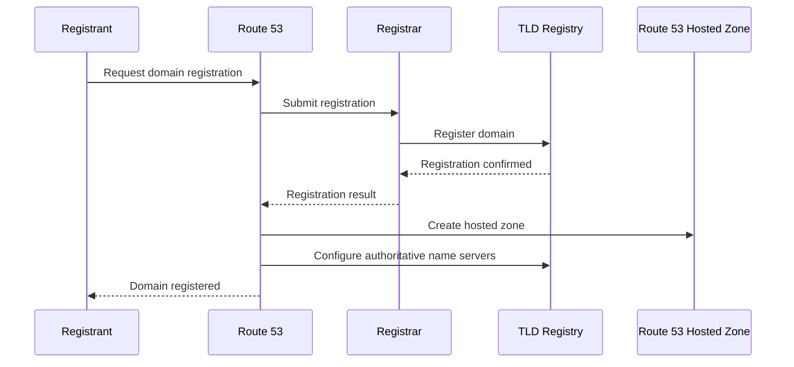
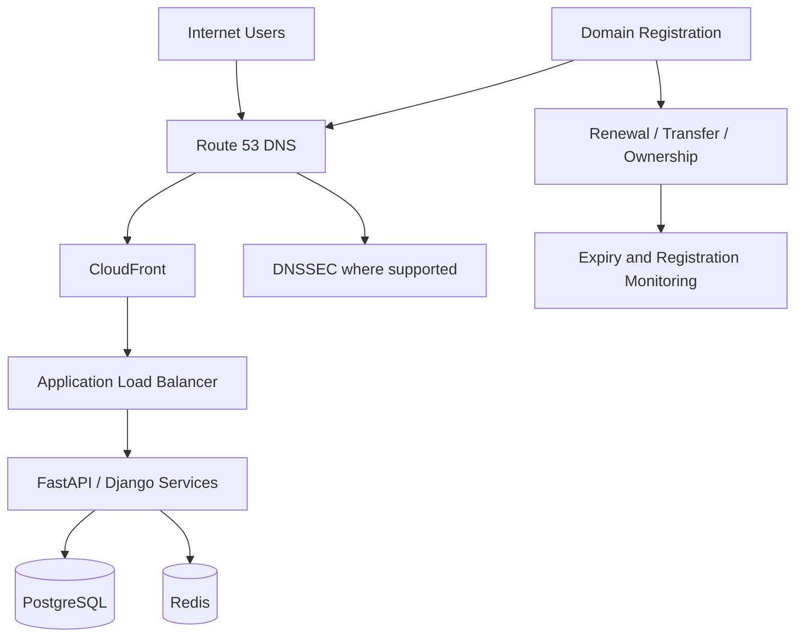

# 13- Domain Registration

## Overview

Amazon Route 53 provides domain registration capabilities in addition to DNS hosting and routing.

These are separate responsibilities:

```text
                         Amazon Route 53
                               │
                ┌──────────────┼──────────────┐
                │              │              │
          Domain Registration  DNS Hosting   DNS Routing
                │              │              │
             Ownership      Hosted Zone   Routing Policies
             Lifecycle       Records      Health Checks
```

A domain name such as:

```text
example.com
```

must be registered with a registrar before it can be used as an Internet domain. Route 53 can register supported domains, manage their registration lifecycle, and provide DNS hosting for them.

A critical engineering distinction is:

> You do not need to register a domain with Route 53 to use Route 53 DNS.

An existing domain registered with another registrar can use Route 53 as its DNS service by changing its authoritative name servers. Conversely, a domain registered through Route 53 can use another DNS provider. :contentReference[oaicite:0]{index=0}

---

## Domain Registration vs DNS Hosting

These concepts are frequently confused.

| Responsibility | Domain Registration | DNS Hosting |
|---|---|---|
| Establishes domain ownership | Yes | No |
| Maintains registration lifecycle | Yes | No |
| Provides authoritative DNS servers | Not necessarily | Yes |
| Stores DNS records | No | Yes |
| Controls `A`, `AAAA`, `CNAME`, etc. | No | Yes |
| Controls domain renewal | Yes | No |
| Handles registrar transfer | Yes | No |
| Route 53 service | Route 53 Domains | Route 53 Hosted Zones |

For example:

```text
Domain:
example.com

Registrar:
Amazon Registrar

DNS provider:
Amazon Route 53
```

is one possible configuration.

Another is:

```text
Domain:
example.com

Registrar:
Namecheap / GoDaddy / another registrar

DNS provider:
Amazon Route 53
```

There is no requirement that the registrar and DNS provider be the same company.

---

## Why Domain Registration Exists

DNS answers the question:

> Where should traffic for this domain go?

Domain registration answers a different question:

> Who has control over this domain name, and how long is that registration valid?

The Internet domain-name system is hierarchical:

```text
                         Root
                          │
             ┌────────────┴────────────┐
             │                         │
            .com                      .org
             │
          example
             │
       example.com
```

A registrar interacts with the appropriate domain registry on behalf of the registrant.

The simplified lifecycle is:

```text
Registrant
    │
    ▼
Registrar
    │
    ▼
Registry
    │
    ▼
TLD database
```

AWS documents the Route 53 registration flow as involving the registrant, registrar, and registry. :contentReference[oaicite:1]{index=1}

---

## Domain Name Hierarchy

A fully qualified domain name might be:

```text
api.production.example.com
```

Its hierarchy is:

```text
api
 │
 └── production
       │
       └── example
             │
             └── com
```

The important distinction is that registration normally applies to the domain being registered, such as:

```text
example.com
```

Subdomains such as:

```text
api.example.com
www.example.com
admin.example.com
```

are normally created through DNS records rather than separately registered.

---

## Domain Registries and Registrars

Two terms are particularly important.

### Registrar

A registrar provides the interface and service through which a domain is registered and managed.

For Route 53 registrations, AWS documents that the registrar is either Amazon Registrar, Inc. or its registrar associate, Gandi. :contentReference[oaicite:2]{index=2}

### Registry

A registry operates the authoritative database for a particular top-level domain.

For example:

```text
example.com
       │
       ▼
.com registry
```

The registrar communicates with the relevant registry to create and manage the domain registration.

### Registrant

The registrant is the person or organization holding the registration rights for the domain.

This distinction matters operationally because the registrant information can determine who has rights associated with the domain under applicable registration and transfer policies. AWS specifically warns that the registrant contact should be someone trusted to act responsibly. :contentReference[oaicite:3]{index=3}

---

## Route 53 Domain Registration Flow

A simplified registration flow is:



When a domain is registered through Route 53, AWS automatically creates a hosted zone with the same name, assigns four name servers to it, and configures the domain registration to use those name servers. :contentReference[oaicite:4]{index=4}

---

## What Happens When You Register a Domain With Route 53

A successful Route 53 registration typically results in several related resources and settings:

```text
Register example.com
        │
        ├── Domain registration
        │
        ├── Hosted zone: example.com
        │
        ├── Four authoritative name servers
        │
        ├── DNS records
        │
        ├── Auto-renew enabled
        │
        └── Privacy protection configured
```

The registration API documents that Route 53 automatically creates a hosted zone, assigns four name servers, configures the domain to use those name servers, and enables automatic renewal. :contentReference[oaicite:5]{index=5}

---

## Hosted Zone Created During Registration

When Route 53 registers a domain, it automatically creates a hosted zone for that domain.

For example:

```text
Domain Registration
       │
       ▼
example.com
       │
       ▼
Hosted Zone: example.com
       │
       ├── SOA
       ├── NS
       ├── A
       ├── AAAA
       ├── CNAME
       └── MX
```

The hosted zone contains the DNS records that determine how DNS queries for the domain are answered.

The registration and hosted-zone resources are still logically separate.

You can delete the hosted zone without deleting the domain registration.

---

## Name Servers

A hosted zone is authoritative only when DNS resolvers are directed to its authoritative name servers.

For example:

```text
example.com
     │
     ▼
Authoritative NS
     │
     ├── ns-123.awsdns-xx.com
     ├── ns-456.awsdns-yy.net
     ├── ns-789.awsdns-zz.org
     └── ns-012.awsdns-aa.co.uk
```

The exact name servers are assigned by Route 53.

A domain registration through Route 53 automatically configures the domain to use the name servers assigned to its hosted zone. :contentReference[oaicite:6]{index=6}

This is why the following relationship matters:

```text
Domain Registration
        │
        ▼
Authoritative Name Servers
        │
        ▼
Route 53 Hosted Zone
        │
        ▼
DNS Records
```

---

## Registration Is Not the Same as DNS Resolution

Consider:

```text
example.com
```

Registration establishes control over the domain.

DNS resolution determines where:

```text
api.example.com
```

should go.

The request path is roughly:

```text
Client
  │
  │ DNS query
  ▼
Recursive Resolver
  │
  ▼
Root
  │
  ▼
.com nameserver
  │
  ▼
example.com authoritative NS
  │
  ▼
Route 53 Hosted Zone
  │
  ▼
DNS Record
  │
  ▼
IP / AWS resource
```

Domain registration is primarily part of the ownership and delegation layer, while the hosted zone is part of the DNS serving layer.

---

## Supported TLDs

Route 53 does not support every possible top-level domain for registration.

AWS maintains a list of TLDs supported for registration and documents TLD-specific requirements. Some TLDs have additional restrictions concerning:

- Registration eligibility
- Contact information
- Privacy
- Transfer authorization
- DNSSEC
- Registration period
- Renewal
- Restoration
- Internationalized domain names

Always verify TLD-specific requirements before automating domain registration. :contentReference[oaicite:7]{index=7}

For example, `.us` has specific eligibility requirements and does not support privacy protection, while `.app` requires HTTPS for websites and supports DNSSEC. :contentReference[oaicite:8]{index=8}

---

## Registration Period

The available registration period depends on the TLD.

For many TLDs, registration and renewal can be configured for one or more years, but registry-specific rules apply.

Do not build infrastructure automation that assumes:

```text
Every domain = exactly one-year lifecycle
```

Instead:

```text
TLD
 │
 ▼
Registry rules
 │
 ├── Registration period
 ├── Renewal rules
 ├── Grace period
 ├── Restoration period
 └── Transfer requirements
```

AWS provides TLD-specific documentation because these rules vary. :contentReference[oaicite:9]{index=9}

---

## Automatic Renewal

Route 53 enables automatic renewal when a domain is registered or transferred into Route 53.

The typical renewal period is one year, although some TLDs use different periods. :contentReference[oaicite:10]{index=10}

The operational flow is:

```text
Domain
  │
  ▼
Expiration approaching
  │
  ▼
Auto-renew enabled?
  │
  ├── Yes ──► Renewal attempted
  │
  └── No ───► Domain may expire
```

For production domains, automatic renewal should generally remain enabled unless there is a deliberate reason to disable it.

---

## Domain Expiration Is an Availability Risk

A domain can be perfectly healthy at the application layer while the business is still unavailable because its domain registration expires.

For example:

```text
EC2       → Healthy
ALB       → Healthy
Application → Healthy
Database  → Healthy
DNS       → Healthy

Domain registration → Expired
```

The result can still be:

```text
Users cannot reliably reach the application.
```

This makes domain registration part of production availability engineering.

---

## Registration Monitoring

For production domains, monitor:

- Registration expiration
- Auto-renew status
- Domain status
- Transfer lock
- Registrant contact
- DNS delegation
- Renewal failures
- Billing status

A useful operational model is:

```text
              Domain Lifecycle
                    │
        ┌───────────┼───────────┐
        │           │           │
     Renewal      Security     DNS
        │           │           │
     Expiry      Lock/Access   NS
     Billing     Contacts      Records
```

Do not rely exclusively on an engineer remembering renewal dates manually.

---

## Privacy Protection

Route 53 supports privacy protection for domain contact information for supported TLDs.

When privacy protection is enabled, contact information returned by WHOIS may be replaced by registrar/privacy-service information or a redaction value. :contentReference[oaicite:11]{index=11}

The conceptual model is:

```text
Registrant Contact
       │
       ▼
Privacy Protection
       │
       ▼
WHOIS Query
       │
       ▼
Redacted / Registrar Contact
```

Privacy behavior depends on the TLD registry and its policies.

Some TLDs automatically suppress information, some allow configurable privacy, and some do not allow privacy protection. :contentReference[oaicite:12]{index=12}

---

## Privacy Protection Is Not Universal

Do not assume:

```text
Route 53
+
Privacy enabled
=
All contact information hidden for every TLD
```

Instead:

```text
Privacy behavior
      │
      ▼
TLD registry policy
      │
      ├── Supported
      ├── Partially supported
      └── Not supported
```

AWS documents TLD-specific exceptions and requirements. :contentReference[oaicite:13]{index=13}

---

## Registrant Contact Information

During registration, Route 53 collects contact information for domain contacts such as:

- Registrant
- Administrative
- Technical
- Billing

For many registrations, the same information can be used for multiple contact types.

These details are not merely application metadata.

They can affect:

- Ownership
- Verification
- Transfers
- Registry compliance
- Recovery operations

AWS specifically emphasizes the importance of selecting a trustworthy registrant contact because the registrant has rights under applicable transfer policies. :contentReference[oaicite:14]{index=14}

---

## Registrant Verification

Some domain registrations require registrant contact verification.

The operational flow may be:

```text
Register domain
      │
      ▼
Verification required?
      │
      ├── No ──► Registration continues
      │
      └── Yes
            │
            ▼
       Verification email
            │
            ▼
       Registrant confirms
            │
            ▼
       Registration remains valid
```

AWS provides Route 53 domain request status and allows verification emails to be resent when necessary. :contentReference[oaicite:15]{index=15}

A production domain should have an operationally reliable contact email rather than an abandoned mailbox.

---

## Domain Transfer Lock

Domain transfer locking helps prevent unauthorized transfers to another registrar.

A locked domain can have a status such as:

```text
clientTransferProhibited
```

AWS provides Route 53 operations for enabling and disabling transfer lock. :contentReference[oaicite:16]{index=16}

The security model is:

```text
Normal production state

Domain
  │
  ▼
Transfer Lock = Enabled
  │
  ▼
Unauthorized transfer blocked
```

When deliberately transferring a domain:

```text
Transfer planned
      │
      ▼
Disable transfer lock
      │
      ▼
Complete transfer process
      │
      ▼
Re-enable appropriate protection
```

Transfer requirements vary by TLD.

---

## Why Transfer Lock Matters

An attacker gaining sufficient control over domain-management credentials could potentially attempt to transfer the domain.

For a production domain:

```text
Domain compromise
      │
      ▼
DNS compromise
      │
      ▼
Traffic redirection
      │
      ▼
Application impersonation
```

A registrar-level compromise can therefore become significantly more serious than a simple DNS record modification.

Protect domain-management access with:

- Strong IAM controls
- MFA
- Least privilege
- Dedicated administrative roles
- CloudTrail auditing
- Restricted automation permissions
- Transfer locking

---

## DNSSEC and Domain Registration

DNSSEC provides cryptographic protection for DNS responses.

The conceptual chain is:

```text
DNS Query
   │
   ▼
Authoritative DNS
   │
   ▼
Signed DNS Response
   │
   ▼
Resolver Validation
   │
   ▼
Authenticated DNS Data
```

DNSSEC has two distinct concerns:

```text
Domain / registry configuration
            +
Route 53 hosted-zone signing
```

Whether DNSSEC is supported and how it is configured depends partly on the TLD and registry.

AWS documents DNSSEC support on TLD-specific Route 53 domain pages. :contentReference[oaicite:17]{index=17}

DNSSEC should be evaluated separately from TLS.

```text
TLS
 → protects application connections

DNSSEC
 → protects authenticity of DNS data
```

---

## Domain Registration and TLS Certificates

Registering:

```text
example.com
```

does not automatically provide:

```text
HTTPS
```

TLS is a separate layer.

A typical AWS architecture is:

```text
Domain Registration
       │
       ▼
Route 53 DNS
       │
       ▼
ACM Certificate
       │
       ▼
CloudFront / ALB
       │
       ▼
Application
```

For example:

```text
https://api.example.com
```

requires DNS configuration plus a valid certificate and TLS termination.

Some TLDs impose additional requirements. For example, AWS documents that `.app` requires HTTPS for websites. :contentReference[oaicite:18]{index=18}

---

## Registering a New Domain

The high-level process is:

1. Search for the desired domain.
2. Verify that the TLD is supported.
3. Review TLD-specific requirements.
4. Provide registrant and contact information.
5. Configure privacy where supported.
6. Review pricing and registration terms.
7. Submit registration.
8. Complete any required verification.
9. Confirm the domain status.
10. Configure DNS records.
11. Verify DNS delegation and application reachability.

AWS documents that accidentally registered domain names cannot simply be renamed or refunded; a new domain must be registered if the wrong name was chosen. :contentReference[oaicite:19]{index=19}

---

## Domain Registration CLI

Route 53 domain registration uses the `route53domains` AWS CLI service.

For example:

```bash
aws route53domains list-domains \
  --region us-east-1
```

Route 53 domain-registration API operations are documented as running through the `us-east-1` endpoint. AWS CLI examples therefore explicitly use `--region us-east-1` for domain-management operations. :contentReference[oaicite:20]{index=20}

This is different from ordinary Route 53 DNS APIs, which are global in nature and do not require the same domain-registration endpoint model.

---

## Checking Domain Details

A useful operational command is:

```bash
aws route53domains get-domain-detail \
  --region us-east-1 \
  --domain-name example.com
```

This can be used to inspect domain-management information such as:

- Auto-renew status
- Transfer lock status
- Nameservers
- Contact information
- Domain status
- Registration information

Use this in operational tooling when domain lifecycle state is important.

---

## Enabling Auto-Renewal

To explicitly enable automatic renewal:

```bash
aws route53domains enable-domain-auto-renew \
  --region us-east-1 \
  --domain-name example.com
```

AWS documents this operation as enabling automatic renewal before the domain expires. :contentReference[oaicite:21]{index=21}

For critical domains, verify the resulting state rather than assuming the command succeeded.

---

## Enabling Transfer Lock

To enable the transfer lock:

```bash
aws route53domains enable-domain-transfer-lock \
  --region us-east-1 \
  --domain-name example.com
```

AWS documents that this changes the domain status to include `clientTransferProhibited`. :contentReference[oaicite:22]{index=22}

A production baseline should generally keep transfer protection enabled.

---

## Disabling Transfer Lock

When a legitimate transfer is required:

```bash
aws route53domains disable-domain-transfer-lock \
  --region us-east-1 \
  --domain-name example.com
```

This should be treated as a controlled administrative action.

A good operational process is:

```text
Transfer request
      │
      ▼
Verify request
      │
      ▼
Verify authorized operator
      │
      ▼
Disable lock
      │
      ▼
Complete transfer
      │
      ▼
Verify ownership/DNS
```

Never treat transfer-lock changes as routine application deployment operations.

---

## Programmatic Registration

For large-scale domain management, registration can be automated through the AWS SDK or API.

AWS recommends using an AWS SDK when one is available rather than manually interacting with the raw API. :contentReference[oaicite:23]{index=23}

A production automation architecture might be:

```text
Internal Domain Management Service
            │
            ▼
       AWS SDK / API
            │
            ▼
    Route 53 Domains
            │
            ▼
       Domain Registry
```

Automation is useful when an organization manages:

- Many domains
- Multiple environments
- Automated renewal controls
- Domain inventories
- Compliance checks
- Centralized lifecycle reporting

---

## Python Automation Example

A Python service can use `boto3` for domain-management operations.

For example, checking domain details:

```python
import boto3


client = boto3.client("route53domains", region_name="us-east-1")

response = client.get_domain_detail(
    DomainName="example.com",
)

print({
    "auto_renew": response.get("AutoRenew"),
    "transfer_lock": response.get("TransferLock"),
    "status": response.get("StatusList", []),
})
```

Production automation should additionally include:

- IAM least privilege
- Retry handling
- Audit logging
- Idempotency considerations
- Alerting
- Change approval for sensitive operations

Avoid embedding AWS access keys in application source code.

---

## Domain Registration and CI/CD

Domain registration should generally not be part of every application deployment.

A healthier separation is:

```text
Platform / Infrastructure Lifecycle
        │
        ├── Domain Registration
        ├── DNS Delegation
        ├── Hosted Zones
        ├── DNSSEC
        └── Certificate Management

Application CI/CD
        │
        ├── Build
        ├── Test
        ├── Deploy
        └── Release
```

Application deployment may update DNS records when required, but domain ownership and registrar operations should usually be controlled separately.

---

## Domain Registration and Infrastructure as Code

DNS records and hosted zones are commonly managed through infrastructure-as-code systems such as Terraform or AWS CloudFormation.

Domain registration itself has additional lifecycle and ownership implications.

A useful separation is:

```text
Domain ownership
    │
    └── Controlled registrar lifecycle

DNS infrastructure
    │
    └── Infrastructure as Code

Application deployment
    │
    └── CI/CD
```

This reduces the risk of an application deployment accidentally destroying or transferring a critical domain.

---

## Existing Domain Registered Elsewhere

Suppose:

```text
example.com
```

is currently registered with another registrar.

You can still use Route 53 for DNS.

The architecture becomes:

```text
Registrar
   │
   │ Domain registration
   │
   ▼
example.com
   │
   │ NS delegation
   ▼
Route 53 Hosted Zone
   │
   ├── A
   ├── AAAA
   ├── CNAME
   └── MX
```

You change the authoritative name servers at the current registrar to the name servers assigned to the Route 53 hosted zone.

AWS explicitly documents that transferring registration to Route 53 is not required to use Route 53 DNS features. :contentReference[oaicite:24]{index=24}

---

## Moving DNS Before Transferring Registration

When moving a domain registration from another registrar to Route 53, AWS recommends considering a DNS migration first.

The reason is operational:

```text
Current Registrar
      │
      ├── Domain Registration
      │
      └── DNS Service
```

If registration transfer happens first and the old registrar's DNS service is disabled as a consequence, DNS availability can be affected.

A safer migration is:

```text
Existing Registrar
      │
      ▼
Create Route 53 Hosted Zone
      │
      ▼
Copy DNS records
      │
      ▼
Validate Route 53 DNS
      │
      ▼
Change authoritative NS
      │
      ▼
Verify DNS resolution
      │
      ▼
Transfer registration
```

AWS explicitly recommends considering DNS migration before registration transfer. :contentReference[oaicite:25]{index=25}

---

## Transferring a Domain to Route 53

A domain transfer is different from changing DNS providers.

A simplified transfer flow is:

```text
Current Registrar
       │
       ├── Unlock domain
       ├── Obtain authorization code
       └── Verify transfer eligibility
              │
              ▼
         Route 53
              │
              ▼
       Transfer request
              │
              ▼
      Authorization / approval
              │
              ▼
       New registrar
```

Transfer requirements vary by TLD.

AWS documents that transfers may involve authorization codes, domain status requirements, contact verification, and other TLD-specific rules. :contentReference[oaicite:26]{index=26}

---

## Domain Transfer vs DNS Migration

These are two independent operations.

| Operation | Changes registrar? | Changes DNS provider? |
|---|---:|---:|
| DNS migration | No | Yes |
| Domain registration transfer | Yes | Not necessarily |
| Both together | Yes | Yes |

For example:

### DNS migration only

```text
Registrar: Existing Registrar
DNS: Route 53
```

### Registration transfer only

```text
Registrar: Route 53
DNS: Existing DNS provider
```

### Both

```text
Registrar: Route 53
DNS: Route 53
```

Understanding this distinction prevents many production migration mistakes.

---

## Domain Transfer Authorization

Many TLDs require an authorization code for transfers.

The general flow is:

```text
Current Registrar
      │
      ▼
Authorization Code
      │
      ▼
Route 53 Transfer Request
      │
      ▼
Registry validates transfer
```

The exact requirements depend on the TLD.

Never assume that all domains use identical transfer rules.

---

## Domain Status Codes

Domain status codes communicate lifecycle and transfer state.

Examples include:

```text
clientTransferProhibited
serverTransferProhibited
pendingTransfer
redemptionPeriod
pendingDelete
```

These states can affect whether a domain can be transferred or restored.

AWS references ICANN EPP status codes for current domain-status semantics. :contentReference[oaicite:27]{index=27}

For production troubleshooting:

```text
Transfer failed
      │
      ▼
Inspect domain status
      │
      ▼
Identify registry restriction
      │
      ▼
Correct prerequisite
      │
      ▼
Retry transfer
```

---

## Domain Expiration and Recovery

Expiration behavior is TLD-specific.

A domain may pass through states such as:

```text
Active
  │
  ▼
Expired
  │
  ▼
Grace / Late Renewal
  │
  ▼
Redemption
  │
  ▼
Pending Delete
  │
  ▼
Available
```

The exact timing varies by TLD.

For example, AWS documents different renewal and restoration windows for `.us` and `.app`. :contentReference[oaicite:28]{index=28}

Never build a disaster-recovery runbook around a universal expiration timeline.

---

## Cost Considerations

Domain registration has costs separate from ordinary DNS query and hosted-zone charges.

When registering a domain with Route 53, AWS automatically creates a hosted zone and charges the applicable hosted-zone fee in addition to the domain registration fee. AWS notes that deleting the automatically created hosted zone within 12 hours of registration avoids the hosted-zone charge on the AWS bill. :contentReference[oaicite:29]{index=29}

The cost model is therefore approximately:

```text
Domain Registration
        +
Hosted Zone
        +
DNS Queries
        +
Optional DNS Features
```

TLD pricing can vary significantly.

Some domain names can also have special or premium pricing, and AWS documents restrictions around registering domains with special or premium prices through Route 53. :contentReference[oaicite:30]{index=30}

---

## Security Considerations

Domain registration is part of the application's security boundary.

Protect:

- AWS account access
- IAM permissions
- Domain registration credentials
- Registrant email
- Transfer authorization codes
- Transfer lock configuration
- DNS changes
- Contact information

A domain takeover can enable:

```text
Domain compromise
      │
      ▼
DNS modification
      │
      ▼
Traffic redirection
      │
      ├── Credential phishing
      ├── API impersonation
      └── Malicious content
```

Recommended controls include:

- MFA for privileged AWS access
- Least-privilege IAM
- Dedicated administrative roles
- CloudTrail auditing
- Transfer lock
- Privacy protection where appropriate
- Protected registrant contact
- Automated expiry monitoring
- Change approval for registrar-level changes

---

## IAM and Domain Management

Do not give application deployment roles unrestricted access to domain registration APIs.

For example, avoid giving a normal CI/CD role permissions to:

```text
RegisterDomain
TransferDomain
DisableDomainTransferLock
UpdateDomainContact
```

unless there is a specific operational requirement.

A safer model is:

```text
Application CI/CD Role
       │
       └── DNS record permissions only

Domain Administration Role
       │
       └── Registrar lifecycle permissions
```

This separates application deployment from domain ownership operations.

---

## Auditability

Domain changes should be auditable.

Monitor administrative operations involving:

- Domain registration
- Domain transfer
- Contact changes
- Auto-renew changes
- Transfer-lock changes
- Name-server changes

CloudTrail should be part of the AWS-side audit strategy.

For sensitive domain operations, combine:

```text
IAM
+
MFA
+
CloudTrail
+
Change approval
+
Operational alerting
```

---

## Common Mistakes

### Assuming Route 53 Registration Is Required for Route 53 DNS

It is not.

You can register the domain elsewhere and delegate DNS to Route 53.

---

### Confusing Registrar and DNS Provider

A registrar manages the domain registration lifecycle.

A DNS provider serves authoritative DNS records.

They can be different organizations.

---

### Deleting a Hosted Zone and Assuming the Domain Is Deleted

Deleting:

```text
Hosted Zone
```

does not necessarily delete:

```text
Domain Registration
```

They are separate resources.

---

### Forgetting the Automatically Created Hosted Zone

Registering a domain through Route 53 automatically creates a hosted zone.

If you later create another hosted zone for the same domain, make sure the domain is delegated to the correct name servers. AWS explicitly warns that replacing a hosted zone requires updating the domain's name servers accordingly. :contentReference[oaicite:31]{index=31}

---

### Disabling Auto-Renewal Without an Operational Plan

A production domain can expire even while every AWS workload remains healthy.

If auto-renewal is intentionally disabled, establish explicit expiry monitoring and ownership.

---

### Assuming Privacy Works for Every TLD

Privacy support depends on registry policy.

Always check the specific TLD.

---

### Treating Domain Transfer as DNS Migration

Moving the registration and moving authoritative DNS are separate operations.

Perform them independently when that reduces migration risk.

---

### Transferring Registration Before Migrating DNS

If the old registrar also provides DNS, transferring registration first can create DNS availability problems.

Migrate and validate DNS first when appropriate. :contentReference[oaicite:32]{index=32}

---

### Ignoring TLD-Specific Rules

Different TLDs can have different:

- Eligibility rules
- Privacy behavior
- Renewal periods
- Transfer rules
- DNSSEC support
- Restoration windows

Do not assume `.com`, `.us`, `.app`, and country-code TLDs behave identically.

---

### Putting Registrar Operations Into Normal Application CI/CD

A deployment pipeline should not accidentally have enough authority to transfer or delete the organization's production domain.

Separate registrar administration from application deployment.

---

## Production Best Practices

### Treat the Domain as a Critical Production Asset

For an important business domain, maintain an inventory containing:

| Information | Example |
|---|---|
| Domain | `example.com` |
| Registrar | Amazon Registrar |
| DNS provider | Route 53 |
| Auto-renew | Enabled |
| Transfer lock | Enabled |
| DNSSEC | Enabled where appropriate |
| Expiration | Monitored |
| Registrant contact | Controlled corporate identity |
| AWS account | Dedicated production account |
| Hosted zone | `example.com` |

---

### Keep Auto-Renew Enabled

For production domains, automatic renewal should generally remain enabled.

Also monitor renewal failures rather than assuming automatic renewal eliminates operational risk. :contentReference[oaicite:33]{index=33}

---

### Keep Transfer Lock Enabled

Transfer lock should remain enabled during normal operations.

Only disable it for a controlled transfer workflow.

---

### Protect Domain Administration

Use:

- MFA
- Least privilege
- Dedicated roles
- Strong administrative controls
- CloudTrail
- Change review

Registrar-level access should be considered highly privileged.

---

### Separate Domain and Application Lifecycle

Use:

```text
Domain lifecycle
      │
      └── Long-lived infrastructure

Application lifecycle
      │
      └── Frequent CI/CD deployments
```

This prevents short-lived application changes from affecting long-lived domain ownership.

---

### Validate DNS Before Registration Transfer

For migrations:

```text
Create Route 53 hosted zone
        │
        ▼
Import DNS records
        │
        ▼
Validate records
        │
        ▼
Delegate DNS
        │
        ▼
Verify production traffic
        │
        ▼
Transfer registration
```

This reduces the blast radius of registrar migration.

---

### Maintain an Independent Recovery Path

Do not rely exclusively on one human's mailbox or one AWS administrator.

Maintain:

- Multiple trusted administrators
- Documented ownership
- Recovery procedures
- Domain inventory
- Expiration alerts
- Transfer procedures
- Emergency escalation contacts

Domain recovery is an operational process, not merely an AWS configuration task.

---

## Production Architecture

A typical production application might use:



The important architectural distinction is:

```text
Registrar
    │
    └── Domain ownership and lifecycle

Route 53 Hosted Zone
    │
    └── DNS authority

CloudFront / ALB
    │
    └── Application traffic

Application
    │
    └── Business logic
```

These layers should be managed independently but monitored as one production system.

---

## Disaster Recovery Considerations

A domain is a dependency of the entire application stack.

Consider:

```text
AWS Region failure
      │
      ▼
Route 53 failover
      │
      ▼
Secondary Region
```

But if the domain itself is lost:

```text
Domain registration failure
      │
      ▼
DNS/Application failover becomes irrelevant
```

Therefore domain lifecycle should be included in disaster-recovery planning.

The DR runbook should contain:

- Registrar information
- Domain ownership information
- Renewal status
- Transfer procedure
- DNS provider
- Hosted-zone identifiers
- Name servers
- DNSSEC configuration
- Emergency contacts
- AWS account ownership

---

## Interview Questions

### What is Amazon Route 53 domain registration?

It is Route 53's capability for registering and managing supported domain names through a registrar, including lifecycle operations such as renewal and transfer.

### Do I need to register my domain with Route 53 to use Route 53 DNS?

No.

A domain registered with another registrar can use Route 53 as its authoritative DNS provider by updating its name-server delegation. :contentReference[oaicite:34]{index=34}

### What happens when you register a domain through Route 53?

Route 53 creates a hosted zone, assigns four name servers, configures the domain to use those name servers, and enables automatic renewal. :contentReference[oaicite:35]{index=35}

### What is the difference between a registrar and a registry?

A registrar provides domain-registration services to registrants. A registry operates the authoritative database for a TLD.

### What is a registrant?

The registrant is the person or organization holding the domain registration rights.

### What is transfer lock?

It is a protection mechanism that prevents a domain from being transferred to another registrar while the lock is active.

### What is WHOIS privacy?

It reduces exposure of domain contact information in WHOIS responses when supported by the TLD. :contentReference[oaicite:36]{index=36}

### Is WHOIS privacy supported for every TLD?

No.

Privacy behavior is determined partly by the TLD registry and applicable policies. :contentReference[oaicite:37]{index=37}

### Does domain registration automatically provide HTTPS?

No.

TLS certificates are separate. AWS Certificate Manager and services such as CloudFront or ALB can be used to provide HTTPS.

### What happens if a domain expires?

The exact lifecycle depends on the TLD. Depending on registry rules, the domain may enter late-renewal, redemption, or pending-delete states before becoming available again. :contentReference[oaicite:38]{index=38}

### Can I transfer a domain from another registrar to Route 53?

Yes, provided the TLD is supported and the domain satisfies the applicable transfer requirements. :contentReference[oaicite:39]{index=39}

### Can I transfer a Route 53 domain to another registrar?

Yes, subject to the applicable registrar and TLD transfer requirements. :contentReference[oaicite:40]{index=40}

### Does transferring registration automatically transfer DNS?

Not necessarily.

Domain registration transfer and DNS-provider migration are separate operations.

### Which AWS Region is used for Route 53 domain-registration CLI operations?

AWS documents Route 53 domain-registration CLI examples using the `us-east-1` endpoint. :contentReference[oaicite:41]{index=41}

---

## Interview Traps

| Trap | Correct understanding |
|---|---|
| Route 53 DNS requires Route 53 domain registration | False |
| Registrar and DNS provider must be identical | False |
| Registering a domain automatically provides HTTPS | False |
| Route 53 registration creates a hosted zone | True |
| Route 53 automatically configures name servers for domains registered through it | True |
| Domain registration and DNS hosting are separate concepts | True |
| Auto-renewal is enabled by default for Route 53 registrations | True |
| Privacy protection is available for every TLD | False |
| Transfer lock protects against unauthorized transfers | True |
| Deleting a hosted zone necessarily deletes the domain registration | False |
| Domain transfer and DNS migration are the same operation | False |
| TLD rules are identical across all domains | False |
| Domain expiration can cause application availability problems | True |
| DNSSEC and TLS provide the same security property | False |
| Registrar-level permissions should be broadly granted to CI/CD | False |
| A domain can be registered elsewhere while using Route 53 DNS | True |
| A Route 53 registered domain can be transferred to another registrar | True |
| Domain lifecycle should be part of production operations | True |

---

## Key Takeaways

- **Domain registration and DNS hosting are separate responsibilities.**
- Route 53 can register supported domains, but a domain registered elsewhere can still use Route 53 as its DNS provider.
- A registrar manages the domain registration lifecycle; a registry maintains the TLD's authoritative domain database.
- When a domain is registered through Route 53, AWS automatically creates a hosted zone, assigns four name servers, configures delegation, and enables automatic renewal. :contentReference[oaicite:42]{index=42}
- Domain registration does not automatically provide application hosting or HTTPS.
- Domain registration, hosted zones, DNS records, certificates, and application infrastructure are separate layers.
- Route 53 supports privacy protection for many domains, but privacy behavior is TLD-specific. :contentReference[oaicite:43]{index=43}
- Production domains should normally have automatic renewal enabled and should be monitored for renewal failures and expiration.
- Transfer locking should generally remain enabled during normal operations.
- Domain administration is a high-privilege security boundary and should be protected with MFA, least privilege, auditing, and controlled change procedures.
- Domain registration transfer and DNS migration are independent operations.
- When migrating registrars, migrating and validating DNS before registration transfer can reduce availability risk. :contentReference[oaicite:44]{index=44}
- TLD-specific rules can affect registration periods, privacy, DNSSEC, transfer authorization, and expiration recovery.
- Domain expiration is an availability risk even when the AWS infrastructure and application are completely healthy.
- Domain lifecycle should be included in production inventory, monitoring, security, and disaster-recovery procedures.
- Route 53 domain-management CLI operations use the `route53domains` API and AWS documents these operations through the `us-east-1` endpoint. :contentReference[oaicite:45]{index=45}
- The senior-level mental model is: **domain registration establishes and maintains control of the domain; DNS hosting makes the domain resolvable; routing records determine where traffic goes; application infrastructure ultimately serves that traffic.**