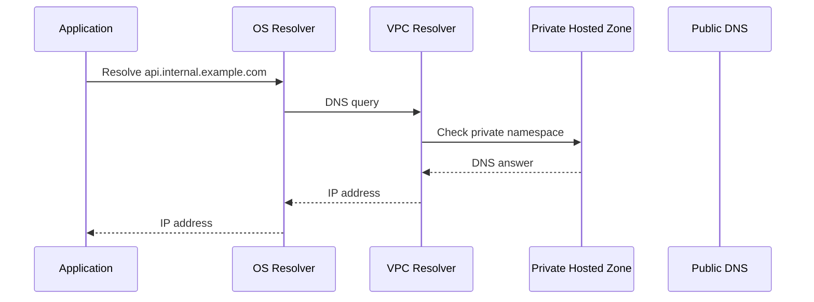
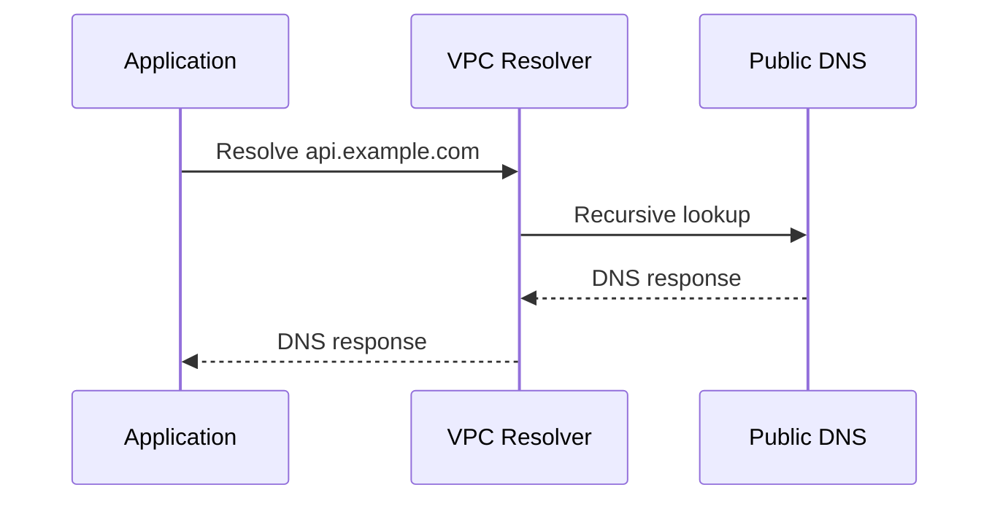
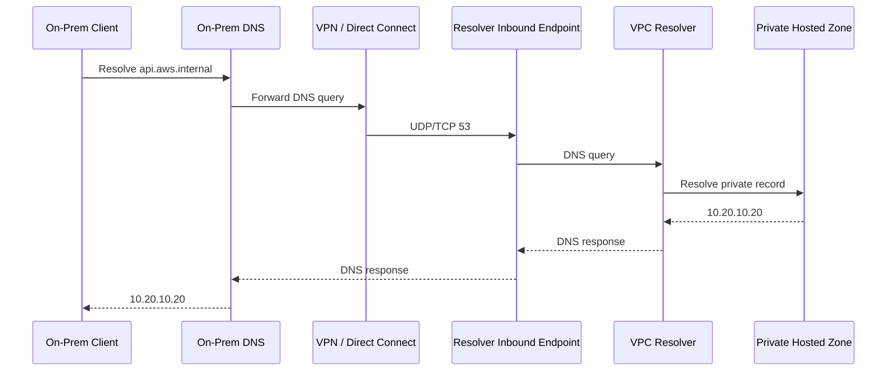
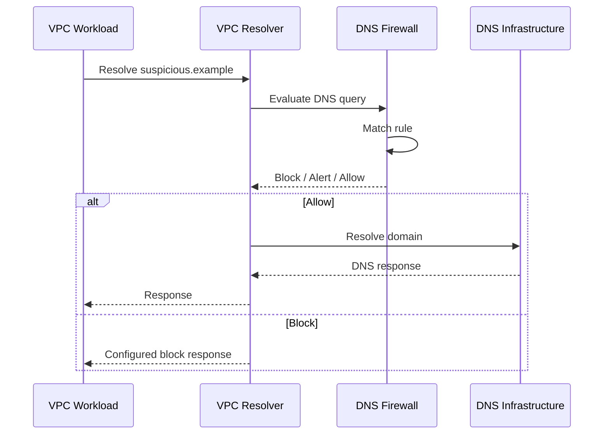
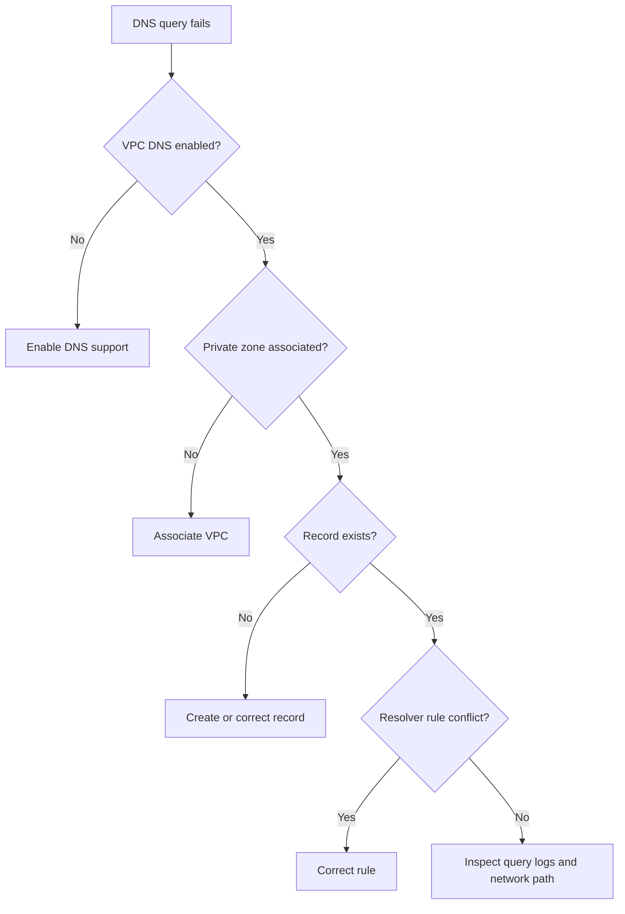
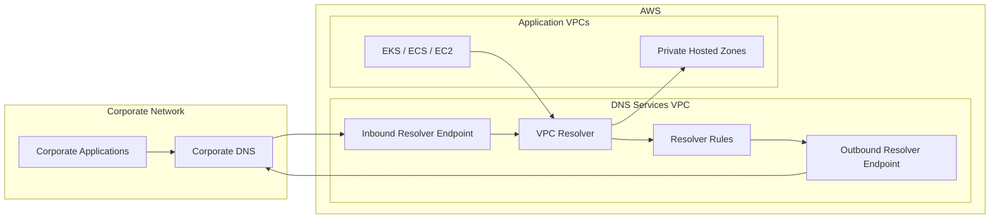

# 14- Route 53 Resolver

## Overview

Amazon Route 53 Resolver is the DNS resolution service built into Amazon VPC. It is responsible for resolving DNS names for resources inside a VPC and provides the integration point between AWS DNS, private hosted zones, on-premises DNS infrastructure, and external DNS resolvers.

A useful senior-level mental model is:

```text
                         Route 53
                            │
          ┌─────────────────┼──────────────────┐
          │                 │                  │
     Public DNS       Private Hosted Zones   Resolver
          │                 │                  │
    Public records      Internal DNS       DNS resolution
                                             │
                              ┌───────────────┼──────────────┐
                              │               │              │
                           Inbound         Outbound       DNS Firewall
                           Endpoint        Endpoint
                              │               │
                           On-prem          On-prem
                           → AWS            ← AWS
```

Route 53 Resolver is different from Route 53 authoritative DNS hosting:

- **Route 53 hosted zones** answer authoritatively for DNS records you manage.
- **Route 53 Resolver** performs DNS resolution for resources inside VPCs.
- **Resolver endpoints** connect AWS VPC DNS resolution with external DNS infrastructure.
- **Resolver rules** determine which DNS queries should be forwarded.
- **DNS Firewall** can filter DNS queries passing through VPC Resolver.

AWS describes VPC Resolver as a regional service whose data plane handles DNS resolution within VPCs, Resolver endpoints, and DNS Firewall processing. :contentReference[oaicite:0]{index=0}

---

## Why Route 53 Resolver Matters

Most backend workloads depend on DNS even when the application code never explicitly performs DNS operations.

For example:

```text
FastAPI
   │
   │ connect to
   ▼
postgres.internal.example.com
   │
   ▼
DNS Resolver
   │
   ▼
Private Hosted Zone
   │
   ▼
10.20.30.50
```

The application may simply execute:

```python
connection = connect(
    host="postgres.internal.example.com",
)
```

The DNS resolution happens underneath the networking stack.

Resolver therefore becomes infrastructure for:

- EC2
- ECS
- EKS
- Lambda attached to a VPC
- PrivateLink
- Private hosted zones
- Hybrid AWS/on-premises environments
- Service discovery
- Internal APIs
- Database endpoints
- Microservice communication

A DNS failure can consequently look like an application failure:

```text
Application
    │
    ▼
DNS lookup
    │
    X
Resolver failure
    │
    ▼
Connection never established
```

---

## Route 53 Resolver vs Authoritative DNS

This distinction is fundamental.

| Component | Primary responsibility |
|---|---|
| Public hosted zone | Authoritatively answers public DNS queries |
| Private hosted zone | Authoritatively answers DNS queries inside associated VPCs |
| VPC Resolver | Resolves DNS queries originating from VPC resources |
| Inbound Resolver endpoint | Allows external DNS clients to query AWS DNS |
| Outbound Resolver endpoint | Allows VPC DNS queries to be forwarded to external DNS |
| Resolver rule | Determines which queries are forwarded |
| DNS Firewall | Filters DNS queries |

A simplified model:

```text
                 DNS Query
                    │
                    ▼
             Route 53 Resolver
                    │
       ┌────────────┼─────────────┐
       │            │             │
       ▼            ▼             ▼
Private Zone    AWS DNS       External DNS
       │            │             │
       ▼            ▼             ▼
Authoritative   AWS names     Forwarded query
answer          / records
```

---

## Resolver Inside a VPC

When you create a VPC, AWS automatically provides DNS resolution through Route 53 Resolver.

AWS calls this service:

- Route 53 Resolver
- Amazon DNS server
- AmazonProvidedDNS

The IPv4 Resolver address is:

```text
169.254.169.253
```

It is also available through the VPC's primary IPv4 CIDR plus two.

For example:

```text
VPC CIDR:
10.0.0.0/16

Resolver:
10.0.0.2
```

The IPv6 Resolver address is:

```text
fd00:ec2::253
```

AWS documents that the Resolver is built into each Availability Zone and that VPC resources use it for DNS queries. :contentReference[oaicite:1]{index=1}

---

## How VPC DNS Resolution Works

Consider an EC2 instance:

```text
EC2
10.0.10.25
   │
   │ DNS query
   ▼
AmazonProvidedDNS
169.254.169.253
   │
   ▼
Route 53 Resolver
   │
   ├── Private Hosted Zone
   ├── AWS internal DNS
   └── Recursive public lookup
```

The application normally does not need to know the Resolver IP.

The operating system receives DNS configuration through the VPC's DHCP options and uses the configured resolver.

---

## VPC DNS Attributes

Two VPC DNS attributes are particularly important:

- `enableDnsSupport`
- `enableDnsHostnames`

They affect DNS behavior within the VPC.

| Attribute | Purpose |
|---|---|
| `enableDnsSupport` | Enables DNS resolution through AmazonProvidedDNS |
| `enableDnsHostnames` | Controls whether instances receive DNS hostnames |

For normal AWS workloads, these should generally remain enabled.

If DNS support is disabled, applications can experience failures resolving:

- AWS service endpoints
- Private hosted-zone records
- EC2 hostnames
- Internal service names

---

## Checking VPC DNS Attributes

Using AWS CLI:

```bash
aws ec2 describe-vpc-attribute \
  --vpc-id vpc-0123456789abcdef0 \
  --attribute enableDnsSupport

aws ec2 describe-vpc-attribute \
  --vpc-id vpc-0123456789abcdef0 \
  --attribute enableDnsHostnames
```

A healthy production VPC normally has:

```text
enableDnsSupport   = true
enableDnsHostnames = true
```

---

## Resolver Request Lifecycle

A DNS request from an EC2 instance can follow this general path:



For a public name:



The Resolver caches DNS responses according to DNS TTLs, reducing repeated recursive lookups. :contentReference[oaicite:2]{index=2}

---

## Recursive DNS Resolution

Resolver is not limited to records stored in your private hosted zones.

For names that are not answered internally, Resolver can perform recursive lookups against public DNS infrastructure.

Conceptually:

```text
EC2
 │
 ▼
VPC Resolver
 │
 ├── Internal AWS name?
 │       └── Resolve internally
 │
 ├── Private hosted zone?
 │       └── Resolve from private zone
 │
 └── Public domain?
         │
         ▼
      Recursive DNS
         │
         ▼
      Public DNS
```

This is why an EC2 instance can normally resolve both:

```text
db.internal.example.com
```

and:

```text
www.google.com
```

using the VPC's DNS configuration.

---

## Resolver and Private Hosted Zones

Private hosted zones are one of the most important integrations with Resolver.

Suppose you have:

```text
Private Hosted Zone:
example.internal
```

with:

```text
api.example.internal → 10.0.10.20
db.example.internal  → 10.0.20.30
```

The hosted zone is associated with one or more VPCs.

A resource in an associated VPC can query:

```text
db.example.internal
```

and Resolver can return:

```text
10.0.20.30
```

The architecture is:

```text
EC2
 │
 ▼
VPC Resolver
 │
 ▼
Private Hosted Zone
 │
 ▼
db.example.internal
 │
 ▼
10.0.20.30
```

---

## Resolver Is the Bridge Between VPC Resources and Private DNS

This distinction is important:

```text
Private Hosted Zone
    │
    │ authoritative DNS data
    ▼
Route 53

VPC Resolver
    │
    │ resolves queries from VPC resources
    ▼
EC2 / ECS / EKS / Lambda
```

The Resolver is what makes private DNS usable by workloads inside the VPC.

---

## Resolver Endpoints

Resolver endpoints allow DNS traffic to cross the boundary between an AWS VPC and external DNS infrastructure.

There are two primary endpoint directions:

```text
Inbound:
External DNS → AWS Resolver

Outbound:
AWS Resolver → External DNS
```

This gives a powerful hybrid DNS architecture.

---

## Inbound Resolver Endpoint

An inbound endpoint allows DNS resolvers outside AWS to send DNS queries into the VPC Resolver.

Typical use case:

```text
On-Premises
    │
    │ DNS query
    ▼
On-Prem DNS Resolver
    │
    │ VPN / Direct Connect
    ▼
Inbound Resolver Endpoint
    │
    ▼
VPC Resolver
    │
    ▼
Private Hosted Zone
```

For example, an on-premises application wants to resolve:

```text
api.aws.internal
```

where the record exists in a Route 53 private hosted zone.

The on-premises DNS resolver can forward the query to the inbound endpoint.

AWS documents that inbound endpoints use private IP addresses from the VPC and require network connectivity such as VPN or Direct Connect. :contentReference[oaicite:3]{index=3}

---

## Inbound Endpoint Architecture

A production architecture should distribute endpoint addresses across Availability Zones.

```text
                    AWS VPC
        ┌───────────────────────────────┐
        │                               │
On-Prem │     AZ-A           AZ-B       │
 DNS    │      │              │         │
  │     │      ▼              ▼         │
  └────►│   ENI / IP       ENI / IP     │
        │      │              │         │
        │      └──────┬───────┘         │
        │             ▼                 │
        │       VPC Resolver            │
        │             │                 │
        │             ▼                 │
        │     Private Hosted Zone       │
        └───────────────────────────────┘
```

This reduces dependency on a single Availability Zone.

---

## Inbound Endpoint Security

The security group attached to an inbound endpoint must allow DNS traffic from authorized source networks.

DNS normally uses:

```text
UDP 53
TCP 53
```

A typical security-group rule is conceptually:

```text
Source:
On-premises DNS subnet

Protocol:
UDP/TCP

Port:
53
```

Do not expose inbound Resolver endpoints broadly.

Use narrowly scoped network ranges corresponding to trusted DNS resolvers.

---

## Inbound Endpoint Request Flow



---

## Outbound Resolver Endpoint

An outbound endpoint allows DNS queries originating inside a VPC to be forwarded to DNS resolvers outside AWS.

Typical use case:

```text
AWS VPC
   │
   ▼
VPC Resolver
   │
   ▼
Outbound Resolver Endpoint
   │
   │ VPN / Direct Connect / NAT path
   ▼
On-Premises DNS
   │
   ▼
Internal Corporate DNS
```

For example:

```text
corp.example.com
```

may exist only in an organization's on-premises DNS infrastructure.

An EC2 instance in AWS can resolve it through an outbound Resolver endpoint and a forwarding rule.

AWS documents outbound endpoints and forwarding rules as the mechanism for forwarding selected VPC DNS queries to network DNS resolvers. :contentReference[oaicite:4]{index=4}

---

## Outbound Endpoint Architecture

```text
                     AWS
        ┌──────────────────────────────┐
        │                              │
EC2 ───►│ VPC Resolver                 │
        │      │                       │
        │      ▼                       │
        │ Forwarding Rule              │
        │      │                       │
        │      ▼                       │
        │ Outbound Endpoint            │
        │      │                       │
        └──────┼───────────────────────┘
               │
        VPN / Direct Connect
               │
               ▼
        On-Prem DNS
```

The outbound endpoint uses private IP addresses from the VPC.

The network path to the external DNS infrastructure must therefore exist and permit DNS traffic. :contentReference[oaicite:5]{index=5}

---

## Forwarding Rules

An outbound endpoint alone does not determine which DNS names should be forwarded.

Resolver forwarding rules define the condition.

Example:

```text
Domain:
corp.example.com

Target DNS servers:
10.100.10.10
10.100.10.11
```

Then:

```text
*.corp.example.com
        │
        ▼
Forwarding Rule
        │
        ▼
Outbound Endpoint
        │
        ▼
On-Prem DNS
```

AWS describes these as conditional forwarding rules and states that they can be associated with VPCs. :contentReference[oaicite:6]{index=6}

---

## Conditional Forwarding

Suppose an organization has:

```text
AWS:
aws.internal

On-prem:
corp.example.com
```

You might configure:

```text
corp.example.com
        │
        ▼
Forward to:
10.100.10.10
10.100.10.11
```

while AWS continues resolving:

```text
aws.internal
```

through Route 53 private hosted zones.

This avoids sending every DNS query to the corporate DNS infrastructure.

---

## Resolver Rule Matching

Resolver rules determine how DNS queries are handled.

For example:

```text
Query:
db.corp.example.com

Matching rule:
corp.example.com

Action:
Forward to 10.100.10.10
```

The forwarding rule generally applies to the specified domain and its subdomains.

AWS documents that custom forwarding rules can override some automatically defined behavior, while system rules can selectively override forwarding behavior for specific domains. :contentReference[oaicite:7]{index=7}

---

## System Rules

System rules allow Resolver to selectively override a forwarding rule.

For example:

```text
Forward:
example.com
        │
        ├── api.example.com → on-prem DNS
        │
        └── aws.example.com → VPC Resolver
```

This becomes useful when a broad forwarding rule exists but certain subdomains must remain resolved internally.

The conceptual hierarchy is:

```text
Broad Forwarding Rule
        │
        ▼
Specific System Rule
        │
        ▼
Specific resolution behavior
```

---

## Dot Forwarding Rule

A forwarding rule for:

```text
.
```

matches the DNS root and can be used to forward most DNS queries to external resolvers.

However, this must be handled carefully.

AWS documents that some AWS-specific domains are still handled by automatically defined system rules because forwarding those domains externally could break AWS functionality. :contentReference[oaicite:8]{index=8}

A common mistake is assuming:

```text
"." forwarding rule
=
literally every DNS query leaves AWS
```

That is not the correct mental model.

---

## Why Dot Forwarding Can Be Dangerous

AWS workloads depend on internal DNS names.

For example:

```text
EC2
 │
 ├── AWS internal hostname
 ├── Private hosted zone
 ├── ECS service
 └── AWS service endpoint
```

An overly broad forwarding configuration can interfere with expected AWS DNS behavior.

Before using a root forwarding rule:

- Understand AWS autodefined system rules.
- Test AWS service resolution.
- Test private hosted zones.
- Test reverse DNS if relevant.
- Validate application behavior.

AWS explicitly warns that forwarding all domains externally can break some AWS functionality. :contentReference[oaicite:9]{index=9}

---

## Hybrid DNS

Resolver becomes particularly valuable in hybrid environments.

A common architecture is:

```text
                 Corporate Network
                        │
                 Corporate DNS
                        │
              ┌─────────┴─────────┐
              │                   │
         AWS Names?          Corp Names?
              │                   │
              ▼                   ▼
      Inbound Endpoint      Outbound Endpoint
              │                   │
              ▼                   ▼
        AWS Resolver          Corp DNS
              │                   │
              ▼                   ▼
       Private Hosted       Corporate DNS
           Zones
```

This creates bidirectional DNS resolution:

```text
On-prem → AWS DNS
AWS     → On-prem DNS
```

The underlying network connection can be provided by:

- AWS Site-to-Site VPN
- AWS Direct Connect
- Other appropriate network connectivity

---

## Hybrid DNS Example

Suppose:

```text
AWS:
*.aws.example.com

On-prem:
*.corp.example.com
```

Desired behavior:

```text
api.aws.example.com
        │
        ▼
Route 53 Private Hosted Zone

erp.corp.example.com
        │
        ▼
On-Prem DNS
```

The configuration is:

```text
corp.example.com
        │
        ▼
Outbound Resolver Rule
        │
        ▼
On-Prem DNS

AWS private namespace
        │
        ▼
Route 53 Private Hosted Zone
```

This is a common enterprise DNS architecture.

---

## Centralized DNS Architecture

Large AWS environments often contain many VPCs and AWS accounts.

Instead of independently configuring DNS infrastructure everywhere:

```text
VPC-A
VPC-B
VPC-C
VPC-D
```

organizations can centralize Resolver endpoints and rules where the network architecture permits.

Conceptually:

```text
                 DNS Services VPC
                ┌─────────────────┐
                │ Resolver Rules  │
                │ Inbound Endpoint│
                │ Outbound Endpoint
                └────────┬────────┘
                         │
              ┌──────────┼──────────┐
              │          │          │
             VPC-A      VPC-B      VPC-C
```

Route 53 Resolver configuration can also be shared across VPCs and AWS accounts using Route 53 Profiles. AWS documents Profiles as a mechanism for sharing Route 53 configurations with VPCs and accounts. :contentReference[oaicite:10]{index=10}

---

## Resolver Rules and Multiple VPCs

A forwarding rule can be associated with multiple VPCs.

This is useful when multiple application VPCs need the same corporate DNS namespace.

For example:

```text
Rule:
corp.example.com
        │
        ├── VPC-A
        ├── VPC-B
        ├── VPC-C
        └── VPC-D
```

Instead of independently implementing:

```text
VPC-A → On-prem DNS
VPC-B → On-prem DNS
VPC-C → On-prem DNS
VPC-D → On-prem DNS
```

the DNS policy can be centrally managed.

---

## Resolver Query Logging

Route 53 Resolver supports query logging for DNS queries originating in VPCs.

Logs can include:

- VPC ID
- Source IP
- Instance ID
- DNS name
- Record type
- Response code
- Response data
- Timestamp
- DNS Firewall actions

AWS documents that Resolver query logs can capture queries from VPCs, queries through inbound endpoints, outbound endpoint queries, and DNS Firewall activity. :contentReference[oaicite:11]{index=11}

---

## Resolver Query Logging Destinations

Resolver query logs can be delivered to:

```text
VPC Resolver
      │
      ▼
Query Logging
      │
      ├── CloudWatch Logs
      ├── Amazon S3
      └── Kinesis Data Firehose
```

AWS currently documents these three destination types. :contentReference[oaicite:12]{index=12}

This is useful for:

- DNS troubleshooting
- Security investigations
- Domain allow/block analysis
- Application dependency discovery
- Compliance
- Incident response

---

## Resolver Query Logging and Caching

An important operational detail is that Resolver caches DNS responses.

Consider:

```text
Application
    │
    ├── Query 1 ──► Resolver ──► Logged
    │
    ├── Query 2 ──► Cache
    │
    ├── Query 3 ──► Cache
    │
    └── Query 4 ──► Cache
```

The later requests may not appear as individual Resolver query-log entries.

AWS explicitly states that VPC Resolver query logging logs unique queries and does not log queries that Resolver answers directly from its cache. :contentReference[oaicite:13]{index=13}

Therefore:

> Resolver query logs should not be interpreted as a complete packet-level DNS request log.

---

## DNS Firewall

Route 53 Resolver integrates with DNS Firewall to filter DNS requests originating from VPCs.

The architecture is:

```text
Application
    │
    ▼
VPC Resolver
    │
    ▼
DNS Firewall
    │
    ├── Allow
    ├── Alert
    └── Block
```

DNS Firewall can be used to:

- Block known malicious domains
- Restrict outbound DNS access
- Monitor suspicious DNS activity
- Reduce DNS-based data exfiltration risk

AWS describes DNS Firewall as protection for outbound DNS requests passing through VPC Resolver. :contentReference[oaicite:14]{index=14}

---

## DNS Firewall Is Not a General Network Firewall

This is an important distinction.

DNS Firewall evaluates DNS queries.

It does not inspect arbitrary application traffic such as:

```text
HTTPS
SSH
FTP
TLS
```

AWS explicitly states that DNS Firewall filters based on domain names and does not resolve a domain to an IP address for IP blocking. :contentReference[oaicite:15]{index=15}

Therefore:

```text
DNS Firewall
    ≠
Network Firewall
```

They operate at different layers.

---

## DNS Firewall Rule Actions

DNS Firewall supports actions such as:

| Action | Behavior |
|---|---|
| Allow | Permit the matching query |
| Alert | Permit and log the query |
| Block | Stop the query and return configured response |

AWS documents `NODATA`, `NXDOMAIN`, and `OVERRIDE` as supported block responses for applicable rules. :contentReference[oaicite:16]{index=16}

A useful rollout strategy is:

```text
New domain blocklist
       │
       ▼
Alert
       │
       ▼
Observe logs
       │
       ▼
Validate impact
       │
       ▼
Block
```

This reduces the risk of accidentally breaking production dependencies.

---

## Resolver DNS Firewall Flow



---

## Resolver and Service Discovery

DNS is a natural service-discovery mechanism.

For example:

```text
orders.internal.example.com
payments.internal.example.com
users.internal.example.com
```

can point to internal load balancers or service endpoints.

A microservice might use:

```python
PAYMENTS_URL = "https://payments.internal.example.com"
```

rather than hard-coding:

```python
PAYMENTS_URL = "https://10.20.30.40"
```

This gives infrastructure the ability to change service locations without changing application code.

---

## Resolver in Kubernetes

In EKS, DNS is heavily used for service discovery.

A simplified path is:

```text
Pod
 │
 ▼
CoreDNS
 │
 ├── Kubernetes service name
 │
 └── External DNS query
          │
          ▼
    VPC Resolver
```

For external names, CoreDNS can forward queries toward the VPC's DNS infrastructure.

This means a production DNS problem can affect both:

```text
EC2 workloads
```

and:

```text
EKS workloads
```

even though Kubernetes has its own DNS layer.

---

## Resolver and ECS

ECS services can also depend on DNS for:

- Service discovery
- Internal load balancers
- AWS service endpoints
- Database endpoints
- Private service names

For example:

```text
orders-service
      │
      ▼
orders.internal.example.com
      │
      ▼
Private DNS
      │
      ▼
Internal ALB
```

The exact service-discovery mechanism may vary, but Resolver remains part of the VPC DNS infrastructure.

---

## Resolver and Databases

Database connections often depend on DNS.

For example:

```text
Django
  │
  ▼
PostgreSQL hostname
  │
  ▼
VPC Resolver
  │
  ▼
Private DNS
  │
  ▼
Database endpoint
```

If DNS resolution fails:

```text
Database is healthy
        +
Network is healthy
        +
Credentials are valid
        +
DNS resolution fails
        =
Application cannot connect
```

This is why database troubleshooting should not immediately assume PostgreSQL itself is broken.

---

## DNS Resolution Troubleshooting

When an application reports:

```text
Could not resolve host
```

check the DNS path before changing application configuration.

A practical sequence is:

```text
Application
   │
   ▼
OS DNS configuration
   │
   ▼
VPC DNS attributes
   │
   ▼
Resolver
   │
   ├── Private hosted zone?
   ├── Resolver rule?
   ├── Outbound endpoint?
   ├── DNS Firewall?
   └── Public recursion?
```

---

## Basic DNS Tests

From an EC2 or container environment:

```bash
dig api.internal.example.com
```

or:

```bash
nslookup api.internal.example.com
```

For more detail:

```bash
dig api.internal.example.com A
dig api.internal.example.com AAAA
```

Check which resolver is being used:

```bash
cat /etc/resolv.conf
```

A Linux environment may show a resolver address associated with the VPC DNS infrastructure.

---

## Testing the Resolver Directly

You can explicitly query the VPC Resolver address:

```bash
dig @169.254.169.253 api.internal.example.com
```

This is useful for distinguishing:

```text
Application resolver configuration
```

from:

```text
VPC Resolver behavior
```

For IPv4 VPCs, `169.254.169.253` is the standard AmazonProvidedDNS address. :contentReference[oaicite:17]{index=17}

---

## Troubleshooting Private Hosted Zones

If a private record does not resolve:

```text
api.internal.example.com
```

check:

1. The private hosted zone exists.
2. The VPC is associated with the hosted zone.
3. The DNS name is correct.
4. The record exists.
5. `enableDnsSupport` is enabled.
6. `enableDnsHostnames` is configured appropriately.
7. There is no conflicting Resolver rule.
8. The client is querying the expected VPC DNS resolver.

A useful flow is:



---

## Troubleshooting Outbound Forwarding

If:

```text
AWS workload
      │
      ▼
corp.example.com
```

does not resolve, inspect:

```text
VPC Resolver
      │
      ▼
Matching forwarding rule
      │
      ▼
Outbound endpoint
      │
      ▼
Security group
      │
      ▼
Route table
      │
      ▼
VPN / Direct Connect
      │
      ▼
On-prem DNS
```

The problem may exist at any layer.

---

## Outbound Endpoint Target Health

An outbound forwarding rule can specify multiple target DNS IP addresses.

For example:

```text
10.100.10.10
10.100.10.11
```

Resolver can select a target IP and retry another target if the selected target does not respond.

AWS notes that target IP selection is random and that all target IPs must be reachable; inability to reach target IPs can lead to extended DNS resolution times. :contentReference[oaicite:18]{index=18}

Therefore:

```text
DNS Server A
DNS Server B
```

should both be operationally reachable.

Adding a second target that is unreachable does not improve reliability.

---

## High Availability

DNS is infrastructure.

Do not design Resolver endpoints around one Availability Zone.

For production:

```text
AZ-A
 └── Resolver ENI

AZ-B
 └── Resolver ENI
```

Use multiple IP addresses across Availability Zones for endpoints where appropriate.

The goal is:

```text
AZ failure
    │
    ▼
Resolver endpoint still reachable
```

The same principle applies to the DNS servers behind outbound forwarding.

---

## Resolver Endpoint Networking

Resolver endpoints use elastic network interfaces inside the VPC.

The networking requirements therefore include:

- Correct subnet placement
- Security groups
- Routing
- VPN or Direct Connect connectivity
- Reachability to DNS target addresses
- DNS port access

A useful troubleshooting model is:

```text
Resolver endpoint
      │
      ├── ENI exists?
      ├── Subnet correct?
      ├── Security group allows DNS?
      ├── Route exists?
      ├── VPN/DX healthy?
      └── Target DNS reachable?
```

---

## UDP vs TCP DNS

DNS commonly uses:

```text
UDP 53
```

but TCP is also important.

Large responses, DNSSEC-related responses, and other situations can require TCP DNS.

Therefore security groups and network ACLs should not blindly allow only UDP 53 when designing DNS infrastructure.

For Resolver endpoints, AWS documentation specifically describes inbound endpoint security groups as allowing TCP and UDP access on port 53. :contentReference[oaicite:19]{index=19}

---

## Performance and DNS Caching

Resolver caching is important for performance.

Consider:

```text
Application
 │
 ├── Query ──► Resolver ──► Recursive lookup
 │
 ├── Query ──► Resolver cache
 │
 ├── Query ──► Resolver cache
 │
 └── Query ──► Resolver cache
```

Caching reduces:

- Network traffic
- Recursive DNS work
- Resolution latency

TTL controls how long DNS data can remain cached.

This creates a tradeoff:

| TTL | Advantage | Limitation |
|---|---|---|
| Low | Faster DNS changes | More DNS queries |
| High | Better cache efficiency | Slower propagation of changes |
| Very low | Fast failover changes | Higher query volume and cost |
| Very high | Efficient steady-state resolution | Stale data remains longer |

Resolver respects DNS caching behavior, so changing a record does not necessarily mean every client immediately receives the new value. :contentReference[oaicite:20]{index=20}

---

## DNS and Application Resilience

Applications should not assume DNS is instantaneous.

For example:

```python
requests.get(
    "https://payments.internal.example.com",
    timeout=5,
)
```

The request may involve:

```text
DNS resolution
    +
TCP connection
    +
TLS handshake
    +
HTTP request
```

A DNS timeout can consume part of the overall application timeout budget.

Senior backend design therefore considers:

- DNS caching
- Connection pooling
- Retry behavior
- Timeout budgets
- Service discovery
- Failure isolation

---

## Security Considerations

Resolver is part of the security boundary because DNS can expose application behavior and can be abused for data exfiltration.

Protect:

- Resolver endpoint security groups
- Resolver rules
- DNS Firewall policies
- Query logs
- IAM permissions
- Private hosted zones
- On-prem DNS connectivity

Avoid allowing arbitrary networks to send queries to inbound endpoints.

---

## DNS Exfiltration

A compromised workload can attempt to send data through DNS.

Conceptually:

```text
Compromised Workload
       │
       ▼
Encode data in DNS names
       │
       ▼
attacker-controlled.example.com
       │
       ▼
External DNS
       │
       ▼
Attacker
```

DNS Firewall can help mitigate this class of threat by controlling which domains workloads can query. AWS specifically identifies DNS exfiltration prevention as a primary use case for DNS Firewall. :contentReference[oaicite:21]{index=21}

It is not a complete security solution, but it provides an additional control layer.

---

## IAM Security

Resolver configuration should be treated as infrastructure-level access.

Restrict permissions for operations involving:

- Resolver endpoints
- Resolver rules
- Query logging configurations
- DNS Firewall
- VPC associations

A normal application deployment role should not automatically receive unrestricted DNS infrastructure permissions.

Use:

```text
Developer
   │
   └── Application deployment permissions

Platform / Network team
   │
   └── Resolver infrastructure permissions
```

---

## Monitoring

Monitor Resolver infrastructure for:

- DNS resolution failures
- Endpoint health
- Query volume
- DNS Firewall blocks
- Unexpected domains
- Forwarding failures
- On-premises DNS reachability
- Query latency where observable
- Changes to Resolver rules

Query logs are particularly useful during incidents because they can provide visibility into source IPs, DNS names, response codes, and Firewall actions. :contentReference[oaicite:22]{index=22}

---

## Operational Logging Architecture

A centralized logging design might look like:

```text
VPCs
 │
 ├── VPC-A ─┐
 ├── VPC-B ─┼──► Resolver Query Logging
 └── VPC-C ─┘
                    │
                    ▼
              CloudWatch Logs
                    │
             ┌──────┴──────┐
             │             │
          Alerts       Analytics
             │             │
             ▼             ▼
         Operations     Security
```

For long-term analysis, logs can be delivered to S3 or through Kinesis Data Firehose as supported destinations. :contentReference[oaicite:23]{index=23}

---

## Cost Considerations

Resolver infrastructure is not simply a free DNS feature once advanced capabilities are introduced.

Costs can arise from:

- Resolver endpoints
- Endpoint IP addresses
- DNS queries
- Query logging
- DNS Firewall
- Data processing associated with relevant network architecture

Before deploying centralized Resolver infrastructure, evaluate:

```text
Number of VPCs
+
Number of endpoints
+
DNS query volume
+
Logging volume
+
Firewall requirements
+
Cross-network connectivity
```

Avoid creating separate Resolver endpoints in every VPC without a clear architectural reason.

---

## Disaster Recovery

DNS infrastructure should be included in disaster-recovery planning.

For hybrid environments, document:

```text
AWS
 │
 ├── Resolver endpoints
 ├── Resolver rules
 ├── Private hosted zones
 └── DNS Firewall
        │
        ▼
Connectivity
        │
        ▼
On-prem DNS
```

A DR plan should identify:

- Which VPC contains Resolver endpoints
- Which subnets host endpoint ENIs
- Which security groups are attached
- Which rules are associated
- Which DNS servers are targets
- Which VPN/DX paths provide connectivity
- Which private hosted zones are required
- Which DNS Firewall policies are critical

---

## Resolver and Control Plane vs Data Plane

A senior-level distinction is understanding that DNS resolution is a data-plane operation.

AWS describes Route 53 VPC Resolver as having:

```text
Control Plane
    │
    ├── Resolver APIs
    ├── Resolver rules
    ├── Query logging configuration
    └── DNS Firewall policies

Data Plane
    │
    ├── VPC DNS resolution
    ├── Resolver endpoints
    └── DNS Firewall processing
```

The Resolver service is regional, and its control and data planes operate independently within each AWS Region. :contentReference[oaicite:24]{index=24}

This matters during incidents because:

```text
AWS API problem
    ≠
necessarily
    │
DNS resolution failure
```

Infrastructure already configured in the data plane can continue serving DNS even when a management operation is unavailable.

---

## Common Mistakes

### Treating Resolver as a Public Authoritative DNS Server

Resolver is primarily the VPC DNS resolution service.

Do not confuse it with a public hosted zone.

---

### Hard-Coding the Resolver IP Everywhere

Applications should normally rely on the operating system's DNS configuration rather than embedding:

```text
169.254.169.253
```

into application code.

The address is infrastructure configuration, not an application dependency.

---

### Forgetting Both TCP and UDP 53

DNS is not exclusively UDP.

Resolver endpoint security groups and network controls should account for both protocols where required. :contentReference[oaicite:25]{index=25}

---

### Creating Only One Resolver Endpoint IP

A single endpoint IP creates unnecessary dependency on one network path or Availability Zone.

Use multiple endpoint IPs across Availability Zones for production designs.

---

### Assuming an Outbound Endpoint Alone Provides Hybrid DNS

An outbound endpoint needs:

```text
Forwarding Rule
+
Network Connectivity
+
Reachable Target DNS Servers
```

All three matter.

---

### Creating a Forwarding Rule Without Network Connectivity

A rule pointing to:

```text
10.100.10.10
```

does not magically make that server reachable.

You still need:

```text
AWS VPC
   │
   ▼
VPN / Direct Connect
   │
   ▼
On-Prem Network
```

---

### Using a Dot Rule Without Understanding AWS DNS

A root forwarding rule can have unexpected consequences.

Understand AWS system rules before forwarding broad namespaces externally. :contentReference[oaicite:26]{index=26}

---

### Assuming Query Logs Contain Every DNS Request

Resolver caches responses.

Queries answered from cache are not logged individually. :contentReference[oaicite:27]{index=27}

---

### Treating DNS Firewall as an IP Firewall

DNS Firewall filters DNS queries by domain.

It does not replace a network or application-layer firewall. :contentReference[oaicite:28]{index=28}

---

### Putting Resolver Infrastructure in Application Security Groups

Resolver endpoint access should be designed as network infrastructure.

Do not automatically reuse broad application security groups.

---

### Ignoring DNS During Database Troubleshooting

A database connection error can originate from:

```text
DNS
Network
TLS
Authentication
Database
```

Test DNS separately before concluding that PostgreSQL or another database is unhealthy.

---

## Production Best Practices

### Use VPC DNS by Default

For standard AWS workloads:

```text
EC2 / ECS / EKS / Lambda
        │
        ▼
AmazonProvidedDNS
        │
        ▼
Route 53 Resolver
```

Avoid unnecessary custom DNS infrastructure inside every VPC.

---

### Use Private Hosted Zones for AWS Internal Names

Use private hosted zones when you need controlled internal namespaces such as:

```text
api.internal.example.com
db.internal.example.com
```

This keeps service addressing independent of public DNS.

---

### Use Inbound Endpoints for On-Prem-to-AWS Resolution

When corporate DNS needs to resolve AWS private names:

```text
On-prem DNS
    │
    ▼
Inbound Resolver Endpoint
    │
    ▼
VPC Resolver
    │
    ▼
Private Hosted Zone
```

---

### Use Outbound Endpoints for AWS-to-On-Prem Resolution

When AWS workloads need to resolve corporate names:

```text
VPC Resolver
    │
    ▼
Forwarding Rule
    │
    ▼
Outbound Endpoint
    │
    ▼
Corporate DNS
```

---

### Distribute Resolver Endpoints Across Availability Zones

Use endpoint IPs in multiple AZs.

This avoids turning one AZ into a DNS dependency.

---

### Keep DNS Rules Explicit

Prefer:

```text
corp.example.com → corporate DNS
```

over unnecessarily broad forwarding.

Explicit namespaces are easier to reason about and troubleshoot.

---

### Log DNS Queries Strategically

Enable query logging for:

- Security-sensitive VPCs
- Production environments
- Hybrid DNS infrastructure
- Troubleshooting environments

But account for Resolver caching when interpreting the logs. :contentReference[oaicite:29]{index=29}

---

### Roll Out DNS Firewall Rules in Alert Mode

For new rules:

```text
Alert
  │
  ▼
Observe
  │
  ▼
Validate
  │
  ▼
Block
```

AWS explicitly recommends using the `Alert` action to test blocking behavior before switching to `Block`. :contentReference[oaicite:30]{index=30}

---

### Treat DNS as a Production Dependency

Document:

```text
Application
   │
   ▼
DNS
   │
   ▼
Network
   │
   ▼
Service
```

Do not treat DNS as an invisible implementation detail.

---

## Practical Hybrid Architecture

A production enterprise architecture might look like:



This supports:

```text
Corporate → AWS private DNS
AWS       → Corporate DNS
```

while keeping DNS policy centralized.

---

## Practical Backend Example

Consider a Django service deployed on ECS:

```text
Django
   │
   ├── PostgreSQL
   │
   ├── Redis
   │
   └── Internal Payments API
```

The application configuration may contain:

```text
DATABASE_HOST=db.internal.example.com
REDIS_HOST=redis.internal.example.com
PAYMENTS_HOST=payments.corp.example.com
```

Resolution might be:

```text
db.internal.example.com
        │
        ▼
Route 53 Private Hosted Zone

redis.internal.example.com
        │
        ▼
Route 53 Private Hosted Zone

payments.corp.example.com
        │
        ▼
Outbound Resolver Rule
        │
        ▼
Corporate DNS
```

The application remains unaware of where the actual servers live.

This is a major architectural benefit of DNS abstraction.

---

## Resolver Design Checklist

Before deploying production Resolver infrastructure, verify:

| Area | Check |
|---|---|
| VPC DNS | `enableDnsSupport` enabled |
| Hostnames | `enableDnsHostnames` configured appropriately |
| Private DNS | Hosted-zone associations correct |
| Inbound | Endpoint IPs distributed across AZs |
| Outbound | Endpoint IPs distributed across AZs |
| Security | UDP/TCP 53 restricted appropriately |
| Routing | VPN/DX/network paths exist |
| Rules | Forwarding namespaces are explicit |
| Targets | All DNS target IPs are reachable |
| Logging | Query logging configured where needed |
| Security | DNS Firewall evaluated where appropriate |
| Monitoring | DNS failures and endpoint behavior monitored |
| DR | DNS dependencies documented |
| IAM | Resolver administration restricted |

---

## Interview Questions

### What is Route 53 Resolver?

Route 53 Resolver is the DNS resolution service built into Amazon VPC. It resolves DNS names for VPC resources and provides mechanisms for integrating AWS DNS with external DNS infrastructure. :contentReference[oaicite:31]{index=31}

### What is AmazonProvidedDNS?

It is the DNS resolver provided automatically to VPCs through Route 53 Resolver.

The standard IPv4 address is:

```text
169.254.169.253
```

AWS also exposes Resolver through the VPC's primary IPv4 CIDR plus two. :contentReference[oaicite:32]{index=32}

### What is an inbound Resolver endpoint?

It allows DNS resolvers outside AWS to forward DNS queries into a VPC's Resolver.

Typical direction:

```text
On-prem DNS → Inbound Endpoint → VPC Resolver
```

:contentReference[oaicite:33]{index=33}

### What is an outbound Resolver endpoint?

It allows DNS queries originating in a VPC to be forwarded to DNS resolvers outside AWS.

Typical direction:

```text
VPC Resolver → Outbound Endpoint → On-prem DNS
```

:contentReference[oaicite:34]{index=34}

### What is a Resolver forwarding rule?

It determines which DNS namespaces should be forwarded to specified DNS resolvers.

For example:

```text
corp.example.com
        ↓
10.100.10.10
```

:contentReference[oaicite:35]{index=35}

### Can Resolver resolve public DNS names?

Yes.

For DNS names that are not answered internally, VPC Resolver can perform recursive resolution against public DNS infrastructure. :contentReference[oaicite:36]{index=36}

### How does Resolver interact with private hosted zones?

Resolver can answer queries for private hosted-zone records associated with the VPC.

### Why do Resolver endpoints need network connectivity?

Endpoint addresses are private IPs inside the VPC. External DNS infrastructure therefore needs connectivity such as VPN or Direct Connect to reach them. :contentReference[oaicite:37]{index=37}

### Does an outbound endpoint automatically forward all DNS queries?

No.

Forwarding rules determine which DNS namespaces are forwarded.

### What is a dot forwarding rule?

A forwarding rule for:

```text
.
```

can be used to forward most DNS queries to specified external resolvers, but AWS system rules still affect some domains and careless configuration can break AWS functionality. :contentReference[oaicite:38]{index=38}

### What is DNS Firewall?

DNS Firewall filters DNS queries passing through VPC Resolver and can allow, alert, or block matching DNS queries. :contentReference[oaicite:39]{index=39}

### Does DNS Firewall block IP traffic?

No.

It operates on DNS queries and domain names, not arbitrary IP/application traffic. :contentReference[oaicite:40]{index=40}

### Are all DNS queries recorded by Resolver query logs?

No.

Resolver can answer queries from cache, and cached responses are not logged as new unique queries. :contentReference[oaicite:41]{index=41}

### Why should Resolver endpoints use multiple Availability Zones?

To reduce DNS dependency on a single Availability Zone and provide better availability during AZ failures.

### What is hybrid DNS?

Hybrid DNS allows AWS and external networks such as corporate/on-premises environments to resolve each other's DNS namespaces.

### What is the difference between inbound and outbound endpoints?

```text
Inbound:
External DNS → AWS

Outbound:
AWS → External DNS
```

### Can multiple VPCs use the same Resolver rule?

Yes. Resolver forwarding rules can be associated with multiple VPCs, enabling centralized DNS policy. :contentReference[oaicite:42]{index=42}

---

## Interview Traps

| Question | Correct answer |
|---|---|
| Resolver is the same as a Route 53 public hosted zone | False |
| Every VPC automatically gets DNS resolution | True |
| `169.254.169.253` is the standard IPv4 AmazonProvidedDNS address | True |
| Inbound endpoints handle AWS-to-on-prem DNS | False |
| Outbound endpoints handle AWS-to-external DNS | True |
| Inbound endpoints handle external-to-AWS DNS | True |
| Outbound endpoints alone determine forwarding behavior | False |
| Resolver forwarding rules determine which namespaces are forwarded | True |
| A forwarding rule automatically creates network connectivity | False |
| Private hosted zones can be resolved through VPC Resolver | True |
| DNS Firewall is a replacement for Network Firewall | False |
| DNS Firewall operates on domain names rather than arbitrary IP traffic | True |
| Resolver caches DNS responses | True |
| Resolver query logs contain every DNS lookup from every application | False |
| A dot forwarding rule should be deployed without understanding AWS system rules | False |
| DNS requires only UDP 53 in every scenario | False |
| Resolver endpoints should generally use multiple AZs in production | True |
| An application should hard-code `169.254.169.253` | Generally no |
| Hybrid DNS can support AWS-to-on-prem and on-prem-to-AWS resolution | True |
| DNS problems can cause database connection failures | True |
| Resolver is only useful for EC2 | False |
| EKS workloads can indirectly depend on VPC Resolver | True |
| Resolver is a regional service | True |
| Resolver query logs can be delivered to CloudWatch Logs, S3, or Firehose | True |

---

## Key Takeaways

- **Route 53 Resolver is the DNS resolution layer built into Amazon VPC.**
- VPC resources normally use AmazonProvidedDNS through Route 53 Resolver.
- The standard IPv4 Resolver address is `169.254.169.253`. :contentReference[oaicite:43]{index=43}
- Resolver can resolve private hosted-zone records, AWS internal names, and public DNS names.
- Private hosted zones provide authoritative internal DNS data; Resolver provides the resolution path for VPC resources.
- **Inbound Resolver endpoints** enable external DNS resolvers to query AWS DNS.
- **Outbound Resolver endpoints** enable VPC DNS queries to be forwarded to external DNS infrastructure.
- Resolver forwarding rules determine which namespaces are forwarded to external DNS servers.
- Hybrid DNS commonly uses inbound endpoints for **on-prem → AWS** resolution and outbound endpoints for **AWS → on-prem** resolution.
- Resolver endpoints use private IP addresses and therefore depend on appropriate VPC networking, security groups, VPN, Direct Connect, or equivalent connectivity. :contentReference[oaicite:44]{index=44}
- Production Resolver endpoints should generally use IP addresses distributed across multiple Availability Zones.
- A forwarding rule without network reachability to its target DNS servers will not work.
- A dot (`.`) forwarding rule is powerful but must be designed carefully because AWS system rules still affect certain namespaces. :contentReference[oaicite:45]{index=45}
- Resolver caches DNS responses according to TTL, improving performance and reducing recursive DNS traffic.
- Resolver query logs do not represent every DNS query because cached responses are not logged individually. :contentReference[oaicite:46]{index=46}
- DNS Firewall can filter DNS queries and help reduce risks such as DNS-based data exfiltration, but it is not a replacement for a general network firewall. :contentReference[oaicite:47]{index=47}
- DNS Firewall rules can use `Allow`, `Alert`, or `Block` behavior depending on the rule type. :contentReference[oaicite:48]{index=48}
- Resolver is relevant to EC2, ECS, EKS, Lambda, databases, microservices, and other VPC workloads because DNS is a fundamental dependency.
- For production troubleshooting, separate **application**, **DNS**, **network**, **TLS**, and **service** failures instead of treating them as one problem.
- At the senior engineering level, think of Resolver as the **DNS control and integration layer inside the VPC**, connecting private DNS, public recursive resolution, hybrid DNS, forwarding policies, logging, and DNS security controls.