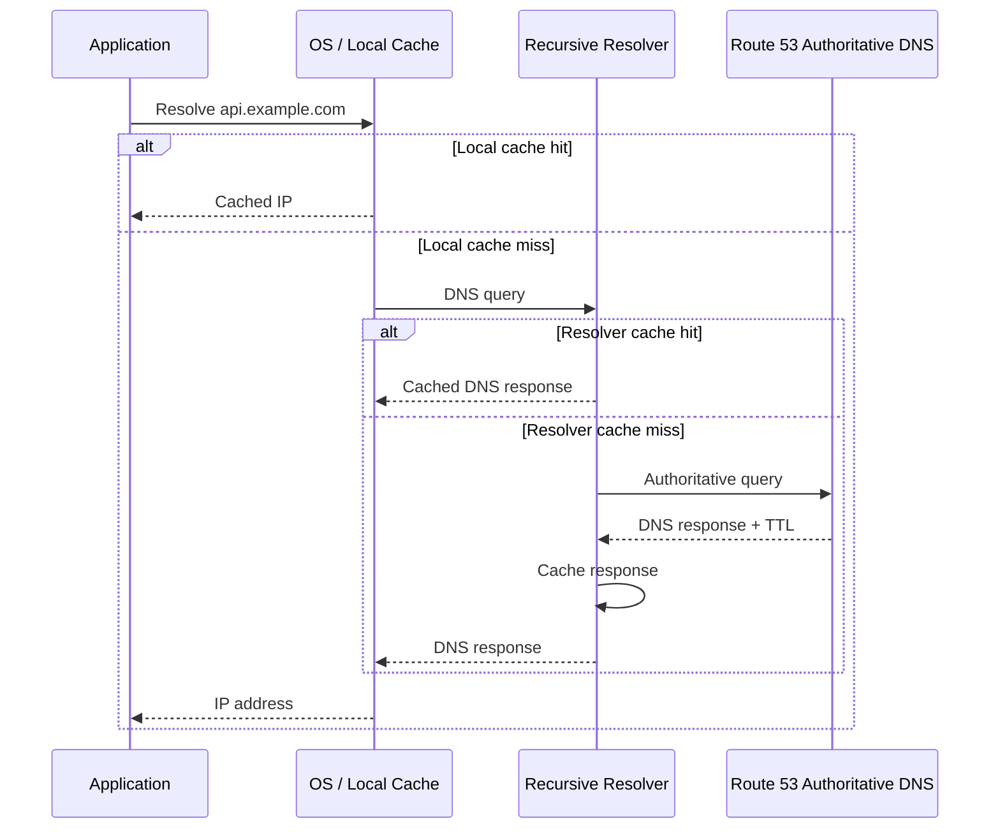

# 15- TTL and DNS Caching

## Overview

DNS caching is one of the most important operational concepts in Route 53 because DNS records are not necessarily queried from authoritative DNS every time a client needs an address.

The **Time to Live (TTL)** associated with a DNS record tells recursive DNS resolvers how long they may cache the response before querying again.

A simplified resolution path is:

```text
Application
    │
    ▼
OS / Local DNS Cache
    │
    ▼
Recursive Resolver
    │
    ├── Cache HIT ───────► Return cached response
    │
    └── Cache MISS
            │
            ▼
       Authoritative DNS
            │
            ▼
       Route 53 Hosted Zone
```

This creates an important engineering property:

> Changing a Route 53 record does not mean every DNS client immediately sees the new value.

The old answer may continue to be served from caches until the applicable TTL expires.

TTL therefore directly affects:

- DNS propagation behavior
- Failover speed
- Deployment safety
- Service discovery
- Traffic migration
- DNS query volume
- Resolver load
- Operational recovery
- Application availability

---

## What TTL Is

**TTL (Time to Live)** is the amount of time a DNS response can be cached by a recursive DNS resolver before it should be considered expired and refreshed.

For example:

```text
api.example.com
TTL = 300 seconds
```

means a recursive resolver can generally retain that DNS response for up to:

```text
300 seconds = 5 minutes
```

before it needs to obtain a fresh answer.

TTL is therefore a cache-control mechanism for DNS.

It does **not** mean:

```text
The record exists for only 300 seconds.
```

The authoritative Route 53 record continues to exist until it is changed or deleted.

The TTL controls caching of the DNS response.

---

## Why TTL Exists

Without caching, every DNS lookup would require additional DNS traffic.

Consider an API receiving millions of requests:

```text
Client 1 ──┐
Client 2 ──┤
Client 3 ──┤
Client 4 ──┤
     ...    ├──► DNS infrastructure
Client N ──┘
```

With caching:

```text
Clients
   │
   ▼
Recursive Resolver
   │
   ├── Cache HIT ──► Answer immediately
   │
   └── Cache MISS
           │
           ▼
      Authoritative DNS
```

Caching reduces:

- DNS query volume
- Network traffic
- DNS resolution latency
- Repeated authoritative lookups
- Infrastructure load

TTL is the mechanism that determines how aggressively the answer can be cached.

---

## Authoritative DNS vs Recursive DNS

A senior engineer must distinguish between the server that **owns the DNS data** and the resolver that **caches and serves DNS answers**.

| Component | Responsibility |
|---|---|
| Route 53 hosted zone | Authoritative source for configured records |
| Recursive resolver | Resolves DNS names on behalf of clients |
| OS DNS cache | Locally caches DNS results |
| Browser/application cache | May cache DNS information depending on implementation |
| Client | Initiates DNS resolution |

For a public Route 53 record:

```text
Application
    │
    ▼
Recursive Resolver
    │
    │ Cache MISS
    ▼
Route 53 Authoritative DNS
    │
    ▼
DNS Record
```

If the resolver already has a valid cached response:

```text
Application
    │
    ▼
Recursive Resolver
    │
    │ Cache HIT
    ▼
Cached DNS Answer
```

Route 53 is not necessarily contacted for every lookup.

---

## How TTL Works

Suppose Route 53 contains:

```text
api.example.com → 10.0.10.20
TTL → 300
```

A client performs the first lookup:

```text
Client
  │
  ▼
Recursive Resolver
  │
  │ Cache MISS
  ▼
Route 53
  │
  ▼
10.0.10.20
TTL=300
```

The resolver stores the answer.

For subsequent queries:

```text
Client
  │
  ▼
Recursive Resolver
  │
  │ Cache HIT
  ▼
10.0.10.20
```

No new authoritative lookup is required while the cached answer remains valid.

After the TTL expires:

```text
Recursive Resolver
       │
       │ Cache expired
       ▼
Route 53
       │
       ▼
Fresh DNS answer
```

The resolver refreshes the record.

---

## TTL Countdown

If a resolver receives:

```text
TTL = 300
```

the cached record effectively has a remaining lifetime.

Conceptually:

```text
300s ───────────────► 0s
 │                     │
 │                     │
Cache valid            Cache expired
                       │
                       ▼
                  Refresh required
```

Different resolvers may receive the record at different times.

Therefore, after a Route 53 change, there is not one globally synchronized countdown.

There can be many independent caches:

```text
Resolver A → cached until T1
Resolver B → cached until T2
Resolver C → cached until T3
Resolver D → cached until T4
```

This is why DNS changes can appear to propagate gradually.

---

## DNS Propagation Is Mostly Cache Expiration

The phrase "DNS propagation" is often misleading.

Route 53 does not need to push a new record to every DNS client on the Internet.

Instead:

```text
Route 53
   │
   │ New authoritative answer
   ▼
Recursive Resolver
   │
   │ Cache until TTL expires
   ▼
Client
```

When the record changes:

```text
Old cached answer
      │
      ▼
TTL expires
      │
      ▼
Resolver asks again
      │
      ▼
New authoritative answer
```

This is why lowering TTL **before** a planned DNS migration is useful.

---

## TTL and DNS Change Timing

Suppose:

```text
api.example.com
TTL = 3600
```

and you suddenly change:

```text
10.0.10.20
```

to:

```text
10.0.20.30
```

Some recursive resolvers may still return:

```text
10.0.10.20
```

until their existing cached TTL expires.

Changing the TTL after the record change does not retroactively invalidate previously cached responses.

This distinction is critical.

---

## TTL Reduction Before a Migration

For a planned migration:

```text
Current TTL = 3600
```

You can reduce it ahead of time:

```text
3600
  │
  ▼
300
  │
  ▼
60
```

The important part is the timing.

You need to lower the TTL and allow the previous higher-TTL cached responses to expire before relying on the shorter TTL.

Conceptually:


A common mistake is:

```text
Lower TTL
   │
   └── immediately change destination
```

and then assuming all clients will honor the new lower TTL.

They cannot, because they may still hold the previous response.

---

## TTL and DNS Cutover

Suppose you are migrating:

```text
api.example.com
```

from:

```text
Old infrastructure
10.0.10.20
```

to:

```text
New infrastructure
10.0.20.30
```

A safer migration sequence is:

```text
Days / hours before migration
        │
        ▼
Reduce TTL
        │
        ▼
Wait for old cached answers to age out
        │
        ▼
Validate new infrastructure
        │
        ▼
Change DNS record
        │
        ▼
Monitor traffic
        │
        ▼
Increase TTL
```

The exact TTL and waiting period depend on the application's availability requirements and the previous TTL.

---

## TTL and Failover

TTL directly affects DNS-based failover behavior.

Suppose:

```text
api.example.com
    │
    ▼
Primary endpoint
```

and Route 53 changes the answer to:

```text
Secondary endpoint
```

A resolver that still has the primary answer cached can continue returning it until the cached response expires.

Therefore:

```text
DNS failover decision
        +
DNS cache lifetime
        =
Effective failover visibility
```

This is why DNS failover should not be treated as instantaneous.

---

## TTL Does Not Guarantee Failover Time

A common misconception is:

```text
TTL = 60 seconds
```

therefore:

```text
Failover = exactly 60 seconds
```

That is incorrect.

The actual recovery experience can also depend on:

- Existing cache state
- Resolver behavior
- Client-side caching
- OS caching
- Application DNS caching
- Connection reuse
- TCP/TLS connection lifetime
- Health-check detection
- Application retry behavior
- Load balancer behavior

A more accurate model is:

```text
DNS TTL
    +
Client / OS caching
    +
Existing connections
    +
Health-check detection
    +
Application retry behavior
    =
Observed failover behavior
```

---

## TTL and Connection Reuse

DNS changes affect new connections, not necessarily already-established connections.

For example:

```text
Application
    │
    ▼
DNS lookup
    │
    ▼
10.0.10.20
    │
    ▼
TCP connection
    │
    ▼
Long-lived connection
```

If the DNS record changes to:

```text
10.0.20.30
```

the existing TCP connection may continue communicating with:

```text
10.0.10.20
```

until the connection closes.

This is especially relevant for:

- HTTP keep-alive
- gRPC
- WebSockets
- Database connections
- Connection pools

Therefore DNS TTL is not equivalent to connection lifetime.

---

## TTL and HTTP Clients

Consider a FastAPI service calling another service:

```text
FastAPI
   │
   ▼
payments.internal.example.com
   │
   ▼
10.0.10.20
```

The application may use an HTTP connection pool.

Even if DNS changes:

```text
payments.internal.example.com
        │
        ▼
10.0.20.30
```

existing pooled connections may still target the old endpoint.

The application therefore has two separate mechanisms:

```text
DNS cache
+
Connection pool
```

Both must be considered when designing failover.

---

## TTL and gRPC

This is especially important for gRPC because connections are typically long-lived HTTP/2 connections.

Consider:

```text
Client
   │
   ▼
DNS
   │
   ▼
Service endpoint
   │
   ▼
Long-lived HTTP/2 connection
```

A DNS change does not necessarily move an existing gRPC channel immediately.

For gRPC-based systems, DNS-based traffic migration should therefore consider:

- Channel lifetime
- Resolver behavior
- Load balancing
- Connection draining
- Retry policy
- Service discovery

DNS TTL is only one component of the failover mechanism.

---

## TTL and Kubernetes

Kubernetes adds another DNS caching layer.

A simplified architecture is:

```text
Application Pod
      │
      ▼
CoreDNS
      │
      ├── Kubernetes service
      │
      └── External DNS
              │
              ▼
        VPC Resolver
```

Depending on the workload and DNS configuration, caching may occur in:

- Application runtime
- Container
- Node
- CoreDNS
- VPC Resolver
- Upstream recursive resolver

Therefore changing a Route 53 TTL does not necessarily mean every Kubernetes workload immediately observes the new answer.

This is particularly important when debugging service-discovery behavior.

---

## TTL and DNS Negative Caching

Caching is not limited to successful DNS responses.

DNS can also cache negative responses such as:

```text
NXDOMAIN
```

which means:

```text
The requested domain name does not exist.
```

Negative caching is generally controlled by information in the zone's **SOA record**, including its TTL-related fields.

For example:

```text
api.example.com
```

does not exist at the time of the first query:

```text
Client
  │
  ▼
Resolver
  │
  ▼
Route 53
  │
  ▼
NXDOMAIN
```

The resolver may cache that negative result.

If you immediately create:

```text
api.example.com
```

some clients may still receive:

```text
NXDOMAIN
```

until the negative cache expires.

---

## Negative Caching During Deployments

This creates an important deployment hazard.

Suppose a service is deployed with:

```text
api.example.com
```

but the DNS record is created only afterward.

A client may have already queried the name:

```text
api.example.com
      │
      ▼
NXDOMAIN
```

and cached the negative result.

Even after the record is created:

```text
api.example.com → 10.0.20.30
```

the resolver may continue returning the cached negative response.

Therefore DNS names should generally be provisioned before clients begin depending on them.

---

## DNS TTL Layers

A senior engineer should think about DNS caching as multiple layers rather than a single cache.

```text
Application
    │
    ▼
Application DNS Cache
    │
    ▼
OS / libc Resolver
    │
    ▼
Local DNS Cache
    │
    ▼
Recursive Resolver
    │
    ▼
Route 53 Authoritative DNS
```

Not every application or operating system implements every layer.

The important point is:

> The Route 53 record TTL is not necessarily the only caching mechanism affecting your application.

---

## Common DNS Caching Layers

| Layer | Possible caching behavior |
|---|---|
| Browser | May cache DNS information |
| Application | Some runtimes/libraries may cache DNS |
| HTTP client | Connection reuse can outlive DNS lookup |
| OS | Resolver libraries or local services may cache |
| Container | May use local DNS infrastructure |
| Kubernetes CoreDNS | Caches DNS responses |
| Recursive resolver | Caches according to DNS TTL |
| Route 53 | Authoritative source rather than the client cache |

This is why DNS debugging requires understanding the entire resolution path.

---

## TTL and Route 53 Record Types

TTL applies differently depending on how the Route 53 record is configured.

For normal records:

```text
A
AAAA
CNAME
MX
TXT
NS
SRV
```

you normally configure a TTL on the record.

Example:

```text
Name: api.example.com
Type: A
TTL: 300
Value: 10.0.10.20
```

The TTL becomes part of the DNS response.

---

## Alias Records and TTL

Route 53 **Alias records do not have a user-configurable TTL field** in the same way that standard DNS records do.

For Alias records, Route 53 uses the TTL behavior associated with the AWS resource being aliased.

For example:

```text
api.example.com
      │
      ▼
Route 53 Alias
      │
      ▼
Application Load Balancer
```

The effective DNS caching behavior is therefore determined by the target resource rather than by entering an arbitrary TTL directly on the Alias record.

This is an important distinction when designing Route 53 architectures.

---

## TTL and Weighted Routing

Suppose:

```text
api.example.com
```

has weighted records:

```text
Version A → 90
Version B → 10
```

The Route 53 routing decision happens when Route 53 answers a DNS query.

But the recursive resolver may cache that answer.

Therefore:

```text
Client
   │
   ▼
Recursive Resolver
   │
   │ Cache HIT
   ▼
Previously returned weighted answer
```

The client does not necessarily cause a new Route 53 weighted-routing decision on every request.

This means DNS-based traffic distribution is fundamentally different from request-level load balancing.

---

## DNS Routing vs Load Balancing

| DNS routing | Load balancing |
|---|---|
| Operates during DNS resolution | Operates on application connections/requests |
| Influenced by TTL and caching | Can make decisions per connection/request |
| Client may cache answer | Usually centralized at load balancer |
| Changes are not instantaneous | Can react faster after request reaches LB |
| Good for coarse traffic distribution | Better for fine-grained request distribution |

For example:

```text
Route 53
   │
   ├── Region A
   └── Region B
```

may distribute DNS queries between regions.

But:

```text
Application
   │
   ▼
ALB
   │
   ├── Target A
   ├── Target B
   └── Target C
```

can distribute incoming connections within the region.

---

## TTL and Latency-Based Routing

Latency-based routing selects an answer based on Route 53's latency-routing logic.

However, once a resolver caches the response:

```text
Client
   │
   ▼
Recursive Resolver
   │
   ▼
Cached region-specific answer
```

the client continues using that answer until it expires.

Therefore latency-based routing does not continuously re-evaluate the optimal region for every application request.

TTL controls how frequently a resolver may obtain a fresh routing decision.

---

## TTL and Health Checks

Health checks and TTL serve different purposes.

```text
Health Check
    │
    ▼
Is endpoint healthy?
```

while:

```text
TTL
    │
    ▼
How long can DNS answer be cached?
```

For Route 53 failover routing:

```text
Health Check
     │
     ▼
Routing decision
     │
     ▼
DNS response
     │
     ▼
TTL-based caching
```

A health check can detect failure while clients continue using an older cached DNS response until that response expires.

---

## TTL and Route 53 Failover Routing

Consider:

```text
Primary
10.0.10.20

Secondary
10.0.20.20
```

with a DNS TTL of:

```text
60 seconds
```

A failure occurs:

```text
Primary fails
     │
     ▼
Health check detects failure
     │
     ▼
Route 53 returns Secondary
```

But:

```text
Recursive Resolver
```

may still have:

```text
Primary
```

cached from an earlier query.

The resolver will only request a fresh answer after its cached response expires.

Therefore:

```text
Health detection time
+
DNS cache expiration
```

contribute to the effective DNS failover time.

---

## TTL and Blue-Green Deployments

DNS can be used as part of a blue-green deployment.

```text
api.example.com
       │
       ▼
Route 53
       │
       ├── Blue
       └── Green
```

A migration might be:

```text
100% Blue
   │
   ▼
Lower TTL
   │
   ▼
Validate Green
   │
   ▼
Switch DNS
   │
   ▼
Observe
   │
   ▼
Retire Blue
```

However, DNS is not ideal for precise percentage-based request control because resolver caching means the distribution occurs at resolver/query granularity rather than necessarily at individual HTTP request granularity.

---

## TTL and Canary Deployments

DNS weighted routing can support coarse canary traffic:

```text
Stable → 95
Canary → 5
```

But the observed request distribution may not be exactly:

```text
95 / 5
```

because:

- DNS answers are cached
- Different recursive resolvers generate different query volumes
- Clients are not uniformly distributed
- Some clients reuse connections
- Some clients cache DNS independently

For precise application-level canarying, a load balancer, service mesh, or application-level mechanism is usually more predictable.

---

## TTL Selection

There is no universally correct TTL.

Choose TTL based on:

- How frequently the record changes
- How quickly failover must become visible
- DNS query volume
- Application architecture
- Availability requirements
- Traffic migration strategy
- Operational cost
- Resolver caching behavior

A practical conceptual guide:

| Use case | Typical strategy |
|---|---|
| Stable production endpoint | Moderate/high TTL |
| Frequently changing infrastructure | Lower TTL |
| Planned migration | Temporarily reduce TTL |
| DNS-based failover | Lower TTL when fast visibility matters |
| Static infrastructure | Higher TTL |
| Canary using DNS | Lower TTL during migration |
| Internal service discovery | Carefully balance freshness and DNS load |

These are architectural guidelines rather than mandatory Route 53 values.

---

## High TTL

Example:

```text
TTL = 86400
```

Advantages:

- Fewer recursive DNS queries
- Better cache efficiency
- Lower DNS traffic
- Stable DNS behavior

Limitations:

- DNS changes become slower to observe
- Failover visibility can be slower
- Infrastructure migration becomes harder

High TTL is appropriate for stable records that rarely change.

---

## Low TTL

Example:

```text
TTL = 60
```

Advantages:

- Faster visibility of DNS changes
- Better suitability for planned migrations
- Faster DNS-level failover visibility

Limitations:

- More DNS queries
- More frequent authoritative resolution
- Greater dependency on DNS infrastructure
- Still does not guarantee immediate application failover

Low TTL is useful when freshness matters more than cache efficiency.

---

## Extremely Low TTL

A very low TTL may appear attractive:

```text
TTL = 1
```

because it seems to provide near-instant DNS changes.

However, extremely low TTLs are not a universal solution.

They can:

- Increase DNS query volume
- Reduce cache effectiveness
- Increase dependency on DNS availability
- Increase operational complexity
- Provide little benefit if the application maintains long-lived connections

Use low TTLs because the architecture requires them, not because lower is always better.

---

## TTL and Cost

DNS caching affects query volume.

Conceptually:

```text
Higher TTL
   │
   ▼
More cache hits
   │
   ▼
Fewer DNS queries
```

while:

```text
Lower TTL
   │
   ▼
More cache expirations
   │
   ▼
More DNS queries
```

The cost impact depends on the Route 53 configuration, query volume, resolver behavior, and other AWS services involved.

The more important engineering principle is:

> TTL is a performance, reliability, and operational parameter, not merely a DNS configuration field.

---

## TTL and Reliability

A high TTL improves cache resilience in some scenarios.

Suppose:

```text
Resolver
   │
   ▼
Cached answer
```

Even if the authoritative DNS infrastructure temporarily becomes unreachable, the resolver may continue serving a valid cached response until its cache entry expires.

A lower TTL causes the resolver to refresh more frequently.

This creates a tradeoff:

```text
High TTL
    │
    ├── Better cache persistence
    └── Slower DNS changes

Low TTL
    │
    ├── Faster DNS changes
    └── More frequent resolution
```

---

## TTL and Disaster Recovery

DNS TTL should be part of DR planning.

Suppose a regional application is unavailable:

```text
Region A
   │
   X
   │
   ▼
Region B
```

If DNS is used to redirect clients:

```text
Route 53
   │
   ▼
Region B
```

the TTL determines how quickly recursive resolvers can obtain the new destination after a DNS routing change.

However, DR planning must also consider:

- Health-check detection
- DNS caching
- Application connection reuse
- Client-side DNS caching
- Database recovery
- Data replication
- Load balancer state
- Application startup time

DNS TTL is only one component of the recovery-time equation.

---

## TTL During Planned Infrastructure Changes

A robust migration process should account for the **old TTL**, not only the desired new TTL.

Suppose:

```text
Current TTL = 3600 seconds
```

You change it to:

```text
300 seconds
```

Immediately afterward, some resolvers can still have:

```text
Old answer
TTL remaining = up to approximately 3600 seconds
```

depending on when they cached the previous response.

Therefore:

```text
Lower TTL
   │
   ▼
Wait long enough for previous caches to age out
   │
   ▼
Change destination
```

The waiting period should be based on the previous TTL and the operational risk of the migration.

---

## TTL Change Example

Before migration:

```text
api.example.com
TTL = 3600
A = 10.0.10.20
```

Preparation:

```text
TTL = 300
A = 10.0.10.20
```

After the old 3600-second cache population has aged out:

```text
TTL = 300
A = 10.0.20.30
```

Then monitor:

```text
Traffic
Errors
Latency
Health checks
DNS behavior
Application connections
```

After the migration stabilizes:

```text
TTL = 3600
```

if a higher TTL is appropriate for the service.

---

## TTL and Infrastructure as Code

DNS records should generally be managed through infrastructure-as-code when they are part of production infrastructure.

For example, Terraform:

```hcl
resource "aws_route53_record" "api" {
  zone_id = aws_route53_zone.example.zone_id
  name    = "api.example.com"
  type    = "A"
  ttl     = 300

  records = [
    "10.0.20.30"
  ]
}
```

This provides:

- Version control
- Reviewable changes
- Repeatability
- Auditability
- Controlled deployment

During a migration, the TTL change should be treated as an intentional infrastructure change rather than an undocumented console modification.

---

## TTL Validation with AWS CLI

Inspect a Route 53 record:

```bash
aws route53 list-resource-record-sets \
  --hosted-zone-id Z123456789 \
  --query "ResourceRecordSets[?Name=='api.example.com.']"
```

A response may contain:

```json
{
  "Name": "api.example.com.",
  "Type": "A",
  "TTL": 300,
  "ResourceRecords": [
    {
      "Value": "10.0.20.30"
    }
  ]
}
```

This is useful when validating that the deployed infrastructure matches the intended DNS configuration.

---

## Inspecting DNS TTL with dig

Use:

```bash
dig api.example.com
```

Look at the answer section:

```text
;; ANSWER SECTION:
api.example.com.    300    IN    A    10.0.20.30
```

The value:

```text
300
```

is the TTL remaining in the DNS response observed by the querying resolver.

It is not necessarily the original TTL configured at Route 53.

---

## Why `dig` TTL Values Decrease

Suppose Route 53 configured:

```text
TTL = 300
```

A resolver caches the response.

Later:

```bash
dig api.example.com
```

may show:

```text
120
```

rather than:

```text
300
```

because the resolver is reporting the remaining TTL.

For example:

```text
Initial response:
300

After 60 seconds:
240

After 180 seconds:
120

After expiration:
Resolver refreshes
```

This is a useful diagnostic technique.

---

## Querying Different Resolvers

Different recursive resolvers may show different TTL values.

For example:

```bash
dig @8.8.8.8 api.example.com
```

and:

```bash
dig @1.1.1.1 api.example.com
```

may return different remaining TTLs because the resolvers cached the record at different times.

This is normal.

The important question is not:

```text
Why do all DNS resolvers show exactly the same TTL?
```

but:

```text
Why are different resolvers at different points in their cache lifetime?
```

---

## DNS Debugging Workflow

When investigating a DNS change:

```text
1. Check Route 53 authoritative configuration
        │
        ▼
2. Check configured TTL
        │
        ▼
3. Query authoritative DNS if appropriate
        │
        ▼
4. Query multiple recursive resolvers
        │
        ▼
5. Compare returned TTL values
        │
        ▼
6. Check application / OS caching
        │
        ▼
7. Check connection reuse
```

This separates:

```text
Authoritative state
```

from:

```text
Cached state
```

which is essential for diagnosing DNS incidents.

---

## Authoritative vs Cached DNS Testing

A useful troubleshooting distinction is:

```text
Route 53 authoritative answer
            │
            ▼
     "What should DNS return?"
```

versus:

```text
Recursive resolver answer
            │
            ▼
     "What are clients likely to receive?"
```

If Route 53 is correct but recursive resolvers still return the old address, caching is likely involved.

---

## DNS TTL and Security

TTL is also relevant to security-sensitive infrastructure.

For example, if a compromised endpoint needs to be removed from DNS:

```text
Compromised endpoint
       │
       ▼
Remove / change DNS record
```

existing caches may continue returning the old address until expiration.

DNS should therefore not be the only security control for endpoint removal.

Use additional controls such as:

- Security groups
- Network ACLs where appropriate
- Load balancer target health
- WAF
- Application authentication
- Service authorization
- Network segmentation

DNS changes are not an immediate security revocation mechanism.

---

## DNS TTL and Cache Poisoning Considerations

DNS caching provides efficiency but also creates a trust boundary.

Modern recursive resolvers implement DNS security mechanisms to reduce risks such as cache poisoning.

Application engineers generally should not attempt to implement DNS validation themselves.

Instead:

- Use trusted DNS infrastructure.
- Avoid custom DNS resolvers unless necessary.
- Use DNSSEC where appropriate for authoritative/public DNS requirements.
- Monitor unexpected DNS behavior.
- Keep infrastructure configuration controlled through IAM and IaC.

TTL itself does not provide security.

It is primarily a caching control.

---

## Production Pitfalls

### Changing a Record and Expecting Immediate Global Change

Incorrect assumption:

```text
Route 53 changed
      =
Every client changed
```

Correct model:

```text
Route 53 changed
      │
      ▼
Existing caches expire
      │
      ▼
Resolvers query again
      │
      ▼
Clients eventually observe new answer
```

---

### Lowering TTL Too Late

If a record has:

```text
TTL = 86400
```

and you lower it immediately before a migration, clients may still have the previous answer cached for much of that original TTL.

Lower the TTL sufficiently in advance.

---

### Assuming TTL Controls Application Connections

DNS TTL controls DNS caching.

It does not force:

- TCP connections to close
- HTTP keep-alive connections to close
- gRPC channels to reconnect
- Database pools to reconnect

These are separate mechanisms.

---

### Using Extremely Low TTL Everywhere

Low TTL is not automatically better.

It can increase DNS traffic without solving application-level connection reuse or caching elsewhere.

---

### Ignoring Negative DNS Caching

Creating a DNS record after clients have already received `NXDOMAIN` may not immediately make the record visible to those clients.

Consider negative caching during new service deployments.

---

### Treating DNS Routing as Request-Level Load Balancing

A Route 53 routing policy generally makes a decision when DNS responses are generated.

Cached responses can then be reused for many application requests.

For request-level distribution, use an appropriate load-balancing layer.

---

### Forgetting Alias Behavior

Alias records do not expose a normal user-configurable TTL field.

Do not design an architecture assuming every Route 53 record lets you independently choose its TTL.

---

### Ignoring Client-Side Caches

Even if a recursive resolver has refreshed its answer, an application, OS, browser, or local DNS service may have its own caching behavior.

Always investigate the full resolution chain.

---

## Production Best Practices

### Choose TTL Based on Operational Requirements

Do not use:

```text
TTL = 300
```

everywhere simply because it is common.

Ask:

- How frequently does this record change?
- How quickly must changes become visible?
- Is DNS being used for failover?
- Is this a stable endpoint?
- Does the application maintain long-lived connections?
- What DNS query volume is acceptable?

---

### Lower TTL Before Planned Changes

For controlled migrations:

```text
High TTL
   │
   ▼
Lower TTL
   │
   ▼
Wait for old cache population to expire
   │
   ▼
Change DNS
   │
   ▼
Monitor
   │
   ▼
Restore higher TTL if appropriate
```

---

### Do Not Depend on DNS for Instant Failover

If an application requires very fast failover:

```text
DNS
+
Load balancer
+
Health checks
+
Application retries
+
Connection management
```

should be considered together.

DNS alone cannot guarantee immediate traffic movement.

---

### Design Connection Management Separately

For services using:

- FastAPI
- Django
- gRPC
- PostgreSQL
- Redis
- HTTP clients

evaluate connection pooling independently from DNS TTL.

For example:

```text
DNS TTL = 60s
Connection pool lifetime = 30m
```

can still result in connections targeting an old endpoint.

---

### Test DNS Changes Before Production

Validate:

```bash
dig api.example.com
```

from multiple networks and recursive resolvers where practical.

For critical migrations, test:

- Authoritative answer
- Public recursive resolvers
- Corporate DNS
- VPC Resolver
- Application runtime
- Kubernetes/CoreDNS where applicable

---

### Monitor During DNS Migrations

Track:

- HTTP error rate
- DNS resolution failures
- Request latency
- Connection failures
- Health-check status
- Traffic distribution
- Application logs
- DNS query behavior

DNS migration should be treated as a production change, not simply a record edit.

---

## TTL Decision Matrix

| Requirement | TTL direction |
|---|---|
| Record rarely changes | Higher |
| Frequent infrastructure changes | Lower |
| Planned DNS migration | Temporarily lower |
| DNS-based failover | Lower if faster visibility is required |
| Stable static endpoint | Higher |
| DNS-based canary | Temporarily lower |
| Long-lived gRPC connections | TTL alone is insufficient |
| Service discovery | Balance freshness and query volume |
| Security revocation | Do not rely on TTL alone |

---

## End-to-End DNS Cache Flow



The important engineering observation is that Route 53 may participate only on a cache miss.

---

## DNS Change Visibility Model

```text
                 Route 53
                    │
                    │ New record
                    ▼
             Authoritative DNS
                    │
                    ▼
          Recursive Resolver A
          ┌─────────────────┐
          │ Old cache       │
          │ TTL remaining   │
          └─────────────────┘
                    │
                    ▼
                 Client A


                 Route 53
                    │
                    │ New record
                    ▼
             Authoritative DNS
                    │
                    ▼
          Recursive Resolver B
          ┌─────────────────┐
          │ Fresh response  │
          └─────────────────┘
                    │
                    ▼
                 Client B
```

At the same moment:

```text
Client A → Old answer
Client B → New answer
```

can be completely valid DNS behavior.

---

## Senior Engineering Mental Model

When reasoning about Route 53 TTL, think in terms of **freshness versus cache efficiency**.

```text
Lower TTL
   │
   ├── Faster DNS changes
   ├── Faster visibility of routing changes
   └── More DNS queries

Higher TTL
   │
   ├── Better caching
   ├── Lower DNS query volume
   └── Slower visibility of DNS changes
```

Then add the rest of the system:

```text
Route 53 TTL
     │
     ▼
Recursive Resolver Cache
     │
     ▼
OS / Application DNS Cache
     │
     ▼
Connection Pool
     │
     ▼
Long-Lived TCP / HTTP / gRPC Connection
     │
     ▼
Actual Application Traffic
```

This is the level of reasoning required when diagnosing production DNS behavior.

---

## Key Takeaways

- **TTL controls how long DNS responses may remain cached; it does not control how long the authoritative Route 53 record exists.**
- Route 53 is authoritative for the records in its hosted zones, while recursive resolvers cache and serve DNS responses to clients.
- A Route 53 record change does not immediately invalidate existing recursive DNS caches.
- Different recursive resolvers can observe different answers during the same DNS migration because their caches expire at different times.
- DNS "propagation" is largely the process of cached answers expiring and resolvers obtaining fresh authoritative responses.
- Lowering TTL **after** a DNS change does not retroactively invalidate responses cached under the previous higher TTL.
- For planned migrations, lower the TTL sufficiently in advance and allow previous higher-TTL cache entries to age out before the cutover.
- Low TTL improves DNS-change visibility but increases DNS query frequency and reduces cache efficiency.
- High TTL improves cache efficiency but makes DNS changes and DNS-based failover slower to become visible.
- **TTL does not guarantee an exact failover time.**
- Health-check detection, recursive caching, OS/application caching, connection reuse, and retry behavior can all affect observed failover.
- Existing TCP, HTTP keep-alive, gRPC, WebSocket, and database connections can continue using an old endpoint even after DNS changes.
- DNS TTL and application connection lifetime are separate controls and must be designed independently.
- Negative DNS responses such as `NXDOMAIN` can also be cached, so creating a previously nonexistent DNS record may not become immediately visible.
- Route 53 Alias records do not expose a normal user-configurable TTL field; their DNS response behavior depends on the target AWS resource.
- DNS routing policies such as weighted and latency-based routing operate when DNS answers are generated; recursive caching means they should not be treated as request-level load balancing.
- DNS-based canary deployments provide coarse traffic distribution and should not be expected to produce exact request percentages.
- Kubernetes introduces additional DNS layers such as CoreDNS, so a Route 53 TTL change may not be the only caching behavior affecting a workload.
- DNS query debugging should distinguish authoritative answers from recursive cached answers.
- `dig` is useful for inspecting DNS responses and remaining TTL values:
  ```bash
  dig api.example.com
  ```
- DNS should not be used as an instantaneous security-revocation mechanism because old answers may remain cached.
- TTL should be selected based on operational requirements rather than copied blindly across all Route 53 records.
- The senior-level mental model is **not simply "TTL = propagation time."** Think of DNS as a distributed caching system whose freshness, failover behavior, and traffic movement interact with the entire application networking stack.