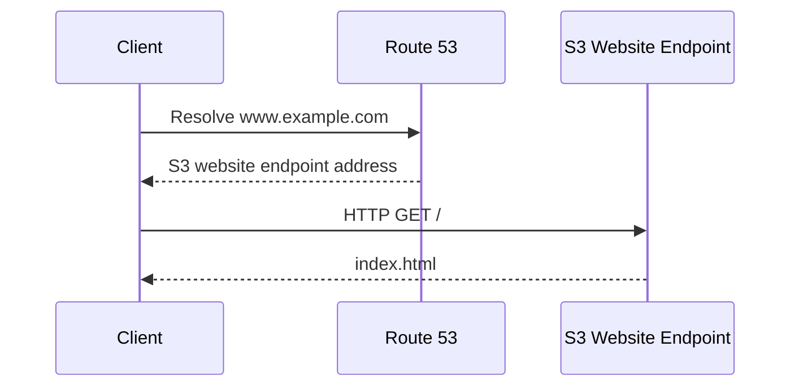
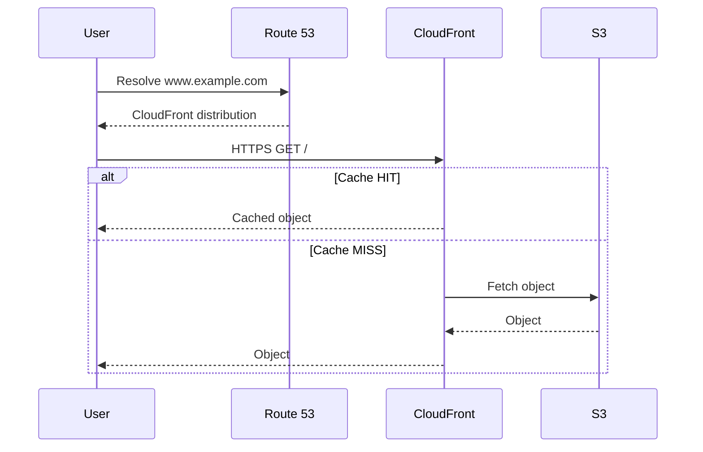

# 16- Route 53 with S3

## Overview

Amazon Route 53 and Amazon S3 are commonly combined to serve static websites using a custom domain such as:

```text
www.example.com
```

The typical architecture is:

```text
Client
   │
   │ DNS query
   ▼
Route 53
   │
   │ Alias record
   ▼
S3 Static Website Endpoint
   │
   ├── index.html
   ├── assets/
   └── error.html
```

The important distinction is that Route 53 provides **DNS resolution** while S3 provides **object storage and, when configured as a website endpoint, static website serving**.

Route 53 does not serve the website itself.

A production architecture may instead introduce CloudFront:

```text
Client
   │
   ▼
Route 53
   │
   ▼
CloudFront
   │
   ▼
S3
```

This is generally the preferred architecture when the application requires HTTPS, caching, global delivery, or stronger edge security controls.

---

## What Route 53 and S3 Provide

The responsibilities are separate.

| Component | Responsibility |
|---|---|
| Route 53 | DNS resolution and routing |
| S3 | Static object storage |
| S3 Website Endpoint | HTTP static website hosting |
| CloudFront | CDN, HTTPS termination, edge caching, and origin access |
| ACM | TLS certificates for CloudFront/custom HTTPS endpoints |

For example:

```text
www.example.com
      │
      │ DNS
      ▼
Route 53
      │
      │ Alias
      ▼
S3 Website Endpoint
      │
      ▼
index.html
```

Route 53 answers the question:

> Where should `www.example.com` resolve?

S3 answers the question:

> What content should be returned for the requested object?

---

## Why Use Route 53 with S3

This architecture is useful for websites that contain primarily static content:

- HTML
- CSS
- JavaScript
- Images
- Fonts
- Documentation
- Static documentation portals
- Frontend SPA assets

Typical examples include:

```text
https://docs.example.com
https://www.example.com
https://status.example.com
```

The backend API can remain separate:

```text
www.example.com  → S3 / CloudFront
api.example.com  → ALB / API Gateway / ECS / Lambda
```

This separation is often a clean backend architecture because static frontend delivery does not consume application-server resources.

---

## S3 Static Website Hosting

An S3 bucket can be configured for static website hosting.

Conceptually:

```text
S3 Bucket
│
├── index.html
├── error.html
├── css/
├── js/
└── images/
```

S3 can expose a website endpoint that understands concepts such as:

- Index document
- Error document
- Object paths
- HTTP redirects

For example:

```text
/
    → index.html

/about
    → corresponding configured object behavior

/missing
    → error.html
```

The S3 website endpoint is different from the normal S3 object REST endpoint.

---

## S3 REST Endpoint vs Website Endpoint

This distinction is one of the most important concepts in Route 53 + S3 architectures.

| Property | S3 REST endpoint | S3 Website endpoint |
|---|---|---|
| Purpose | Object API access | Static website hosting |
| Website index handling | No | Yes |
| Custom error document behavior | No | Yes |
| HTTP website behavior | No | Yes |
| HTTPS directly through S3 website endpoint | No | No |
| Suitable for direct public static website | Not by itself | Yes |
| CloudFront origin | Yes | Yes |

A common mistake is assuming:

```text
bucket.s3.amazonaws.com
```

and:

```text
bucket.s3-website-region.amazonaws.com
```

provide the same behavior.

They do not.

The website endpoint provides website-hosting semantics that the standard S3 API endpoint does not.

---

## Custom Domain Architecture

Suppose the desired domain is:

```text
www.example.com
```

The S3 bucket should normally be named:

```text
www.example.com
```

The relationship becomes:

```text
www.example.com
        │
        ▼
Route 53 Hosted Zone
        │
        │ Alias
        ▼
S3 Website Endpoint
        │
        ▼
Bucket: www.example.com
```

Matching the bucket name to the domain is an important part of the direct S3 website-hosting pattern.

---

## Request Flow

A request to:

```text
http://www.example.com
```

can follow this path:



The important observation is that Route 53 handles the DNS phase only.

The HTTP request is subsequently handled by S3.

---

## Route 53 Alias Record

For an S3 website endpoint, Route 53 can use an **Alias** record.

Conceptually:

```text
www.example.com
        │
        ▼
A / Alias
        │
        ▼
S3 Website Endpoint
```

An Alias record is preferable to manually maintaining an IP address because S3 website endpoints are AWS-managed resources rather than fixed application-server IPs.

Example architecture:

```text
Route 53 Hosted Zone
        │
        └── www.example.com
                 │
                 │ A Alias
                 ▼
          S3 Website Endpoint
                 │
                 ▼
             S3 Bucket
```

---

## Why an Alias Record Is Important

S3 website hosting does not provide a conventional static IP address that you should place in an A record.

Therefore this is not the correct model:

```text
www.example.com
      │
      ▼
A = hard-coded IP
```

Instead:

```text
www.example.com
      │
      ▼
Route 53 Alias
      │
      ▼
S3 Website Endpoint
```

The Alias mechanism allows Route 53 to target supported AWS resources without requiring the application engineer to manage their underlying IP addresses.

---

## Alias vs CNAME

For a subdomain such as:

```text
www.example.com
```

a CNAME could conceptually point to an S3 website endpoint.

However, Route 53 Alias records provide AWS-aware integration and can be used with supported AWS resources.

The distinction becomes especially important at the zone apex.

For example:

```text
example.com
```

cannot use a traditional CNAME record because DNS standards do not allow a CNAME at the same name as the zone apex's required SOA/NS records.

Route 53 Alias records solve this problem for supported AWS targets.

---

## Root Domain vs Subdomain

There are two common website names:

```text
example.com
www.example.com
```

A common architecture is:

```text
example.com
    │
    ▼
Route 53 Alias
    │
    ▼
S3 / CloudFront

www.example.com
    │
    ▼
Route 53 Alias
    │
    ▼
S3 / CloudFront
```

Alternatively, one hostname can redirect to the other.

For example:

```text
example.com
    │
    ▼
Redirect
    │
    ▼
www.example.com
```

The important point is to deliberately choose a canonical hostname rather than accidentally serving the same site independently from multiple endpoints.

---

## Bucket Naming

For direct S3 website hosting with a custom domain:

```text
www.example.com
```

should correspond to an S3 bucket named:

```text
www.example.com
```

For example:

```text
Bucket
└── www.example.com
```

The website endpoint is then associated with that bucket.

This is one reason DNS naming and S3 bucket naming are coupled in the direct website-hosting pattern.

---

## S3 Website Endpoint Format

S3 website endpoint formats vary by AWS Region and endpoint style.

Conceptually, they look like:

```text
bucket-name.s3-website-region.amazonaws.com
```

or an equivalent regional website endpoint format.

Do not hard-code endpoint formats into application logic.

When configuring Route 53, use the AWS console, CLI, SDK, or infrastructure-as-code resource attributes to select the correct website endpoint for the bucket's Region.

---

## Website Configuration

A static website generally requires:

```text
Index document:
index.html

Error document:
error.html
```

For example:

```text
index.html
error.html
css/
js/
images/
```

When a request targets the website root:

```text
GET /
```

S3 can return:

```text
index.html
```

For an invalid path, S3 can use the configured error document.

---

## SPA Routing Considerations

Single-page applications introduce an additional concern.

Consider:

```text
https://www.example.com/dashboard
```

The frontend router may expect the application to load:

```text
index.html
```

and then allow React, Vue, Angular, or another frontend framework to handle:

```text
/dashboard
```

A static website endpoint may not automatically behave exactly like a web server configured for SPA fallback.

Therefore SPA deployments should explicitly test:

```text
/
/login
/dashboard
/settings
/nonexistent-path
```

and configure the appropriate error/fallback behavior.

CloudFront is often a better fit for production SPAs because it provides more flexible edge behavior.

---

## Public Access Considerations

A direct S3 website endpoint requires the objects to be accessible in a manner compatible with website hosting.

This creates an important security tradeoff.

You generally do not want to expose an S3 bucket more broadly than necessary.

For a simple public static website:

```text
Internet
   │
   ▼
S3 Website Endpoint
   │
   ▼
Public website objects
```

is possible.

However, a stronger production architecture is usually:

```text
Internet
   │
   ▼
CloudFront
   │
   ▼
Private S3 bucket
```

where CloudFront accesses the bucket using an appropriate origin access mechanism.

This prevents direct public access to the S3 bucket and centralizes HTTP delivery at the CDN layer.

---

## Direct S3 Website vs CloudFront

| Capability | S3 Website Endpoint | CloudFront + S3 |
|---|---:|---:|
| Static website hosting | Yes | Yes |
| HTTPS custom domain | No | Yes |
| Global edge caching | No | Yes |
| CDN | No | Yes |
| DDoS protection integration | Limited | Better AWS edge architecture |
| Private S3 origin | No for direct website access | Yes |
| Custom caching policies | Limited | Yes |
| Edge functions | No | Yes |
| HTTP headers/security policies | Limited | Stronger control |
| Production recommendation | Simple/static use cases | Most production websites |

For serious production workloads, CloudFront is generally the more complete architecture.

---

## Recommended Production Architecture

A common production design is:

```text
                    Internet
                       │
                       ▼
                  Route 53
                       │
                       │ Alias
                       ▼
                  CloudFront
                       │
             ┌─────────┴─────────┐
             │                   │
             ▼                   ▼
        Static Assets          API
             │                   │
             ▼                   ▼
             S3             ALB / API Gateway
                                 │
                                 ▼
                          Backend Services
```

For a static frontend:

```text
Route 53
    │
    ▼
CloudFront
    │
    ▼
S3
```

For an application with a separate backend:

```text
www.example.com
    │
    ▼
CloudFront
    │
    ▼
S3

api.example.com
    │
    ▼
Route 53
    │
    ▼
ALB / API Gateway
    │
    ▼
Django / FastAPI
```

This separation is common in modern backend architectures.

---

## HTTPS Limitation of S3 Website Endpoints

The S3 static website endpoint itself does not provide HTTPS.

This creates a major production limitation.

Direct:

```text
Browser
   │
   │ HTTPS
   ▼
S3 Website Endpoint
```

is not the architecture to use for a custom HTTPS website.

Instead:

```text
Browser
   │
   │ HTTPS
   ▼
CloudFront
   │
   │ AWS origin connection
   ▼
S3
```

CloudFront can terminate TLS for:

```text
https://www.example.com
```

using an ACM certificate.

---

## Route 53 + CloudFront + S3

The production request flow becomes:



This architecture provides several advantages:

- HTTPS
- Edge caching
- Lower origin traffic
- Global content delivery
- Centralized security controls
- Private S3 origin capability
- Better control over cache behavior

---

## Static Website Architecture for a Backend Engineer

A common application architecture is:

```text
                    Route 53
                       │
            ┌──────────┴──────────┐
            │                     │
            ▼                     ▼
       www.example.com       api.example.com
            │                     │
            ▼                     ▼
        CloudFront            ALB / API GW
            │                     │
            ▼                     ▼
           S3              Django / FastAPI
                                  │
                     ┌────────────┼────────────┐
                     ▼            ▼            ▼
                 PostgreSQL     Redis        Kafka
```

This separates:

- Static content delivery
- API traffic
- Application compute
- Database workloads
- Messaging infrastructure

The frontend does not need to consume backend compute merely to serve JavaScript, CSS, or images.

---

## S3 Bucket Policy Considerations

If using direct S3 website hosting, access to website objects must be configured appropriately.

A simplified public-read policy conceptually looks like:

```json
{
  "Version": "2012-10-17",
  "Statement": [
    {
      "Sid": "PublicReadForWebsite",
      "Effect": "Allow",
      "Principal": "*",
      "Action": "s3:GetObject",
      "Resource": "arn:aws:s3:::www.example.com/*"
    }
  ]
}
```

This is intentionally simplified.

In production, do not copy a public bucket policy without first determining whether direct public access is actually required.

For CloudFront-based architectures, prefer keeping the bucket private and granting CloudFront access through the appropriate origin access mechanism.

---

## Block Public Access

S3 Block Public Access is an important security control.

A direct public S3 website architecture may require public object access, which conflicts with blocking all public access.

This is one of the strongest reasons to prefer:

```text
CloudFront
    │
    ▼
Private S3
```

for production.

The CloudFront distribution becomes the public entry point while the S3 bucket remains private.

---

## Route 53 Hosted Zone

The DNS zone for:

```text
example.com
```

contains records such as:

```text
example.com
www.example.com
api.example.com
```

For example:

| Name | Type | Target |
|---|---|---|
| `example.com` | A Alias | CloudFront |
| `www.example.com` | A Alias | CloudFront |
| `api.example.com` | A Alias | ALB |
| `example.com` | MX | Email provider |
| `example.com` | TXT | Verification/security records |

Route 53 therefore becomes the DNS control plane for the entire domain.

---

## Route 53 Record Example

A Terraform configuration for a CloudFront-backed website might look like:

```hcl
resource "aws_route53_record" "website" {
  zone_id = aws_route53_zone.primary.zone_id
  name    = "www.example.com"
  type    = "A"

  alias {
    name                   = aws_cloudfront_distribution.website.domain_name
    zone_id                = aws_cloudfront_distribution.website.hosted_zone_id
    evaluate_target_health = false
  }
}
```

This creates an Alias record instead of storing an IP address.

---

## Direct S3 Website Alias

For direct S3 website hosting, the Route 53 Alias target must be the appropriate S3 website endpoint supported for the hosted zone and bucket.

Conceptually:

```text
A Alias
Name:
www.example.com

Target:
S3 website endpoint
```

The exact endpoint is region-specific, so it should be obtained from AWS rather than manually guessed.

---

## AWS CLI Validation

List hosted zones:

```bash
aws route53 list-hosted-zones
```

List records:

```bash
aws route53 list-resource-record-sets \
  --hosted-zone-id Z123456789
```

Inspect the S3 bucket:

```bash
aws s3api head-bucket \
  --bucket www.example.com
```

Check whether website hosting is configured:

```bash
aws s3api get-bucket-website \
  --bucket www.example.com
```

A successful response can contain configuration similar to:

```json
{
  "IndexDocument": {
    "Suffix": "index.html"
  },
  "ErrorDocument": {
    "Key": "error.html"
  }
}
```

---

## DNS Validation

After configuring Route 53:

```bash
dig www.example.com
```

For a CloudFront-backed deployment, the result should ultimately resolve through the CloudFront distribution.

You can also inspect the DNS chain:

```bash
dig www.example.com +trace
```

For direct S3 website hosting, validate that the hostname resolves to the expected AWS-managed target.

---

## HTTP Validation

DNS resolution alone is not enough.

After DNS is configured:

```bash
curl -I http://www.example.com
```

Check:

- HTTP status
- Redirect behavior
- Server response
- Cache headers
- Content type

For a CloudFront HTTPS deployment:

```bash
curl -I https://www.example.com
```

DNS can be correct while the application still fails because of:

- Incorrect S3 website configuration
- Missing objects
- Incorrect bucket policy
- CloudFront origin configuration
- Certificate configuration
- Incorrect cache behavior
- Incorrect SPA fallback

---

## DNS vs Object Authorization

A common troubleshooting mistake is assuming:

```text
Route 53 → S3
```

means Route 53 needs permission to access the S3 bucket.

It does not.

Route 53 performs DNS resolution.

The HTTP request is handled by the S3 website endpoint or CloudFront.

Therefore:

```text
DNS authorization
```

and:

```text
S3 object authorization
```

are separate concerns.

---

## Request Lifecycle

For a CloudFront-based production architecture:

```text
1. User requests https://www.example.com
2. DNS resolver queries Route 53
3. Route 53 returns the CloudFront destination
4. Client establishes HTTPS with CloudFront
5. CloudFront checks its edge cache
6. Cache HIT → object returned
7. Cache MISS → CloudFront requests object from S3
8. S3 returns the object
9. CloudFront caches according to policy
10. CloudFront returns the object to the client
```

The backend API is not involved in static asset delivery.

---

## Caching Strategy

CloudFront caching and DNS caching are different mechanisms.

```text
DNS caching
    │
    ▼
Where should the hostname resolve?

CloudFront caching
    │
    ▼
Which HTTP object should be served from the edge?
```

For example:

```text
Route 53
TTL = DNS freshness

CloudFront
Cache-Control = HTTP object freshness
```

Do not confuse these two.

A DNS TTL does not control how long CloudFront caches:

```text
app.js
style.css
index.html
```

---

## Static Asset Deployment

A common deployment strategy is:

```text
CI/CD
  │
  ▼
Build frontend
  │
  ├── index.html
  ├── app.[hash].js
  └── styles.[hash].css
  │
  ▼
S3
  │
  ▼
CloudFront
  │
  ▼
Users
```

Content hashing helps avoid stale assets:

```text
app.a82f3c.js
```

instead of:

```text
app.js
```

This allows aggressive caching of immutable assets while keeping the HTML entry point more frequently refreshed.

---

## SPA Deployment Pattern

A production SPA commonly uses:

```text
Route 53
    │
    ▼
CloudFront
    │
    ▼
S3
```

with:

```text
index.html
assets/
```

The routing model becomes:

```text
Browser
   │
   ├── /
   ├── /login
   ├── /dashboard
   └── /settings
          │
          ▼
      CloudFront
          │
          ▼
         S3
          │
          ▼
     index.html
          │
          ▼
Frontend Router
```

The exact fallback configuration depends on the frontend framework and deployment architecture.

---

## Security Architecture

A stronger production architecture is:

```text
                    Internet
                       │
                       ▼
                  Route 53
                       │
                       ▼
                  CloudFront
                       │
                       │ HTTPS
                       ▼
                 Private S3
                       │
                       ▼
                  Static Assets
```

Security controls can include:

- HTTPS
- ACM certificate
- CloudFront origin access
- S3 Block Public Access
- AWS WAF
- CloudFront security headers
- IAM-controlled deployments
- CI/CD with restricted credentials
- S3 versioning
- CloudTrail auditing

The goal is:

> Make CloudFront the public delivery layer and keep the S3 origin private whenever the architecture permits it.

---

## Deployment Security

CI/CD should generally deploy objects to S3 rather than exposing long-lived AWS credentials.

For example:

```text
GitHub Actions
      │
      │ OIDC
      ▼
AWS IAM Role
      │
      ▼
S3
      │
      ▼
CloudFront
```

The deployment role should have only the permissions required to:

- Upload objects
- Delete obsolete objects where required
- Invalidate CloudFront paths where required

Avoid granting broad:

```text
s3:*
```

permissions when narrower permissions are sufficient.

---

## Availability Considerations

S3 provides highly durable object storage, but the architecture should still consider the complete request path:

```text
DNS
 │
 ▼
CloudFront
 │
 ▼
S3
```

Production reliability should include:

- Multi-layer monitoring
- Health monitoring
- CI/CD validation
- Object versioning
- Controlled rollbacks
- CloudFront configuration validation
- DNS change management

For critical websites, keep previous application assets available so a deployment can be rolled back quickly.

---

## Disaster Recovery

A static website is usually simpler to recover than a stateful backend because the application artifacts can be stored as objects.

A useful deployment model is:

```text
Git Repository
      │
      ▼
Build Artifact
      │
      ├── S3 version / release A
      ├── S3 version / release B
      └── S3 version / release C
```

This supports controlled rollback.

For example:

```text
Current
  │
  ▼
Release C

Incident
  │
  ▼
Rollback
  │
  ▼
Release B
```

S3 Versioning can provide an additional recovery mechanism, but application-level release management should still be explicit.

---

## Monitoring

Monitor the complete path rather than only Route 53.

Useful signals include:

| Layer | Examples |
|---|---|
| DNS | Resolution failures, unexpected DNS answers |
| CloudFront | 4xx, 5xx, cache hit ratio, latency |
| S3 | Request errors, access errors |
| Deployment | Failed uploads, failed invalidations |
| Application | Frontend errors, API errors |
| Security | WAF events, unauthorized access attempts |

For a production website:

```text
DNS health
   +
CDN health
   +
Origin health
   +
Frontend health
   +
API health
```

provides a more complete operational picture.

---

## Cost Considerations

A direct S3 website may have a simpler cost model:

```text
Route 53
+
S3 requests/storage
```

A CloudFront architecture adds:

```text
Route 53
+
CloudFront
+
S3
```

but may reduce S3 origin requests through edge caching and provide significant architectural benefits.

Cost should therefore be evaluated based on:

- Traffic volume
- Geographic distribution
- Cache hit ratio
- Object size
- Request frequency
- Data transfer
- Security requirements
- HTTPS requirements

Do not choose direct S3 hosting solely because it has fewer components.

For production systems, operational requirements usually matter more than minimizing the number of AWS services.

---

## Common Mistakes

### Pointing Route 53 Directly to an S3 Bucket Name

Incorrect mental model:

```text
Route 53
   │
   ▼
Bucket name
```

Route 53 needs a valid DNS record target, such as an S3 website endpoint or supported AWS Alias target.

---

### Confusing the S3 REST Endpoint with the Website Endpoint

These endpoints have different semantics.

The website endpoint supports static website behavior such as:

- Index documents
- Error documents
- Website redirects

The standard S3 API endpoint is not a replacement for the website endpoint.

---

### Expecting HTTPS from the S3 Website Endpoint

The direct S3 website endpoint does not provide HTTPS.

For:

```text
https://www.example.com
```

use CloudFront or another appropriate HTTPS-capable delivery layer.

---

### Making the S3 Bucket Public Without Considering CloudFront

Public access may be acceptable for a simple direct S3 website, but it is usually not the preferred production security model.

Prefer:

```text
CloudFront
   │
   ▼
Private S3
```

when appropriate.

---

### Forgetting Bucket Naming

For direct S3 website hosting with a custom domain, the bucket name should match the hostname being served.

For:

```text
www.example.com
```

use:

```text
www.example.com
```

as the bucket name.

---

### Assuming DNS Changes Are Immediate

Route 53 changes can be affected by DNS caching.

If the record has:

```text
TTL = 300
```

existing resolvers can continue serving previously cached answers until those entries expire.

---

### Assuming Route 53 Serves the Website

Route 53 provides DNS.

The content comes from:

```text
S3
```

or:

```text
CloudFront → S3
```

This distinction is essential when troubleshooting.

---

### Forgetting the Zone Apex

A traditional CNAME cannot be used for:

```text
example.com
```

at the zone apex.

Route 53 Alias records are commonly used for supported AWS targets instead.

---

### Invalidating the Wrong Layer

If a deployment changes:

```text
app.js
```

there may be stale content in CloudFront.

Changing Route 53 records does not invalidate CloudFront objects.

DNS cache and CDN cache are independent.

---

### Using Long-Lived AWS Credentials in CI/CD

Avoid storing permanent AWS access keys in source control or CI/CD secrets when OIDC-based role assumption is available.

Use:

```text
CI/CD
  │
  ▼
OIDC
  │
  ▼
IAM Role
  │
  ▼
S3 / CloudFront
```

with least-privilege permissions.

---

## Troubleshooting Checklist

When `www.example.com` does not work, inspect the layers in order.

### DNS

```bash
dig www.example.com
```

Check:

- Correct hosted zone
- Correct record
- Correct Alias target
- Expected DNS response

### S3

```bash
aws s3api get-bucket-website \
  --bucket www.example.com
```

Check:

- Website hosting enabled
- Index document configured
- Error document configured
- Objects uploaded

### Access

Check:

- Bucket policy
- Block Public Access configuration
- CloudFront origin access configuration
- Object ownership
- IAM deployment permissions

### CloudFront

Check:

- Distribution status
- Origin
- Alternate domain name
- ACM certificate
- Cache behavior
- Error handling
- Origin access configuration

### HTTP

```bash
curl -I https://www.example.com
```

Check:

- Status code
- Redirects
- Cache headers
- Content type
- TLS behavior

---

## Production Architecture Comparison

| Architecture | Best suited for | Main limitation |
|---|---|---|
| Route 53 → S3 Website | Simple static website | No HTTPS directly |
| Route 53 → CloudFront → S3 | Production static website | More components |
| Route 53 → CloudFront → S3 + API | Modern frontend/backend system | More configuration |
| Route 53 → ALB → Backend | Dynamic backend application | Not optimized for static asset delivery |

For most production web applications, the preferred model is:

```text
Route 53
    │
    ├── www.example.com
    │       │
    │       ▼
    │   CloudFront
    │       │
    │       ▼
    │      S3
    │
    └── api.example.com
            │
            ▼
        ALB / API Gateway
            │
            ▼
       Django / FastAPI
```

---

## Interview Traps

### Does Route 53 Host the Website?

No.

Route 53 provides DNS.

S3 or CloudFront serves the content.

---

### Can Route 53 Point Directly to an S3 Bucket?

Route 53 can use supported Alias integration with an S3 website endpoint. The important distinction is that the target is the website endpoint, not simply an arbitrary S3 bucket name.

---

### Can S3 Website Hosting Provide HTTPS?

Not through the S3 website endpoint itself.

Use CloudFront for HTTPS delivery.

---

### Why Use CloudFront in Front of S3?

CloudFront provides:

- HTTPS
- Global edge caching
- Lower origin traffic
- Better performance
- Security controls
- Private S3 origin capability
- More flexible HTTP behavior

---

### Why Does the Bucket Name Matter?

The direct custom-domain S3 website-hosting pattern relies on the bucket name matching the website hostname.

For:

```text
www.example.com
```

the corresponding bucket is:

```text
www.example.com
```

---

### Does DNS TTL Control CloudFront Cache Duration?

No.

These are separate caching systems:

```text
Route 53 TTL
    │
    ▼
DNS response caching

CloudFront cache policy
    │
    ▼
HTTP object caching
```

Changing one does not automatically change the other.

---

## Key Takeaways

- **Route 53 provides DNS; S3 provides object storage and, through its website endpoint, static website hosting.**
- A common direct architecture is `Route 53 → S3 Website Endpoint`.
- A stronger production architecture is generally `Route 53 → CloudFront → S3`.
- S3 REST endpoints and S3 website endpoints provide different behaviors and should not be treated as interchangeable.
- Direct S3 website endpoints do not provide HTTPS; CloudFront is the normal solution for HTTPS custom-domain delivery.
- For direct S3 website hosting with a custom domain, the bucket name should match the hostname being served.
- Route 53 Alias records can target supported AWS resources and are preferable to managing hard-coded IP addresses.
- A traditional CNAME cannot be used at the DNS zone apex; Route 53 Alias records provide the AWS-specific alternative for supported targets.
- DNS resolution and S3 authorization are separate concerns.
- Route 53 does not need permission to read S3 objects because it is not serving the objects.
- Direct public S3 website hosting requires careful consideration of S3 public-access configuration.
- For production systems, prefer a private S3 bucket behind CloudFront when the architecture permits it.
- CloudFront provides HTTPS, edge caching, global delivery, security controls, and more flexible HTTP behavior.
- DNS caching and CloudFront caching are independent mechanisms and must be configured and debugged separately.
- A frontend can use `www.example.com` while a backend API uses `api.example.com`, allowing static delivery and backend compute to scale independently.
- SPA deployments require explicit consideration of deep-link and fallback behavior.
- CI/CD should preferably use short-lived AWS credentials through mechanisms such as OIDC and least-privilege IAM roles.
- Static websites are simpler to deploy and recover than stateful backend systems, but production deployments should still use versioned releases and controlled rollback mechanisms.
- When troubleshooting, inspect the system layer by layer: **Route 53 → CloudFront → S3 → access controls → HTTP response**.
- The senior-level mental model is to treat Route 53 as the DNS control plane, S3 as the object origin, and CloudFront as the production HTTP delivery layer when HTTPS, caching, security, and global performance are required.