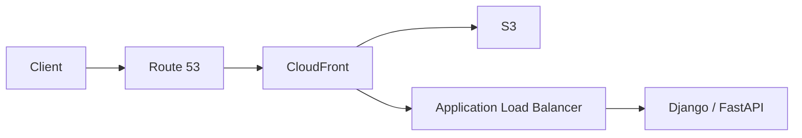
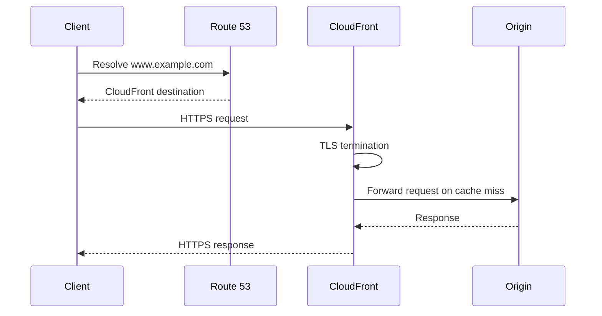

# 17- Route 53 with CloudFront

## Overview

Amazon Route 53 and Amazon CloudFront are commonly combined to provide production-grade domain routing and global HTTP delivery.

A typical architecture is:

```text
Client
   │
   │ DNS query
   ▼
Route 53
   │
   │ Alias
   ▼
CloudFront
   │
   ├── S3
   ├── ALB
   ├── API Gateway
   └── Other HTTP origins
```

The responsibilities are deliberately separated:

- **Route 53** provides authoritative DNS and traffic routing.
- **CloudFront** provides the public HTTP/HTTPS edge layer.
- **S3, ALB, API Gateway, or another service** acts as the origin.
- **ACM** provides TLS certificates for HTTPS on CloudFront.

For a modern production website, the common pattern is:

```text
example.com
     │
     ▼
Route 53
     │
     ▼
CloudFront
     │
     ├───────────────┐
     ▼               ▼
    S3              ALB
 Static Site      Backend APIs
                     │
                     ▼
              Django / FastAPI
```

This architecture separates DNS, edge delivery, static content, and backend compute.

---

## Why Route 53 and CloudFront Are Used Together

DNS and CDN functionality solve different problems.

Route 53 answers:

> Which service should the client connect to for this hostname?

CloudFront answers:

> How should the HTTP request be delivered, cached, secured, and routed to the origin?

For example:

```text
www.example.com
      │
      │ DNS
      ▼
CloudFront distribution
      │
      │ HTTPS
      ▼
Edge Location
      │
      ├── Cache HIT → response
      │
      └── Cache MISS
             │
             ▼
           Origin
```

This provides a clean separation of responsibilities.

| Service | Primary responsibility |
|---|---|
| Route 53 | DNS resolution |
| CloudFront | Global HTTP/HTTPS delivery |
| S3 | Static object storage |
| ALB | Load balancing for backend services |
| API Gateway | Managed API entry point |
| ACM | TLS certificates |
| WAF | Web application filtering |
| Origin application | Business logic |

---

## Core Architecture

A standard production architecture looks like:



The exact origin configuration depends on the workload.

For a static frontend:

```text
Route 53
   │
   ▼
CloudFront
   │
   ▼
S3
```

For a backend API:

```text
Route 53
   │
   ▼
CloudFront
   │
   ▼
ALB
   │
   ▼
Django / FastAPI
```

For a combined application:

```text
www.example.com
        │
        ▼
    CloudFront
        │
        ├── /assets/* → S3
        │
        └── /api/*    → ALB
                         │
                         ▼
                    Backend Services
```

---

## Request Lifecycle

A request to:

```text
https://www.example.com
```

typically follows this sequence:

```text
1. Client resolves www.example.com.
2. DNS resolver queries Route 53.
3. Route 53 returns the CloudFront destination.
4. Client connects to a CloudFront edge location.
5. TLS is negotiated at CloudFront.
6. CloudFront checks its cache.
7. Cache HIT → CloudFront returns the cached response.
8. Cache MISS → CloudFront forwards the request to the origin.
9. Origin returns the response.
10. CloudFront applies caching and response policies.
11. CloudFront returns the response to the client.
```

The important architectural distinction is:

```text
Route 53
    │
    │ DNS
    ▼
CloudFront
    │
    │ HTTP/HTTPS
    ▼
Origin
```

Route 53 is not in the HTTP request path after DNS resolution.

---

## Route 53 Alias to CloudFront

The standard Route 53 integration uses an **Alias A or AAAA record**.

For example:

```text
www.example.com
       │
       │ A Alias
       ▼
CloudFront Distribution
```

The Alias record points to the CloudFront distribution rather than a fixed IP address.

This is preferable to manually maintaining CloudFront IP addresses because CloudFront is an AWS-managed global service.

---

## Why Use Alias Instead of an IP Address

CloudFront does not provide a single static application IP that should be hard-coded into DNS.

This is incorrect:

```text
www.example.com
       │
       ▼
A = hard-coded IP
```

The correct model is:

```text
www.example.com
       │
       ▼
Route 53 Alias
       │
       ▼
CloudFront
```

The Alias relationship remains associated with the AWS resource even though the underlying edge infrastructure is managed by AWS.

---

## Alias vs CNAME

For:

```text
www.example.com
```

a CNAME could technically point to a CloudFront hostname.

However, Route 53 Alias records are generally preferred for supported AWS resources because they integrate directly with AWS resource targets.

The difference becomes particularly important for the zone apex:

```text
example.com
```

A traditional CNAME cannot be placed at the zone apex.

A Route 53 Alias record can point the apex to a supported CloudFront distribution.

Therefore:

```text
example.com
    │
    ▼
A Alias
    │
    ▼
CloudFront
```

is a common production configuration.

---

## CloudFront Alternate Domain Names

CloudFront must know which custom hostnames it is responsible for.

For example:

```text
www.example.com
api.example.com
example.com
```

can be configured as CloudFront alternate domain names when the distribution architecture requires them.

The DNS record and CloudFront configuration must agree.

A common failure is:

```text
Route 53
www.example.com → CloudFront
```

while CloudFront does not have:

```text
www.example.com
```

configured as an alternate domain name.

DNS may resolve correctly while CloudFront rejects the HTTP request.

---

## HTTPS and ACM

CloudFront can terminate TLS for custom domains.

The architecture becomes:

```text
Client
   │
   │ HTTPS
   ▼
CloudFront
   │
   │ Origin connection
   ▼
Origin
```

A certificate from AWS Certificate Manager is associated with the CloudFront distribution.

An important AWS-specific detail is that the ACM certificate used by CloudFront must be in the **US East (N. Virginia) Region (`us-east-1`)**.

This is a common interview and production configuration trap.

---

## TLS Request Flow



TLS is terminated at CloudFront from the client's perspective.

The CloudFront-to-origin connection is a separate connection and should also use HTTPS where appropriate.

---

## CloudFront Origin Types

CloudFront can use different origins depending on the architecture.

| Origin | Typical use |
|---|---|
| S3 | Static files and frontend assets |
| ALB | Containerized/backend applications |
| API Gateway | Managed APIs |
| EC2/custom origin | Legacy or custom workloads |
| External HTTP server | Non-AWS origin |

Examples:

```text
CloudFront → S3
```

for static assets.

```text
CloudFront → ALB → ECS
```

for containerized applications.

```text
CloudFront → API Gateway → Lambda
```

for serverless APIs.

---

## Route 53 + CloudFront + S3

A common static website architecture is:

```text
                    Internet
                       │
                       ▼
                  Route 53
                       │
                       ▼
                  CloudFront
                       │
                       ▼
                 Private S3
                       │
                       ▼
                Static Assets
```

This is generally preferable to exposing an S3 bucket directly.

CloudFront becomes the public delivery layer while S3 remains an origin.

---

## Private S3 Origin

For a production static website, keep the S3 bucket private when possible.

The preferred model is:

```text
Internet
   │
   ▼
CloudFront
   │
   │ Origin access
   ▼
Private S3
```

CloudFront is authorized to retrieve objects from S3.

This provides a stronger security boundary than:

```text
Internet
   │
   ▼
Public S3 Bucket
```

The exact origin access configuration should use the modern CloudFront/S3 origin access mechanism supported by AWS rather than relying on broad public bucket access.

---

## CloudFront + ALB

CloudFront can also sit in front of a backend service.

Example:

```text
Client
  │
  ▼
Route 53
  │
  ▼
CloudFront
  │
  ▼
ALB
  │
  ├── ECS Service
  ├── ECS Service
  └── ECS Service
```

This can provide:

- TLS termination
- Edge caching where appropriate
- AWS WAF integration
- Global edge connectivity
- Request filtering
- Compression
- Centralized HTTP policies

However, not every API should be aggressively cached.

Dynamic API responses may require:

```text
Cache-Control: no-store
```

or carefully designed cache policies.

---

## CloudFront with Django or FastAPI

A typical backend architecture is:

```text
Route 53
    │
    ▼
CloudFront
    │
    ▼
ALB
    │
    ▼
ECS / EC2 / Kubernetes
    │
    ├── Django
    └── FastAPI
```

The application remains responsible for:

- Authentication
- Authorization
- Business logic
- Database operations
- Transactions
- Background jobs
- API responses

CloudFront is responsible for edge delivery and policies.

Do not move application-level authorization into DNS or assume CloudFront replaces the application security model.

---

## Static and Dynamic Traffic

A sophisticated architecture can route different traffic classes through the same CloudFront distribution.

For example:

```text
www.example.com
        │
        ▼
    CloudFront
        │
        ├── /assets/* ───────→ S3
        │
        ├── /static/* ───────→ S3
        │
        └── /api/* ──────────→ ALB
                                  │
                                  ▼
                              FastAPI
```

CloudFront behaviors determine which origin receives a request.

This reduces the need for separate public entry points when a unified hostname is desirable.

---

## CloudFront Behaviors

CloudFront behaviors can define different policies for different URL paths.

Example:

| Path pattern | Origin | Caching |
|---|---|---|
| `/assets/*` | S3 | Aggressive |
| `/static/*` | S3 | Aggressive |
| `/api/*` | ALB | Usually limited |
| Default | S3 | Application-dependent |

For example:

```text
/assets/app.a83d.js
       │
       ▼
S3

/api/users
       │
       ▼
ALB
       │
       ▼
FastAPI
```

This is useful when static and dynamic workloads have fundamentally different caching requirements.

---

## DNS Routing vs CloudFront Routing

These are separate layers.

### Route 53

Route 53 decides:

```text
Which AWS resource should receive traffic for this hostname?
```

### CloudFront

CloudFront decides:

```text
Which edge behavior and origin should handle this HTTP request?
```

For example:

```text
api.example.com
       │
       ▼
Route 53
       │
       ▼
CloudFront
       │
       ▼
/api/*
       │
       ▼
ALB
```

Route 53 does not inspect:

```text
/api/users
```

CloudFront does.

---

## DNS TTL vs CloudFront Cache TTL

These are separate caching mechanisms.

```text
Route 53 TTL
     │
     ▼
DNS answer caching

CloudFront TTL
     │
     ▼
HTTP object caching
```

Changing Route 53 TTL does not invalidate CloudFront objects.

Likewise, invalidating CloudFront does not force DNS resolvers to refresh their cached DNS answers.

This distinction is critical during deployments and incident response.

---

## CloudFront Cache Behavior

CloudFront caching should be designed based on application semantics.

For static assets:

```text
app.83f12.js
style.92ac1.css
```

long cache lifetimes are usually safe when filenames are content-hashed.

For HTML:

```text
index.html
```

shorter caching or controlled invalidation may be appropriate.

For authenticated APIs:

```text
/api/me
/api/orders
```

blind caching can be dangerous.

Potential consequences include:

- Serving stale data
- Serving one user's response to another user
- Authentication leakage
- Incorrect authorization behavior

Never enable caching for authenticated APIs without explicitly understanding cache keys, headers, cookies, query strings, and authorization semantics.

---

## Cache Key Design

A senior engineer should understand that CloudFront caching is not simply:

```text
URL → cache
```

The effective cache key can depend on configured request characteristics.

Potential dimensions include:

- Path
- Query strings
- Headers
- Cookies

For example:

```text
/api/products?category=books
```

may need different caching from:

```text
/api/products?category=games
```

Similarly, a response that depends on:

```text
Authorization
```

should not accidentally be cached as though it were public.

Cache policy design must therefore match application semantics.

---

## Origin Request Policies

CloudFront can distinguish between:

```text
What belongs in the cache key?
```

and:

```text
What should be forwarded to the origin?
```

These are not necessarily the same.

For example, an origin may require a header for backend processing without that header being appropriate as a cache-key dimension.

A good design minimizes unnecessary cache-key variation while forwarding the information required by the origin.

---

## CloudFront and Authentication

CloudFront does not replace backend authentication.

A request can follow:

```text
Client
   │
   ▼
CloudFront
   │
   ▼
ALB
   │
   ▼
FastAPI
   │
   ▼
JWT / Session validation
```

CloudFront may inspect or forward relevant request information, but the application remains responsible for enforcing business authorization unless a deliberate edge-security architecture is implemented.

For example:

```text
Authentication:
Who is this user?

Authorization:
Can this user access this resource?
```

These remain application concerns in most backend systems.

---

## Web Application Firewall

CloudFront can integrate with AWS WAF.

A production request path can therefore become:

```text
Client
   │
   ▼
Route 53
   │
   ▼
CloudFront
   │
   ▼
AWS WAF
   │
   ▼
ALB
   │
   ▼
Backend
```

WAF can help filter traffic based on rules such as:

- IP reputation
- Rate limits
- Common attack patterns
- SQL injection patterns
- Cross-site scripting patterns
- Geographic restrictions

WAF should complement application security rather than replace secure application code.

---

## Security Architecture

A strong production architecture might be:

```text
                         Internet
                            │
                            ▼
                       Route 53
                            │
                            ▼
                       CloudFront
                            │
                            ▼
                           WAF
                            │
                 ┌──────────┴──────────┐
                 │                     │
                 ▼                     ▼
             Private S3              ALB
                                       │
                                       ▼
                                  Backend Services
```

Security boundaries include:

- Route 53 DNS configuration
- TLS at CloudFront
- WAF
- CloudFront origin access
- Private S3
- ALB security groups
- IAM
- Application authentication
- Application authorization
- Logging and auditing

---

## Origin Protection

If CloudFront is the public entry point, the origin should ideally not remain equally exposed.

For an ALB architecture:

```text
Internet
   │
   ▼
CloudFront
   │
   ▼
ALB
```

the engineering team should consider how to prevent bypassing CloudFront where the architecture requires it.

Otherwise an attacker may discover:

```text
ALB public DNS name
```

and send traffic directly to the origin, bypassing:

- CloudFront caching
- WAF rules attached to CloudFront
- Edge controls
- Some request policies

Origin protection must therefore be considered separately from CloudFront configuration.

---

## High Availability

CloudFront is globally distributed, but origin availability still matters.

For example:

```text
CloudFront
    │
    ▼
ALB
    │
    ├── AZ-A
    │    └── Backend
    │
    ├── AZ-B
    │    └── Backend
    │
    └── AZ-C
         └── Backend
```

CloudFront cannot make an unhealthy backend application inherently highly available.

The complete architecture must consider:

- Multi-AZ compute
- Load balancer health checks
- Auto Scaling
- Database availability
- Redis availability
- Message broker availability
- Deployment strategy
- Origin failover where appropriate

---

## Origin Failover

CloudFront supports origin failover architectures for supported configurations.

Conceptually:

```text
CloudFront
    │
    ├── Primary Origin
    │       │
    │       └── Healthy
    │
    └── Secondary Origin
            │
            └── Failover
```

This can be useful for disaster recovery or origin redundancy.

However, failover should not be enabled merely because it exists.

You need to define:

- What constitutes failure?
- Which HTTP status codes trigger failover?
- Is the secondary origin current?
- Is it capacity-tested?
- Is its data consistent?
- How is recovery performed?

Failover is useful only when the fallback path is operationally real.

---

## Route 53 Health Checks vs CloudFront

Route 53 health checks and CloudFront origin health mechanisms solve different problems.

Route 53 can make DNS routing decisions based on health-check state for supported routing configurations.

CloudFront operates at the HTTP delivery and origin layer.

A senior engineer should avoid treating them as interchangeable.

```text
Route 53
    │
    │ DNS-level routing decision
    ▼
CloudFront
    │
    │ HTTP delivery
    ▼
Origin
```

Use the mechanism at the layer where the failure needs to be handled.

---

## Deployment Architecture

A common deployment flow is:

```text
Developer
   │
   ▼
Git
   │
   ▼
CI/CD
   │
   ├── Build
   ├── Test
   ├── Upload static assets to S3
   ├── Deploy backend
   └── Update CloudFront if required
          │
          ▼
       Production
```

For a frontend deployment:

```text
Source
  │
  ▼
Build
  │
  ▼
S3
  │
  ▼
CloudFront cache
```

If content is not versioned through immutable filenames, deployment may require a CloudFront invalidation.

---

## Cache Invalidation

CloudFront caches objects at edge locations.

After deployment, an updated origin object does not necessarily mean every edge immediately serves the new content.

For example:

```text
S3:
app.js = version 2

CloudFront:
app.js = version 1
```

A deployment can use an invalidation when required:

```bash
aws cloudfront create-invalidation \
  --distribution-id E123456789 \
  --paths "/index.html"
```

Avoid using:

```text
/*
```

for every deployment unless there is a specific reason.

A better strategy is usually to combine:

- Immutable asset filenames
- Long cache TTLs for versioned assets
- Shorter caching for HTML
- Targeted invalidation when necessary

---

## CI/CD with Immutable Assets

A strong frontend deployment model is:

```text
Build
 │
 ├── app.a83f1.js
 ├── styles.912cd.css
 └── index.html
 │
 ▼
S3
 │
 ▼
CloudFront
```

The hashed assets can have long cache lifetimes:

```text
Cache-Control: public, max-age=31536000, immutable
```

because a new application version creates a new filename.

This reduces the need for broad invalidations.

---

## Backend Deployment Considerations

For a Django or FastAPI backend:

```text
CloudFront
    │
    ▼
ALB
    │
    ▼
ECS / Kubernetes
```

deployments should consider:

- Connection draining
- Health checks
- Rolling deployments
- Backward-compatible APIs
- Database migrations
- Cache compatibility
- Session handling
- Authentication state

CloudFront does not solve backend deployment consistency.

---

## Logging and Monitoring

A production architecture should monitor every important layer.

| Layer | Useful signals |
|---|---|
| Route 53 | DNS resolution, health checks |
| CloudFront | Requests, 4xx, 5xx, latency, cache hit ratio |
| WAF | Blocked requests, rule matches |
| ALB | Target health, 4xx, 5xx, latency |
| S3 | Access errors, request metrics |
| Application | Errors, latency, saturation |
| CI/CD | Deployment failures |
| Security | IAM and configuration changes |

A useful mental model is:

```text
DNS
 │
 ▼
Edge
 │
 ▼
Security
 │
 ▼
Load Balancer
 │
 ▼
Application
 │
 ▼
Dependencies
```

Monitoring should follow the same dependency chain.

---

## Troubleshooting Flow

When:

```text
https://www.example.com
```

does not work, debug from the outside inward.

### DNS

```bash
dig www.example.com
```

Verify:

- Correct hosted zone
- Correct record
- Correct CloudFront target
- Expected DNS response

### CloudFront

Check:

- Distribution deployed
- Alternate domain name
- ACM certificate
- Viewer protocol policy
- Cache behavior
- Origin configuration

### TLS

Check:

- Certificate covers hostname
- Certificate is valid
- Certificate is in `us-east-1` for CloudFront
- HTTPS policy is compatible

### WAF

Check:

- Requests blocked
- Rate-based rules
- Managed rule groups
- IP restrictions

### Origin

For ALB:

```text
CloudFront
   │
   ▼
ALB
   │
   ▼
Target Group
```

Check:

- Target health
- Security groups
- Listener
- Port
- Application response

For S3:

Check:

- Bucket exists
- Object exists
- CloudFront origin access
- Bucket policy
- Object ownership

---

## Common Error Patterns

| Symptom | Likely area |
|---|---|
| DNS does not resolve | Route 53 |
| DNS resolves but TLS fails | CloudFront / ACM |
| CloudFront returns 403 | CloudFront / WAF / origin access |
| CloudFront returns 502/503 | Origin connectivity |
| Old frontend still appears | CloudFront cache |
| API returns wrong cached data | Cache policy |
| Direct ALB access works but CloudFront fails | CloudFront/origin configuration |
| CloudFront works but direct origin bypasses security | Origin exposure |
| Root domain works but `www` fails | DNS/alternate domain configuration |

---

## Common Mistakes

### Treating Route 53 as a CDN

Route 53 is DNS.

CloudFront provides CDN functionality.

```text
Route 53 → DNS
CloudFront → Edge delivery
```

---

### Using the Wrong ACM Region

CloudFront certificates must be provisioned in:

```text
us-east-1
```

This is one of the most common AWS interview and deployment traps.

---

### Forgetting CloudFront Alternate Domain Names

DNS can point:

```text
www.example.com
```

to CloudFront while CloudFront is not configured to accept that hostname.

Both layers must agree.

---

### Assuming DNS Changes Invalidate CloudFront

They do not.

```text
Route 53 TTL
```

and:

```text
CloudFront cache TTL
```

are independent.

---

### Caching Authenticated API Responses

This can create serious security problems.

For example:

```text
GET /api/profile
Authorization: Bearer user-A-token
```

must not result in a cached response being served to user B.

Cache policy must account for authentication and request identity.

---

### Exposing the Origin Unnecessarily

If CloudFront is supposed to be the public entry point, directly exposing the origin can allow traffic to bypass edge security controls.

Protect the origin appropriately.

---

### Using `/*` Invalidation for Every Deployment

Broad invalidations increase operational cost and are often unnecessary.

Use immutable asset names and targeted invalidation where possible.

---

### Assuming CloudFront Makes the Backend Highly Available

CloudFront improves edge delivery but does not replace:

- Multi-AZ compute
- Database HA
- Load balancing
- Application health checks
- Disaster recovery

The origin still needs a reliable architecture.

---

### Ignoring HTTP Semantics

CloudFront is an HTTP-aware layer.

Incorrectly configuring:

- Methods
- Headers
- Cookies
- Query strings
- Redirects
- Cache policies

can change application behavior.

---

## Production Best Practices

### DNS

- Use Route 53 Alias records for supported AWS targets.
- Keep DNS records managed through infrastructure as code.
- Use appropriate TTLs.
- Avoid unnecessary DNS changes during incidents.
- Document canonical hostnames.

### CloudFront

- Use HTTPS.
- Configure custom domains explicitly.
- Use appropriate cache policies.
- Minimize unnecessary cache-key dimensions.
- Use compression where appropriate.
- Use CloudFront security controls deliberately.

### S3

- Prefer private buckets behind CloudFront.
- Use origin access controls.
- Enable versioning where useful.
- Avoid broad public bucket policies.

### APIs

- Do not blindly cache authenticated responses.
- Forward only required headers, cookies, and query strings.
- Validate cache semantics with real authentication scenarios.
- Keep backend authorization in the application.

### CI/CD

- Prefer immutable static asset names.
- Use short-lived AWS credentials.
- Use least-privilege IAM.
- Automate CloudFront invalidation only when needed.
- Validate DNS, TLS, and origin health after deployment.

---

## Infrastructure as Code

A production Route 53 + CloudFront setup should generally be managed using infrastructure as code.

Typical resources include:

```text
Route 53 Hosted Zone
Route 53 Records
CloudFront Distribution
ACM Certificate
S3 Bucket
S3 Bucket Policy
CloudFront Origin Access Control
WAF Web ACL
ALB
```

Terraform provides an explicit representation of these relationships.

For example:

```hcl
resource "aws_route53_record" "www" {
  zone_id = aws_route53_zone.primary.zone_id
  name    = "www.example.com"
  type    = "A"

  alias {
    name                   = aws_cloudfront_distribution.website.domain_name
    zone_id                = aws_cloudfront_distribution.website.hosted_zone_id
    evaluate_target_health = false
  }
}
```

The important engineering principle is not the specific Terraform syntax but the ownership model:

```text
Git
 │
 ▼
Terraform
 │
 ├── Route 53
 ├── CloudFront
 ├── ACM
 ├── S3
 └── WAF
```

Infrastructure changes should be reviewed and deployed through controlled CI/CD pipelines.

---

## Cost Considerations

The architecture introduces several billing dimensions:

```text
Route 53
+
CloudFront
+
Origin requests
+
Data transfer
+
S3
+
WAF
```

The cost-benefit calculation depends on:

- Traffic volume
- Geographic distribution
- Cache hit ratio
- Object size
- Origin request rate
- WAF usage
- Data transfer
- Number of DNS queries

CloudFront can reduce origin traffic significantly when cacheable content has a high cache hit ratio.

Do not optimize cost by removing CloudFront when the application requires:

- HTTPS
- Global delivery
- Edge caching
- WAF
- Private S3 origin
- Edge-level request controls

---

## Disaster Recovery

Route 53 and CloudFront should be treated as part of the deployment and disaster-recovery architecture.

For static content:

```text
Source Repository
       │
       ▼
Build Artifact
       │
       ▼
S3
       │
       ▼
CloudFront
```

For backend systems:

```text
CloudFront
    │
    ▼
Primary Origin
    │
    ▼
Backend
```

A mature DR design considers:

- Secondary origin
- DNS failover
- Multi-region architecture
- Database replication
- Static asset replication
- Infrastructure-as-code recovery
- Certificate management
- Runbooks
- Recovery time objective
- Recovery point objective

Do not claim that CloudFront alone provides disaster recovery.

---

## Multi-Region Architecture

For highly available systems, Route 53 can become the higher-level traffic-routing layer.

Conceptually:

```text
                         Route 53
                            │
                 ┌──────────┴──────────┐
                 │                     │
                 ▼                     ▼
            Region A               Region B
                 │                     │
            CloudFront               CloudFront
                 │                     │
                 ▼                     ▼
              Origin A              Origin B
```

The exact design depends on whether CloudFront or Route 53 should own the primary traffic decision.

Avoid adding multi-region complexity unless the business availability requirements justify it.

Multi-region systems introduce additional concerns:

- Data consistency
- Deployment synchronization
- DNS propagation
- Failover testing
- Database replication
- Operational complexity
- Cost

---

## Interview Traps

### What Does Route 53 Do in a Route 53 + CloudFront Architecture?

Route 53 performs DNS resolution and returns the CloudFront destination.

CloudFront handles the subsequent HTTP/HTTPS request.

---

### Why Use an Alias Record?

Because Route 53 can directly target supported AWS resources such as CloudFront without requiring a hard-coded IP address.

---

### Can You Use a CNAME at the Root Domain?

No.

A traditional CNAME cannot be used at the zone apex.

Use a Route 53 Alias record for supported targets such as CloudFront.

---

### Where Must the CloudFront ACM Certificate Be Created?

For CloudFront, the ACM certificate must be in:

```text
us-east-1
```

---

### Does CloudFront Replace Route 53?

No.

They operate at different layers:

```text
Route 53
    ↓
DNS

CloudFront
    ↓
HTTP/HTTPS edge delivery
```

---

### Does CloudFront Automatically Cache Every API Response?

No.

Caching depends on CloudFront behavior and cache policy.

API caching should be deliberately designed.

---

### Does CloudFront Replace an ALB?

Not necessarily.

A common architecture is:

```text
Route 53
    ↓
CloudFront
    ↓
ALB
    ↓
ECS / EC2 / Kubernetes
```

CloudFront and ALB solve different problems.

---

### Does CloudFront Make an Origin Private Automatically?

No.

The origin must be configured and protected appropriately.

For S3, use the appropriate origin access configuration.

For ALB-based systems, consider how origin access should be restricted when CloudFront is intended to be the public entry point.

---

### Does CloudFront Eliminate DNS TTL?

No.

DNS caching still occurs independently of CloudFront caching.

---

### Why Put CloudFront in Front of an API?

Potential reasons include:

- Global edge connectivity
- TLS termination
- WAF integration
- Request filtering
- Controlled caching
- Compression
- Centralized edge policies

But API caching must be designed carefully, particularly for authenticated or user-specific responses.

---

## Senior-Level Design Checklist

Before deploying Route 53 + CloudFront, verify:

### DNS

- [ ] Hosted zone is authoritative for the domain.
- [ ] Alias records point to the intended CloudFront distribution.
- [ ] Root and subdomain behavior is intentional.
- [ ] TTLs are appropriate.

### CloudFront

- [ ] Alternate domain names are configured.
- [ ] ACM certificate covers all required hostnames.
- [ ] Certificate is in `us-east-1`.
- [ ] Viewer protocol policy is intentional.
- [ ] Cache policies match application semantics.
- [ ] Origin request policies forward required data.
- [ ] Error handling is configured.
- [ ] Compression is enabled where appropriate.

### Origin

- [ ] S3 bucket is private when appropriate.
- [ ] Origin access is correctly configured.
- [ ] ALB target health is monitored.
- [ ] Origin cannot unnecessarily bypass security controls.
- [ ] Backend is independently highly available.

### Security

- [ ] HTTPS is enforced.
- [ ] WAF rules are appropriate.
- [ ] IAM permissions follow least privilege.
- [ ] CI/CD uses short-lived credentials.
- [ ] Origin access is restricted.
- [ ] Logs are retained appropriately.

### Operations

- [ ] CloudFront metrics are monitored.
- [ ] Origin errors are monitored.
- [ ] DNS changes are version-controlled.
- [ ] Cache invalidation strategy is defined.
- [ ] Rollback strategy exists.
- [ ] Disaster recovery is tested.

---

## Key Takeaways

- **Route 53 and CloudFront operate at different layers.** Route 53 handles DNS; CloudFront handles HTTP/HTTPS edge delivery.
- A common production architecture is `Route 53 → CloudFront → S3`.
- A backend architecture can use `Route 53 → CloudFront → ALB → Django/FastAPI`.
- Route 53 Alias records are the normal AWS-native way to point a hostname to a CloudFront distribution.
- A traditional CNAME cannot be used at the DNS zone apex, while Route 53 Alias records can target supported AWS resources.
- CloudFront custom domains require an ACM certificate, and the certificate used by CloudFront must be in `us-east-1`.
- DNS resolution must succeed before the client can reach CloudFront, but Route 53 is not part of the subsequent HTTP request path.
- CloudFront can serve multiple origins and route requests using path-based behaviors.
- Static assets can be served from S3 while dynamic API traffic is sent to an ALB.
- CloudFront caching and Route 53 DNS caching are independent mechanisms.
- Cache-key design is a senior-level concern because incorrect handling of headers, cookies, query strings, or authorization can create correctness and security problems.
- Authenticated API responses should not be cached casually.
- CloudFront does not replace application authentication or authorization.
- CloudFront does not automatically make an origin private or highly available.
- A private S3 bucket behind CloudFront is generally preferable to exposing the bucket publicly for production static websites.
- CloudFront can integrate with AWS WAF to provide edge-level request filtering and protection.
- The origin should be protected appropriately when CloudFront is intended to be the public entry point.
- Immutable frontend asset names significantly reduce the need for broad CloudFront invalidations.
- CloudFront improves edge delivery but does not replace backend HA, database HA, or disaster-recovery architecture.
- Multi-region Route 53 and CloudFront architectures can improve resilience but introduce significant data, deployment, and operational complexity.
- The senior-level mental model is:

```text
Route 53
   ↓
DNS routing

CloudFront
   ↓
Global HTTP/HTTPS delivery

WAF
   ↓
Edge security

S3 / ALB / API Gateway
   ↓
Origin

Django / FastAPI / Application
   ↓
Business logic
```

- Design each layer independently, then validate the complete request path from **DNS → TLS → CloudFront → security controls → origin → application**.