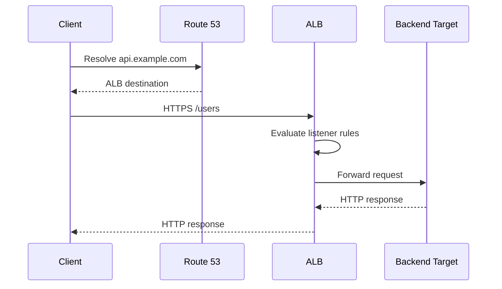
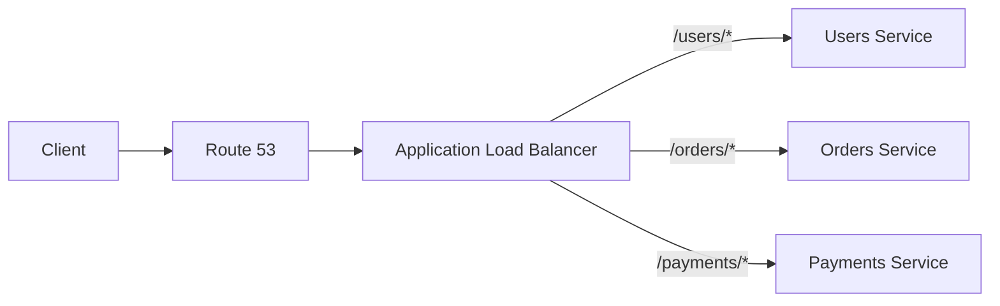
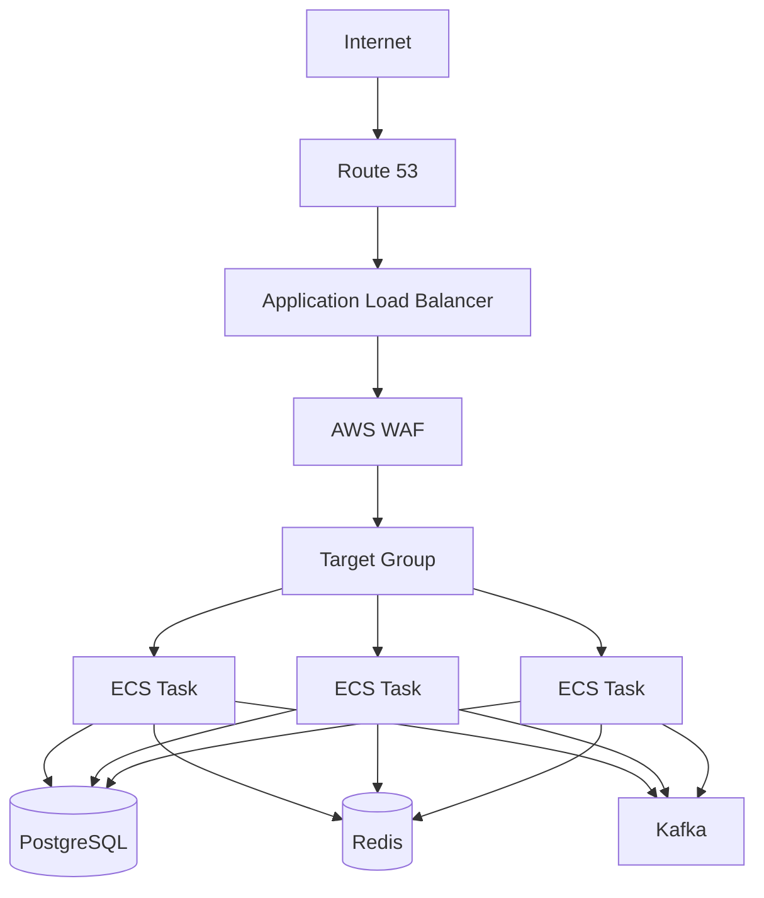

# 18- Route 53 with ELB and ALB

## Overview

Amazon Route 53 is commonly used as the DNS layer in front of AWS load balancers. The most common production pattern for HTTP applications is:

```text
Client
   │
   │ DNS query
   ▼
Route 53
   │
   │ Alias
   ▼
Application Load Balancer
   │
   ├── Target A
   ├── Target B
   └── Target C
```

For more advanced architectures, CloudFront can sit between Route 53 and the ALB:

```text
Client
   │
   ▼
Route 53
   │
   ▼
CloudFront
   │
   ▼
ALB
   │
   ▼
Application
```

The important architectural distinction is:

- **Route 53** resolves hostnames and can make DNS-level routing decisions.
- **ELB** distributes traffic across backend targets.
- **ALB** is the HTTP/HTTPS-aware load balancer used for application-layer routing.
- **CloudFront**, when present, provides edge delivery and caching before traffic reaches the ALB.
- **The application** remains responsible for business logic, authentication, authorization, and application-level reliability.

For a senior backend engineer, the key is understanding where each decision happens:

```text
DNS decision
    ↓
Route 53

Load-balancing decision
    ↓
ALB

Application decision
    ↓
Django / FastAPI / backend service
```

---

## Route 53 and ELB Relationship

Route 53 does not normally point clients directly to individual EC2 instances when an AWS load balancer is being used.

Instead:

```text
example.com
     │
     ▼
Route 53
     │
     ▼
ALB
     │
     ├── EC2
     ├── EC2
     └── EC2
```

The load balancer owns the responsibility of selecting a healthy target.

Route 53 only needs to direct the hostname toward the load balancer.

This creates an important separation:

| Layer | Responsibility |
|---|---|
| Route 53 | DNS resolution |
| ALB | HTTP/HTTPS traffic distribution |
| Target group | Target registration and health |
| EC2/ECS/Kubernetes | Application execution |
| Application | Business logic |

---

## Why Use Route 53 Instead of an Instance IP

An EC2 instance is not a stable application endpoint in a scalable architecture.

Instances can:

- Be replaced
- Scale in or out
- Fail
- Move between deployments
- Receive different private IP addresses
- Be terminated automatically

This architecture is fragile:

```text
Route 53
   │
   ▼
EC2 Public IP
```

A better architecture is:

```text
Route 53
   │
   ▼
ALB
   │
   ├── Instance A
   ├── Instance B
   └── Instance C
```

The ALB provides a stable service endpoint while the underlying target fleet changes independently.

---

## Route 53 Alias to ALB

For an AWS-hosted application, Route 53 Alias records are the normal AWS-native mechanism for pointing a hostname to an Application Load Balancer.

Example:

```text
api.example.com
       │
       │ A Alias
       ▼
Application Load Balancer
```

For IPv6 clients, an AAAA Alias record can also be used.

A major advantage is that the DNS record targets the AWS load balancer rather than requiring a manually maintained IP address.

---

## Alias Records vs CNAME

A CNAME can point a hostname to another hostname, but it has an important restriction: a traditional CNAME cannot be used at the DNS zone apex.

For example:

```text
api.example.com
```

can use a CNAME.

But:

```text
example.com
```

cannot use a traditional CNAME.

Route 53 Alias records can point the zone apex to supported AWS resources such as an ALB.

Therefore:

```text
example.com
    │
    ▼
A Alias
    │
    ▼
ALB
```

is a common production configuration.

---

## Request Lifecycle

Consider:

```text
https://api.example.com/users
```

The request path is approximately:

```text
1. Client asks its DNS resolver to resolve api.example.com.
2. DNS resolution eventually reaches the Route 53 hosted zone.
3. Route 53 returns the ALB destination.
4. Client connects to the ALB.
5. ALB receives the HTTP/HTTPS request.
6. ALB evaluates listeners and listener rules.
7. ALB selects an appropriate target group.
8. ALB selects a healthy target.
9. Request is forwarded to the target.
10. Application processes the request.
11. Response travels back through the ALB.
12. ALB returns the response to the client.
```

The architecture is therefore:



Route 53 is not involved in every HTTP request.

Once the client has resolved the hostname, subsequent traffic is sent to the load balancer according to the resolved DNS information until DNS resolution needs to be refreshed.

---

## ALB vs Generic ELB Terminology

Elastic Load Balancing is the AWS service family.

The relevant load balancer types include:

- Application Load Balancer
- Network Load Balancer
- Gateway Load Balancer
- Classic Load Balancer, which is a legacy option

For modern HTTP/HTTPS backend systems, ALB is frequently the appropriate choice.

The relationship is:

```text
Elastic Load Balancing
        │
        ├── ALB
        ├── NLB
        └── GWLB
```

Route 53 can integrate with supported load balancer types through Alias records.

---

## Why ALB Is Common for Backend APIs

ALB operates at Layer 7 and understands HTTP/HTTPS.

This allows it to make routing decisions based on application-level request properties.

For example:

```text
api.example.com/users
        │
        ▼
       ALB
        │
        ├── /users/* → Users Service
        ├── /orders/* → Orders Service
        └── /admin/* → Admin Service
```

This is fundamentally different from DNS routing.

Route 53 sees:

```text
api.example.com
```

ALB can see:

```text
GET /orders/123
```

That distinction is critical.

---

## ALB Listener

An ALB listener accepts incoming traffic on a protocol and port.

Common configuration:

```text
HTTPS : 443
     │
     ▼
ALB Listener
     │
     ▼
Listener Rules
```

For example:

```text
HTTPS : 443
       │
       ├── Host: api.example.com
       │       └── Target Group: API
       │
       ├── Host: admin.example.com
       │       └── Target Group: Admin
       │
       └── Default
               └── Target Group: Default
```

The listener can terminate TLS and forward traffic to backend targets.

---

## Host-Based Routing

Route 53 can direct different hostnames toward an ALB:

```text
api.example.com
      │
      ▼
     ALB
```

and:

```text
admin.example.com
      │
      ▼
     ALB
```

The same ALB can then use host-based listener rules:

```text
                 ALB
                  │
        ┌─────────┴─────────┐
        │                   │
api.example.com       admin.example.com
        │                   │
        ▼                   ▼
    API Target          Admin Target
```

This is useful for consolidating infrastructure while keeping applications logically separated.

---

## Path-Based Routing

ALB can also route based on URL paths.

Example:

```text
api.example.com/users
        │
        ▼
       ALB
        │
        ▼
Users Target Group
```

while:

```text
api.example.com/orders
        │
        ▼
       ALB
        │
        ▼
Orders Target Group
```

This is particularly useful for microservice architectures.



---

## Route 53 vs ALB Routing

These mechanisms should not be confused.

| Capability | Route 53 | ALB |
|---|---|---|
| DNS resolution | Yes | No |
| DNS-level routing | Yes | No |
| HTTP routing | No | Yes |
| Path-based routing | No | Yes |
| Host-based HTTP routing | No | Yes |
| Target health checks | DNS health mechanisms | Target health checks |
| TLS termination | No | Yes |
| HTTP headers | No | Yes |
| Cookies | No | Yes |
| Query strings | No | Yes |
| Load balancing across targets | No | Yes |

A useful mental model is:

```text
Route 53:
"Where should this hostname resolve?"

ALB:
"Which backend target should handle this HTTP request?"
```

---

## Route 53 Health Checks and ALB Health Checks

These are different mechanisms.

### ALB Health Checks

ALB health checks determine whether individual targets are healthy.

```text
ALB
 │
 ├── Target A → healthy
 ├── Target B → unhealthy
 └── Target C → healthy
```

The ALB stops sending traffic to unhealthy targets.

### Route 53 Health Checks

Route 53 health checks can be used for DNS-level routing decisions.

For example:

```text
Route 53
    │
    ├── Region A
    │
    └── Region B
```

Route 53 can use health information when supported by the selected routing policy.

The key distinction is:

```text
ALB health check
    ↓
Which backend target should receive traffic?

Route 53 health check
    ↓
Which DNS answer should be returned?
```

---

## High Availability

A production ALB should normally span multiple Availability Zones.

For example:

```text
                    Route 53
                       │
                       ▼
                      ALB
                 ┌─────┴─────┐
                 │           │
               AZ-A         AZ-B
                 │           │
            ┌────┴───┐   ┌───┴────┐
            │        │   │        │
           App      App App      App
```

This protects the service from the failure of a single Availability Zone.

The application targets should also be distributed appropriately across Availability Zones.

---

## Route 53 and Multi-AZ ALB

Route 53 does not need to know the individual Availability Zones behind the ALB.

The architecture is:

```text
Route 53
   │
   ▼
ALB
   │
   ├── AZ-A
   ├── AZ-B
   └── AZ-C
```

The ALB abstracts the target fleet from DNS.

This is one of the major reasons to use a load balancer rather than placing DNS records directly on instances.

---

## Target Groups

ALB routes requests to target groups.

A target group can contain:

- EC2 instances
- IP addresses
- ECS tasks
- Other supported target types

Example:

```text
ALB
 │
 ▼
Target Group: backend-api
 │
 ├── 10.0.1.10:8000
 ├── 10.0.2.15:8000
 └── 10.0.3.21:8000
```

ALB continuously evaluates target health according to the configured health-check settings.

---

## Health Check Design

A backend health endpoint should normally be lightweight.

For a FastAPI application:

```python
from fastapi import FastAPI

app = FastAPI()


@app.get("/health")
async def health() -> dict[str, str]:
    return {"status": "ok"}
```

For an ALB health check, avoid making the endpoint unnecessarily dependent on slow external services.

A health endpoint such as:

```text
GET /health
```

should answer whether the process can serve traffic.

For deeper dependency checks, maintain a separate readiness or dependency-health mechanism rather than making every load balancer health check perform expensive database or downstream checks.

---

## Liveness vs Readiness

In production systems, distinguish between:

```text
Liveness
    ↓
Is the process alive?

Readiness
    ↓
Can this instance safely receive traffic?
```

For containerized applications:

```text
ALB
   │
   ▼
Readiness endpoint
   │
   ├── Ready → receive traffic
   └── Not ready → remove from traffic
```

This becomes particularly important during deployments.

An application may be alive but not ready to serve requests because it is:

- Starting
- Migrating
- Loading required configuration
- Warming critical caches
- Waiting for required initialization

---

## DNS TTL and ALB

Route 53 records have TTL values that influence DNS caching.

For example:

```text
api.example.com
TTL = 60 seconds
```

means recursive DNS resolvers may cache the answer for up to the configured TTL.

However, the ALB itself is not exposed through a fixed application IP that you should manually manage.

The architecture remains:

```text
DNS
 │
 ▼
ALB hostname / Alias target
 │
 ▼
AWS-managed load balancer
```

Avoid thinking of the Alias as simply storing a permanent IP address.

---

## Why Alias Records Are Operationally Important

AWS manages the load balancer infrastructure.

Your application should not need to know:

```text
ALB node IP A
ALB node IP B
ALB node IP C
```

Instead:

```text
Route 53
    │
    ▼
ALB
```

The AWS-managed load balancer infrastructure can change without requiring the application team to manually rewrite DNS to individual load balancer node IPs.

---

## TLS Architecture

A common architecture is:

```text
Client
   │
   │ HTTPS :443
   ▼
Route 53
   │
   │ DNS only
   ▼
ALB
   │
   │ TLS termination
   ▼
Backend
```

Route 53 does not terminate TLS.

The client connects to the IP addresses returned through DNS resolution and establishes TLS with the ALB.

The ALB can use an ACM certificate for the application hostname.

---

## End-to-End HTTPS

For stronger security, HTTPS can also be used between the ALB and backend targets.

```text
Client
   │
   │ HTTPS
   ▼
ALB
   │
   │ HTTPS
   ▼
Backend
```

This provides encryption on both segments.

Whether this is required depends on:

- Network architecture
- Compliance requirements
- Trust boundaries
- Backend network isolation
- Certificate management strategy

Traffic inside a VPC should not automatically be considered safe merely because it is private.

---

## Security Groups

A typical architecture uses security groups to restrict communication.

```text
Internet
   │
   ▼
ALB Security Group
   │
   ▼
Application Security Group
```

The application security group should generally allow inbound traffic from the ALB security group rather than allowing unrestricted internet access.

Conceptually:

```text
ALB SG
  │
  │ TCP 8000
  ▼
Backend SG
```

instead of:

```text
0.0.0.0/0
    │
    ▼
Backend
```

This creates a stronger network boundary.

---

## ALB and Private Backend Targets

A common production pattern is:

```text
Internet
   │
   ▼
Route 53
   │
   ▼
Public ALB
   │
   ▼
Private Subnets
   │
   ├── ECS
   ├── EC2
   └── Kubernetes
```

The application servers do not need public IP addresses.

The ALB becomes the public ingress layer.

This reduces the attack surface and simplifies network policy.

---

## Route 53 + ALB + ECS

For ECS:

```text
Route 53
    │
    ▼
ALB
    │
    ▼
Target Group
    │
    ├── ECS Task
    ├── ECS Task
    └── ECS Task
```

During deployments, ECS can replace tasks while the target group and ALB continue providing the stable service endpoint.

The application DNS name does not change when individual tasks are replaced.

---

## Route 53 + ALB + Kubernetes

For Kubernetes on AWS, an ingress architecture can look like:

```text
Route 53
    │
    ▼
ALB
    │
    ▼
Kubernetes Ingress
    │
    ├── Service A
    ├── Service B
    └── Service C
```

The Kubernetes control plane and AWS load-balancing integration manage the relationship between Kubernetes resources and the ALB.

The key principle remains:

```text
Stable DNS
    ↓
Stable load-balancing endpoint
    ↓
Dynamic backend targets
```

---

## Microservices Architecture

ALB can provide an HTTP entry point for multiple services.

Example:

```text
api.example.com
       │
       ▼
      ALB
       │
       ├── /users/* ──────→ Users Service
       │
       ├── /orders/* ─────→ Orders Service
       │
       ├── /payments/* ───→ Payments Service
       │
       └── /catalog/* ────→ Catalog Service
```

This can be appropriate for externally exposed HTTP APIs.

However, ALB should not automatically become the communication mechanism for every internal service-to-service call.

For internal communication, alternatives such as:

- REST
- gRPC
- Service discovery
- Internal load balancers
- Event-driven messaging

may be more appropriate depending on the architecture.

---

## ALB and gRPC

ALB supports HTTP/2 and gRPC use cases.

A backend architecture can therefore look like:

```text
Client / Service
       │
       ▼
Route 53
       │
       ▼
ALB
       │
       ▼
gRPC Backend
```

However, service-to-service communication should be evaluated based on:

- Latency
- Streaming requirements
- Load-balancing behavior
- Service discovery
- Authentication
- Protocol compatibility

Route 53 remains the DNS layer and does not understand gRPC methods.

---

## Weighted DNS Routing with ALBs

Route 53 can route a hostname to multiple load balancers using DNS routing policies.

For example:

```text
api.example.com
       │
       ▼
    Route 53
       │
       ├── 90% → ALB Region A
       │
       └── 10% → ALB Region B
```

This can be used for:

- Canary deployments
- Regional traffic distribution
- Migration
- Disaster recovery
- Controlled traffic shifting

However, DNS-based traffic shifting has limitations because recursive resolvers and clients cache DNS responses.

It should not be treated as equivalent to per-request load balancing.

---

## Weighted Routing vs ALB Weighting

These operate at different layers.

### Route 53 Weighted Routing

```text
DNS
 │
 ├── ALB A
 └── ALB B
```

The weighting affects DNS answers.

### ALB Target Distribution

```text
ALB
 │
 ├── Target A
 ├── Target B
 └── Target C
```

The ALB distributes actual HTTP requests among healthy targets according to its configured load-balancing behavior.

Therefore:

```text
Route 53 weighting
    ↓
DNS-level traffic distribution

ALB distribution
    ↓
Request-level target distribution
```

---

## Blue-Green Deployment

Route 53 can participate in blue-green architectures.

Example:

```text
                 Route 53
                    │
                    ▼
             api.example.com
                    │
             ┌──────┴──────┐
             │             │
             ▼             ▼
          ALB Blue       ALB Green
             │             │
             ▼             ▼
          Version A      Version B
```

A deployment might initially send all DNS traffic to Blue:

```text
100% → Blue
```

and later move traffic to Green.

However, DNS caching means the transition is not necessarily instantaneous for every client.

For request-level traffic shifting, an ALB-based deployment strategy or another application delivery mechanism may provide finer control.

---

## Failure Handling

Consider:

```text
Route 53
    │
    ▼
ALB
    │
    ├── Target A → unhealthy
    ├── Target B → healthy
    └── Target C → healthy
```

The ALB can stop routing traffic to Target A.

This is fundamentally different from:

```text
Route 53
    │
    ▼
ALB
```

where Route 53 does not inspect the health of individual backend targets behind the ALB.

This layered health model is important:

```text
Route 53
    ↓
DNS endpoint health

ALB
    ↓
Target health

Application
    ↓
Dependency and business health
```

---

## Monitoring

Monitor both DNS and load-balancing layers.

### Route 53

Useful signals include:

- DNS query behavior
- Health-check status
- Record configuration
- Routing-policy behavior

### ALB

Useful signals include:

- Request count
- HTTP 4xx
- HTTP 5xx
- Target response time
- Target health
- Connection counts
- Rejected connections
- Load balancer errors

### Application

Monitor:

- Request latency
- Exception rate
- Database latency
- Redis latency
- Kafka failures
- CPU
- Memory
- Thread/process saturation

A useful production dependency chain is:

```text
DNS
 │
 ▼
ALB
 │
 ▼
Target
 │
 ▼
Application
 │
 ├── PostgreSQL
 ├── Redis
 └── Kafka
```

Observability should follow this dependency chain.

---

## Troubleshooting Workflow

When:

```text
https://api.example.com
```

fails, debug from the outside inward.

### Check DNS

```bash
dig api.example.com
```

Verify:

- Correct hosted zone
- Correct record type
- Correct Alias target
- Expected DNS answer

### Check ALB

Verify:

- Load balancer exists
- Listener exists
- Listener port is correct
- Listener protocol is correct
- Certificate is valid
- Security group allows traffic

### Check Target Group

Verify:

- Targets are registered
- Health checks are passing
- Correct target port
- Correct health-check path
- Target security group allows ALB traffic

### Check Application

Verify:

- Application process is running
- Correct bind address
- Correct listening port
- Database connectivity
- Redis connectivity
- Environment variables
- Application logs

A useful flow is:

```text
DNS
 ↓
ALB Listener
 ↓
Listener Rule
 ↓
Target Group
 ↓
Target Health
 ↓
Application
 ↓
Dependencies
```

---

## Common Failure Scenarios

| Symptom | Likely cause |
|---|---|
| Domain does not resolve | Route 53 record/zone problem |
| DNS works but connection times out | Security group/networking |
| TLS certificate error | ALB certificate/listener configuration |
| ALB returns 503 | No healthy targets |
| ALB returns 502 | Backend connection/application response problem |
| Some requests fail | Unhealthy or misconfigured targets |
| Application works directly but not through ALB | Listener, SG, target port, or health-check configuration |
| DNS change appears delayed | DNS caching/TTL |
| New deployment receives no traffic | Target registration/readiness problem |
| Backend is reachable directly | Origin exposure/security architecture |

---

## 502 vs 503

These errors are important operational signals.

### 503

A 503 from an ALB commonly indicates that there are no healthy targets available for the request.

```text
ALB
 │
 ├── Target A → unhealthy
 ├── Target B → unhealthy
 └── Target C → unhealthy
```

### 502

A 502 can indicate problems communicating with or receiving a valid response from the target.

Possible causes include:

- Application closed the connection
- Incorrect backend protocol
- TLS mismatch
- Invalid backend response
- Connection failure

Always inspect ALB and application logs rather than treating the status code alone as the root cause.

---

## Security Best Practices

### Keep Backend Targets Private

Prefer:

```text
Internet
   │
   ▼
Public ALB
   │
   ▼
Private Backend
```

over:

```text
Internet
   │
   ├── ALB
   │
   └── EC2 directly
```

### Restrict Backend Security Groups

Allow application traffic from the ALB security group rather than the entire internet.

### Use HTTPS

Use TLS for public endpoints and consider TLS between ALB and targets where required.

### Protect DNS

Route 53 configuration should be controlled through:

- IAM
- Least privilege
- Infrastructure as code
- CI/CD approval workflows
- Change auditing

### Protect the Application

ALB is not a substitute for:

- Authentication
- Authorization
- Input validation
- Rate limiting
- Application security

---

## Scalability

Route 53 and ALB contribute to different parts of scalability.

```text
Route 53
    ↓
Stable DNS endpoint

ALB
    ↓
Distribute requests

Auto Scaling
    ↓
Increase/decrease targets

Application
    ↓
Process requests
```

A scalable architecture might be:

```text
                 Route 53
                    │
                    ▼
                   ALB
                    │
        ┌───────────┼───────────┐
        ▼           ▼           ▼
      ECS         ECS         ECS
      Task        Task        Task
        │           │           │
        └───────────┼───────────┘
                    ▼
                PostgreSQL
```

The important property is that the client does not need to know how many backend instances exist.

---

## Performance Considerations

DNS introduces lookup latency, but DNS answers are normally cached.

The larger performance considerations are generally:

- ALB request processing
- Network latency
- TLS negotiation
- Application latency
- Database latency
- Downstream services

A useful request latency model is:

```text
Total latency
    ≈
DNS resolution
+
TCP/TLS setup
+
ALB processing
+
Application processing
+
Database/dependency latency
```

Keep in mind that DNS resolution is often amortized through client and recursive-resolver caching.

Do not optimize DNS TTL blindly without understanding its operational purpose.

---

## Cost Considerations

The architecture can incur costs from:

- Route 53 hosted zones
- Route 53 queries
- ALB hours
- ALB capacity units
- Data transfer
- Compute targets
- NAT gateways for private workloads
- CloudWatch metrics and logs

For production systems, evaluate the complete request path rather than optimizing a single service in isolation.

For example:

```text
Route 53
   ↓
ALB
   ↓
ECS
   ↓
NAT Gateway
   ↓
External dependency
```

NAT and cross-AZ traffic can become meaningful cost contributors depending on architecture and traffic volume.

---

## Infrastructure as Code

Route 53 and ALB configuration should generally be managed through infrastructure as code.

A simplified Terraform example:

```hcl
resource "aws_route53_record" "api" {
  zone_id = aws_route53_zone.primary.zone_id
  name    = "api.example.com"
  type    = "A"

  alias {
    name                   = aws_lb.api.dns_name
    zone_id                = aws_lb.api.zone_id
    evaluate_target_health = true
  }
}
```

The exact `evaluate_target_health` behavior should be selected deliberately based on the routing architecture.

Infrastructure should represent the complete dependency chain:

```text
Route 53
   │
   ▼
ALB
   │
   ▼
Listener
   │
   ▼
Target Group
   │
   ▼
Compute
```

This makes infrastructure changes reviewable and reproducible.

---

## Production Architecture

A typical production backend architecture can look like:



In a real AWS architecture, WAF is commonly associated with the ALB rather than being treated as a separate network hop in the literal packet path.

The important logical layers are:

```text
DNS
 ↓
Edge/security
 ↓
Load balancing
 ↓
Application
 ↓
Dependencies
```

---

## Route 53 + CloudFront + ALB

For global applications, CloudFront can be added:

```text
                         Route 53
                            │
                            ▼
                       CloudFront
                            │
                            ▼
                           WAF
                            │
                            ▼
                           ALB
                            │
                ┌───────────┼───────────┐
                ▼           ▼           ▼
              ECS         ECS         ECS
```

This architecture is useful when the application benefits from:

- Global edge connectivity
- Caching
- WAF at the edge
- TLS termination at CloudFront
- Centralized HTTP delivery policies

The ALB remains responsible for distributing requests across backend targets.

---

## Route 53 + Multiple ALBs

For multi-region systems:

```text
                    Route 53
                       │
             ┌─────────┴─────────┐
             │                   │
             ▼                   ▼
          Region A            Region B
             │                   │
            ALB                 ALB
             │                   │
          Backend             Backend
```

Route 53 can use routing policies such as:

- Weighted
- Latency-based
- Failover
- Geolocation
- Geoproximity

The selected policy determines which DNS answer is returned.

This is different from ALB routing, which occurs after the client has connected to a specific load balancer.

---

## DNS Failover with ALBs

A failover architecture can look like:

```text
                    Route 53
                       │
              ┌────────┴────────┐
              │                 │
          Primary ALB       Secondary ALB
              │                 │
          Region A           Region B
```

Route 53 health checks can participate in DNS-level failover decisions.

However, DNS failover is not instantaneous because cached DNS responses may remain valid until their TTL expires.

A senior engineer should therefore define:

- Expected failover time
- DNS TTL
- Health-check interval
- Secondary capacity
- Data replication strategy
- Recovery process
- Failback procedure

---

## Common Mistakes

### Pointing DNS Directly to EC2

Avoid:

```text
Route 53 → EC2 IP
```

for a scalable backend.

Prefer:

```text
Route 53 → ALB → Targets
```

---

### Confusing Route 53 Health Checks with ALB Health Checks

Route 53 health checks influence DNS routing.

ALB health checks determine which targets receive requests.

They operate at different layers.

---

### Assuming ALB Has a Static IP

Do not build application architecture around manually maintained ALB IP addresses.

Use the ALB DNS name or a Route 53 Alias record.

---

### Using CNAME for the Root Domain

This does not work with a traditional CNAME:

```text
example.com → CNAME → ALB
```

Use an Alias record for supported AWS targets.

---

### Opening Backend Security Groups to the Internet

Avoid:

```text
Backend SG
Inbound:
0.0.0.0/0
```

when the backend should only receive traffic through the ALB.

Prefer:

```text
ALB SG → Backend SG
```

---

### Making Health Checks Too Expensive

Avoid a health check that performs:

```text
GET /health
    ↓
PostgreSQL
    ↓
Redis
    ↓
Kafka
    ↓
External API
```

Every health-check request can multiply dependency load.

Use lightweight liveness checks and deliberately designed readiness/dependency checks.

---

### Assuming DNS Traffic Shifting Is Instant

Route 53 routing decisions are affected by DNS caching.

A weighted record does not provide the same granularity as a request-level load balancer.

---

### Using ALB as a Generic Service Mesh

ALB is excellent for HTTP/HTTPS ingress and application-layer routing.

It should not automatically become the solution for every internal service communication problem.

---

### Ignoring Target Startup Time

A newly deployed application may be running but not ready.

Configure health checks and deployment strategies around real application readiness.

---

## Interview Traps

### Does Route 53 Load Balance HTTP Requests?

Not in the same way an ALB does.

Route 53 performs DNS-level routing. ALB distributes HTTP/HTTPS requests across targets.

---

### Can Route 53 Point Directly to an ALB?

Yes. Route 53 Alias records can target supported AWS load balancers.

---

### Does Route 53 Know Individual ALB Targets?

No.

Route 53 operates above the ALB.

```text
Route 53
   ↓
ALB
   ↓
Targets
```

The ALB manages its target fleet.

---

### What Happens When One EC2 Instance Behind an ALB Fails?

The ALB health check detects the unhealthy target and stops routing requests to it.

Route 53 does not need to change the DNS record.

---

### Why Is ALB Better Than DNS Round-Robin for Backend Instances?

DNS-based distribution is coarse-grained and affected by caching.

ALB can make per-request routing decisions using:

- Target health
- Host
- Path
- Listener rules
- Load-balancing behavior

---

### Can You Use Path-Based Routing in Route 53?

No.

Route 53 does not inspect HTTP paths.

ALB can route:

```text
/users/*
/orders/*
/payments/*
```

---

### Does ALB Replace Route 53?

No.

ALB is a load balancer.

Route 53 is DNS.

A typical architecture uses both.

---

### Does Route 53 Need to Know the Number of Backend Instances?

No.

That is one of the benefits of putting an ALB between DNS and backend targets.

---

### Is an ALB Required for Every AWS Backend?

No.

Depending on the architecture, other entry points may be appropriate:

- API Gateway
- Network Load Balancer
- CloudFront
- Service discovery
- Direct private service communication

Choose the ingress layer based on protocol and architectural requirements.

---

## Production Best Practices

### DNS

- Use Route 53 Alias records for supported AWS resources.
- Avoid pointing production DNS directly to ephemeral compute instances.
- Keep DNS configuration in infrastructure as code.
- Use TTLs intentionally.
- Document DNS ownership and hosted zones.
- Use health checks only when they support a real routing requirement.

### ALB

- Deploy across multiple Availability Zones.
- Use target groups with meaningful health checks.
- Use HTTPS listeners for public applications.
- Use ACM certificates.
- Use listener rules deliberately.
- Monitor target health.
- Avoid unnecessary listener complexity.

### Networking

- Keep backend targets private where appropriate.
- Restrict backend security groups to ALB traffic.
- Separate public and private subnets.
- Design subnet and Availability Zone placement for failure tolerance.

### Application

- Implement lightweight health endpoints.
- Distinguish liveness from readiness.
- Make deployments compatible with rolling replacement.
- Handle graceful shutdown.
- Avoid relying on individual instance identity.

### Operations

- Monitor Route 53 and ALB separately.
- Correlate DNS, load-balancer, and application logs.
- Test failure scenarios.
- Test deployments with unhealthy targets.
- Maintain rollback procedures.
- Use infrastructure as code.

---

## Senior-Level Design Checklist

Before putting Route 53 and ALB into production, verify:

### DNS

- [ ] Correct hosted zone is authoritative.
- [ ] Production hostname uses the intended record.
- [ ] Alias targets the correct load balancer.
- [ ] Root-domain behavior is correct.
- [ ] TTL is appropriate.
- [ ] DNS routing policy is intentional.

### ALB

- [ ] ALB spans multiple Availability Zones.
- [ ] HTTPS listener is configured.
- [ ] ACM certificate covers required hostnames.
- [ ] Listener rules are ordered correctly.
- [ ] Default action is safe.
- [ ] Target groups are correctly configured.
- [ ] Health checks are meaningful.

### Networking

- [ ] ALB security group allows required client traffic.
- [ ] Backend security group allows traffic from the ALB.
- [ ] Backend targets do not require public IP addresses.
- [ ] Subnets are correctly designed.
- [ ] Network ACLs do not unintentionally block traffic.

### Application

- [ ] Health endpoints are lightweight.
- [ ] Readiness behavior is understood.
- [ ] Graceful shutdown is implemented.
- [ ] Application logs expose request failures.
- [ ] Database and dependency failures are observable.

### Reliability

- [ ] Multiple Availability Zones are used.
- [ ] Auto Scaling or equivalent capacity management exists.
- [ ] Unhealthy targets are removed automatically.
- [ ] Deployment rollback is defined.
- [ ] Disaster recovery requirements are documented.

### Security

- [ ] HTTPS is enforced.
- [ ] Backend targets are not unnecessarily public.
- [ ] Security groups follow least privilege.
- [ ] Route 53 changes are controlled.
- [ ] IAM follows least privilege.
- [ ] WAF is used where appropriate.

---

## Key Takeaways

- **Route 53 is the DNS layer; ALB is the HTTP/HTTPS load-balancing layer.**
- A common production architecture is:

```text
Route 53
   ↓
ALB
   ↓
Target Group
   ↓
Django / FastAPI / ECS / EC2 / Kubernetes
```

- Use Route 53 Alias records to point production hostnames to supported AWS load balancers.
- A traditional CNAME cannot be used at the DNS zone apex; Route 53 Alias records can target supported AWS resources.
- Route 53 does not distribute individual HTTP requests across ALB targets.
- ALB performs request-level distribution across healthy targets.
- Route 53 health checks and ALB target health checks operate at different layers.
- ALB health checks determine which backend targets receive traffic.
- Route 53 health information can influence DNS-level routing decisions.
- ALB can perform HTTP-aware routing using hostnames, paths, headers, and listener rules.
- Route 53 cannot perform path-based HTTP routing because DNS does not understand HTTP requests.
- The stable production endpoint should normally be the load balancer rather than an individual EC2 instance.
- ALB should generally span multiple Availability Zones for production workloads.
- Backend targets can remain private while the ALB provides the public ingress point.
- Backend security groups should generally allow traffic from the ALB security group rather than from the entire internet.
- Health checks should be lightweight and designed around actual service readiness.
- DNS TTL and ALB target health are independent mechanisms.
- Route 53 weighted routing provides DNS-level traffic distribution, while ALB distributes actual HTTP requests.
- DNS-based canary or blue-green traffic shifting is affected by DNS caching and is not equivalent to per-request traffic control.
- ALB can provide a strong ingress layer for Django, FastAPI, ECS, EC2, and Kubernetes workloads.
- Route 53 and ALB can be combined with CloudFront and WAF for global and security-focused architectures.
- ALB does not replace application authentication, authorization, or business-level reliability.
- Route 53 does not replace load balancing.
- The senior-level mental model is:

```text
Route 53
   │
   │ DNS resolution
   ▼
ALB
   │
   │ HTTP/HTTPS routing
   ▼
Target Group
   │
   ├── Target A
   ├── Target B
   └── Target C
        │
        ▼
   Backend Application
        │
        ├── PostgreSQL
        ├── Redis
        └── Kafka
```

- When troubleshooting, follow the request path from **DNS → ALB listener → listener rule → target group → target health → application → dependencies**.