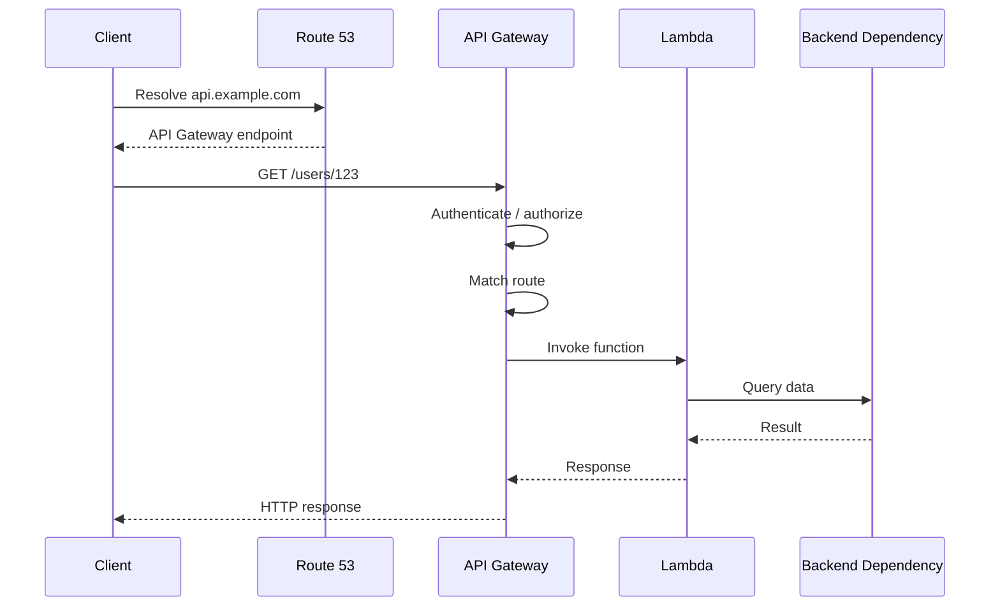
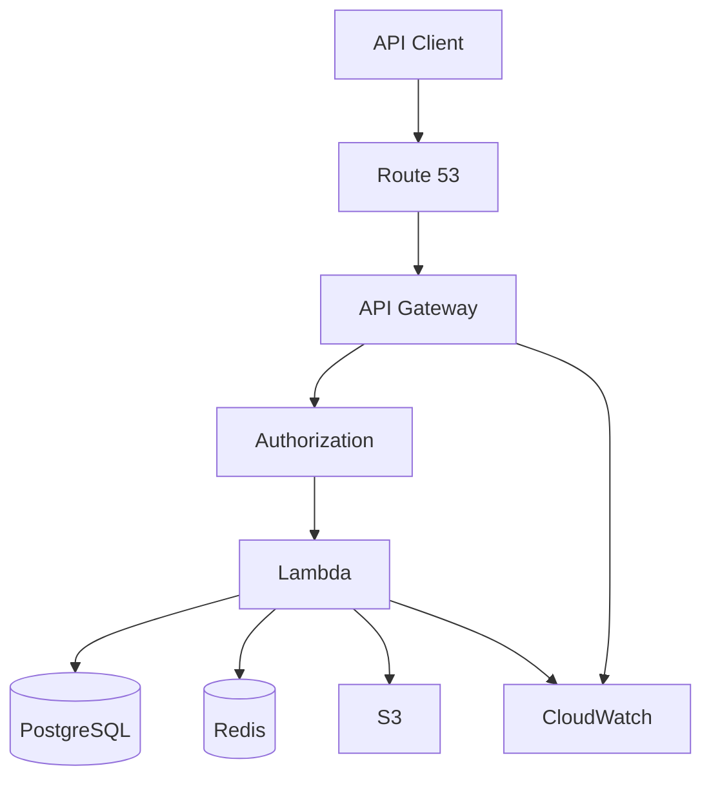
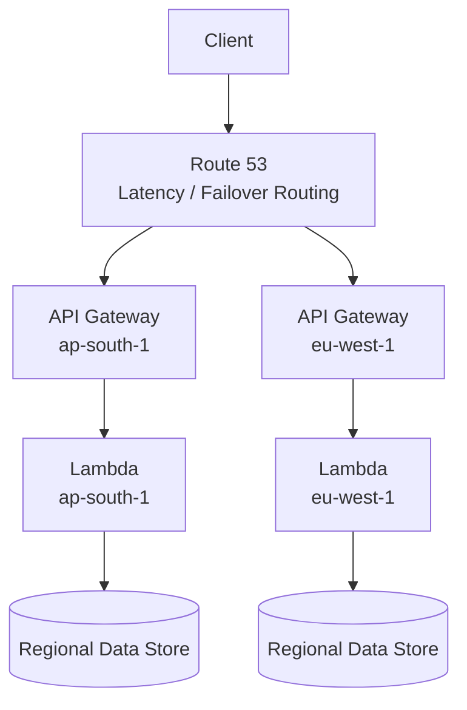

# 19- Route 53 with API Gateway and Lambda

## Overview

A common serverless backend architecture uses Amazon Route 53 as the DNS layer, API Gateway as the public API ingress, and AWS Lambda as the compute layer:

```text
Client
   │
   │ https://api.example.com
   ▼
Route 53
   │
   ▼
API Gateway
   │
   ▼
Lambda
   │
   ├── PostgreSQL / DynamoDB
   ├── Redis
   ├── S3
   └── Other AWS Services
```

The responsibilities are intentionally separated:

| Component | Responsibility |
|---|---|
| Route 53 | DNS resolution and DNS-level routing |
| API Gateway | API ingress, routing, authentication, throttling, request handling |
| Lambda | Serverless application execution |
| IAM | Authorization between AWS resources |
| CloudWatch | Logs, metrics, alarms |
| ACM | TLS certificates for custom domains |

The important engineering principle is:

```text
DNS routing
    ↓
Route 53

API routing
    ↓
API Gateway

Compute
    ↓
Lambda
```

Route 53 does not invoke Lambda directly in the normal API request path. API Gateway invokes Lambda after receiving the HTTP request.

---

## Why This Architecture Exists

A Lambda function should generally not be exposed to clients as the primary public API abstraction.

Instead of exposing an AWS-managed function endpoint directly, use API Gateway to provide:

- Custom API domains
- HTTP routing
- Authentication and authorization
- Request throttling
- API lifecycle management
- Usage controls
- CORS configuration
- Observability
- Integration with Lambda

Route 53 then provides a stable, human-readable DNS name.

The resulting architecture is:

```text
api.example.com
       │
       ▼
    Route 53
       │
       ▼
 API Gateway
       │
       ▼
   Lambda
```

This separates the public API contract from the implementation of the backend function.

---

## Request Lifecycle

Consider:

```text
GET https://api.example.com/users/123
```

The request lifecycle is approximately:

```text
Client
  │
  │ DNS query
  ▼
Route 53
  │
  │ DNS answer
  ▼
API Gateway
  │
  │ Route matching
  │ Authorization
  │ Throttling
  │ Integration
  ▼
Lambda
  │
  │ Application logic
  ▼
Response
```

A more detailed sequence is:



Route 53 participates in hostname resolution, not in the execution of the API request itself.

---

## Custom Domain Architecture

API Gateway provides AWS-generated hostnames such as:

```text
https://api-id.execute-api.region.amazonaws.com
```

These are useful for AWS infrastructure but are generally not the desired public API contract.

A production API can use:

```text
https://api.example.com
```

The architecture becomes:

```text
api.example.com
      │
      ▼
   Route 53
      │
      ▼
API Gateway Custom Domain
      │
      ▼
API
      │
      ▼
Lambda
```

API Gateway custom domains require an SSL/TLS certificate, typically managed through AWS Certificate Manager.

---

## Route 53 Alias to API Gateway

For a public API Gateway custom domain, Route 53 can use an Alias record.

Example:

```text
api.example.com
       │
       │ A Alias
       ▼
API Gateway custom domain
```

For a regional API Gateway endpoint, Route 53 can route the alias to the regional API Gateway endpoint.

For an edge-optimized API Gateway endpoint, the API Gateway custom domain is associated with an AWS-managed CloudFront distribution, and DNS ultimately routes toward that edge-optimized endpoint.

:contentReference[oaicite:0]{index=0}

---

## Why Alias Records Matter

An Alias record is a Route 53-specific DNS capability that can point a hostname at supported AWS resources.

It is particularly useful because:

- It can be used at the zone apex.
- It integrates directly with supported AWS resources.
- It avoids maintaining destination IP addresses manually.
- It is AWS-native.
- Route 53 does not charge for alias queries to API Gateway or other supported AWS resources. :contentReference[oaicite:1]{index=1}

For example:

```text
example.com
    │
    ▼
A Alias
    │
    ▼
API Gateway
```

A traditional CNAME cannot be used for the DNS zone apex.

---

## Route 53 vs API Gateway

These services operate at different layers.

| Capability | Route 53 | API Gateway |
|---|---|---|
| DNS resolution | Yes | No |
| Custom DNS hostname | Yes | Provides custom domain configuration |
| DNS routing | Yes | No |
| HTTP routing | No | Yes |
| Path routing | No | Yes |
| Method routing | No | Yes |
| Authentication | No | Yes |
| API throttling | No | Yes |
| Lambda integration | No | Yes |
| TLS termination | No | Yes, through API Gateway custom domains |
| Health-based DNS routing | Yes | Provides API endpoint health behavior but not DNS routing itself |
| API lifecycle management | No | Yes |

The mental model is:

```text
Route 53:
"Where should api.example.com resolve?"

API Gateway:
"What should happen to GET /users/123?"
```

---

## API Gateway and Lambda Integration

API Gateway can invoke Lambda when an incoming request matches an API route.

For an HTTP API:

```text
GET /users/{id}
        │
        ▼
API Gateway Route
        │
        ▼
Lambda Integration
        │
        ▼
Lambda Function
```

A Lambda function receives an event describing the HTTP request.

A simplified Python Lambda handler can look like:

```python
import json


def handler(event, context):
    user_id = event["pathParameters"]["id"]

    return {
        "statusCode": 200,
        "headers": {
            "Content-Type": "application/json"
        },
        "body": json.dumps({
            "user_id": user_id
        })
    }
```

The exact event structure depends on the API Gateway API type and integration configuration.

---

## Lambda Proxy Integration

Lambda proxy integration is a common pattern because API Gateway forwards request information to Lambda and Lambda returns the HTTP response.

Conceptually:

```text
HTTP Request
     │
     ▼
API Gateway
     │
     ▼
Lambda Event
     │
     ▼
Application Logic
     │
     ▼
Lambda Response
     │
     ▼
API Gateway
     │
     ▼
HTTP Response
```

The Lambda function can receive information such as:

- HTTP method
- Path
- Headers
- Query parameters
- Path parameters
- Request body
- Request context
- Authentication information

For REST APIs, proxy integrations are commonly implemented using a catch-all proxy resource such as `{proxy+}` with `ANY`, although the exact design depends on the API structure. :contentReference[oaicite:2]{index=2}

---

## API Gateway Route Matching

API Gateway performs application-level routing after DNS resolution.

For example:

```text
api.example.com/users
        │
        ▼
API Gateway
        │
        ├── GET /users → Lambda A
        ├── POST /users → Lambda B
        ├── GET /orders → Lambda C
        └── POST /orders → Lambda D
```

This is fundamentally different from Route 53.

Route 53 sees:

```text
api.example.com
```

API Gateway sees:

```text
GET /users
```

Therefore:

```text
DNS routing
    ↓
Route 53

HTTP routing
    ↓
API Gateway
```

---

## API Gateway Custom Domain

A custom domain provides the public hostname.

Example:

```text
api.example.com
```

The custom domain is configured inside API Gateway and associated with the API.

A certificate must be available for the domain before the custom domain can be configured. AWS Certificate Manager is the normal AWS-native solution. :contentReference[oaicite:3]{index=3}

The architecture is:

```text
ACM Certificate
       │
       ▼
API Gateway Custom Domain
       │
       ▼
API
```

Route 53 then maps the DNS name to the API Gateway custom domain.

---

## Regional API Gateway Endpoints

A Regional API Gateway endpoint is deployed in a specific AWS Region.

For example:

```text
Client
   │
   ▼
Route 53
   │
   ▼
api.example.com
   │
   ▼
API Gateway
ap-south-1
   │
   ▼
Lambda
ap-south-1
```

A Regional endpoint is intended to serve clients directly through the selected AWS Region rather than using the CloudFront distribution associated with an edge-optimized API. :contentReference[oaicite:4]{index=4}

Regional endpoints are especially useful when you want to combine API Gateway with Route 53 latency-based routing across multiple AWS Regions.

---

## Edge-Optimized API Gateway Endpoints

An edge-optimized API Gateway endpoint uses a CloudFront distribution associated with API Gateway.

The logical architecture is:

```text
Client
   │
   ▼
Route 53
   │
   ▼
API Gateway Edge-Optimized Endpoint
   │
   ▼
CloudFront
   │
   ▼
API Gateway
   │
   ▼
Lambda
```

This architecture is different from a Regional API Gateway endpoint.

For edge-optimized custom domains, Route 53 can use an Alias record targeting the edge-optimized endpoint. :contentReference[oaicite:5]{index=5}

---

## Regional vs Edge-Optimized

| Characteristic | Regional | Edge-Optimized |
|---|---|---|
| API location | Specific Region | API Region with edge delivery |
| CloudFront | Not inherently part of the endpoint | Associated with endpoint |
| Multi-region DNS | Excellent fit | Less direct for multi-region API design |
| Route 53 latency routing | Strong fit | More complex |
| Regional backend architecture | Excellent | Possible |
| Global client distribution | Can use Route 53 + multiple Regions | Uses CloudFront edge delivery |
| Certificate considerations | Regional certificate | Edge-optimized certificate uses `us-east-1` |

For edge-optimized custom domains, the ACM certificate must be created in `us-east-1`. For Regional custom domains, the certificate must be in the Region of the API. :contentReference[oaicite:6]{index=6}

---

## Multi-Region API Architecture

A more advanced architecture deploys the API and Lambda function in multiple Regions.

For example:

```text
                         Route 53
                            │
                 Latency-based routing
                            │
               ┌────────────┴────────────┐
               │                         │
               ▼                         ▼
        API Gateway A              API Gateway B
        ap-south-1                 eu-west-1
               │                         │
               ▼                         ▼
           Lambda A                  Lambda B
               │                         │
               ▼                         ▼
          Regional DB               Regional DB
```

The same public hostname can be used while Route 53 chooses the Regional API endpoint with the lowest latency according to its routing policy.

AWS explicitly supports using Regional API endpoints with latency-based Route 53 routing for multi-Region APIs. :contentReference[oaicite:7]{index=7}

---

## Multi-Region DNS Flow

Consider a client in Europe:

```text
Client
  │
  ▼
Route 53
  │
  │ Latency-based decision
  ▼
eu-west-1 API Gateway
  │
  ▼
Lambda
```

A client in India may receive:

```text
Client
  │
  ▼
Route 53
  │
  │ Latency-based decision
  ▼
ap-south-1 API Gateway
  │
  ▼
Lambda
```

The important distinction is that Route 53 makes the DNS-level regional decision before API Gateway receives the request.

---

## Route 53 Failover with API Gateway

Route 53 can also support DNS-level failover between Regional API Gateway endpoints.

Example:

```text
                    Route 53
                       │
              ┌────────┴────────┐
              │                 │
          Primary API       Secondary API
              │                 │
         API Gateway         API Gateway
              │                 │
           Lambda             Lambda
```

Health checks can be used to influence DNS failover.

However, DNS failover is not instantaneous because DNS responses can be cached.

Design the system around an explicit recovery objective:

```text
RTO requirement
      │
      ├── DNS TTL
      ├── Health-check behavior
      ├── Lambda capacity
      ├── Database recovery
      └── Dependency recovery
```

Do not assume that Route 53 alone provides disaster recovery.

---

## Route 53 Health Checks

Route 53 health checks can monitor endpoints and influence DNS routing policies.

For example:

```text
Route 53
   │
   ├── Primary API → healthy
   │
   └── Secondary API → standby
```

If the primary endpoint fails the configured health condition, Route 53 can return the secondary endpoint when using an appropriate failover configuration.

The health-check layer should be designed independently from API Gateway's own request handling.

A useful mental model is:

```text
Route 53 health check
       ↓
Should DNS direct clients here?

API Gateway
       ↓
Can this API process the request?

Lambda
       ↓
Can this function execute the operation?
```

---

## API Gateway Health vs Lambda Health

Do not assume:

```text
Lambda invocation succeeded
```

means:

```text
Entire application is healthy
```

A Lambda function can execute successfully while a critical dependency is degraded.

For example:

```text
Lambda
   │
   ├── PostgreSQL → failing
   ├── Redis → healthy
   └── External API → healthy
```

A production health strategy should distinguish:

- API endpoint availability
- Lambda execution health
- Dependency health
- Business-level health

---

## DNS TTL and Serverless APIs

Suppose:

```text
api.example.com
TTL = 60
```

A recursive resolver may cache the DNS response according to the TTL.

This matters when:

- Performing DNS failover
- Migrating APIs
- Switching Regions
- Running blue-green deployments
- Moving between API Gateway endpoints

For example:

```text
Route 53
   │
   ▼
API Gateway A
```

is changed to:

```text
Route 53
   │
   ▼
API Gateway B
```

Clients and recursive resolvers may continue using the previously cached answer until the applicable cache lifetime expires.

DNS-based traffic shifting should therefore not be treated as an instantaneous per-request switch.

---

## DNS Routing Policies with API Gateway

Route 53 can use routing policies such as:

- Simple
- Weighted
- Latency-based
- Failover
- Geolocation
- Geoproximity
- Multivalue answer

This makes API Gateway a useful target for DNS-level architectures.

For example:

```text
api.example.com
        │
        ▼
      Route 53
        │
        ├── 90% → API Gateway A
        │
        └── 10% → API Gateway B
```

This can support:

- Canary releases
- Regional migrations
- Controlled traffic shifts
- Disaster recovery

But DNS-level weighting is fundamentally different from request-level routing inside API Gateway.

---

## Weighted API Deployment

A weighted Route 53 architecture can be used to migrate traffic:

```text
                    Route 53
                       │
              Weighted routing
                       │
             ┌─────────┴─────────┐
             │                   │
          95% API A           5% API B
             │                   │
          Lambda A             Lambda B
```

The traffic distribution is approximate from an end-user perspective because DNS resolvers cache answers.

It is not equivalent to:

```text
Every request
     │
     ├── 95% → API A
     └── 5%  → API B
```

For precise request-level traffic management, use an appropriate application delivery mechanism rather than relying exclusively on DNS weighting.

---

## Lambda Execution Model

Once API Gateway invokes Lambda, the request enters the Lambda execution environment.

Conceptually:

```text
API Gateway
     │
     ▼
Lambda Service
     │
     ├── Existing warm environment
     │
     └── New environment
              │
              ▼
          Lambda handler
```

Lambda may reuse an existing execution environment or create a new one.

This has several production implications:

- Cold starts
- Concurrent executions
- Initialization work
- Connection reuse
- Dependency packaging
- Memory allocation
- Timeout configuration

Route 53 is not involved in this execution behavior.

---

## Lambda Cold Starts

A cold start occurs when Lambda needs to initialize a new execution environment.

The request may therefore experience:

```text
API Gateway
     │
     ▼
Lambda environment creation
     │
     ├── Runtime initialization
     ├── Dependency loading
     └── Application initialization
             │
             ▼
          Handler
```

For latency-sensitive APIs:

- Keep deployment packages reasonably small.
- Avoid unnecessary initialization work.
- Reuse connections where appropriate.
- Choose memory based on actual performance requirements.
- Consider provisioned concurrency when justified.

DNS optimization does not eliminate Lambda cold-start latency.

---

## Lambda Concurrency

A serverless API must account for Lambda concurrency.

A simplified model is:

```text
1000 concurrent API requests
          │
          ▼
API Gateway
          │
          ▼
Lambda concurrency
```

Lambda concurrency controls and account/service quotas can affect the backend.

A production architecture should consider:

- Reserved concurrency
- Provisioned concurrency
- Account concurrency limits
- Downstream database connection capacity
- Queueing behavior
- API Gateway throttling

The key issue is that Lambda can scale faster than a database.

---

## Lambda and Database Connection Pressure

This is a common serverless architecture problem.

Suppose:

```text
1000 Lambda executions
       │
       ▼
PostgreSQL
```

If each execution creates a new database connection, the database can become the bottleneck.

The architecture should therefore consider:

```text
API Gateway
     │
     ▼
Lambda
     │
     ▼
Connection management
     │
     ▼
PostgreSQL
```

Depending on the workload, consider appropriate connection pooling or AWS database connectivity mechanisms such as RDS Proxy.

Do not assume that Lambda's automatic scaling means the database can scale at the same rate.

---

## API Gateway Throttling

API Gateway can protect the backend from uncontrolled request rates.

Conceptually:

```text
Clients
   │
   ▼
API Gateway
   │
   ├── Allowed requests → Lambda
   │
   └── Excess requests → throttled
```

This is particularly important because Lambda can scale rapidly while downstream services may have much lower capacity.

A senior design should consider:

```text
Client traffic
      ↓
API Gateway throttling
      ↓
Lambda concurrency
      ↓
Database capacity
```

These limits should be designed together.

---

## Security Architecture

A production public API commonly looks like:

```text
Internet
   │
   ▼
Route 53
   │
   ▼
API Gateway
   │
   ├── TLS
   ├── Authentication
   ├── Authorization
   ├── Throttling
   └── Request validation
   │
   ▼
Lambda
   │
   ▼
AWS resources
```

API Gateway can integrate with authentication and authorization mechanisms such as:

- IAM
- Lambda authorizers
- Amazon Cognito
- JWT authorization for supported API types

The Lambda execution role should separately use least-privilege IAM permissions for the resources it accesses.

---

## Route 53 Security

DNS infrastructure is part of the application's attack surface.

Protect Route 53 configuration through:

- IAM least privilege
- Controlled deployment pipelines
- Infrastructure as code
- Change auditing
- AWS CloudTrail
- Separation of production permissions

A malicious DNS change can redirect users away from the intended API.

Therefore:

```text
DNS configuration
       │
       ▼
Production infrastructure
       │
       ▼
Strict access control
```

---

## TLS Architecture

The normal public request path is:

```text
Client
   │
   │ HTTPS
   ▼
Route 53
   │
   │ DNS only
   ▼
API Gateway
   │
   │ TLS termination
   ▼
Lambda
```

Route 53 does not terminate HTTPS.

It provides DNS resolution.

The TLS certificate belongs to the API Gateway custom domain configuration.

---

## API Gateway Default Endpoint

API Gateway provides an AWS-generated endpoint in addition to a custom domain.

For a REST API, it can look like:

```text
https://api-id.execute-api.region.amazonaws.com/stage
```

A production API may choose to disable the default endpoint so clients use only the intended custom domain. API Gateway supports disabling the default endpoint for REST APIs; clients attempting to use it then receive `403 Forbidden`. :contentReference[oaicite:8]{index=8}

This can reduce ambiguity around the canonical public API hostname.

---

## Private API Architecture

API Gateway can also expose private APIs.

The architecture changes:

```text
VPC
 │
 ├── Application
 │
 ▼
VPC Interface Endpoint
 │
 ▼
Private API Gateway
 │
 ▼
Lambda
```

Route 53 can use a private hosted zone to provide internal DNS names.

For private API Gateway endpoints, Route 53 can use an Alias record targeting the VPC interface endpoint. :contentReference[oaicite:9]{index=9}

This allows internal clients to use a private hostname such as:

```text
api.internal.example.com
```

without exposing the API publicly.

---

## Public vs Private Architecture

| Characteristic | Public API | Private API |
|---|---|---|
| Internet accessible | Yes | No |
| Route 53 zone | Public hosted zone | Private hosted zone |
| API endpoint | Public | Private |
| VPC endpoint required | No | Yes |
| Typical use | Public APIs | Internal APIs |
| Network boundary | Internet | VPC |

A private API should be considered when the API is intended only for internal workloads.

---

## Route 53 with API Gateway and Lambda in a VPC

A Lambda function can access VPC resources when configured for VPC access.

For example:

```text
Internet
   │
   ▼
Route 53
   │
   ▼
API Gateway
   │
   ▼
Lambda
   │
   ▼
VPC
   │
   ├── PostgreSQL
   ├── Redis
   └── Internal services
```

The Lambda function's network placement is independent of Route 53.

However, putting Lambda into a VPC introduces networking considerations such as:

- Subnet selection
- Security groups
- NAT requirements for internet access
- VPC endpoints
- DNS resolution
- IP address capacity

---

## Lambda and VPC DNS

If a Lambda function needs to resolve internal service names, VPC DNS configuration becomes important.

For example:

```text
Lambda
  │
  │ DNS query
  ▼
VPC DNS
  │
  ▼
Private hosted zone
  │
  ▼
Internal service
```

This is different from public Route 53 resolution.

A production design should explicitly distinguish:

```text
Public DNS
    ↓
Internet-facing endpoints

Private DNS
    ↓
VPC-internal endpoints
```

---

## API Gateway Routing vs Route 53 Routing

Consider:

```text
api.example.com/users
```

Route 53 can decide:

```text
Which API Gateway endpoint?
```

API Gateway can decide:

```text
Which API route?
```

For example:

```text
Route 53
   │
   ▼
API Gateway
   │
   ├── GET /users → Lambda A
   ├── POST /users → Lambda B
   └── GET /orders → Lambda C
```

This layered routing model is one of the most important concepts in the architecture.

---

## API Mappings

API Gateway custom domains can map URL paths to APIs.

For example:

```text
api.example.com/users
        │
        ▼
Users API

api.example.com/orders
        │
        ▼
Orders API
```

This allows a single custom domain to front multiple APIs.

For modern REST API configurations, API Gateway also supports routing rules and API mappings. Routing rules can be used to determine how traffic is sent to APIs, and AWS currently recommends routing rules where possible for REST API custom domains. :contentReference[oaicite:10]{index=10}

The exact mechanism should be selected based on the API type and routing requirements.

---

## Lambda Authorizer Architecture

A Lambda authorizer can participate in the API request path.

Conceptually:

```text
Client
   │
   ▼
API Gateway
   │
   ▼
Authorizer
   │
   ├── Allow
   │
   └── Deny
   │
   ▼
Backend Lambda
```

This separates authorization logic from the business Lambda.

However, authorization architecture should consider:

- Authorizer latency
- Caching
- Token validation
- Failure behavior
- Least privilege
- Operational complexity

Do not move every piece of authentication logic into Lambda authorizers without evaluating the simpler native authorization options available for the API type.

---

## Observability

A production architecture should monitor every layer.

```text
Route 53
   │
   ▼
API Gateway
   │
   ▼
Lambda
   │
   ▼
Dependencies
```

Useful API Gateway metrics include:

- Request count
- 4xx errors
- 5xx errors
- Latency
- Integration latency
- Throttling

Useful Lambda metrics include:

- Invocations
- Errors
- Duration
- Concurrent executions
- Throttles
- Cold-start-related initialization behavior

Route 53 monitoring may include:

- Health-check status
- DNS configuration
- Query behavior

CloudWatch Logs can provide application-level visibility.

---

## Correlated Request Tracing

A request can travel through several managed layers:

```text
Client
  │
  ▼
Route 53
  │
  ▼
API Gateway
  │
  ▼
Lambda
  │
  ▼
Database
```

When troubleshooting latency, determine where time is spent:

```text
DNS
 ↓
API Gateway
 ↓
Lambda initialization
 ↓
Lambda execution
 ↓
Database
```

For distributed systems, use correlation IDs and distributed tracing where appropriate.

The goal is to avoid treating:

```text
API Gateway latency
```

and:

```text
Lambda duration
```

as interchangeable metrics.

They measure different parts of the request path.

---

## Common Failure Scenarios

| Symptom | Likely area |
|---|---|
| `NXDOMAIN` | Route 53 / authoritative DNS |
| DNS resolves but API fails | API Gateway |
| TLS certificate error | Custom domain / ACM |
| `403` | Authorization, resource policy, API configuration, or disabled endpoint |
| `404` | API route, stage, mapping, or routing configuration |
| `429` | API Gateway or downstream throttling |
| `500` | Lambda/application failure |
| `502` | Integration/backend response problem |
| `503` | API availability/integration issue |
| High latency | API Gateway, Lambda cold start, or downstream dependency |
| Lambda timeout | Lambda code or dependency latency |
| DNS change not visible | Resolver caching / TTL |
| Private API unavailable | VPC endpoint / private DNS / routing |

Always inspect logs and metrics rather than diagnosing from the HTTP status code alone.

---

## Troubleshooting Workflow

When:

```text
https://api.example.com/users
```

fails, debug from the outside inward.

### Check DNS

```bash
dig api.example.com
```

Verify:

- Correct hosted zone
- Correct record
- Alias configuration
- Expected API Gateway target
- Public vs private DNS behavior

### Check API Gateway Custom Domain

Verify:

- Domain exists
- Certificate is valid
- Correct endpoint type
- API mapping or routing rule
- Correct Region

### Check API Route

Verify:

- HTTP method
- Resource/path
- Stage
- Route configuration
- Integration target

### Check Lambda

Verify:

- Function exists
- Integration points to the correct function
- Invocation permission exists
- Timeout
- Memory
- Environment variables
- Function logs

### Check Dependencies

Verify:

- Database connectivity
- Redis connectivity
- VPC networking
- NAT/VPC endpoints
- IAM permissions
- Downstream API availability

The troubleshooting path is:

```text
DNS
 ↓
Custom Domain
 ↓
API Gateway Route
 ↓
Integration
 ↓
Lambda
 ↓
Dependencies
```

---

## Common Mistakes

### Pointing Route 53 Directly to Lambda

The normal architecture is not:

```text
Route 53
   ↓
Lambda
```

Use:

```text
Route 53
   ↓
API Gateway
   ↓
Lambda
```

unless a different AWS-managed public endpoint is intentionally being used.

---

### Confusing DNS Routing with API Routing

Route 53 does not understand:

```text
GET /users
```

API Gateway does.

Route 53 operates on DNS names and routing policies.

---

### Forgetting the API Gateway Custom Domain

Creating:

```text
api.example.com
```

in Route 53 is not sufficient.

API Gateway must also have the appropriate custom domain configuration and certificate.

---

### Using the Wrong ACM Region

For Regional API Gateway custom domains:

```text
Certificate Region = API Region
```

For edge-optimized API Gateway custom domains:

```text
Certificate Region = us-east-1
```

This is a common deployment failure.

:contentReference[oaicite:11]{index=11}

---

### Assuming DNS Changes Are Immediate

DNS caching can keep old answers available until caches expire.

Do not use DNS changes as though they were instantaneous application routing switches.

---

### Making Lambda Scale Faster Than the Database

Lambda can scale concurrency quickly.

PostgreSQL may not.

Always evaluate:

```text
Lambda concurrency
       ↓
Database connection capacity
```

---

### Putting Everything in a VPC Without a Reason

VPC integration is useful when Lambda needs private networking, but it introduces additional network design requirements.

Do not add VPC networking merely because the application is production.

---

### Ignoring Private DNS

Private API Gateway architectures depend on correct VPC DNS and interface endpoint configuration.

A private DNS configuration can override normal public DNS behavior inside the VPC.

---

### Treating Route 53 as an API Gateway

Route 53 does not provide:

- Authentication
- HTTP routing
- API throttling
- Request validation
- Lambda invocation logic

Those responsibilities belong elsewhere.

---

## Production Best Practices

### DNS

- Use Route 53 Alias records for supported API Gateway endpoints.
- Keep DNS configuration in infrastructure as code.
- Choose TTLs deliberately.
- Use routing policies only when the traffic-shifting requirement justifies them.
- Protect hosted-zone changes with least-privilege IAM.
- Use public and private hosted zones intentionally.

### API Gateway

- Use custom domains for production APIs.
- Enforce HTTPS.
- Configure authentication and authorization.
- Configure throttling appropriate to backend capacity.
- Use structured API routes.
- Monitor 4xx, 5xx, latency, and throttling.
- Disable the default endpoint when appropriate for the API architecture.

### Lambda

- Keep functions focused.
- Configure timeouts based on real dependency behavior.
- Monitor concurrency.
- Avoid unnecessary initialization work.
- Reuse connections where appropriate.
- Protect downstream systems from excessive concurrency.

### Networking

- Use VPC integration only when required.
- Understand NAT and VPC endpoint requirements.
- Use security groups according to least privilege.
- Separate public and private API architectures.

### Reliability

- Use multi-AZ services by default where applicable.
- Consider multi-Region APIs when business requirements justify them.
- Design Route 53 failover around actual RTO requirements.
- Test DNS failover.
- Test Lambda failure scenarios.
- Test dependency failures.
- Maintain rollback procedures.

### Security

- Use ACM-managed certificates.
- Enforce modern TLS policies.
- Apply least-privilege IAM.
- Protect Lambda execution roles.
- Use API authorization.
- Consider WAF for internet-facing APIs.
- Audit infrastructure changes.

---

## Infrastructure as Code

A simplified Terraform architecture might look like:

```hcl
resource "aws_route53_record" "api" {
  zone_id = aws_route53_zone.primary.zone_id
  name    = "api.example.com"
  type    = "A"

  alias {
    name                   = aws_apigatewayv2_domain_name.api.domain_name_configuration[0].target_domain_name
    zone_id                = aws_apigatewayv2_domain_name.api.domain_name_configuration[0].hosted_zone_id
    evaluate_target_health = false
  }
}
```

The exact resources depend on whether you are deploying:

- REST API
- HTTP API
- Regional custom domain
- Edge-optimized custom domain
- Private API

For a Regional API Gateway custom domain, Route 53 can use either a CNAME or A Alias record, while Route 53 is generally the preferred choice when using its DNS service. :contentReference[oaicite:12]{index=12}

The infrastructure should represent the full dependency chain:

```text
Route 53
   │
   ▼
API Gateway Custom Domain
   │
   ▼
API
   │
   ▼
Lambda Integration
   │
   ▼
Lambda Function
   │
   ▼
Dependencies
```

---

## Example Backend Architecture

A production serverless API might look like:



The public endpoint remains:

```text
https://api.example.com
```

while the implementation can evolve independently:

```text
Lambda
  ↓
PostgreSQL
  ↓
Redis
  ↓
S3
```

Clients do not need to know the internal implementation.

---

## Multi-Region Serverless Architecture

For applications requiring regional resilience:



This architecture introduces a much larger design problem than simply duplicating Lambda.

You must also consider:

- Data replication
- Consistency
- Regional dependencies
- Secrets
- Configuration
- Deployment synchronization
- Observability
- Failover
- Failback
- DNS TTL
- Capacity in the secondary Region

Multi-Region compute without a multi-Region data strategy is not a complete disaster-recovery architecture.

---

## Cost Considerations

The complete request path can generate costs across multiple services:

```text
Route 53
   ↓
API Gateway
   ↓
Lambda
   ↓
Database / Redis / S3
```

Potential cost drivers include:

- Route 53 hosted zones
- DNS queries
- API Gateway requests
- API Gateway data transfer
- Lambda requests
- Lambda duration
- Lambda provisioned concurrency
- Database capacity
- NAT Gateway traffic
- CloudWatch logs and metrics
- WAF requests

For serverless systems, cost optimization should focus on the entire request path.

A function that is cheap per invocation can still become expensive if:

```text
API Gateway
   ↓
Lambda
   ↓
NAT Gateway
   ↓
External API
```

creates high data-transfer or network processing costs.

---

## Interview Traps

### Does Route 53 Invoke Lambda?

No.

The normal request flow is:

```text
Route 53
   ↓
API Gateway
   ↓
Lambda
```

Route 53 performs DNS resolution.

API Gateway invokes Lambda.

---

### Can Route 53 Point to API Gateway?

Yes.

Route 53 can use Alias records for supported API Gateway custom domains/endpoints. :contentReference[oaicite:13]{index=13}

---

### Does Route 53 Replace API Gateway?

No.

Route 53 handles DNS.

API Gateway provides the API ingress and request-level behavior.

---

### Can API Gateway Route Based on HTTP Path?

Yes.

API Gateway operates at the HTTP/API layer and can match routes such as:

```text
GET /users
POST /users
GET /orders
```

Route 53 cannot.

---

### Can Route 53 Perform Multi-Region API Routing?

Yes.

Regional API Gateway endpoints can be combined with Route 53 routing policies such as latency-based routing. :contentReference[oaicite:14]{index=14}

---

### Does DNS Failover Immediately Move All Requests?

No.

DNS caching means clients and recursive resolvers may continue using previously cached answers.

---

### Does Lambda Automatically Make the Entire System Scalable?

No.

Lambda can scale execution concurrency, but dependencies such as PostgreSQL, Redis, external APIs, and other AWS services can become bottlenecks.

---

### Is a Regional API Gateway Endpoint the Same as an Edge-Optimized Endpoint?

No.

A Regional endpoint serves traffic directly through the selected AWS Region.

An edge-optimized endpoint uses an AWS-managed CloudFront distribution associated with API Gateway. :contentReference[oaicite:15]{index=15}

---

### Where Should the ACM Certificate Live?

For a Regional API Gateway custom domain:

```text
Certificate → Same Region as API
```

For an edge-optimized custom domain:

```text
Certificate → us-east-1
```

:contentReference[oaicite:16]{index=16}

---

### Can Private API Gateway Use Route 53?

Yes.

Private APIs can use private hosted zones and Route 53 Alias records targeting the relevant VPC interface endpoint. :contentReference[oaicite:17]{index=17}

---

## Senior-Level Design Checklist

### DNS

- [ ] Correct public or private hosted zone exists.
- [ ] `api.example.com` points to the intended API Gateway custom domain.
- [ ] Alias configuration is correct.
- [ ] Routing policy is intentional.
- [ ] TTL supports the operational requirements.
- [ ] DNS changes are managed through controlled infrastructure.

### API Gateway

- [ ] Correct API type is selected.
- [ ] Correct endpoint type is selected.
- [ ] Custom domain is configured.
- [ ] ACM certificate is valid and in the correct Region.
- [ ] API routes are correct.
- [ ] Authentication and authorization are configured.
- [ ] Throttling is appropriate.
- [ ] Default endpoint exposure is intentional.

### Lambda

- [ ] Timeout is appropriate.
- [ ] Memory is sized from measured behavior.
- [ ] Concurrency limits are understood.
- [ ] Cold-start impact is acceptable.
- [ ] Dependencies are handled efficiently.
- [ ] Execution role follows least privilege.

### Networking

- [ ] VPC integration exists only where needed.
- [ ] Security groups are restrictive.
- [ ] Private DNS behavior is understood.
- [ ] NAT/VPC endpoint requirements are documented.
- [ ] Database connectivity is tested.

### Reliability

- [ ] Lambda failure behavior is understood.
- [ ] Dependency failures are handled.
- [ ] API Gateway throttling protects downstream systems.
- [ ] DNS failover is tested if used.
- [ ] Secondary Region capacity exists if required.
- [ ] Data recovery strategy matches the compute recovery strategy.

### Observability

- [ ] API Gateway metrics are monitored.
- [ ] Lambda errors and duration are monitored.
- [ ] Throttling is monitored.
- [ ] Route 53 health checks are monitored when used.
- [ ] Application logs are centralized.
- [ ] Correlation IDs are available.
- [ ] Critical dependencies have independent monitoring.

---

## Key Takeaways

- **Route 53 is the DNS layer; API Gateway is the API ingress layer; Lambda is the compute layer.**
- The common serverless request path is:

```text
Client
   ↓
Route 53
   ↓
API Gateway
   ↓
Lambda
   ↓
Dependencies
```

- Route 53 does not invoke Lambda directly in the normal API request path.
- API Gateway receives the HTTP request and invokes Lambda through an integration.
- Production APIs should normally expose a meaningful custom domain such as:

```text
https://api.example.com
```

- Route 53 Alias records can route custom DNS names to supported API Gateway endpoints.
- A traditional CNAME cannot be used at the DNS zone apex; an Alias record is appropriate for supported AWS resources.
- API Gateway custom domains require TLS certificate configuration.
- Regional API Gateway custom domains use certificates in the API's Region.
- Edge-optimized API Gateway custom domains require the certificate in `us-east-1`. :contentReference[oaicite:18]{index=18}
- Regional API Gateway endpoints are a strong fit for multi-Region architectures using Route 53 latency-based routing.
- Edge-optimized API Gateway endpoints use an AWS-managed CloudFront distribution.
- Route 53 performs DNS-level routing; API Gateway performs HTTP/API-level routing.
- Route 53 can route `api.example.com` to a Regional API endpoint, but it cannot inspect `/users`, `/orders`, HTTP methods, or request bodies.
- API Gateway can route requests based on API paths and methods.
- Route 53 health checks and API Gateway/Lambda health are different concepts.
- DNS failover is affected by DNS caching and should not be treated as an instantaneous switch.
- Lambda concurrency must be designed together with downstream database and dependency capacity.
- A highly scalable Lambda architecture can still overload PostgreSQL or another downstream dependency.
- Private API Gateway architectures can use Route 53 private hosted zones and VPC interface endpoints.
- VPC-enabled Lambda introduces additional DNS, routing, subnet, security-group, NAT, and VPC endpoint considerations.
- API Gateway should provide the API contract while Lambda remains an implementation detail.
- Route 53 configuration should be protected with IAM least privilege and managed through infrastructure as code.
- The senior-level mental model is:

```text
                 Route 53
                    │
                    │ DNS
                    ▼
          API Gateway Custom Domain
                    │
                    │ HTTP routing
                    ▼
                API Gateway
                    │
                    │ Integration
                    ▼
                  Lambda
                    │
          ┌─────────┼─────────┐
          ▼         ▼         ▼
      PostgreSQL  Redis      S3
```

- For multi-Region systems:

```text
                         Route 53
                    Latency / Failover
                            │
                ┌───────────┴───────────┐
                ▼                       ▼
          API Gateway A           API Gateway B
          ap-south-1              eu-west-1
                │                       │
                ▼                       ▼
             Lambda                  Lambda
```

- The most important troubleshooting path is:

```text
DNS
 ↓
Custom Domain
 ↓
API Gateway Route
 ↓
Integration
 ↓
Lambda
 ↓
Dependencies
```

- The core architectural rule is:

```text
Route 53 → Where?
API Gateway → Which API operation?
Lambda → How is the operation executed?
```