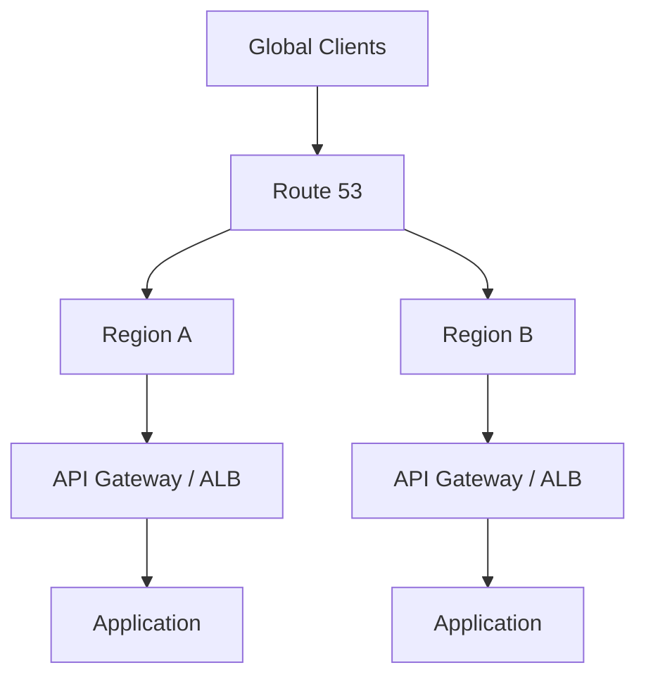
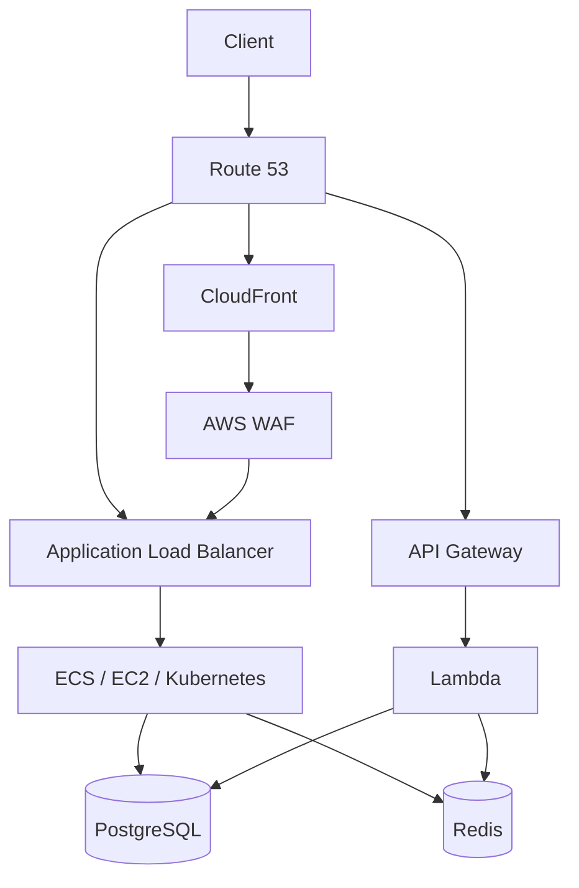

# 20- Advantages and Limitations

## Overview

Amazon Route 53 is AWS's managed DNS and domain service. It provides authoritative DNS hosting, domain registration, DNS health checks, traffic routing policies, and DNS resolution capabilities through Route 53 Resolver.

For backend engineers, Route 53 is important because DNS becomes part of the architecture rather than merely a domain-management concern.

A production request path may look like:

```text
Client
   │
   │ DNS query
   ▼
Route 53
   │
   │ DNS response
   ▼
Application Endpoint
   │
   ├── CloudFront
   ├── API Gateway
   ├── Application Load Balancer
   ├── S3
   └── EC2 / ECS / Kubernetes
```

Route 53 is particularly valuable when an application needs:

- Highly available DNS
- Custom domain names
- AWS service integration
- Health-based failover
- Multi-Region routing
- Latency-based routing
- Weighted traffic distribution
- Private DNS inside VPCs
- Domain registration and DNS management

However, Route 53 is not a replacement for application load balancers, API gateways, service discovery systems, or application-level traffic management.

The senior-level question is therefore not simply:

> "Can Route 53 route traffic?"

It is:

> "Which routing decision belongs at the DNS layer, and what are the limitations introduced by DNS caching and resolver behavior?"

---

## Where Route 53 Fits in the Architecture

Route 53 operates primarily at the DNS layer.

```text
                    DNS Layer
                       │
                    Route 53
                       │
          ┌────────────┼────────────┐
          ▼            ▼            ▼
      CloudFront    API Gateway     ALB
          │            │            │
          ▼            ▼            ▼
      Application    Lambda       Services
```

The responsibilities are different at each layer:

| Layer | Typical AWS service | Primary responsibility |
|---|---|---|
| DNS | Route 53 | Resolve names and select DNS answers |
| Edge | CloudFront | Global content and edge delivery |
| API | API Gateway | HTTP API routing and controls |
| Load balancing | ALB/NLB | Distribute traffic across targets |
| Compute | Lambda/ECS/EC2/EKS | Execute application workloads |
| Service discovery | Cloud Map/Kubernetes DNS | Discover internal services |

This separation is fundamental when designing production systems.

---

## Core Advantages

Route 53 provides several capabilities that make it suitable for production backend architectures.

| Advantage | Engineering value |
|---|---|
| Managed DNS | Removes the operational burden of running authoritative DNS servers |
| High availability | DNS infrastructure is distributed across AWS infrastructure |
| AWS integration | Works directly with services such as CloudFront, ALB, API Gateway, and S3 |
| Multiple routing policies | Supports several DNS-level traffic-management strategies |
| Health checks | Enables health-aware DNS routing |
| Multi-Region support | Can direct users toward different Regional endpoints |
| Private DNS | Supports internal VPC naming and resolution |
| Domain registration | Provides domain registration within the AWS ecosystem |
| Alias records | Provides AWS-native DNS integration with supported resources |
| Infrastructure as Code | Can be managed through Terraform, CloudFormation, CDK, and other automation |
| Resolver capabilities | Supports hybrid DNS architectures involving AWS VPCs and on-premises networks |

---

## Managed DNS Infrastructure

### What It Provides

With Route 53, AWS operates the authoritative DNS infrastructure instead of requiring the engineering team to deploy and maintain DNS servers.

A traditional self-managed DNS architecture might require:

```text
DNS Servers
   │
   ├── Operating system maintenance
   ├── DNS software
   ├── Network availability
   ├── Redundancy
   ├── Patching
   └── Monitoring
```

With Route 53:

```text
Application Team
      │
      ▼
Route 53 Configuration
      │
      ▼
AWS Managed DNS Infrastructure
```

This significantly reduces infrastructure operational overhead.

### Why This Matters

DNS is foundational infrastructure.

If DNS fails:

```text
DNS failure
    ↓
Application hostname cannot resolve
    ↓
Application becomes unreachable
```

Therefore, DNS availability is part of application availability.

---

## AWS Service Integration

One of Route 53's strongest advantages is its integration with AWS resources.

Common targets include:

- CloudFront distributions
- Application Load Balancers
- Network Load Balancers
- API Gateway
- S3 website endpoints
- VPC resources through private DNS architectures

A typical backend system can therefore use:

```text
api.example.com
       │
       ▼
Route 53
       │
       ▼
Application Load Balancer
       │
       ▼
ECS / EC2 / Kubernetes
```

Or:

```text
api.example.com
       │
       ▼
Route 53
       │
       ▼
API Gateway
       │
       ▼
Lambda
```

This reduces the need to manually manage changing IP addresses.

---

## Alias Records

Alias records are a major AWS-specific advantage.

Instead of managing the IP address of an AWS resource manually:

```text
api.example.com
      │
      ▼
A record
      │
      ▼
Fixed IP address
```

an Alias record can point to a supported AWS resource:

```text
api.example.com
      │
      ▼
A Alias
      │
      ▼
Application Load Balancer
```

The AWS resource can change its underlying infrastructure without requiring the application team to maintain a manually updated IP address.

### Zone Apex Support

A particularly important advantage is that Alias records can be used at the zone apex for supported AWS resources.

For example:

```text
example.com
```

can point to an AWS-supported resource using an Alias record.

A normal CNAME cannot be used at the DNS zone apex.

This makes Alias records particularly useful for production AWS architectures.

---

## Routing Policies

Route 53 supports multiple routing strategies.

| Routing policy | Primary use |
|---|---|
| Simple | Basic DNS resolution |
| Weighted | Traffic distribution |
| Latency-based | Direct users toward lower-latency Regions |
| Failover | Primary/secondary DNS failover |
| Geolocation | Route based on geographic location |
| Geoproximity | Route based on geographic proximity and configured bias |
| Multivalue answer | Return multiple healthy records |
| IP-based | Route based on client IP ranges |

This gives architecture teams considerable flexibility.

For example:

```text
                   Route 53
                       │
          ┌────────────┼────────────┐
          ▼            ▼            ▼
       Region A     Region B     Region C
          │            │            │
          ▼            ▼            ▼
      API / ALB     API / ALB    API / ALB
```

---

## Weighted Routing

Weighted routing allows different DNS records to receive different proportions of DNS responses.

For example:

```text
api.example.com

90% → Version A
10% → Version B
```

This can be useful for:

- Controlled migrations
- Canary-style DNS traffic shifting
- Blue-green environments
- Regional migrations

However, DNS weighting should not be interpreted as exact per-request distribution.

DNS answers are cached by recursive resolvers and clients.

Therefore:

```text
Configured:
90 / 10

Observed user requests:
May not be exactly 90 / 10
```

This is an important limitation of DNS-level traffic management.

---

## Latency-Based Routing

Latency-based routing can direct clients toward an AWS Region that Route 53 determines to provide lower network latency.

For example:

```text
                 Route 53
                     │
          Latency-based decision
             ┌───────┴───────┐
             ▼               ▼
        ap-south-1       eu-west-1
             │               │
             ▼               ▼
          API A            API B
```

This is useful for globally distributed applications.

Potential benefits include:

- Lower client latency
- Regional distribution
- Multi-Region architectures
- Better user experience

But it requires the backend itself to support multi-Region operation.

---

## Health-Based Routing

Route 53 health checks can be used with supported routing configurations to influence DNS answers.

For example:

```text
                Route 53
                   │
             Health evaluation
                   │
          ┌────────┴────────┐
          ▼                 ▼
      Primary            Secondary
       healthy             standby
          │
          ▼
       API / ALB
```

This can support DNS-level failover.

However, a health check does not make the entire application automatically resilient.

A real production system must also consider:

- Database availability
- Cache availability
- External dependencies
- Queueing systems
- Regional infrastructure
- Application correctness
- Data replication

---

## Multi-Region Architectures

Route 53 is particularly useful when an application spans multiple AWS Regions.

Example:



Possible routing strategies include:

- Latency-based routing
- Failover routing
- Weighted routing
- Geolocation routing
- Geoproximity routing

This enables DNS-level global traffic management without requiring clients to understand individual Regions.

---

## Private Hosted Zones

Route 53 is not limited to public DNS.

Private hosted zones allow internal names to resolve inside associated VPCs.

For example:

```text
orders.internal.example.com
          │
          ▼
     Private DNS
          │
          ▼
Internal Service
```

This is useful for:

- Internal APIs
- Microservices
- Private databases
- Internal load balancers
- Hybrid architectures

A typical architecture may look like:

```text
VPC
 │
 ├── Service A
 │      │
 │      │ DNS
 │      ▼
 │  Route 53 Private Hosted Zone
 │      │
 │      ▼
 │  Service B
 │
 └── Database
```

This provides stable service names without exposing internal infrastructure to the public internet.

---

## Hybrid DNS

Route 53 Resolver supports hybrid DNS architectures connecting AWS VPCs with on-premises environments.

A simplified architecture is:

```text
On-Premises Network
        │
        │ DNS
        ▼
Route 53 Resolver
        │
        ▼
       VPC
        │
        ▼
AWS Services
```

This can support environments where:

- AWS and on-premises systems coexist
- Internal DNS domains must resolve across environments
- Existing enterprise DNS infrastructure must remain authoritative for certain zones

This is particularly valuable in large enterprise architectures.

---

## Domain Registration

Route 53 can also provide domain registration.

This gives teams a consolidated AWS workflow:

```text
Domain Registration
        │
        ▼
Route 53
        │
        ▼
Hosted Zone
        │
        ▼
DNS Records
        │
        ▼
AWS Application
```

However, domain registration and DNS hosting are separate concepts.

A domain can be registered with one provider while DNS is hosted elsewhere.

For example:

```text
Registrar
   │
   │ Domain registration
   ▼
example.com

DNS Provider
   │
   │ DNS hosting
   ▼
Route 53
```

This distinction is important when migrating domains between providers.

---

## Operational Simplicity

Running DNS infrastructure yourself introduces operational work.

Route 53 removes much of that burden.

| Responsibility | Self-managed DNS | Route 53 |
|---|---|---|
| DNS servers | Team-managed | AWS-managed |
| OS patching | Required | AWS responsibility |
| DNS software | Team-managed | AWS responsibility |
| Redundancy | Team-designed | Managed service |
| Scaling | Team-designed | Managed |
| AWS resource integration | Manual | Native |
| IaC support | Possible | Strong |
| Monitoring | Team-designed | AWS metrics and tooling |

This does not mean Route 53 requires no operational discipline.

Configuration errors remain the responsibility of the engineering team.

---

## Limitations

Route 53 is powerful, but DNS itself has fundamental constraints.

| Limitation | Engineering impact |
|---|---|
| DNS caching | Changes are not immediately visible everywhere |
| TTL behavior | Traffic changes can take time to propagate through caches |
| No HTTP awareness | Cannot inspect HTTP paths or request bodies |
| Coarse traffic control | DNS routing is not request-level routing |
| Resolver behavior | Different recursive resolvers may behave differently |
| Limited application context | DNS cannot understand application health deeply |
| Cost at scale | Large query volumes and health checks can generate costs |
| Configuration complexity | Advanced routing can become difficult to reason about |
| Multi-Region data complexity | DNS cannot solve data consistency or replication |
| Dependency on DNS | Incorrect DNS configuration can make the application unreachable |

---

## DNS Caching Is a Fundamental Limitation

DNS is designed around caching.

Suppose:

```text
api.example.com
TTL = 300
```

A recursive resolver may cache the answer for up to the configured TTL.

If Route 53 changes:

```text
Old:
api.example.com → API A

New:
api.example.com → API B
```

some clients may continue receiving the old answer until cached data expires.

Therefore:

```text
Route 53 configuration change
          ↓
DNS caches
          ↓
Client behavior
```

is not equivalent to:

```text
Load balancer configuration change
          ↓
Immediate request-level behavior
```

This is one of the most important limitations to understand.

---

## DNS Is Not Request-Level Load Balancing

Consider:

```text
Route 53
   │
   ├── Region A
   └── Region B
```

Route 53 chooses DNS answers.

It does not inspect every HTTP request and decide:

```text
Request #1 → Region A
Request #2 → Region B
Request #3 → Region A
```

Instead:

```text
DNS query
    ↓
DNS answer
    ↓
Client caches answer
    ↓
Client sends requests to selected endpoint
```

This makes DNS fundamentally different from:

- ALB
- NLB
- API Gateway
- Service mesh
- Application-level routing

---

## DNS Cannot Inspect Application State

A DNS service cannot directly understand business-level application state such as:

```text
Database connection pool = exhausted
```

or:

```text
Payment service = returning errors for 40% of requests
```

A Route 53 health check can test an endpoint or monitor certain AWS resource conditions, but it is not a complete application observability system.

This creates an important distinction:

```text
Infrastructure health
        ≠
Application health
        ≠
Business health
```

A production architecture should monitor all three.

---

## Failover Is Not Instantaneous

Suppose:

```text
Primary Region
      ↓
Failed
```

Route 53 detects the failure and changes DNS responses.

However:

```text
Health check
    ↓
Routing decision
    ↓
DNS response
    ↓
Recursive resolver cache
    ↓
Client cache
    ↓
New connection
```

contains multiple stages.

Therefore, DNS failover has a practical recovery time that depends on:

- Health-check configuration
- DNS TTL
- Resolver behavior
- Client behavior
- Network conditions
- Application startup time
- Backend readiness

Route 53 should be one component of the disaster-recovery strategy, not the entire strategy.

---

## Traffic Distribution Is Approximate

Suppose a weighted configuration is:

```text
Region A = 80
Region B = 20
```

It does not guarantee:

```text
Every 100 requests:
80 → A
20 → B
```

Instead, Route 53 influences DNS answers.

Recursive resolvers may cache those answers and serve many clients from the same cached result.

Therefore weighted DNS routing is better understood as:

```text
Approximate DNS-level traffic distribution
```

rather than:

```text
Precise request-level load balancing
```

---

## No Native HTTP Path Routing

Route 53 cannot perform routing such as:

```text
api.example.com/users → Users Service

api.example.com/orders → Orders Service
```

based on the HTTP path.

That responsibility belongs to an HTTP-aware layer:

```text
Route 53
   ↓
ALB / API Gateway
   ↓
Path-based routing
```

For example:

```text
api.example.com
       │
       ▼
Application Load Balancer
       │
       ├── /users  → Users Service
       └── /orders → Orders Service
```

This is an important architectural boundary.

---

## Configuration Complexity

Simple Route 53 configurations are easy to understand:

```text
example.com
    ↓
ALB
```

Advanced configurations can become considerably more difficult:

```text
Route 53
   │
   ├── Weighted records
   │
   ├── Health checks
   │
   ├── Failover records
   │
   ├── Latency routing
   │
   ├── Geolocation
   │
   ├── Geoproximity
   │
   └── Multiple Regions
```

At this point, engineers need explicit documentation and infrastructure-as-code conventions.

Otherwise, diagnosing a routing problem becomes difficult.

---

## Configuration Drift

Manual DNS changes are a common source of production drift.

For example:

```text
Terraform
   │
   ▼
Expected DNS record
```

but an engineer manually changes Route 53:

```text
AWS Console
   │
   ▼
Actual DNS record
```

Now:

```text
Desired state ≠ Actual state
```

This can cause future Terraform deployments to overwrite emergency changes or produce unexpected behavior.

For production environments:

- Use Terraform, CloudFormation, or CDK.
- Review DNS changes through pull requests.
- Restrict console-based production changes.
- Audit changes through CloudTrail.
- Document emergency procedures.

---

## Cost Considerations

Route 53 costs can arise from several capabilities.

Potential cost areas include:

- Hosted zones
- DNS queries
- Health checks
- Domain registration
- Resolver endpoints
- Resolver query logging
- DNS Firewall features
- Traffic management features where applicable

For most ordinary backend applications, DNS query cost is not the dominant infrastructure cost.

At large scale, however, DNS traffic can become significant.

A senior engineer should therefore consider:

```text
DNS query volume
      ↓
Routing architecture
      ↓
Route 53 cost
```

especially for globally distributed systems.

---

## Performance Considerations

DNS contributes to request startup latency.

A simplified first-request flow is:

```text
Client
  │
  ├── DNS lookup
  │
  ├── TCP connection
  │
  ├── TLS handshake
  │
  └── HTTP request
```

If the DNS response is already cached:

```text
DNS cache hit
     ↓
No authoritative DNS lookup required
     ↓
Lower startup overhead
```

If the DNS record is not cached:

```text
Client
   ↓
Recursive resolver
   ↓
Authoritative DNS
   ↓
Response
```

The actual latency depends on the client, resolver, network path, and cache state.

Route 53 therefore participates in the initial connection path, but DNS lookup latency is generally much less important than application latency once the connection is established and reused.

---

## TTL Trade-Offs

TTL is a balancing mechanism.

### Lower TTL

Example:

```text
TTL = 30 seconds
```

Advantages:

- Faster DNS changes
- Faster potential DNS failover
- More responsive traffic migration

Limitations:

- More DNS queries
- Potentially higher DNS cost
- More resolver traffic
- Still does not guarantee immediate propagation

### Higher TTL

Example:

```text
TTL = 3600 seconds
```

Advantages:

- More caching
- Fewer DNS queries
- Lower DNS overhead
- Stable DNS behavior

Limitations:

- Slower changes
- Slower DNS-level failover
- More difficult emergency migrations

The correct TTL depends on the operational requirement.

---

## Route 53 vs Application Load Balancer

These services solve different problems.

| Capability | Route 53 | ALB |
|---|---|---|
| DNS resolution | Yes | No |
| Global DNS routing | Yes | No |
| Health-based DNS routing | Yes | No |
| HTTP path routing | No | Yes |
| Host-based HTTP routing | No | Yes |
| Per-request load balancing | No | Yes |
| Target health | DNS health checks / routing | Target health checks |
| TLS termination | No | Yes |
| WebSocket support | DNS layer only | Yes |
| Client IP awareness | Limited DNS context | Yes |
| Typical role | DNS | HTTP load balancing |

A common architecture combines them:

```text
Route 53
   ↓
ALB
   ↓
ECS / EC2 / Kubernetes
```

---

## Route 53 vs API Gateway

| Capability | Route 53 | API Gateway |
|---|---|---|
| DNS | Yes | No |
| Custom domain | DNS hosting | API custom-domain configuration |
| HTTP routing | No | Yes |
| Authentication | No | Yes |
| Throttling | No | Yes |
| Lambda integration | No | Yes |
| API lifecycle | No | Yes |
| DNS failover | Yes | No |
| Multi-Region DNS routing | Yes | No |

The services complement each other:

```text
Route 53
   ↓
API Gateway
   ↓
Lambda
```

---

## Route 53 vs CloudFront

CloudFront operates at the edge and understands HTTP requests.

Route 53 operates at the DNS layer.

```text
Client
   │
   ▼
Route 53
   │
   ▼
CloudFront
   │
   ├── Cache
   ├── WAF
   └── Origin
```

A common architecture is:

```text
example.com
     │
     ▼
Route 53
     │
     ▼
CloudFront
     │
     ├── S3
     └── ALB
```

Route 53 selects the CloudFront distribution.

CloudFront handles the subsequent HTTP request.

---

## Route 53 vs Kubernetes DNS

Kubernetes already provides DNS-based service discovery inside a cluster.

For example:

```text
service-a.default.svc.cluster.local
```

is normally resolved through Kubernetes DNS.

Route 53 may still be used for:

```text
api.example.com
```

or for broader AWS/private DNS architectures.

A common architecture is:

```text
Internet
   │
   ▼
Route 53
   │
   ▼
Load Balancer
   │
   ▼
Kubernetes
   │
   ▼
Kubernetes DNS
   │
   ▼
Internal Services
```

The two DNS systems operate at different scopes.

---

## Route 53 and Microservices

For microservices, DNS can provide stable service names.

Instead of coupling services to infrastructure:

```text
http://10.0.2.15:8080
```

use a stable name:

```text
http://orders.internal.example.com
```

This allows infrastructure to change without changing application configuration.

However, DNS should not automatically be treated as a complete service-discovery solution.

For high-frequency service-to-service traffic, consider:

- Kubernetes service discovery
- AWS Cloud Map
- Service mesh
- Internal load balancers

depending on the architecture.

---

## Security Advantages

Route 53 can participate in secure DNS architectures.

Useful capabilities include:

- Private hosted zones
- IAM-controlled DNS changes
- Resolver controls
- DNS Firewall capabilities
- CloudTrail auditing
- Integration with AWS networking architecture

A secure production model is:

```text
Developer
   │
   ▼
CI/CD
   │
   ▼
Infrastructure as Code
   │
   ▼
Route 53
```

rather than:

```text
Developer
   │
   ▼
Production DNS Console
```

for routine changes.

---

## Security Limitations

Route 53 does not secure the application by itself.

For example:

```text
Route 53
   ↓
ALB
   ↓
Application
```

does not automatically provide:

- Authentication
- Authorization
- API security
- Input validation
- WAF protection
- Application-layer rate limiting
- Encryption of application data

These must be implemented at the appropriate layers.

A secure architecture may therefore look like:

```text
Route 53
   ↓
CloudFront / WAF
   ↓
ALB / API Gateway
   ↓
Application
```

---

## Reliability Advantages

Route 53 can improve reliability when used correctly.

Useful patterns include:

### DNS Failover

```text
Primary
   │
   ├── Healthy → Primary
   │
   └── Unhealthy → Secondary
```

### Multi-Region Routing

```text
Global Clients
      │
      ▼
   Route 53
      │
 ┌────┴────┐
 ▼         ▼
Region A Region B
```

### Health-Aware Routing

```text
Health Check
      │
      ▼
Routing Decision
      │
      ▼
Healthy Endpoint
```

These patterns reduce the blast radius of certain regional or endpoint failures.

---

## Reliability Limitations

Route 53 cannot compensate for a poorly designed backend.

For example:

```text
Route 53
   │
   ▼
Region A
   │
   ▼
Single Database
```

If the single database fails, changing DNS may not solve the problem.

Similarly:

```text
Region A → Database A
Region B → Database A
```

still has a shared database dependency.

A true multi-Region architecture must identify every critical shared dependency.

---

## Disaster Recovery Considerations

Route 53 is useful for disaster recovery but is not the complete DR mechanism.

A DR architecture may involve:

```text
Route 53
   │
   ├── Primary Region
   │      ├── Compute
   │      └── Database
   │
   └── Secondary Region
          ├── Compute
          └── Database
```

The DR plan must define:

- RTO
- RPO
- DNS TTL
- Health-check behavior
- Data replication
- Application readiness
- Capacity in the secondary Region
- Secret/configuration replication
- Deployment synchronization
- Failback procedure

The key principle is:

> DNS can redirect traffic, but it cannot recreate missing application state.

---

## Common Production Mistakes

### Using DNS for Precise Canary Control

Bad assumption:

```text
10% DNS weight = exactly 10% of HTTP requests
```

This is not guaranteed because DNS answers are cached.

Use application-aware traffic management when precise request-level control is required.

---

### Setting Extremely Low TTLs Without a Reason

A very low TTL can increase query volume without guaranteeing instantaneous failover.

Choose TTL based on:

- Change frequency
- Failover requirements
- Cost
- Operational expectations

---

### Treating Health Checks as Complete Application Monitoring

An endpoint can return:

```text
HTTP 200
```

while the application is functionally degraded.

Health checks should be designed carefully and complemented by application metrics and dependency monitoring.

---

### Manually Editing Production DNS

Manual changes create configuration drift.

Use:

```text
Git
  ↓
Pull Request
  ↓
CI/CD
  ↓
Terraform / CloudFormation / CDK
  ↓
Route 53
```

for controlled infrastructure changes.

---

### Assuming DNS Failover Is Instant

DNS caching makes immediate global failover impossible to guarantee.

Design RTO expectations accordingly.

---

### Forgetting the Zone Apex Constraint

A standard CNAME cannot be placed at:

```text
example.com
```

when that name is the zone apex.

Use an Alias record for supported AWS targets.

---

### Using Public DNS for Private Services

Internal services should not be exposed merely because DNS configuration is easier.

Use private hosted zones and appropriate VPC networking for internal systems.

---

### Creating Too Many Complex Routing Rules

An architecture such as:

```text
Geolocation
   +
Latency
   +
Weighted
   +
Failover
   +
Health Checks
```

can become extremely difficult to reason about.

Use the simplest routing policy that satisfies the actual requirement.

---

## Production Decision Framework

When deciding whether to use a Route 53 capability, ask:

| Question | Design implication |
|---|---|
| Do clients need a stable hostname? | Use DNS |
| Do endpoints change dynamically? | Prefer Alias/integrated AWS targets |
| Do users need regional routing? | Consider latency/geolocation/geoproximity |
| Is precise per-request traffic splitting required? | DNS may be insufficient |
| Is automatic DNS failover required? | Consider failover routing + health checks |
| Is the service private? | Consider private hosted zones |
| Does HTTP path routing matter? | Use ALB/API Gateway |
| Does edge caching matter? | Consider CloudFront |
| Does service-to-service discovery matter? | Consider Cloud Map/Kubernetes DNS/service mesh |
| Is multi-Region required? | Design DNS and data layers together |
| Are DNS changes frequent? | Carefully evaluate TTL |
| Is production DNS manually managed? | Move toward IaC |

---

## Senior-Level Architecture Trade-Offs

A senior engineer should evaluate Route 53 based on the layer at which the routing decision is required.

```text
                    Routing Requirement
                           │
             ┌─────────────┼─────────────┐
             │             │             │
             ▼             ▼             ▼
          DNS-level      HTTP-level    Service-level
             │             │             │
             ▼             ▼             ▼
        Route 53       ALB/API GW    Cloud Map/K8s
```

Examples:

| Requirement | Better fit |
|---|---|
| `api.example.com` → API endpoint | Route 53 |
| `/users` → Users service | ALB/API Gateway |
| `/orders` → Orders service | ALB/API Gateway |
| Service A discovers Service B | Cloud Map/Kubernetes DNS |
| Global regional selection | Route 53 |
| Per-request load balancing | ALB/NLB |
| Edge caching | CloudFront |
| API authentication | API Gateway/application |
| Database failover | Database-specific mechanism |
| Exact canary percentage | Application/edge traffic management |

The important engineering principle is to avoid forcing DNS to solve problems that belong at a different layer.

---

## Example Production Architecture

A common AWS backend architecture can combine several routing layers:



Each service has a clear responsibility:

```text
Route 53
    ↓
DNS decision

CloudFront
    ↓
Edge delivery / caching

WAF
    ↓
HTTP security filtering

ALB
    ↓
HTTP load balancing

API Gateway
    ↓
API management

Lambda / ECS / Kubernetes
    ↓
Application execution
```

This layered architecture is more maintainable than attempting to make one service perform every routing function.

---

## Best Practices

### DNS Design

- Use meaningful domain names.
- Separate public and private DNS namespaces when appropriate.
- Use Alias records for supported AWS targets.
- Keep production DNS in infrastructure as code.
- Choose TTLs based on operational requirements.
- Avoid unnecessarily complex routing policies.

### Availability

- Use health checks when DNS-level failover is required.
- Test failover rather than assuming it works.
- Design multi-Region routing together with multi-Region data architecture.
- Keep the secondary Region genuinely deployable and operationally ready.

### Performance

- Use latency-based routing when regional latency matters.
- Use CloudFront when edge delivery or caching is required.
- Do not expect DNS to optimize every layer of application latency.
- Understand resolver caching before changing TTLs.

### Security

- Use least-privilege IAM for Route 53 changes.
- Protect production DNS from unauthorized modifications.
- Audit DNS changes.
- Use private hosted zones for internal services.
- Do not treat DNS as an application security layer.

### Operations

- Manage DNS through Terraform, CloudFormation, or CDK.
- Review DNS changes through CI/CD.
- Monitor health-check status.
- Document routing policies.
- Document emergency DNS procedures.
- Test disaster-recovery routing periodically.

### Architecture

- Use Route 53 for DNS-level decisions.
- Use ALB/NLB for load balancing.
- Use API Gateway for API management.
- Use CloudFront for edge delivery.
- Use Kubernetes DNS or Cloud Map for service discovery.
- Avoid using DNS as a substitute for application-level traffic management.

---

## Interview Traps

### Is Route 53 a Load Balancer?

Not in the same sense as an ALB or NLB.

Route 53 provides DNS-level routing.

An ALB distributes HTTP requests across targets.

---

### Does Route 53 Route Every HTTP Request?

No.

The typical flow is:

```text
DNS query
    ↓
Route 53
    ↓
DNS answer
    ↓
Client
    ↓
HTTP requests
```

Route 53 is not necessarily involved in every subsequent HTTP request when the DNS answer is cached.

---

### Can Route 53 Do Path-Based Routing?

No.

Route 53 cannot route:

```text
/users
/orders
/payments
```

based on HTTP paths.

Use an HTTP-aware service such as ALB or API Gateway.

---

### Does a 10% Weighted Record Guarantee 10% of Requests?

No.

DNS responses are cached by recursive resolvers and clients.

Weighted routing provides DNS-level traffic distribution, not precise request-level distribution.

---

### Does Route 53 Eliminate the Need for Load Balancers?

No.

They solve different problems.

A common architecture is:

```text
Route 53
   ↓
ALB
   ↓
Application Targets
```

---

### Can Route 53 Provide Automatic Disaster Recovery?

It can participate in DNS-level failover, but it cannot solve:

- Data replication
- Database recovery
- Application deployment
- Capacity provisioning
- Secret replication
- Dependency recovery

DR requires all of these pieces.

---

### Can Route 53 Be Used for Internal Services?

Yes.

Private hosted zones and Route 53 Resolver support private and hybrid DNS architectures.

---

### Does Lower TTL Mean Instantaneous Failover?

No.

Lower TTL can reduce the amount of time a compliant resolver should cache a response, but DNS behavior across clients and resolvers is still not an instantaneous global switch.

---

## Key Takeaways

- Route 53 is a managed DNS service and should primarily be considered a **DNS-layer routing and naming system**.
- Its strongest architectural advantage is combining managed DNS with AWS-native integration.
- Route 53 works particularly well with:
  - CloudFront
  - API Gateway
  - ALB
  - NLB
  - S3
  - VPC private DNS
- Alias records simplify integration with supported AWS resources and can be used at the zone apex where a normal CNAME cannot.
- Route 53 supports multiple routing policies including:
  - Simple
  - Weighted
  - Latency-based
  - Failover
  - Geolocation
  - Geoproximity
  - Multivalue answer
  - IP-based
- Weighted routing is useful for traffic shifting but does **not** provide precise per-request traffic percentages.
- Latency-based routing is useful for multi-Region architectures but requires the application and data layers to support regional deployment.
- Health checks can support DNS-level failover but are not a replacement for comprehensive application monitoring.
- DNS caching is the fundamental limitation behind many Route 53 behaviors.
- DNS changes are not instantaneous because recursive resolvers and clients cache responses.
- Route 53 is not an HTTP load balancer.
- Route 53 cannot perform HTTP path-based routing.
- Route 53 cannot inspect request bodies, HTTP methods, application state, or business logic.
- Use ALB or API Gateway when routing decisions depend on HTTP semantics.
- Use Kubernetes DNS, Cloud Map, or another service-discovery mechanism when services need internal service discovery.
- Use CloudFront when edge delivery, caching, or global HTTP processing is required.
- Private hosted zones allow Route 53 to participate in internal and hybrid DNS architectures.
- Route 53 can improve availability, but DNS failover alone does not constitute a complete disaster-recovery strategy.
- Multi-Region DNS requires a corresponding multi-Region strategy for data, dependencies, configuration, secrets, observability, and deployment.
- TTL should be chosen based on actual operational requirements rather than arbitrarily setting it as low as possible.
- Production DNS should be managed through infrastructure as code and protected by least-privilege IAM.
- Complex DNS routing policies can become difficult to operate and troubleshoot; use the simplest policy that satisfies the requirement.
- The most useful architectural distinction is:

```text
Route 53
    ↓
DNS-level decision

CloudFront
    ↓
Edge-level HTTP delivery

ALB / API Gateway
    ↓
HTTP-level decision

Kubernetes / Cloud Map
    ↓
Service-level discovery
```

- The senior engineering principle is:

```text
Use Route 53 when the decision belongs to DNS.

Do not use DNS to solve a problem that requires
HTTP awareness, request-level control, or application state.
```