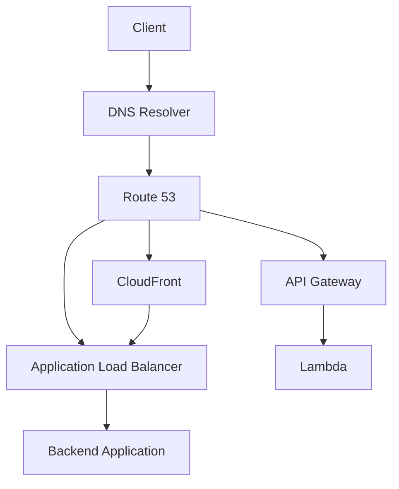
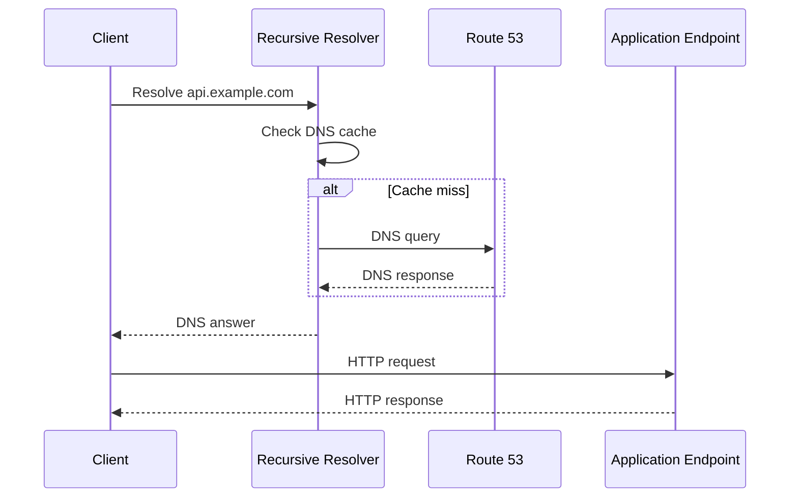

# README

## Overview

This folder contains production-oriented notes for **Amazon Route 53**, with emphasis on DNS fundamentals, hosted zones, record types, routing policies, health checks, AWS service integration, and production architecture.

The material progresses from DNS foundations to senior-level routing and architecture decisions.

Route 53 should be understood as more than a domain-management service. In a production backend architecture, DNS influences:

- Application reachability
- Traffic distribution
- Multi-Region architecture
- Failover behavior
- Service discovery
- AWS service integration
- Disaster recovery
- Performance
- Security
- Operational workflows

The central architectural principle is:

```text
Route 53
    ↓
DNS-level routing and naming

ALB / API Gateway
    ↓
HTTP/API-level routing

CloudFront
    ↓
Edge delivery and caching

Kubernetes / Cloud Map
    ↓
Service discovery
```

Route 53 should be used for decisions that belong at the DNS layer rather than being treated as a replacement for HTTP load balancers, API gateways, service meshes, or application-level traffic management.

---

## Folder Structure

```text
01- Route 53/
│
├── README.md
│
├── 01- Introduction to Route 53.md
├── 02- DNS Fundamentals.md
├── 03- Hosted Zones.md
├── 04- DNS Record Types.md
├── 05- Alias Records.md
├── 06- Simple and Weighted Routing.md
├── 07- Latency-Based Routing.md
├── 08- Failover Routing.md
├── 09- Geolocation and Geoproximity Routing.md
├── 10- Multivalue Answer Routing.md
├── 11- Traffic Flow.md
├── 12- Health Checks.md
├── 13- Domain Registration.md
├── 14- Route 53 Resolver.md
├── 15- TTL and DNS Caching.md
├── 16- Route 53 with S3.md
├── 17- Route 53 with CloudFront.md
├── 18- Route 53 with ELB and ALB.md
├── 19- Route 53 with API Gateway and Lambda.md
└── 20- Advantages and Limitations.md
```

---

## Quick Navigation

### Foundations

| File | Topic | Focus |
|---|---|---|
| [01- Introduction to Route 53](01-%20Introduction%20to%20Route%2053.md) | Route 53 Overview | Service capabilities, architecture, and AWS integration |
| [02- DNS Fundamentals](02-%20DNS%20Fundamentals.md) | DNS | DNS hierarchy, resolution, recursive resolvers, authoritative servers, and request flow |
| [03- Hosted Zones](03-%20Hosted%20Zones.md) | Hosted Zones | Public and private hosted zones, delegation, and zone architecture |
| [04- DNS Record Types](04-%20DNS%20Record%20Types.md) | DNS Records | A, AAAA, CNAME, MX, TXT, NS, SOA, and other record types |
| [05- Alias Records](05-%20Alias%20Records.md) | Alias Records | AWS-native DNS targets and zone-apex routing |

### Routing

| File | Topic | Focus |
|---|---|---|
| [06- Simple and Weighted Routing](06-%20Simple%20and%20Weighted%20Routing.md) | Simple and Weighted Routing | Basic routing and controlled DNS traffic distribution |
| [07- Latency-Based Routing](07-%20Latency-Based%20Routing.md) | Latency Routing | Multi-Region routing based on latency |
| [08- Failover Routing](08-%20Failover%20Routing.md) | Failover Routing | Primary/secondary DNS failover |
| [09- Geolocation and Geoproximity Routing](09-%20Geolocation%20and%20Geoproximity%20Routing.md) | Geographic Routing | Geographic traffic steering |
| [10- Multivalue Answer Routing](10-%20Multivalue%20Answer%20Routing.md) | Multivalue Routing | Returning multiple healthy DNS answers |
| [11- Traffic Flow](11-%20Traffic%20Flow.md) | Traffic Flow | Advanced Route 53 traffic-management concepts |

### Reliability and DNS Operations

| File | Topic | Focus |
|---|---|---|
| [12- Health Checks](12-%20Health%20Checks.md) | Health Checks | Endpoint monitoring and health-aware routing |
| [13- Domain Registration](13-%20Domain%20Registration.md) | Domain Registration | Domain registration, delegation, and DNS hosting |
| [14- Route 53 Resolver](14-%20Route%2053%20Resolver.md) | Route 53 Resolver | DNS resolution inside VPCs and hybrid environments |
| [15- TTL and DNS Caching](15-%20TTL%20and%20DNS%20Caching.md) | TTL and Caching | DNS caching, propagation behavior, and operational trade-offs |

### AWS Service Integration

| File | Topic | Focus |
|---|---|---|
| [16- Route 53 with S3](16-%20Route%2053%20with%20S3.md) | S3 Integration | Custom domains and DNS routing to S3 |
| [17- Route 53 with CloudFront](17-%20Route%2053%20with%20CloudFront.md) | CloudFront Integration | DNS, edge delivery, caching, and custom domains |
| [18- Route 53 with ELB and ALB](18-%20Route%2053%20with%20ELB%20and%20ALB.md) | Load Balancer Integration | DNS-to-load-balancer architecture |
| [19- Route 53 with API Gateway and Lambda](19-%20Route%2053%20with%20API%20Gateway%20and%20Lambda.md) | Serverless Integration | Custom domains and DNS for API Gateway/Lambda architectures |

### Architecture and Decision-Making

| File | Topic | Focus |
|---|---|---|
| [20- Advantages and Limitations](20-%20Advantages%20and%20Limitations.md) | Trade-Offs | Production strengths, limitations, and architectural boundaries |

---

## Recommended Reading Order

The files are intentionally numbered so that the folder can be studied sequentially.

```text
DNS Fundamentals
       │
       ▼
Hosted Zones
       │
       ▼
DNS Record Types
       │
       ▼
Alias Records
       │
       ▼
Routing Policies
       │
       ├── Simple / Weighted
       ├── Latency
       ├── Failover
       ├── Geolocation / Geoproximity
       └── Multivalue
       │
       ▼
Traffic Flow
       │
       ▼
Health Checks
       │
       ▼
Resolver
       │
       ▼
TTL and DNS Caching
       │
       ▼
AWS Service Integration
       │
       ├── S3
       ├── CloudFront
       ├── ALB / ELB
       └── API Gateway / Lambda
       │
       ▼
Production Trade-Offs
```

---

## Route 53 Mental Model

The most useful mental model is to separate **DNS resolution**, **DNS routing**, and **application routing**.



Route 53 makes the DNS-level decision.

The selected AWS service then performs the next layer of routing.

---

## Route 53 Routing Policies

Route 53 provides several routing policies for different architectural requirements.

| Policy | Primary use |
|---|---|
| Simple | Basic DNS resolution |
| Weighted | Controlled traffic distribution |
| Latency-based | Route users toward lower-latency Regions |
| Failover | Primary/secondary DNS failover |
| Geolocation | Route based on geographic location |
| Geoproximity | Route based on geographic proximity and bias |
| Multivalue answer | Return multiple healthy records |
| IP-based | Route based on client IP ranges |

The important distinction is that these are **DNS routing policies**.

They should not be confused with request-level load balancing.

---

## DNS Request Lifecycle

A simplified request flow is:



The important operational consequence is that Route 53 normally participates in the **DNS resolution stage**, not every subsequent HTTP request.

---

## Core Architecture Boundaries

A production backend should assign routing responsibilities to the correct layer.

| Requirement | Appropriate layer |
|---|---|
| Resolve `api.example.com` | Route 53 |
| Route users between AWS Regions | Route 53 |
| DNS failover | Route 53 |
| Resolve internal VPC names | Route 53 Private Hosted Zones / Resolver |
| HTTP path routing | ALB / API Gateway |
| HTTP host routing | ALB / API Gateway |
| Per-request load balancing | ALB / NLB |
| Edge caching | CloudFront |
| WAF filtering | AWS WAF |
| Internal Kubernetes service discovery | Kubernetes DNS |
| AWS service discovery | Cloud Map |
| Application-level routing | Application/service layer |

A senior engineer should avoid solving an HTTP or application-level problem at the DNS layer.

---

## Public vs Private DNS

Route 53 supports both public and private DNS architectures.

### Public DNS

Used for internet-facing names:

```text
api.example.com
www.example.com
example.com
```

Typical flow:

```text
Internet Client
      ↓
Public DNS
      ↓
Route 53 Public Hosted Zone
      ↓
AWS Endpoint
```

### Private DNS

Used for internal names:

```text
orders.internal.example.com
payments.internal.example.com
```

Typical flow:

```text
VPC
 │
 ▼
Route 53 Private Hosted Zone
 │
 ▼
Internal Service
```

Private DNS is useful for microservices, internal load balancers, databases, and hybrid architectures.

---

## AWS Service Integration

Route 53 is commonly used as the DNS entry point for AWS services.

### Route 53 + CloudFront

```text
Client
  │
  ▼
Route 53
  │
  ▼
CloudFront
  │
  ├── S3
  └── ALB
```

Typical use cases:

- Global web applications
- Static assets
- API edge delivery
- Caching
- TLS termination
- WAF integration

### Route 53 + ALB

```text
api.example.com
       │
       ▼
Route 53
       │
       ▼
ALB
       │
       ▼
ECS / EC2 / Kubernetes
```

This is a common architecture for Django, FastAPI, and other HTTP backend services.

### Route 53 + API Gateway + Lambda

```text
api.example.com
       │
       ▼
Route 53
       │
       ▼
API Gateway
       │
       ▼
Lambda
```

This is common in serverless APIs.

### Route 53 + S3

```text
www.example.com
       │
       ▼
Route 53
       │
       ▼
S3
```

This is commonly used for static website architectures where the DNS configuration and S3 endpoint architecture are designed together.

---

## TTL and DNS Caching

TTL controls how long DNS responses may be cached.

For example:

```text
api.example.com
TTL = 300 seconds
```

Conceptually:

```text
Route 53
   │
   ▼
Recursive Resolver
   │
   ├── Cache for TTL
   │
   ▼
Clients
```

TTL creates a fundamental trade-off:

| Lower TTL | Higher TTL |
|---|---|
| Faster DNS changes | Slower DNS changes |
| More DNS queries | More caching |
| Potentially higher query cost | Lower query volume |
| Useful for dynamic routing | Useful for stable records |

A lower TTL does not guarantee instantaneous global DNS changes.

---

## Route 53 and High Availability

Route 53 can contribute to high availability through:

- Health checks
- Failover routing
- Multi-Region routing
- Latency-based routing
- Multiple DNS answers
- Private DNS architectures

Example:

```text
                  Route 53
                     │
              Health-aware routing
                     │
             ┌───────┴───────┐
             ▼               ▼
        Region A          Region B
         Primary          Secondary
             │               │
             ▼               ▼
            ALB             ALB
```

However, DNS failover alone is not a complete disaster-recovery strategy.

The secondary environment must also have:

- Application capacity
- Database availability
- Data replication
- Secrets
- Configuration
- Deployment capability
- Monitoring
- Operational readiness

---

## Route 53 and Backend Engineering

Route 53 becomes particularly relevant when designing backend systems with:

### Django and FastAPI

```text
api.example.com
       ↓
Route 53
       ↓
ALB
       ↓
Django / FastAPI
       ↓
PostgreSQL
       +
Redis
```

### Microservices

```text
Route 53
    ↓
API Gateway / ALB
    ↓
Microservices
    ├── Users
    ├── Orders
    ├── Payments
    └── Inventory
```

Internal services may use private DNS or dedicated service discovery.

### Multi-Region Backends

```text
                  Route 53
                      │
          ┌───────────┴───────────┐
          ▼                       ▼
     AWS Region A            AWS Region B
          │                       │
         ALB                     ALB
          │                       │
      Application             Application
          │                       │
       Database                Database
```

The DNS architecture must be designed together with the data architecture.

---

## Production Best Practices

### Infrastructure as Code

Manage Route 53 configuration using:

- Terraform
- AWS CloudFormation
- AWS CDK

Prefer:

```text
Git
 ↓
Pull Request
 ↓
CI/CD
 ↓
Infrastructure as Code
 ↓
Route 53
```

over uncontrolled manual production changes.

### Least-Privilege Access

DNS changes can make an application unreachable.

Restrict permissions for:

- Hosted zone modification
- Record changes
- Health-check management
- Resolver configuration

Use separate permissions for read and write operations where practical.

### DNS Change Management

For production changes:

1. Review the intended DNS behavior.
2. Check TTL implications.
3. Validate record names and targets.
4. Review routing policies.
5. Apply through infrastructure as code.
6. Verify DNS resolution.
7. Verify the application endpoint.
8. Monitor the rollout.

### Test Failover

Do not assume failover works because the configuration exists.

Test:

- Health-check behavior
- Primary failure
- Secondary availability
- DNS responses
- TTL behavior
- Application readiness
- Failback

---

## Common Mistakes

### Treating Route 53 as a Load Balancer

Route 53 is DNS-based.

Use ALB/NLB for request-level load balancing.

### Assuming Weighted Routing Is Exact

A `90/10` configuration does not guarantee exactly 90% and 10% of HTTP requests.

DNS caching affects observed distribution.

### Ignoring TTL

DNS changes may remain cached after a configuration change.

TTL must be part of the operational design.

### Using DNS for Path Routing

Route 53 cannot perform:

```text
/api/users → Users Service
/api/orders → Orders Service
```

Use ALB or API Gateway.

### Treating Health Checks as Application Monitoring

An endpoint returning `200 OK` does not necessarily mean the application is healthy.

Health checks should be combined with application-level observability.

### Manually Editing Production DNS

Manual changes create configuration drift.

Prefer version-controlled infrastructure.

### Overcomplicating Routing

Do not combine routing policies simply because they are available.

Choose the simplest policy that satisfies the requirement.

---

## Cost Considerations

Route 53 cost can come from several areas:

- Hosted zones
- DNS queries
- Health checks
- Domain registration
- Resolver endpoints
- Resolver query logging
- DNS security features
- Traffic-management features

For ordinary backend applications, DNS cost is usually small relative to compute and data infrastructure.

At very high DNS query volumes, however, DNS architecture can become a meaningful operational and cost consideration.

---

## Reliability Considerations

Route 53 should be evaluated as part of the complete availability architecture.

```text
                    Availability
                         │
        ┌────────────────┼────────────────┐
        ▼                ▼                ▼
       DNS            Compute            Data
        │                │                │
    Route 53        ALB/ECS/EKS       Database
        │                │                │
        └────────────────┼────────────────┘
                         ▼
                  Application Health
```

A DNS-level failover strategy is ineffective if the secondary backend cannot serve production traffic.

---

## Disaster Recovery Considerations

For multi-Region DR, define:

| Concern | Question |
|---|---|
| DNS | How does Route 53 redirect traffic? |
| TTL | How quickly can DNS changes take effect? |
| Health checks | What constitutes a failed Region? |
| Compute | Is secondary capacity available? |
| Database | How is data replicated? |
| Secrets | Are credentials/configuration available? |
| Deployment | Can the secondary Region receive the current release? |
| Observability | Can engineers monitor the secondary Region? |
| RTO | How quickly must traffic recover? |
| RPO | How much data loss is acceptable? |
| Failback | How is traffic safely returned? |

Route 53 solves only part of this problem.

---

## Interview Reference

### Route 53 vs ALB

```text
Route 53
    ↓
DNS routing

ALB
    ↓
HTTP load balancing
```

### Route 53 vs API Gateway

```text
Route 53
    ↓
DNS

API Gateway
    ↓
API management and HTTP routing
```

### Route 53 vs CloudFront

```text
Route 53
    ↓
DNS

CloudFront
    ↓
Global HTTP edge delivery
```

### Route 53 vs Kubernetes DNS

```text
Route 53
    ↓
Public / AWS DNS

Kubernetes DNS
    ↓
Cluster service discovery
```

---

## Senior Engineering Decision Checklist

Before introducing Route 53 routing, answer:

- Is the routing decision actually a DNS decision?
- Is the application public or private?
- Is the application single-Region or multi-Region?
- What happens when the primary endpoint fails?
- What is the DNS TTL?
- How quickly must failover occur?
- Is traffic distribution approximate or must it be precise?
- Does the application require HTTP path-based routing?
- Is CloudFront required?
- Is an ALB or API Gateway required?
- Are health checks testing meaningful application health?
- Is the secondary Region actually ready?
- How is application state replicated?
- Are DNS changes managed through infrastructure as code?
- Who is authorized to change production DNS?
- How will DNS behavior be monitored?
- How will failover be tested?

---

## Key Takeaways

- Route 53 is fundamentally a **managed DNS platform**, not an HTTP load balancer.
- Route 53 can provide:
  - Public DNS
  - Private DNS
  - DNS routing
  - Health checks
  - Domain registration
  - Route 53 Resolver
  - AWS service integration
- The major routing policies include:
  - Simple
  - Weighted
  - Latency-based
  - Failover
  - Geolocation
  - Geoproximity
  - Multivalue answer
  - IP-based
- Alias records provide important AWS-native integration and support zone-apex routing for supported resources.
- DNS caching and TTL are fundamental to understanding Route 53 behavior.
- DNS routing is not equivalent to request-level load balancing.
- Weighted routing does not guarantee exact request percentages.
- Route 53 cannot perform HTTP path-based routing.
- Route 53 should commonly be combined with:
  - CloudFront
  - ALB/NLB
  - API Gateway
  - Lambda
  - ECS
  - EKS
  - S3
- Private hosted zones and Route 53 Resolver are important for internal and hybrid architectures.
- DNS failover can improve availability but does not constitute a complete disaster-recovery strategy.
- Multi-Region DNS requires corresponding multi-Region application and data architecture.
- Production DNS should be managed through infrastructure as code and protected with least-privilege IAM.
- DNS changes should be reviewed, monitored, and tested like other production infrastructure changes.
- The key architectural rule is:

```text
DNS problem
    → Route 53

HTTP routing problem
    → ALB / API Gateway

Edge delivery problem
    → CloudFront

Service discovery problem
    → Kubernetes DNS / Cloud Map

Application routing problem
    → Application / service layer
```

- The most important senior-level consideration is not whether Route 53 can perform a routing function, but whether **DNS is the correct layer at which that routing decision should be made**.