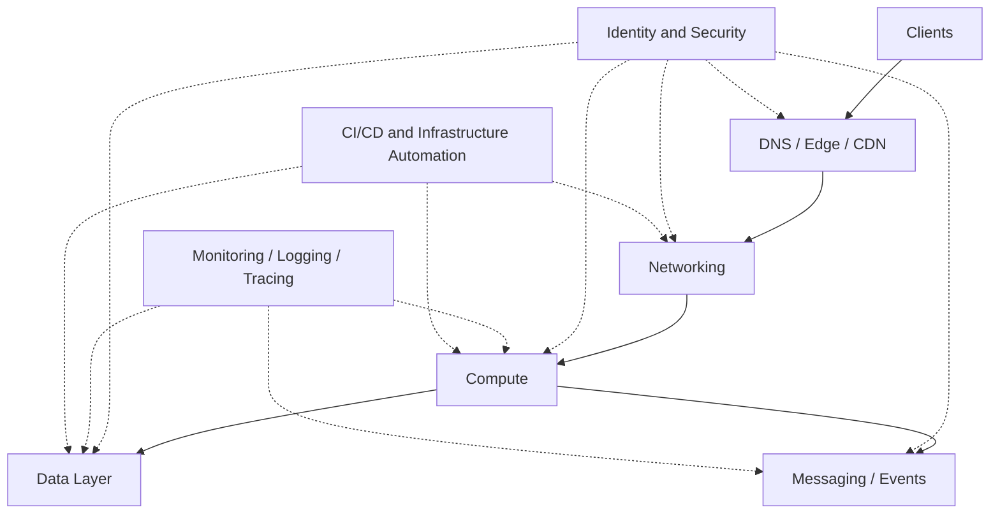
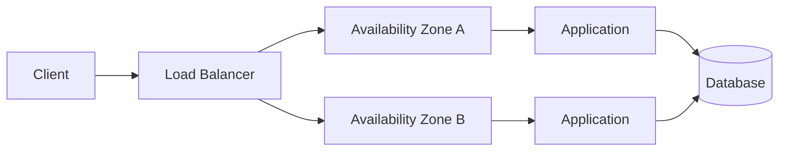
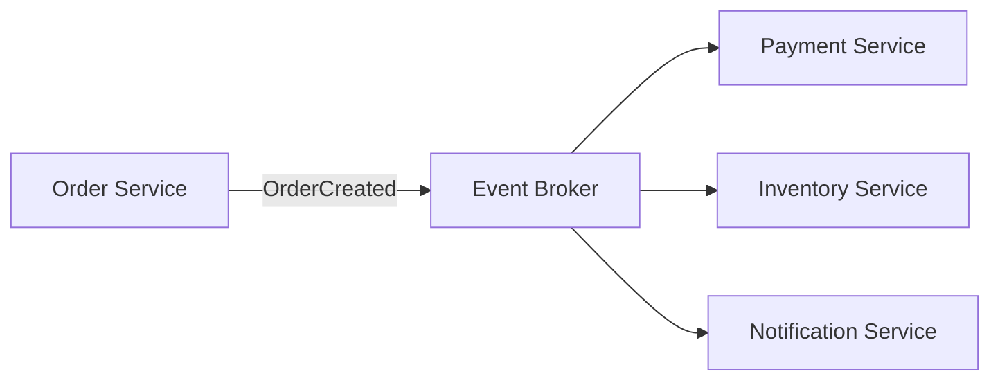
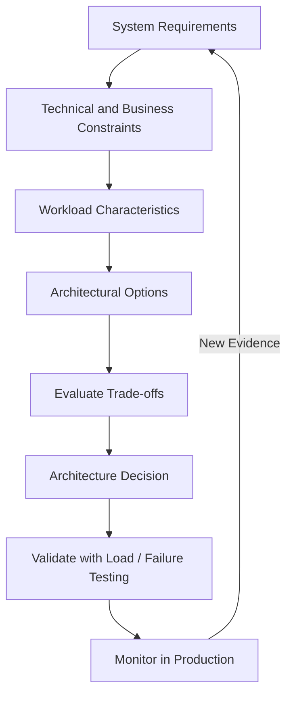

AWS Architecture/
    concepts/
        01- Introduction.md
        02- The AWS Well-Architected Framework.md
        03- Architecture Resilience Patterns.md
        04- Architecture Scalability Patterns.md
        05- Architecture Decoupling Patterns.md
        06- Distributed Transactions.md
        07- Data Architecture Patterns.md
        08- High Availability.md
        09- Disaster Recovery Strategies.md
        10- Microservices Architecture on AWS.md
        11- Serverless Architecture Patterns and Trade-offs.md
        README.md

    architecture/
        01- Microservices Architecture on AWS.md
        02- Serverless Architecture Patterns and Trade-offs.md
        03- Real-World Reference Architectures.md
        README.md

    security/
        01- Security Considerations in AWS Architecture.md
        README.md

    operations/
        01- Resilience Patterns - Retries, Backoff and Jitter.md
        02- Resilience Patterns - Circuit Breaker and Bulkhead.md
        03- Dead Letter Queues and Failure Isolation.md
        04- Scalability - Horizontal Scaling and Auto Scaling.md
        05- Scalability - Caching Strategies.md
        06- Scalability - Database Scaling.md
        07- High Availability - Multi-AZ vs Multi-Region.md
        08- Disaster Recovery Strategies.md
        README.md

    interview/
        01- Common Architecture Interview Questions.md
        02- Scenario Based Architecture Questions.md
        03- Senior Level Architecture Questions.md
        04- Architecture Trade-off Questions.md
        05- Common Architecture Anti-Patterns.md
        README.md

    architecture-decisions/
        01- Architecture Decision Records.md
        README.md

    README.md
```
```

```
```
AWS-Architecture/
    concepts/
        01- Introduction.md
        02- The AWS Well-Architected Framework.md
        03- Resilience Patterns - Retries, Backoff and Jitter.md
        04- Resilience Patterns - Circuit Breaker and Bulkhead.md
        05- Resilience Patterns - Dead Letter Queues and Failure Isolation.md
        06- Scalability Patterns - Horizontal Scaling and Auto Scaling.md
        07- Scalability Patterns - Caching Strategies.md
        08- Scalability Patterns - Database Scaling.md
        09- Decoupling Patterns - Event-Driven Architecture and Queue-Based Load Leveling.md
        10- Decoupling Patterns - Pub-Sub and Fan-Out.md
        11- Distributed Transactions - The Saga Pattern.md
        12- Data Architecture Patterns - CQRS and Event Sourcing.md
        13- High Availability - Multi-AZ vs Multi-Region.md
        14- Disaster Recovery Strategies.md
        15- Microservices Architecture on AWS.md
        16- Serverless Architecture Patterns and Trade-offs.md
        README.md

    architecture/
        01- Microservices Architecture on AWS.md
        02- Serverless Architecture Patterns and Trade-offs.md
        03- Real-World Reference Architectures.md
        README.md

    operations/
        01- Resilience Patterns.md
        02- Scalability Patterns.md
        03- High Availability and Disaster Recovery.md
        04- Failure Isolation and Recovery.md
        README.md

    interview/
        01- Common Architecture Interview Questions.md
        README.md

    architecture-decisions/
        01- Architecture Decision Records.md
        README.md

    anti-patterns/
        01- Common Architecture Anti-Patterns.md
        README.md

    README.md
```
```

```
Markdown


```
# 01- Introduction

## Overview

AWS Architecture is the discipline of designing cloud-based systems that remain reliable, secure, scalable, observable, and economically sustainable as workload requirements change.

For backend engineers, AWS architecture is not primarily about memorizing individual AWS services. The important skill is understanding how infrastructure components interact and how architectural decisions affect application behavior.

A production backend may involve:

- Compute services running application workloads
- Load balancing and traffic distribution
- Databases and persistent storage
- Caching layers
- Message queues and event streams
- Networking and service discovery
- Identity and access control
- Monitoring and centralized logging
- Deployment and infrastructure automation
- Backup and disaster recovery mechanisms

A typical request might therefore travel through several layers:

```text
Client
  |
  v
DNS
  |
  v
Load Balancer
  |
  v
Application Service
  |
  +--------------------+
  |                    |
  v                    v
Cache                Database
  |
  v
Message Broker
  |
  v
Asynchronous Workers
```

The architectural goal is not to maximize the number of AWS services used. It is to create the simplest architecture that satisfies the system's functional and non-functional requirements.

---

## Why AWS Architecture Matters

A backend application can work perfectly on a developer laptop and still fail in production because the architecture does not account for:

- traffic spikes
- infrastructure failures
- database bottlenecks
- network failures
- dependency failures
- security boundaries
- deployment failures
- regional outages
- operational visibility
- increasing infrastructure costs

AWS provides building blocks for solving these problems, but AWS does not automatically produce a good architecture.

The engineer is responsible for deciding:

- where workloads should run
- how traffic should flow
- where state should be stored
- how services communicate
- how failures are isolated
- how workloads scale
- how access is controlled
- how infrastructure is monitored
- how deployments are performed
- how the system recovers from failures

This distinction is important:

> AWS provides infrastructure primitives; architecture determines how those primitives are composed.

---

## AWS Architecture as a System Design Problem

AWS architecture should be approached as an extension of backend system design.

Before selecting services, identify the system requirements.

### Functional Requirements

Functional requirements describe what the system must do.

Examples:

- expose REST APIs
- process uploaded files
- send notifications
- persist transactional data
- execute background jobs
- stream events
- generate reports

### Non-Functional Requirements

Non-functional requirements describe how the system must behave.

Examples:

| Requirement | Architectural Question |
|---|---|
| Scalability | How does capacity increase as traffic grows? |
| Availability | What happens when an instance or Availability Zone fails? |
| Reliability | How does the system recover from failures? |
| Security | Who can access which resources? |
| Performance | What is the acceptable latency? |
| Durability | How is persistent data protected? |
| Observability | How are failures detected and diagnosed? |
| Cost | What resources are actually required? |
| Disaster Recovery | How quickly can the system recover from a major failure? |

A senior engineer should avoid choosing architecture based solely on familiarity with a service.

The correct question is:

> What system property are we trying to achieve, and which architectural mechanism provides it with acceptable complexity and cost?

---

## AWS Architecture Layers

A useful way to reason about AWS systems is to divide them into architectural layers.



These layers should not be treated as completely independent.

A networking decision can affect security.

A database decision can affect scalability.

A messaging decision can affect reliability.

A deployment strategy can affect availability.

AWS architecture is therefore a system of interacting constraints rather than a collection of isolated services.

---

## Core AWS Architectural Building Blocks

### Compute

Compute executes application workloads.

Common choices include:

- Amazon EC2
- Amazon ECS
- Amazon EKS
- AWS Lambda

The choice depends on the workload's operational and execution requirements.

For example:

- EC2 provides maximum infrastructure control.
- ECS provides managed container orchestration without requiring Kubernetes administration.
- EKS provides Kubernetes-based orchestration.
- Lambda provides event-driven serverless execution.

The architectural question is not:

> Which compute service is best?

It is:

> What level of infrastructure control and operational responsibility does this workload require?

---

### Networking

Networking determines how components communicate.

Important concepts include:

- VPC
- Subnets
- Route tables
- Internet gateways
- NAT gateways
- Security groups
- Network ACLs
- Load balancers
- Private connectivity
- DNS

A typical production architecture separates public-facing resources from internal services.

```text
                         Internet
                            |
                            v
                    +---------------+
                    | Load Balancer  |
                    +---------------+
                            |
                  ---------------------
                  |                   |
                  v                   v
           Private Subnet       Private Subnet
                  |                   |
             App Instance        App Instance
                  |                   |
                  +---------+---------+
                            |
                            v
                       Database
```

The application instances and database do not generally need to be directly reachable from the public internet.

Network topology is therefore also a security boundary.

---

### Storage

AWS storage can be categorized according to access pattern.

| Storage Type | Typical Use |
|---|---|
| Object storage | Files, media, backups, static assets |
| Block storage | Instance-attached persistent disks |
| File storage | Shared filesystem access |
| Database storage | Structured application state |
| Cache | Frequently accessed temporary data |

The correct storage mechanism depends on:

- access pattern
- durability requirements
- latency requirements
- consistency requirements
- data size
- concurrency
- cost

For example, application-generated files are often better suited to object storage than storing binary content directly inside a relational database.

---

### Databases

Database architecture is one of the most important parts of backend system design.

AWS provides multiple database models and managed database services.

A backend may use:

- relational databases for transactional workloads
- NoSQL databases for specific access patterns
- caches for low-latency reads
- search systems for text and analytical retrieval

A common architecture is:

```text
                    Application
                        |
             +----------+----------+
             |                     |
             v                     v
           Redis                PostgreSQL
             |
             v
      Frequently accessed data
```

Caching should not be treated as a replacement for the system of record.

The database remains authoritative unless the application is explicitly designed otherwise.

---

## Availability Zones and Regions

AWS infrastructure is organized hierarchically.

```text
AWS Region
|
+-- Availability Zone A
|     |
|     +-- Compute
|     +-- Storage
|
+-- Availability Zone B
|     |
|     +-- Compute
|     +-- Storage
|
+-- Availability Zone C
      |
      +-- Compute
      +-- Storage
```

An Availability Zone represents an isolated infrastructure location within an AWS Region.

A Region contains multiple Availability Zones.

This provides architectural isolation against certain infrastructure failures.

### Multi-AZ Architecture

A production service can distribute workloads across multiple Availability Zones.



If one Availability Zone becomes unavailable, traffic can potentially continue through healthy resources in another Availability Zone.

Multi-AZ architecture is therefore primarily an availability and failure-isolation mechanism.

---

## Multi-Region Architecture

Multi-region architecture distributes workloads across multiple AWS Regions.

```text
                    Global Traffic
                          |
                +---------+---------+
                |                   |
                v                   v
             Region A            Region B
                |                   |
             Compute             Compute
                |                   |
             Database            Database
```

Multi-region designs can provide:

- geographic redundancy
- disaster recovery
- lower latency for geographically distributed users
- regional failure tolerance

However, multi-region architecture introduces substantial complexity.

Typical challenges include:

- data replication
- consistency
- conflict resolution
- traffic management
- deployment coordination
- operational complexity
- higher cost

Therefore:

> Multi-region is not automatically better than multi-AZ.

The architecture should use multiple Regions only when the availability, latency, regulatory, or disaster-recovery requirements justify the additional complexity.

---

## Scalability

Scalability describes the system's ability to handle increasing workload.

### Vertical Scaling

Increase the capacity of an existing resource.

```text
Small Instance
      |
      v
Larger Instance
```

Vertical scaling is simple but eventually reaches hardware or service limits.

### Horizontal Scaling

Increase the number of resources.

```text
              Load Balancer
             /      |      \
            v       v       v
         App 1    App 2    App 3
```

Horizontal scaling is often preferable for stateless backend services.

A Django or FastAPI API can commonly scale horizontally when:

- application state is externalized
- sessions are centralized or token-based
- uploaded files use shared/object storage
- background jobs use a shared queue
- database connections are controlled

---

## Stateless Backend Architecture

Stateless application servers make horizontal scaling easier.

Instead of storing session state inside an individual application process:

```text
Client
  |
  v
App Instance A
  |
  +-- Local Session
```

the state can be externalized:

```text
Client
  |
  v
Load Balancer
  |
  +--------+--------+
  |                 |
  v                 v
App A              App B
  |                 |
  +--------+--------+
           |
           v
       Redis / DB
```

This allows requests to reach different application instances without depending on local process state.

This architecture is particularly relevant for Django, FastAPI, and microservices deployed behind load balancers.

---

## Decoupling

Tightly coupled systems often fail because one component directly depends on another component being available.

For example:

```text
API
 |
 v
Payment Service
 |
 v
Email Service
 |
 v
Notification Service
```

If the notification service is unavailable and the API waits synchronously for it, the failure can propagate backward.

A queue can introduce isolation:

```text
API
 |
 v
Queue
 |
 v
Worker
 |
 v
Notification Service
```

The API can acknowledge the request after successfully placing the work into the queue.

The worker can process it independently.

This is a fundamental reliability pattern:

> Separate request acceptance from asynchronous processing when immediate synchronous completion is not required.

---

## Synchronous vs Asynchronous Communication

### Synchronous

```text
Service A
   |
   | HTTP / REST / gRPC
   v
Service B
   |
   v
Response
```

The caller waits for the downstream service.

Common technologies include:

- REST
- HTTP
- gRPC

Synchronous communication is appropriate when the caller requires an immediate response.

### Asynchronous

```text
Service A
   |
   v
Message Broker
   |
   v
Service B
```

The caller does not necessarily wait for processing to finish.

Common technologies include:

- queues
- event buses
- Kafka
- AWS messaging services

Asynchronous communication improves decoupling but introduces concerns such as:

- eventual consistency
- duplicate messages
- retries
- ordering
- idempotency
- dead-letter handling

---

## Reliability and Failure Isolation

Production systems must assume that failures will occur.

Failures can happen at multiple levels:

```text
Application
    |
    +-- Process failure
    |
    +-- Dependency failure
    |
    +-- Database failure
    |
    +-- Network failure
    |
    +-- Availability Zone failure
    |
    +-- Region failure
```

A resilient architecture prevents one failure from becoming a system-wide outage.

Important mechanisms include:

- retries
- exponential backoff
- jitter
- timeouts
- circuit breakers
- bulkheads
- health checks
- load balancing
- queues
- dead-letter queues
- graceful degradation
- redundant infrastructure

Retries should not be implemented blindly.

Retrying a failed request against an already overloaded dependency can make the incident worse.

A production retry policy should consider:

- maximum attempts
- backoff duration
- jitter
- timeout
- retryable status codes
- idempotency

---

## Security Architecture

Security should be designed into the architecture rather than added after deployment.

Important principles include:

### Least Privilege

Applications should receive only the permissions they require.

An API service that only needs to read objects from a specific storage location should not receive unrestricted access to every resource in the AWS account.

### Defense in Depth

Security should exist at multiple layers.

```text
Internet
   |
   v
Edge Protection
   |
   v
Load Balancer
   |
   v
Network Controls
   |
   v
Application Authentication
   |
   v
Authorization
   |
   v
Database Permissions
```

### Identity-Based Access

Prefer IAM roles and short-lived credentials where possible instead of embedding long-lived AWS access keys into applications.

For containerized workloads and serverless applications, workload identity mechanisms should be preferred over static credentials.

---

## Observability

A production architecture that cannot be observed is difficult to operate.

Observability typically includes:

- logs
- metrics
- traces
- health checks
- alerts
- dashboards

A request may travel through:

```text
Client
  |
  v
Load Balancer
  |
  v
API
  |
  +----> Redis
  |
  +----> PostgreSQL
  |
  +----> Queue
           |
           v
         Worker
```

Without correlation identifiers and centralized telemetry, determining where latency or failure originated becomes difficult.

Backend applications should ideally propagate request or correlation identifiers across service boundaries.

For distributed systems, tracing becomes especially valuable because a single user request can span multiple services.

---

## AWS Architecture and Backend Applications

A Python backend can fit into AWS architecture in several ways.

For example:

```text
                    Internet
                       |
                       v
                  Load Balancer
                       |
              +--------+--------+
              |                 |
              v                 v
         Django App         Django App
              |                 |
              +--------+--------+
                       |
          +------------+------------+
          |            |            |
          v            v            v
       Redis       PostgreSQL     Queue
                                    |
                                    v
                                  Celery
                                  Worker
```

This architecture maps naturally to common backend technologies:

| Backend Concern | Typical Technology |
|---|---|
| API | Django / FastAPI |
| Synchronous service communication | REST / gRPC |
| Reverse proxy | Nginx / Load Balancer |
| Cache | Redis |
| Relational data | PostgreSQL |
| Background processing | Celery |
| Event streaming | Kafka |
| Containers | Docker |
| Orchestration | ECS / Kubernetes |
| CI/CD | GitHub Actions |
| Cloud infrastructure | AWS |

The exact AWS services should be selected based on workload requirements rather than forcing every technology into the architecture.

---

## Managed Services vs Self-Managed Infrastructure

A major architectural decision is determining how much infrastructure should be operated directly.

Consider a PostgreSQL workload.

A team could:

- manage PostgreSQL on EC2
- use Amazon RDS for PostgreSQL
- use Amazon Aurora PostgreSQL-Compatible

The managed option generally reduces operational responsibility.

However, managed services can introduce:

- service-specific limitations
- pricing considerations
- configuration constraints
- vendor-specific operational models

The correct decision depends on the team's requirements and operational capabilities.

For most business applications, managed services are preferable when they eliminate significant undifferentiated operational work without violating workload requirements.

---

## Event-Driven Architecture

Event-driven systems allow components to communicate through events rather than direct synchronous calls.



The producer does not need to know every consumer.

This improves decoupling and allows new consumers to be introduced without modifying the producer.

However, event-driven systems introduce additional complexity:

- eventual consistency
- event versioning
- duplicate delivery
- ordering
- retries
- dead-letter handling
- observability
- schema compatibility

Event-driven architecture is therefore a trade-off, not a universal replacement for synchronous communication.

---

## Cost as an Architectural Constraint

Architecture affects cost at every layer.

Cost can be influenced by:

- compute utilization
- storage volume
- network traffic
- database capacity
- NAT gateways
- load balancers
- logging volume
- data transfer
- multi-region replication
- managed service usage

A technically elegant architecture can still be inappropriate if its operational cost is disproportionate to the workload.

Cost optimization should therefore happen during architecture design rather than only after the infrastructure bill becomes unexpectedly high.

---

## Architecture Decision Process

A practical architecture decision process can be represented as:



The process should explicitly evaluate:

- availability
- latency
- throughput
- scalability
- security
- consistency
- durability
- operational complexity
- cost
- disaster recovery

This is more reliable than choosing services based on popularity or familiarity.

---

## Common Architecture Mistakes

### Choosing Services Before Defining Requirements

Starting with:

> "Should we use ECS or EKS?"

is often premature.

First determine:

- workload characteristics
- scaling requirements
- operational requirements
- team expertise
- availability requirements
- deployment requirements

Then evaluate the services.

---

### Overengineering for Hypothetical Scale

Designing for millions of requests per second when the system currently handles a few hundred requests per second can create unnecessary:

- infrastructure complexity
- operational overhead
- development effort
- cost

Architecture should support realistic growth without prematurely introducing unnecessary distributed-system complexity.

---

### Treating Multi-Region as a Default Requirement

Multi-region architecture is expensive and operationally complex.

If the actual requirement is simply protection against an Availability Zone failure, multi-AZ architecture may be sufficient.

---

### Ignoring Failure Modes

A system diagram that only shows the happy path is incomplete.

For every important dependency, ask:

- What happens when it times out?
- What happens when it becomes unavailable?
- What happens when it returns partial failures?
- Can the request be retried safely?
- Can duplicate processing occur?
- What happens if the queue grows indefinitely?
- How is the failure detected?

Failure analysis is a core senior-level architecture skill.

---

### Using Retries Without Idempotency

A retry can execute an operation more than once.

For example:

```text
Client
  |
  | POST /payments
  v
Payment Service
  |
  X Timeout
  |
  Client retries
  |
  v
Payment Service
```

Without idempotency protection, the same payment could potentially be processed multiple times.

Critical operations should therefore use appropriate idempotency mechanisms.

---

### Treating Logs as the Only Observability Mechanism

Logs are useful, but logs alone are insufficient for distributed systems.

Production systems should combine:

- metrics for system behavior
- logs for detailed events
- traces for distributed request flow

---

## Production Architecture Checklist

Before deploying an AWS-backed backend system, evaluate:

### Reliability

- Are critical workloads distributed across multiple Availability Zones?
- Are dependencies protected by timeouts?
- Are retries bounded?
- Is retry behavior idempotent?
- Are failure domains understood?
- Is there a recovery strategy?

### Scalability

- Can application instances scale horizontally?
- Is application state externalized?
- Is the database capacity sufficient?
- Is caching appropriate?
- Can asynchronous workloads scale independently?

### Security

- Are IAM permissions least-privilege?
- Are secrets stored outside application source code?
- Are private resources kept private?
- Are network boundaries intentional?
- Is encryption enabled where appropriate?
- Is audit logging available?

### Operations

- Are logs centralized?
- Are metrics available?
- Are critical alerts configured?
- Can distributed requests be traced?
- Are dashboards available for important services?

### Deployment

- Is infrastructure reproducible?
- Is deployment automated?
- Is rollback possible?
- Are environment-specific configurations separated?
- Can a failed deployment be detected quickly?

### Disaster Recovery

- Are backups configured?
- Has restoration been tested?
- Are recovery objectives defined?
- Is cross-region recovery actually required?
- Has the recovery procedure been documented?

### Cost

- Are resources appropriately sized?
- Are unnecessary always-on resources avoided?
- Is logging volume controlled?
- Are high-cost networking components justified?
- Is multi-region infrastructure justified by requirements?

---

## Architecture Maturity

AWS architecture evolves as system requirements and operational experience increase.

### Intermediate Level

An engineer should understand:

- VPC fundamentals
- compute options
- load balancing
- databases
- object storage
- caching
- queues
- IAM
- monitoring
- basic high availability

### Advanced Level

An engineer should reason about:

- failure domains
- horizontal scalability
- asynchronous processing
- consistency
- idempotency
- distributed transactions
- service boundaries
- observability
- disaster recovery
- cost trade-offs

### Senior Level

A senior engineer should be able to explain not only how an architecture works, but why it was selected.

The discussion should include:

```text
Requirement
    |
    v
Constraint
    |
    v
Architectural Option
    |
    v
Trade-off
    |
    v
Decision
    |
    v
Failure Mode
    |
    v
Operational Strategy
```

The key difference is architectural reasoning.

Knowing that an AWS service exists is not the same as knowing when it should be used.

---

## Key Takeaways

- AWS architecture is the composition of cloud infrastructure around explicit availability, scalability, reliability, security, performance, and cost requirements.
- Backend architecture should separate concerns across compute, networking, storage, databases, messaging, security, observability, and deployment rather than treating AWS services as isolated components.
- Multi-AZ, horizontal scaling, asynchronous processing, retries, timeouts, caching, and failure isolation are fundamental mechanisms for building resilient production systems.
- Senior-level architecture decisions require explicit trade-off analysis across complexity, operational burden, performance, security, reliability, disaster recovery, and cost.
- The best AWS architecture is not the most sophisticated design; it is the simplest design that reliably satisfies the system's actual requirements.