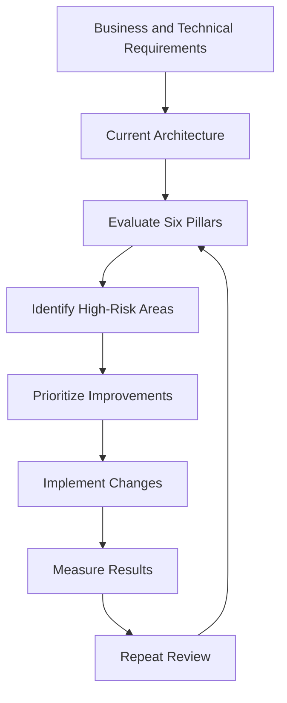
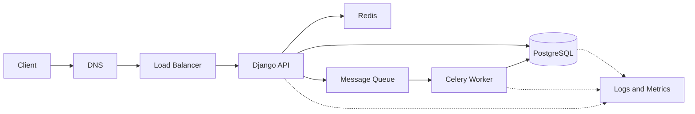

# 02- The AWS Well-Architected Framework

## Overview

The AWS Well-Architected Framework is a structured approach for evaluating and improving cloud architectures against a set of fundamental engineering principles.

It is not an AWS service-selection checklist. It is a way to reason about whether an architecture can satisfy its business and technical requirements while remaining reliable, secure, performant, operationally manageable, and cost-effective.

For backend engineers, the framework is particularly useful because most production failures are not caused by a single incorrect API call. They are caused by architectural decisions such as:

- placing critical workloads in a single failure domain
- creating excessive synchronous dependencies
- granting overly broad permissions
- failing to define recovery requirements
- scaling application servers while ignoring database capacity
- deploying without rollback mechanisms
- collecting insufficient telemetry
- optimizing cost without considering reliability
- introducing distributed-system complexity without a corresponding requirement

The framework provides a common vocabulary for discussing these trade-offs.

The six core pillars are:

| Pillar | Primary Question |
|---|---|
| Operational Excellence | Can we operate and continuously improve the system effectively? |
| Security | Can we protect workloads, data, identities, and infrastructure? |
| Reliability | Can the system recover from failures and continue operating correctly? |
| Performance Efficiency | Can the system use appropriate resources efficiently as requirements change? |
| Cost Optimization | Can we achieve the required business outcomes without unnecessary cost? |
| Sustainability | Can we minimize the environmental impact of the workload? |

These pillars are related rather than independent.

For example, introducing multi-region redundancy can improve reliability but increase cost and operational complexity. Increasing logging can improve operational visibility but increase cost. Stronger encryption can improve security but may introduce performance or operational considerations.

Good architecture therefore requires trade-off analysis rather than optimizing one pillar in isolation.

---

## What the Framework Is

The AWS Well-Architected Framework provides principles, questions, and review mechanisms that help engineers evaluate cloud workloads.

A useful mental model is:

```text
Business Requirements
        |
        v
Architecture
        |
        v
Well-Architected Review
        |
        +-----------------------------+
        |        |        |            |
        v        v        v            v
Security   Reliability  Performance  Cost
        |        |        |            |
        +--------+--------+------------+
                 |
                 v
        Identified Risks
                 |
                 v
        Engineering Improvements
```

The framework should be applied throughout the lifecycle of a system rather than only during initial design.

A production architecture changes continuously:

- traffic changes
- dependencies change
- AWS services evolve
- application requirements change
- security threats change
- infrastructure costs change
- operational incidents reveal weaknesses

A system that was well designed two years ago may no longer be well architected today.

---

## Why the Framework Matters

Without a structured review process, architecture discussions tend to become service-centric.

For example:

> "Should we use ECS or EKS?"

This is an incomplete architectural question.

A better analysis asks:

- What workload are we running?
- How frequently does it change?
- How much infrastructure control is required?
- What availability target exists?
- How does the workload scale?
- What operational expertise does the team have?
- What is the deployment model?
- What are the security requirements?
- What is the acceptable cost?

The framework encourages engineers to evaluate architecture against outcomes instead of individual services.

---

## The Six Pillars

## Operational Excellence

Operational Excellence focuses on the ability to operate, observe, deploy, and continuously improve workloads.

A production system is not successful simply because it can serve requests.

The engineering team must also be able to:

- deploy changes safely
- detect failures
- investigate incidents
- recover from failures
- automate repetitive operations
- measure system behavior
- learn from operational events
- improve the system over time

### Core Engineering Questions

Ask:

- Can we determine when the system is unhealthy?
- Can we identify the cause of an incident?
- Can we deploy without unnecessary downtime?
- Can we roll back a failed deployment?
- Are infrastructure changes reproducible?
- Are operational procedures documented and tested?
- Are incidents used to improve the architecture?

---

## Infrastructure as Code

Production infrastructure should be reproducible.

Instead of manually creating infrastructure through a console:

```text
Engineer
   |
   v
AWS Console
   |
   +--> Manual Resource
   +--> Manual Configuration
   +--> Manual Permission
```

prefer an automated model:

```text
Git Repository
      |
      v
Infrastructure Code
      |
      v
CI/CD
      |
      v
AWS Infrastructure
```

Tools may include:

- AWS CloudFormation
- AWS CDK
- Terraform

Infrastructure as code provides:

- version control
- reproducibility
- reviewability
- auditability
- automation
- easier disaster recovery

A backend engineer should treat infrastructure changes similarly to application changes: review them, test them where practical, and deploy them through controlled processes.

---

## Safe Deployment

Deployment is an operational concern, not merely a CI/CD concern.

A production deployment should answer:

- How is the new version introduced?
- How is health validated?
- What happens if the new version fails?
- How quickly can traffic be reverted?
- How are database migrations handled?

Common deployment strategies include:

| Strategy | Characteristics |
|---|---|
| Rolling | Replace instances progressively |
| Blue/Green | Maintain separate old and new environments |
| Canary | Send a small percentage of traffic to the new version |
| Immutable | Replace infrastructure instead of modifying it in place |

For a Django or FastAPI application, a deployment pipeline may look like:

```text
Developer
   |
   v
Git Push
   |
   v
CI
   |
   +--> Unit Tests
   +--> Integration Tests
   +--> Security Checks
   |
   v
Container Build
   |
   v
Container Registry
   |
   v
Deployment
   |
   v
Health Checks
   |
   v
Production Traffic
```

A deployment strategy should be selected based on the application's risk profile.

---

## Observability and Operations

Operational Excellence requires visibility into system behavior.

At minimum, production systems should consider:

- structured logs
- application metrics
- infrastructure metrics
- distributed traces
- health checks
- alerts
- dashboards

For a distributed backend:

```text
Request
  |
  v
API Gateway / Load Balancer
  |
  v
Django / FastAPI
  |
  +----> Redis
  |
  +----> PostgreSQL
  |
  +----> Queue
            |
            v
          Worker
```

The request should ideally carry a correlation identifier across these boundaries.

Without correlation, investigating a single failed request can require manually searching multiple systems.

---

## Security

Security focuses on protecting:

- identities
- applications
- infrastructure
- data
- networks
- secrets
- operational interfaces

Security should be designed into every architectural layer.

### Identity and Access Management

Use least privilege.

A service should receive only the permissions required to perform its job.

For example, an application that only needs to read objects from a specific storage location should not receive unrestricted permissions across the AWS account.

Prefer workload identities and IAM roles over embedding long-lived AWS credentials inside applications.

---

## Defense in Depth

A secure architecture should not rely on one control.

```text
Internet
   |
   v
Edge Controls
   |
   v
Load Balancer
   |
   v
Network Controls
   |
   v
Application Authentication
   |
   v
Authorization
   |
   v
Database Permissions
```

If one security layer fails, additional controls should still limit the impact.

Security boundaries can exist at:

- account level
- Region level
- VPC level
- subnet level
- security-group level
- IAM level
- application level
- database level

---

## Secrets Management

Secrets should not be committed to Git repositories.

Avoid:

```python
DATABASE_PASSWORD = "production-password"
```

Prefer a managed secret or parameter mechanism and inject the value through the deployment environment.

The application should not need to know how the secret is stored.

This also makes credential rotation easier.

---

## Encryption

Consider encryption for:

- data at rest
- data in transit
- backups
- object storage
- databases
- message payloads
- sensitive application data

Encryption is not a substitute for access control.

An encrypted database with overly broad IAM permissions is still poorly secured.

---

## Reliability

Reliability focuses on whether a workload performs its intended function correctly and can recover from failures.

Reliability requires understanding failure domains.

Potential failures include:

```text
Application Process
        |
        +--> Instance Failure
        |
        +--> Availability Zone Failure
        |
        +--> Database Failure
        |
        +--> Network Failure
        |
        +--> Dependency Failure
        |
        +--> Region Failure
```

A reliable architecture does not assume that infrastructure will remain healthy indefinitely.

---

## Failure Detection

The system needs mechanisms for identifying unhealthy components.

Examples include:

- load balancer health checks
- application health endpoints
- database monitoring
- queue-depth monitoring
- error-rate alerts
- latency alerts
- synthetic requests

A health endpoint should represent meaningful application health rather than simply returning HTTP 200.

For example, an API that cannot reach a critical database may technically be running but functionally unhealthy.

---

## Recovery

Reliability requires more than redundancy.

The system must know how to recover.

Useful mechanisms include:

- automated failover
- retries
- exponential backoff
- jitter
- timeouts
- circuit breakers
- dead-letter queues
- backups
- replication
- autoscaling
- graceful degradation

### Retry Example

A retry policy should be bounded.

```text
Request
  |
  v
Dependency
  |
  X Failure
  |
  v
Wait
  |
  v
Retry
  |
  X Failure
  |
  v
Exponential Backoff
  |
  v
Retry
  |
  v
Fail / Fallback
```

Never assume that every error should be retried.

Retrying validation errors or authorization failures is usually pointless.

Retrying an already overloaded dependency without backoff can amplify an outage.

---

## Idempotency

Reliability and idempotency are closely related.

Consider:

```text
POST /payments
```

The client sends the request, but the response is lost.

The client retries.

Without idempotency protection:

```text
Request 1 --> Payment Created
Request 2 --> Payment Created Again
```

An idempotency key can allow the server to recognize that both requests represent the same logical operation.

This is especially important for:

- payments
- order creation
- resource provisioning
- message processing
- webhook handling

---

## Disaster Recovery

Reliability planning should define recovery requirements explicitly.

Two important concepts are:

### Recovery Time Objective

RTO defines how quickly the system needs to be restored after a failure.

### Recovery Point Objective

RPO defines how much data loss is acceptable.

| Requirement | Architectural Impact |
|---|---|
| Low RTO | Faster failover and automation |
| Low RPO | More frequent replication/backups |
| High RTO | Simpler recovery mechanisms may be acceptable |
| High RPO | Less frequent backup/replication may be acceptable |

Do not design disaster recovery without knowing the business requirements.

---

## Performance Efficiency

Performance Efficiency focuses on using appropriate resources and architecture to satisfy workload requirements efficiently.

Performance should be evaluated across the entire request path.

```text
Client
  |
  v
DNS
  |
  v
Load Balancer
  |
  v
Application
  |
  +----> Redis
  |
  +----> PostgreSQL
  |
  +----> External API
```

If an API takes 800 ms, increasing application CPU may not help if 700 ms is spent waiting on a database query.

Performance optimization therefore begins with measurement.

---

## Measure Before Optimizing

Useful measurements include:

- request latency
- p50 latency
- p95 latency
- p99 latency
- throughput
- error rate
- CPU utilization
- memory utilization
- database latency
- cache hit ratio
- queue depth

Percentiles are particularly useful.

Average latency can hide tail latency problems.

For example:

```text
p50 = 80 ms
p95 = 250 ms
p99 = 2.5 s
```

An average might look acceptable while a significant tail of users experiences severe latency.

---

## Caching

Caching can improve performance by reducing expensive operations.

```text
Application
    |
    v
Redis
    |
    +-- Cache Hit --> Response
    |
    +-- Cache Miss
             |
             v
         PostgreSQL
             |
             v
           Redis
```

Caching introduces its own design problems:

- invalidation
- stale data
- memory limits
- eviction
- cache stampedes
- consistency

A cache should be introduced because measurement demonstrates that it provides meaningful value.

Adding Redis to every application does not automatically make the architecture faster.

---

## Database Performance

Database performance often becomes the limiting factor in backend systems.

Common causes include:

- missing indexes
- inefficient joins
- N+1 queries
- excessive connection creation
- large result sets
- poorly designed transactions
- insufficient database capacity

For Django applications, ORM convenience should not hide SQL behavior.

For example, an apparently simple ORM operation can produce many queries if related objects are accessed incorrectly.

Production performance analysis should therefore inspect actual database queries and execution plans.

---

## Cost Optimization

Cost Optimization focuses on achieving business outcomes without unnecessary expenditure.

Cost should be evaluated against architecture rather than only against individual resource prices.

Examples:

- overprovisioned EC2 instances
- unnecessary always-on environments
- excessive log retention
- unnecessary cross-region traffic
- inefficient storage classes
- oversized databases
- excessive NAT Gateway usage
- idle development infrastructure

A lower-cost architecture is not necessarily better if it creates unacceptable reliability or operational risk.

The correct objective is:

> Minimize unnecessary cost while preserving required business and technical outcomes.

---

## Cost and Architecture Trade-offs

Consider a backend that requires high availability.

A single instance might be inexpensive:

```text
Load Balancer
     |
     v
Single Application Instance
```

but creates a single point of failure.

A multi-AZ deployment costs more:

```text
             Load Balancer
              /         \
             v           v
        Instance A   Instance B
           AZ-A         AZ-B
```

The additional cost may be justified if downtime is significantly more expensive than the infrastructure difference.

Architecture should therefore evaluate:

```text
Cost
  +
Availability
  +
Operational Risk
  +
Business Impact
```

rather than minimizing infrastructure spend independently.

---

## Sustainability

Sustainability considers the environmental impact of running workloads.

For backend systems, practical considerations include:

- right-sizing compute
- avoiding idle infrastructure
- improving resource utilization
- selecting appropriate architectures
- reducing unnecessary data transfer
- controlling storage growth
- using efficient workloads
- shutting down non-production resources when not required

Efficient architecture can often improve both sustainability and cost.

For example, eliminating an idle compute cluster reduces:

- infrastructure cost
- resource consumption
- operational overhead

---

## Pillar Interactions

The pillars should be considered together.

| Decision | Positive Impact | Potential Trade-off |
|---|---|---|
| Multi-AZ deployment | Reliability | Higher infrastructure cost |
| Multi-region deployment | Disaster recovery | Complexity and cost |
| Extensive logging | Operational visibility | Storage and ingestion cost |
| Aggressive caching | Performance | Stale-data risk |
| Strong isolation | Security | Operational complexity |
| Serverless | Operational simplicity | Workload-specific constraints |
| Large instances | Performance headroom | Lower utilization and higher cost |
| Asynchronous processing | Decoupling | Eventual consistency |

A senior engineer should explicitly communicate these trade-offs.

---

## Well-Architected Review Process

A practical review can follow this process:



The review should focus on meaningful risks rather than attempting to make every component perfect.

---

## Architecture Review Questions

### Operational Excellence

- Can the team deploy safely?
- Are operational procedures automated?
- Can incidents be diagnosed quickly?
- Are infrastructure changes version-controlled?
- Are post-incident improvements tracked?

### Security

- Are permissions least-privilege?
- Are secrets managed securely?
- Are sensitive resources private?
- Is encryption appropriately configured?
- Are security events auditable?

### Reliability

- What are the major failure domains?
- What happens when a dependency fails?
- Are retries bounded?
- Are critical operations idempotent?
- Are backups restorable?
- Are recovery objectives defined?

### Performance Efficiency

- Where is the current bottleneck?
- Are latency percentiles monitored?
- Is the database properly indexed?
- Is caching justified?
- Can compute scale horizontally?

### Cost Optimization

- Which resources are idle?
- Are resources right-sized?
- Is data transfer unnecessarily expensive?
- Is storage retained longer than required?
- Are high-cost architectural decisions justified?

### Sustainability

- Is compute efficiently utilized?
- Are unnecessary resources running?
- Can workloads be made more efficient?
- Is storage growth controlled?
- Is the architecture unnecessarily complex?

---

## Applying the Framework to a Django API

Consider a production Django REST API.



The framework can be applied to this architecture directly.

### Operational Excellence

- CI/CD deploys the application.
- Infrastructure is managed as code.
- Health checks validate application availability.
- Logs and metrics are centralized.
- Rollbacks are automated or well-defined.

### Security

- Application workloads use IAM roles.
- Database credentials are stored securely.
- PostgreSQL is not publicly exposed.
- Network boundaries restrict access.
- Application authorization is enforced independently of network security.

### Reliability

- API instances run across multiple Availability Zones.
- Database backups are configured.
- Queue failures use retries and dead-letter handling.
- Celery tasks are idempotent where required.
- Critical dependencies use timeouts.

### Performance Efficiency

- Redis caches expensive reads.
- PostgreSQL queries are indexed and monitored.
- API instances scale horizontally.
- Background processing is moved out of synchronous request paths.

### Cost Optimization

- Application capacity is right-sized.
- Non-production infrastructure is controlled.
- Log retention is appropriate.
- Database and cache capacity match actual workloads.

### Sustainability

- Idle resources are removed.
- Compute utilization is monitored.
- Storage growth is controlled.
- Unnecessary processing is avoided.

This demonstrates an important property of the framework: the same architecture can be evaluated from multiple perspectives without redesigning the system around each pillar independently.

---

## Well-Architected Framework vs Architecture Design

The framework should not replace system design.

System design answers questions such as:

- What should the system do?
- What services are required?
- How should data flow?
- What are the service boundaries?
- What consistency model is required?

The Well-Architected Framework adds another layer:

- Is the design secure?
- Is it reliable?
- Can it be operated?
- Is it performant?
- Is it cost-effective?
- Is resource utilization responsible?

A useful relationship is:

```text
System Requirements
       |
       v
System Design
       |
       v
AWS Architecture
       |
       v
Well-Architected Review
       |
       v
Production Readiness
```

---

## Common Mistakes

### Treating the Framework as a Checklist

Checking boxes without understanding the underlying risk is not meaningful architecture review.

The purpose is to identify architectural weaknesses and make informed decisions.

---

### Optimizing Every Pillar Independently

A design can become worse if each pillar is optimized independently.

For example:

- maximum redundancy increases cost
- maximum security controls can increase complexity
- maximum performance can increase infrastructure cost
- maximum observability can increase logging cost

Architecture requires balancing the pillars.

---

### Assuming Managed Services Solve Architecture Problems

A managed service reduces operational responsibility but does not eliminate architectural responsibility.

Using a managed database does not automatically solve:

- bad schema design
- inefficient queries
- poor indexes
- connection exhaustion
- incorrect backup requirements
- inappropriate scaling configuration

---

### Ignoring Operational Complexity

An architecture can be technically valid but operationally difficult.

For example, introducing:

```text
Microservices
+
Kafka
+
Multiple Databases
+
Multi-Region
+
Kubernetes
```

may be justified for a large distributed system.

For a small backend application, the same architecture may create unnecessary operational burden.

Complexity itself is an architectural cost.

---

### Designing Only for the Happy Path

A production architecture should explicitly consider:

```text
Dependency Timeout
Database Failure
Instance Failure
AZ Failure
Deployment Failure
Message Duplication
Traffic Spike
Credential Compromise
Data Corruption
Region Failure
```

The architecture should define how important failure scenarios are detected, contained, and recovered.

---

## Interview Perspective

A common interview mistake is describing AWS architecture only as a list of services.

Weak answer:

> "I would use EC2, RDS, Redis, S3, and an Application Load Balancer."

Stronger answer:

> "I would first identify availability, latency, throughput, security, and recovery requirements. For a stateless API, I would place application instances across multiple Availability Zones behind a load balancer, keep the database private, use caching only for measured hot paths, move non-critical work to asynchronous processing, and define monitoring, backup, rollback, and recovery mechanisms. The exact AWS services would then be selected based on those requirements."

The second answer demonstrates architectural reasoning rather than service memorization.

---

## Senior-Level Architecture Reasoning

At senior level, the important question is rarely:

> "Does this service support feature X?"

The more important questions are:

- What failure does this architecture tolerate?
- What happens under overload?
- What happens when the dependency is unavailable?
- What is the recovery strategy?
- How does the system scale?
- Where is state stored?
- What are the consistency guarantees?
- What are the security boundaries?
- How is the system observed?
- How much operational complexity does this decision introduce?
- What is the cost of the chosen architecture?
- What requirement justifies this complexity?

A strong architecture decision should be explainable in terms of requirements and trade-offs.

---

## Production Review Checklist

### Operational Excellence

- [ ] Infrastructure is reproducible.
- [ ] Deployments are automated.
- [ ] Rollback procedures exist.
- [ ] Health checks are meaningful.
- [ ] Logs and metrics are available.
- [ ] Incident procedures are documented.
- [ ] Operational improvements are tracked.

### Security

- [ ] IAM follows least privilege.
- [ ] Secrets are not stored in source code.
- [ ] Private resources are not unnecessarily internet-accessible.
- [ ] Encryption is appropriately configured.
- [ ] Security events can be audited.
- [ ] Application authorization is enforced.

### Reliability

- [ ] Critical workloads have appropriate redundancy.
- [ ] Failure domains are understood.
- [ ] Timeouts exist for remote calls.
- [ ] Retries are bounded and use backoff.
- [ ] Critical operations are idempotent.
- [ ] Backups are configured.
- [ ] Recovery procedures have been tested.

### Performance Efficiency

- [ ] Application latency is measured.
- [ ] Tail latency is monitored.
- [ ] Database performance is measured.
- [ ] Resource utilization is monitored.
- [ ] Caching is used where justified.
- [ ] Bottlenecks have been identified through measurement.

### Cost Optimization

- [ ] Resources are appropriately sized.
- [ ] Idle infrastructure is minimized.
- [ ] Storage retention is controlled.
- [ ] Data transfer costs are understood.
- [ ] Expensive architectural decisions are justified.

### Sustainability

- [ ] Compute utilization is monitored.
- [ ] Unused infrastructure is removed.
- [ ] Storage growth is controlled.
- [ ] Unnecessary processing is minimized.
- [ ] Workloads are appropriately sized.

## Key Takeaways

- The AWS Well-Architected Framework provides a structured way to evaluate workloads across operational excellence, security, reliability, performance efficiency, cost optimization, and sustainability.
- The framework is a reasoning tool, not a checklist; architecture decisions should always be tied to explicit business and technical requirements.
- Reliability, security, performance, and cost are interconnected, so improving one pillar can introduce trade-offs in another.
- Senior engineers should evaluate failure modes, operational complexity, scalability, recovery requirements, and long-term cost rather than simply selecting AWS services.
- A well-architected system is continuously reviewed and improved as workload behavior, requirements, infrastructure, and operational knowledge evolve.