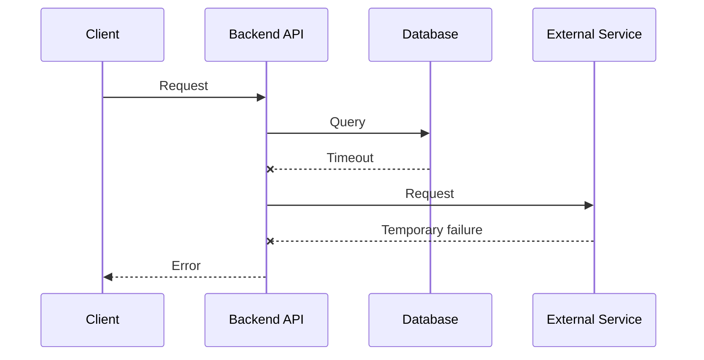
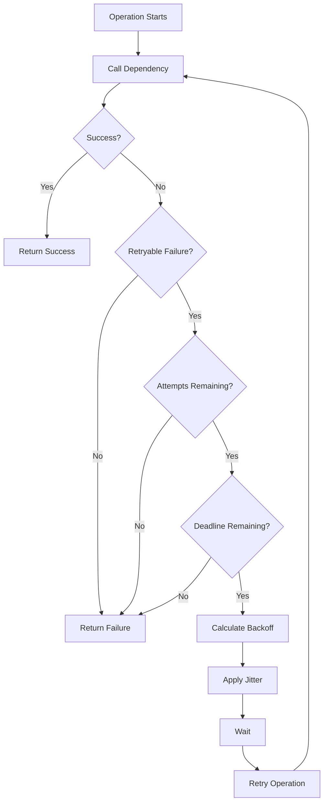

# 03- Resilience Patterns - Retries, Backoff and Jitter

## Overview

Distributed systems fail in ways that do not occur in a single-process application. A backend service may be healthy while a downstream API is temporarily unavailable, a database connection may time out because of a network condition, or an AWS dependency may briefly reject requests because of throttling.

Resilience patterns allow a system to tolerate transient failures without immediately turning a localized problem into a broader outage.

Three closely related mechanisms are:

- **Retries** — attempt an operation again after a failure.
- **Backoff** — increase the delay between successive retry attempts.
- **Jitter** — introduce controlled randomness into the delay.

The basic pattern is:

```text
Request
   |
   v
Dependency
   |
   +---- Success ----> Continue
   |
   +---- Transient Failure
                |
                v
             Backoff
                |
                v
              Jitter
                |
                v
              Retry
                |
          +-----+-----+
          |           |
       Success      Failure
          |           |
          v           v
       Continue   Retry / Fail
```

These mechanisms are particularly important in:

- REST APIs
- gRPC services
- microservices
- database clients
- AWS SDK calls
- message consumers
- Celery workers
- Kafka consumers
- Kubernetes workloads
- external API integrations

Retries are not inherently a reliability improvement. A poorly designed retry mechanism can amplify an outage by increasing traffic against an already failing dependency.

The engineering objective is therefore:

> Retry failures that are likely to recover, with bounded attempts and controlled timing, while preventing retry storms and duplicate side effects.

---

## Why Transient Failures Exist

A distributed request crosses multiple boundaries.



A failure does not necessarily mean that the dependency is permanently broken.

Transient failures can result from:

- temporary network congestion
- connection resets
- DNS failures
- temporary service unavailability
- throttling
- overloaded dependencies
- connection pool exhaustion
- leader elections or failovers
- temporary AWS service errors
- container restarts
- rolling deployments
- temporary infrastructure failures

A resilient client distinguishes between failures that may recover and failures that should immediately be returned to the caller.

---

## Retry Semantics

A retry means executing an operation again after an unsuccessful attempt.

For example:

```text
Attempt 1
   |
   X Timeout
   |
Attempt 2
   |
   X Timeout
   |
Attempt 3
   |
   v
Success
```

The simplest implementation is:

```python
for attempt in range(3):
    try:
        return call_dependency()
    except TemporaryError:
        continue

raise DependencyUnavailable()
```

This is usually insufficient for production systems because it:

- retries immediately
- does not distinguish failure types
- does not enforce timeouts
- does not use backoff
- does not account for total request time
- does not handle duplicate side effects
- does not introduce jitter
- provides limited observability

A production retry policy should explicitly define its behavior.

---

## When Retries Are Appropriate

Retries are most useful for failures that are:

1. **Transient**
2. **Retryable**
3. **Bounded**
4. **Safe to repeat**

Typical candidates include:

| Failure | Usually Retryable? | Reason |
|---|---:|---|
| Connection reset | Yes | May be transient |
| Network timeout | Often | Dependency may recover |
| HTTP 429 | Usually | Indicates throttling |
| HTTP 500 | Often | Server-side transient failure |
| HTTP 502 | Often | Upstream/gateway failure |
| HTTP 503 | Often | Temporary unavailability |
| HTTP 504 | Often | Upstream timeout |
| HTTP 400 | No | Usually invalid request |
| HTTP 401 | No | Authentication problem |
| HTTP 403 | No | Authorization problem |
| HTTP 404 | Usually no | Resource may not exist |
| Validation error | No | Repeating does not change input |

The exact retry policy depends on the protocol, dependency, operation, and business semantics.

---

## When Retries Are Dangerous

Retries become dangerous when the operation has side effects.

Consider:

```http
POST /orders
```

The server may successfully create the order but the response may be lost.

The client sees:

```text
Timeout
```

and retries.

The server receives:

```text
POST /orders
POST /orders
```

Without idempotency protection, two orders may be created.

The same problem can occur with:

- payments
- inventory updates
- email sending
- account creation
- resource provisioning
- database writes
- external API mutations

Therefore:

> Retrying an operation is only safe when repeating that operation is semantically safe or the system provides idempotency protection.

---

## Idempotency and Retries

An operation is idempotent when repeating it produces the same intended final state.

For example:

```http
PUT /users/123
```

with:

```json
{
  "status": "active"
}
```

can generally be retried safely if the API semantics are correctly implemented.

A payment operation requires more care.

An idempotency key can associate multiple attempts with one logical operation:

```text
Client
  |
  | Idempotency-Key: 7f2...
  v
Payment API
  |
  +--> First request
  |       |
  |       v
  |    Payment
  |
  +--> Retry with same key
          |
          v
     Return original result
```

The server stores enough information to recognize the repeated request.

A production idempotency implementation should consider:

- key uniqueness
- key expiration
- request parameters
- result persistence
- concurrent duplicate requests
- failure before result persistence
- storage consistency

---

## Retry Budget

Retries consume resources.

If one request can generate three attempts, the dependency may receive up to three times the traffic.

For a workload of 10,000 requests per second:

```text
Original traffic = 10,000 requests/s

3 attempts maximum
        |
        v
Potential dependency traffic = 30,000 attempts/s
```

This is why retry behavior should be treated as part of capacity planning.

A retry budget should consider:

- maximum attempts
- maximum retry duration
- request timeout
- concurrency
- dependency capacity
- failure rate

More retries do not necessarily mean more reliability.

---

## Backoff

Backoff introduces a delay before retrying.

Without backoff:

```text
Attempt 1
   |
   X
   |
Attempt 2 immediately
   |
   X
   |
Attempt 3 immediately
```

With backoff:

```text
Attempt 1
   |
   X
   |
  Wait
   |
Attempt 2
   |
   X
   |
   Wait longer
   |
Attempt 3
```

Backoff gives the dependency time to recover and reduces immediate pressure.

---

## Fixed Backoff

A fixed backoff uses approximately the same delay between attempts.

For example:

```text
Attempt 1
   |
  1s
   |
Attempt 2
   |
  1s
   |
Attempt 3
```

Advantages:

- simple
- predictable
- easy to implement

Limitations:

- synchronized clients can retry at the same time
- does not adapt to repeated failures
- can create periodic traffic spikes

Fixed backoff is therefore often insufficient for large distributed systems.

---

## Exponential Backoff

Exponential backoff increases the delay after each failed attempt.

A common conceptual formula is:

```text
delay = base × 2^attempt
```

For example, with a 500 ms base delay:

| Attempt | Approximate Delay |
|---|---:|
| 1 | 500 ms |
| 2 | 1 s |
| 3 | 2 s |
| 4 | 4 s |
| 5 | 8 s |

A maximum delay should normally be enforced.

```text
delay = min(max_delay, base × 2^attempt)
```

This prevents the retry delay from growing without bound.

---

## Why Exponential Backoff Works

Suppose 10,000 clients experience the same temporary failure.

Without backoff:

```text
Failure
  |
  +--> 10,000 immediate retries
  |
  +--> Dependency remains overloaded
  |
  +--> More failures
  |
  +--> More retries
```

This can create a positive feedback loop.

With exponential backoff:

```text
Failure
  |
  +--> Clients spread retry attempts over time
  |
  +--> Dependency gets recovery time
  |
  +--> Load decreases
  |
  +--> Recovery becomes more likely
```

However, exponential backoff alone does not completely solve synchronized retries.

That is where jitter becomes important.

---

## Jitter

Jitter adds randomness to retry delays.

Without jitter:

```text
Client A ---- retry at 2.0s
Client B ---- retry at 2.0s
Client C ---- retry at 2.0s
Client D ---- retry at 2.0s
```

With jitter:

```text
Client A ---- retry at 1.7s
Client B ---- retry at 2.3s
Client C ---- retry at 1.9s
Client D ---- retry at 2.6s
```

The retry attempts are distributed across time.

This reduces synchronized retry behavior, commonly called a **thundering herd** or **retry storm**.

---

## Jitter Strategies

There are several ways to introduce jitter.

### Full Jitter

Calculate the exponential backoff limit and select a random delay between zero and that limit.

```text
delay = random(0, exponential_limit)
```

Example:

```text
Attempt 1: random(0, 1s)
Attempt 2: random(0, 2s)
Attempt 3: random(0, 4s)
Attempt 4: random(0, 8s)
```

Full jitter is a strong general-purpose strategy for distributed clients.

---

### Equal Jitter

Keep part of the calculated delay and randomize the remaining portion.

Conceptually:

```text
delay = half_of_backoff + random(0, half_of_backoff)
```

This provides some guaranteed waiting while still spreading clients over time.

---

### Decorrelated Jitter

The next delay is influenced by the previous delay and a randomized range.

This produces less predictable retry schedules and can be useful for systems where avoiding synchronized retries is especially important.

---

## Comparing Backoff Strategies

| Strategy | Advantages | Limitations |
|---|---|---|
| Immediate retry | Lowest latency | Can overload dependency |
| Fixed backoff | Simple | Synchronization risk |
| Exponential backoff | Reduces repeated pressure | Clients can still synchronize |
| Exponential + jitter | Strong general-purpose approach | Slightly less predictable |
| Decorrelated jitter | Strong spreading behavior | More complex |

For most production backend clients, bounded exponential backoff with jitter is a strong default when retries are appropriate.

---

## Retry Lifecycle

A production retry mechanism can be modeled as:



The important part is that retries are controlled by more than attempt count.

A robust implementation should consider both:

- **attempt budget**
- **time budget**

---

## Attempt Limit vs Time Limit

Suppose an API request has a 2-second timeout.

A retry policy that allows five retries with delays totaling 10 seconds is useless if the caller has already abandoned the request.

The retry mechanism should operate within the caller's deadline.

For example:

```text
Request deadline = 2 seconds

Attempt 1 = 500 ms
Backoff   = 100 ms
Attempt 2 = 500 ms
Backoff   = 200 ms
Attempt 3 = 500 ms

Remaining budget < next attempt
        |
        v
Stop retrying
```

In distributed systems, deadlines are often more meaningful than an arbitrary number of attempts.

---

## Python Implementation

A basic production-oriented retry helper can be implemented as follows:

```python
import random
import time
from collections.abc import Callable
from typing import TypeVar

T = TypeVar("T")


def retry_with_exponential_backoff(
    operation: Callable[[], T],
    *,
    max_attempts: int = 4,
    base_delay: float = 0.2,
    max_delay: float = 5.0,
) -> T:
    last_error: Exception | None = None

    for attempt in range(max_attempts):
        try:
            return operation()
        except Exception as exc:
            last_error = exc

            if attempt == max_attempts - 1:
                break

            exponential_delay = min(
                max_delay,
                base_delay * (2**attempt),
            )

            delay = random.uniform(0, exponential_delay)
            time.sleep(delay)

    assert last_error is not None
    raise last_error
```

This demonstrates the mechanism, but production code should not catch every exception indiscriminately.

The retry policy should identify the specific exceptions or response codes that are actually retryable.

---

## HTTP Client Example

A backend service calling an external API should typically combine:

- connection timeout
- read timeout
- retryable status handling
- bounded attempts
- exponential backoff
- jitter
- structured logging

For example, with `httpx`:

```python
import asyncio
import random

import httpx


RETRYABLE_STATUS_CODES = {429, 500, 502, 503, 504}


async def get_with_retry(
    client: httpx.AsyncClient,
    url: str,
    *,
    max_attempts: int = 4,
) -> httpx.Response:
    for attempt in range(max_attempts):
        try:
            response = await client.get(url)

            if response.status_code not in RETRYABLE_STATUS_CODES:
                response.raise_for_status()
                return response

            if attempt == max_attempts - 1:
                response.raise_for_status()

        except (httpx.ConnectError, httpx.ReadTimeout):
            if attempt == max_attempts - 1:
                raise

        exponential_delay = min(5.0, 0.5 * (2**attempt))
        delay = random.uniform(0, exponential_delay)

        await asyncio.sleep(delay)

    raise RuntimeError("Retry policy terminated unexpectedly")
```

A production implementation should also consider:

- `Retry-After` for throttling responses
- request deadlines
- idempotency
- connection pooling
- observability
- cancellation
- dependency-specific retry semantics

---

## Respecting Retry-After

Some services provide explicit retry guidance.

For example:

```http
HTTP/1.1 429 Too Many Requests
Retry-After: 3
```

When appropriate, the client should respect the server-provided retry interval rather than blindly applying its own delay.

The effective delay may be modeled as:

```text
effective_delay =
    max(client_backoff, server_retry_after)
```

The exact policy depends on the service contract.

Ignoring throttling signals can cause a client to remain in a cycle of:

```text
Request
  |
  v
429
  |
  v
Retry immediately
  |
  v
429
  |
  v
Retry immediately
```

which makes throttling worse.

---

## AWS and Retry Behavior

AWS APIs can return transient errors and throttling responses.

AWS SDKs commonly provide built-in retry mechanisms.

This means application code should avoid blindly implementing another retry layer around every SDK call.

A useful architecture is:

```text
Application
    |
    v
AWS SDK
    |
    +--> Retry / Backoff
    |
    v
AWS Service
```

Adding application-level retries on top of SDK retries can multiply attempts.

For example:

```text
Application Retry: 3 attempts
        |
        v
AWS SDK Retry: 3 attempts
        |
        v
Potential service attempts: 9
```

This can create unexpectedly high request volume and latency.

When using AWS SDKs, understand the SDK's retry configuration before adding another retry layer.

---

## Retry Storms

A retry storm occurs when many clients retry a failing dependency at the same time.

```text
                Dependency
                   X
                   |
        +----------+----------+
        |          |          |
      Client A   Client B   Client C
        |          |          |
        +----------+----------+
                   |
                   v
              Retry Storm
```

A retry storm can happen because:

- clients have identical retry schedules
- there is no jitter
- backoff is too short
- retry limits are too high
- timeouts are too long
- every service retries independently

The resulting load can prevent the dependency from recovering.

---

## Retry Amplification in Microservices

Consider:

```text
API
 |
 v
Service A
 |
 v
Service B
 |
 v
Service C
```

If every layer retries three times, one user request can generate many downstream attempts.

Conceptually:

```text
Service A
   |
   +--> Service B
          |
          +--> Service C
```

If each layer independently retries, the total number of operations can grow dramatically.

This is retry amplification.

A better approach is to establish clear retry ownership.

For example:

- service-level retries for transient remote dependencies
- bounded retry counts
- deadlines propagated across requests
- avoid retries at every layer
- use queues for asynchronous workloads where appropriate

---

## Timeouts and Retries Must Work Together

Retries without timeouts can block resources indefinitely.

Consider:

```text
Request
   |
   v
Dependency
   |
   X No response
   |
   v
Connection remains open
```

If this happens across many concurrent requests, worker threads, event-loop tasks, or connection-pool slots can be exhausted.

Always define appropriate timeouts for remote calls.

Typical timeout categories include:

- connection timeout
- TLS handshake timeout
- read timeout
- write timeout
- overall request deadline

The retry policy should fit inside the total request deadline.

---

## Circuit Breakers and Retries

Retries and circuit breakers solve different problems.

### Retry

Answers:

> "Should I try this operation again?"

### Circuit Breaker

Answers:

> "Should I stop sending requests to this dependency because it is currently unhealthy?"

A combined architecture can look like:

```text
Application
    |
    v
Circuit Breaker
    |
    +---- Open ----> Fail Fast
    |
    v
Retry Policy
    |
    v
Dependency
```

When a dependency is repeatedly failing, the circuit breaker can prevent continued traffic from reaching it.

This is particularly useful when:

- the dependency is consistently unavailable
- requests are expensive
- the dependency is overloaded
- continuing to retry would consume application resources

---

## Retries and Queues

For asynchronous work, retrying inside the HTTP request path may be unnecessary.

Instead:

```text
API
 |
 v
Queue
 |
 v
Worker
 |
 +--> Attempt 1
 |
 X
 |
 +--> Retry
 |
 X
 |
 +--> Dead Letter Queue
```

This provides several benefits:

- request latency is decoupled from processing
- retries can occur independently
- failed messages can be isolated
- worker concurrency can be controlled
- retry schedules can be longer

Celery, Kafka-based consumers, and AWS messaging systems commonly use related patterns.

---

## Dead-Letter Queues

A message that repeatedly fails should not be retried indefinitely.

A common pattern is:

```text
Queue
  |
  v
Worker
  |
  X Processing Failure
  |
  v
Retry
  |
  X
  |
  v
Retry Limit Reached
  |
  v
Dead Letter Queue
```

The dead-letter queue allows operators to inspect problematic messages without continuously retrying them.

A DLQ should be monitored.

A DLQ that silently accumulates messages is not a successful failure-handling strategy.

---

## Backoff for Background Workers

Background processing often permits longer retry intervals than synchronous APIs.

For example:

```text
Attempt 1 -> 1 second
Attempt 2 -> 2 seconds
Attempt 3 -> 4 seconds
Attempt 4 -> 8 seconds
Attempt 5 -> 16 seconds
```

This is appropriate when the operation does not need to complete within a user-facing request deadline.

However, the total retry duration should still be bounded.

Consider:

- message age
- business deadline
- duplicate processing
- downstream capacity
- queue growth

---

## Monitoring Retry Behavior

Retries should be observable.

Useful metrics include:

| Metric | Purpose |
|---|---|
| Retry count | Measures how frequently retries occur |
| Retry rate | Identifies dependency instability |
| Retry exhaustion | Detects operations that ultimately fail |
| Retry latency | Measures added request latency |
| Dependency error rate | Shows underlying failure |
| Dependency latency | Detects degradation |
| Queue depth | Detects asynchronous backlog |
| DLQ message count | Detects permanently failing work |

Logs should include information such as:

```text
dependency=payment-service
operation=create_payment
attempt=2
max_attempts=4
error=timeout
backoff_ms=731
```

Avoid logging sensitive request payloads or credentials.

---

## Alerting on Retries

A high retry rate is often an early warning signal.

For example:

```text
Normal:
Request success rate = 99.9%
Retry rate = 0.2%

Degraded:
Request success rate = 99.2%
Retry rate = 7%

Critical:
Request success rate = 95%
Retry rate = 40%
```

The exact thresholds depend on the workload.

Alerting should distinguish between:

- isolated retries
- sustained elevated retry rates
- retry exhaustion
- dependency failures
- DLQ growth

---

## Performance Implications

Retries increase latency.

If the first attempt takes 500 ms and two retries occur:

```text
Attempt 1 = 500 ms
Backoff  = 100 ms
Attempt 2 = 500 ms
Backoff  = 200 ms
Attempt 3 = 500 ms

Total ≈ 1.8 seconds
```

The operation may still succeed, but the user experiences substantially higher latency.

This is why retries should not be considered free reliability.

For latency-sensitive APIs, it may be better to:

- use a small retry budget
- fail fast
- provide a fallback
- move work asynchronously
- cache previously available data
- degrade functionality gracefully

---

## Resource Exhaustion

Retries can consume:

- CPU
- memory
- worker threads
- event-loop tasks
- connection-pool slots
- database connections
- network bandwidth

Suppose a service has 1,000 concurrent request slots and each request waits on a failing downstream dependency.

If retries extend request duration significantly, the service can exhaust its concurrency capacity even though CPU utilization remains low.

This is why timeout and concurrency management are part of retry design.

---

## Security Considerations

Retries can interact with security controls.

Potential problems include:

- repeatedly retrying unauthorized requests
- amplifying traffic against authentication services
- retrying requests containing expired credentials
- accidentally replaying sensitive operations
- generating excessive audit events

Do not retry authentication or authorization failures merely because the request failed.

Credential or permission problems usually require a different corrective action.

---

## Common Mistakes

### Retrying Every Exception

Bad:

```python
try:
    operation()
except Exception:
    retry()
```

This can retry:

- programming bugs
- invalid input
- authorization failures
- malformed requests
- permanent configuration errors

Retry only known transient failures.

---

### Retrying Immediately

Bad:

```python
for _ in range(5):
    try:
        return operation()
    except TemporaryError:
        pass
```

This can generate a burst of requests against a failing dependency.

Use bounded backoff and jitter.

---

### No Maximum Attempts

Infinite retries can create:

```text
Failure
  |
  v
Retry
  |
  v
Retry
  |
  v
Retry
  |
  v
Forever
```

Every retry policy needs a termination condition.

---

### No Timeout

A retry mechanism without timeouts can hold resources indefinitely.

Always define appropriate connection and operation deadlines.

---

### Retrying Non-Idempotent Operations

Blindly retrying:

```http
POST /payment
```

can produce duplicate side effects.

Use idempotency keys or redesign the operation semantics.

---

### Multiple Independent Retry Layers

For example:

```text
API
 |
 +--> HTTP Client Retry
       |
       +--> SDK Retry
              |
              +--> Service Retry
```

This can multiply attempts and latency.

Retry ownership should be deliberate.

---

### Ignoring Server Retry Guidance

If a dependency returns `Retry-After`, ignoring it can cause unnecessary throttling.

Client retry policies should respect service-specific contracts.

---

### No Jitter

Identical clients can synchronize their retries.

This is especially dangerous when:

- many containers start simultaneously
- a common dependency fails
- autoscaling creates many new clients
- a deployment restarts a large fleet

Jitter spreads the retry workload.

---

## Production Design Recommendations

A strong default policy for a synchronous backend dependency is:

```text
1. Set a strict timeout.
2. Classify retryable failures.
3. Use a small maximum attempt count.
4. Apply exponential backoff.
5. Add jitter.
6. Respect Retry-After when applicable.
7. Stop when the request deadline is exhausted.
8. Ensure side-effecting operations are idempotent.
9. Record retry metrics.
10. Avoid overlapping retry layers.
```

For asynchronous processing:

```text
1. Put work behind a queue.
2. Process with bounded worker concurrency.
3. Retry transient failures.
4. Use exponential backoff and jitter.
5. Limit retry attempts or message age.
6. Move permanently failing messages to a DLQ.
7. Monitor queue and DLQ depth.
8. Make consumers idempotent.
```

---

## Retry Policy Reference

| Parameter | Recommended Consideration |
|---|---|
| Retryable errors | Explicitly define them |
| Max attempts | Keep bounded |
| Backoff | Prefer exponential |
| Jitter | Prefer for distributed clients |
| Timeout | Always define |
| Deadline | Stop when budget is exhausted |
| Idempotency | Required for unsafe side effects |
| Retry-After | Respect when supported |
| Observability | Measure attempts and exhaustion |
| DLQ | Use for repeatedly failing async work |
| Circuit breaker | Consider for persistently unhealthy dependencies |

---

## Interview Perspective

A common interview question is:

> "How would you make a microservice resilient when a downstream service is temporarily unavailable?"

A strong answer should include more than "retry the request."

A production-oriented answer would cover:

1. Configure connection and request timeouts.
2. Classify which failures are transient and retryable.
3. Use bounded exponential backoff.
4. Add jitter to prevent synchronized retries.
5. Respect downstream throttling signals such as `Retry-After`.
6. Ensure side-effecting operations are idempotent.
7. Use circuit breaking when the dependency remains unhealthy.
8. Propagate deadlines across service boundaries.
9. Monitor retry rates and retry exhaustion.
10. Avoid retry amplification across multiple service layers.
11. Move non-user-facing work to asynchronous processing when appropriate.
12. Use dead-letter handling for repeatedly failing background work.

The important architectural insight is:

> Resilience is not about making every request succeed. It is about controlling failure behavior so that one failing dependency does not destabilize the entire system.

---

## Key Takeaways

- Retries should be limited to failures that are likely to recover and safe to repeat; blindly retrying every exception can amplify failures.
- Exponential backoff gives failing dependencies recovery time, while jitter prevents large numbers of distributed clients from retrying simultaneously.
- Production retry policies should combine bounded attempts, explicit timeouts, request deadlines, idempotency, and dependency-specific retry rules.
- Multiple independent retry layers can multiply traffic and latency, so retry ownership must be deliberately designed across microservice boundaries.
- Retries should be observable and paired with complementary resilience mechanisms such as circuit breakers, queues, dead-letter handling, and graceful degradation.