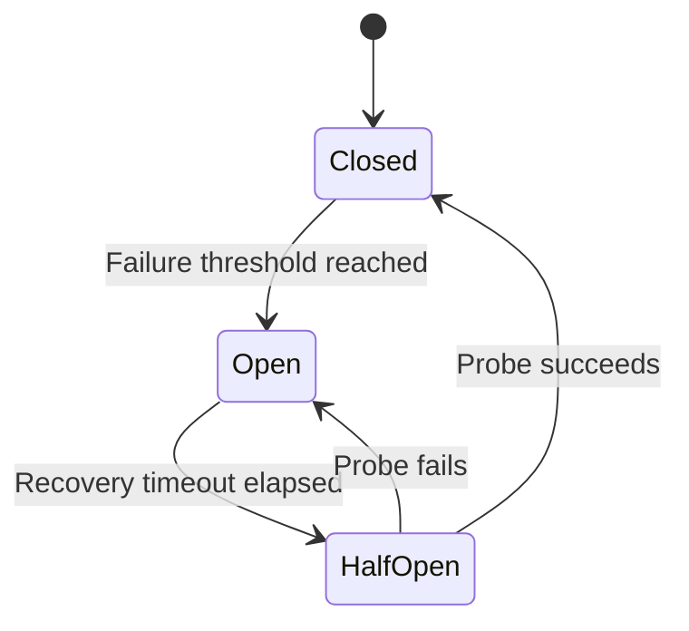
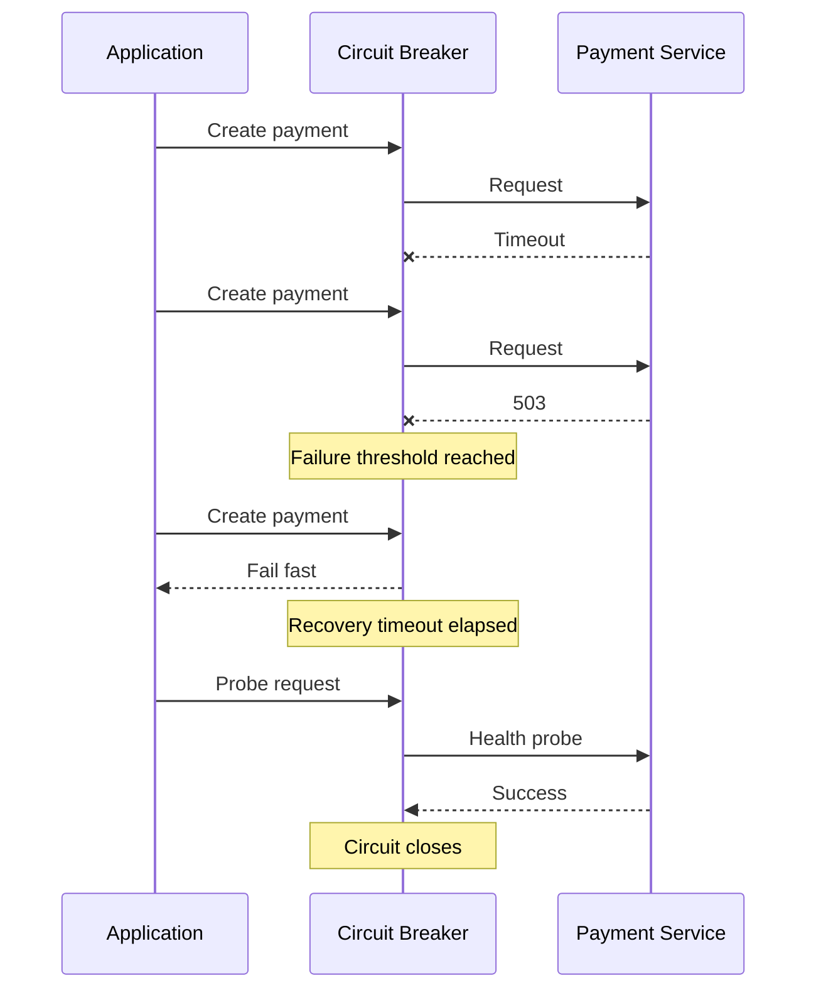
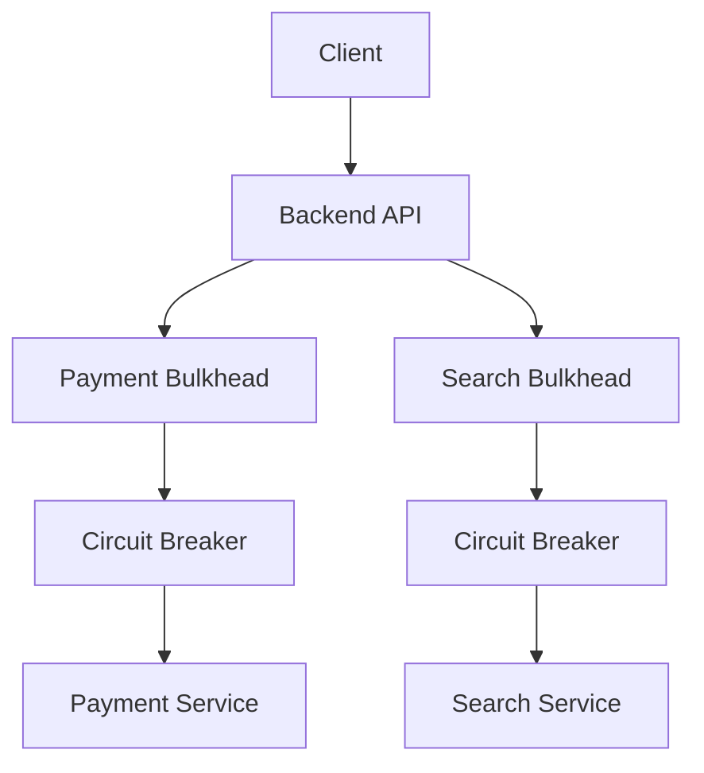
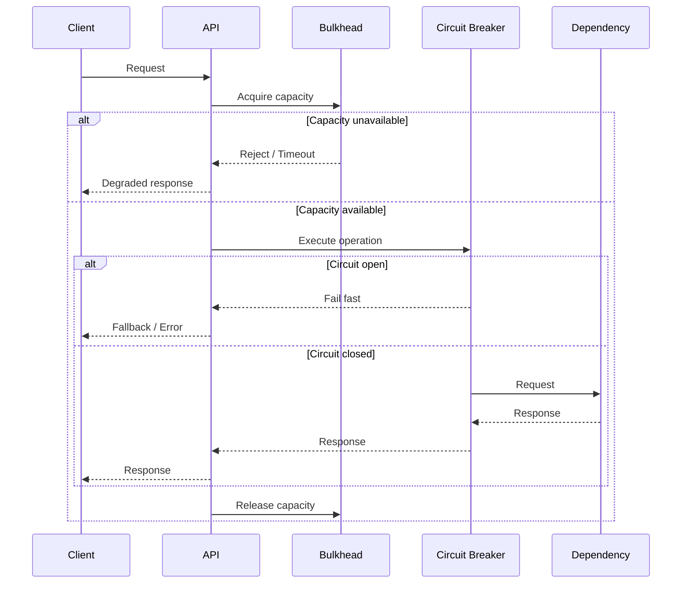

# 04- Resilience Patterns - Circuit Breaker and Bulkhead

## Overview

Distributed backend systems fail through dependency failures, network failures, resource exhaustion, deployment events, and infrastructure problems. A service that is healthy in isolation can still become unavailable when one of its dependencies becomes slow or unavailable.

Two important resilience patterns address different failure modes:

- **Circuit Breaker** prevents an unhealthy dependency from continuously receiving requests.
- **Bulkhead** isolates resources so that failure or overload in one workload does not exhaust resources required by other workloads.

They are complementary rather than interchangeable.

A typical resilient request path can look like:

```text
                    Backend Service
                           |
                    +------+------+
                    |             |
              Bulkhead Pool   Bulkhead Pool
                    |             |
                    v             v
             Circuit Breaker   Database
                    |
                    v
              External Service
```

The circuit breaker protects the dependency boundary.

The bulkhead protects the caller's resources.

Together they help prevent localized failures from propagating through the system.

---

## Why These Patterns Exist

Consider an API that calls a payment service.

```text
Client
  |
  v
Order API
  |
  v
Payment Service
```

If the payment service becomes slow, requests may remain blocked:

```text
Request 1 ----> Payment ----> waiting
Request 2 ----> Payment ----> waiting
Request 3 ----> Payment ----> waiting
...
Request 1000 --> Payment ----> waiting
```

Eventually the Order API can exhaust:

- worker threads
- async tasks
- connection pools
- memory
- CPU
- request slots

The payment service has failed, but the Order API has now failed as well.

This is **failure propagation**.

A circuit breaker can stop sending requests to the unhealthy dependency.

A bulkhead can prevent the dependency's failures from consuming all resources belonging to the caller.

---

## Circuit Breaker

A circuit breaker is a stateful control placed around a remote dependency.

Its purpose is to detect repeated failures and temporarily stop sending requests to the dependency.

The core states are:

- **Closed** — requests flow normally.
- **Open** — requests fail fast without calling the dependency.
- **Half-Open** — a limited number of test requests are allowed to determine whether the dependency recovered.



The circuit breaker does not make the dependency healthy.

It prevents the caller from repeatedly interacting with a dependency that is already known to be unhealthy.

---

## Closed State

In the closed state, requests are allowed through.

```text
Application
    |
    v
Circuit Breaker
    |
    v
Dependency
```

The circuit breaker observes the results.

It may track:

- failure count
- failure rate
- latency
- consecutive failures
- timeout rate
- specific error classes

For example:

```text
Successful requests = 95
Failed requests     = 5

Failure rate = 5%
```

If the configured failure threshold is exceeded, the circuit transitions to open.

---

## Open State

When the circuit is open, requests do not reach the dependency.

```text
Application
    |
    v
Circuit Breaker
    |
    X
    |
    v
Fail Fast / Fallback
```

This prevents additional load from reaching the failing service.

Fail-fast behavior is important because waiting for a dependency that is already known to be unavailable wastes application resources.

The application may:

- return an error
- use cached data
- return a degraded response
- enqueue work for later
- invoke an alternative dependency

The appropriate fallback depends on business requirements.

---

## Half-Open State

After remaining open for a configured recovery period, the circuit transitions to half-open.

A limited number of requests are allowed through.

```text
Open
  |
  | Recovery timeout
  v
Half-Open
  |
  +---- Probe succeeds ---> Closed
  |
  +---- Probe fails ------> Open
```

The purpose is to test whether the dependency has recovered.

A production implementation should avoid allowing the entire application fleet to simultaneously send large numbers of probe requests.

---

## Circuit Breaker Configuration

A circuit breaker commonly requires parameters such as:

| Parameter | Purpose |
|---|---|
| Failure threshold | Determines when the circuit opens |
| Failure window | Defines the period over which failures are measured |
| Open duration | Controls how long the circuit remains open |
| Half-open probes | Limits recovery test traffic |
| Timeout | Limits how long individual calls may wait |
| Error classification | Determines which failures count |
| Success threshold | Determines when half-open becomes closed |

Exact values should be derived from workload behavior rather than copied from a generic example.

---

## Failure Counting

A circuit breaker can use different failure detection strategies.

### Consecutive Failures

```text
Failure
Failure
Failure
Failure
    |
    v
Open Circuit
```

This is simple but can be sensitive to short-lived failure bursts.

### Failure Rate

For example:

```text
Window:
100 requests
30 failures

Failure rate = 30%
```

If the threshold is 25%, the circuit opens.

Failure-rate strategies are often more representative for high-throughput services.

### Sliding Windows

A circuit breaker can evaluate a rolling period:

```text
|---- recent requests ----|
            ^
        current time
```

This avoids allowing old failures to dominate the decision.

---

## What Should Count as a Circuit Failure?

Not every error indicates dependency health problems.

Usually relevant:

- connection failures
- network timeouts
- upstream 5xx responses
- dependency unavailable errors
- connection pool failures

Usually not relevant:

- invalid application input
- authentication failures caused by the caller
- authorization failures
- business validation errors
- expected 4xx responses

For example:

```http
POST /payments
```

returning:

```http
400 Bad Request
```

does not necessarily mean the payment service is unhealthy.

Counting every 400 response toward the circuit threshold can incorrectly open the circuit.

---

## Circuit Breaker Flow



---

## Circuit Breaker and Retries

Circuit breakers and retries solve different problems.

| Pattern | Primary Purpose |
|---|---|
| Retry | Give a transient failure another chance |
| Backoff | Prevent immediate repeated requests |
| Jitter | Spread retry traffic |
| Circuit breaker | Stop calling a persistently failing dependency |
| Bulkhead | Prevent resource exhaustion across workloads |

They can be combined:

```text
Application
    |
    v
Bulkhead
    |
    v
Circuit Breaker
    |
    v
Retry Policy
    |
    v
Dependency
```

However, ordering and ownership should be deliberate.

For example, repeatedly retrying inside an open circuit is meaningless.

A circuit breaker should be able to prevent additional work from reaching a known-failing dependency.

---

## Circuit Breaker Fallbacks

Opening the circuit creates a business decision.

The application may:

### Fail Fast

```text
Dependency unavailable
        |
        v
HTTP 503
```

Appropriate when the dependency is mandatory.

### Return Cached Data

```text
Dependency unavailable
        |
        v
Redis / Cache
        |
        v
Degraded Response
```

Useful when stale data is acceptable.

### Queue the Work

```text
Dependency unavailable
        |
        v
Message Queue
        |
        v
Process Later
```

Useful when immediate processing is unnecessary.

### Graceful Degradation

Some functionality can be disabled while the core application continues operating.

For example:

```text
Core Order Processing --> Available
Recommendation Service --> Temporarily Disabled
```

The correct fallback depends on business requirements and data consistency constraints.

---

## Bulkhead Pattern

The bulkhead pattern isolates resources so that failure in one area does not consume resources required by another.

The name comes from ship design, where compartments limit flooding to a single section.

In software, the same principle applies:

> Partition resources so that one workload cannot exhaust the resources required by other workloads.

Without isolation:

```text
                 Application
                     |
            Shared Resource Pool
             /       |       \
            v        v        v
         Payment   Search   Notifications
            |
         Overloaded
            |
            v
       Pool Exhausted
            |
            v
      Entire API Degraded
```

With bulkheads:

```text
                 Application
              /       |       \
             v        v        v
        Payment     Search   Notifications
        Pool        Pool       Pool
          |           |          |
       Failure     Healthy     Healthy
```

Payment failures no longer consume the resources reserved for search or notifications.

---

## Types of Bulkheads

Bulkhead isolation can be implemented at several levels.

### Thread Pool Isolation

Separate thread pools for different dependencies.

```text
Payment Requests
      |
      v
Payment Thread Pool

Search Requests
      |
      v
Search Thread Pool
```

If payment requests block, search requests can continue using their own pool.

---

### Connection Pool Isolation

Different dependencies can use independent connection pools.

```text
Application
   |
   +--> Payment Connection Pool
   |
   +--> Search Connection Pool
   |
   +--> Database Connection Pool
```

This prevents one dependency from consuming all available connections.

This is particularly important in services that interact with multiple databases or external systems.

---

### Semaphore-Based Isolation

Concurrency can be explicitly limited.

```text
Payment Requests
      |
      v
Semaphore: 20 concurrent requests
      |
      v
Payment Service
```

If 1,000 requests arrive simultaneously, only the configured number can execute concurrently.

The remaining requests can:

- wait briefly
- fail fast
- fall back
- be queued

---

### Process-Level Isolation

Different workloads can run in separate processes or services.

```text
Application
    |
    +--> API Process
    |
    +--> Worker Process
    |
    +--> Reporting Process
```

A reporting workload consuming excessive memory does not necessarily bring down the API process.

---

### Container-Level Isolation

In containerized environments, workloads can be separated by containers or deployments.

For example:

```text
Kubernetes Cluster
|
+-- API Deployment
|
+-- Worker Deployment
|
+-- Reporting Deployment
```

Each workload can have independent:

- CPU limits
- memory limits
- replica counts
- autoscaling policies
- deployment lifecycle

---

## Bulkheads in Microservices

Bulkheads become increasingly important as the number of dependencies grows.

Consider:

```text
Order API
 |
 +--> Payment Service
 |
 +--> Inventory Service
 |
 +--> Recommendation Service
 |
 +--> Notification Service
```

Without resource isolation, one slow dependency can consume the application's entire concurrency capacity.

With bulkheads:

```text
Order API
 |
 +--> Payment
 |      |
 |    Pool A
 |
 +--> Inventory
 |      |
 |    Pool B
 |
 +--> Recommendations
        |
      Pool C
```

Each dependency has a bounded resource allocation.

---

## Python Bulkhead Example

A semaphore can provide basic concurrency isolation in an asynchronous Python application.

```python
import asyncio
from collections.abc import Awaitable, Callable
from typing import TypeVar

T = TypeVar("T")

payment_limit = asyncio.Semaphore(20)


async def execute_payment_call(
    operation: Callable[[], Awaitable[T]],
) -> T:
    async with payment_limit:
        return await operation()
```

This limits the number of concurrent payment operations to 20.

However, this alone is not a complete production bulkhead.

A production implementation should also consider:

- acquisition timeout
- request timeout
- queue length
- fallback behavior
- metrics
- cancellation
- fairness
- process-level resource limits

---

## Bulkhead With Acquisition Timeout

Waiting indefinitely for a bulkhead slot defeats the purpose of resource protection.

A bounded implementation can fail fast when capacity is exhausted.

```python
import asyncio
from collections.abc import Awaitable, Callable
from typing import TypeVar

T = TypeVar("T")

payment_limit = asyncio.Semaphore(20)


async def execute_payment_call(
    operation: Callable[[], Awaitable[T]],
    *,
    acquire_timeout: float = 0.2,
) -> T:
    try:
        await asyncio.wait_for(
            payment_limit.acquire(),
            timeout=acquire_timeout,
        )
    except TimeoutError as exc:
        raise RuntimeError("Payment concurrency limit reached") from exc

    try:
        return await operation()
    finally:
        payment_limit.release()
```

The important property is the `finally` block.

A permit must always be released, including when the operation raises an exception or is cancelled.

---

## Bulkhead Capacity Planning

Bulkhead limits should not be arbitrary.

Suppose:

```text
Application concurrency = 500

Payment dependency capacity = 50 concurrent requests
Search dependency capacity = 200 concurrent requests
```

A reasonable architecture might allocate separate limits:

```text
Payment = 50
Search = 200
Other   = 250
```

The exact values should be based on:

- dependency capacity
- application workload
- latency
- timeout
- expected concurrency
- business priority
- downstream rate limits

A bulkhead that is too large does not provide meaningful protection.

A bulkhead that is too small can unnecessarily throttle healthy workloads.

---

## Bulkhead and Backpressure

Bulkheads are closely related to backpressure.

If a dependency can process only 20 concurrent requests and the application receives 1,000 requests, the system must decide what to do with the excess.

Possible strategies include:

- queue
- reject
- shed load
- degrade functionality
- prioritize requests

For example:

```text
Incoming Requests
       |
       v
Concurrency Limit = 20
       |
       +---- 20 active
       |
       +---- Excess
              |
              +--> Queue
              |
              +--> Fail Fast
              |
              +--> Fallback
```

Resource isolation without a strategy for excess traffic is incomplete.

---

## Circuit Breaker vs Bulkhead

The distinction is important.

| Aspect | Circuit Breaker | Bulkhead |
|---|---|---|
| Primary goal | Stop calling unhealthy dependency | Isolate resource consumption |
| Protects | Dependency and caller | Caller resources |
| Trigger | Failure/health threshold | Resource/concurrency threshold |
| Main action | Fail fast | Limit concurrency/resources |
| State | Closed/Open/Half-Open | Resource capacity |
| Handles overload | Indirectly | Directly |
| Prevents cascading failure | Yes | Yes |
| Requires failure detection | Usually | No |
| Main risk | Incorrect failure classification | Incorrect capacity limits |

A circuit breaker asks:

> "Is this dependency unhealthy enough that we should stop calling it?"

A bulkhead asks:

> "How much of our own capacity are we willing to let this workload consume?"

---

## Combined Architecture

A resilient service can combine both patterns.



The bulkhead limits resource consumption.

The circuit breaker prevents requests from reaching an unhealthy dependency.

This creates two independent protection mechanisms.

---

## Request Lifecycle With Both Patterns



This is the core relationship between the two patterns.

---

## Circuit Breaker Implementation Considerations

A circuit breaker implementation must be concurrency-safe.

Consider multiple application workers observing failures simultaneously.

Without synchronization:

```text
Worker A --> failure count = 4
Worker B --> failure count = 4
Worker C --> failure count = 4
```

Multiple workers may independently make state transitions.

In a multi-process or distributed deployment, a circuit breaker may be local to each process or shared through an external coordination mechanism.

A local circuit breaker is often simpler and can be sufficient because each application instance independently protects itself.

A distributed circuit breaker introduces additional complexity:

- shared state
- consistency
- network overhead
- synchronization
- failure of the state store

Do not introduce distributed circuit-breaker state unless the requirement justifies it.

---

## Circuit Breaker State Scope

Consider ten API containers.

```text
Load Balancer
 |
 +--> Container A
 +--> Container B
 +--> Container C
 ...
 +--> Container J
```

If the circuit breaker is process-local, each container maintains its own state.

One container may have:

```text
Closed
```

while another has:

```text
Open
```

This is not necessarily incorrect.

It can provide natural isolation.

However, if the dependency is globally unavailable, multiple instances may independently discover the failure.

The architecture should determine whether this behavior is acceptable.

---

## Circuit Breaker Fallback and Business Semantics

A fallback must preserve business correctness.

For example, if the payment service is unavailable, returning:

```json
{
  "status": "payment_successful"
}
```

would be dangerous unless payment success is actually guaranteed.

A safer response might be:

```json
{
  "status": "payment_pending"
}
```

with the operation queued for later processing.

This illustrates an important principle:

> Resilience mechanisms must preserve business correctness, not merely availability.

---

## Bulkhead Failure Modes

Bulkheads introduce their own risks.

### Bulkhead Too Small

```text
Dependency capacity = 100
Bulkhead limit = 10
```

The application may underutilize a healthy dependency.

### Bulkhead Too Large

```text
Dependency capacity = 50
Bulkhead limit = 500
```

The bulkhead does little to protect the dependency or caller.

### Waiting Forever

If requests wait indefinitely for capacity:

```text
Request
  |
  v
Bulkhead
  |
  v
Waiting
  |
  v
Waiting
  |
  v
Timeout
```

application resources may still be consumed.

### No Load Shedding

If the bulkhead rejects excess work but the caller immediately retries, the system can enter another overload loop.

---

## Bulkheads in Kubernetes

Kubernetes provides several mechanisms that support bulkhead-style isolation.

Examples include:

- separate Deployments
- resource requests
- resource limits
- Horizontal Pod Autoscaling
- PodDisruptionBudgets
- namespace isolation
- separate node pools
- workload-specific concurrency controls

For example:

```text
Cluster
|
+-- API Pods
|     CPU / Memory limits
|
+-- Worker Pods
|     CPU / Memory limits
|
+-- Reporting Pods
      CPU / Memory limits
```

This prevents one workload from consuming unlimited node resources.

However, Kubernetes resource limits are not a substitute for application-level concurrency control.

Both infrastructure and application layers may require isolation.

---

## Bulkheads in Celery

Celery workloads can also be separated by queue.

```text
Producer
   |
   +----> payments queue ----> payment workers
   |
   +----> email queue -------> email workers
   |
   +----> reports queue -----> report workers
```

If report processing becomes expensive, it does not necessarily consume all worker capacity assigned to payment processing.

This is a practical bulkhead pattern.

Worker pools can be scaled independently based on queue behavior.

---

## Bulkheads With Kafka

Kafka consumers can achieve a different form of workload isolation through separate topics and consumer groups.

```text
Kafka
|
+-- payments-events
|      |
|   Payment Group
|
+-- notification-events
       |
   Notification Group
```

Each consumer group manages its own processing capacity.

This does not automatically provide complete bulkhead protection, but it creates an architectural boundary around workload processing.

Application-level concurrency and resource limits may still be required.

---

## AWS Architecture Applications

Circuit breakers and bulkheads can be applied across AWS workloads.

Examples include:

| AWS Architecture | Resilience Mechanism |
|---|---|
| ECS service calling external API | Circuit breaker + concurrency limit |
| Lambda calling dependency | Timeout + bounded retries + fail-fast logic |
| API calling RDS | Connection-pool isolation |
| ECS worker processing SQS | Visibility timeout + bounded concurrency + DLQ |
| Celery on ECS | Separate worker pools and queues |
| Microservices | Per-dependency circuit breakers |
| Event-driven processing | Queue isolation and consumer limits |

AWS managed services may provide some resilience capabilities, but application-level failure isolation may still be necessary.

---

## Monitoring Circuit Breakers

Circuit breakers should expose operational metrics.

Useful metrics include:

- circuit state
- number of opens
- number of half-open probes
- failure rate
- timeout rate
- rejected requests
- fallback count
- dependency latency
- dependency error rate

A useful dashboard might show:

```text
Payment Service
-----------------------------
Request Rate
Error Rate
p95 Latency
Circuit State
Circuit Open Count
Rejected Requests
Fallback Rate
```

An unexpectedly high circuit-open rate should trigger investigation.

The circuit breaker is an indicator of dependency health, not merely an implementation detail.

---

## Monitoring Bulkheads

Bulkhead metrics should include:

- active slots
- maximum slots
- rejected requests
- queue depth
- acquisition latency
- timeout count
- utilization percentage

For example:

```text
Payment Bulkhead
-----------------------------
Capacity:       50
Active:         48
Utilization:    96%
Rejected:       1,250/min
Acquire p95:    180 ms
```

This indicates that the dependency may be approaching capacity or that the application is receiving excessive load.

---

## Alerting

Potential alerts include:

### Circuit Breaker

- circuit remains open beyond expected recovery period
- circuit opens frequently
- half-open probes repeatedly fail
- fallback rate exceeds threshold

### Bulkhead

- sustained high utilization
- high rejection rate
- increasing acquisition latency
- persistent queue growth
- frequent capacity exhaustion

Alerting thresholds should be based on normal workload behavior rather than arbitrary percentages.

---

## Security Considerations

Resilience mechanisms can interact with security controls.

Avoid creating fallbacks that bypass authorization.

For example:

```text
Normal:
Request -> Authorization -> Dependency

Failure:
Request -> Fallback -> Sensitive Data
```

The fallback must enforce the same security requirements as the normal path.

Similarly, circuit breakers should not be used to hide authentication or authorization problems.

A `403 Forbidden` response should generally not be interpreted as dependency health failure.

---

## Cost Considerations

Circuit breakers can reduce unnecessary dependency calls and therefore potentially reduce:

- network traffic
- downstream API usage
- compute consumption
- request processing cost

Bulkheads can reduce the impact of overload but may also intentionally reject work.

There can be a cost trade-off:

```text
Higher Capacity
      |
      v
More infrastructure
      |
      v
Higher Cost

Lower Capacity
      |
      v
More rejection / queueing
      |
      v
Lower Cost but potentially higher latency
```

Capacity should be aligned with business requirements.

---

## Common Mistakes

### Treating Circuit Breaker as a Retry Mechanism

A circuit breaker does not exist to retry failed requests.

Its purpose is to stop traffic when a dependency is unhealthy.

---

### Opening the Circuit on Every Error

Counting all 4xx responses as dependency failures can cause false circuit opens.

Classify errors carefully.

---

### No Timeout Before Circuit Breaking

If calls never terminate, the circuit breaker may receive failure information too slowly.

Remote calls need bounded timeouts.

---

### Ignoring Half-Open Concurrency

Allowing thousands of requests through during half-open recovery can overload a dependency that has only partially recovered.

Limit probe traffic.

---

### Global Bulkhead for Everything

A single global concurrency limit provides little isolation:

```text
All Workloads
     |
     v
One Pool
```

Prefer independent resource pools for important workloads.

---

### Bulkhead Without Backpressure Strategy

If excess requests are simply rejected without considering retries, clients may immediately retry and increase the load.

The system needs a deliberate overload strategy.

---

### Using Arbitrary Limits

A limit such as:

```text
max_concurrency = 10
```

has no meaning without workload measurements.

Capacity should be based on:

- downstream limits
- latency
- throughput
- concurrency
- business priority

---

### Ignoring Resource Leakage

Bulkhead permits must always be released.

Incorrect:

```python
await semaphore.acquire()

result = await operation()

semaphore.release()
```

If `operation()` raises an exception, the permit may never be released.

Prefer:

```python
await semaphore.acquire()

try:
    return await operation()
finally:
    semaphore.release()
```

---

## Production Design Pattern

A resilient synchronous dependency call can use the following architecture:

```text
                    Incoming Request
                           |
                           v
                  Concurrency Bulkhead
                           |
                  +--------+--------+
                  |                 |
             Capacity OK       Capacity Full
                  |                 |
                  v                 v
           Circuit Breaker      Reject/Fallback
                  |
          +-------+-------+
          |               |
       Closed            Open
          |               |
          v               v
       Retry Policy     Fail Fast
          |
          v
      Dependency
```

The layers have distinct responsibilities:

| Layer | Responsibility |
|---|---|
| Timeout | Bound how long a call can consume resources |
| Bulkhead | Bound concurrency/resource consumption |
| Circuit breaker | Stop calls to persistently unhealthy dependencies |
| Retry | Recover from appropriate transient failures |
| Backoff | Space retries |
| Jitter | Prevent synchronized retries |
| Fallback | Preserve useful behavior when dependency is unavailable |

---

## Recommended Design Sequence

When designing resilience for a remote dependency:

1. Define the dependency's failure modes.
2. Define acceptable latency and timeout budgets.
3. Determine which errors are retryable.
4. Make side-effecting operations idempotent.
5. Define retry limits and backoff.
6. Add jitter where multiple clients may synchronize.
7. Define a circuit-breaker failure threshold.
8. Define half-open recovery behavior.
9. Establish a concurrency limit or bulkhead.
10. Decide what happens when capacity is exhausted.
11. Define fallback or graceful-degradation behavior.
12. Add metrics and alerts.
13. Test dependency failures intentionally.

The last step is important.

Resilience mechanisms should be tested under realistic failure conditions rather than assumed to work because the code compiles.

---

## Failure Testing

Useful scenarios include:

```text
Dependency latency increases
        |
        v
Request timeouts
        |
        v
Circuit opens
```

```text
Dependency becomes unavailable
        |
        v
Retry attempts increase
        |
        v
Circuit opens
        |
        v
Requests fail fast
```

```text
Traffic spike
        |
        v
Bulkhead reaches capacity
        |
        v
Excess traffic rejected / queued
        |
        v
Core workload remains healthy
```

Testing should validate:

- circuit state transitions
- retry behavior
- timeout behavior
- fallback behavior
- bulkhead limits
- permit release
- recovery behavior
- observability
- client behavior after rejection

---

## Interview Perspective

A common interview question is:

> "How would you prevent a slow downstream microservice from bringing down your API?"

A strong answer should distinguish several mechanisms.

First, configure strict timeouts so requests cannot wait indefinitely.

Second, use a bulkhead to limit how many concurrent requests can consume resources for that dependency.

Third, use bounded retries with exponential backoff and jitter for genuinely transient failures.

Fourth, use a circuit breaker to stop sending requests when the dependency remains unhealthy.

Finally, define a business-safe fallback, such as cached data, asynchronous processing, or a degraded response.

The architecture becomes:

```text
API
 |
 v
Timeout
 |
 v
Bulkhead
 |
 v
Circuit Breaker
 |
 v
Retry + Backoff + Jitter
 |
 v
Dependency
```

The important interview distinction is:

> A circuit breaker protects the dependency boundary by failing fast; a bulkhead protects the application's own capacity by isolating resource consumption.

---

## Senior-Level Design Considerations

At senior level, circuit breakers and bulkheads should be treated as capacity-management mechanisms rather than isolated code patterns.

Important questions include:

- What is the dependency's actual capacity?
- What percentage of application capacity can this dependency consume?
- Which operations are more important?
- What happens when the bulkhead is full?
- Is the fallback semantically correct?
- Should requests be queued or rejected?
- How much retry traffic can the dependency tolerate?
- Should circuit state be local or distributed?
- What happens during a deployment?
- What happens during an Availability Zone failure?
- How do autoscaling and concurrency limits interact?
- How are circuit state and bulkhead saturation observed?
- What happens when clients retry rejected requests?

The strongest architecture is not the one with the most resilience mechanisms.

It is the one where each mechanism has a clearly defined responsibility.

## Key Takeaways

- A circuit breaker prevents repeated calls to a dependency that is persistently unhealthy, while a bulkhead prevents one workload from exhausting resources required by other workloads.
- Circuit breakers should use explicit failure classification, bounded timeouts, controlled half-open probing, and business-safe fallbacks.
- Bulkheads should isolate concurrency, connection pools, worker capacity, or infrastructure resources according to measured workload and dependency limits.
- Circuit breakers, bulkheads, retries, timeouts, backoff, and jitter solve different failure problems and should be composed deliberately rather than duplicated across service layers.
- Production resilience requires observability and failure testing so that circuit transitions, resource saturation, fallback behavior, and recovery are measurable and operationally trustworthy.