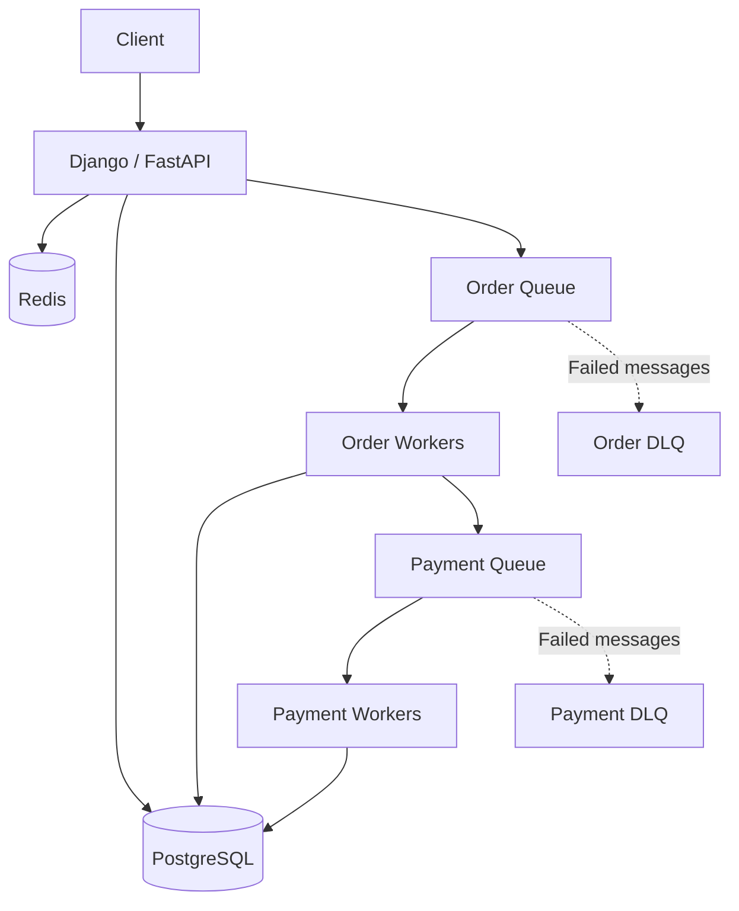

# 05- Resilience Patterns - Dead Letter Queues and Failure Isolation

## Overview

Distributed systems must assume that some work will fail permanently, some failures will be transient, and some failures will be caused by malformed data rather than infrastructure problems.

Retries and backoff are useful for transient failures, but retrying indefinitely is dangerous. A message can remain unprocessable because of:

- invalid payloads
- schema incompatibility
- missing required data
- corrupted state
- unsupported business conditions
- permanently unavailable resources
- programming bugs
- dependency failures that exceed the retry window

A **Dead Letter Queue (DLQ)** provides a controlled destination for messages that cannot be successfully processed after the configured retry policy.

**Failure isolation** is the broader architectural principle of preventing one failing workload, message, dependency, tenant, or component from destabilizing unrelated parts of the system.

A resilient asynchronous architecture commonly looks like:

```text
Producer
   |
   v
Primary Queue
   |
   v
Consumer / Worker
   |
   +---- Success ------------------> Complete
   |
   +---- Transient Failure
   |          |
   |          v
   |       Retry
   |          |
   |          +---- Success ------> Complete
   |          |
   |          +---- Failure
   |                 |
   |                 v
   |              Retry Limit
   |                 |
   |                 v
   +--------------> DLQ
                      |
                      v
                Investigation
                      |
                      v
                Replay / Fix
```

The key principle is:

> Failed work should be isolated from healthy work rather than allowed to block, poison, or repeatedly overload the processing pipeline.

---

## Why Dead Letter Queues Exist

Consider a queue containing thousands of messages:

```text
Queue
|
+-- Message A --> Success
+-- Message B --> Success
+-- Message C --> Failure
+-- Message D --> Success
+-- Message E --> Success
```

Suppose Message C contains invalid data.

If the consumer continuously retries it:

```text
Message C
   |
   v
Process
   |
   X
   |
   v
Retry
   |
   X
   |
   v
Retry
   |
   X
   |
   v
Retry
   |
   v
Forever
```

The same message consumes processing capacity repeatedly.

Depending on the queue implementation, this can also delay or interfere with processing of other messages.

A DLQ provides a termination point:

```text
Message C
   |
   v
Process
   |
   X
   |
   v
Retry
   |
   X
   |
   v
Retry Limit
   |
   v
DLQ
```

The message is removed from the normal processing path and becomes separately observable.

---

## What a Dead Letter Queue Is

A dead letter queue is a queue used to isolate messages that cannot be successfully processed under the primary queue's configured processing policy.

The DLQ is not necessarily a permanent garbage bin.

It is better understood as:

> A controlled failure boundary for messages that require separate handling.

A mature DLQ workflow includes:

```text
Failure
   |
   v
DLQ
   |
   +--> Alert
   |
   +--> Inspect
   |
   +--> Diagnose
   |
   +--> Correct
   |
   +--> Replay
   |
   +--> Archive / Discard
```

The exact workflow depends on the business importance of the message.

---

## Poison Messages

A **poison message** is a message that repeatedly fails processing.

Typical causes include:

- malformed JSON
- missing required fields
- invalid schema version
- unexpected enum value
- invalid database reference
- application bug
- incompatible event version
- corrupted payload
- unsupported business state

Example:

```json
{
  "order_id": null,
  "customer_id": "123",
  "amount": "INVALID"
}
```

If the consumer requires:

```text
order_id != null
amount = numeric value
```

the message may fail every time.

Retrying it indefinitely does not improve the outcome.

The correct approach is usually:

```text
Primary Queue
     |
     v
Consumer
     |
     X
Validation Failure
     |
     v
DLQ
```

---

## DLQ vs Retry Queue

A retry queue and a DLQ have different responsibilities.

| Mechanism | Purpose |
|---|---|
| Retry | Give potentially recoverable work another attempt |
| Backoff | Delay the next attempt |
| Retry queue | Hold work until a later retry time |
| DLQ | Isolate work that exceeded failure policy |
| Archive | Preserve data for long-term retention |

A typical lifecycle is:

```text
Primary Queue
     |
     v
Consumer
     |
     X
Transient Failure
     |
     v
Retry
     |
     X
Repeated Failure
     |
     v
DLQ
```

A message should generally enter the DLQ because the configured processing policy says it should no longer remain in the normal processing path.

---

## Failure Classification

A strong asynchronous architecture distinguishes between failure categories.

### Transient Failure

The operation may succeed later.

Examples:

- temporary network timeout
- temporary dependency outage
- throttling
- temporary database unavailability

Typical action:

```text
Retry
```

### Permanent Failure

Repeating the operation is unlikely to help.

Examples:

- invalid schema
- missing required field
- malformed payload
- invalid business state

Typical action:

```text
DLQ / Reject
```

### Unknown Failure

The application cannot confidently determine whether the failure is transient.

Typical action:

```text
Bounded Retry
      |
      v
DLQ if retry budget exhausted
```

This prevents unknown errors from causing infinite processing loops.

---

## Failure Isolation

Dead letter queues are one component of a broader failure-isolation strategy.

Failure isolation means limiting the blast radius of failures.

Potential failure boundaries include:

- service
- process
- container
- Availability Zone
- queue
- consumer group
- tenant
- database connection pool
- dependency
- workload type

For example:

```text
Application
|
+-- Payment Queue
|      |
|      +-- Payment Workers
|      +-- Payment DLQ
|
+-- Email Queue
|      |
|      +-- Email Workers
|      +-- Email DLQ
|
+-- Reporting Queue
       |
       +-- Reporting Workers
       +-- Reporting DLQ
```

If reporting becomes unhealthy, payment processing does not necessarily need to stop.

This is workload isolation.

---

## Why Failure Isolation Matters

Without isolation:

```text
Reporting Workload
       |
       v
Consumes all workers
       |
       v
Payment workload waits
       |
       v
Payment processing fails
       |
       v
Entire application degraded
```

With isolation:

```text
Reporting Workload
       |
       v
Reporting Worker Pool
       |
       X
     Failure

Payment Worker Pool
       |
       v
Payment Processing Continues
```

Failure isolation converts a potentially global failure into a localized failure.

---

## Queue-Based Failure Isolation

Queues naturally create useful boundaries.

Consider an API that performs three types of asynchronous work:

```text
                         API
                          |
             +------------+------------+
             |            |            |
             v            v            v
          Payments      Emails      Reports
             |            |            |
             v            v            v
        Payment Q     Email Q     Report Q
             |            |            |
             v            v            v
        Workers       Workers      Workers
```

Each workload can have independent:

- concurrency
- retry policy
- scaling
- monitoring
- DLQ
- deployment lifecycle

This is usually superior to processing all workloads through one undifferentiated worker pool.

---

## AWS SQS and Dead Letter Queues

Amazon SQS supports dead-letter queue configurations through a **redrive policy**.

The architecture is typically:

```text
Producer
   |
   v
Main SQS Queue
   |
   v
Consumer
   |
   X
Processing Failure
   |
   v
Receive Count Exceeded
   |
   v
SQS DLQ
```

The primary queue can be configured with a maximum receive count.

Once a message exceeds the configured threshold, SQS moves it to the configured DLQ according to the queue's redrive configuration.

The important design parameter is not simply "how many retries?"

It is:

> How many failed delivery attempts can occur before the message should leave the normal processing path?

---

## SQS Redrive Policy

Conceptually, a redrive policy contains:

```json
{
  "deadLetterTargetArn": "arn:aws:sqs:region:account:orders-dlq",
  "maxReceiveCount": 5
}
```

The exact configuration should be managed through infrastructure as code in production.

For example, a Terraform configuration can express the relationship explicitly:

```hcl
resource "aws_sqs_queue" "orders_dlq" {
  name = "orders-dlq"
}

resource "aws_sqs_queue" "orders" {
  name = "orders"

  redrive_policy = jsonencode({
    deadLetterTargetArn = aws_sqs_queue.orders_dlq.arn
    maxReceiveCount     = 5
  })
}
```

The queue and DLQ should be designed together.

Important considerations include:

- retention periods
- encryption
- IAM permissions
- monitoring
- replay strategy
- message ownership
- operational access

---

## SQS Visibility Timeout

A critical SQS concept for failure handling is the **visibility timeout**.

When a consumer receives a message, SQS temporarily hides that message from other consumers.

```text
Queue
 |
 v
Consumer receives message
 |
 v
Message becomes invisible
 |
 +---- Processing succeeds
 |          |
 |          v
 |       Delete message
 |
 +---- Processing fails
            |
            v
     Visibility timeout
            |
            v
     Message available again
```

If the consumer does not delete the message before the visibility timeout expires, the message can become visible again.

This enables another processing attempt.

---

## Visibility Timeout and Processing Time

The visibility timeout should account for realistic processing duration.

If:

```text
Processing time = 60 seconds
Visibility timeout = 20 seconds
```

the same message may become visible while the original worker is still processing it.

This can create duplicate processing:

```text
Worker A
   |
   +---- Processing message
   |
   | 20 seconds
   v
Message visible again
   |
   v
Worker B receives same message
```

Therefore:

> Queue processing must be designed with the queue's delivery semantics and visibility behavior in mind.

For long-running workloads, the consumer may need to extend the visibility timeout while processing.

---

## At-Least-Once Delivery

Many queue systems, including SQS standard queues, provide at-least-once delivery semantics.

This means a message can potentially be delivered more than once.

Therefore:

```text
Message
   |
   +--> Worker A
   |
   +--> Worker B
```

is possible even when the application expects one logical processing operation.

Consumers should therefore be idempotent.

For example, an order-processing worker can use a unique event or operation identifier:

```text
event_id = 7f3d...
```

Before performing a non-idempotent operation, the consumer can determine whether that event has already been processed.

---

## Idempotency and DLQs

DLQs do not remove the need for idempotency.

Consider:

```text
Attempt 1
   |
   v
Database update succeeds
   |
   X
Worker crashes before deleting message
   |
   v
Message delivered again
   |
   v
Attempt 2
```

The operation succeeded, but message deletion did not.

The consumer must safely handle the duplicate.

A typical pattern is:

```text
Message
   |
   v
Check idempotency record
   |
   +---- Already processed --> Acknowledge
   |
   +---- New
          |
          v
      Process
          |
          v
      Record result
          |
          v
      Acknowledge
```

The exact transaction boundaries depend on the datastore and operation.

---

## Kafka and Dead Letter Handling

Kafka does not use DLQs in exactly the same way as SQS.

A Kafka consumer typically reads records from a topic and commits offsets after successful processing.

For failures, an application may publish problematic records to a dedicated dead-letter topic.

For example:

```text
orders
  |
  v
Consumer
  |
  X
Processing Failure
  |
  v
orders.DLT
```

The dead-letter topic can contain:

- original payload
- original topic
- partition
- offset
- error information
- timestamp
- schema information
- processing metadata

The exact format should be standardized across the platform.

---

## Kafka Failure Isolation

Kafka consumers can be isolated through separate consumer groups.

```text
orders topic
     |
     +---- Payment Consumer Group
     |
     +---- Analytics Consumer Group
     |
     +---- Notification Consumer Group
```

Each consumer group processes the topic independently.

If the analytics consumer becomes unhealthy, it does not inherently stop the payment consumer group.

However, the architecture must still monitor:

- consumer lag
- partition assignment
- processing latency
- rebalance behavior
- dead-letter topic growth

---

## Celery Failure Handling

Celery provides asynchronous task processing and can implement retry and failure-handling strategies.

A task can explicitly retry:

```python
from celery import Celery

app = Celery("tasks")


@app.task(
    autoretry_for=(TimeoutError,),
    retry_backoff=True,
    retry_jitter=True,
    max_retries=5,
)
def process_order(order_id: str) -> None:
    process_order_from_database(order_id)
```

For production systems, the task should also be designed for idempotency.

A permanently failing task should not remain in an endless retry loop.

Depending on the architecture, failed tasks can be routed to a separate failure-handling workflow for inspection and remediation.

---

## Poison Message Handling

A poison message should be removed from the normal processing path.

A robust lifecycle is:

```text
Message
   |
   v
Validate
   |
   +---- Invalid
   |       |
   |       v
   |      DLQ
   |
   +---- Valid
           |
           v
        Process
           |
           +---- Success
           |
           +---- Transient Failure
                    |
                    v
                  Retry
```

Early validation can reduce unnecessary processing.

For example, validate:

- required fields
- schema version
- data types
- identifier format
- supported event type

before performing expensive downstream operations.

---

## Dead Letter Message Design

A DLQ message should contain enough information to diagnose the failure.

Useful metadata includes:

| Field | Purpose |
|---|---|
| Event ID | Identifies logical event |
| Original payload | Enables investigation/replay |
| Event type | Identifies processing path |
| Schema version | Helps diagnose compatibility |
| Timestamp | Establishes event age |
| Source | Identifies producer |
| Error type | Classifies failure |
| Error message | Provides diagnostic context |
| Retry count | Shows failure history |
| Correlation ID | Connects to application telemetry |

Avoid blindly copying sensitive information into failure queues.

DLQs often have longer retention and broader operational visibility, so sensitive payloads require appropriate protection.

---

## DLQ Security

DLQs should be treated as production data stores.

Security considerations include:

- encryption at rest
- IAM least privilege
- restricted read access
- restricted purge permissions
- audit logging
- appropriate retention
- sensitive-data handling

A common mistake is securing the primary queue while treating the DLQ as an operational debugging resource.

That can expose sensitive business data.

---

## DLQ Retention

DLQ retention should be long enough to:

- detect failures
- investigate incidents
- identify the root cause
- correct the system
- replay or manually recover messages

But indefinite retention can create unnecessary cost and data-management problems.

Retention should align with:

- business recovery requirements
- compliance requirements
- operational response time
- message volume
- replay strategy

---

## Replay Strategy

A DLQ is useful only if failed messages can be handled deliberately.

A typical workflow is:

```text
DLQ
 |
 v
Investigate
 |
 +---- Permanent Error
 |         |
 |         v
 |       Discard
 |
 +---- Code Bug Fixed
 |         |
 |         v
 |       Replay
 |
 +---- Data Correction Required
           |
           v
      Correct + Replay
```

Replay should not simply dump the entire DLQ back into production.

A large replay can create another outage.

Instead, consider:

- controlled batch sizes
- rate limiting
- monitoring
- idempotency
- dependency capacity
- ordering requirements
- duplicate handling

---

## Controlled Replay

Suppose a DLQ contains:

```text
1,000,000 messages
```

Immediately replaying all of them can produce:

```text
1,000,000 messages
        |
        v
Consumer Fleet
        |
        v
Database
        |
        v
Overload
```

A controlled replay might instead use:

```text
DLQ
 |
 v
Replay Worker
 |
 +--> 100 messages
 |
 +--> Monitor
 |
 +--> 100 messages
 |
 +--> Monitor
 |
 +--> ...
```

The replay system should have independent limits from the normal consumer path.

---

## Ordering Considerations

Some workloads require ordering.

Suppose:

```text
Event A: Account Created
Event B: Account Updated
Event C: Account Deleted
```

If Event B fails and enters a DLQ while Event C continues, replaying Event B later may produce an invalid state transition.

Therefore, DLQ handling must consider:

- ordering guarantees
- partitioning
- event dependencies
- sequence numbers
- version numbers
- state validation

This is particularly important for Kafka partitioned workloads and stateful event processing.

---

## Failure Isolation by Tenant

Multi-tenant systems can also use failure isolation.

Suppose one tenant generates unusually high traffic:

```text
Tenant A --> 90% of workload
Tenant B --> normal
Tenant C --> normal
```

Without isolation, Tenant A may consume most system capacity.

A resilient architecture can apply:

- per-tenant rate limits
- concurrency limits
- queue partitioning
- separate worker pools
- quotas
- priority queues

Conceptually:

```text
Incoming Work
     |
     +--> Tenant A --> Limit A
     |
     +--> Tenant B --> Limit B
     |
     +--> Tenant C --> Limit C
```

This prevents one tenant from becoming a system-wide availability risk.

---

## Failure Isolation by Dependency

A service calling multiple dependencies should avoid a single shared resource pool.

For example:

```text
Order API
 |
 +--> Payment API
 |
 +--> Inventory API
 |
 +--> Shipping API
```

Instead of:

```text
All dependencies
      |
      v
Shared connection pool
```

use separate capacity controls:

```text
Payment  --> Pool A
Inventory --> Pool B
Shipping --> Pool C
```

If Payment becomes slow, its resource consumption is bounded.

This complements the circuit-breaker and bulkhead patterns.

---

## Failure Isolation by Queue

A common architecture mistake is placing unrelated workloads into one queue:

```text
Main Queue
|
+-- Payment
+-- Email
+-- Reports
+-- Analytics
```

If report processing becomes slow, workers may spend most of their time processing reports.

Separate queues provide stronger isolation:

```text
Payment Queue --> Payment Workers
Email Queue   --> Email Workers
Report Queue  --> Report Workers
```

This allows independent:

- scaling
- concurrency
- retry policies
- DLQs
- monitoring
- deployments

---

## Failure Isolation by Availability Zone

Infrastructure failures should also be isolated geographically within a Region.

```text
Region
|
+-- AZ A
|    |
|    +-- API
|    +-- Workers
|
+-- AZ B
     |
     +-- API
     +-- Workers
```

If one Availability Zone fails, workloads in another Availability Zone can continue.

However, multi-AZ architecture does not automatically protect against:

- application-wide bugs
- incorrect deployments
- shared database corruption
- credential compromise
- global configuration errors

Failure isolation must therefore exist at multiple layers.

---

## Failure Domains

A useful architecture exercise is to identify failure domains.

| Failure Domain | Example Failure | Isolation Mechanism |
|---|---|---|
| Request | Invalid request | Validation |
| Message | Poison message | DLQ |
| Dependency | External API outage | Circuit breaker |
| Resource | Worker exhaustion | Bulkhead |
| Tenant | Excessive traffic | Quotas |
| Process | Crash | Process supervision |
| Container | Container failure | Orchestration |
| AZ | Infrastructure failure | Multi-AZ |
| Region | Regional outage | Multi-region DR |
| Deployment | Bad release | Rollback / canary |

The goal is to prevent a failure at one level from unnecessarily propagating into another.

---

## Failure Isolation and Backpressure

Failure isolation is closely connected to backpressure.

If producers generate work faster than consumers can process it:

```text
Producer Rate = 10,000 msg/s
Consumer Rate = 5,000 msg/s
```

the backlog grows:

```text
Queue Depth
   |
   |       /
   |      /
   |     /
   |    /
   |___/____________
        Time
```

A queue can absorb temporary bursts, but it cannot eliminate a sustained throughput mismatch.

Eventually the architecture must:

- scale consumers
- reduce producer rate
- reject work
- prioritize important messages
- increase processing capacity
- degrade lower-priority workloads

A DLQ is not a solution for sustained overload.

---

## DLQ Does Not Mean "Ignore the Error"

A common anti-pattern is:

```text
Failure
   |
   v
DLQ
   |
   v
Forget
```

A DLQ without monitoring simply hides failures.

A production DLQ should have:

- metrics
- alerts
- ownership
- retention policy
- investigation procedure
- replay procedure
- security controls

For critical workloads, a non-zero DLQ count may require immediate investigation.

---

## Monitoring and Observability

Important DLQ metrics include:

| Metric | Meaning |
|---|---|
| DLQ message count | Current failed workload |
| DLQ arrival rate | Rate of new failures |
| Oldest message age | How long failures remain unresolved |
| Retry count | Processing instability |
| Consumer error rate | Application failure rate |
| Queue depth | Processing backlog |
| Consumer lag | Delay behind incoming workload |
| Replay rate | Recovery activity |
| Replay failure rate | Whether remediation worked |

The **age of the oldest DLQ message** can be particularly useful.

A DLQ containing 10 messages that arrived five minutes ago is operationally different from one containing 10 messages that have remained unresolved for seven days.

---

## Alerting Strategy

Alerts should distinguish between normal operational noise and actionable failures.

Examples:

```text
DLQ messages > threshold
```

```text
DLQ arrival rate increases sharply
```

```text
Oldest DLQ message exceeds recovery SLA
```

```text
Consumer failure rate increases
```

```text
Replay failure rate increases
```

For high-value workflows, alerting on DLQ growth is often more important than alerting only on consumer process health.

A worker can be technically healthy while continuously moving invalid messages into the DLQ.

---

## Operational Runbook

A production team should have a documented procedure for DLQ incidents.

A useful workflow is:

```text
DLQ Alert
   |
   v
Identify affected workload
   |
   v
Inspect sample messages
   |
   v
Classify failure
   |
   +---- Data problem
   |        |
   |        v
   |      Correct
   |
   +---- Application bug
   |        |
   |        v
   |      Deploy fix
   |
   +---- Dependency issue
            |
            v
       Restore dependency
            |
            v
        Controlled Replay
            |
            v
       Verify Processing
```

The runbook should answer:

- Who owns the queue?
- Who can inspect messages?
- Who can replay messages?
- What is the replay procedure?
- What is the maximum replay rate?
- How is duplicate processing prevented?
- When should messages be permanently discarded?

---

## Cost Considerations

DLQs introduce additional infrastructure and operational cost.

Potential costs include:

- storage
- message retention
- monitoring
- logging
- replay processing
- operational tooling

These costs are usually small compared with the cost of silently losing critical work, but retention should still be deliberate.

A high-volume system may generate large DLQs during incidents.

Cost planning should therefore account for abnormal failure scenarios, not only normal traffic.

---

## Disaster Recovery Considerations

DLQs may contain business-critical work.

For example:

```text
Payment Event
      |
      X Processing Failure
      |
      v
Payment DLQ
```

If the DLQ is lost, the failed payment event may also be lost.

For important workloads, consider:

- appropriate retention
- encryption
- backup or archival requirements
- cross-region recovery requirements
- replay capability
- operational access controls

The correct design depends on the business value of the messages.

Not every queue requires the same disaster-recovery strategy.

---

## Common Mistakes

### Infinite Retries

A permanently invalid message should not remain in the normal processing path forever.

Use bounded retries and a DLQ.

---

### Treating the DLQ as a Trash Can

Messages in a DLQ represent unresolved failures.

They should be monitored and investigated.

---

### No Idempotency

A message may be processed successfully but become visible again before acknowledgment.

Consumers must handle duplicate delivery safely.

---

### Incorrect Visibility Timeout

If the visibility timeout is shorter than realistic processing time, duplicate processing can occur.

Measure actual processing duration and configure accordingly.

---

### Replaying Everything at Once

A large DLQ replay can overload downstream systems.

Use controlled replay with rate limits and monitoring.

---

### Shared Queue for Unrelated Workloads

Combining payment, email, reporting, and analytics work into one queue creates unnecessary coupling.

Separate workloads when they have different:

- priorities
- failure characteristics
- scaling requirements
- retry policies

---

### No Ownership

A DLQ without an owner becomes an operational dead end.

Every production DLQ should have clear ownership and an incident/recovery procedure.

---

### Logging Sensitive Payloads

DLQs can contain customer, payment, or other sensitive data.

Do not expose entire payloads through unrestricted logs or dashboards.

---

## Production Architecture Example

Consider a Django or FastAPI application processing orders.



This architecture isolates order processing from payment processing.

Each queue can have its own:

- worker pool
- retry policy
- DLQ
- concurrency
- monitoring
- scaling policy

A failure in payment processing does not necessarily prevent new orders from entering the system.

---

## Example Failure Scenario

Suppose the payment service becomes unavailable.

Without isolation:

```text
Order API
   |
   v
Payment Dependency
   |
   X
Repeated Failures
   |
   v
Worker Pool Exhausted
   |
   v
Order Processing Degraded
```

With failure isolation:

```text
Order Queue
   |
   v
Order Worker
   |
   v
Payment Queue
   |
   v
Payment Worker
   |
   X
Payment Failure
   |
   v
Payment Retry
   |
   v
Payment DLQ
```

Order ingestion can continue while payment processing is independently recovered.

The business may represent the order as:

```text
payment_status = pending
```

rather than incorrectly reporting:

```text
payment_status = successful
```

This preserves correctness while maintaining availability.

---

## Production Design Checklist

### Queue Design

- [ ] Workloads with different characteristics are appropriately isolated.
- [ ] Queue capacity and throughput are understood.
- [ ] Message retention is appropriate.
- [ ] Visibility timeout is aligned with processing time.
- [ ] Consumer concurrency is bounded.

### Retry Design

- [ ] Transient failures are retryable.
- [ ] Permanent failures are not retried indefinitely.
- [ ] Retry count is bounded.
- [ ] Backoff is configured.
- [ ] Jitter is used where appropriate.

### DLQ Design

- [ ] Every critical queue has an appropriate failure-handling strategy.
- [ ] DLQs have clear ownership.
- [ ] DLQs are monitored.
- [ ] Retention is defined.
- [ ] Security controls are applied.
- [ ] Replay procedures exist.

### Consumer Design

- [ ] Consumers are idempotent.
- [ ] Processing is observable.
- [ ] Exceptions are classified.
- [ ] Duplicate delivery is handled.
- [ ] Processing deadlines are defined.

### Recovery

- [ ] Failed messages can be investigated.
- [ ] Corrected messages can be replayed.
- [ ] Replay is rate-limited.
- [ ] Downstream capacity is considered.
- [ ] Ordering requirements are understood.
- [ ] Recovery procedures have been tested.

---

## Interview Perspective

A common interview question is:

> "What happens if a message repeatedly fails processing?"

A strong answer should explain the complete lifecycle:

```text
Message
   |
   v
Consumer
   |
   X
Transient Failure
   |
   v
Retry + Backoff
   |
   X
Retry Limit
   |
   v
DLQ
   |
   v
Alert + Investigation
   |
   v
Fix
   |
   v
Controlled Replay
```

A strong answer should also mention:

- idempotent consumers
- visibility timeout
- at-least-once delivery
- poison messages
- monitoring
- replay safety
- ordering requirements
- security of failed messages
- workload isolation

The important architectural distinction is:

> A retry handles potentially recoverable failure; a DLQ terminates repeated failure and moves the message into a separately managed failure workflow.

---

## Senior-Level Failure Isolation

At senior level, the goal is not merely to add a DLQ.

The goal is to understand the complete failure domain.

For each workload, ask:

```text
What can fail?
     |
     v
Where does the failure propagate?
     |
     v
What resources can it consume?
     |
     v
What should remain healthy?
     |
     v
Where should the failure terminate?
     |
     v
How is recovery performed?
```

This leads to deliberate boundaries such as:

- separate queues
- separate worker pools
- separate database connection pools
- per-dependency concurrency limits
- per-tenant quotas
- circuit breakers
- DLQs
- multi-AZ deployment
- controlled replay

The strongest architecture makes failure containment explicit.

---

## Key Takeaways

- A dead letter queue is a controlled failure boundary that removes repeatedly failing messages from the normal processing path instead of allowing infinite retries or poison messages to consume processing capacity.
- Failure isolation limits the blast radius of failures by separating queues, workers, dependencies, tenants, resource pools, or infrastructure failure domains.
- Queue consumers should be designed for at-least-once delivery, appropriate visibility timeouts, bounded retries, idempotent processing, and safe handling of poison messages.
- DLQs require operational ownership, monitoring, security, retention, and a controlled replay strategy; simply moving failed messages into a DLQ does not solve the underlying failure.
- Senior-level resilience design focuses on explicit failure domains, controlled backpressure, workload isolation, business-safe recovery, and preventing localized failures from becoming system-wide outages.