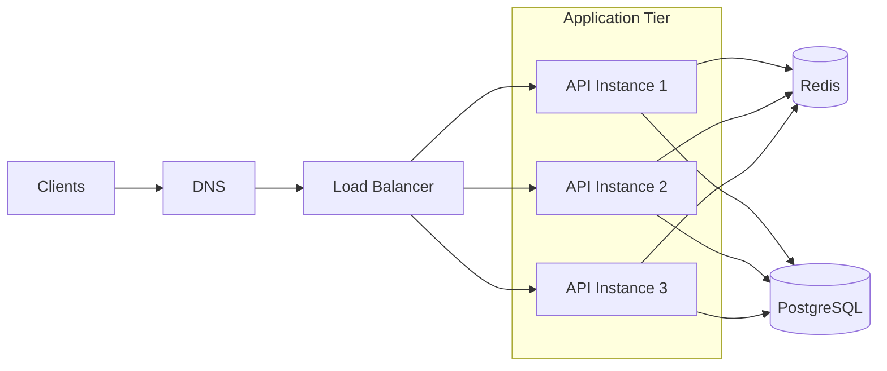
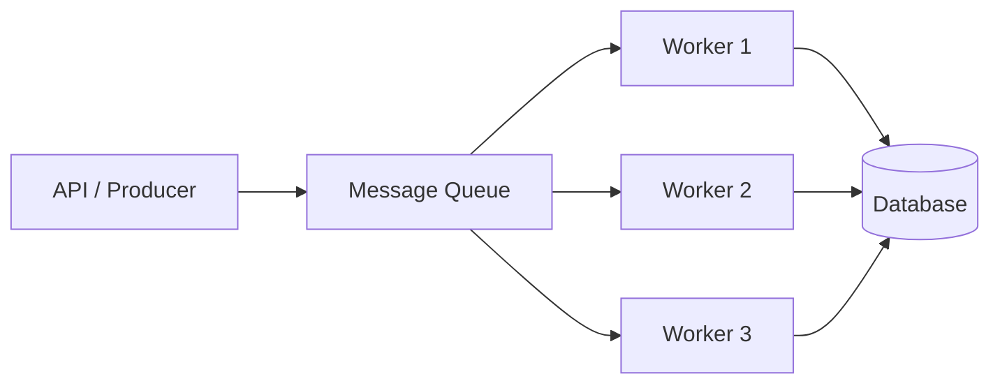
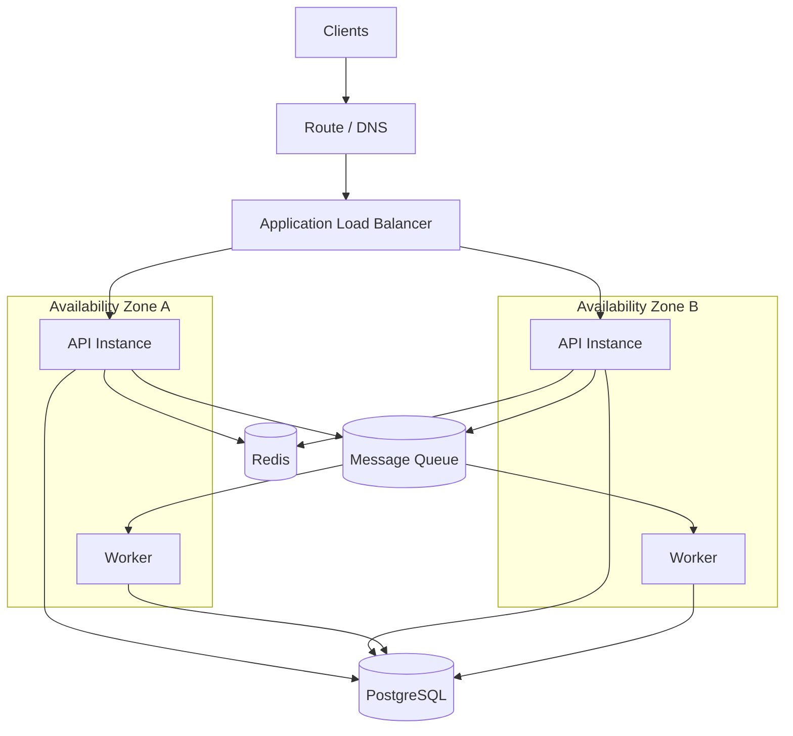

# 06- Scalability Patterns - Horizontal Scaling and Auto Scaling

## Overview

Scalability is the ability of a system to handle increasing workload without unacceptable degradation in latency, throughput, reliability, or cost.

For backend systems, scalability is not simply "adding more servers." A scalable architecture identifies which component becomes the bottleneck as demand increases and provides a controlled mechanism for increasing capacity.

Two fundamental concepts are:

- **Horizontal scaling** — increasing capacity by adding more instances or workers.
- **Auto Scaling** — automatically adjusting capacity based on workload or infrastructure conditions.

A typical AWS backend architecture looks like:

```text
                         Clients
                            |
                            v
                    Load Balancer
                            |
              +-------------+-------------+
              |             |             |
              v             v             v
           API-1         API-2         API-3
              |             |             |
              +-------------+-------------+
                            |
                 +----------+----------+
                 |                     |
                 v                     v
              Redis                PostgreSQL
```

When traffic increases:

```text
Low Traffic

Load Balancer
      |
      +----> API-1


High Traffic

Load Balancer
      |
      +----> API-1
      +----> API-2
      +----> API-3
      +----> API-4
```

The application remains logically the same while the number of compute instances changes.

This pattern is especially effective for stateless APIs built with Django, FastAPI, REST, or gRPC.

---

## Why Scalability Matters

A backend workload rarely remains constant.

Traffic can change because of:

- user growth
- marketing campaigns
- scheduled jobs
- batch workloads
- product launches
- traffic spikes
- seasonal demand
- unexpected events

A system designed for 100 requests per second may eventually need to handle:

```text
100 req/s
   |
   v
500 req/s
   |
   v
2,000 req/s
   |
   v
10,000 req/s
```

If the architecture cannot increase capacity, performance degrades.

Typical symptoms include:

- increasing latency
- request timeouts
- elevated error rates
- CPU saturation
- memory pressure
- database connection exhaustion
- queue growth
- cache pressure

Scalability is therefore closely related to reliability.

A system that cannot scale under load can become unavailable even when no infrastructure component has technically failed.

---

## Vertical vs Horizontal Scaling

There are two fundamental approaches.

### Vertical Scaling

Increase the capacity of an existing resource.

```text
Small Instance
      |
      v
Larger Instance
      |
      v
Even Larger Instance
```

For example:

```text
2 vCPU / 4 GB RAM
        |
        v
8 vCPU / 16 GB RAM
```

Advantages:

- simple
- minimal architectural change
- useful for stateful systems
- easy to understand operationally

Limitations:

- hardware/service limits
- larger failure impact
- potentially expensive
- scaling may require resource replacement
- does not inherently provide redundancy

---

### Horizontal Scaling

Increase the number of resources.

```text
Instance 1
Instance 2
Instance 3
Instance 4
```

Traffic is distributed across them.

Advantages:

- higher capacity
- redundancy
- fault isolation
- elastic scaling
- natural fit for stateless applications

Limitations:

- requires distributed-system thinking
- state must be externalized
- load balancing is required
- database capacity can become the bottleneck
- deployments become more complex

For web APIs, horizontal scaling is often the preferred long-term strategy.

---

## Horizontal Scaling Architecture

A typical production architecture is:



The load balancer distributes requests across healthy instances.

Each instance should ideally be interchangeable.

That means:

> Any healthy application instance should be able to handle any request.

This is the foundation of a scalable stateless application tier.

---

## Stateless Applications

Horizontal scaling works best when application instances are stateless.

A stateless instance does not depend on local process memory for durable user state.

Avoid:

```text
Client
  |
  v
API Instance A
  |
  +--> Local Session
  +--> Local Uploaded File
  +--> Local Application State
```

because a subsequent request may reach another instance.

Prefer:

```text
Client
  |
  v
Load Balancer
  |
  +----> API A
  +----> API B
  +----> API C
             |
             +----> Redis
             +----> PostgreSQL
             +----> Object Storage
```

State is stored in shared or durable systems.

Common examples include:

- PostgreSQL
- Redis
- Amazon S3
- DynamoDB
- external session stores
- message queues

---

## Session Management

Session state is a common obstacle to horizontal scaling.

Suppose:

```text
Request 1 --> API A
                |
                +--> Session stored locally

Request 2 --> API B
                |
                X
             Session unavailable
```

The application becomes dependent on which instance receives the request.

Better options include:

- shared session storage
- token-based authentication
- external session stores

For Django applications, session storage can be configured using a shared backend rather than relying on local process memory.

The architecture should avoid making a single application instance authoritative for user state.

---

## Sticky Sessions

A load balancer can sometimes route the same client to the same backend instance.

This is called session stickiness or sticky sessions.

```text
Client A --> API A
Client A --> API A
Client A --> API A
```

It can simplify certain legacy architectures, but it reduces the benefits of horizontal scaling.

If API A fails:

```text
Client A
   |
   X
API A
```

the client may need to be redirected and lose locally stored state.

Prefer stateless architecture where practical rather than using sticky sessions to compensate for application-state design.

---

## Auto Scaling

Auto Scaling automates capacity adjustments.

Instead of manually deciding:

```text
Traffic increased
      |
      v
Engineer notices
      |
      v
Add instances
```

the system can respond automatically:

```text
Traffic increases
      |
      v
Metric crosses threshold
      |
      v
Auto Scaling
      |
      v
New instances launched
      |
      v
Capacity increases
```

Similarly, when demand decreases:

```text
Traffic decreases
      |
      v
Metric falls
      |
      v
Instances removed
      |
      v
Cost decreases
```

This is the fundamental idea behind elastic capacity.

---

## AWS Auto Scaling

AWS provides multiple mechanisms for automatic scaling depending on the compute platform.

Common approaches include:

- EC2 Auto Scaling Groups
- ECS Service Auto Scaling
- EKS/Kubernetes autoscaling
- AWS Lambda concurrency scaling
- Application Auto Scaling for supported resources

The architecture should select the mechanism appropriate to the workload.

---

## EC2 Auto Scaling Groups

An EC2 Auto Scaling Group manages a fleet of EC2 instances.

A simplified architecture:

```text
                 Load Balancer
                      |
          +-----------+-----------+
          |           |           |
          v           v           v
       EC2-1       EC2-2       EC2-3
          \           |           /
           \          |          /
            +---------+---------+
                      |
              Auto Scaling Group
```

The Auto Scaling Group maintains the desired number of instances.

Typical configuration concepts include:

- minimum capacity
- desired capacity
- maximum capacity
- launch template
- health checks
- scaling policies
- Availability Zones

For example:

```text
Minimum = 2
Desired = 3
Maximum = 10
```

The system can scale between 2 and 10 instances based on configured policies.

---

## Minimum, Desired, and Maximum Capacity

These values define the operating boundaries.

### Minimum Capacity

The minimum number of instances that should normally remain running.

```text
min = 2
```

Useful for:

- high availability
- baseline capacity
- avoiding cold startup for critical services

### Desired Capacity

The current target capacity.

```text
desired = 4
```

### Maximum Capacity

The upper limit.

```text
max = 20
```

This is important because unlimited scaling can produce:

- uncontrolled costs
- downstream overload
- database exhaustion
- network exhaustion

Auto Scaling should therefore always be designed with sensible maximum capacity.

---

## Scaling Policies

Auto Scaling requires a mechanism for deciding when to change capacity.

Common signals include:

- CPU utilization
- request count
- request rate per target
- memory utilization
- queue depth
- latency
- custom application metrics

The best scaling metric is usually related to actual workload pressure.

CPU is useful, but CPU alone does not always represent application capacity.

---

## CPU-Based Scaling

A simple policy might target:

```text
Average CPU = 60%
```

If CPU rises above the target, additional instances can be launched.

```text
Traffic
  |
  v
CPU increases
  |
  v
Scaling policy triggered
  |
  v
New instances
  |
  v
CPU per instance decreases
```

This works well for CPU-bound workloads.

It is less useful when CPU remains low while another resource is saturated.

---

## Request-Based Scaling

For web APIs, request rate can be a better signal.

For example:

```text
Requests per target = 500 req/s
```

If traffic increases:

```text
500 req/s
   |
   v
800 req/s
   |
   v
1,200 req/s
```

the system can add application instances.

This can be more directly related to application demand than CPU utilization.

---

## Queue-Based Scaling

Background workers should often scale based on queue pressure.

```text
Producer
   |
   v
Queue
   |
   +----> Worker 1
   +----> Worker 2
```

If queue depth grows:

```text
Queue depth
     |
     v
Scaling trigger
     |
     v
More workers
     |
     v
Queue drains
```

This is especially useful for:

- Celery workers
- SQS consumers
- Kafka consumers
- background processing
- image processing
- report generation

For queue consumers, queue depth or message age can be more meaningful than CPU utilization.

---

## Target Tracking

Target tracking attempts to maintain a metric around a desired value.

For example:

```text
Target:
CPU = 50%
```

The autoscaling system adjusts capacity to maintain that approximate target.

Conceptually:

```text
CPU > 50%
   |
   v
Scale Out

CPU < 50%
   |
   v
Scale In
```

Target tracking is useful when a stable relationship exists between workload and resource utilization.

---

## Step Scaling

Step scaling applies different capacity adjustments depending on how far a metric moves beyond a threshold.

For example:

```text
CPU < 60%       -> No change
CPU 60-75%      -> +1 instance
CPU 75-90%      -> +2 instances
CPU > 90%       -> +4 instances
```

This can react more aggressively to severe workload spikes.

---

## Scheduled Scaling

Some workloads have predictable demand.

For example:

```text
08:00 -> Traffic begins increasing
09:00 -> Peak
18:00 -> Traffic decreases
22:00 -> Low traffic
```

Scheduled scaling can increase capacity before the expected peak.

This is useful for:

- business-hour workloads
- batch processing
- known campaigns
- predictable daily traffic

Scheduled scaling can be combined with reactive scaling.

---

## Predictive Scaling

Predictive mechanisms can use historical patterns to anticipate future demand.

Conceptually:

```text
Historical Traffic
        |
        v
Demand Forecast
        |
        v
Capacity Adjustment
        |
        v
Expected Traffic
```

Predictive scaling can reduce the delay associated with waiting for reactive metrics to cross thresholds.

It should complement, not replace, reactive protection.

Unexpected traffic still requires a reactive scaling mechanism.

---

## Scale Out vs Scale In

### Scale Out

Add capacity.

```text
2 instances
    |
    v
5 instances
```

### Scale In

Remove capacity.

```text
5 instances
    |
    v
2 instances
```

Scaling out should usually happen faster than scaling in.

Why?

Because excessive scale-out primarily costs money.

Aggressive scale-in can cause:

- request disruption
- cache loss
- connection churn
- cold starts
- queue processing instability
- capacity oscillation

A common production strategy is:

```text
Scale Out -> Fast
Scale In  -> Gradual
```

---

## Cooldowns and Stabilization

Scaling takes time.

Launching an instance involves:

```text
Launch
  |
  v
Boot
  |
  v
Install / Pull Image
  |
  v
Application Start
  |
  v
Health Check
  |
  v
Receive Traffic
```

If the autoscaler evaluates metrics too quickly, it may launch more instances before the previous scaling action has had time to affect traffic.

This can produce over-scaling.

Scaling systems therefore need stabilization mechanisms.

---

## Scaling Latency

Auto Scaling is not instantaneous.

For containerized applications:

```text
Scaling Signal
      |
      v
Task Launch
      |
      v
Container Startup
      |
      v
Health Check
      |
      v
Load Balancer Registration
      |
      v
Traffic Served
```

The application must survive the period before additional capacity becomes available.

This means autoscaling should not be the only resilience mechanism.

You may also need:

- queue buffering
- rate limiting
- caching
- load shedding
- pre-scaling
- sufficient baseline capacity

---

## Load Balancer Integration

Horizontal scaling requires traffic distribution.

A load balancer typically performs:

```text
Client
  |
  v
Load Balancer
  |
  +--> Healthy Instance
  +--> Healthy Instance
  +--> Healthy Instance
```

Unhealthy instances should be removed from active traffic.

A typical health-check flow is:

```text
Load Balancer
      |
      | GET /health
      v
Application
      |
      +---- 200 --> Healthy
      |
      +---- Error --> Unhealthy
```

The health endpoint should represent meaningful application health.

---

## Health Checks

Health checks operate at different levels.

### Liveness

Determines whether the process is running.

```text
Is the application process alive?
```

### Readiness

Determines whether the instance can serve traffic.

```text
Can this instance safely receive production requests?
```

This distinction is particularly important in Kubernetes and containerized environments.

An application may be alive but not ready because:

- startup initialization is incomplete
- critical dependencies are unavailable
- migrations are running
- configuration has not loaded

Traffic should generally be sent only to ready instances.

---

## Scaling and Database Bottlenecks

Horizontal application scaling does not automatically scale the database.

Suppose:

```text
2 API instances
   |
   v
PostgreSQL
```

and the application scales to:

```text
20 API instances
   |
   v
PostgreSQL
```

The database may now receive:

- more queries
- more connections
- more transactions
- more lock contention

The database can become the new bottleneck.

Therefore:

> Application scaling must always be evaluated together with database capacity.

---

## Database Connection Scaling

Suppose each application instance opens:

```text
50 database connections
```

With:

```text
2 instances = 100 connections
```

Scaling to:

```text
20 instances = 1,000 connections
```

can exhaust the database connection limit.

This is a common production scaling failure.

Solutions can include:

- connection pooling
- reducing per-instance connection limits
- database proxies
- query optimization
- read replicas
- caching
- asynchronous processing
- database scaling

For Django applications, database connection behavior should be reviewed whenever application concurrency changes.

---

## Connection Pooling

Connection pooling reuses database connections.

Without pooling:

```text
Request
  |
  v
Create DB Connection
  |
  v
Query
  |
  v
Close Connection
```

With pooling:

```text
Connection Pool
 |    |    |
 v    v    v
DB Connections

Requests borrow and return connections
```

Pooling reduces connection establishment overhead.

However, a pool must still be sized correctly.

A pool that is too large can overwhelm the database.

---

## Scaling the Cache

Redis can also become a bottleneck.

As application instances increase:

```text
API-1 \
API-2  \
API-3   ---> Redis
API-4  /
API-5 /
```

the cache receives more:

- connections
- reads
- writes
- memory pressure

Cache architecture should therefore consider:

- connection limits
- memory capacity
- eviction policy
- hot keys
- network bandwidth
- replication
- clustering where required

---

## Horizontal Scaling and Distributed State

Horizontal scaling exposes hidden state.

Common examples include:

- local filesystem
- process memory
- in-memory sessions
- local caches
- temporary files
- singleton assumptions

For example:

```python
cache = {}
```

is local to one Python process.

If the application scales to five instances:

```text
Instance A -> cache A
Instance B -> cache B
Instance C -> cache C
Instance D -> cache D
Instance E -> cache E
```

The data is not shared.

Use appropriate shared infrastructure such as Redis when shared state is actually required.

---

## Auto Scaling for Containers

Containerized applications commonly use independent scaling dimensions.

For example:

```text
ECS Service
|
+-- API Tasks
|
+-- Worker Tasks
```

The API can scale based on:

```text
Request Rate
```

while workers scale based on:

```text
Queue Depth
```

This is a major advantage of decoupled architecture.

Different workloads can scale independently.

---

## Kubernetes Autoscaling

Kubernetes provides multiple scaling mechanisms.

### Horizontal Pod Autoscaler

Adjusts the number of pods.

```text
Low Load
  |
  v
2 Pods

High Load
  |
  v
10 Pods
```

### Vertical Pod Autoscaler

Adjusts resource requests and limits based on observed usage.

### Cluster Autoscaler

Adjusts the number of nodes when pod capacity requires more infrastructure.

These mechanisms operate at different levels.

```text
Application Load
       |
       v
HPA
       |
       v
More Pods
       |
       v
Insufficient Node Capacity
       |
       v
Cluster Autoscaler
       |
       v
More Nodes
```

---

## Scaling Hierarchy

A production architecture often has multiple scaling layers.

```text
Global Traffic
      |
      v
DNS / Routing
      |
      v
Load Balancer
      |
      v
Application Scaling
      |
      v
Worker Scaling
      |
      v
Database / Cache Scaling
```

Each layer has its own bottleneck.

Scaling one layer does not guarantee end-to-end scalability.

---

## Bottleneck Analysis

A useful approach is to identify the bottleneck under increasing load.

For example:

```text
100 req/s
    |
    v
API CPU = 40%
DB CPU  = 30%

500 req/s
    |
    v
API CPU = 70%
DB CPU  = 60%

1,000 req/s
    |
    v
API CPU = 75%
DB CPU  = 98%
```

At 1,000 requests per second, scaling API instances may provide little benefit because the database is saturated.

The next architectural improvement should address the database bottleneck.

This is why scalability testing should measure the entire request path.

---

## Queue-Based Scaling

Queues can absorb temporary workload spikes.



If the producer rate increases:

```text
Producer = 10,000 msg/s
Worker capacity = 5,000 msg/s
```

the queue absorbs the difference temporarily.

However:

> A queue absorbs bursts; it does not solve a permanent throughput mismatch.

If the producer consistently generates more work than the workers can process, the queue will continue growing.

---

## Auto Scaling and Backpressure

Auto scaling should work together with backpressure.

Consider:

```text
Traffic Spike
     |
     v
Queue Growth
     |
     v
Worker Autoscaling
     |
     v
Worker Capacity Increases
     |
     v
Queue Drains
```

If the dependency behind the worker can only handle limited concurrency, unrestricted worker scaling can make the system worse.

Therefore worker autoscaling should respect downstream capacity.

This is where the earlier resilience patterns become important:

- bulkheads
- circuit breakers
- retries
- backoff
- DLQs

Scalability and resilience are tightly connected.

---

## Scaling and Failure Isolation

Scaling too aggressively can cause cascading failures.

Example:

```text
Traffic Spike
    |
    v
Auto Scaling
    |
    v
100 API Instances
    |
    v
10,000 DB Connections
    |
    v
Database Exhausted
    |
    v
API Errors
```

The autoscaler successfully increased API capacity but caused the database to fail.

This is why maximum capacity must be designed around downstream constraints.

---

## Auto Scaling Limits

Every autoscaling policy should define boundaries.

For example:

```text
Minimum = 2
Desired = 4
Maximum = 20
```

The maximum should be based on:

- database capacity
- downstream API limits
- account/service quotas
- network capacity
- cost limits
- expected workload
- business requirements

Maximum capacity is a safety mechanism.

It prevents a runaway scaling policy from becoming a runaway cost or dependency outage.

---

## Scaling Policies Should Be Observable

Important metrics include:

### Application

- request rate
- p50 latency
- p95 latency
- p99 latency
- error rate
- CPU
- memory

### Infrastructure

- instance count
- task count
- pod count
- health-check failures
- scaling events

### Database

- CPU
- connections
- query latency
- locks
- I/O
- replication lag

### Queue

- queue depth
- message age
- consumer throughput
- consumer lag

A scaling dashboard should make it possible to correlate:

```text
Traffic
  |
  +--> Instance Count
  |
  +--> Latency
  |
  +--> Error Rate
  |
  +--> Database Load
  |
  +--> Queue Depth
```

---

## Scaling Oscillation

Poorly configured autoscaling can cause repeated scale-out and scale-in cycles.

```text
Scale Out
   |
   v
Load decreases
   |
   v
Scale In
   |
   v
Load increases
   |
   v
Scale Out
   |
   v
...
```

This is often called scaling oscillation or thrashing.

Causes include:

- thresholds too close together
- aggressive scale-in
- insufficient stabilization
- noisy metrics
- scaling based on inappropriate signals

Use:

- stabilization windows
- cooldown periods
- asymmetric scale-out/scale-in policies
- appropriate metric aggregation

---

## Warm-Up Time

New instances are not immediately productive.

For a Dockerized Python application:

```text
Launch Container
      |
      v
Pull Image
      |
      v
Start Python
      |
      v
Initialize Django / FastAPI
      |
      v
Connect to Dependencies
      |
      v
Health Check
      |
      v
Receive Traffic
```

The autoscaling system should account for this startup delay.

If startup takes 60 seconds and traffic increases dramatically in 10 seconds, reactive scaling alone may be too slow.

Possible solutions include:

- higher baseline capacity
- scheduled scaling
- predictive scaling
- faster container startup
- queue buffering
- caching
- load shedding

---

## Deployment Considerations

Auto Scaling interacts directly with deployments.

A deployment can cause:

```text
Old Instances
      |
      v
Terminated
      |
      v
New Instances
      |
      v
Startup
      |
      v
Traffic
```

If too many instances are removed simultaneously, capacity can temporarily drop.

Production deployments should therefore account for:

- minimum healthy capacity
- rolling deployment limits
- health checks
- startup time
- graceful shutdown
- connection draining
- database migrations

Autoscaling should not accidentally amplify deployment risk.

---

## Graceful Shutdown

A horizontally scaled application must handle instance termination safely.

When an instance is removed:

```text
Load Balancer
     |
     X
Instance marked draining
     |
     v
Stop receiving new requests
     |
     v
Finish active requests
     |
     v
Shutdown
```

For background workers:

```text
Worker
  |
  v
Stop accepting new work
  |
  v
Finish / safely release current work
  |
  v
Shutdown
```

Without graceful shutdown, scaling in can interrupt requests or background processing.

---

## Security Considerations

Scaling should preserve security controls.

Every new instance, container, or pod should receive:

- correct IAM permissions
- correct security groups
- correct network policies
- correct secrets
- correct configuration

Do not treat automatically created infrastructure as trusted merely because it was created by an autoscaling system.

Infrastructure definitions should be immutable and version-controlled where practical.

---

## Cost Considerations

Horizontal scaling increases resource count.

If one instance costs:

```text
$X / hour
```

then ten instances cost approximately:

```text
10X / hour
```

Auto Scaling can reduce cost during low demand, but poor configuration can increase costs through:

- excessive maximum capacity
- aggressive scale-out
- slow scale-in
- unnecessary baseline capacity
- instance startup churn
- overprovisioned resources

Cost metrics should be monitored alongside performance metrics.

---

## Common Mistakes

### Assuming More Instances Always Improve Performance

If the database is saturated:

```text
10 API instances
      |
      v
Database at 100%
```

adding 20 more API instances may increase database pressure rather than improve throughput.

Always identify the actual bottleneck.

---

### Scaling Based Only on CPU

A backend can be constrained by:

- database connections
- network bandwidth
- external APIs
- queue depth
- memory
- lock contention

CPU is only one signal.

---

### Keeping Application State in Memory

Local process state does not automatically scale across instances.

Use shared infrastructure for state that must survive instance changes.

---

### Unlimited Maximum Capacity

Unlimited scaling can create:

- unexpected costs
- downstream overload
- connection exhaustion
- API throttling

Always define safe upper bounds.

---

### Aggressive Scale-In

Removing capacity too quickly can cause:

- dropped connections
- interrupted requests
- queue processing instability
- repeated scale-out

Scale-in should generally be more conservative than scale-out.

---

### Ignoring Startup Time

If a new instance takes two minutes to become healthy, autoscaling cannot immediately solve a traffic spike.

Account for warm-up time.

---

### Scaling Without Load Testing

Autoscaling policies should be validated under realistic traffic.

Test:

- normal traffic
- gradual growth
- sudden spikes
- sustained high load
- recovery
- scale-in
- dependency degradation

---

### Scaling Every Layer Independently

Independent scaling policies can interact badly.

For example:

```text
API scales out
   |
   v
More DB connections
   |
   v
Database overload
   |
   v
API latency increases
   |
   v
API scales out again
```

This feedback loop can destabilize the system.

---

## Production Scalability Strategy

A practical scalability strategy can follow this sequence:

1. Measure the workload.
2. Identify the current bottleneck.
3. Determine whether the bottleneck is CPU, memory, I/O, database, network, or dependency capacity.
4. Make the application stateless where practical.
5. Introduce horizontal scaling for appropriate workloads.
6. Put a load balancer in front of scalable application instances.
7. Define minimum, desired, and maximum capacity.
8. Select scaling metrics that represent real workload pressure.
9. Account for instance startup and shutdown time.
10. Protect downstream dependencies with capacity limits.
11. Monitor scaling behavior and downstream health.
12. Validate the architecture with load and failure testing.

---

## Production Architecture Example

A scalable Django or FastAPI backend might look like:



Scaling policies can operate independently:

```text
API:
Request rate / latency
        |
        v
API Auto Scaling

Workers:
Queue depth / message age
        |
        v
Worker Auto Scaling
```

This architecture allows synchronous and asynchronous workloads to scale independently.

---

## Scalability Testing

A scalable architecture should be validated empirically.

A basic load-testing progression might be:

```text
100 req/s
   |
   v
500 req/s
   |
   v
1,000 req/s
   |
   v
2,000 req/s
   |
   v
5,000 req/s
```

Measure:

- throughput
- p50 latency
- p95 latency
- p99 latency
- error rate
- CPU
- memory
- database utilization
- cache utilization
- connection count
- queue depth
- scaling events

The objective is to identify the point where the system stops scaling linearly.

---

## Scaling Efficiency

An important senior-level concept is scaling efficiency.

Suppose:

```text
2 instances -> 1,000 req/s
4 instances -> 1,900 req/s
8 instances -> 2,000 req/s
```

The first scaling step is effective.

The second provides diminishing returns.

This suggests another component has become the bottleneck.

A system is not horizontally scalable simply because the number of instances can increase.

The architecture should determine how throughput changes as capacity increases.

---

## Linear vs Non-Linear Scaling

Idealized linear scaling:

```text
Instances   Throughput

1           500 req/s
2           1,000 req/s
4           2,000 req/s
8           4,000 req/s
```

Real systems often look more like:

```text
Instances   Throughput

1           500 req/s
2           950 req/s
4           1,700 req/s
8           2,400 req/s
```

The difference comes from shared bottlenecks such as:

- databases
- caches
- network
- locks
- coordination
- external dependencies

Senior engineers should understand where scalability stops being linear and why.

---

## Interview Perspective

A common interview question is:

> "How would you scale a Django or FastAPI API from 100 requests per second to 10,000 requests per second?"

A strong answer should not begin with "add more EC2 instances."

A better approach is:

```text
Measure Current Workload
        |
        v
Identify Bottleneck
        |
        v
Stateless Application
        |
        v
Load Balancer
        |
        v
Horizontal Application Scaling
        |
        +----> Redis / Cache
        |
        +----> Database Optimization
        |
        +----> Async Processing
        |
        +----> Queue-Based Workers
        |
        v
Autoscaling
        |
        v
Load Testing
```

The answer should also address:

- database connection limits
- caching
- asynchronous processing
- queue scaling
- downstream dependencies
- observability
- failure isolation
- autoscaling limits
- cost

The important distinction is:

> Scaling the application tier is only one part of scaling the system.

---

## Senior-Level Scaling Questions

When evaluating a scalable architecture, ask:

- What is the current bottleneck?
- Can the application scale horizontally?
- Is application state externalized?
- What happens when traffic increases faster than autoscaling can react?
- What is the maximum safe application capacity?
- Can the database handle the resulting connection and query load?
- Can Redis handle the additional traffic?
- Can external dependencies handle the increased request rate?
- Which workloads should scale independently?
- What happens during scale-in?
- How long does a new instance take to become healthy?
- What happens during a sudden traffic spike?
- What happens when a dependency is already overloaded?
- How does scaling interact with retries and circuit breakers?
- What is the cost of maximum capacity?
- How has the scaling behavior been validated?

These questions shift scalability from infrastructure configuration to system-level engineering.

## Key Takeaways

- Horizontal scaling increases capacity by adding instances or workers, but it works best when application state is externalized and workloads are designed to be independently scalable.
- Auto Scaling should use workload-relevant signals such as request rate, latency, queue depth, or custom metrics rather than relying blindly on CPU utilization.
- Scaling the application tier does not automatically scale databases, caches, networks, or downstream dependencies; every layer must be evaluated for bottlenecks and capacity limits.
- Production autoscaling requires bounded capacity, graceful scale-in, startup-time awareness, stabilization, observability, and protection against runaway scaling.
- True scalability is demonstrated through measured throughput and latency as capacity increases, not merely by the ability to launch more instances.