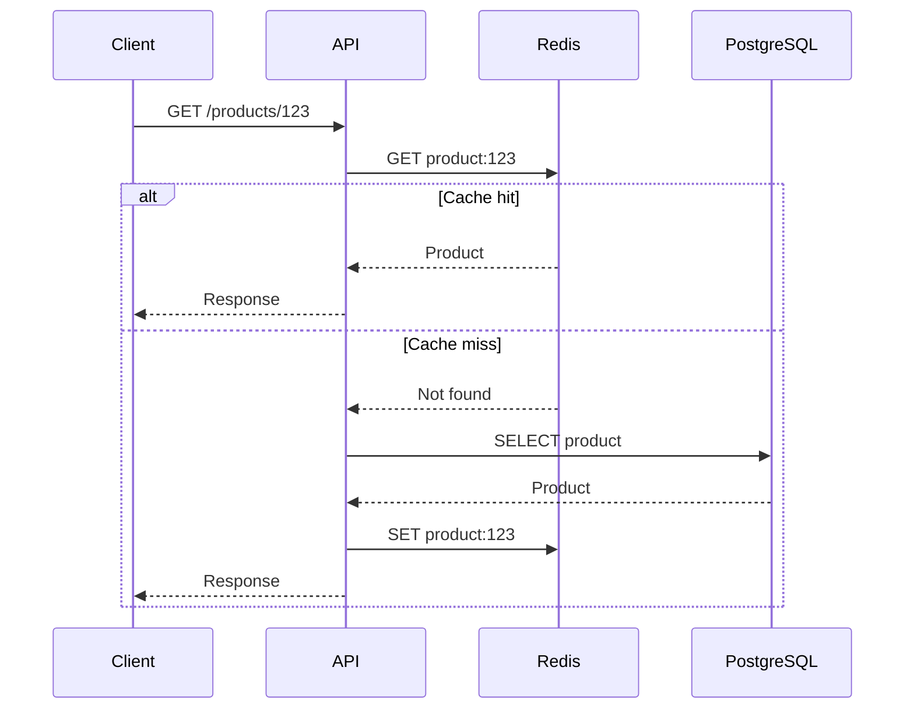
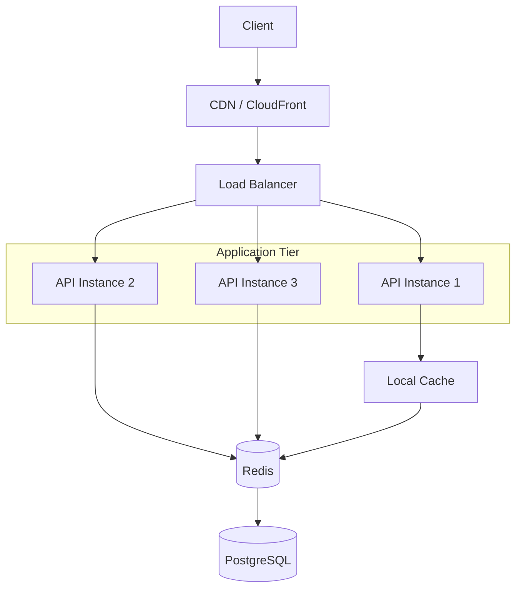

# 07- Scalability Patterns - Caching Strategies

## Overview

Caching is one of the most effective techniques for improving backend performance and reducing pressure on expensive resources.

A cache stores data that can be reused so that subsequent requests do not need to repeatedly execute the original expensive operation.

A typical request path without caching is:

```text
Client
  |
  v
API
  |
  v
PostgreSQL
  |
  v
Response
```

With caching:

```text
Client
  |
  v
API
  |
  v
Redis
  |
  +---- Cache Hit ------> Response
  |
  +---- Cache Miss
           |
           v
       PostgreSQL
           |
           v
        Redis
           |
           v
       Response
```

Caching can reduce:

- database queries
- external API calls
- CPU-intensive computation
- network latency
- application latency
- infrastructure cost

However, caching introduces another form of complexity: **stale data and cache consistency**.

The central engineering trade-off is:

> Caching exchanges computation and latency for memory, complexity, and potential staleness.

A good caching strategy therefore starts with understanding the data's access pattern and consistency requirements rather than simply adding Redis to the architecture.

---

## Why Caching Exists

Consider an API endpoint:

```http
GET /products/123
```

Suppose the endpoint:

1. Queries PostgreSQL.
2. Joins several tables.
3. Performs serialization.
4. Returns the product.

If the same product is requested 10,000 times per minute, executing the same database work 10,000 times may be unnecessary.

Without caching:

```text
10,000 requests
      |
      v
10,000 database queries
```

With caching:

```text
10,000 requests
      |
      v
Redis
      |
      +---- 9,950 cache hits
      |
      +---- 50 cache misses
                  |
                  v
             PostgreSQL
```

The database workload can decrease dramatically.

---

## What Makes a Good Cache Candidate?

Not every piece of data should be cached.

Good candidates often have:

- high read frequency
- relatively low write frequency
- expensive computation
- expensive database queries
- predictable access patterns
- tolerance for some staleness

Examples:

- product catalog data
- configuration
- feature flags
- frequently accessed user profiles
- API responses
- permissions
- expensive aggregations
- reference data

Poor candidates often include:

- highly volatile data
- data requiring strict real-time consistency
- very large objects with low reuse
- data with almost no repeated access

The decision should be based on measurable access patterns.

---

## Cache Hit and Cache Miss

A **cache hit** occurs when requested data exists in the cache.

```text
Request
  |
  v
Cache
  |
  +---- Found ----> Return cached value
```

A **cache miss** occurs when the requested data is not present.

```text
Request
  |
  v
Cache
  |
  +---- Not Found
           |
           v
        Database
           |
           v
       Populate Cache
           |
           v
        Response
```

A basic cache-hit ratio is:

```text
Cache Hit Ratio =
Cache Hits / Total Cache Requests
```

For example:

```text
Hits  = 9,000
Misses = 1,000

Hit Ratio = 90%
```

A high hit ratio generally means the cache is serving a significant portion of requests.

However, the correct target depends on the workload.

---

## Cache Hit Ratio Is Not the Only Metric

A high cache-hit ratio does not automatically mean the caching architecture is good.

Consider:

```text
Cache Hit Ratio = 99%
```

but:

```text
Cache latency = 200 ms
```

The cache may still provide poor performance.

Useful cache metrics include:

- hit ratio
- miss ratio
- latency
- eviction rate
- memory utilization
- connection count
- command throughput
- hot-key frequency
- stale-data rate
- cache population failures

Caching should be evaluated as part of the complete request path.

---

## Cache-Aside Pattern

The most common application-level caching strategy is **cache-aside**, also called lazy caching.

The application controls both reading and populating the cache.



The typical implementation is:

```python
import json

from django.core.cache import cache

CACHE_TTL = 300


def get_product(product_id: int):
    key = f"product:{product_id}"

    cached = cache.get(key)

    if cached is not None:
        return cached

    product = load_product_from_database(product_id)

    cache.set(
        key,
        product,
        timeout=CACHE_TTL,
    )

    return product
```

Cache-aside is popular because it is simple and gives the application explicit control.

---

## Advantages of Cache-Aside

- simple implementation
- application controls what is cached
- cache failure does not necessarily prevent database access
- easy to introduce incrementally
- suitable for read-heavy workloads

## Limitations of Cache-Aside

- first request after expiration is slower
- application must implement cache logic
- invalidation becomes an application responsibility
- concurrent misses can cause duplicate database queries
- stale data can exist until invalidation or expiration

Cache-aside is usually a strong default for backend APIs.

---

## Write-Through Cache

With write-through caching, writes update the cache as part of the write path.

Conceptually:

```text
Application
    |
    v
Cache
    |
    v
Database
```

A write may look like:

```text
Update Request
     |
     v
Cache
     |
     v
Database
```

The goal is to keep cached data synchronized with database writes.

Advantages:

- cache is populated proactively
- reads after writes can hit cache
- can reduce cache-miss penalties

Limitations:

- write latency may increase
- cache becomes part of the write path
- more complex failure handling
- not every data access pattern benefits from it

---

## Write-Back Cache

Write-back, or write-behind caching, allows the application to write to the cache first and persist to the database later.

```text
Application
    |
    v
Cache
    |
    | asynchronous persistence
    v
Database
```

This can reduce write latency and absorb high write rates.

However, it introduces significant consistency and durability complexity.

Potential failure:

```text
Application
    |
    v
Cache
    |
    X
Database write never completed
```

If the cached state is lost before persistence, data can be lost.

Write-back strategies should therefore be used only when the workload and durability model explicitly justify the complexity.

---

## Read-Through Cache

With read-through caching, the cache itself is responsible for loading missing data.

Conceptually:

```text
Application
    |
    v
Cache
    |
    +---- Hit ------> Data
    |
    +---- Miss
            |
            v
        Data Store
```

The application does not necessarily implement the database lookup itself.

This can simplify application code when the caching infrastructure supports the required behavior.

---

## Caching Strategy Comparison

| Strategy | Read Path | Write Path | Complexity | Typical Use |
|---|---|---|---|---|
| Cache-aside | App checks cache | App writes DB/cache separately | Low | General APIs |
| Read-through | Cache loads data | Depends on implementation | Medium | Managed caching systems |
| Write-through | Cache participates in write | Cache + DB | Medium | Frequently read data |
| Write-back | Cache first | Async persistence | High | High-write workloads |
| Refresh-ahead | Cache proactively refreshes | Normal | Medium/High | Predictable hot data |

For most Django and FastAPI APIs, cache-aside is a practical starting point.

---

## TTL

A **Time To Live (TTL)** determines how long an item remains cached.

For example:

```text
SET product:123 value EX 300
```

The cached value expires after approximately five minutes.

TTL prevents cached data from remaining indefinitely.

The appropriate TTL depends on:

- data volatility
- business requirements
- acceptable staleness
- cache size
- access frequency

Examples:

| Data | Possible TTL |
|---|---:|
| Static configuration | Hours |
| Product catalog | Minutes |
| User profile | Minutes |
| Authentication metadata | Short |
| Exchange rates | Minutes |
| Feature flags | Seconds/Minutes |
| Highly volatile state | Very short or no cache |

These are starting points, not universal values.

---

## TTL Trade-Off

Long TTL:

```text
+ Higher hit ratio
+ Lower database load
- Greater staleness
```

Short TTL:

```text
+ Fresher data
- More cache misses
- More database traffic
```

The correct TTL is a business and workload decision.

---

## Explicit Invalidation

Instead of relying only on TTL, the application can invalidate cache entries when data changes.

For example:

```text
Update Product
     |
     v
PostgreSQL updated
     |
     v
Delete product:123
```

The next read becomes a cache miss and repopulates the cache.

In Django:

```python
from django.core.cache import cache


def update_product(product):
    product.save()

    cache.delete(f"product:{product.pk}")
```

Explicit invalidation provides fresher data but creates another consistency path that must be maintained correctly.

---

## TTL vs Explicit Invalidation

| Approach | Freshness | Complexity | Failure Risk |
|---|---|---|---|
| TTL only | Eventual | Low | Stale data |
| Explicit invalidation | Better | Medium | Missed invalidation |
| TTL + invalidation | Stronger practical behavior | Medium | More moving parts |
| No cache | Real-time DB state | Low | Higher DB load |

A common production approach is:

> Use explicit invalidation for important writes and TTL as a safety mechanism.

This ensures that a missed invalidation does not leave data cached forever.

---

## Cache Stampede

A cache stampede occurs when many requests simultaneously encounter an expired or missing cache entry.

Suppose:

```text
Cache expires
     |
     v
10,000 requests
     |
     +--> Request 1 --> DB
     +--> Request 2 --> DB
     +--> Request 3 --> DB
     +--> ...
     +--> Request 10,000 --> DB
```

The cache has failed precisely when the system needs it most.

This can overload the database.

---

## Preventing Cache Stampede

Several techniques can help.

### Request Coalescing

Only one request performs the expensive database operation.

```text
10,000 requests
      |
      v
Lock
      |
      +---- Request 1 --> DB
      |
      +---- Others wait
```

After the cache is populated, waiting requests read the cached value.

### Distributed Lock

Redis can coordinate access across application instances.

```text
Instance A ----+
               |
Instance B ----+--> Redis Lock
               |
Instance C ----+
```

### Probabilistic Early Refresh

Refresh popular entries before they actually expire.

### TTL Jitter

Instead of assigning identical TTLs:

```text
TTL = 300 seconds
```

use small randomized variations:

```text
TTL = 285-315 seconds
```

This reduces synchronized expiration.

---

## Cache Penetration

Cache penetration occurs when requests repeatedly ask for data that does not exist.

For example:

```text
GET /users/999999999
```

If the user does not exist:

```text
Cache miss
   |
   v
Database
   |
   v
Not found
```

Every request can repeatedly hit the database.

A common solution is **negative caching**.

```text
user:999999999 -> NOT_FOUND
```

with a short TTL.

This prevents repeated database lookups for known-invalid identifiers.

---

## Cache Avalanche

A cache avalanche occurs when a large number of cache entries expire or become unavailable at approximately the same time.

```text
Millions of cache entries
          |
          v
Simultaneous expiration
          |
          v
Millions of DB requests
          |
          v
Database overload
```

Mitigation strategies include:

- TTL jitter
- staggered expiration
- proactive refresh
- capacity planning
- request coalescing
- database protection
- graceful degradation

---

## Hot Keys

A hot key is a cache entry accessed disproportionately often.

For example:

```text
product:popular-item
```

might receive millions of requests.

A single Redis node can become a bottleneck if traffic for a hot key becomes extreme.

Potential mitigations include:

- local in-process caching
- replication
- key distribution strategies
- request coalescing
- cached response at CDN layer
- reducing unnecessary repeated reads

Hot-key analysis becomes increasingly important at high scale.

---

## Cache Key Design

Cache keys should be:

- deterministic
- unique
- understandable
- versionable
- appropriately scoped

Prefer:

```text
product:v1:123
```

over:

```text
123
```

The namespace prevents collisions.

For multi-tenant systems:

```text
tenant:42:product:v1:123
```

This prevents data from one tenant from accidentally being returned to another.

---

## Cache Key Versioning

Changing the cached data structure can create compatibility problems.

Suppose:

```text
product:v1:123
```

stores an old representation.

A new application version can use:

```text
product:v2:123
```

This avoids having to understand old cached values.

Versioning is particularly useful during deployments where multiple application versions may temporarily run simultaneously.

---

## Cache Serialization

Objects need to be serialized before being stored in many caching systems.

Common formats include:

- JSON
- MessagePack
- Protocol Buffers
- Python-specific serialization

JSON is easy to inspect and interoperable:

```json
{
  "id": 123,
  "name": "Keyboard",
  "price": 99.99
}
```

Binary formats can reduce payload size and serialization overhead but introduce additional complexity.

Avoid storing arbitrary Python objects in a shared cache when portability and security matter.

---

## Redis as a Backend Cache

Redis is commonly used because it provides:

- in-memory access
- low latency
- TTL support
- atomic operations
- data structures
- replication
- persistence options
- high throughput

A typical architecture is:

```text
Django / FastAPI
       |
       v
Redis
       |
       v
PostgreSQL
```

Redis should generally be treated as a performance layer rather than the authoritative source of truth unless the architecture explicitly defines otherwise.

---

## Django Cache Example

Django can abstract cache access through its cache framework.

A production configuration can use Redis as the backend.

```python
CACHES = {
    "default": {
        "BACKEND": "django.core.cache.backends.redis.RedisCache",
        "LOCATION": "redis://redis:6379/1",
        "TIMEOUT": 300,
    },
}
```

Application code can then use:

```python
from django.core.cache import cache


def get_product(product_id: int):
    key = f"product:v1:{product_id}"

    value = cache.get(key)

    if value is not None:
        return value

    value = load_product(product_id)

    cache.set(key, value, timeout=300)

    return value
```

The exact Redis connection configuration should be externalized through environment-specific configuration.

---

## FastAPI and Redis

FastAPI applications commonly use an async Redis client.

Conceptually:

```text
FastAPI
   |
   v
Redis Async Client
   |
   v
Redis
```

A typical pattern is:

```python
from redis.asyncio import Redis

redis = Redis.from_url(
    "redis://redis:6379/0",
    decode_responses=True,
)


async def get_product(product_id: int):
    key = f"product:v1:{product_id}"

    cached = await redis.get(key)

    if cached is not None:
        return cached

    product = await load_product(product_id)

    await redis.set(
        key,
        product,
        ex=300,
    )

    return product
```

In production, connection lifecycle, serialization, pooling, timeouts, and failure handling should be managed explicitly.

---

## Cache Failure Strategy

A cache should not automatically become a single point of application failure.

Consider:

```text
API
 |
 v
Redis
 |
 X
Redis unavailable
```

The application may be able to fall back to the database:

```text
Redis unavailable
      |
      v
Database
      |
      v
Response
```

However, this creates a serious risk if all application instances simultaneously fall back to the database.

Therefore cache failure should be combined with:

- database capacity protection
- rate limiting
- circuit breakers
- request coalescing
- degraded responses
- controlled retries

The cache itself should not become the cause of a database outage.

---

## Cache Failure and Circuit Breakers

A circuit breaker can protect a cache dependency when appropriate.

For example:

```text
API
 |
 v
Redis
 |
 X
Repeated failures
 |
 v
Circuit Open
 |
 v
Fallback
```

However, bypassing Redis should be carefully designed.

If the cache normally handles:

```text
99% of reads
```

and suddenly all requests hit PostgreSQL, the fallback path must be capable of surviving that load.

A fallback path is only useful if it is capacity-aware.

---

## Local Cache vs Distributed Cache

A backend service can use two cache layers.

```text
Request
   |
   v
Local Memory Cache
   |
   +---- Hit --> Response
   |
   +---- Miss
          |
          v
       Redis
          |
          +---- Hit --> Response
          |
          +---- Miss
                 |
                 v
             PostgreSQL
```

### Local Cache

Advantages:

- extremely low latency
- no network hop
- reduces Redis traffic

Limitations:

- per-process
- inconsistent between instances
- limited memory
- lost on process restart

### Distributed Cache

Advantages:

- shared across instances
- larger centralized capacity
- consistent access path

Limitations:

- network latency
- dependency on Redis/cache infrastructure
- operational complexity

A two-level cache can be powerful but adds consistency complexity.

---

## CDN Caching

Caching does not have to happen inside the application.

For public HTTP content:

```text
Client
  |
  v
CDN
  |
  +---- Cache Hit --> Response
  |
  +---- Cache Miss
          |
          v
      Load Balancer
          |
          v
        API
```

CDNs are particularly effective for:

- static assets
- images
- public API responses
- documentation
- JavaScript/CSS
- cacheable content

AWS CloudFront is a common example.

CDN caching can reduce requests reaching the application tier altogether.

---

## HTTP Caching

HTTP provides caching mechanisms through headers.

Example:

```http
Cache-Control: public, max-age=300
ETag: "abc123"
```

A client or intermediary can reuse the response for the specified period.

Conditional requests can use:

```http
If-None-Match: "abc123"
```

The server may respond:

```http
304 Not Modified
```

This can reduce payload transfer and application work.

---

## Cache-Control Considerations

Important directives include:

| Directive | Meaning |
|---|---|
| `public` | Response can be cached by shared caches |
| `private` | Intended for private client-side caching |
| `no-cache` | Requires revalidation before reuse |
| `no-store` | Do not store the response |
| `max-age` | Freshness lifetime |
| `s-maxage` | Shared-cache freshness lifetime |

Never mark sensitive user-specific responses as publicly cacheable.

For example:

```http
Cache-Control: private, no-store
```

may be appropriate for highly sensitive responses.

Caching mistakes can become security vulnerabilities.

---

## Caching Authorization-Sensitive Data

Suppose:

```http
GET /profile
```

returns user-specific information.

A dangerous cache key is:

```text
profile
```

because different users could receive the same cached value.

A safer key might be:

```text
profile:user:123
```

The cache key must include every dimension that affects the response.

For example:

```text
tenant
user
locale
permissions
API version
resource ID
```

A general rule is:

> If two requests can legitimately produce different responses, their cache keys must distinguish them.

---

## Cache Consistency

Caching introduces another copy of the data.

Now the system has:

```text
PostgreSQL
     |
     +---- Source of Truth
     |
     +---- Redis Copy
```

The copies can diverge.

Suppose:

```text
Database:
price = 100

Redis:
price = 100
```

The database is updated:

```text
Database:
price = 120

Redis:
price = 100
```

The cache is stale.

The architecture must define how stale data is handled.

---

## Cache Consistency Models

Common approaches include:

### Stronger Consistency

Invalidate or update the cache immediately after successful writes.

### Eventual Consistency

Allow the cache to remain stale for a bounded period.

### Time-Based Consistency

Use TTL to define the maximum expected staleness.

For many backend APIs, eventual consistency is acceptable for read-heavy data.

For financial balances, authorization decisions, or inventory availability, stronger consistency may be required.

---

## Cache Invalidation Patterns

Cache invalidation is one of the hardest parts of caching.

Common approaches include:

```text
Write DB
   |
   v
Invalidate Cache
```

or:

```text
Write DB
   |
   v
Publish Event
   |
   v
Cache Invalidation Consumer
   |
   v
Invalidate Cache
```

Event-driven invalidation can decouple the write path but introduces eventual consistency.

For example:

```text
Django
  |
  v
PostgreSQL
  |
  v
Kafka
  |
  v
Cache Invalidation Worker
  |
  v
Redis
```

The right design depends on the required consistency window.

---

## Cache Invalidation Race Condition

Consider:

```text
Request A reads old database value
Request B updates database
Request B deletes cache
Request A writes old value into cache
```

The cache now contains stale data even though invalidation occurred.

This can happen in cache-aside architectures.

Mitigation strategies include:

- careful write ordering
- versioned values
- transactional event patterns
- delayed invalidation
- write-through approaches
- distributed locking where justified

The correct solution depends on the application's consistency requirements.

---

## Cache Stampede Protection With Locks

A distributed lock can ensure only one worker repopulates a missing key.

Conceptually:

```text
Cache Miss
   |
   v
Acquire Lock
   |
   +---- Lock acquired
   |       |
   |       v
   |      DB
   |       |
   |       v
   |      Cache
   |
   +---- Lock unavailable
           |
           v
       Wait / Retry
```

Redis supports atomic primitives that can be used to implement locking.

However, distributed locks introduce their own failure modes and should not be added casually.

For many workloads, TTL jitter and request coalescing are sufficient.

---

## Cache Warming

Cache warming means populating frequently accessed data before it is requested.

For example:

```text
Deployment
   |
   v
Warm frequently accessed keys
   |
   v
Traffic begins
   |
   v
High cache-hit ratio
```

This can reduce cold-start load after:

- deployments
- cache restarts
- failovers
- scaling events

Cache warming is useful when the hot dataset is predictable.

---

## Cache Preloading

For known reference data:

```text
Application Startup
      |
      v
Load configuration
      |
      v
Populate Redis
```

However, avoid having every application instance independently perform expensive cache warming.

With ten instances:

```text
10 instances
    |
    +--> 10 identical DB queries
```

A coordinated warming process may be more efficient.

---

## Cache Eviction

Memory is finite.

When Redis reaches its configured memory constraints, entries may be evicted depending on the configured eviction policy.

Common strategies include:

- least recently used
- least frequently used
- TTL-oriented eviction
- no eviction

The correct policy depends on workload semantics.

Cache eviction should be treated as normal behavior unless the architecture requires every cached item to remain available.

---

## Cache Eviction and Application Correctness

The application should normally remain correct when a cache entry disappears.

This is a critical design principle.

If:

```text
Redis key deleted
```

causes:

```text
Application failure
```

then the cache is no longer merely a performance layer.

For cache-aside architectures:

```text
Cache unavailable
      |
      v
Read from source of truth
```

should generally remain possible when the workload can tolerate the additional load.

---

## Caching Expensive Computation

Caching is not limited to database results.

For example:

```text
Input
  |
  v
Expensive Calculation
  |
  v
Result
```

The result can be cached:

```text
Input
  |
  v
Cache
  |
  +---- Hit --> Result
  |
  +---- Miss
          |
          v
      Calculation
          |
          v
        Cache
```

This is useful for:

- reports
- aggregations
- recommendation results
- permissions
- feature evaluation
- expensive serialization

The cache key should incorporate all inputs that affect the computation.

---

## Caching External API Responses

External API calls are another strong cache candidate when the data tolerates staleness.

```text
Application
   |
   v
Redis
   |
   +---- Hit --> Response
   |
   +---- Miss
          |
          v
     External API
          |
          v
        Redis
```

This can reduce:

- network latency
- external API costs
- rate-limit pressure
- dependency load

The TTL should reflect how frequently the external data changes.

---

## Cache and Rate Limits

Caching can protect a rate-limited dependency.

Suppose:

```text
External API:
1,000 requests/minute
```

Without caching:

```text
10,000 application requests
       |
       v
10,000 external API calls
       |
       v
Rate limit exceeded
```

With caching:

```text
10,000 application requests
       |
       v
Redis
       |
       +---- Most requests served from cache
       |
       +---- Limited external API calls
```

Caching can therefore function as a dependency-protection mechanism.

---

## Cache and Security

Caching can introduce serious security problems.

Potential issues include:

- cross-user data leakage
- cross-tenant data leakage
- stale authorization
- sensitive data retention
- insecure cache access
- cache poisoning

Cache keys and cacheability rules must be designed with security boundaries in mind.

Never assume:

```text
Same endpoint = Same response
```

The response may depend on:

- identity
- permissions
- tenant
- locale
- feature flags

All relevant dimensions must be considered.

---

## Cache Poisoning

Cache poisoning occurs when incorrect or malicious data becomes stored in a cache and is subsequently served to other requests.

Potential causes include:

- unsafe cache keys
- untrusted input incorporated into cache behavior
- incorrect authorization handling
- cache-control mistakes
- shared-cache configuration errors

Validate data and ensure cache keys accurately represent request context.

---

## Monitoring Redis

Useful Redis metrics include:

```text
Memory Usage
Evictions
Hit Rate
Miss Rate
Commands/sec
Connections
Latency
Network Throughput
Blocked Clients
Hot Keys
```

Application metrics should also include:

```text
Cache Hit Ratio
Cache Miss Ratio
Cache Get Latency
Cache Set Latency
Fallback Count
```

Monitoring both infrastructure and application metrics is important.

Redis may report healthy infrastructure metrics while the application has poor cache effectiveness because keys are poorly designed.

---

## Cost Considerations

Caching consumes memory and infrastructure resources.

The cost equation is not simply:

```text
Redis Cost < Database Cost
```

Instead, consider:

```text
Cache Cost
+
Operational Complexity
+
Invalidation Complexity
vs
Database / Dependency Cost
+
Latency
+
Scaling Requirements
```

Caching is valuable when the performance and capacity benefits justify these costs.

---

## Disaster Recovery Considerations

A cache is often treated as ephemeral.

If the source of truth remains available, the cache can be rebuilt.

```text
Redis Lost
   |
   v
Cache Misses
   |
   v
PostgreSQL
   |
   v
Cache Rebuilt
```

However, if the system treats Redis as a source of truth, the disaster-recovery requirements become significantly more demanding.

The architecture must explicitly decide whether the cache is:

- disposable
- recoverable
- durable
- authoritative

Do not accidentally create a system where Redis is treated as disposable in documentation but contains business-critical state.

---

## Common Mistakes

### Caching Everything

Not every query benefits from caching.

Caching low-reuse data adds complexity without meaningful performance improvement.

---

### No TTL

A cache entry without expiration can remain stale indefinitely.

Use TTL unless indefinite caching is explicitly justified.

---

### Treating TTL as a Consistency Guarantee

TTL defines an expiration period.

It does not guarantee that stale data will never be served before expiration.

---

### Poor Cache Keys

Using:

```text
product:123
```

when the response varies by tenant or permissions can expose data across security boundaries.

---

### Ignoring Cache Stampede

A cache can protect the database during normal traffic but overload it when a popular key expires.

Design for expiration events.

---

### Cache as the Source of Truth

If deleting Redis causes business data loss, the architecture is no longer using Redis merely as a cache.

Define the source of truth explicitly.

---

### Overly Large TTLs

Long TTLs can create stale business data.

The TTL should reflect the business's tolerance for stale information.

---

### Ignoring Serialization Costs

Caching an object does not automatically make the request fast.

Serialization and deserialization can become significant at high throughput.

---

### Assuming Redis Is Infinitely Fast

Redis is fast, but network latency, command complexity, memory pressure, hot keys, and connection exhaustion still matter.

---

### No Fallback Strategy

If Redis fails and every request falls directly onto PostgreSQL, the database can become overloaded.

Cache failure should be included in resilience testing.

---

## Production Caching Architecture

A mature backend may have multiple caching layers:



The exact number of layers should be justified by workload requirements.

More cache layers mean:

- more performance opportunities
- more consistency complexity
- more invalidation paths
- more operational considerations

Do not introduce multiple layers merely because they are available.

---

## Choosing a Caching Strategy

A practical decision process is:

```text
Is the operation expensive?
        |
        +---- No --> Probably no cache
        |
        +---- Yes
               |
               v
        Is the data reused?
               |
               +---- No --> Probably no cache
               |
               +---- Yes
                      |
                      v
             Can stale data be tolerated?
                      |
               +------+------+
               |             |
              No            Yes
               |             |
               v             v
       Stronger consistency   TTL / Cache Aside
       or no cache             |
                               v
                         Design invalidation
```

Additional considerations include:

- access frequency
- object size
- mutation frequency
- latency requirements
- dependency cost
- failure behavior
- security boundaries

---

## Caching Strategy by Workload

| Workload | Recommended Approach |
|---|---|
| Frequently read product data | Cache-aside + TTL |
| Static assets | CDN |
| Public API responses | HTTP/CDN caching |
| User-specific profile | User-scoped cache key |
| Expensive aggregation | Cache-aside + controlled TTL |
| External API response | Cache-aside + dependency protection |
| Feature configuration | Shared cache + explicit invalidation |
| Financial balance | Avoid stale cache or use carefully controlled caching |
| Session data | Shared session store |
| Negative lookups | Short-lived negative caching |
| Hot keys | Local cache/request coalescing/distribution |

These are architectural patterns, not rigid rules.

---

## Caching With Event-Driven Systems

In event-driven architectures, cache invalidation can be driven by events.

For example:

```text
Order Service
     |
     v
PostgreSQL
     |
     v
OrderUpdated Event
     |
     v
Kafka
     |
     v
Cache Invalidation Worker
     |
     v
Redis
```

This separates cache invalidation from the synchronous request path.

However, the architecture becomes eventually consistent.

A failure between:

```text
Database Update
```

and:

```text
Cache Invalidation
```

must be handled.

The transactional outbox pattern can help ensure database changes and event publication are coordinated.

---

## Cache Observability During Incidents

During a production incident, investigate the entire cache path.

Useful questions include:

```text
Did hit ratio suddenly decrease?
        |
        v
Did Redis latency increase?
        |
        v
Did evictions increase?
        |
        v
Did a hot key appear?
        |
        v
Did cache entries expire simultaneously?
        |
        v
Did database traffic increase?
```

For example:

```text
Cache Hit Ratio
90%
 |
 |         ______
 |        /
 |_______/
         \
          \____ 30%
```

A sudden drop in hit ratio can explain an unexpected database load spike.

---

## Interview Perspective

A common interview question is:

> "How would you use Redis to scale a Django or FastAPI API?"

A strong answer should not simply say:

> "Put the data in Redis."

Instead:

```text
Request
   |
   v
Cache
   |
   +---- Hit --> Response
   |
   +---- Miss
          |
          v
      PostgreSQL
          |
          v
       Populate
          |
          v
       Response
```

Then discuss:

- cache-aside
- TTL
- invalidation
- cache stampede
- hot keys
- negative caching
- serialization
- cache failure
- database fallback
- cache key design
- security
- observability

The key architectural trade-off is:

> Caching improves latency and reduces backend load, but introduces stale data, invalidation, memory, and consistency complexity.

---

## Senior-Level Caching Questions

When reviewing a caching design, ask:

- What is the source of truth?
- What data is being cached?
- Why is it expensive to retrieve?
- What is the expected hit ratio?
- How stale can the data be?
- What invalidates the cache?
- What happens when invalidation fails?
- What happens when Redis is unavailable?
- Can cache misses overload PostgreSQL?
- Can multiple instances simultaneously rebuild the same key?
- Are cache keys tenant-safe?
- Can authorization decisions become stale?
- Are there hot keys?
- How are TTLs distributed?
- What happens during deployment?
- What happens after Redis restart?
- Is cache warming necessary?
- How is cache effectiveness measured?

These questions are more important than simply knowing Redis commands.

---

## Production Caching Checklist

### Cache Design

- [ ] Cache candidates have measurable reuse.
- [ ] Source of truth is explicitly defined.
- [ ] Cache keys are deterministic and collision-safe.
- [ ] TTL is defined.
- [ ] Data staleness requirements are documented.
- [ ] Serialization format is appropriate.

### Consistency

- [ ] Invalidation strategy is defined.
- [ ] Write ordering is understood.
- [ ] Race conditions have been considered.
- [ ] Eventual consistency is acceptable where used.
- [ ] Authorization-sensitive data has appropriate isolation.

### Reliability

- [ ] Cache failure behavior is defined.
- [ ] Database fallback capacity is understood.
- [ ] Cache stampede protection exists where necessary.
- [ ] Hot keys are monitored.
- [ ] Eviction behavior is understood.

### Operations

- [ ] Hit/miss ratios are monitored.
- [ ] Cache latency is monitored.
- [ ] Memory usage is monitored.
- [ ] Evictions are monitored.
- [ ] Alerts are configured.
- [ ] Capacity planning is documented.

### Security

- [ ] Cache access uses least-privilege credentials.
- [ ] Sensitive data is protected.
- [ ] Tenant boundaries are preserved.
- [ ] User-specific responses are not accidentally shared.
- [ ] Encryption requirements are satisfied.

## Key Takeaways

- Caching reduces latency and pressure on expensive dependencies by serving reusable data from a faster layer, but it introduces memory, consistency, invalidation, and operational complexity.
- Cache-aside with explicit invalidation and a bounded TTL is a strong default for many Django, FastAPI, and microservice workloads.
- Production systems must account for cache stampedes, cache penetration, cache avalanches, hot keys, eviction, serialization overhead, and cache failure rather than optimizing only for normal cache hits.
- Cache keys must encode every dimension that can change a response, especially user, tenant, authorization, locale, and API-version boundaries.
- A cache should normally remain a performance layer rather than the source of truth, and its failure path must be designed so that a cache outage does not simply overload the database.