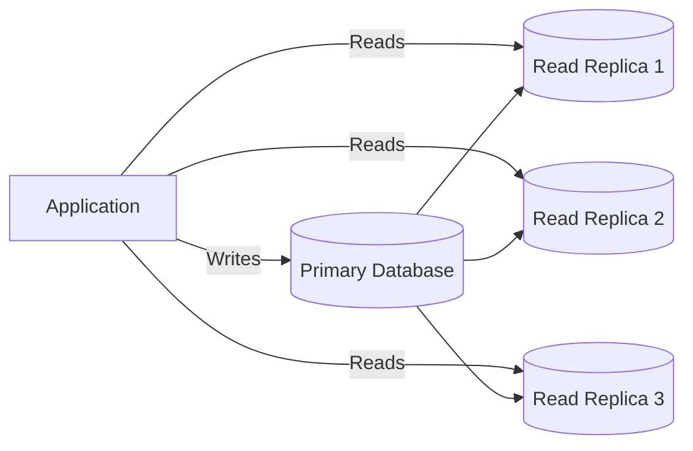
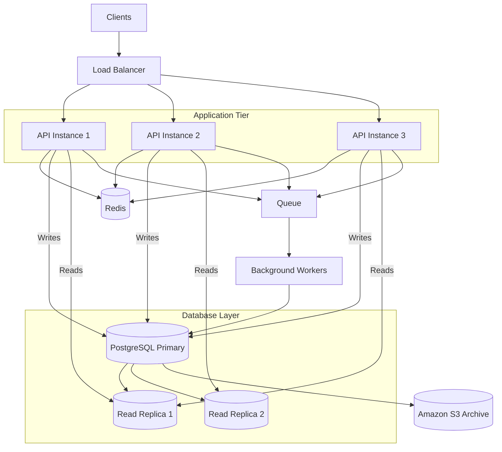

# 08- Scalability Patterns - Database Scaling

## Overview

Database scaling is the process of increasing a database system's ability to handle growing workloads while maintaining acceptable latency, throughput, consistency, availability, and cost.

For backend systems, the database is frequently the first major bottleneck after horizontal application scaling.

A common progression looks like:

```text
                    Traffic
                       |
                       v
                Load Balancer
                       |
          +------------+------------+
          |            |            |
          v            v            v
       API-1        API-2        API-3
          \            |            /
           \           |           /
            +----------+----------+
                       |
                       v
                  PostgreSQL
```

Initially, increasing API instances may improve throughput:

```text
2 API instances
      |
      v
4 API instances
      |
      v
8 API instances
```

Eventually, all instances compete for the same database:

```text
API-1 \
API-2  \
API-3   +----> PostgreSQL
API-4  /
API-5 /
```

At that point, adding more application instances can make the database bottleneck worse.

Database scaling therefore requires a different set of techniques, including:

- query optimization
- indexing
- connection management
- caching
- vertical scaling
- read replicas
- partitioning
- sharding
- workload separation
- asynchronous processing
- database-specific AWS services and capabilities

The important architectural principle is:

> Scale the database based on the actual bottleneck rather than automatically scaling the application tier.

---

## Why Database Scaling Matters

A database typically sits on the critical path of backend requests.

For example:

```text
Client
  |
  v
Nginx / Load Balancer
  |
  v
Django / FastAPI
  |
  v
PostgreSQL
  |
  v
Response
```

If the database becomes slow, the entire API can become slow.

Typical symptoms include:

- increasing query latency
- database CPU saturation
- high disk I/O
- connection exhaustion
- lock contention
- transaction contention
- replication lag
- increased application latency
- request timeouts
- growing background queues

Database scaling should therefore be considered an end-to-end system design problem.

---

## Database Bottleneck Identification

Before scaling, identify what is actually limiting throughput.

Common bottlenecks include:

| Bottleneck | Typical Symptoms |
|---|---|
| CPU | High database CPU, query execution slowdown |
| Memory | Poor cache efficiency, increased disk reads |
| Storage I/O | High I/O latency, slow scans |
| Connections | Connection exhaustion, queueing |
| Locks | Queries waiting on transactions |
| Poor indexes | Full-table scans, high query latency |
| Large queries | High CPU/I/O per request |
| Write throughput | Commit/WAL pressure |
| Read throughput | High read load |
| Replication | Increasing replica lag |
| Network | High transfer volume or latency |
| Data volume | Increasing scan and maintenance cost |

The first step should therefore be measurement rather than immediately increasing database capacity.

---

## Database Scaling Dimensions

Database scalability can be viewed across several dimensions:

```text
                    Database Scalability
                           |
        +------------------+------------------+
        |                  |                  |
        v                  v                  v
    Read Scale          Write Scale       Storage Scale
        |                  |                  |
        v                  v                  v
   Read Replicas      Partitioning       Larger Storage
   Caching            Sharding           Archiving
   Query Tuning       Workload Split     Lifecycle
```

A database can be strong in one dimension and weak in another.

For example:

```text
Read throughput:  Excellent
Write throughput: Limited
```

Adding read replicas may help reads but does nothing to increase write capacity on the primary.

---

## Vertical Scaling

Vertical scaling increases the resources available to a database instance.

For example:

```text
4 vCPU / 16 GB RAM
        |
        v
8 vCPU / 32 GB RAM
        |
        v
16 vCPU / 64 GB RAM
```

The database remains logically one system.

### Advantages

- simple architecture
- minimal application changes
- preserves transactional semantics
- often the easiest first scaling step
- useful for CPU- or memory-bound workloads

### Limitations

- finite instance limits
- potentially expensive
- does not inherently improve redundancy
- larger failure domain
- eventually reaches diminishing returns

Vertical scaling is often appropriate before introducing more complicated distributed database architectures.

---

## When Vertical Scaling Makes Sense

Vertical scaling is particularly useful when:

- the workload is still moderate
- the database architecture is otherwise healthy
- CPU or memory is the bottleneck
- query optimization has already been performed
- application changes would be expensive
- operational simplicity is important

For many systems, moving from an undersized database instance to a properly sized one is much safer than prematurely introducing sharding.

---

## Horizontal Database Scaling

Horizontal database scaling distributes workload across multiple database resources.

Examples include:

- read replicas
- partitioning
- sharding
- workload-specific databases
- distributed databases

Conceptually:

```text
                 Application
                      |
             +--------+--------+
             |                 |
             v                 v
         Write Path         Read Path
             |                 |
             v                 v
          Primary         Read Replicas
                           |    |    |
                           v    v    v
                          R1   R2   R3
```

Horizontal scaling is powerful but introduces distributed-system concerns.

---

## Database Scaling Strategy

A practical scaling progression is:

```text
Optimize Queries
      |
      v
Add Proper Indexes
      |
      v
Tune Connections
      |
      v
Add Caching
      |
      v
Vertical Scaling
      |
      v
Read Replicas
      |
      v
Partitioning
      |
      v
Sharding / Distributed Architecture
```

This is not a mandatory sequence, but it is a useful engineering decision framework.

Do not introduce sharding when query optimization and indexing would solve the problem.

---

## Query Optimization

The cheapest database query is often the query that does not need to perform unnecessary work.

Poor query:

```sql
SELECT *
FROM orders
WHERE customer_id = 123;
```

If the table contains millions of rows and the required columns are only:

```text
id
status
total
created_at
```

selecting every column increases I/O and data transfer.

Prefer selecting only required fields:

```sql
SELECT id, status, total, created_at
FROM orders
WHERE customer_id = 123;
```

The exact optimization depends on the query plan and workload.

---

## Indexing

Indexes allow databases to locate rows efficiently without scanning the entire table.

Without a useful index:

```text
Orders
  |
  v
Scan millions of rows
  |
  v
Find matching records
```

With an appropriate index:

```text
Query
  |
  v
Index
  |
  v
Relevant rows
```

For example:

```sql
CREATE INDEX idx_orders_customer_id
ON orders(customer_id);
```

Indexes can significantly improve read performance.

---

## Index Trade-Offs

Indexes are not free.

Every index consumes:

- storage
- memory
- write overhead
- maintenance resources

When a row changes, relevant indexes may also need to be updated.

Therefore:

> Index columns based on actual query patterns, not simply because they exist in the schema.

Too many indexes can make write-heavy workloads slower.

---

## Composite Indexes

Queries often filter using multiple columns.

For example:

```sql
SELECT id, total
FROM orders
WHERE customer_id = 123
  AND status = 'PAID'
ORDER BY created_at DESC;
```

A composite index may be appropriate:

```sql
CREATE INDEX idx_orders_customer_status_created
ON orders(customer_id, status, created_at DESC);
```

The usefulness of a composite index depends on:

- query predicates
- column cardinality
- ordering
- query frequency
- database optimizer behavior

Index design should be validated using query plans.

---

## Query Plans

Use database query-plan tools to understand actual execution behavior.

For PostgreSQL:

```sql
EXPLAIN (ANALYZE, BUFFERS)
SELECT id, total
FROM orders
WHERE customer_id = 123;
```

Important information includes:

- sequential scans
- index scans
- estimated rows
- actual rows
- execution time
- buffer usage
- joins
- sorting
- aggregation

A senior engineer should be able to read an execution plan rather than blindly adding indexes.

---

## N+1 Query Problem

Application-level query patterns can create significant database load.

For example:

```text
Query customers
   |
   +--> Query orders for customer 1
   +--> Query orders for customer 2
   +--> Query orders for customer 3
   +--> ...
```

One API request can generate hundreds or thousands of queries.

In Django, `select_related()` and `prefetch_related()` can reduce unnecessary queries.

Example:

```python
orders = (
    Order.objects
    .select_related("customer")
    .prefetch_related("items")
    .filter(status="PAID")
)
```

Database scaling should therefore include ORM behavior.

---

## Connection Scaling

Horizontal application scaling creates another database bottleneck.

Suppose each API instance maintains:

```text
20 database connections
```

With:

```text
5 API instances = 100 connections
```

Scaling to:

```text
50 API instances = 1,000 connections
```

can overwhelm PostgreSQL.

This is one of the most common mistakes in horizontally scaled backend systems.

---

## Connection Pooling

Connection pooling allows database connections to be reused.

Conceptually:

```text
API Instances
     |
     v
Connection Pool
     |
     +---- Connection 1
     +---- Connection 2
     +---- Connection 3
     |
     v
PostgreSQL
```

Pooling reduces connection establishment overhead and limits the number of concurrent database connections.

However, a pool does not create unlimited database capacity.

A poorly configured pool can still overwhelm the database.

---

## Database Proxy

A database proxy can sit between application instances and the database.

```text
API-1 \
API-2  \
API-3   ---> DB Proxy ---> PostgreSQL
API-4  /
API-5 /
```

The proxy can help with:

- connection management
- pooling
- failover
- routing
- reducing connection pressure

AWS provides managed database connectivity options such as Amazon RDS Proxy for supported engines.

---

## Read Replicas

Read replicas replicate data from a primary database and allow read workloads to be distributed.



This can increase read throughput without increasing the workload on the primary for every read.

---

## Read Replica Trade-Offs

Read replicas introduce replication lag.

For example:

```text
Primary:
balance = 500

Replica:
balance = 450
```

The replica may temporarily contain older data.

Therefore:

> Read replicas generally provide scale for eventually consistent reads, not arbitrary replacement for the primary.

---

## Read-After-Write Consistency

Consider:

```text
POST /orders
```

The write goes to the primary.

Immediately afterward:

```text
GET /orders/123
```

If the read goes to a lagging replica:

```text
Write -> Primary
Read  -> Replica
```

the newly created order may not yet be visible.

This is a common distributed-system problem.

Solutions include:

- route critical reads to the primary
- use consistency-aware routing
- use session-based read routing
- wait for replica state where appropriate
- design the API around eventual consistency

---

## Read Replica Routing

Applications can separate workloads:

```text
Write Queries
     |
     v
Primary

Read Queries
     |
     +----> Replica 1
     +----> Replica 2
     +----> Replica 3
```

In Django, multiple database configurations can support database routing.

Conceptually:

```python
DATABASES = {
    "default": {
        "ENGINE": "django.db.backends.postgresql",
        "NAME": "application",
        "HOST": "primary-db",
    },
    "replica": {
        "ENGINE": "django.db.backends.postgresql",
        "NAME": "application",
        "HOST": "read-replica",
    },
}
```

Production routing should be designed carefully so that transactions and consistency-sensitive operations use the appropriate database.

---

## Read Replica Failure

A replica can become:

- unavailable
- unhealthy
- significantly behind
- overloaded

The application should not assume every replica is always healthy.

A production routing layer should consider:

```text
Healthy Replica?
      |
      +---- Yes --> Route read
      |
      +---- No --> Remove from pool
```

Monitoring replication lag is therefore essential.

---

## Replication Lag

Replication lag measures how far a replica is behind the primary.

Conceptually:

```text
Primary transaction
       |
       | replication
       v
Replica
```

Under normal conditions:

```text
Lag = low
```

Under load:

```text
Lag = increasing
```

Increasing lag can indicate:

- replica CPU pressure
- network issues
- write volume
- storage limitations
- long-running queries
- replication bottlenecks

A replica that is technically available but significantly stale may not be suitable for all reads.

---

## Caching Before Database Scaling

Caching can often remove a large percentage of database reads.

For example:

```text
10,000 requests
      |
      v
Redis
      |
      +---- 9,000 hits
      |
      +---- 1,000 DB queries
```

Instead of scaling the database to handle 10,000 queries, the application may reduce the workload to 1,000.

Caching and database scaling are therefore complementary.

A useful architecture is:

```text
Client
  |
  v
API
  |
  v
Redis
  |
  +---- Hit --> Response
  |
  +---- Miss --> PostgreSQL
```

---

## Database Partitioning

Partitioning divides a logical table into smaller physical pieces.

For example, an orders table can be partitioned by date:

```text
orders
 |
 +-- orders_2025
 +-- orders_2026
 +-- orders_2027
```

A query for 2026 data can potentially operate only on the relevant partition.

This can reduce:

- scanned data
- maintenance scope
- index size
- archival complexity

---

## Range Partitioning

A common strategy is range partitioning.

Example:

```text
orders
 |
 +-- 2026-01
 +-- 2026-02
 +-- 2026-03
 +-- ...
```

PostgreSQL supports declarative partitioning.

Example:

```sql
CREATE TABLE orders (
    id BIGINT NOT NULL,
    customer_id BIGINT NOT NULL,
    created_at TIMESTAMPTZ NOT NULL,
    total NUMERIC(12, 2) NOT NULL
) PARTITION BY RANGE (created_at);
```

A partition can then be created for a specific time range.

Partitioning is particularly useful for large time-series or append-heavy tables.

---

## Partitioning vs Sharding

These concepts are related but not identical.

### Partitioning

Data is divided within a database system.

```text
One Database
 |
 +-- Partition A
 +-- Partition B
 +-- Partition C
```

### Sharding

Data is distributed across separate database instances or clusters.

```text
Shard 1
   |
   +-- Customers A-M

Shard 2
   |
   +-- Customers N-Z
```

Sharding introduces substantially more distributed-system complexity.

---

## Sharding

Sharding distributes data across independent database nodes.

For example:

```text
                    Application
                         |
                    Shard Router
                         |
             +-----------+-----------+
             |                       |
             v                       v
        PostgreSQL 1           PostgreSQL 2
        Customers 1-50M        Customers 51-100M
```

A shard key determines where data is stored.

Common shard keys include:

- customer ID
- tenant ID
- geographic region
- account ID

---

## Shard Key Design

Shard-key selection is one of the most important decisions in a sharded system.

A good shard key should ideally:

- distribute data evenly
- distribute writes evenly
- minimize cross-shard queries
- align with common access patterns
- remain stable
- avoid hotspots

For a multi-tenant SaaS system, tenant ID can sometimes be a strong shard key because most queries are tenant-scoped.

---

## Poor Shard Keys

A poor shard key can create hotspots.

For example:

```text
Shard 1 -> 90% traffic
Shard 2 -> 5%
Shard 3 -> 5%
```

The system is technically sharded but not effectively scalable.

Sequential identifiers can also create concentration depending on the sharding strategy.

Shard-key design must be based on actual workload distribution.

---

## Cross-Shard Queries

Sharding becomes difficult when a query requires data from multiple shards.

For example:

```sql
SELECT *
FROM orders
WHERE product_id = 123;
```

If orders are sharded by:

```text
customer_id
```

the application may not know which shard contains the relevant rows.

It may need to query every shard:

```text
Shard 1 \
Shard 2  \
Shard 3   ---> Query Router ---> Aggregate Results
Shard 4  /
Shard 5 /
```

This increases:

- latency
- network traffic
- query complexity
- failure probability

A strong shard key minimizes cross-shard access.

---

## Transactions Across Shards

Transactions become significantly more complicated when data spans shards.

Within one database:

```text
BEGIN
  |
  +--> Update A
  +--> Update B
  |
COMMIT
```

Across shards:

```text
Transaction Coordinator
       |
       +----> Shard A
       |
       +----> Shard B
```

Distributed transactions introduce coordination overhead and failure scenarios.

Whenever possible, design workflows so that strongly consistent transactions remain within a single shard.

---

## Database Workload Separation

Another scaling strategy is separating workloads.

For example:

```text
                         PostgreSQL
                              |
              +---------------+---------------+
              |               |               |
              v               v               v
          OLTP Reads       OLTP Writes      Analytics
              |               |               |
              v               v               v
          Replicas         Primary        Warehouse
```

Do not run expensive analytics directly against the same database that serves latency-sensitive API requests if the workload can be separated.

---

## Asynchronous Processing

Expensive database operations can sometimes be moved out of the synchronous request path.

Instead of:

```text
API Request
    |
    v
Large DB Operation
    |
    v
Response
```

use:

```text
API Request
    |
    v
Queue
    |
    v
Worker
    |
    v
Database
```

This can improve API responsiveness and allow workers to scale independently.

Technologies such as Celery, Amazon SQS, and Kafka can be used depending on the workload.

---

## Write Scaling

Read scaling is generally easier than write scaling.

For example:

```text
Read Scaling:
Primary ---> Replica 1
         ---> Replica 2
         ---> Replica 3
```

Writes still typically converge on the primary.

If write throughput becomes the bottleneck, read replicas will not solve the fundamental problem.

Write-scaling strategies may include:

- schema optimization
- batching
- reducing unnecessary writes
- asynchronous writes
- partitioning
- workload separation
- sharding
- distributed databases

---

## Batch Writes

Multiple small writes can sometimes be combined.

Instead of:

```text
INSERT
INSERT
INSERT
INSERT
INSERT
```

a batch operation can reduce round trips and transaction overhead.

For example:

```sql
INSERT INTO events (event_type, payload)
VALUES
    ('created', '{}'),
    ('created', '{}'),
    ('updated', '{}');
```

The exact benefit depends on the database, transaction size, indexes, and workload.

Very large batches can also create excessive locks or transaction pressure, so batching should be bounded.

---

## Write Amplification

A single logical write may produce multiple physical operations.

For example:

```text
Application Write
      |
      +--> Table
      +--> Index 1
      +--> Index 2
      +--> Index 3
      +--> WAL / Replication
```

A heavily indexed write-heavy table can therefore become expensive.

When write throughput is the bottleneck, inspect:

- index count
- index size
- transaction size
- WAL generation
- replication
- triggers
- secondary effects

Adding more indexes is not always an optimization.

---

## Hot Rows and Lock Contention

A database may have sufficient CPU and storage capacity but still suffer from contention.

For example:

```text
100 requests
     |
     v
Update same row
     |
     v
Lock contention
     |
     v
Requests wait
```

This can create high latency even when infrastructure metrics appear healthy.

Solutions may include:

- reducing transaction duration
- avoiding unnecessary locks
- changing data modeling
- atomic updates
- optimistic concurrency
- partitioning hot data
- asynchronous processing

---

## Transaction Duration

Long transactions hold resources for longer.

For example:

```text
BEGIN
   |
   +--> Query
   |
   +--> External API call
   |
   +--> Another query
   |
COMMIT
```

Calling an external API while holding a database transaction open is generally dangerous.

A better design is:

```text
Database transaction
   |
   v
Commit quickly
   |
   v
External operation
```

Transactions should generally be as short as practical.

---

## Database Scaling and CAP Trade-Offs

Distributed database architectures introduce trade-offs between:

- consistency
- availability
- partition tolerance

Traditional relational databases such as PostgreSQL provide strong transactional semantics within a database node or appropriately configured cluster.

Once data is distributed across nodes, network partitions become part of the application's consistency model.

Senior engineers should therefore avoid treating distributed database scaling as a purely infrastructure problem.

---

## AWS Database Scaling

AWS provides multiple database scaling options depending on the database engine and workload.

Common services and capabilities include:

| Requirement | AWS Approach |
|---|---|
| Managed relational database | Amazon RDS |
| PostgreSQL/MySQL-compatible managed cluster | Amazon Aurora |
| Read scaling | RDS/Aurora read replicas |
| Connection management | RDS Proxy |
| Automatic capacity adjustments | Supported RDS/Aurora scaling capabilities |
| NoSQL horizontal scale | DynamoDB |
| Distributed search | OpenSearch |
| Analytics | Redshift |
| Object-based data | S3 |

The correct service depends on the workload, consistency requirements, access patterns, and operational model.

---

## Amazon RDS Scaling

RDS provides managed relational databases.

Scaling options can include:

- larger instance classes
- storage scaling
- read replicas
- Multi-AZ deployments
- engine-specific capabilities

A common architecture is:

```text
Application
    |
    +---- Writes ---> RDS Primary
    |
    +---- Reads ----> Read Replica
```

The exact capabilities vary by database engine and configuration.

---

## Amazon Aurora

Aurora is a managed relational database engine compatible with PostgreSQL and MySQL.

A simplified architecture is:

```text
                Application
                     |
                     v
                Aurora Cluster
                     |
          +----------+----------+
          |                     |
          v                     v
      Writer                 Readers
                               | |
                               v v
                              R1 R2
```

Aurora separates compute from its distributed storage architecture and supports multiple reader instances.

It can therefore provide different scaling characteristics from standard RDS deployments.

---

## DynamoDB as a Scaling Alternative

For workloads that do not require relational joins and transactions across arbitrary entities, DynamoDB can provide a different scaling model.

A simplified model is:

```text
Application
     |
     v
DynamoDB
     |
     +--> Partition
     +--> Partition
     +--> Partition
```

DynamoDB distributes data based on partition-key design.

However, moving from PostgreSQL to DynamoDB is not simply "using a faster database."

It requires designing data access patterns first.

---

## Database Scaling and Data Modeling

Database scaling often exposes poor data modeling.

For example:

```text
Single giant table
        |
        v
Large scans
        |
        v
Increasing latency
```

Potential improvements include:

- proper normalization
- selective denormalization
- appropriate indexes
- partitioning
- archiving
- separating hot and cold data

Data modeling should be driven by actual access patterns.

---

## Hot and Cold Data

Not all data needs the same performance characteristics.

For example:

```text
Hot Data
Last 30 days
     |
     v
Fast primary / cache

Cold Data
Older records
     |
     v
Archive / object storage
```

Archiving old records can reduce:

- table size
- index size
- maintenance cost
- backup size
- query complexity

For analytical or historical workloads, S3 or a data warehouse may be more appropriate than the transactional database.

---

## Archiving

An archive strategy might look like:

```text
PostgreSQL
    |
    | Older than retention window
    v
Export
    |
    v
Amazon S3
    |
    v
Remove from OLTP database
```

The exact strategy depends on:

- compliance
- retention
- recovery requirements
- query requirements
- data lifecycle

Archiving is often overlooked when teams continuously increase database capacity instead.

---

## Database High Availability

Scaling and availability are related but not identical.

A system can be large but unavailable.

High availability generally requires:

- multiple Availability Zones
- automated failover
- health monitoring
- backups
- tested recovery procedures

A common architecture is:

```text
                 Application
                      |
                      v
              Database Endpoint
                      |
             +--------+--------+
             |                 |
             v                 v
          AZ-A              AZ-B
        Primary            Standby
```

The exact implementation depends on the database service.

---

## Backup and Disaster Recovery

Scaling does not eliminate data-loss risk.

Production databases should have:

- automated backups
- point-in-time recovery where appropriate
- tested restore procedures
- retention policies
- disaster recovery planning
- cross-region strategy where required

A backup that has never been restored is not a fully validated recovery strategy.

---

## Multi-Region Database Scaling

Multi-region architectures can reduce geographic latency and improve disaster recovery, but they introduce significant complexity.

Possible architecture:

```text
Region A                         Region B
---------                        ---------
Application                      Application
    |                                |
    v                                v
Database A  <---- Replication ----> Database B
```

Challenges include:

- replication latency
- conflict resolution
- consistency
- failover
- DNS/routing
- data residency
- operational complexity

Multi-region should be justified by explicit availability, latency, or disaster-recovery requirements.

---

## Database Monitoring

Important metrics include:

### Performance

- query latency
- transaction latency
- throughput
- CPU utilization
- memory utilization
- I/O latency

### Connections

- active connections
- idle connections
- connection errors
- pool utilization

### Storage

- allocated storage
- free storage
- IOPS
- throughput

### Replication

- replica lag
- replication errors
- WAL/log throughput

### Concurrency

- locks
- deadlocks
- transaction duration
- blocked queries

### Application

- database calls per request
- slow query count
- ORM query count
- cache hit ratio

Database monitoring should correlate infrastructure metrics with application behavior.

---

## Slow Query Monitoring

Slow queries should be captured and analyzed.

A useful process is:

```text
Slow Query Detected
       |
       v
Identify Query Pattern
       |
       v
EXPLAIN / EXPLAIN ANALYZE
       |
       v
Check Indexes
       |
       v
Optimize Query / Schema
       |
       v
Load Test
       |
       v
Deploy
       |
       v
Monitor
```

Do not optimize based solely on intuition.

---

## Database Scaling and Observability

A useful production dashboard correlates:

```text
Request Rate
     |
     +---- API Latency
     |
     +---- DB Query Latency
     |
     +---- DB CPU
     |
     +---- DB Connections
     |
     +---- Cache Hit Ratio
     |
     +---- Replica Lag
```

For example:

```text
Traffic increases
       |
       v
API instances increase
       |
       v
DB connections increase
       |
       v
DB latency increases
       |
       v
API latency increases
```

This correlation reveals the actual bottleneck.

---

## Security Considerations

Database scaling must preserve security controls.

Important practices include:

- private database networking
- least-privilege database users
- encryption at rest
- encryption in transit
- secrets management
- restricted security groups
- auditing
- credential rotation

Do not expose a database directly to the public internet simply because application capacity has increased.

---

## Cost Considerations

Database scaling can become expensive.

Costs may come from:

- larger instances
- additional replicas
- storage
- provisioned IOPS
- network transfer
- backup storage
- cross-region replication
- monitoring

A useful optimization sequence is:

```text
Remove Waste
     |
     v
Optimize Queries
     |
     v
Improve Indexes
     |
     v
Cache
     |
     v
Scale Resources
```

Increasing infrastructure size should not be the first response to inefficient queries.

---

## Common Mistakes

### Adding More API Instances Without Checking the Database

More application instances can create more database connections and queries.

---

### Adding Read Replicas for Write Bottlenecks

Read replicas increase read capacity.

They do not automatically increase primary write capacity.

---

### Creating Too Many Indexes

Indexes improve reads but increase storage and write overhead.

---

### Ignoring Connection Limits

Application horizontal scaling can exhaust PostgreSQL connections surprisingly quickly.

---

### Assuming Replicas Are Immediately Consistent

Read replicas can lag behind the primary.

Consistency requirements must determine routing.

---

### Sharding Too Early

Sharding adds:

- routing complexity
- operational complexity
- cross-shard query problems
- transaction complexity
- rebalancing challenges

Optimize simpler solutions first.

---

### Using an Unbalanced Shard Key

A poor shard key can create a single overloaded shard while other shards remain underutilized.

---

### Running Analytics on OLTP

Large analytical queries can compete with latency-sensitive application transactions.

Separate workloads where appropriate.

---

### Ignoring N+1 Queries

A poorly designed ORM query pattern can create thousands of database queries from a small number of API requests.

---

### Scaling Based Only on CPU

Database bottlenecks can be caused by locks, I/O, connections, query plans, or storage even when CPU is not saturated.

---

### Increasing Connection Pools Indiscriminately

More connections do not necessarily increase throughput.

At some point they increase contention and memory usage.

---

### Ignoring Long Transactions

Long transactions can hold locks and resources, increasing latency for unrelated requests.

---

## Production Database Scaling Strategy

A practical production workflow is:

1. Establish database performance baselines.
2. Identify the dominant bottleneck.
3. Analyze slow queries.
4. Review query plans.
5. Remove unnecessary database work.
6. Add or correct indexes.
7. Fix ORM query patterns such as N+1 access.
8. Configure connection pooling appropriately.
9. Add caching for suitable read-heavy workloads.
10. Scale the database vertically when appropriate.
11. Introduce read replicas for suitable read workloads.
12. Monitor replica lag and consistency requirements.
13. Partition large tables when access patterns justify it.
14. Separate analytical and asynchronous workloads.
15. Consider sharding only when simpler approaches cannot provide sufficient scale.
16. Validate the architecture through realistic load testing.
17. Continuously monitor performance, capacity, and cost.

---

## Production Architecture Example

A scalable backend can combine several database-scaling techniques:



The scaling responsibilities are separated:

```text
API tier
    -> Horizontal scaling

Cache
    -> Reduce database reads

Read replicas
    -> Scale read throughput

Primary database
    -> Handle writes

Workers
    -> Handle asynchronous workloads

Archive
    -> Remove cold data from OLTP workload
```

---

## Choosing the Right Scaling Technique

| Problem | First Technique to Evaluate |
|---|---|
| Slow individual query | Query optimization |
| Full table scan | Index/query redesign |
| N+1 queries | ORM/query optimization |
| High read volume | Cache/read replicas |
| High write volume | Query/write optimization, batching |
| Connection exhaustion | Pooling/proxy |
| Large historical tables | Partitioning/archiving |
| Analytics impacting APIs | Workload separation |
| Single database capacity limit | Vertical scaling |
| Extreme distributed workload | Sharding/distributed database |
| Temporary expensive workload | Async processing |
| Repeated identical reads | Cache |

The goal is not to maximize the number of scaling mechanisms.

The goal is to solve the actual bottleneck with the least unnecessary complexity.

---

## Scalability Testing

Database scaling should be validated under realistic workload patterns.

Test:

- read-heavy traffic
- write-heavy traffic
- mixed read/write traffic
- large datasets
- concurrent connections
- long-running queries
- cache misses
- replica lag
- failover
- burst traffic
- sustained traffic

For example:

```text
100 req/s
   |
   v
500 req/s
   |
   v
1,000 req/s
   |
   v
2,000 req/s
   |
   v
5,000 req/s
```

At every stage measure:

- database CPU
- query latency
- transactions per second
- connection count
- cache hit ratio
- I/O
- locks
- replication lag
- API latency
- error rate

---

## Scaling Efficiency

Suppose:

```text
Database Size     Throughput

Small             1,000 req/s
Medium            1,900 req/s
Large             2,000 req/s
```

Increasing capacity beyond the medium configuration provides little improvement.

This indicates another bottleneck.

Likewise:

```text
1 Replica  -> 2,000 reads/s
2 Replicas -> 3,800 reads/s
4 Replicas -> 4,000 reads/s
```

The diminishing returns may indicate that the primary, network, application, or another shared resource is limiting throughput.

Scaling should therefore be measured as:

```text
Additional Capacity
        |
        v
Additional Useful Throughput
```

rather than simply counting database nodes.

---

## Interview Perspective

A common system-design question is:

> "Your Django API is receiving 10,000 requests per second and PostgreSQL is overloaded. How would you scale it?"

A strong answer should proceed systematically:

```text
Measure
  |
  v
Identify Bottleneck
  |
  +----> Slow Queries
  |          |
  |          v
  |      Optimize / Index
  |
  +----> Repeated Reads
  |          |
  |          v
  |        Redis
  |
  +----> Read Throughput
  |          |
  |          v
  |     Read Replicas
  |
  +----> Large Tables
  |          |
  |          v
  |     Partition / Archive
  |
  +----> Write Throughput
             |
             v
       Optimize / Batch
             |
             v
       Partition / Shard
```

Then discuss:

- connection pooling
- N+1 queries
- replica lag
- transaction boundaries
- cache invalidation
- database failover
- workload separation
- observability
- cost

The strongest answer is not "use read replicas."

It is:

> First identify whether the bottleneck is reads, writes, queries, connections, locks, storage, or CPU, then choose the least complex scaling strategy that addresses that bottleneck.

---

## Senior-Level Database Scaling Questions

When reviewing a database architecture, ask:

- What is the current bottleneck?
- Is the workload read-heavy or write-heavy?
- What percentage of queries can be removed through caching?
- Are queries properly indexed?
- What do the execution plans show?
- How many database connections does each application instance create?
- What happens when the API scales from 5 to 50 instances?
- Can reads be served from replicas?
- What consistency guarantees are required?
- How much replication lag is acceptable?
- Are there hot rows or lock-contention problems?
- Are large tables partitioned appropriately?
- Can cold data be archived?
- Are analytics isolated from transactional workloads?
- Is sharding actually necessary?
- What is the shard key?
- Can common queries cross shards?
- How are backups and restores handled?
- What happens when the primary fails?
- What happens when a replica becomes stale?
- What is the maximum safe database capacity?
- What is the cost at peak capacity?

These questions expose the difference between simply knowing database technologies and designing a production-scale data layer.

---

## Production Database Scaling Checklist

### Query and Schema

- [ ] Slow queries are identified and monitored.
- [ ] Query plans are reviewed for expensive operations.
- [ ] Indexes match actual query patterns.
- [ ] N+1 query patterns are eliminated.
- [ ] Large tables are reviewed for partitioning.
- [ ] Historical data has a lifecycle strategy.

### Connections

- [ ] Connection pools are bounded.
- [ ] Application scaling is included in connection calculations.
- [ ] Database connection limits are known.
- [ ] Connection failures are monitored.
- [ ] Database proxying is evaluated where appropriate.

### Read Scaling

- [ ] Read replicas are used only for suitable workloads.
- [ ] Replica lag is monitored.
- [ ] Read-after-write requirements are understood.
- [ ] Critical consistency-sensitive reads can reach the primary.

### Write Scaling

- [ ] Unnecessary writes are removed.
- [ ] Batch operations are used where appropriate.
- [ ] Transaction duration is controlled.
- [ ] Index overhead is understood.
- [ ] Lock contention is monitored.

### Reliability

- [ ] Multi-AZ/high-availability strategy is defined.
- [ ] Automated backups are enabled.
- [ ] Point-in-time recovery is understood.
- [ ] Restore procedures are tested.
- [ ] Failover behavior is documented.
- [ ] Disaster recovery requirements are defined.

### Scalability

- [ ] Capacity limits are documented.
- [ ] Load testing has been performed.
- [ ] Bottleneck thresholds are known.
- [ ] Scaling behavior is observable.
- [ ] Cost at peak capacity is understood.
- [ ] Sharding is avoided until simpler strategies are insufficient.

## Key Takeaways

- Database scaling starts with identifying the actual bottleneck—queries, indexes, CPU, memory, I/O, connections, locks, reads, or writes—rather than immediately adding database capacity.
- Query optimization, indexing, connection management, caching, and vertical scaling should generally be evaluated before introducing complex distributed techniques.
- Read replicas can scale read throughput, but replication lag and read-after-write consistency must be explicitly handled; they do not inherently solve write bottlenecks.
- Partitioning, workload separation, archiving, and asynchronous processing can extend database scalability without immediately introducing the complexity of sharding.
- Sharding is a major architectural decision requiring careful shard-key design, cross-shard query management, transaction strategy, rebalancing, observability, and operational maturity.