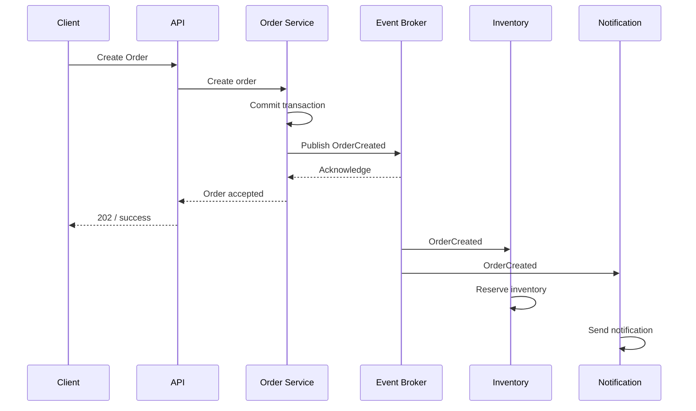
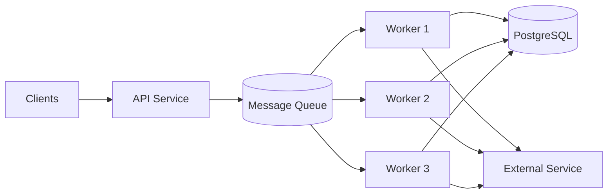
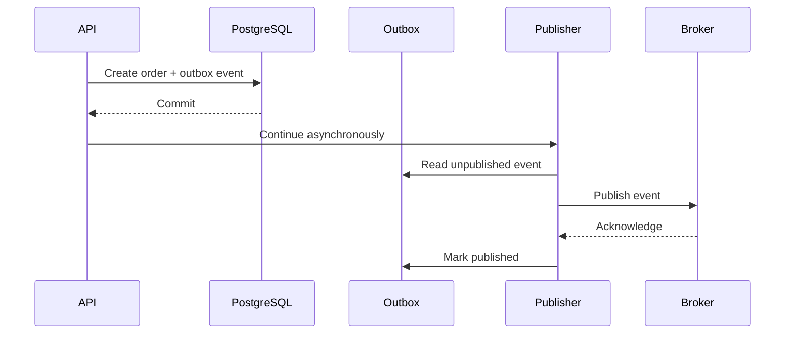
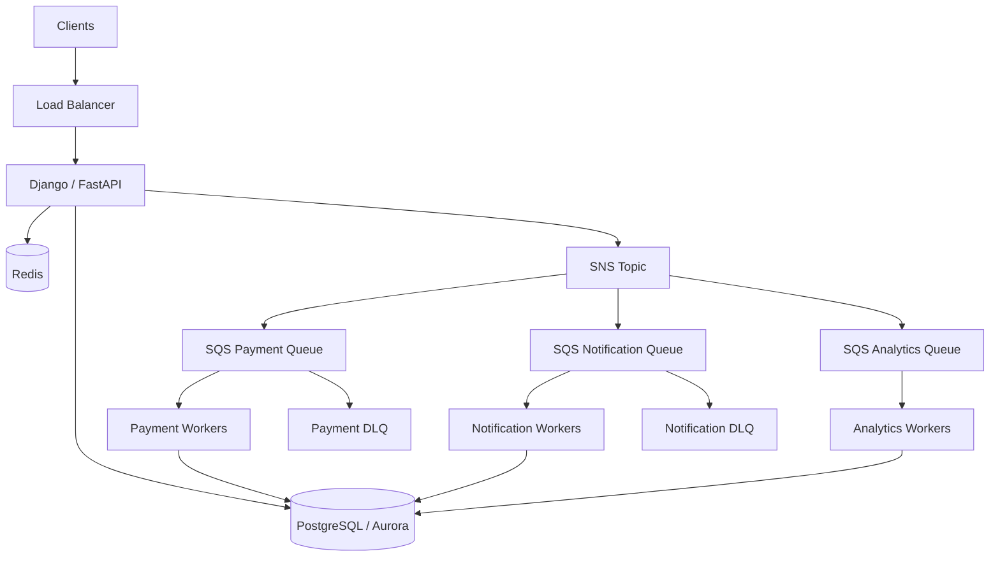

# 09- Decoupling Patterns - Event-Driven Architecture and Queue-Based Load Leveling

## Overview

Decoupling is an architectural strategy for reducing direct dependencies between system components so that each component can evolve, scale, fail, and recover with less impact on the rest of the system.

In a tightly coupled backend architecture, one service often depends directly on another:

```text
Client
  |
  v
API
  |
  v
Order Service
  |
  v
Payment Service
  |
  v
Notification Service
```

A failure or latency increase in one downstream service can propagate through the entire request path.

A decoupled architecture introduces asynchronous communication mechanisms such as queues, events, and streams:

```text
Client
  |
  v
API
  |
  v
Order Service
  |
  v
Message Broker
  |
  +----> Payment Worker
  |
  +----> Notification Worker
  |
  +----> Analytics Consumer
```

The important distinction is that the producer does not necessarily need to wait for every consumer to finish processing.

Two closely related patterns are particularly important:

- **Event-driven architecture** — components communicate through events representing facts that occurred.
- **Queue-based load leveling** — a queue absorbs temporary traffic spikes and allows consumers to process work at a controlled rate.

These patterns are central to scalable AWS architectures and are commonly implemented using services such as Amazon SQS, Amazon SNS, Amazon EventBridge, Amazon Kinesis, and Amazon MSK.

---

## Why Decoupling Matters

Direct synchronous dependencies create temporal coupling.

For example:

```text
API
 |
 +--> Payment Service
 |
 +--> Email Service
 |
 +--> Inventory Service
 |
 +--> Analytics Service
```

The API may need to wait for all four services.

If each service takes:

```text
Payment   = 300 ms
Email     = 200 ms
Inventory = 150 ms
Analytics = 250 ms
```

and calls are sequential, the request path can accumulate substantial latency.

More importantly, if one dependency fails:

```text
Email Service
     |
     X
     |
Order API fails
```

the failure can propagate even though email delivery may not be essential to completing the order.

Decoupling allows the critical path to be separated from secondary work.

---

## Coupling Dimensions

Coupling is not limited to code dependencies.

A production system can have several types of coupling:

| Coupling Type | Description |
|---|---|
| Temporal | Producer and consumer must be available simultaneously |
| Runtime | One service directly depends on another being reachable |
| Data | Components depend on shared schemas or databases |
| Deployment | Components must be deployed together |
| Scaling | Components must scale together |
| Failure | One component's failure affects another |
| Organizational | Teams cannot independently change components |

Queues and events primarily reduce temporal, runtime, scaling, and failure coupling.

They do not automatically eliminate data or schema coupling.

---

## Synchronous vs Asynchronous Communication

### Synchronous

```text
Service A
   |
   | HTTP / gRPC
   v
Service B
   |
   v
Response
```

Service A waits for Service B.

### Asynchronous

```text
Service A
   |
   | Message
   v
Queue
   |
   v
Service B
```

Service A can continue after successfully publishing the message.

The distinction is important:

> Asynchronous communication does not mean the work disappears. It means the producer and consumer no longer need to execute at the same time.

---

## Event-Driven Architecture

Event-driven architecture uses events to communicate state changes or business facts.

An event typically represents something that has already happened.

Examples:

```text
OrderCreated
PaymentCompleted
UserRegistered
InvoiceGenerated
ShipmentDispatched
```

A producer publishes an event:

```text
Order Service
      |
      | OrderCreated
      v
Event Broker
      |
      +----> Inventory Service
      |
      +----> Notification Service
      |
      +----> Analytics Service
```

The producer does not necessarily need to know which consumers exist.

---

## Event vs Command

One of the most important distinctions in event-driven architecture is the difference between an event and a command.

### Event

An event describes a fact.

```text
OrderCreated
```

It means:

> An order was created.

### Command

A command asks another component to perform an action.

```text
ProcessPayment
```

It means:

> Process this payment.

A useful rule is:

| Concept | Meaning |
|---|---|
| Event | Something happened |
| Command | Please do something |

Naming events in the past tense often makes the distinction clear:

```text
OrderCreated
PaymentAuthorized
ShipmentDispatched
```

---

## Event-Driven Request Flow

A typical flow looks like:



The client does not necessarily wait for inventory reservation and notification delivery.

---

## When to Use Event-Driven Architecture

Event-driven architecture is useful when:

- multiple consumers need the same business fact
- consumers should evolve independently
- downstream processing can be asynchronous
- workflows contain long-running operations
- workloads are bursty
- eventual consistency is acceptable
- services should be independently scalable
- integration between bounded contexts is required

It is especially useful for:

- order processing
- payment workflows
- notifications
- audit pipelines
- analytics
- data synchronization
- background processing
- integration with external systems

---

## When Not to Use It

Event-driven architecture is not automatically better than synchronous communication.

Avoid introducing asynchronous messaging when:

- the caller requires an immediate response
- strong consistency is required for the entire workflow
- the operation is trivial
- asynchronous processing adds unnecessary complexity
- the team cannot operate the messaging infrastructure reliably
- debugging and observability requirements outweigh the benefits

For example:

```text
GET /users/123
```

does not necessarily need an event broker between the API and database.

Use the simplest architecture that satisfies the requirements.

---

## Queue-Based Load Leveling

Queue-based load leveling is a scalability pattern where a queue absorbs incoming work faster than consumers can process it temporarily.

Without a queue:

```text
Traffic Spike
     |
     v
Workers
     |
     X
Overload
```

With a queue:

```text
Traffic Spike
     |
     v
Queue
     |
     +----> Worker
     +----> Worker
     +----> Worker
```

The queue acts as a buffer between producers and consumers.

This is particularly useful when traffic is bursty but the processing capacity is relatively stable.

---

## The Queue as a Shock Absorber

Consider:

```text
Normal traffic:
100 jobs/sec

Peak traffic:
1,000 jobs/sec

Consumer capacity:
200 jobs/sec
```

Without a queue:

```text
1,000 jobs/sec
      |
      v
Consumers: 200/sec
      |
      v
Overload
```

With a queue:

```text
1,000 jobs/sec
      |
      v
+----------------+
| Message Queue  |
+----------------+
      |
      v
Consumers: 200/sec
```

The queue temporarily stores the excess work.

The backlog becomes:

```text
Incoming rate - Processing rate
```

In this example:

```text
1,000 - 200 = 800 messages/sec
```

The queue absorbs the difference until the traffic decreases or consumer capacity increases.

---

## Queue-Based Architecture

A common backend architecture is:



The API absorbs requests quickly while workers process the workload asynchronously.

---

## Amazon SQS

Amazon Simple Queue Service (SQS) is a managed message queue service.

A simplified architecture is:

```text
Producer
   |
   v
Amazon SQS
   |
   +----> Consumer 1
   +----> Consumer 2
   +----> Consumer 3
```

SQS is commonly used for:

- asynchronous jobs
- workload buffering
- background processing
- microservice communication
- decoupling application components

The producer does not need to manage the queue infrastructure itself.

---

## Standard vs FIFO Queues

Amazon SQS provides two major queue types.

| Feature | Standard | FIFO |
|---|---|---|
| Throughput | Very high | Lower relative throughput |
| Ordering | Best effort | Ordered processing |
| Duplicate delivery | Possible | Deduplication features |
| Use case | General workloads | Ordering-sensitive workloads |
| Complexity | Lower | Higher |

Standard queues are appropriate for many distributed workloads where consumers are idempotent.

FIFO queues are appropriate when ordering or exactly-once processing semantics within the service's documented guarantees are important.

---

## Message Lifecycle

A queue message typically follows this lifecycle:

```text
Producer
   |
   v
Message
   |
   v
Queue
   |
   v
Consumer receives message
   |
   v
Message becomes invisible
   |
   v
Processing
   |
   +---- Success --> Delete
   |
   +---- Failure --> Visibility timeout expires
                         |
                         v
                       Retry
```

The message is generally not deleted until processing succeeds.

---

## Visibility Timeout

SQS uses a visibility timeout to prevent multiple consumers from processing the same message concurrently under normal conditions.

Example:

```text
Message received
      |
      v
Invisible for 60 seconds
      |
      v
Worker processing
      |
      +---- Success --> Delete
      |
      +---- Failure --> Reappear
```

The visibility timeout should be longer than the expected processing duration, with sufficient margin.

If processing takes longer than the timeout, another consumer may receive the same message.

---

## Visibility Timeout Is Not a Lock

A common mistake is treating visibility timeout as a permanent exclusive lock.

It is not.

If a consumer fails or takes too long:

```text
Worker A
   |
   | processing
   |
timeout
   |
   v
Message visible again
   |
   v
Worker B
```

Both workers can potentially process the same logical work.

Consumers must therefore be designed for idempotency.

---

## Idempotent Consumers

An idempotent operation can be safely executed more than once without producing an incorrect final state.

Suppose:

```text
PaymentCaptured
```

is delivered twice.

A naive consumer may charge the customer twice.

A robust consumer can use an idempotency key:

```text
event_id = 7f6d...
```

and record processed events:

```text
processed_events
----------------
event_id
processed_at
```

Before processing:

```text
Already processed?
      |
      +---- Yes --> Ignore / acknowledge
      |
      +---- No ---> Process
                     |
                     v
                  Record ID
```

This is one of the most important requirements for reliable asynchronous systems.

---

## At-Least-Once Delivery

Many messaging systems provide at-least-once delivery semantics.

This means:

> A message may be delivered more than once, so consumers must tolerate duplicates.

For example:

```text
Producer
   |
   v
Message
   |
   +----> Consumer A
   |
   +----> Consumer A again
```

Duplicate delivery can occur because of:

- consumer crashes
- network failures
- acknowledgment failures
- visibility timeout expiration
- retries

Designing idempotent consumers is therefore more important than assuming messages are delivered exactly once.

---

## Exactly-Once Processing

"Exactly once" is often misunderstood.

There are multiple guarantees:

- exactly-once delivery
- exactly-once processing
- exactly-once business effect

These are not equivalent.

For example, a consumer may receive a message twice but still produce exactly one business effect through idempotency.

A practical approach is:

```text
At-least-once delivery
        +
Idempotent processing
        =
Effectively once business operation
```

This is generally easier to reason about than attempting to eliminate every possible duplicate delivery.

---

## Dead Letter Queues

Messages that repeatedly fail should not remain in the primary queue indefinitely.

A dead letter queue (DLQ) provides an isolation point for poison messages.

```text
Main Queue
    |
    v
Consumer
    |
    +---- Success --> Delete
    |
    +---- Failure --> Retry
                         |
                         v
                    Max Attempts
                         |
                         v
                       DLQ
```

DLQs are useful for:

- debugging
- preventing poison-message loops
- operational inspection
- controlled replay
- separating permanently failing work

---

## Poison Messages

A poison message is a message that repeatedly fails processing.

Examples:

- malformed payload
- unsupported schema
- invalid business state
- missing referenced resource
- downstream dependency failure
- unexpected application bug

Without a DLQ:

```text
Message
  |
  v
Fail
  |
  v
Retry
  |
  v
Fail
  |
  v
Retry forever
```

This can consume worker capacity indefinitely.

---

## Queue Backpressure

A queue naturally creates a form of backpressure.

If producers are faster than consumers:

```text
Producer rate > Consumer rate
          |
          v
Queue depth increases
```

This is valuable because the system can remain available while processing catches up.

However, a queue does not eliminate overload.

If the producer continuously generates:

```text
10,000 jobs/sec
```

while consumers process:

```text
1,000 jobs/sec
```

the queue will eventually exhaust its retention or capacity constraints.

Backpressure must therefore be monitored.

---

## Queue Depth

Queue depth is one of the most important metrics.

```text
Queue Depth
    |
    v
100
200
400
800
1600
3200
```

A continuously increasing queue depth indicates that consumers cannot keep up.

Useful metrics include:

- queue depth
- age of oldest message
- processing rate
- failure rate
- retry count
- consumer concurrency

The age of the oldest message is often more useful than depth alone because it measures how long work has been waiting.

---

## Queue Latency

For asynchronous systems, latency must be measured differently.

Instead of only:

```text
API latency
```

also measure:

```text
Publish latency
+
Queue wait time
+
Processing time
```

Total asynchronous processing latency can be approximated as:

```text
End-to-end latency
=
Queue delay
+
Consumer processing
+
Downstream processing
```

A queue can therefore improve API response time while increasing eventual completion time.

This trade-off must be explicit.

---

## Scaling Consumers

Consumers should generally scale based on workload.

For example:

```text
Queue depth increases
        |
        v
Add workers
        |
        v
Processing rate increases
        |
        v
Queue depth decreases
```

AWS workloads can use mechanisms such as:

- ECS service auto scaling
- Kubernetes Horizontal Pod Autoscaler
- Lambda event source scaling
- EC2 Auto Scaling
- queue-depth-based scaling policies

The scaling signal should reflect actual processing pressure.

---

## Queue-Based Auto Scaling

A simple model is:

```text
Queue Depth
    |
    v
Scaling Policy
    |
    +---- Low ----> Fewer Workers
    |
    +---- High ---> More Workers
```

A more robust policy considers:

```text
Queue depth
+
Oldest message age
+
Consumer utilization
+
Downstream capacity
```

Scaling workers without considering downstream capacity can simply move the bottleneck.

---

## The Downstream Bottleneck

Consider:

```text
SQS
 |
 +--> 100 workers
          |
          v
      PostgreSQL
```

If PostgreSQL can only handle the workload generated by 20 workers, scaling to 100 workers can make the system worse.

This is a critical production principle:

> Queue consumers should be scaled according to both queue pressure and downstream capacity.

---

## Event Fan-Out

Events are particularly useful when multiple independent consumers need the same event.

```text
                    Event
                      |
                      v
                 Event Broker
          +-----------+-----------+
          |           |           |
          v           v           v
      Billing     Analytics   Notification
```

Each consumer can process the event independently.

This avoids tightly coupling the producer to every downstream service.

---

## Amazon SNS Fan-Out

Amazon SNS can publish a message to multiple subscribers.

A common AWS pattern is:

```text
                 SNS Topic
                     |
          +----------+----------+
          |                     |
          v                     v
       SQS Queue A           SQS Queue B
          |                     |
          v                     v
    Payment Worker       Notification Worker
```

Each consumer gets an independent queue.

This is important because consumers can have different processing speeds and failure behavior.

---

## SNS + SQS

A robust event-driven AWS pattern is:

```text
Producer
   |
   v
SNS Topic
   |
   +----> SQS Queue A ---> Consumer A
   |
   +----> SQS Queue B ---> Consumer B
   |
   +----> SQS Queue C ---> Consumer C
```

Benefits include:

- fan-out
- independent consumer scaling
- independent retries
- independent DLQs
- consumer isolation
- durable buffering

This is often preferable to having all consumers directly depend on a single processing path.

---

## Amazon EventBridge

Amazon EventBridge is useful for event routing between services and AWS resources.

A simplified architecture is:

```text
Producer
   |
   v
EventBridge
   |
   +----> Rule A ---> Target A
   |
   +----> Rule B ---> Target B
   |
   +----> Rule C ---> Target C
```

EventBridge is useful when event routing and integration across loosely coupled components are important.

It can route events based on event content rather than requiring producers to know individual consumers.

---

## EventBridge vs SQS vs SNS

| Service | Primary Role | Typical Use |
|---|---|---|
| SQS | Queue | Work buffering and asynchronous processing |
| SNS | Pub/Sub | Fan-out to multiple subscribers |
| EventBridge | Event routing | Event-driven integration and filtering |
| Kafka/MSK | Event streaming | High-throughput streams and durable event logs |

These services can also be combined.

For example:

```text
EventBridge
    |
    +----> SQS ---> Worker
    |
    +----> Lambda
    |
    +----> SNS ---> Multiple Queues
```

---

## Event Schema Design

Events are APIs between components.

A poorly designed event schema creates hidden coupling.

A useful event might contain:

```json
{
  "event_id": "evt_01JABC123",
  "event_type": "OrderCreated",
  "event_version": 1,
  "occurred_at": "2026-08-24T12:30:00Z",
  "producer": "order-service",
  "data": {
    "order_id": "ord_123",
    "customer_id": "cus_456"
  }
}
```

Important fields often include:

- event ID
- event type
- schema version
- timestamp
- producer
- correlation ID
- business payload

---

## Event Versioning

Consumers may not be upgraded at the same time as producers.

For example:

```text
Producer v2
     |
     v
Broker
     |
     +----> Consumer v1
     +----> Consumer v2
```

Breaking the event schema can therefore break older consumers.

Prefer backward-compatible evolution where possible.

Examples:

- add optional fields
- avoid changing field meaning
- avoid renaming fields without migration
- version breaking changes
- document schema ownership

---

## The Dual-Write Problem

One of the most dangerous event-driven consistency problems occurs when an application updates a database and publishes an event separately.

For example:

```text
BEGIN
  |
  +--> UPDATE orders
  |
  +--> Publish OrderCreated
  |
COMMIT
```

Suppose the database commit succeeds but event publication fails.

The system can end up with:

```text
Database = updated
Event     = missing
```

The opposite can also occur:

```text
Event     = published
Database  = rolled back
```

This is known as the dual-write problem.

---

## Transactional Outbox Pattern

The transactional outbox pattern solves this problem by storing the business change and outgoing event in the same database transaction.

```text
                    PostgreSQL
                         |
              +----------+----------+
              |                     |
              v                     v
        Business Data          Outbox Table
              |                     |
              +----------+----------+
                         |
                    One Transaction
                         |
                         v
                  Outbox Publisher
                         |
                         v
                     Broker
```

Example:

```sql
BEGIN;

INSERT INTO orders (...);

INSERT INTO outbox_events (
    event_id,
    event_type,
    payload
)
VALUES (
    'evt_123',
    'OrderCreated',
    '{"order_id":"ord_123"}'
);

COMMIT;
```

A separate publisher reads the outbox and publishes events.

---

## Outbox Processing

The flow becomes:



This provides a reliable bridge between transactional database state and asynchronous messaging.

The publisher itself must still tolerate duplicate publication.

---

## Transactional Inbox Pattern

The inbox pattern helps consumers process duplicate messages safely.

```text
Message
   |
   v
Inbox Table
   |
   +---- Already processed --> Ignore
   |
   +---- New --> Process
                   |
                   v
               Commit
```

A consumer can store the event ID as part of the same transaction as the business change.

Conceptually:

```sql
BEGIN;

INSERT INTO processed_events (event_id)
VALUES ('evt_123');

UPDATE orders
SET status = 'PAID'
WHERE id = 'ord_123';

COMMIT;
```

A uniqueness constraint on `event_id` prevents duplicate processing.

---

## Eventual Consistency

Decoupled systems often trade immediate consistency for availability and independence.

For example:

```text
Order Created
     |
     v
Order DB = CREATED
     |
     v
Event
     |
     +----> Inventory
     |
     +----> Notification
     |
     +----> Analytics
```

Those consumers may update at different times.

For a short period:

```text
Order = CREATED
Inventory = not yet reserved
Notification = not yet sent
Analytics = not yet updated
```

This is eventual consistency.

The application must define which states are acceptable to users and which operations require stronger consistency.

---

## Backpressure and Admission Control

A queue can absorb load, but systems should still control how much work enters the system.

Possible techniques include:

- request rate limiting
- queue size limits
- producer throttling
- priority queues
- concurrency limits
- circuit breakers
- load shedding

For example:

```text
Traffic
   |
   v
Rate Limiter
   |
   v
API
   |
   v
Queue
   |
   v
Workers
```

This prevents unlimited workload accumulation.

---

## Priority Workloads

Not every job has equal importance.

For example:

```text
Critical:
Payment processing

Normal:
Email notifications

Low:
Analytics enrichment
```

A single queue can cause low-priority workloads to delay critical work.

Possible approaches include:

```text
High Priority Queue ---> High Priority Workers
Normal Queue        ---> Normal Workers
Low Priority Queue  ---> Low Priority Workers
```

The correct design depends on throughput, ordering, and operational requirements.

---

## Retry Strategy

Asynchronous consumers should distinguish between transient and permanent failures.

### Transient

Examples:

- temporary network failure
- database timeout
- rate limiting
- temporary downstream outage

Retry may be appropriate.

### Permanent

Examples:

- invalid payload
- unsupported schema
- missing required field
- invalid business state

Repeated retries usually do not help.

A useful model is:

```text
Processing
   |
   +---- Success --> Delete
   |
   +---- Transient --> Retry
   |
   +---- Permanent --> DLQ
```

---

## Retry Storms

Poor retry behavior can amplify outages.

Suppose:

```text
10,000 messages
     |
     v
Downstream Service Fails
     |
     v
10,000 immediate retries
     |
     v
Downstream becomes even more overloaded
```

This creates a feedback loop.

Retries should therefore use:

- exponential backoff
- jitter
- bounded attempts
- dead letter queues
- circuit breakers where appropriate

---

## Consumer Concurrency

Consumer concurrency must be controlled.

Too little concurrency:

```text
Queue grows
```

Too much concurrency:

```text
Database overloaded
External API rate limit exceeded
CPU saturated
```

A useful capacity model is:

```text
Consumer concurrency
        <=
Safe downstream concurrency
```

The optimal value should be measured rather than guessed.

---

## Ordering

Ordering requirements can significantly affect architecture.

Suppose:

```text
AccountCreated
AccountDeleted
```

must be processed in order.

If they are consumed out of order:

```text
AccountDeleted
AccountCreated
```

the final state may be incorrect.

Ordering strategies may include:

- FIFO queues
- partition keys
- ordered streams
- per-entity serialization

Ordering should be applied only where required because strict ordering can reduce parallelism.

---

## Queue Poisoning and Malformed Messages

A malformed message should not continuously consume worker capacity.

A production system should have:

```text
Main Queue
   |
   v
Consumer
   |
   +---- Valid --> Process
   |
   +---- Invalid --> Retry policy
                       |
                       v
                      DLQ
```

The DLQ should be monitored and operationally actionable.

---

## Replay

Events and failed messages may need to be replayed.

A safe replay process is:

```text
DLQ
 |
 v
Inspect Message
 |
 v
Fix Root Cause
 |
 v
Validate Payload
 |
 v
Replay
 |
 v
Consumer
```

Never blindly replay thousands of failed messages without understanding why they failed.

A replay can create another outage if the underlying issue remains.

---

## Observability

Distributed asynchronous systems require stronger observability than simple synchronous applications.

Track:

### Producer Metrics

- publish success rate
- publish latency
- publish failures
- event volume

### Queue Metrics

- queue depth
- oldest message age
- visible messages
- in-flight messages
- DLQ depth

### Consumer Metrics

- processing latency
- success rate
- failure rate
- retry count
- concurrency
- throughput

### Business Metrics

- orders processed
- payments completed
- notifications sent
- failed workflows

Technical metrics should be connected to business outcomes.

---

## Distributed Tracing

A request can span multiple asynchronous components:

```text
HTTP Request
    |
    v
API
    |
    v
Order Service
    |
    v
Queue
    |
    v
Payment Worker
    |
    v
Payment Provider
```

Use correlation IDs and trace context where supported.

For example:

```text
trace_id = 4bf92f3577...
correlation_id = req_123
event_id = evt_456
```

These identifiers allow operators to reconstruct a distributed workflow.

---

## Security Considerations

Messaging infrastructure should be treated as part of the production security boundary.

Important practices include:

- least-privilege IAM
- encryption at rest
- encryption in transit where supported
- private networking where appropriate
- restricted producer permissions
- restricted consumer permissions
- schema validation
- payload validation
- secret removal from messages
- audit logging

Do not put credentials or sensitive secrets directly into event payloads.

---

## Message Size and Payload Design

Messages should contain the minimum information necessary for the consumer.

Avoid unnecessarily large payloads.

Instead of:

```json
{
  "order": {
    "entire_customer_profile": "...",
    "entire_order_history": "...",
    "large_metadata": "..."
  }
}
```

prefer:

```json
{
  "event_id": "evt_123",
  "event_type": "OrderCreated",
  "order_id": "ord_123",
  "customer_id": "cus_456"
}
```

The trade-off is that consumers may need to retrieve additional data.

The correct design depends on:

- consistency requirements
- payload size
- network cost
- consumer independence
- data ownership

---

## Event Payload vs Event Reference

Two common patterns are:

### Full Event Payload

```json
{
  "event_type": "OrderCreated",
  "order_id": "ord_123",
  "total": 1500
}
```

The consumer has enough information to process the event.

### Reference Event

```json
{
  "event_type": "OrderCreated",
  "order_id": "ord_123"
}
```

The consumer retrieves additional state.

Full payloads reduce additional reads but can become stale.

References reduce payload size but increase coupling to the source and create additional network/database calls.

---

## Database and Queue Consistency

A common mistake is assuming:

```text
Database commit
=
Message delivery
```

They are separate systems.

Reliable architectures explicitly address the boundary using patterns such as:

- transactional outbox
- CDC
- idempotent consumers
- retry policies
- DLQs

For systems with strict consistency requirements, the interaction between the database and messaging system should be treated as a first-class architectural concern.

---

## Django Example

A Django application can publish work to a queue instead of processing expensive work during the HTTP request.

For example:

```python
from django.http import JsonResponse
from django.views.decorators.http import require_POST

from .tasks import process_order


@require_POST
def create_order(request):
    order = create_order_from_request(request)

    process_order.delay(order.id)

    return JsonResponse(
        {
            "order_id": order.id,
            "status": "accepted",
        },
        status=202,
    )
```

A Celery worker can process the task asynchronously:

```python
from celery import shared_task


@shared_task(
    autoretry_for=(TimeoutError,),
    retry_backoff=True,
    retry_jitter=True,
    max_retries=5,
)
def process_order(order_id: int) -> None:
    # Perform asynchronous processing here.
    ...
```

In production, the queue should be durable and the task should be idempotent.

---

## FastAPI Example

FastAPI can also separate request handling from background processing.

For production workloads requiring durable processing, an external queue is preferable to relying solely on in-process background tasks.

Conceptually:

```python
from fastapi import FastAPI, status

app = FastAPI()


@app.post("/orders", status_code=status.HTTP_202_ACCEPTED)
async def create_order(order: dict) -> dict:
    order_id = await persist_order(order)

    await publish_event(
        {
            "event_type": "OrderCreated",
            "order_id": order_id,
        }
    )

    return {
        "order_id": order_id,
        "status": "accepted",
    }
```

For durable event publication, the database and event publication should be coordinated using an appropriate pattern such as the transactional outbox.

---

## Celery and Queue-Based Processing

Celery is commonly used for asynchronous task execution in Python systems.

A typical architecture is:

```text
Django / FastAPI
      |
      v
Broker
      |
      v
Celery Workers
      |
      +----> PostgreSQL
      +----> Redis
      +----> External APIs
```

Celery is useful for:

- background jobs
- scheduled tasks
- asynchronous workflows
- retries
- task distribution

For AWS-native architectures, SQS can also be used as a managed queue depending on the task-processing requirements.

---

## Kafka vs Queue-Based Messaging

Kafka is often used when the system needs durable event streams rather than simple work queues.

| Requirement | SQS | Kafka |
|---|---|---|
| Work queue | Excellent | Possible |
| Simple async jobs | Excellent | Usually excessive |
| Fan-out | SNS/SQS combination | Native consumer groups |
| Event replay | Limited compared with streams | Strong |
| Ordered partitions | FIFO option | Partition ordering |
| High-throughput event streaming | Limited fit | Excellent |
| Operational simplicity | High with AWS managed service | More complex |
| Event log semantics | Limited | Strong |

The correct choice depends on whether the workload is primarily:

```text
"Process this job"
```

or:

```text
"Maintain and consume this durable stream of events"
```

---

## Queue-Based Load Leveling vs Event-Driven Architecture

These patterns overlap but solve different problems.

| Pattern | Primary Goal |
|---|---|
| Queue-based load leveling | Absorb workload spikes and control processing rate |
| Event-driven architecture | Decouple producers and consumers through events |
| Pub/Sub | Deliver the same event to multiple consumers |
| Event streaming | Preserve and process an ordered/durable event stream |
| Async task processing | Move expensive work outside the request path |

A single architecture can use several of these simultaneously.

---

## Production Architecture

A mature AWS backend may combine synchronous APIs, queues, events, caching, and databases:



This architecture provides:

- independent consumer scaling
- workload buffering
- failure isolation
- asynchronous processing
- event fan-out
- retry handling
- DLQ isolation

---

## Failure Isolation

Decoupling is particularly valuable during partial failures.

Suppose the notification service fails:

```text
Order Service
     |
     v
Event Broker
     |
     +----> Payment      OK
     |
     +----> Inventory    OK
     |
     +----> Notification FAILED
```

The notification failure should not necessarily prevent payment and inventory processing.

This is one of the strongest benefits of asynchronous architectures:

> Failure can be isolated to the component responsible for the failed workload.

---

## Availability Trade-Off

Decoupling can improve availability, but it often changes the consistency model.

Synchronous:

```text
Order API
   |
   +--> Payment
   |
   +--> Success
```

Asynchronous:

```text
Order API
   |
   +--> Queue
           |
           +--> Payment later
```

The API can remain available even if payment processing is temporarily delayed.

However, the user may see:

```text
Payment status = PROCESSING
```

rather than:

```text
Payment status = COMPLETED
```

The product and API contract must explicitly support this state.

---

## Operational Failure Modes

Production systems should account for:

| Failure | Required Handling |
|---|---|
| Producer unavailable | Retry / fail request appropriately |
| Broker unavailable | Retry / durable buffering |
| Consumer crash | Redelivery |
| Duplicate message | Idempotency |
| Poison message | DLQ |
| Downstream overload | Backpressure / concurrency limits |
| Schema incompatibility | Versioning / validation |
| Queue backlog | Autoscaling / throttling |
| Consumer deployment | Graceful shutdown |
| Partial processing | Transaction/idempotency strategy |
| Event publication failure | Outbox / retry |
| Replay | Controlled operational procedure |

---

## Graceful Consumer Shutdown

Consumers should not terminate abruptly while processing messages.

A production worker should:

1. Stop accepting new work.
2. Finish or safely interrupt the current operation.
3. Commit successful work.
4. Acknowledge/delete the message only after success.
5. Exit cleanly.

This is especially important during:

- Kubernetes rolling deployments
- ECS deployments
- Auto Scaling termination
- instance replacement

---

## Consumer Deployment Strategy

A safe deployment should support mixed versions temporarily:

```text
Broker
  |
  +----> Consumer v1
  |
  +----> Consumer v2
```

Therefore:

- event schemas should remain compatible
- consumers should tolerate unknown optional fields
- breaking changes should be versioned
- deployments should be gradual

This is especially important when producer and consumer deployments are independent.

---

## Cost Considerations

Asynchronous architecture introduces additional infrastructure.

Potential costs include:

- queue requests
- event broker requests
- worker compute
- database operations
- network traffic
- monitoring
- log storage
- DLQ retention
- replay processing

The additional cost is justified when it provides meaningful benefits such as:

- scalability
- resilience
- failure isolation
- asynchronous processing
- independent deployments

Do not add messaging infrastructure merely because it is architecturally fashionable.

---

## Common Mistakes

### Treating Asynchronous Processing as Synchronous

If an API returns `202 Accepted`, the system should not imply that the background operation has already completed.

---

### Ignoring Duplicate Messages

Assuming exactly-once delivery is a common production error.

Consumers should be idempotent.

---

### Using One Queue for Everything

Unrelated workloads can interfere with each other.

Separate queues when workloads have different:

- priorities
- scaling requirements
- retry behavior
- failure characteristics

---

### No DLQ

Without a DLQ, poison messages can repeatedly consume worker capacity.

---

### Infinite Retries

A permanently invalid message should not retry forever.

---

### Immediate Retries

Immediate retries can create retry storms.

Use backoff and jitter.

---

### Ignoring Queue Age

Queue depth alone may not tell you whether users are waiting too long.

Monitor oldest-message age and end-to-end processing latency.

---

### Scaling Consumers Without Protecting the Database

More workers can overwhelm PostgreSQL or downstream APIs.

---

### Breaking Event Schemas

Consumers may not be deployed simultaneously.

Use backward-compatible schema evolution.

---

### Publishing Events Outside the Database Transaction

This creates dual-write inconsistencies.

Use an outbox or an appropriate change-data-capture architecture.

---

### Putting Sensitive Data in Events

Messages are durable infrastructure artifacts and may have different retention and access characteristics.

Send only necessary data.

---

### Assuming Events Guarantee Business Ordering

Broker-level ordering does not automatically guarantee ordering across different entities, partitions, consumers, or workflows.

Define ordering requirements explicitly.

---

### Treating a Queue as Infinite Storage

Queues absorb temporary bursts.

They do not solve a permanently overloaded system.

---

## Production Checklist

### Architecture

- [ ] Synchronous and asynchronous responsibilities are clearly separated.
- [ ] Critical request paths are minimized.
- [ ] Consumers are independently scalable.
- [ ] Failure domains are isolated.
- [ ] Workloads with different characteristics use appropriate queues.

### Messaging

- [ ] Message delivery semantics are understood.
- [ ] Consumers are idempotent.
- [ ] Visibility timeouts are correctly configured.
- [ ] Retry policies are bounded.
- [ ] DLQs are configured.
- [ ] Message schemas are versioned.
- [ ] Payload sizes are controlled.

### Reliability

- [ ] Duplicate delivery is expected.
- [ ] Poison messages are isolated.
- [ ] Downstream failures are handled.
- [ ] Backpressure is implemented.
- [ ] Consumer concurrency is bounded.
- [ ] Replay procedures are documented.

### Data Consistency

- [ ] Database/event consistency boundaries are understood.
- [ ] Dual-write problems are addressed.
- [ ] Transactional outbox is considered where appropriate.
- [ ] Consumers use transactional idempotency where required.
- [ ] Eventual consistency is reflected in API behavior.

### Observability

- [ ] Queue depth is monitored.
- [ ] Oldest-message age is monitored.
- [ ] DLQ depth is monitored.
- [ ] Consumer failures are monitored.
- [ ] Processing latency is measured.
- [ ] Correlation IDs are propagated.
- [ ] Distributed traces cover asynchronous boundaries.

### Security

- [ ] IAM permissions follow least privilege.
- [ ] Queues and topics are appropriately protected.
- [ ] Sensitive payloads are minimized.
- [ ] Encryption is enabled where required.
- [ ] Audit logging is configured.

---

## Interview Perspective

A strong answer to:

> "How would you decouple an order-processing system?"

should cover more than simply saying "use SQS."

A production-oriented design would consider:

```text
Order API
   |
   v
Transactional Database
   |
   v
Outbox
   |
   v
Event Broker
   |
   +----> Payment Queue
   |          |
   |          v
   |       Workers
   |
   +----> Inventory Queue
   |          |
   |          v
   |       Workers
   |
   +----> Notification Queue
              |
              v
           Workers
```

Then discuss:

- at-least-once delivery
- idempotency
- retries
- exponential backoff
- DLQs
- visibility timeout
- consumer autoscaling
- downstream capacity
- schema evolution
- eventual consistency
- observability
- replay
- failure isolation
- transactional outbox

The key architectural insight is that messaging is not just a transport mechanism. It defines how the system behaves under load, failure, retries, partial availability, and independent deployments.

## Key Takeaways

- Event-driven architecture reduces direct dependencies by communicating business facts through events, while queue-based load leveling absorbs bursts and controls the rate at which work reaches downstream systems.
- At-least-once delivery should be assumed for many asynchronous systems; idempotent consumers, bounded retries, visibility-timeout management, and DLQs are fundamental reliability mechanisms.
- Queue depth alone is insufficient for capacity management—monitor oldest-message age, processing latency, consumer throughput, failure rates, and downstream capacity.
- The transactional outbox pattern addresses the database/event dual-write problem by persisting business state and the outgoing event within the same database transaction.
- Production event-driven systems require explicit decisions about consistency, ordering, schema evolution, replay, observability, security, backpressure, and failure isolation.