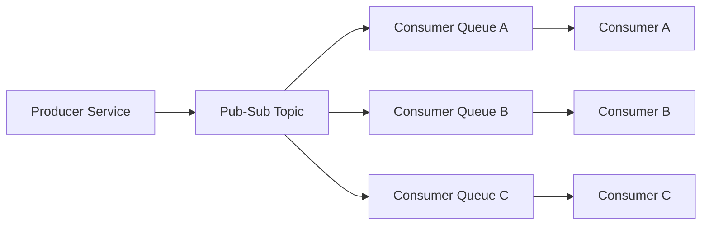
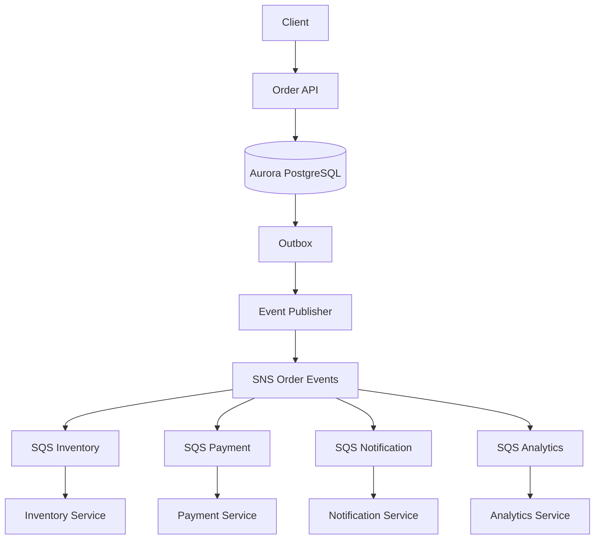

# 10- Decoupling Patterns - Pub-Sub and Fan-Out

## Overview

Publish-subscribe (pub-sub) and fan-out are messaging patterns used to decouple producers from multiple independent consumers.

In a tightly coupled architecture, a producer must know which services need to be notified:

```text
Order Service
   |
   +----> Inventory Service
   |
   +----> Notification Service
   |
   +----> Analytics Service
```

The producer becomes responsible for knowing downstream destinations, handling their failures, and potentially waiting for them.

With pub-sub, the producer publishes an event to a shared messaging abstraction:

```text
                    +--> Inventory Service
                    |
Order Service --> Topic
                    |
                    +--> Notification Service
                    |
                    +--> Analytics Service
```

The producer knows about the topic or event bus, but does not need direct knowledge of every consumer.

This creates several important architectural properties:

- independent consumer scaling
- independent consumer failures
- independent retry policies
- asynchronous processing
- reduced runtime coupling
- easier addition of new consumers
- workload isolation
- event-driven integration

In AWS architectures, pub-sub and fan-out are commonly implemented using Amazon SNS, Amazon SQS, Amazon EventBridge, and Amazon Kinesis. The correct service depends on whether the requirement is task distribution, message fan-out, event routing, or event streaming.

---

## What Pub-Sub Means

Pub-sub separates message producers from message consumers through an intermediary messaging system.

The core participants are:

- **Publisher** — produces a message or event.
- **Topic** — logical destination for published messages.
- **Subscriber** — consumes messages from the topic.
- **Broker** — manages delivery between publishers and subscribers.

The basic flow is:

```text
Publisher
    |
    | publish
    v
  Topic
    |
    +----> Subscriber A
    |
    +----> Subscriber B
    |
    +----> Subscriber C
```

The publisher does not need to synchronously invoke each subscriber.

---

## Why Pub-Sub Exists

Without pub-sub, adding another consumer often requires changing the producer.

For example:

```text
Order Service
   |
   +----> Inventory
   |
   +----> Email
```

Later, analytics requires order events:

```text
Order Service
   |
   +----> Inventory
   |
   +----> Email
   |
   +----> Analytics
```

The producer now needs another dependency.

With pub-sub:

```text
Order Service
      |
      v
 OrderCreated
      |
      v
   Topic
      |
      +----> Inventory
      +----> Email
      +----> Analytics
```

Analytics can be added without changing the core order-processing logic.

This is a major reduction in coupling.

---

## Pub-Sub vs Point-to-Point

The difference is fundamental.

### Point-to-Point

```text
Producer
   |
   v
 Queue
   |
   v
Consumer
```

A message is generally intended for one consumer processing path.

### Pub-Sub

```text
Publisher
    |
    v
  Topic
    |
    +----> Subscriber A
    +----> Subscriber B
    +----> Subscriber C
```

Each subscriber receives its own logical copy of the published message.

| Characteristic | Point-to-Point | Pub-Sub |
|---|---|---|
| Primary goal | Work distribution | Event distribution |
| Consumers | Usually one processing path | Multiple subscribers |
| Fan-out | Limited | Native concept |
| Typical AWS combination | SQS | SNS + SQS |
| Independent retries | Depends on topology | Yes with separate queues |
| Typical use | Background jobs | Domain events |

---

## Fan-Out

Fan-out describes distributing one input to multiple independent processing paths.

Conceptually:

```text
                    +--> Consumer A
                    |
Producer --> Broker -+--> Consumer B
                    |
                    +--> Consumer C
```

The producer generates one logical event, while multiple consumers independently receive and process it.

For example:

```text
OrderCreated
     |
     v
    SNS
     |
     +----> Payment Queue
     |
     +----> Inventory Queue
     |
     +----> Notification Queue
     |
     +----> Analytics Queue
```

This is a classic AWS fan-out architecture.

---

## Pub-Sub and Fan-Out Relationship

Pub-sub is the communication model.

Fan-out is the distribution behavior.

A useful mental model is:

```text
Pub-Sub
   |
   v
One publisher
   |
   v
One logical topic
   |
   +----> Many subscribers
               |
               v
             Fan-Out
```

Therefore:

> Pub-sub enables decoupled publication and subscription; fan-out is the resulting one-to-many distribution pattern.

---

## Why Fan-Out Is Useful

Fan-out is useful when one business event has multiple independent consequences.

For example:

```text
PaymentCompleted
       |
       +----> Update Order
       |
       +----> Send Receipt
       |
       +----> Update Analytics
       |
       +----> Update Customer Profile
       |
       +----> Audit Event
```

Without fan-out, the payment service would need to invoke all these systems.

With fan-out:

```text
Payment Service
      |
      v
PaymentCompleted
      |
      v
Event Broker
      |
      +----> Order
      +----> Receipt
      +----> Analytics
      +----> Profile
      +----> Audit
```

Each consumer becomes independently deployable and scalable.

---

## Core Architecture

A robust pub-sub architecture commonly looks like:



The queues are important because they provide buffering and isolate consumer behavior.

---

## Why Topic-to-Queue Is Usually Better Than Direct Delivery

Consider:

```text
Topic
 |
 +----> Consumer A
 +----> Consumer B
 +----> Consumer C
```

If Consumer B is unavailable, the broker may not provide the same durable workload isolation that a dedicated queue provides.

A more resilient design is:

```text
Topic
 |
 +----> Queue A --> Consumer A
 |
 +----> Queue B --> Consumer B
 |
 +----> Queue C --> Consumer C
```

Now each consumer gets:

- independent buffering
- independent retry behavior
- independent scaling
- independent failure isolation
- independent DLQ configuration

This is one of the most useful production patterns for AWS pub-sub architectures.

---

## Amazon SNS

Amazon Simple Notification Service (SNS) is a managed pub-sub service.

A topic represents a logical publication destination:

```text
Publisher
    |
    v
 SNS Topic
    |
    +----> Subscriber A
    +----> Subscriber B
    +----> Subscriber C
```

SNS can deliver messages to supported subscriber types, including SQS queues, Lambda functions, HTTP/S endpoints, and other AWS integrations.

For backend microservices, SNS combined with SQS is especially useful because each subscriber can receive messages through its own durable queue.

---

## SNS + SQS Fan-Out

A common AWS production architecture is:

```text
                    SNS Topic
                        |
            +-----------+-----------+
            |           |           |
            v           v           v
         SQS A       SQS B       SQS C
            |           |           |
            v           v           v
       Service A   Service B   Service C
```

For example:

```text
OrderCreated
     |
     v
 SNS: OrderEvents
     |
     +----> SQS: InventoryEvents
     |
     +----> SQS: NotificationEvents
     |
     +----> SQS: AnalyticsEvents
```

Each queue becomes the consumer's own workload buffer.

---

## Why SQS Should Usually Sit Behind SNS

Suppose the analytics service is down for 30 minutes.

With a dedicated queue:

```text
SNS
 |
 +----> Inventory Queue ---> Inventory
 |
 +----> Analytics Queue ---> Analytics DOWN
                                  |
                                  v
                            Messages accumulate
```

Inventory continues processing normally.

Analytics can recover later and process its backlog.

This is significantly more resilient than making the producer synchronously call analytics.

---

## Consumer Isolation

One of the strongest benefits of topic-to-queue fan-out is failure isolation.

```text
                 SNS
                  |
       +----------+----------+
       |          |          |
       v          v          v
     Queue A    Queue B    Queue C
       |          |          |
       v          X          v
   Consumer A  Consumer B  Consumer C
```

A failure in Consumer B should not inherently stop A or C.

This creates independent failure domains.

---

## Independent Scaling

Different consumers usually have different workloads.

For example:

```text
Inventory:
500 msg/sec

Notifications:
2,000 msg/sec

Analytics:
100 msg/sec
```

With separate queues, each consumer can scale independently:

```text
Inventory Queue
     |
     +--> 5 workers

Notification Queue
     |
     +--> 20 workers

Analytics Queue
     |
     +--> 2 workers
```

This is much more efficient than scaling the entire application as one unit.

---

## Independent Retry Policies

Different consumers may require different retry behavior.

For example:

| Consumer | Retry Strategy |
|---|---|
| Payment | Aggressive but bounded |
| Email | Several retries |
| Analytics | Longer retry window |
| Audit | High durability |
| External API | Backoff + rate limiting |

Separate queues make these policies easier to implement independently.

---

## Independent Dead Letter Queues

Each consumer should generally have its own failure isolation strategy.

```text
SNS Topic
   |
   +----> SQS A ---> Consumer A ---> DLQ A
   |
   +----> SQS B ---> Consumer B ---> DLQ B
   |
   +----> SQS C ---> Consumer C ---> DLQ C
```

This prevents a notification failure from contaminating inventory or payment processing.

---

## Event Lifecycle

A typical event lifecycle is:

```text
Business Operation
       |
       v
Create Event
       |
       v
Publish to Topic
       |
       v
Topic Fan-Out
       |
       +----> Queue A
       |        |
       |        v
       |     Consumer A
       |
       +----> Queue B
       |        |
       |        v
       |     Consumer B
       |
       +----> Queue C
                |
                v
             Consumer C
```

Each queue manages its own processing lifecycle.

---

## Event Example

A production-oriented event might look like:

```json
{
  "event_id": "evt_01JABC123",
  "event_type": "OrderCreated",
  "event_version": 1,
  "occurred_at": "2026-08-24T14:30:00Z",
  "producer": "order-service",
  "correlation_id": "req_01JXYZ456",
  "data": {
    "order_id": "ord_12345",
    "customer_id": "cus_67890",
    "total_amount": 2499
  }
}
```

Important metadata includes:

- unique event ID
- event type
- schema version
- timestamp
- producer identity
- correlation ID
- business payload

---

## Event Naming

Events should represent facts.

Good:

```text
OrderCreated
PaymentAuthorized
PaymentCompleted
ShipmentDispatched
UserRegistered
```

Less appropriate for events:

```text
CreateOrder
ProcessPayment
SendEmail
```

The latter are commands.

A useful distinction is:

```text
Command:
"Please process this payment."

Event:
"The payment has been processed."
```

This distinction helps maintain clean service boundaries.

---

## Event Schema as an API Contract

An event is effectively an API between producer and consumers.

For example:

```text
Order Service
     |
     | OrderCreated v1
     v
Broker
     |
     +----> Inventory v1
     +----> Notification v3
     +----> Analytics v2
```

The producer cannot assume that all consumers upgrade simultaneously.

Therefore, schema compatibility matters.

---

## Schema Evolution

Prefer additive, backward-compatible changes.

For example, adding:

```json
{
  "customer_segment": "premium"
}
```

is usually safer than changing:

```json
"customer_id"
```

into:

```json
"customer"
```

Potential strategies include:

- optional fields
- explicit event versions
- schema registries
- compatibility testing
- consumer-driven contract testing

Breaking changes should be deliberate and coordinated.

---

## Message Ordering

Pub-sub systems do not automatically guarantee global ordering across all consumers.

Suppose:

```text
OrderCreated
OrderCancelled
```

are published.

Different consumers or processing paths may observe them differently depending on the messaging system and configuration.

If ordering is required, define the ordering boundary.

Examples:

```text
Per order
Per customer
Per account
Per partition
```

Avoid demanding global ordering unless the business requirement truly needs it.

---

## Duplicate Delivery

Asynchronous messaging should generally be designed with duplicate delivery in mind.

For example:

```text
OrderCreated
    |
    v
Consumer A
    |
    X
Acknowledgment lost
    |
    v
OrderCreated delivered again
```

The consumer must not accidentally create two orders, charge twice, or send duplicate side effects.

Use:

- event IDs
- idempotency keys
- unique database constraints
- inbox tables
- transactional processing

---

## Idempotent Consumer

A common implementation is to persist the event ID.

Conceptually:

```text
Receive Event
     |
     v
Check event_id
     |
     +---- Already processed --> Acknowledge
     |
     +---- New event ---------> Process
                                  |
                                  v
                            Store event_id
```

A database uniqueness constraint provides a strong safeguard:

```sql
CREATE TABLE processed_events (
    event_id VARCHAR(255) PRIMARY KEY,
    processed_at TIMESTAMPTZ NOT NULL
);
```

The business update and event record should be committed atomically when correctness requires it.

---

## At-Least-Once Delivery

At-least-once delivery means a message should not be lost after successful publication, but duplicate delivery can occur.

The practical design is:

```text
At-least-once delivery
        +
Idempotent consumers
        +
Safe retries
        =
Reliable business processing
```

Do not design business logic around the assumption that every event will be received exactly once.

---

## Backpressure

Fan-out can multiply workload.

Suppose:

```text
1,000 events/sec
```

are published to:

```text
5 consumers
```

The system creates:

```text
5 independent processing workloads
```

If one consumer can only process:

```text
200 events/sec
```

its queue will grow.

That is not necessarily a failure.

The queue is providing buffering.

However, continuously growing backlog indicates that the consumer needs:

- more workers
- more efficient processing
- batching
- downstream optimization
- producer throttling
- workload redesign

---

## Queue Depth and Message Age

Monitor both queue depth and message age.

For example:

```text
Queue depth = 10,000
Oldest message = 2 seconds
```

may be acceptable during a short burst.

But:

```text
Queue depth = 500
Oldest message = 30 minutes
```

may indicate severe processing problems.

Important metrics include:

- visible messages
- in-flight messages
- oldest message age
- processing latency
- consumer throughput
- retry count
- DLQ depth

---

## Fan-Out and Backpressure

One producer can generate pressure across several consumers.

```text
                   Topic
                     |
        +------------+------------+
        |            |            |
        v            v            v
     Queue A      Queue B      Queue C
        |            |            |
        v            v            v
     Healthy       Slow          Failed
```

Queue B and Queue C should not necessarily prevent Queue A from progressing.

This is why dedicated queues are so important.

---

## Priority Isolation

Different event consumers may have different business criticality.

For example:

```text
OrderCreated
     |
     +----> Payment Queue
     |
     +----> Notification Queue
     |
     +----> Analytics Queue
```

Payment may be business-critical while analytics can tolerate delay.

Independent queues allow the infrastructure to reflect these priorities.

---

## Filtering

Not every subscriber needs every event.

Suppose a topic receives:

```text
OrderCreated
OrderCancelled
PaymentCompleted
ShipmentDispatched
```

The analytics consumer may need all of them.

The notification consumer may only need:

```text
OrderCreated
ShipmentDispatched
```

Message filtering can prevent unnecessary processing.

This reduces:

- compute cost
- queue traffic
- consumer complexity
- irrelevant message handling

---

## Amazon SNS Message Filtering

SNS supports subscription filtering policies.

Conceptually:

```text
SNS Topic
   |
   +---- Filter: event_type = OrderCreated
   |        |
   |        v
   |     Queue A
   |
   +---- Filter: event_type = PaymentCompleted
            |
            v
         Queue B
```

Filtering should be based on stable event attributes rather than fragile assumptions about payload structure.

---

## SNS Topic Design

Avoid creating topics based on every individual consumer.

A topic should usually represent a meaningful event domain or event category.

For example:

```text
order-events
payment-events
shipment-events
```

rather than:

```text
inventory-consumer-topic
notification-consumer-topic
analytics-consumer-topic
```

The consumer-specific concern belongs primarily in subscriptions and queues.

---

## Topic Granularity

There is no universal rule for topic granularity.

Too coarse:

```text
everything-events
```

can become difficult to govern and filter.

Too fine:

```text
order-created-topic
order-updated-topic
order-cancelled-topic
...
```

can create unnecessary operational complexity.

Choose boundaries based on:

- domain ownership
- event lifecycle
- security requirements
- retention needs
- subscriber patterns
- operational ownership

---

## AWS Architecture Example

A production order platform might use:



The transactional outbox is important because the order database update and event publication are separate systems.

---

## Transactional Outbox

Consider:

```text
BEGIN TRANSACTION

Create Order

Publish OrderCreated

COMMIT
```

The database and SNS publication cannot automatically participate in one ordinary PostgreSQL transaction.

If publication fails after the database commit:

```text
Database = committed
Event = missing
```

The order exists, but downstream consumers never learn about it.

The transactional outbox pattern solves this by storing the event in the same database transaction:

```text
PostgreSQL
    |
    +---- Orders
    |
    +---- Outbox Events
             |
             v
       Event Publisher
             |
             v
          SNS Topic
```

---

## Outbox Example

```sql
BEGIN;

INSERT INTO orders (
    id,
    customer_id,
    status
)
VALUES (
    'ord_123',
    'cus_456',
    'CREATED'
);

INSERT INTO outbox_events (
    event_id,
    event_type,
    aggregate_id,
    payload
)
VALUES (
    'evt_123',
    'OrderCreated',
    'ord_123',
    '{"order_id":"ord_123"}'
);

COMMIT;
```

A publisher later reads unpublished outbox records and publishes them to the topic.

The publisher itself must tolerate duplicate publication.

---

## Failure Isolation

Consider:

```text
SNS
 |
 +----> Payment Queue ------> Payment Service
 |
 +----> Inventory Queue ----> Inventory Service
 |
 +----> Notification Queue -> Notification Service
                                  |
                                  X
```

If notification processing fails:

```text
Payment      = healthy
Inventory    = healthy
Notification = unhealthy
```

The other consumers can continue.

This is a major architectural advantage of fan-out.

---

## Dead Letter Queues

Each queue should generally have an independent DLQ:

```text
SNS
 |
 +----> Payment Queue ------> Payment Worker
 |                              |
 |                              v
 |                           Payment DLQ
 |
 +----> Notification Queue -> Notification Worker
                                |
                                v
                            Notification DLQ
```

This allows operators to identify which consumer is failing and why.

A DLQ should not simply be a place where messages disappear.

It should support:

- monitoring
- inspection
- alerting
- root-cause analysis
- controlled replay

---

## Retry Behavior

Different consumers may need different retry policies.

For example:

```text
Payment:
  5 retries
  exponential backoff
  jitter

Notification:
  10 retries
  longer delay

Analytics:
  longer retention
  delayed replay
```

Independent queues make this possible without affecting unrelated consumers.

---

## Retry Storms

Consider:

```text
10,000 messages
       |
       v
Consumer dependency fails
       |
       v
10,000 immediate retries
       |
       v
Dependency becomes even more overloaded
```

This is a retry storm.

Use:

- exponential backoff
- jitter
- bounded retries
- DLQs
- circuit breakers
- concurrency limits

Retries should reduce pressure rather than amplify it.

---

## Consumer Concurrency

Fan-out does not remove downstream capacity constraints.

Consider:

```text
SNS
 |
 v
Payment Queue
 |
 v
100 Workers
 |
 v
Payment Provider
```

If the payment provider permits only 20 concurrent requests, 100 workers may create rate-limit failures.

Consumer concurrency should therefore account for:

```text
Queue pressure
+
CPU capacity
+
Database capacity
+
External API limits
```

---

## Eventual Consistency

Pub-sub systems commonly introduce eventual consistency.

For example:

```text
OrderCreated
     |
     +----> Inventory
     |
     +----> Notification
     |
     +----> Analytics
```

These systems may process the event at different times.

Therefore:

```text
Order created
Inventory updated later
Analytics updated later
Notification sent later
```

The API and user experience should represent intermediate states where necessary.

For example:

```json
{
  "order_id": "ord_123",
  "status": "PROCESSING"
}
```

is often more accurate than claiming the entire workflow has completed.

---

## Event Ordering

Ordering requirements should be explicit.

Suppose:

```text
PaymentAuthorized
PaymentCaptured
PaymentRefunded
```

must be processed in sequence for one payment.

A consumer should not process:

```text
PaymentRefunded
```

before:

```text
PaymentCaptured
```

Possible solutions depend on the messaging system and workload:

- FIFO queues
- partition keys
- per-aggregate ordering
- serialized processing
- state-machine validation

Do not impose global ordering if only per-entity ordering is required.

---

## Message Idempotency

A robust event consumer should assume:

```text
Event may arrive:
- once
- twice
- later
- after a temporary failure
```

For business operations, use stable identifiers.

For example:

```text
event_id = evt_123
order_id = ord_456
```

A database uniqueness constraint can prevent duplicate business effects.

```sql
CREATE UNIQUE INDEX idx_payment_event
ON payments (source_event_id);
```

---

## Payload Design

Events should contain enough information for consumers without unnecessarily coupling them to producer internals.

Prefer:

```json
{
  "event_type": "OrderCreated",
  "event_id": "evt_123",
  "order_id": "ord_456",
  "customer_id": "cus_789"
}
```

Avoid exposing entire internal database models:

```json
{
  "internal_order_model": {
    "all_internal_fields": "...",
    "implementation_metadata": "..."
  }
}
```

An event contract should represent a stable business interface rather than an accidental database representation.

---

## Full Payload vs Reference Event

### Full Payload

```json
{
  "event_type": "OrderCreated",
  "order_id": "ord_123",
  "customer_id": "cus_456",
  "total": 2500,
  "currency": "INR"
}
```

Advantages:

- fewer additional reads
- consumer independence
- lower synchronous coupling

Limitations:

- payload growth
- possible stale information
- schema management

### Reference Event

```json
{
  "event_type": "OrderCreated",
  "order_id": "ord_123"
}
```

Advantages:

- small messages
- simpler event contracts

Limitations:

- consumers must query the source
- stronger runtime coupling
- additional latency
- additional database load

Choose based on consistency and ownership requirements.

---

## Security Considerations

Pub-sub infrastructure should follow least-privilege access.

For example:

```text
Order Service
   |
   | PublishOnly
   v
SNS Topic
   |
   v
SQS Queue
   |
   | ConsumeOnly
   v
Inventory Service
```

The inventory service should not automatically receive permission to publish arbitrary events to the topic.

Important practices include:

- least-privilege IAM policies
- encryption at rest
- encryption in transit where supported
- queue and topic resource policies
- private networking where appropriate
- payload validation
- audit logging
- sensitive-data minimization

---

## Sensitive Data in Events

Events can persist for some period and may be consumed by multiple systems.

Avoid putting unnecessary sensitive data into events.

Prefer:

```json
{
  "customer_id": "cus_123",
  "order_id": "ord_456"
}
```

over:

```json
{
  "customer_password": "...",
  "credit_card_number": "...",
  "authentication_token": "..."
}
```

Events should contain only the data required for legitimate consumers.

---

## Monitoring

A production pub-sub system should be observable from publisher through consumer.

### Publisher Metrics

Monitor:

- publish rate
- publish latency
- publish failures
- rejected messages
- event volume

### Topic Metrics

Monitor:

- publication activity
- delivery failures
- subscription health where applicable

### Queue Metrics

Monitor:

- queue depth
- oldest message age
- in-flight messages
- processing latency
- DLQ depth

### Consumer Metrics

Monitor:

- throughput
- success rate
- failure rate
- retry count
- worker utilization
- downstream latency

---

## Distributed Tracing

An asynchronous architecture breaks the traditional HTTP request path:

```text
HTTP Request
    |
    v
Order Service
    |
    v
SNS
    |
    v
SQS
    |
    v
Inventory Service
```

Correlation identifiers allow operators to connect these operations.

Useful identifiers include:

```text
trace_id
correlation_id
event_id
aggregate_id
```

For example:

```json
{
  "event_id": "evt_123",
  "correlation_id": "req_456",
  "trace_id": "4bf92f3577..."
}
```

This makes distributed debugging significantly easier.

---

## Cost Considerations

Fan-out multiplies message processing.

One event sent to:

```text
5 queues
```

creates five independent delivery and processing workloads.

Costs can therefore include:

- SNS requests
- SQS requests
- worker compute
- database operations
- network traffic
- CloudWatch metrics
- logs
- DLQ storage
- replay processing

Do not create unnecessary subscribers.

Filter events where consumers do not need the entire event stream.

---

## Pub-Sub vs EventBridge

SNS and EventBridge can both support event-driven architectures, but their primary strengths differ.

| Requirement | SNS | EventBridge |
|---|---|---|
| Simple pub-sub | Excellent | Good |
| SNS/SQS fan-out | Excellent | Possible |
| Event routing | Good | Excellent |
| Content-based filtering | Yes | Strong |
| AWS service integration | Strong | Strong |
| Event buses | No | Yes |
| Cross-account event routing | Supported patterns | Strong |
| Simple notification delivery | Excellent | Usually unnecessary |

Use SNS when straightforward pub-sub and fan-out are the primary requirements.

Use EventBridge when event routing, event buses, filtering, and integration across many producers and targets are central requirements.

---

## Pub-Sub vs Kafka

Kafka is a distributed event streaming platform rather than simply a notification topic.

| Requirement | SNS/SQS | Kafka |
|---|---|---|
| Simple fan-out | Excellent | Possible |
| Background jobs | Excellent | Possible |
| Managed AWS integration | Excellent | Strong with MSK |
| Event replay | More limited | Strong |
| Durable event log | Limited | Excellent |
| Partition-based ordering | Limited | Strong |
| Consumer offsets | Queue semantics | Native |
| Operational complexity | Lower | Higher |
| Very high event-stream throughput | Depends on workload | Excellent |

If the requirement is:

```text
"Notify several services that an event occurred."
```

SNS/SQS may be appropriate.

If the requirement is:

```text
"Maintain a durable stream that multiple consumers independently replay."
```

Kafka is often a better fit.

---

## Pub-Sub vs Queue-Based Load Leveling

These patterns are complementary.

### Pub-Sub

Answers:

> Who needs to know that this event happened?

```text
Event
 |
 +--> Service A
 +--> Service B
 +--> Service C
```

### Queue-Based Load Leveling

Answers:

> How quickly should this workload be processed?

```text
Producer
   |
   v
Queue
   |
   v
Workers
```

Combining them gives:

```text
                 Topic
                   |
       +-----------+-----------+
       |           |           |
       v           v           v
    Queue A     Queue B     Queue C
       |           |           |
       v           v           v
   Workers A   Workers B   Workers C
```

This provides both decoupling and workload buffering.

---

## Production Failure Scenarios

### Consumer Failure

```text
SNS
 |
 v
SQS
 |
 v
Consumer
 |
 X
```

Messages remain available in the queue and can be retried.

---

### Consumer Permanently Fails

```text
SQS
 |
 v
Consumer
 |
 X
 |
Retry
 |
X
 |
v
DLQ
```

Operators can investigate and replay after remediation.

---

### Producer Failure

If the producer cannot publish the event, the producer must handle the failure appropriately.

When the event represents a database state transition, an outbox is often appropriate:

```text
Database Transaction
        |
        +----> Business Data
        |
        +----> Outbox Event
                    |
                    v
              Publisher
                    |
                    v
                  SNS
```

---

### One Consumer Is Slow

```text
SNS
 |
 +----> Queue A ---> Fast
 |
 +----> Queue B ---> Slow
 |
 +----> Queue C ---> Fast
```

Queue B accumulates backlog without inherently blocking A or C.

This is a core benefit of independent queues.

---

## Common Mistakes

### Treating SNS as a Work Queue

SNS is primarily a publication/fan-out mechanism.

For durable consumer workload buffering, SNS + SQS is often the stronger architecture.

---

### Directly Connecting Every Service

This creates:

```text
A --> B
A --> C
A --> D
B --> C
B --> D
C --> D
```

The dependency graph grows rapidly.

Pub-sub centralizes the communication boundary:

```text
A --> Topic
B --> Topic
C --> Topic
D --> Topic
```

---

### One Queue Shared by Multiple Unrelated Consumers

If multiple independent services share one queue, one consumer may receive a message intended for another.

Prefer:

```text
Topic
 |
 +--> Queue A
 +--> Queue B
 +--> Queue C
```

rather than:

```text
Topic
 |
 v
Shared Queue
 |
 +--> Consumer A
 +--> Consumer B
 +--> Consumer C
```

when each service needs every event independently.

---

### No Idempotency

Duplicate events can produce duplicate business effects.

Always design consumers with duplicate delivery in mind.

---

### Assuming Global Ordering

Ordering must be defined at the required business boundary.

Global ordering can unnecessarily reduce scalability.

---

### Publishing Database State Directly

Database updates and event publication are separate operations.

Use a transactional outbox or another consistency strategy where required.

---

### Ignoring Consumer Backlog

A successful producer does not mean the overall workflow is healthy.

Monitor:

```text
Queue depth
Oldest message age
Processing latency
DLQ depth
```

---

### Overusing Events

Not every internal operation needs an event.

A synchronous service call may be simpler when:

- immediate response is required
- only one consumer exists
- the operation is trivial
- eventual consistency is unacceptable

---

### Creating Excessive Topics

Too many topics create:

- operational overhead
- confusing ownership
- difficult permissions
- unnecessary monitoring
- fragmented event contracts

Choose meaningful domain boundaries.

---

### Putting Internal Database Models in Events

Events should expose stable business contracts, not internal persistence structures.

---

## Production Checklist

### Architecture

- [ ] Producers do not directly depend on every consumer.
- [ ] Pub-sub is used where multiple independent consumers need the same event.
- [ ] Each independent consumer has an appropriate queue where durable buffering is required.
- [ ] Consumer scaling is independent.
- [ ] Failure domains are isolated.

### Messaging

- [ ] Event schemas are explicitly defined.
- [ ] Events contain stable business contracts.
- [ ] Event IDs are unique.
- [ ] Consumers are idempotent.
- [ ] Duplicate delivery is expected.
- [ ] Ordering requirements are explicit.
- [ ] Filtering is used where appropriate.

### Reliability

- [ ] Queues have appropriate visibility timeouts.
- [ ] Retry policies are bounded.
- [ ] Exponential backoff and jitter are used where appropriate.
- [ ] DLQs are configured.
- [ ] Replay procedures exist.
- [ ] Consumer concurrency is bounded.
- [ ] Downstream capacity is protected.

### Consistency

- [ ] Database/event dual writes are addressed.
- [ ] Transactional outbox is considered where appropriate.
- [ ] Eventual consistency is reflected in API behavior.
- [ ] Consumer-side idempotency protects business effects.

### Observability

- [ ] Publisher failures are monitored.
- [ ] Queue depth is monitored.
- [ ] Oldest-message age is monitored.
- [ ] DLQ depth is monitored.
- [ ] Consumer latency and failures are monitored.
- [ ] Correlation IDs are propagated.
- [ ] Distributed tracing covers asynchronous boundaries.

### Security

- [ ] IAM follows least privilege.
- [ ] Topic publishing permissions are restricted.
- [ ] Queue consumption permissions are restricted.
- [ ] Encryption requirements are satisfied.
- [ ] Sensitive data is minimized.
- [ ] Resource policies are reviewed.
- [ ] Audit logging is enabled where required.

---

## Interview Perspective

A strong answer to:

> "How would you notify multiple microservices when an order is created?"

should progress beyond simply saying "use SNS."

A production-oriented answer would be:

```text
Order Service
     |
     v
Transactional Database
     |
     v
Outbox
     |
     v
SNS Topic
     |
     +----> SQS Inventory Queue ----> Inventory Service
     |
     +----> SQS Payment Queue ------> Payment Service
     |
     +----> SQS Notification Queue -> Notification Service
     |
     +----> SQS Analytics Queue ----> Analytics Service
```

Then discuss:

- why the producer should not directly call every consumer
- why SNS provides fan-out
- why each consumer benefits from a dedicated SQS queue
- independent retries
- independent DLQs
- idempotent consumers
- at-least-once delivery
- visibility timeout
- schema versioning
- ordering requirements
- transactional outbox
- eventual consistency
- queue monitoring
- consumer autoscaling
- downstream capacity
- security and IAM
- controlled replay

The important architectural reasoning is:

> One business event should be published once, while independent consumers should own their own processing lifecycle.

## Key Takeaways

- Pub-sub decouples publishers from subscribers, while fan-out distributes one logical event to multiple independent processing paths.
- SNS + dedicated SQS queues is a strong AWS pattern for reliable fan-out because each consumer receives independent buffering, retries, scaling, and failure isolation.
- At-least-once delivery means consumers must be idempotent; event IDs, uniqueness constraints, and transactional processing are common safeguards.
- Event schemas are long-lived API contracts, so backward compatibility, versioning, ordering, filtering, and payload design must be treated as architectural concerns.
- Production pub-sub systems require explicit handling of backpressure, DLQs, replay, observability, IAM, eventual consistency, downstream capacity, and database/event consistency.