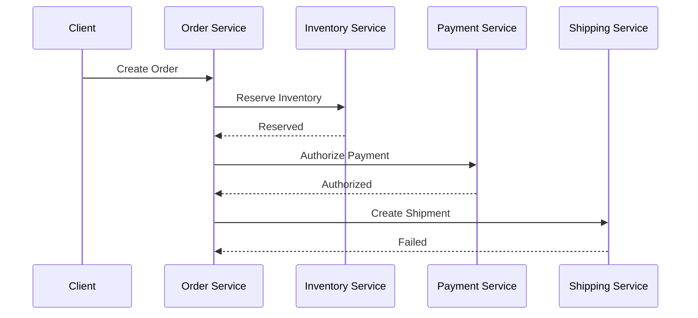
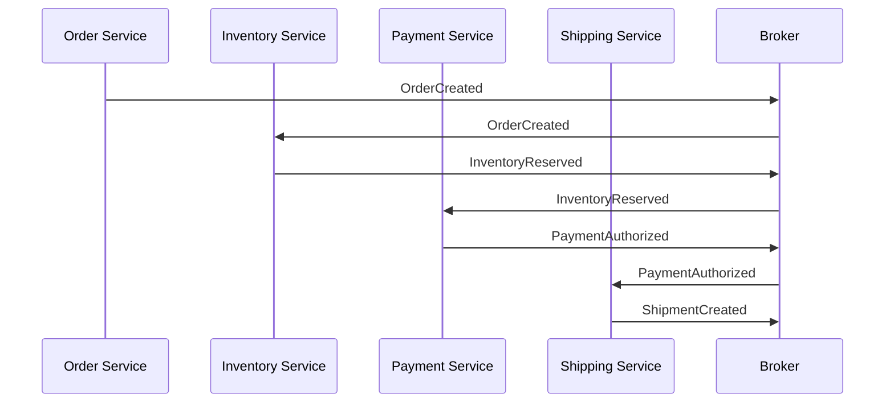
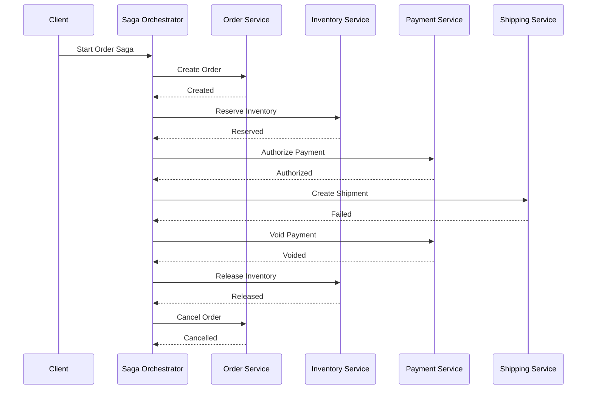
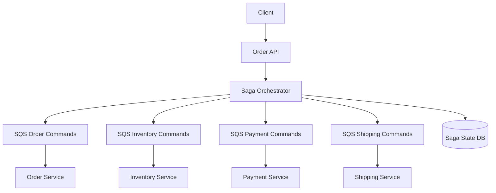
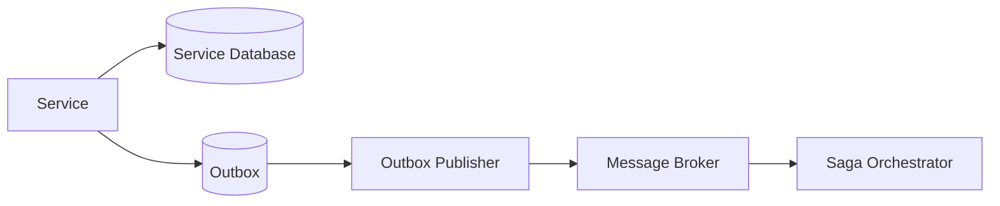

# 11- Distributed Transactions - The Saga Pattern

## Overview

Distributed transactions arise when a single business operation spans multiple independently owned services or databases.

In a monolithic application, a business operation can often be protected by one database transaction:

```text
BEGIN TRANSACTION

Create Order
Reserve Inventory
Create Payment

COMMIT
```

If any operation fails, the database can roll back the entire transaction.

Microservices change this model:

```text
Order Service       -> Order Database
Inventory Service   -> Inventory Database
Payment Service     -> Payment Database
Shipping Service    -> Shipping Database
```

A single business workflow now crosses multiple transactional boundaries. A PostgreSQL transaction in one service cannot automatically roll back changes already committed in another service.

The Saga Pattern addresses this problem by decomposing a distributed business transaction into a sequence of local transactions, with compensating actions used when later steps fail.

A simplified workflow is:

```text
Create Order
    |
    v
Reserve Inventory
    |
    v
Authorize Payment
    |
    v
Create Shipment
```

If shipment creation fails:

```text
Create Order
    |
    v
Reserve Inventory
    |
    v
Authorize Payment
    |
    X
Shipment Failed
    |
    v
Compensate Payment
    |
    v
Release Inventory
    |
    v
Cancel Order
```

The Saga Pattern does not provide traditional ACID atomicity across services. Instead, it provides a mechanism for achieving business-level consistency through coordinated local transactions and compensating operations.

---

## Why Distributed Transactions Are Difficult

A distributed transaction crosses independent failure domains.

Consider:



At this point:

```text
Order      = Created
Inventory  = Reserved
Payment    = Authorized
Shipping   = Failed
```

There is no single database transaction that can simply execute:

```sql
ROLLBACK;
```

across all four services.

The architecture must explicitly define how to restore the business process to a valid state.

---

## Local Transactions vs Distributed Transactions

A local transaction is controlled by one transactional resource.

```text
Service
  |
  v
PostgreSQL
  |
  v
BEGIN
  |
  +--> UPDATE
  +--> INSERT
  |
COMMIT
```

A distributed transaction spans multiple resources:

```text
Order DB
    |
    +---- Inventory DB
    |
    +---- Payment DB
    |
    +---- Shipping DB
```

The fundamental problem is coordinating these independent commits while handling:

- network failures
- service failures
- timeouts
- retries
- duplicate requests
- partial success
- delayed responses
- database failures
- message delivery failures

---

## What the Saga Pattern Is

A Saga is a sequence of local transactions where each successful transaction advances the business workflow.

For each forward operation, there may be a corresponding compensating operation.

| Forward Transaction | Possible Compensation |
|---|---|
| Create Order | Cancel Order |
| Reserve Inventory | Release Inventory |
| Authorize Payment | Void Authorization |
| Create Shipment | Cancel Shipment |
| Allocate Resource | Deallocate Resource |

Conceptually:

```text
T1 -> T2 -> T3 -> T4

If T4 fails:

C3 -> C2 -> C1
```

Where:

- `T1...T4` are forward transactions.
- `C1...C3` are compensating transactions.

The compensation is not a database rollback. It is a new business operation that attempts to undo the business effect.

---

## Important Distinction: Rollback vs Compensation

A database rollback:

```text
UPDATE inventory
SET reserved = reserved - 1;

ROLLBACK;
```

returns the database to its previous transactional state.

A Saga compensation:

```text
Inventory Service
    |
    v
ReleaseInventory
```

is a new transaction executed later.

For example:

```text
Reserve Inventory
       |
       v
Payment Authorized
       |
       X
Shipping Failed
       |
       v
Release Inventory
```

The release operation may succeed, fail, or take time.

Therefore:

> Compensation is not equivalent to rollback.

This distinction is one of the most important concepts in distributed systems.

---

## When to Use the Saga Pattern

Saga is appropriate when:

- a business workflow spans multiple services
- each service owns its own database
- strong global ACID transactions are impractical
- eventual consistency is acceptable
- business operations have meaningful compensating actions
- the workflow may take seconds, minutes, or longer
- services need independent deployment and ownership

Typical examples include:

- order fulfillment
- payment workflows
- travel booking
- hotel reservation
- shipment processing
- subscription provisioning
- account onboarding
- resource provisioning

---

## When Not to Use Saga

Saga should not automatically be introduced simply because an application uses microservices.

Avoid unnecessary distributed workflows when:

- the operation can remain inside one service
- a local transaction solves the problem
- strong atomicity is mandatory
- compensation is impossible or unsafe
- the workflow is simple enough for synchronous request/response
- service boundaries are poorly designed

A useful architectural rule is:

> Do not distribute a transaction unless there is a strong reason to distribute ownership.

---

## Saga Architecture

A typical Saga looks like:

```text
                 Saga
                  |
       +----------+----------+
       |          |          |
       v          v          v
   Order Tx   Inventory Tx  Payment Tx
       |          |          |
       v          v          v
   Order DB   Inventory DB  Payment DB
```

Each local transaction commits independently.

The Saga coordinates the overall workflow.

---

## Saga Execution Models

There are two primary implementation approaches:

1. **Choreography**
2. **Orchestration**

They solve the same broad problem but distribute coordination differently.

---

## Choreography

In choreography, services react to events and independently determine what action to take next.

Example:

```text
Order Service
    |
    | OrderCreated
    v
Inventory Service
    |
    | InventoryReserved
    v
Payment Service
    |
    | PaymentAuthorized
    v
Shipping Service
```

There is no central Saga coordinator.

Each service listens for events and publishes the next event.

---

## Choreography Flow



The workflow emerges from event interactions.

---

## Choreography Failure

Suppose payment fails:

```text
OrderCreated
    |
    v
InventoryReserved
    |
    v
PaymentFailed
```

Inventory must react to `PaymentFailed`:

```text
PaymentFailed
     |
     v
Inventory Service
     |
     v
ReleaseInventory
```

Order must also react:

```text
PaymentFailed
     |
     v
Order Service
     |
     v
CancelOrder
```

The compensation logic is distributed across services.

---

## Advantages of Choreography

### Loose Coupling

Services communicate through events rather than directly invoking every downstream service.

### No Central Coordinator

There is no single orchestration component that must remain available.

### Natural Event-Driven Architecture

Choreography works well when the organization already uses:

- Kafka
- SNS
- SQS
- EventBridge
- event-driven microservices

### Independent Ownership

Each service owns its own business reaction to events.

---

## Limitations of Choreography

Choreography becomes difficult as workflow complexity grows.

A workflow such as:

```text
Order
 -> Inventory
 -> Payment
 -> Shipping
 -> Tax
 -> Fraud
 -> Loyalty
 -> Notification
```

can produce a large event dependency graph.

The workflow becomes difficult to understand because there is no single place describing the complete business process.

Common problems include:

- hidden dependencies
- difficult debugging
- circular event dependencies
- unclear workflow ownership
- difficult testing
- difficult compensation reasoning
- event-chain explosion

---

## Orchestration

In orchestration, a central Saga orchestrator coordinates the workflow.

```text
             Saga Orchestrator
              /      |       \
             v       v        v
          Order  Inventory  Payment
```

The orchestrator explicitly controls which operation happens next.

---

## Orchestration Flow



The orchestrator knows the workflow explicitly.

---

## Advantages of Orchestration

### Centralized Workflow Definition

The complete process is visible in one place:

```text
Create Order
   ↓
Reserve Inventory
   ↓
Authorize Payment
   ↓
Create Shipment
```

### Easier Failure Handling

Compensation can be represented explicitly:

```text
Shipping Failed
    ↓
Void Payment
    ↓
Release Inventory
    ↓
Cancel Order
```

### Easier Observability

The orchestrator can maintain:

- Saga ID
- current state
- completed steps
- failed step
- compensation status

### Better for Complex Workflows

Orchestration is usually easier to reason about when workflows have many steps, branches, retries, and compensations.

---

## Limitations of Orchestration

The orchestrator becomes an important architectural component.

Potential problems include:

- orchestration service failure
- excessive coupling to service APIs
- workflow implementation becoming too large
- centralized deployment concerns
- coordinator scaling requirements

The orchestrator should coordinate business workflow, not become a new monolithic business service containing every domain rule.

---

## Choreography vs Orchestration

| Characteristic | Choreography | Orchestration |
|---|---|---|
| Coordinator | None | Central orchestrator |
| Communication | Events | Commands/API/events |
| Workflow visibility | Distributed | Centralized |
| Simple workflows | Excellent | Good |
| Complex workflows | Difficult | Better |
| Debugging | Harder | Easier |
| Coupling | Event-based | Coordinator-based |
| Compensation | Distributed | Centralized |
| Operational complexity | Can grow rapidly | More explicit |
| Best fit | Simple event chains | Complex business workflows |

A useful guideline:

> Prefer choreography for simple event-driven reactions and orchestration for complex business workflows with explicit sequencing and compensation.

---

## Saga State Machine

A Saga can be modeled as a state machine.

Example:

```text
                +----------------+
                | ORDER_CREATED  |
                +-------+--------+
                        |
                        v
                +-------------------+
                | INVENTORY_RESERVED|
                +---------+---------+
                          |
                          v
                +-------------------+
                | PAYMENT_AUTHORIZED|
                +---------+---------+
                          |
                          v
                +-------------------+
                | SHIPMENT_CREATED  |
                +---------+---------+
                          |
                          v
                     COMPLETED
```

Failure transitions are also explicit:

```text
PAYMENT_AUTHORIZED
       |
       X
       v
PAYMENT_FAILED
       |
       v
COMPENSATING
       |
       +--> RELEASE_INVENTORY
       |
       +--> CANCEL_ORDER
       |
       v
CANCELLED
```

Explicit states make recovery and observability significantly easier.

---

## Saga State Storage

An orchestrated Saga usually requires persistent state.

Example:

```text
saga_id
workflow_type
aggregate_id
state
current_step
started_at
updated_at
failure_reason
```

A PostgreSQL table might look like:

```sql
CREATE TABLE saga_instances (
    saga_id UUID PRIMARY KEY,
    saga_type VARCHAR(100) NOT NULL,
    aggregate_id VARCHAR(255) NOT NULL,
    state VARCHAR(50) NOT NULL,
    current_step VARCHAR(100),
    failure_reason TEXT,
    started_at TIMESTAMPTZ NOT NULL,
    updated_at TIMESTAMPTZ NOT NULL
);
```

Do not rely solely on in-memory orchestrator state.

If the orchestrator crashes, the workflow must be recoverable.

---

## Saga Steps

A Saga step should define more than just a forward action.

A useful conceptual model is:

```text
Step
├── Command
├── Success Event
├── Failure Event
├── Retry Policy
├── Timeout
├── Compensation
└── Idempotency Strategy
```

For example:

```text
ReserveInventory
├── Command: ReserveInventory
├── Success: InventoryReserved
├── Failure: InventoryReservationFailed
├── Retry: exponential backoff
├── Timeout: 10 seconds
├── Compensation: ReleaseInventory
└── Idempotency: reservation_id
```

---

## Compensation Design

Compensation is business-specific.

For example:

```text
ReserveInventory
    |
    v
ReleaseInventory
```

is relatively straightforward.

But:

```text
SendEmail
```

may not have a true inverse.

You cannot reliably "unsend" an email.

Similarly:

```text
ChargeCreditCard
```

may be compensated by:

```text
RefundPayment
```

but that is not equivalent to rolling back the original transaction.

The refund itself may:

- take time
- fail
- incur fees
- require manual review
- have different business semantics

Therefore:

> A Saga requires business-level compensations, not mechanical database inverses.

---

## Compensation Is Not Always Perfect

Suppose:

```text
Payment Captured
     |
     v
Shipment Failed
     |
     v
Refund Payment
```

The refund may succeed later.

During that period:

```text
Payment = captured
Shipment = failed
Refund = pending
```

This is a valid intermediate distributed state if the system models it explicitly.

Do not pretend the system is immediately consistent when the workflow is not.

---

## Forward Recovery vs Compensation

Not every failure should trigger compensation.

Suppose a payment service returns:

```text
Timeout
```

The payment may actually have succeeded.

Immediately compensating could be dangerous:

```text
Payment request timed out
        |
        v
Refund payment
```

The payment might not even have been captured.

A safer approach may be:

```text
Timeout
  |
  v
Query payment status
  |
  +---- Captured --> Continue
  |
  +---- Not captured --> Retry
  |
  +---- Unknown --> Reconcile
```

This is called **forward recovery** or reconciliation-oriented recovery.

---

## Unknown Outcomes

Distributed systems frequently produce ambiguous outcomes.

Example:

```text
Service A -> Service B
              |
              v
          Operation
              |
              v
        Response lost
```

Service A does not know whether B:

```text
Succeeded
or
Failed
```

The correct response is not always "retry immediately."

Possible approaches include:

- idempotency keys
- status queries
- reconciliation jobs
- durable operation IDs
- provider webhooks
- explicit state machines

This is particularly important for financial operations.

---

## Idempotency in Saga Steps

Every Saga step should ideally have a stable operation identifier.

Example:

```text
saga_id:
saga-123

step:
PAYMENT_AUTHORIZATION

operation_id:
saga-123-payment-authorization
```

If the same request is received twice:

```text
AuthorizePayment(operation_id)
AuthorizePayment(operation_id)
```

the payment service can detect the duplicate.

A database uniqueness constraint can enforce this.

```sql
CREATE UNIQUE INDEX uq_payment_operation
ON payment_operations (operation_id);
```

---

## Saga and At-Least-Once Messaging

When Kafka, SNS/SQS, or other asynchronous systems are involved, duplicate delivery must be expected.

A typical flow is:

```text
Saga Orchestrator
      |
      v
Command
      |
      v
Message Broker
      |
      v
Service
      |
      X
Acknowledgment lost
      |
      v
Message delivered again
```

The service must process the command idempotently.

This is one reason Saga implementations commonly combine:

```text
Saga State
+
Idempotency
+
Retries
+
Compensation
+
Durable Messaging
```

---

## Saga with SNS and SQS

An AWS implementation can look like:



Each service performs a local transaction.

The orchestrator tracks the overall workflow.

---

## Saga with Kafka

Kafka can be useful when the workflow is naturally event-driven and durable event streams are required.

Example:

```text
OrderCreated
     |
     v
Kafka
     |
     +----> Inventory Consumer
     |
     +----> Payment Consumer
     |
     +----> Notification Consumer
```

Choreography is a natural fit for this style.

For orchestration, a coordinator can publish commands and consume service results through Kafka topics.

---

## Command vs Event in Saga

A critical distinction is between commands and events.

### Command

A command asks a service to perform an action.

```text
ReserveInventory
AuthorizePayment
CreateShipment
```

### Event

An event reports that something happened.

```text
InventoryReserved
PaymentAuthorized
ShipmentCreated
```

The distinction helps prevent ambiguous message semantics.

```text
Orchestrator
    |
    | Command
    v
Inventory Service
    |
    | Event
    v
Orchestrator
```

---

## Synchronous Saga

A Saga does not have to be entirely asynchronous.

An orchestrator can synchronously call services:

```text
API
 |
 v
Orchestrator
 |
 +--> Order Service
 |
 +--> Inventory Service
 |
 +--> Payment Service
 |
 +--> Shipping Service
```

However, this creates longer request latency and stronger runtime coupling.

It may be acceptable for short workflows where immediate user feedback is required.

---

## Asynchronous Saga

An asynchronous Saga can return quickly:

```text
Client
  |
  v
POST /orders
  |
  v
Order Created
  |
  v
202 Accepted
```

The workflow continues in the background:

```text
Saga Worker
   |
   +--> Inventory
   +--> Payment
   +--> Shipping
```

The client can later query:

```http
GET /orders/{order_id}
```

and receive:

```json
{
  "order_id": "ord_123",
  "status": "PROCESSING"
}
```

This architecture is often more scalable for long-running workflows.

---

## API Semantics

For asynchronous Saga workflows, avoid returning:

```http
200 OK
```

with a response that implies the entire business operation completed when it has not.

A common approach is:

```http
202 Accepted
```

with a resource representing the workflow state.

For example:

```json
{
  "order_id": "ord_123",
  "status": "PROCESSING",
  "saga_id": "saga_456"
}
```

The exact API contract depends on the domain.

---

## Timeouts

Every distributed Saga step should have explicit timeout behavior.

Without timeouts:

```text
Saga
 |
 v
Payment Service
 |
 X
No response
 |
 v
Saga stuck forever
```

Instead:

```text
Payment Request
      |
      v
Timeout
      |
      v
Check Status / Retry / Compensate / Escalate
```

Timeouts should be based on realistic service behavior rather than arbitrary small values.

---

## Retries

Retries should distinguish between transient and permanent failures.

### Transient

Examples:

- temporary network failure
- throttling
- temporary database unavailability
- HTTP 503

Retry may be appropriate.

### Permanent

Examples:

- invalid card
- insufficient inventory
- invalid request
- authorization denied

Repeated retries usually waste resources.

---

## Exponential Backoff

A typical retry strategy is:

```text
Attempt 1 -> immediate
Attempt 2 -> 1 second
Attempt 3 -> 2 seconds
Attempt 4 -> 4 seconds
Attempt 5 -> 8 seconds
```

Add jitter so many workers do not retry simultaneously.

Conceptually:

```text
delay = exponential_backoff + random_jitter
```

Bound the maximum delay and number of attempts.

---

## Saga Compensation Ordering

Compensations usually run in reverse order of successfully completed forward steps.

Forward:

```text
T1
T2
T3
T4
```

If T4 fails:

```text
C3
C2
C1
```

Example:

```text
Create Order
Reserve Inventory
Authorize Payment
Create Shipment
       X
       |
       v
Void Payment
       |
       v
Release Inventory
       |
       v
Cancel Order
```

However, compensation ordering is a business decision, not an absolute mathematical rule.

Some compensations may need to happen concurrently or in a different order because of domain dependencies.

---

## Compensation Idempotency

Compensation operations must also be idempotent.

Suppose:

```text
ReleaseInventory
```

is executed twice.

The system must not accidentally release twice as much inventory.

Use stable compensation IDs:

```text
compensation_id =
saga-123-release-inventory
```

and enforce uniqueness where appropriate.

---

## Saga State Transitions

A robust Saga should define explicit states.

Example:

| State | Meaning |
|---|---|
| `STARTED` | Saga initialized |
| `ORDER_CREATED` | Order committed |
| `INVENTORY_RESERVED` | Inventory reserved |
| `PAYMENT_AUTHORIZED` | Payment authorized |
| `SHIPPING_CREATED` | Shipment created |
| `COMPLETED` | Workflow completed |
| `COMPENSATING` | Compensation running |
| `COMPENSATED` | Compensation completed |
| `FAILED` | Workflow requires intervention |

Avoid representing workflow state only through scattered boolean fields.

---

## Partial Compensation

Compensation itself can fail.

Example:

```text
Payment Authorized
Inventory Reserved
Shipping Failed

Compensate Payment -> Success
Release Inventory  -> Failed
```

Now:

```text
Payment = Compensated
Inventory = Reserved
Shipping = Failed
```

The Saga is not fully compensated.

The system needs:

- retry
- alerting
- reconciliation
- manual intervention where necessary

A Saga must therefore model compensation as a workflow of its own.

---

## Manual Intervention

Some failures cannot be automatically resolved.

For example:

```text
Payment provider = UNKNOWN
Refund = FAILED
Inventory release = FAILED
```

The system should not silently mark the order as successful or failed.

A production system may transition to:

```text
MANUAL_REVIEW_REQUIRED
```

and create an operational task.

This is especially important for financial workflows.

---

## Saga Recovery After Orchestrator Failure

Suppose:

```text
Saga Orchestrator
      |
      v
Payment Authorized
      |
      X
Orchestrator crashes
```

If state exists only in memory, the workflow is lost.

A durable orchestrator should persist:

```text
Saga ID
Current State
Completed Steps
Pending Step
Retry Count
Failure Reason
Timestamps
```

After restart:

```text
Orchestrator
     |
     v
Load Saga State
     |
     v
Determine Pending Action
     |
     v
Resume
```

This makes the workflow recoverable.

---

## Concurrency and Race Conditions

Distributed workflows can have concurrent operations.

For example:

```text
Order Saga A
      |
      v
Reserve Inventory

Order Saga B
      |
      v
Reserve Inventory
```

Both may attempt to reserve the final unit.

The inventory service must enforce correctness locally using:

- database transactions
- row-level locking
- optimistic concurrency
- conditional updates
- unique constraints

Saga coordination does not eliminate local concurrency problems.

---

## Saga and Database Transactions

Each service should still use strong local transactions.

For example:

```text
Inventory Service

BEGIN

Check available inventory
Reserve inventory
Record reservation

COMMIT
```

The Saga provides distributed coordination.

The local database transaction provides local atomicity.

These solve different problems.

---

## Saga and Transactional Outbox

A common production architecture combines Saga with transactional outbox.



The local transaction writes:

```text
Business State
+
Outgoing Message
```

atomically.

The publisher later delivers the message.

This reduces the risk of:

```text
Database committed
Message lost
```

---

## Saga and Inbox Pattern

The consumer side can use an inbox table.

```text
Message
   |
   v
Inbox
   |
   v
Business Transaction
```

The inbox records whether a message has already been processed.

Conceptually:

```sql
CREATE TABLE inbox_messages (
    message_id UUID PRIMARY KEY,
    received_at TIMESTAMPTZ NOT NULL
);
```

The message ID should be unique.

This provides a durable idempotency boundary.

---

## Saga vs Two-Phase Commit

Two-phase commit (2PC) attempts to provide stronger distributed transaction semantics.

Conceptually:

```text
Coordinator
    |
    +----> DB A
    |
    +----> DB B
```

The coordinator asks participants to prepare and then commit.

Saga instead uses:

```text
Local Transaction
      |
      v
Next Local Transaction
      |
      v
Compensation if required
```

| Characteristic | Saga | 2PC |
|---|---|---|
| Atomicity | Business-level | Stronger transactional atomicity |
| Lock duration | Usually short | Can be long |
| Availability | Generally better | Can suffer during coordinator issues |
| Coupling | Service-level | Transaction participant-level |
| Compensation | Required | Not the primary mechanism |
| Long workflows | Good | Poor fit |
| Microservices | Common | Often avoided |
| Complexity | Application-level | Infrastructure/protocol-level |

Saga is usually preferred for long-running business workflows in microservice architectures.

---

## Why 2PC Is Often Avoided in Microservices

2PC can introduce:

- blocking behavior
- coordinator dependency
- prolonged locks
- reduced availability
- operational complexity
- tight coupling between transaction participants

Microservices generally prefer independently owned persistence and asynchronous coordination.

Saga aligns better with that model.

---

## Saga and CAP-Style Tradeoffs

A distributed Saga does not eliminate distributed systems tradeoffs.

During failures, the system may temporarily exhibit:

```text
Order = Created
Payment = Authorized
Shipping = Failed
```

This is eventual consistency.

The architecture chooses to remain available and recover through workflow coordination rather than requiring every service to synchronously commit atomically.

The important engineering question is not:

> "Can we make everything instantly consistent?"

It is:

> "What consistency does the business actually require, and how should the system behave during intermediate states?"

---

## Security Considerations

Saga messages may contain sensitive business information.

Use:

- least-privilege IAM
- encryption at rest
- encryption in transit
- authenticated service-to-service communication
- message authorization
- payload validation
- secret management
- audit logging

Avoid placing secrets, credentials, access tokens, or unnecessary payment information into Saga messages.

---

## Observability

A Saga requires end-to-end observability.

At minimum, propagate:

```text
saga_id
correlation_id
trace_id
aggregate_id
operation_id
```

Example:

```json
{
  "saga_id": "saga_123",
  "correlation_id": "req_456",
  "operation_id": "payment-auth-789",
  "event_type": "PaymentAuthorized"
}
```

This allows operators to reconstruct:

```text
Saga
 |
 +--> Order
 |
 +--> Inventory
 |
 +--> Payment
 |
 +--> Shipping
```

---

## Metrics

Useful Saga metrics include:

- Saga success rate
- Saga failure rate
- Saga completion latency
- active Saga count
- compensation rate
- compensation failure rate
- retry count
- timeout count
- stuck Saga count
- manual intervention count
- per-step latency
- per-step failure rate

A particularly useful metric is:

```text
Compensation Rate
=
Compensated Sagas / Started Sagas
```

A sudden increase may indicate a downstream service problem.

---

## Alerting

Alert on conditions such as:

```text
Saga stuck > threshold
Compensation failures > threshold
DLQ depth > threshold
Payment unknown states increasing
Inventory reconciliation failures
```

Avoid alerting on every transient retry.

Alert on conditions that indicate a business or operational problem.

---

## Reconciliation

A reconciliation process can periodically compare expected and actual state.

For example:

```text
Payment Provider
      |
      v
Payment Database
      |
      v
Reconciliation Job
```

It may discover:

```text
Provider = CAPTURED
Database = AUTHORIZED
```

The reconciliation workflow can correct the local state.

Reconciliation is an important complement to Saga because distributed systems can produce ambiguous outcomes that cannot always be resolved synchronously.

---

## Disaster Recovery

Saga state must survive infrastructure failures.

Consider:

```text
Saga DB
Message Broker
Service Databases
```

All may require:

- backups
- multi-AZ deployment
- durable storage
- recovery procedures
- retention policies
- tested restoration

Disaster recovery should preserve enough information to reconstruct in-flight workflows.

---

## Cost Considerations

Saga introduces additional infrastructure and processing.

Costs may include:

- message broker operations
- orchestrator compute
- Saga state storage
- retries
- compensations
- reconciliation jobs
- observability
- logs
- database operations

Do not introduce Saga infrastructure for workflows that can safely remain within one local transaction.

---

## Common Mistakes

### Treating Saga as a Distributed Database Transaction

Saga does not provide:

```text
BEGIN
...
ROLLBACK ALL SERVICES
```

It coordinates local transactions and compensating actions.

---

### Assuming Compensation Is Guaranteed

Compensation can fail.

A production design must handle:

```text
Forward action succeeds
Compensation fails
```

through retries, reconciliation, or manual intervention.

---

### Making Compensation a Simple Inverse

Not every operation has a perfect inverse.

```text
SendEmail
```

cannot be reliably undone.

Design business-level recovery semantics instead.

---

### Forgetting Idempotency

Retries can execute the same operation multiple times.

Every Saga command and compensation should have an idempotency strategy.

---

### Keeping Saga State Only in Memory

An orchestrator restart should not lose the workflow.

Persist Saga state durably.

---

### Using Unlimited Retries

Unlimited retries can create:

```text
Failure
  |
  v
Retry
  |
  v
Failure
  |
  v
Retry
  |
  v
Infinite workload
```

Use bounded retries and escalation.

---

### Ignoring Ambiguous Outcomes

A timeout does not necessarily mean failure.

For financial operations, distinguish:

```text
FAILED
SUCCESSFUL
UNKNOWN
```

and reconcile `UNKNOWN` states.

---

### Overusing Choreography

Large event-driven workflows can become difficult to understand.

If business sequencing and compensation become complex, orchestration may provide better control.

---

### Turning the Orchestrator into a Monolith

An orchestrator should coordinate:

```text
What happens next?
What happens on failure?
What should be retried?
What should be compensated?
```

It should not own every domain's internal business logic.

---

### Ignoring Local Transaction Boundaries

Saga does not replace database transactions.

Each service should still protect its own invariants with proper local transactions.

---

## Production Design Checklist

### Workflow

- [ ] Every Saga has a unique identifier.
- [ ] Workflow states are explicitly defined.
- [ ] Each step has a clear success condition.
- [ ] Each step has a failure strategy.
- [ ] Compensation semantics are documented.
- [ ] Unknown outcomes are explicitly modeled.

### Reliability

- [ ] Saga state is durable.
- [ ] Commands are idempotent.
- [ ] Compensation is idempotent.
- [ ] Retries are bounded.
- [ ] Exponential backoff is used where appropriate.
- [ ] Jitter prevents synchronized retries.
- [ ] Timeouts are defined.
- [ ] DLQs are configured where asynchronous messaging is used.
- [ ] Reconciliation exists for ambiguous operations.

### Data Consistency

- [ ] Each service uses local database transactions.
- [ ] Transactional outbox is considered.
- [ ] Inbox/idempotency mechanisms are used where appropriate.
- [ ] Eventual consistency is explicitly modeled.
- [ ] Business invariants are enforced locally.

### Observability

- [ ] `saga_id` is propagated.
- [ ] Correlation IDs are propagated.
- [ ] Distributed tracing covers asynchronous boundaries.
- [ ] Saga latency is monitored.
- [ ] Compensation rate is monitored.
- [ ] Stuck Sagas are detected.
- [ ] Compensation failures generate alerts.

### Security

- [ ] Service permissions follow least privilege.
- [ ] Messages are encrypted where required.
- [ ] Sensitive data is minimized.
- [ ] Service identities are authenticated.
- [ ] Message payloads are validated.
- [ ] Audit requirements are satisfied.

### Operations

- [ ] Operators can inspect Saga state.
- [ ] Failed Sagas can be replayed safely.
- [ ] Manual intervention is supported where necessary.
- [ ] Reconciliation jobs exist for critical workflows.
- [ ] Disaster recovery procedures preserve workflow state.

---

## Practical Example: Order Fulfillment

Consider an order workflow:

```text
1. Create Order
2. Reserve Inventory
3. Authorize Payment
4. Create Shipment
5. Complete Order
```

The Saga might be:

```text
                    +----------------+
                    | Create Order   |
                    +-------+--------+
                            |
                            v
                    +-------------------+
                    | Reserve Inventory |
                    +---------+---------+
                              |
                              v
                    +-------------------+
                    | Authorize Payment |
                    +---------+---------+
                              |
                              v
                    +-------------------+
                    | Create Shipment  |
                    +---------+---------+
                              |
                              v
                         COMPLETED
```

Failure at payment:

```text
Create Order
     |
     v
Reserve Inventory
     |
     v
Payment Failed
     |
     +----> Release Inventory
     |
     +----> Cancel Order
     |
     v
ORDER_CANCELLED
```

Failure at shipment:

```text
Create Order
     |
     v
Reserve Inventory
     |
     v
Authorize Payment
     |
     v
Shipment Failed
     |
     +----> Void Payment
     |
     +----> Release Inventory
     |
     +----> Cancel Order
     |
     v
ORDER_CANCELLED
```

This is the essential Saga concept:

> Forward actions move the workflow toward completion; compensating actions move the business state toward an acceptable failure state.

---

## Practical Django or FastAPI Architecture

A Python microservice implementation might be structured as:

```text
order-service/
├── app/
│   ├── api/
│   ├── models/
│   ├── services/
│   ├── repositories/
│   ├── events/
│   └── outbox/
└── main.py

saga-orchestrator/
├── app/
│   ├── workflows/
│   ├── state/
│   ├── commands/
│   ├── consumers/
│   └── compensation/
└── main.py
```

The business service owns its local transaction.

The Saga component owns workflow coordination.

For example:

```python
from dataclasses import dataclass
from enum import StrEnum


class SagaState(StrEnum):
    STARTED = "STARTED"
    INVENTORY_RESERVED = "INVENTORY_RESERVED"
    PAYMENT_AUTHORIZED = "PAYMENT_AUTHORIZED"
    COMPLETED = "COMPLETED"
    COMPENSATING = "COMPENSATING"
    COMPENSATED = "COMPENSATED"
    FAILED = "FAILED"


@dataclass(frozen=True)
class SagaContext:
    saga_id: str
    order_id: str
    state: SagaState
```

The important architectural point is not the Python implementation itself. The critical requirement is that state transitions are durable, explicit, idempotent, and recoverable.

---

## Choosing Choreography or Orchestration

Use choreography when:

```text
Few steps
+
Simple event relationships
+
Low compensation complexity
+
Independent reactions
```

Use orchestration when:

```text
Many steps
+
Explicit sequencing
+
Complex branching
+
Complex compensation
+
Long-running workflow
+
Strong workflow visibility required
```

A practical decision table:

| Situation | Recommended Approach |
|---|---|
| Simple event notification | Choreography |
| Independent event reactions | Choreography |
| Three or fewer simple steps | Either |
| Many dependent steps | Orchestration |
| Complex compensation | Orchestration |
| Long-running workflow | Orchestration |
| Complex branching | Orchestration |
| Highly event-centric architecture | Choreography |
| Strong workflow observability required | Orchestration |

---

## Interview Perspective

A strong system-design answer should not stop at:

> "Use the Saga Pattern."

A senior-level answer should explain:

```text
Business Workflow
      |
      v
Local Transactions
      |
      v
Saga Coordination
      |
      +--> Retry
      +--> Timeout
      +--> Compensation
      +--> Idempotency
      +--> Reconciliation
      +--> Observability
```

For an order-processing system, explain:

1. Why a global database transaction is inappropriate across independently owned services.
2. Why each service maintains its own local transaction.
3. Whether choreography or orchestration is more appropriate.
4. How successful steps advance the Saga.
5. How failures trigger compensating actions.
6. How duplicate commands are handled.
7. How ambiguous payment outcomes are reconciled.
8. How Saga state survives orchestrator failures.
9. How transactional outbox prevents database/event inconsistencies.
10. How metrics, tracing, DLQs, and reconciliation support operations.

The strongest architectural answer also acknowledges the limitation:

> Saga provides eventual business consistency, not global ACID atomicity.

## Key Takeaways

- The Saga Pattern coordinates distributed business transactions by combining independent local transactions with business-level compensating actions.
- Saga compensation is not database rollback; compensations are new transactions that can themselves fail, require retries, or require manual intervention.
- Choreography works well for simple event-driven workflows, while orchestration is generally easier to operate and reason about for complex sequencing and compensation.
- Production Sagas require durable state, idempotent commands and compensations, bounded retries, timeouts, transactional outbox/inbox patterns, reconciliation, and distributed tracing.
- Saga is a business-consistency pattern, not a replacement for local database transactions or a mechanism for providing global ACID guarantees.