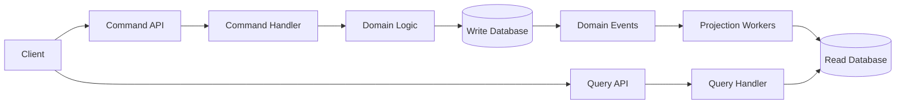
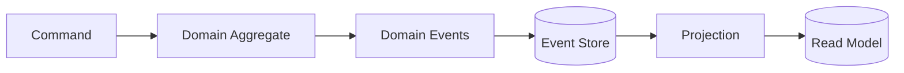
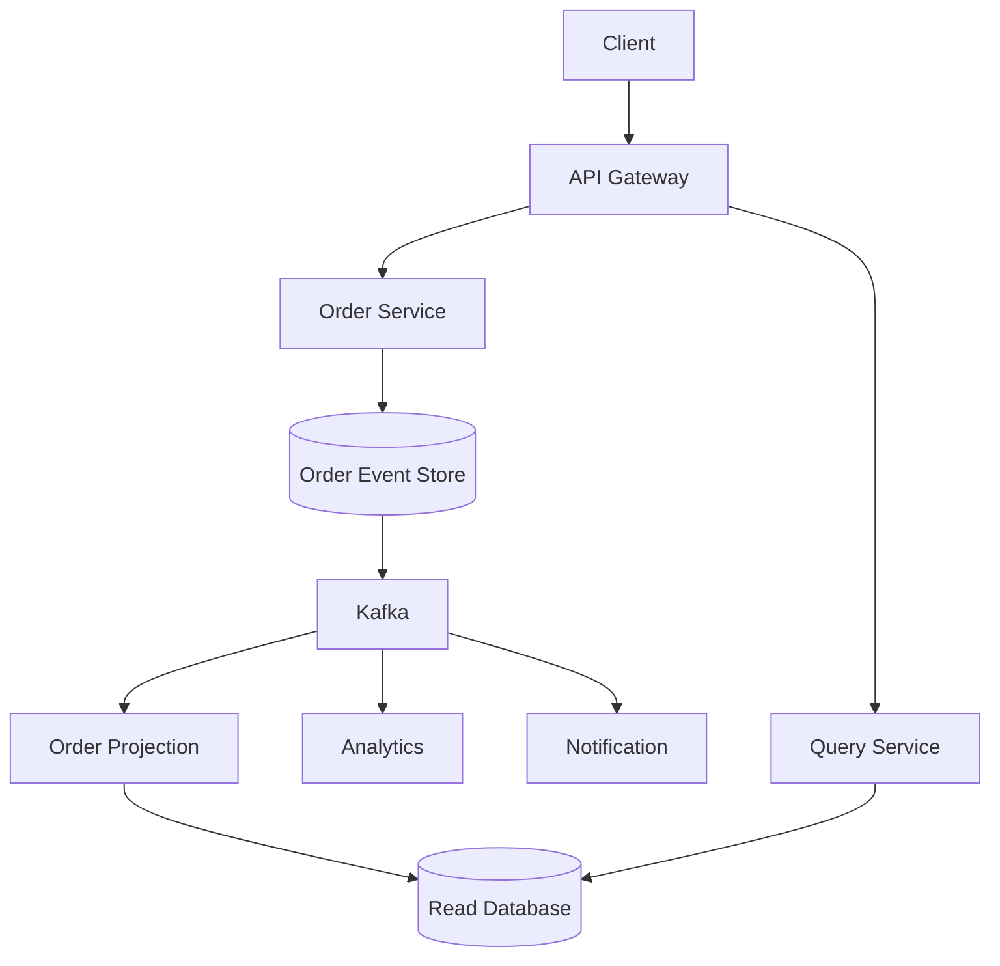
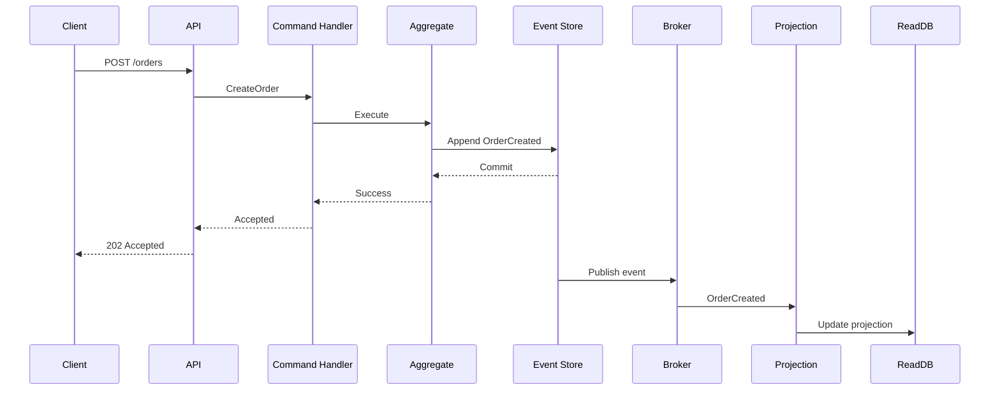

# 12- Data Architecture Patterns - CQRS and Event Sourcing

## Overview

CQRS and Event Sourcing are architectural patterns for systems where the way data is **written**, **read**, **stored**, and **reconstructed** requires more flexibility than a conventional CRUD architecture provides.

A conventional backend commonly uses the same model for reads and writes:

```text
Client
  |
  v
API
  |
  v
Application Service
  |
  v
PostgreSQL
```

The same database representation typically supports:

- create operations
- updates
- deletes
- queries
- reporting

This works well for many applications.

As systems become more complex, however, read and write workloads may have substantially different requirements. A transactional order system might require strict validation and consistency for writes while the read side needs highly optimized projections for dashboards, search, analytics, or customer-facing views.

CQRS separates these responsibilities:

```text
                 +----------------+
                 |     Client     |
                 +-------+--------+
                         |
             +-----------+-----------+
             |                       |
             v                       v
       Command / Write         Query / Read
             |                       |
             v                       v
       Write Model              Read Model
             |                       |
             v                       v
       Write Store              Read Store
```

Event Sourcing takes the idea further by changing how state is persisted.

Instead of storing only the latest state:

```text
Order
-----
status = PAID
total = 1000
```

the system stores the sequence of business events that produced that state:

```text
OrderCreated
ItemAdded
PaymentAuthorized
PaymentCaptured
```

Current state can then be reconstructed by replaying those events.

CQRS and Event Sourcing are independent patterns. They are frequently combined, but neither requires the other.

---

## Why These Patterns Exist

Traditional CRUD systems work well when:

- reads and writes have similar requirements
- the domain is relatively simple
- the current state is sufficient
- historical changes are not important
- a single relational model can support both workloads

Problems emerge when the system has requirements such as:

- complex domain behavior
- very high read volume
- different read and write scaling requirements
- auditability
- historical reconstruction
- temporal queries
- multiple read representations
- asynchronous integration
- business-event-driven workflows
- independent read and write deployment

Consider an order platform.

The write path may need:

```text
Validate Order
Check Inventory
Apply Business Rules
Authorize Payment
Persist Transaction
```

The read path may need:

```text
Customer Order View
Admin Dashboard
Search Index
Analytics Projection
Reporting
Notifications
```

Trying to make one relational schema optimize every workload can create unnecessary coupling.

CQRS allows the architecture to model these responsibilities independently.

---

## CQRS

CQRS stands for **Command Query Responsibility Segregation**.

The core idea is:

> Commands change state; queries return state.

A command represents an operation that intends to change the system:

```text
CreateOrder
CancelOrder
ReserveInventory
CapturePayment
```

A query retrieves information without changing application state:

```text
GetOrder
ListOrders
GetCustomerBalance
SearchProducts
```

The distinction is architectural rather than merely a naming convention.

---

## Commands

A command expresses intent.

For example:

```json
{
  "command": "CreateOrder",
  "customer_id": "cust_123",
  "items": [
    {
      "product_id": "prod_100",
      "quantity": 2
    }
  ]
}
```

The command handler performs validation and business logic.

```text
CreateOrder
     |
     v
Command Handler
     |
     v
Domain Logic
     |
     v
Write Database
```

A command should not primarily be designed around how data is stored.

Compare:

```text
CreateOrder
```

with a persistence-oriented API such as:

```text
UpdateOrderRow
```

The first expresses business intent. The second exposes persistence details.

---

## Queries

Queries retrieve data.

For example:

```http
GET /orders/ord_123
```

The read model may be optimized specifically for this operation.

```text
GET /orders/ord_123
       |
       v
Read Model
       |
       v
Optimized Order View
```

The read model does not necessarily need to match the write model.

---

## CQRS Does Not Require Two Databases

A common misconception is:

> CQRS always means separate databases.

It does not.

CQRS can be implemented at several levels.

### Logical Separation

```text
Command Handler
       |
       v
PostgreSQL

Query Handler
       |
       v
PostgreSQL
```

Both use the same database but different application models.

### Separate Models, Same Database

```text
Write Model ──┐
              ├──> PostgreSQL
Read Model  ──┘
```

### Separate Read and Write Stores

```text
Write Model
    |
    v
PostgreSQL

Read Model
    |
    v
Redis / OpenSearch / PostgreSQL
```

The appropriate level of separation depends on actual system requirements.

---

## CQRS Maturity Levels

CQRS can be introduced incrementally.

| Level | Architecture | Complexity |
|---|---|---:|
| Basic | Separate command/query handlers | Low |
| Model separation | Different read/write domain models | Medium |
| Storage separation | Independent read/write stores | Medium |
| Event-driven | Events update read projections | High |
| Event Sourcing + CQRS | Event store is source of truth | Very High |

Do not introduce the most complex version simply because it is architecturally interesting.

---

## CQRS Request Flow

A typical CQRS architecture looks like:



The write side owns transactional business changes.

The read side owns optimized representations of data.

---

## Advantages of CQRS

### Independent Scaling

Read traffic may be much larger than write traffic.

```text
Writes: 100 requests/sec
Reads: 20,000 requests/sec
```

The read side can scale independently.

### Optimized Read Models

A read model can be designed specifically for application queries.

For example:

```text
Order Read Model
----------------
order_id
customer_name
status
total
item_count
latest_payment_status
shipping_status
```

The application does not need to reconstruct this information through multiple expensive joins for every request.

### Specialized Storage

Different read workloads can use different technologies:

```text
Transactional Writes -> PostgreSQL
Caching             -> Redis
Search              -> OpenSearch
Analytics            -> Data Warehouse
```

### Reduced Write/Read Coupling

The write model can enforce domain invariants without being constrained by read-query requirements.

---

## Limitations of CQRS

CQRS introduces additional architecture.

Potential costs include:

- more application components
- additional data models
- synchronization logic
- eventual consistency
- more monitoring
- more deployment complexity
- projection failures
- debugging complexity

If the application is a simple CRUD service, CQRS may add complexity without providing meaningful benefits.

---

## Event Sourcing

Event Sourcing stores the sequence of events that changed an aggregate instead of storing only its current state.

Traditional persistence:

```text
orders
--------------------------
id
status
total
updated_at
```

Event Sourcing:

```text
event_store
--------------------------
event_id
aggregate_id
event_type
event_version
payload
created_at
```

Example event stream:

```text
OrderCreated
ItemAdded
ItemAdded
PaymentAuthorized
PaymentCaptured
OrderShipped
```

The current state is derived from these events.

---

## State vs Events

Traditional state storage:

```text
Order
status = SHIPPED
```

The system knows the current state but may not know precisely how it reached that state unless additional audit data is stored.

Event Sourcing stores:

```text
OrderCreated
    ↓
ItemAdded
    ↓
PaymentAuthorized
    ↓
PaymentCaptured
    ↓
OrderShipped
```

The event stream becomes the authoritative history of state changes.

---

## Event Sourcing Lifecycle



The aggregate receives a command, validates the business operation, produces events, and persists them.

Those events can then update read models and integrate with other systems.

---

## Events Are Facts

An event should represent something that happened.

Good examples:

```text
OrderCreated
PaymentAuthorized
PaymentCaptured
InventoryReserved
OrderShipped
```

Avoid designing events as imperative commands:

```text
CreateOrder
CapturePayment
ReserveInventory
```

Commands express intent.

Events express facts.

```text
Command:
CapturePayment

Event:
PaymentCaptured
```

---

## Event Structure

A production event commonly contains metadata and a payload.

```json
{
  "event_id": "evt_123",
  "event_type": "PaymentCaptured",
  "aggregate_type": "Order",
  "aggregate_id": "ord_456",
  "version": 5,
  "occurred_at": "2026-08-24T14:30:00Z",
  "payload": {
    "payment_id": "pay_789",
    "amount": 1000,
    "currency": "INR"
  }
}
```

Useful metadata includes:

- event ID
- aggregate ID
- aggregate type
- event type
- event version
- timestamp
- correlation ID
- causation ID
- schema version

---

## Aggregate Versioning

An event stream should normally have an ordering mechanism.

For example:

```text
Order ord_123

Version 1 -> OrderCreated
Version 2 -> ItemAdded
Version 3 -> PaymentAuthorized
Version 4 -> PaymentCaptured
```

The version can also help detect concurrent updates.

Suppose two commands both read:

```text
current_version = 10
```

Only one should be allowed to append as version 11.

The second detects a concurrency conflict and can retry or reject the operation.

---

## Optimistic Concurrency

A typical event-store operation can conceptually behave like:

```text
Append events where current_version = expected_version
```

If:

```text
Expected = 10
Actual = 11
```

the write fails.

This prevents two concurrent operations from silently producing an invalid event sequence.

---

## Reconstructing State

Suppose the event stream is:

```text
OrderCreated(total=1000)
ItemAdded(product=A, quantity=2)
PaymentAuthorized(amount=1000)
PaymentCaptured(amount=1000)
```

The aggregate can rebuild its state:

```text
Initial State
     |
     v
OrderCreated
     |
     v
ItemAdded
     |
     v
PaymentAuthorized
     |
     v
PaymentCaptured
     |
     v
Current State
```

Conceptually:

```python
from dataclasses import dataclass


@dataclass
class Order:
    status: str = "NEW"
    total: int = 0

    def apply(self, event: dict) -> None:
        event_type = event["event_type"]

        if event_type == "OrderCreated":
            self.status = "CREATED"
            self.total = event["payload"]["total"]

        elif event_type == "PaymentAuthorized":
            self.status = "PAYMENT_AUTHORIZED"

        elif event_type == "PaymentCaptured":
            self.status = "PAID"
```

A production implementation should use stronger typing, explicit event schemas, validation, and controlled event evolution.

---

## Event Sourcing and CQRS Together

The most common advanced architecture is:

```text
                Commands
                   |
                   v
            Command Handler
                   |
                   v
              Aggregate
                   |
                   v
             Event Store
                   |
                   v
                Events
                   |
          +--------+--------+
          |        |        |
          v        v        v
      Read DB   Search    Analytics
          |
          v
       Queries
```

The event store is the source of truth.

Read models are projections derived from events.

---

## CQRS Without Event Sourcing

CQRS can use ordinary transactional persistence.

```text
Command
   |
   v
Write Model
   |
   v
PostgreSQL
```

Read models can be populated through:

- database replication
- application-level synchronization
- CDC
- events
- scheduled jobs

Event Sourcing is therefore optional.

---

## Event Sourcing Without CQRS

Event Sourcing can also exist without full CQRS.

For example:

```text
Command
   |
   v
Aggregate
   |
   v
Event Store
   |
   v
Aggregate State
```

The application may reconstruct state directly from the event stream.

However, CQRS is frequently added because replaying event streams for every query is inefficient.

---

## Projections

A projection transforms events into a query-optimized representation.

Example:

```text
OrderCreated
ItemAdded
PaymentCaptured
OrderShipped
       |
       v
Order Projection
       |
       v
orders_read
```

A projection might create:

```text
orders_read
--------------------------------
order_id
customer_id
status
total
payment_status
shipping_status
updated_at
```

The read model can be optimized independently from the event store.

---

## Projection Replay

One major advantage of Event Sourcing is the ability to rebuild projections.

Suppose the projection has a bug.

Instead of manually repairing millions of rows:

```text
Event Store
    |
    v
Replay Events
    |
    v
New Projection
```

The projection can be rebuilt from the authoritative event history.

This is one of the strongest practical benefits of Event Sourcing.

---

## Projection Lag

Read models are often eventually consistent.

The sequence may be:

```text
Command
   |
   v
Event Stored
   |
   v
Projection Worker
   |
   v
Read Model Updated
```

There may be a delay between the write and the read model.

For example:

```text
Event committed: 10:00:00.000
Projection updated: 10:00:00.250
```

The system needs to explicitly decide whether this consistency model is acceptable.

---

## Read-Your-Writes

A common UX problem is:

```text
POST /orders
     |
     v
Order Created
     |
     v
GET /orders/123
     |
     X
Read Model not updated yet
```

The user may temporarily see stale information.

Solutions include:

- return the created representation from the write operation
- route subsequent reads to the write model temporarily
- use version-aware reads
- wait for projection acknowledgment
- include a consistency token
- design the UI around asynchronous state

Do not hide eventual consistency accidentally.

---

## Snapshotting

Replaying a long event stream can become expensive.

Suppose an account has:

```text
5,000,000 events
```

Rebuilding the aggregate from the beginning may be slow.

Snapshots solve this problem.

```text
Events 1...1,000,000
        |
        v
     Snapshot
        |
        v
Events 1,000,001...1,000,100
        |
        v
Current State
```

The aggregate loads the latest snapshot and replays only subsequent events.

---

## Snapshot Strategy

A snapshot might contain:

```json
{
  "aggregate_id": "acct_123",
  "version": 1000000,
  "state": {
    "balance": 500000,
    "status": "ACTIVE"
  }
}
```

Snapshots are optimization artifacts.

They should not become the authoritative source of truth when the event stream is the source of truth.

If a snapshot is corrupted, it should be possible to rebuild it from events.

---

## Event Store Characteristics

A good event store should support:

- append-only writes
- aggregate-based streams
- ordering
- optimistic concurrency
- durable persistence
- event retrieval
- replay
- metadata
- schema/version management

Possible implementations include:

- PostgreSQL
- DynamoDB
- dedicated event-store systems
- Kafka in carefully designed architectures

The choice depends on ordering, querying, retention, throughput, operational requirements, and consistency guarantees.

---

## PostgreSQL as an Event Store

A relational database can be used as an event store.

Example:

```sql
CREATE TABLE events (
    event_id UUID PRIMARY KEY,
    aggregate_id UUID NOT NULL,
    aggregate_type TEXT NOT NULL,
    event_type TEXT NOT NULL,
    version BIGINT NOT NULL,
    payload JSONB NOT NULL,
    occurred_at TIMESTAMPTZ NOT NULL
);

CREATE UNIQUE INDEX uq_aggregate_version
ON events (aggregate_id, version);
```

The unique constraint can protect event ordering.

A production implementation should also consider:

- partitioning
- indexes
- retention
- archival
- payload size
- schema evolution
- backup strategy
- concurrent append behavior

---

## Kafka as an Event Backbone

Kafka is often useful for distributing events after they have been durably committed.

A common architecture is:

```text
Application
    |
    v
PostgreSQL Event Store
    |
    v
Outbox / CDC
    |
    v
Kafka
    |
    +----> Read Projection
    +----> Search
    +----> Analytics
    +----> Notifications
```

Kafka should not automatically be treated as the event store simply because it is a durable event platform.

The requirements of the event-sourced aggregate store and the requirements of an event distribution backbone can be different.

---

## Transactional Outbox with Event Sourcing

The transactional boundary is important.

A dangerous workflow is:

```text
Write Event Store
      |
      X
Publish Kafka Event
```

If the process crashes between these operations:

```text
Event persisted
Kafka event missing
```

A transactional outbox can help where the architecture requires a database transaction to atomically persist business changes and outgoing publication intent.

The exact implementation depends on whether the event store itself is also the publication source.

---

## Event Schema Evolution

Events are durable historical records.

Changing an event schema casually can break replay.

Suppose version 1 contains:

```json
{
  "amount": 1000
}
```

Later version 2 requires:

```json
{
  "amount": 1000,
  "currency": "INR"
}
```

Old events do not automatically contain `currency`.

Possible strategies include:

- versioned event types
- schema evolution
- backward-compatible consumers
- upcasting
- migration during replay
- explicit defaults

Never assume historical events can simply be modified in place.

---

## Event Versioning

A practical approach is:

```text
PaymentCaptured.v1
PaymentCaptured.v2
```

or:

```json
{
  "event_type": "PaymentCaptured",
  "schema_version": 2
}
```

The event handler can interpret historical versions.

An important principle is:

> Historical events are part of the system's data contract.

---

## Event Immutability

Events should generally be immutable.

Do not modify:

```text
PaymentCaptured
```

because the business meaning has changed.

Instead, append another event:

```text
PaymentCaptured
PaymentAdjusted
```

The event stream preserves what actually happened.

This is fundamental to Event Sourcing.

---

## Event Sourcing and Auditability

Event Sourcing naturally provides a detailed history:

```text
10:00 OrderCreated
10:01 ItemAdded
10:02 PaymentAuthorized
10:03 PaymentCaptured
10:10 OrderShipped
```

This can be valuable for:

- financial systems
- compliance
- dispute resolution
- audit trails
- debugging
- historical analysis

However, Event Sourcing should not be adopted solely as an audit logging solution.

A dedicated audit trail may be simpler when historical domain state reconstruction is not required.

---

## Event Sourcing and GDPR / Data Deletion

Immutable events introduce a difficult issue when data must be deleted.

Suppose an event contains personal data:

```json
{
  "customer_name": "Example User",
  "email": "user@example.com"
}
```

Deleting the current customer row does not remove the information from historical events.

Production systems must design for:

- data minimization
- encryption
- tokenization
- indirection
- redaction strategies
- retention policies
- privacy requirements

Event Sourcing therefore requires deliberate data-governance design.

---

## Event Sourcing and Security

Events are historical records and may live for a long time.

Consider:

- encryption at rest
- encryption in transit
- access controls
- immutable audit requirements
- PII minimization
- secret detection
- schema validation
- event authorization
- retention policies

Do not put credentials, access tokens, passwords, or unnecessary sensitive data into events.

---

## Event Ordering

Ordering is usually required at the aggregate level.

For example:

```text
OrderCreated
PaymentAuthorized
PaymentCaptured
```

should not be interpreted as:

```text
PaymentCaptured
OrderCreated
PaymentAuthorized
```

However, global ordering across the entire system is usually unnecessary and expensive.

Prefer:

> Ordering where the business invariant requires it.

For many systems, per-aggregate ordering is sufficient.

---

## Event Delivery Semantics

Consumers may experience:

### At-Most-Once

An event is delivered zero or one time.

Possible downside:

```text
Event lost
```

### At-Least-Once

An event may be delivered multiple times.

```text
Event
 |
 +--> Consumer
 |
 +--> Consumer again
```

This is common in distributed systems and requires idempotent consumers.

### Exactly-Once

Exactly-once semantics are difficult to achieve end-to-end.

Even if a messaging system provides transactional guarantees internally, the complete business workflow may still involve external systems.

Design business operations to tolerate duplicates rather than relying blindly on exactly-once claims.

---

## Idempotent Projections

A projection must safely handle duplicate events.

For example:

```text
PaymentCaptured
PaymentCaptured
```

should not result in:

```text
balance += payment
balance += payment
```

when the second event is a duplicate.

Use:

- event IDs
- aggregate versions
- processed-event tables
- conditional writes
- idempotent upserts

---

## Projection Failure and Recovery

Suppose:

```text
Event Store
     |
     v
Projection Worker
     |
     X
Worker crashes
```

The projection may be behind.

A robust system should support:

```text
Detect failure
     |
     v
Retry
     |
     v
Resume from checkpoint
```

or:

```text
Delete Projection
     |
     v
Replay Event Stream
     |
     v
Rebuild Projection
```

The exact strategy depends on event volume and recovery requirements.

---

## CQRS, Event Sourcing, and Microservices

These patterns are particularly relevant to microservices but are not synonymous with microservices.

A possible architecture:



The architecture provides:

- independent read scaling
- asynchronous integration
- event history
- specialized read models

But it also introduces significant operational complexity.

---

## CQRS with Django

A Django application can use CQRS without adopting full Event Sourcing.

For example:

```text
app/
├── commands/
│   ├── create_order.py
│   └── cancel_order.py
├── queries/
│   ├── get_order.py
│   └── search_orders.py
├── domain/
│   └── order.py
├── models/
│   └── order.py
└── api/
    └── views.py
```

A command handler might perform:

```text
API
 |
 v
CreateOrderCommand
 |
 v
Domain Validation
 |
 v
Django ORM
 |
 v
PostgreSQL
```

Queries can use optimized Django ORM queries, database views, replicas, or a dedicated read store.

CQRS does not require rewriting Django into a fully event-sourced architecture.

---

## CQRS with FastAPI

FastAPI can expose distinct command and query endpoints.

```python
from fastapi import FastAPI, status
from pydantic import BaseModel

app = FastAPI()


class CreateOrderRequest(BaseModel):
    customer_id: str
    total: int


@app.post("/orders", status_code=status.HTTP_202_ACCEPTED)
async def create_order(request: CreateOrderRequest):
    # Command handling would invoke domain/application logic.
    return {
        "status": "ACCEPTED",
        "customer_id": request.customer_id,
    }


@app.get("/orders/{order_id}")
async def get_order(order_id: str):
    # Query handling would use the optimized read model.
    return {
        "order_id": order_id,
        "status": "PROCESSING",
    }
```

The important separation is responsibility:

```text
POST -> Command
GET  -> Query
```

not merely the HTTP verb itself.

---

## CQRS with Redis

Redis can be an effective read-side store for high-throughput, low-latency queries.

For example:

```text
Event
  |
  v
Projection Worker
  |
  v
Redis
  |
  v
GET /orders/{id}
```

However, Redis should not automatically become the authoritative source of business state simply because it is fast.

Consider:

- persistence
- eviction
- recovery
- cache invalidation
- consistency
- memory cost

For many systems:

```text
PostgreSQL = durable source
Redis      = read optimization
```

is safer.

---

## CQRS with PostgreSQL Read Models

A dedicated PostgreSQL read schema may be enough.

Example:

```text
write schema
-----------
orders
payments
inventory

read schema
-----------
order_summary
customer_order_history
order_dashboard
```

This can provide many CQRS benefits without introducing another database technology.

---

## CQRS and Database Replicas

Read replicas can help scale traditional systems:

```text
              PostgreSQL Primary
                    |
          +---------+---------+
          |                   |
          v                   v
      Replica 1           Replica 2
          |                   |
          +---------+---------+
                    |
                 Queries
```

This is not automatically CQRS.

Read replicas primarily replicate the same data model.

CQRS allows the read model itself to be different.

---

## CQRS vs Read Replicas

| Capability | Read Replicas | CQRS |
|---|---|---|
| Separate read capacity | Yes | Yes |
| Separate data model | No | Yes |
| Separate query model | Limited | Yes |
| Independent read technology | No | Yes |
| Event-driven projections | No | Optional |
| Operational complexity | Lower | Higher |
| Best for | Read-heavy CRUD | Different read/write requirements |

---

## Event Sourcing vs Traditional CRUD

| Characteristic | CRUD | Event Sourcing |
|---|---|---|
| Source of truth | Current state | Event history |
| Updates | Mutate state | Append events |
| History | Usually additional | Native |
| Current state | Directly stored | Reconstructed/projected |
| Auditability | Additional design | Natural |
| Schema changes | Usually simpler | More complex |
| Storage | Usually lower | Potentially higher |
| Replay | Limited | Core capability |
| Debugging | State-focused | History-focused |
| Operational complexity | Lower | Higher |

---

## CQRS vs Event Sourcing

These patterns solve different problems.

| Pattern | Primary Problem |
|---|---|
| CQRS | Separate read and write responsibilities |
| Event Sourcing | Persist domain history as events |
| CQRS + Event Sourcing | Independent read/write models backed by event history |

You can have:

```text
CQRS without Event Sourcing
```

and:

```text
Event Sourcing without full CQRS
```

Treat them as composable architectural choices rather than one inseparable pattern.

---

## Common Mistakes

### Treating CQRS as Mandatory for Microservices

Microservices can use ordinary CRUD.

CQRS should solve a real read/write separation problem.

---

### Creating Two Databases Without a Reason

Separate databases increase:

- deployment complexity
- monitoring
- synchronization concerns
- backup requirements
- failure modes

Start with logical separation when possible.

---

### Treating Events as Mutable Records

Historical events should generally be immutable.

If the business meaning changes, append a new event rather than rewriting history.

---

### Putting Excessive Data into Events

Events should contain the information required to represent the business fact.

Avoid turning every event into a full database snapshot unless the architecture explicitly requires it.

---

### Assuming Event Sourcing Automatically Provides Audit Compliance

Event history helps with auditability but does not automatically satisfy privacy, retention, access-control, or regulatory requirements.

---

### Ignoring Event Schema Evolution

Events can live for years.

A consumer written today may eventually need to process events created years earlier.

Design versioning from the beginning.

---

### Replaying Millions of Events for Every Request

Event replay is appropriate for rebuilding state, not necessarily for serving every API request.

Use projections and snapshots where required.

---

### Assuming Read Models Are Immediately Consistent

Event-driven projections introduce propagation delay.

The API and user experience must account for it.

---

### Assuming Exactly-Once Delivery Solves Everything

Even if the broker provides strong delivery guarantees, external side effects can still be duplicated or partially completed.

Design consumers and business operations for idempotency.

---

### Using Kafka as an Event Store Without Understanding the Requirements

Kafka is excellent for durable event distribution and streaming.

An event-sourced aggregate store may require additional capabilities such as:

- aggregate-specific versioning
- optimistic concurrency
- long-term historical retrieval
- stream semantics
- event metadata
- replay controls

Choose the storage architecture based on these requirements.

---

## Performance Considerations

### Write Performance

Event Sourcing is append-oriented:

```text
INSERT event
```

rather than:

```text
UPDATE current state
```

Append-only workloads can be efficient, but event volume can become substantial.

### Read Performance

Queries should generally use projections rather than replaying entire aggregates.

```text
Bad for high-volume reads:

Request
  |
  v
Load 10,000 events
  |
  v
Replay
  |
  v
Response
```

Prefer:

```text
Request
  |
  v
Read Model
  |
  v
Response
```

### Storage Growth

Event stores grow continuously.

Production systems should plan for:

- partitioning
- archival
- compression
- retention
- storage monitoring
- backup costs

---

## Scalability Considerations

CQRS can scale reads independently:

```text
                Read Traffic
                    |
        +-----------+-----------+
        |           |           |
        v           v           v
    Read Node   Read Node   Read Node
```

The write side can scale separately:

```text
               Write Traffic
                    |
        +-----------+-----------+
        |                       |
        v                       v
    Write Node              Write Node
```

Event-driven projections can also scale horizontally.

For Kafka-based projections:

```text
Topic
 |
 +--> Consumer 1
 +--> Consumer 2
 +--> Consumer 3
```

Partitioning must be designed carefully when aggregate ordering matters.

---

## Reliability Considerations

A production CQRS/Event Sourcing system should account for:

- event store failure
- projection failure
- duplicate events
- delayed events
- out-of-order events
- consumer crashes
- schema incompatibility
- poison messages
- corrupted projections
- partial deployments
- replay failures

The ability to rebuild a projection is a major reliability mechanism.

---

## Monitoring Considerations

Monitor the entire data flow:

```text
Command
   |
   v
Event Store
   |
   v
Broker
   |
   v
Projection
   |
   v
Read Model
```

Useful metrics include:

- command latency
- command failure rate
- event append rate
- event-store latency
- consumer lag
- projection lag
- projection failure rate
- replay duration
- event-processing throughput
- duplicate-event rate
- read-model freshness
- snapshot generation time

A particularly valuable metric is:

```text
Projection Lag
=
Current Event Position - Projection Position
```

---

## Disaster Recovery

Event Sourcing changes disaster recovery strategy.

If the event store is authoritative:

```text
Backup Event Store
        |
        v
Restore Event Store
        |
        v
Replay Events
        |
        v
Rebuild Read Models
```

This can be powerful, but replay time must be measured.

For large systems, maintain:

- event-store backups
- snapshots
- projection checkpoints
- infrastructure definitions
- schema versions
- replay procedures

Disaster recovery should be tested, not merely documented.

---

## Cost Considerations

CQRS and Event Sourcing can increase infrastructure costs through:

- larger event storage
- read-model databases
- message brokers
- projection workers
- snapshots
- replay workloads
- observability
- backups
- data replication

The architecture should be justified by measurable requirements such as:

- read/write workload asymmetry
- audit requirements
- complex domain history
- high-scale querying
- multiple projections
- integration requirements

---

## Practical Architecture Example

Consider an e-commerce platform.

### Write Side

```text
Client
  |
  v
Order API
  |
  v
CreateOrder Command
  |
  v
Order Aggregate
  |
  v
Event Store
```

Events:

```text
OrderCreated
ItemAdded
InventoryReserved
PaymentAuthorized
PaymentCaptured
OrderShipped
```

### Read Side

```text
Event Store
     |
     v
Event Stream
     |
     +----> Order Projection
     |
     +----> Customer Projection
     |
     +----> Admin Projection
     |
     +----> Search Projection
     |
     +----> Analytics
```

Different consumers can build different representations from the same event history.

---

## Practical Data Flow



The write transaction and read projection are separate concerns.

---

## Testing CQRS and Event Sourcing

Testing should exist at multiple levels.

### Command Tests

Verify:

```text
Command
   |
   v
Expected Events
```

Example:

```text
CreateOrder
    |
    v
OrderCreated
```

### Aggregate Tests

Verify domain invariants:

```text
PaymentCaptured
after
PaymentAuthorized
```

should succeed.

But:

```text
PaymentCaptured
before
PaymentAuthorized
```

should fail if the domain prohibits it.

### Projection Tests

Verify:

```text
Events
  |
  v
Expected Read Model
```

### Replay Tests

Replay a representative historical event stream and verify that the resulting state is correct.

### Contract Tests

Consumers should verify that event schemas remain compatible across deployments.

---

## Operational Best Practices

### Keep Events Business-Oriented

Prefer:

```text
OrderCancelled
PaymentCaptured
SubscriptionRenewed
```

over low-level persistence events such as:

```text
OrderRowUpdated
PaymentColumnChanged
```

### Keep Event Payloads Stable

Avoid unnecessary schema churn.

### Make Consumers Idempotent

Assume duplicate delivery.

### Track Projection Positions

A projection should know how far it has processed.

### Support Replay

Projection rebuilds should be an operational capability, not a custom emergency procedure.

### Monitor Lag

A healthy event pipeline is not merely one where consumers are running. They must remain sufficiently close to the source stream.

### Separate Domain Events from Integration Events

A domain event may represent an internal domain fact.

An integration event is designed for communication with external services or bounded contexts.

They may have different schemas and stability requirements.

---

## Domain Events vs Integration Events

| Characteristic | Domain Event | Integration Event |
|---|---|---|
| Audience | Internal domain | Other systems/services |
| Coupling | Domain-oriented | Contract-oriented |
| Schema stability | Internal | Usually stronger |
| Purpose | Domain behavior | Integration |
| Example | `OrderPaid` | `OrderPaymentCompleted` |

Do not automatically expose internal domain events as public integration contracts.

An anti-corruption or translation layer may be appropriate.

---

## Interview Traps

### "CQRS Means Two Databases"

Incorrect.

CQRS is about separating command and query responsibilities. Separate storage is optional.

### "Event Sourcing Is Just Event Logging"

Incorrect.

In Event Sourcing, events form the authoritative persistence model from which domain state can be reconstructed.

### "Kafka Is the Database"

Not necessarily.

Kafka is primarily a distributed event-streaming platform. Whether it can serve as the authoritative event store depends on the application's exact requirements.

### "Eventual Consistency Is Always Bad"

Incorrect.

Eventual consistency is often a deliberate architectural tradeoff that enables scalability and decoupling.

The important question is whether the business can tolerate the consistency window.

### "Events Can Be Changed Later"

Dangerous.

Historical events should generally be immutable. Schema evolution should preserve the ability to interpret historical records.

### "Event Sourcing Eliminates Database Transactions"

Incorrect.

Local database transactions remain important for atomically persisting events and maintaining domain invariants.

---

## When to Use These Patterns

### CQRS Is a Good Fit When

- read and write workloads differ significantly
- read models require different structures
- queries are complex
- read scaling is independent from write scaling
- multiple projections are useful
- domain write logic is significantly different from query requirements

### Event Sourcing Is a Good Fit When

- domain history is fundamental
- historical reconstruction matters
- auditability is important
- events represent meaningful business facts
- multiple projections are required
- replay is valuable
- the organization can operate the additional infrastructure

### Avoid Both When

- the domain is simple CRUD
- current state is sufficient
- eventual consistency is unacceptable
- the team lacks operational maturity
- the additional complexity has no measurable benefit

---

## Production Decision Framework

Before adopting CQRS or Event Sourcing, answer:

| Question | Architectural Implication |
|---|---|
| Are reads and writes fundamentally different? | Consider CQRS |
| Are read workloads much larger than writes? | Consider read-side scaling |
| Do we need multiple specialized views? | Consider projections |
| Is historical state essential? | Consider Event Sourcing |
| Do business events have lasting meaning? | Event Sourcing becomes more attractive |
| Can the system tolerate eventual consistency? | Required for many projection architectures |
| Can events be replayed safely? | Important for Event Sourcing |
| Can the team operate brokers and projections? | Required for complex implementations |
| Are privacy/deletion requirements strict? | Carefully evaluate immutable event storage |
| Can a simpler CRUD design meet requirements? | Prefer the simpler design |

---

## Key Takeaways

- CQRS separates command-side state changes from query-side data retrieval; it does not inherently require separate databases or Event Sourcing.
- Event Sourcing treats an immutable sequence of domain events as the authoritative history from which current state and read models can be derived.
- CQRS and Event Sourcing are powerful when read/write requirements, historical reconstruction, auditability, or projection needs justify their complexity.
- Production implementations require durable event storage, idempotent consumers, schema evolution, projection recovery, concurrency control, observability, backups, and explicit handling of eventual consistency.
- Use these patterns selectively; a well-designed CRUD architecture is usually preferable when the domain does not require distributed read/write models or event-based state history.