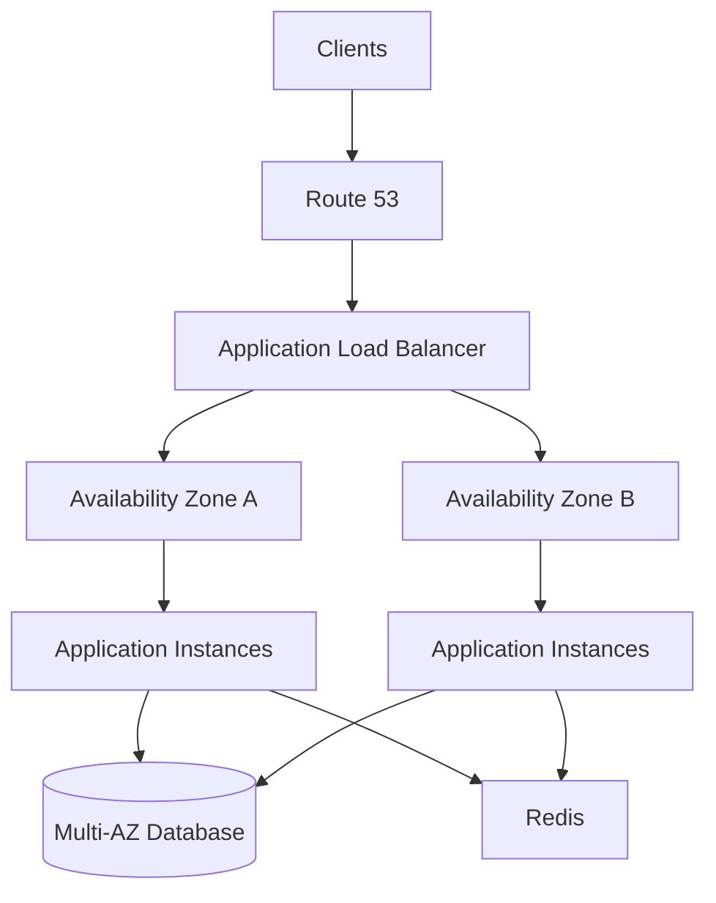
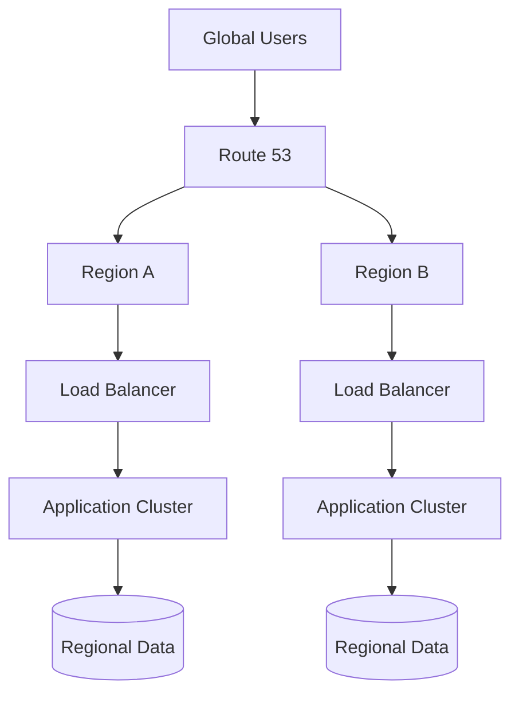
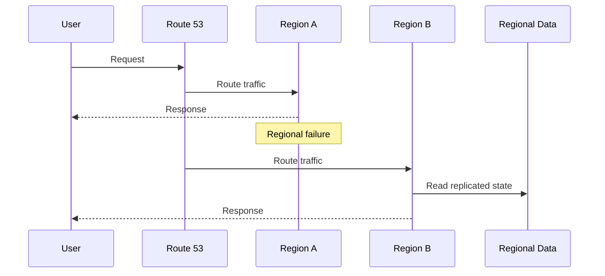
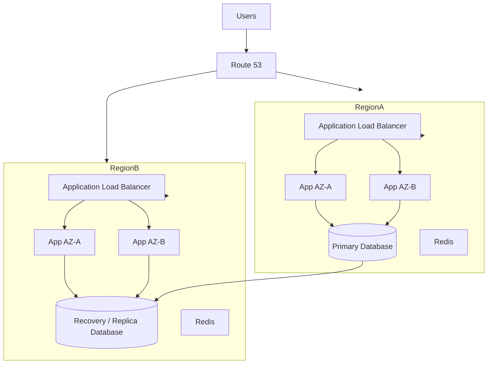

# 13- High Availability - Multi-AZ vs Multi-Region

## Overview

High availability (HA) is the ability of a system to continue serving its intended workload when individual infrastructure components, Availability Zones, or even entire AWS Regions become unavailable.

In AWS, high availability is primarily achieved by removing single points of failure and distributing workloads across independent failure domains.

The two major geographic patterns are:

- **Multi-AZ** — distribute workloads across multiple Availability Zones within one AWS Region.
- **Multi-Region** — distribute workloads across multiple AWS Regions.

These patterns solve different failure scenarios.

```text
                    High Availability
                           |
             +-------------+-------------+
             |                           |
          Multi-AZ                   Multi-Region
             |                           |
       AZ-level failure          Region-level failure
             |                           |
       Lower complexity          Higher complexity
       Lower latency             Higher latency
       Lower cost                Higher cost
```

A production architecture should not choose Multi-Region merely because it sounds more resilient. The correct architecture depends on the application's **RTO, RPO, consistency requirements, traffic patterns, compliance requirements, operational maturity, and cost constraints**.

For many backend systems, a well-designed Multi-AZ architecture is the appropriate baseline. Multi-Region should be introduced when the business requires protection beyond a regional failure or needs geographic distribution for latency and regulatory reasons.

---

## Availability Zones and Regions

An AWS Region is a geographic area containing multiple isolated Availability Zones.

An Availability Zone is an isolated location within a Region containing one or more data centers and independent infrastructure.

Conceptually:

```text
AWS Region
|
+-- Availability Zone A
|   |
|   +-- Compute
|   +-- Storage
|   +-- Networking
|
+-- Availability Zone B
|   |
|   +-- Compute
|   +-- Storage
|   +-- Networking
|
+-- Availability Zone C
    |
    +-- Compute
    +-- Storage
    +-- Networking
```

The architectural objective is to avoid placing all critical components in the same failure domain.

If all application instances run in one Availability Zone:

```text
             Application
                  |
                  v
            Availability Zone A
                  |
              AZ Failure
                  |
                  X
             Entire service
             unavailable
```

With Multi-AZ:

```text
                    Load Balancer
                   /             \
                  v               v
             AZ-A                AZ-B
           App Node            App Node
```

Failure of one AZ can leave the application available through the remaining AZ.

---

## What High Availability Actually Means

High availability is not the same as:

- zero downtime
- zero failures
- zero data loss
- disaster recovery
- automatic recovery from every possible incident

A highly available system is designed to **continue operating or recover within an acceptable time after failures**.

A useful way to reason about HA is:

```text
Failure
   |
   v
Detection
   |
   v
Failover / Recovery
   |
   v
Service Restoration
```

The architecture must minimize both:

- **failure probability**
- **recovery time**

---

## Availability Targets

Availability is commonly expressed as a percentage.

| Availability | Approximate Annual Downtime |
|---|---:|
| 99% | 3.65 days |
| 99.9% | 8.76 hours |
| 99.95% | 4.38 hours |
| 99.99% | 52.6 minutes |
| 99.999% | 5.26 minutes |

These numbers demonstrate why higher availability becomes increasingly expensive.

Moving from:

```text
99.9%
```

to:

```text
99.99%
```

requires substantially more engineering than simply adding another server.

---

## Failure Domains

A failure domain is a boundary within which failures may affect multiple components.

Typical failure domains include:

```text
Process
  ↓
Container
  ↓
Instance
  ↓
Rack / Host
  ↓
Availability Zone
  ↓
Region
  ↓
Global Infrastructure
```

A resilient architecture distributes critical components across appropriate failure domains.

For example:

```text
Bad:

ALB
 |
 v
AZ-A
 |
 +-- App
 +-- App
 +-- Database


Better:

ALB
 |
 +--------+
 |        |
 v        v
AZ-A     AZ-B
 |        |
App      App
```

The second architecture removes the Availability Zone as a single point of failure for the application tier.

---

## Multi-AZ Architecture

Multi-AZ means deploying redundant infrastructure across multiple Availability Zones within the same AWS Region.

A typical backend architecture is:



The application layer is distributed across AZs, while managed services provide their own HA mechanisms where supported.

---

## Why Multi-AZ Exists

Multi-AZ protects against failures such as:

- Availability Zone outages
- instance failures
- networking failures within an AZ
- power-related infrastructure failures
- hardware failures
- maintenance events affecting an AZ

It also improves operational flexibility.

For example, instances can be replaced or maintained in one AZ while traffic continues through another.

---

## When to Use Multi-AZ

Multi-AZ should generally be the baseline for production workloads that require meaningful availability.

Use it for:

- public APIs
- Django applications
- FastAPI services
- microservices
- background workers
- production databases
- critical internal services

For stateless application workloads, Multi-AZ is usually straightforward.

For stateful workloads, the database and data layer require significantly more consideration.

---

## Multi-AZ Application Tier

A typical architecture:

```text
                    ALB
                     |
           +---------+---------+
           |                   |
           v                   v
        AZ-A                AZ-B
           |                   |
       EC2/ECS/EKS          EC2/ECS/EKS
           |                   |
           +---------+---------+
                     |
                     v
                Database
```

The application instances should be stateless whenever possible.

Do not store critical session state only on local instance storage.

Instead use shared infrastructure such as:

```text
Redis
Database
Object Storage
```

or stateless authentication mechanisms where appropriate.

---

## Multi-AZ with Auto Scaling

Auto Scaling and Multi-AZ complement each other.

```text
                  ALB
                   |
          +--------+--------+
          |                 |
          v                 v
        AZ-A              AZ-B
          |                 |
     EC2 Instance       EC2 Instance
          |                 |
          +--------+--------+
                   |
            Auto Scaling Group
```

An Auto Scaling Group can distribute instances across multiple Availability Zones.

If an instance fails:

```text
Instance Failure
      |
      v
Health Check
      |
      v
Instance Removed
      |
      v
Replacement Instance
```

If an AZ becomes unavailable, the Auto Scaling configuration can launch replacement capacity in healthy AZs if sufficient capacity and configuration exist.

---

## Multi-AZ Database Architecture

A highly available application tier is insufficient if the database remains a single point of failure.

For relational databases, use an HA configuration appropriate to the database service.

Conceptually:

```text
                 Application
                      |
                      v
              Database Endpoint
                      |
             +--------+--------+
             |                 |
             v                 v
          AZ-A              AZ-B
       Primary DB        Standby DB
```

The application should normally connect through the service's managed endpoint rather than hard-coding an individual database host.

During failover, the database service can redirect the endpoint to the appropriate instance.

---

## Multi-AZ Is Not the Same as Read Replication

This distinction is important.

A standby database used for high availability and a read replica used for scaling are different architectural mechanisms.

| Feature | HA Standby | Read Replica |
|---|---|---|
| Primary purpose | Failover | Read scaling |
| Handles read traffic | Usually no | Yes |
| Provides redundancy | Yes | Yes |
| Improves read capacity | No | Yes |
| Used for disaster recovery | Potentially | Potentially |
| Typical consistency | Service-dependent | Often asynchronous |

Do not deploy a read replica and assume the system automatically has the same failover characteristics as a purpose-built HA configuration.

---

## Multi-AZ Caching

Redis or another cache layer can also become a single point of failure.

A production architecture should consider:

```text
Application
    |
    +--------> Cache
    |
    +--------> Database
```

If the cache disappears, the application should ideally remain correct:

```text
Cache failure
     |
     v
Cache miss
     |
     v
Database
```

This is why a cache should generally be treated as an optimization rather than the authoritative source of business data unless the architecture explicitly requires otherwise.

---

## Multi-AZ Networking

Network architecture must also span Availability Zones.

Typical design:

```text
VPC
|
+-- Public Subnet AZ-A
|      |
|      +-- Load Balancer
|
+-- Public Subnet AZ-B
|      |
|      +-- Load Balancer
|
+-- Private Subnet AZ-A
|      |
|      +-- Application
|
+-- Private Subnet AZ-B
       |
       +-- Application
```

Production systems should avoid placing all private application capacity behind infrastructure located in only one AZ.

NAT Gateway placement also matters.

If private workloads in multiple AZs depend on one NAT Gateway in a single AZ:

```text
AZ-A Private Subnet
       |
       v
     NAT
       |
       X
     Failure
       |
       X
AZ-B workloads lose outbound connectivity
```

A resilient architecture may deploy NAT Gateways per AZ when the availability requirement and cost justify it.

---

## Multi-Region Architecture

Multi-Region distributes workloads across two or more AWS Regions.

Example:



The goal is to survive a failure that affects an entire Region or to serve users from geographically closer locations.

---

## Why Multi-Region Exists

Multi-Region can protect against:

- regional outages
- major regional infrastructure failures
- region-specific service degradation
- geographic latency
- regional compliance requirements
- large-scale disaster scenarios

It can also support:

- global traffic distribution
- active-active architectures
- active-passive disaster recovery
- geographic data placement

---

## Multi-Region Is More Complex

A Multi-Region system introduces distributed-systems problems.

Examples include:

- data replication
- replication lag
- split brain
- conflicting writes
- global routing
- failover decisions
- regional configuration drift
- deployment coordination
- secret replication
- observability across regions
- cross-region network latency
- data residency

Therefore:

> Multi-Region improves failure isolation at the cost of significantly greater system complexity.

---

## Multi-AZ vs Multi-Region

| Characteristic | Multi-AZ | Multi-Region |
|---|---|---|
| Failure protection | AZ-level | Region-level |
| Latency | Low | Higher across regions |
| Complexity | Lower | Higher |
| Cost | Lower | Higher |
| Data replication | Usually simpler | More complex |
| Operational burden | Moderate | High |
| Typical baseline | Production HA | Advanced HA/DR |
| Geographic redundancy | No | Yes |
| Global traffic | Limited | Strong fit |
| Disaster recovery | Limited | Strong |
| Consistency challenges | Lower | Higher |

---

## Active-Passive Multi-Region

In an active-passive architecture, one Region serves production traffic while another is maintained as a recovery environment.

```text
                  Route 53
                     |
             +-------+-------+
             |               |
             v               v
         Region A         Region B
          ACTIVE          PASSIVE
             |               |
             v               v
         Application       Standby
             |
             v
         Primary DB
             |
             v
      Cross-Region Backup
         / Replication
```

Under normal conditions:

```text
Users -> Region A
```

During a regional failure:

```text
Users -> Region B
```

### Advantages

- simpler than active-active
- fewer write conflicts
- easier consistency model
- lower operational complexity than active-active

### Limitations

- passive capacity may be underutilized
- failover may take longer
- data replication must be reliable
- infrastructure must remain deployable and recoverable

---

## Active-Active Multi-Region

In active-active architecture, multiple Regions serve production traffic simultaneously.

```text
                    Route 53
                  /          \
                 v            v
             Region A      Region B
                 |            |
                 v            v
              App A         App B
                 |            |
                 +-----+------+
                       |
                 Replicated Data
```

This provides excellent geographic availability but introduces distributed state-management problems.

---

## Active-Active Advantages

- both Regions serve traffic
- better global latency
- high utilization of infrastructure
- faster regional failover
- strong geographic redundancy

---

## Active-Active Limitations

The difficult part is usually not the application servers.

The difficult part is **state**.

For example:

```text
User updates account in Region A
             |
             v
Region B receives stale state
             |
             v
User updates same account in Region B
```

Now the system must resolve:

- ordering
- conflicts
- replication
- consistency
- ownership

This is significantly harder than running stateless application servers in two Regions.

---

## Stateless Multi-Region Applications

Stateless APIs are easier to distribute globally.

For example:

```text
             Global DNS
            /          \
           v            v
       Region A      Region B
           |            |
       API Servers   API Servers
```

The application servers can independently handle requests if shared state is externalized.

Typical shared services include:

- databases
- object storage
- distributed caches
- identity systems
- message systems

However, the shared state itself becomes the primary architectural challenge.

---

## Multi-Region Database Strategies

Database architecture is usually the hardest part of Multi-Region design.

Common approaches include:

| Strategy | Complexity | Typical Use |
|---|---:|---|
| Primary + cross-region replica | Medium | DR |
| Primary + read replicas | Medium | Global reads |
| Active-passive database | Medium/High | Disaster recovery |
| Multi-region managed database | High | Global applications |
| Multi-writer | Very High | Specialized workloads |
| Region-owned data | High | Geographic partitioning |

There is no universal best choice.

---

## Primary Region with Cross-Region Replica

A common disaster recovery architecture is:

```text
Region A
---------
Primary Database
       |
       | Replication
       v
Region B
---------
Replica Database
```

Normal operation:

```text
Writes -> Region A
Reads  -> Region A
```

During disaster recovery:

```text
Promote Region B
       |
       v
Update application routing
       |
       v
Writes -> Region B
```

This architecture is simpler than multi-writer designs.

---

## RPO

**Recovery Point Objective (RPO)** defines how much data loss the business can tolerate.

For example:

```text
RPO = 5 minutes
```

means the business accepts the possibility of losing up to approximately five minutes of committed data under the defined disaster scenario.

Conceptually:

```text
Last replicated data
        |
        |---- 5 minutes ----|
        |
      Failure
```

RPO is fundamentally a data replication requirement.

---

## RTO

**Recovery Time Objective (RTO)** defines how long the service can remain unavailable before recovery is required.

Example:

```text
RTO = 15 minutes
```

means the recovery process should restore service within approximately 15 minutes for the defined disaster scenario.

RTO is primarily a recovery and operational requirement.

---

## RPO vs RTO

| Requirement | Question |
|---|---|
| RPO | How much data can we lose? |
| RTO | How long can we be unavailable? |

Example:

```text
RPO = 1 minute
RTO = 10 minutes
```

This requires both:

- very low replication lag
- fast failover automation

You cannot achieve these requirements by merely adding another application server.

---

## HA vs Disaster Recovery

High availability and disaster recovery overlap but are not identical.

### High Availability

Focuses on keeping the service operational during failures.

```text
Instance Failure
       |
       v
Replacement Instance
       |
       v
Service Continues
```

### Disaster Recovery

Focuses on restoring service after a major disaster.

```text
Region Failure
      |
      v
Recovery Region
      |
      v
Restore / Promote
      |
      v
Service Restored
```

Multi-AZ is primarily an HA pattern.

Multi-Region can support both HA and DR depending on how it is designed.

---

## Traffic Routing

Route 53 can participate in Multi-Region traffic management.

Common routing approaches include:

- latency-based routing
- failover routing
- weighted routing
- geolocation-based routing
- geoproximity routing

A simplified failover architecture:

```text
                    Route 53
                       |
             +---------+---------+
             |                   |
          Primary             Secondary
             |                   |
         Region A             Region B
```

Health checks and routing policies must be designed carefully.

DNS failover is not instantaneous because DNS caching and TTL behavior affect how quickly clients observe changes.

---

## Health Checks

A health check should test whether the service can actually perform its intended function.

A weak health check:

```http
GET /health
200 OK
```

may only prove that the process is alive.

A more meaningful readiness check can verify critical dependencies where appropriate:

```text
Application
    |
    +-- Database connectivity
    +-- Required dependency
    +-- Configuration readiness
```

However, health checks should not be so dependency-heavy that a temporary downstream issue causes unnecessary cascading traffic removal.

Separate concepts such as:

- liveness
- readiness
- dependency health
- deep diagnostics

are useful.

---

## Failover Flow

A regional failover might look like:



The actual recovery process may include:

1. Detect regional failure.
2. Confirm that the failure is genuine.
3. Stop or isolate writes to the failed Region where necessary.
4. Promote or activate recovery infrastructure.
5. Verify data consistency.
6. Change traffic routing.
7. Validate application behavior.
8. Monitor the recovery Region.

---

## Split Brain

Split brain occurs when two independent components believe they are both authoritative.

Example:

```text
Region A
  |
  +-- believes it is Primary

Region B
  |
  +-- believes it is Primary
```

Both accept writes.

This can produce conflicting state.

Preventing split brain may require:

- explicit leader election
- fencing
- controlled failover
- write ownership
- quorum mechanisms
- operational safeguards

Active-passive architectures are often easier to reason about because only one Region owns writes.

---

## Multi-Region Data Consistency

Consistency becomes harder as geographic distance increases.

Consider:

```text
Region A
   |
   |  Network latency
   v
Region B
```

Synchronous cross-region writes may increase application latency.

Asynchronous replication improves latency but introduces replication lag.

This is a fundamental tradeoff:

```text
Stronger consistency
       |
       v
Higher coordination cost
       |
       v
Higher latency

Weaker consistency
       |
       v
Lower coordination cost
       |
       v
Potential stale data
```

Senior-level architecture is often about choosing the appropriate point on this tradeoff rather than maximizing one property.

---

## Data Ownership

A powerful Multi-Region strategy is to define regional ownership.

For example:

```text
India customers -> Region A
US customers    -> Region B
EU customers    -> Region C
```

Each Region becomes authoritative for its assigned data.

This can reduce write conflicts.

However, it introduces:

- data placement complexity
- cross-region queries
- user mobility challenges
- operational complexity
- regulatory considerations

Use this only when the domain naturally supports partitioning.

---

## Application Sessions

Session storage can break Multi-AZ or Multi-Region failover if sessions exist only on local instances.

Bad:

```text
User
 |
 v
Instance A
 |
 +-- Local Session
```

If Instance A fails:

```text
Session Lost
```

Better:

```text
User
 |
 v
Load Balancer
 |
 +----> Instance A
 |
 +----> Instance B

Shared Session Store
       |
       v
     Redis
```

For Multi-Region, the problem becomes more difficult because the shared session store itself needs an appropriate regional strategy.

Stateless authentication can simplify some architectures, but tokens introduce their own security and revocation considerations.

---

## File and Object Storage

Local instance storage should not be the source of truth for critical user files.

Use durable object storage for shared application assets.

For Multi-Region requirements, consider:

```text
Region A
   |
   v
Object Storage
   |
   | Replication
   v
Region B
   |
   v
Object Storage
```

Applications should be designed so that a regional failure does not make critical files permanently inaccessible.

---

## Deployment Considerations

A Multi-AZ architecture should be deployable without simultaneously taking all capacity offline.

A typical deployment:

```text
AZ-A: Existing Version
AZ-B: Existing Version

Deploy New Version to AZ-A
        |
        v
Validate
        |
        v
Deploy New Version to AZ-B
```

More advanced deployment strategies include:

- rolling deployments
- blue/green deployments
- canary deployments

Multi-Region deployments require even more coordination.

A deployment should avoid creating incompatible application/database/event versions across Regions.

---

## Infrastructure as Code

Multi-AZ and Multi-Region architectures should generally be defined through Infrastructure as Code.

Common tools include:

- Terraform
- AWS CloudFormation
- AWS CDK

The goal is reproducibility.

A recovery Region that exists only as undocumented manual configuration is not a reliable disaster recovery strategy.

---

## Security Considerations

High availability should not weaken security.

Important considerations include:

- private subnets for application and database tiers
- least-privilege IAM
- encryption in transit
- encryption at rest
- centralized secrets management
- security groups scoped appropriately
- network segmentation
- independent Region configuration validation
- secure cross-region replication
- audit logging

A common failure is securing the primary Region carefully while leaving the recovery Region with weaker controls.

The recovery environment must be treated as production infrastructure.

---

## Monitoring and Observability

Monitor both normal operation and failover readiness.

Important metrics include:

### Application

- request latency
- error rate
- throughput
- saturation
- instance health

### Database

- connection count
- CPU
- storage
- replication lag
- transaction latency
- failover events

### Infrastructure

- instance health
- load balancer health
- AZ distribution
- NAT availability
- network errors

### Multi-Region

- replication lag
- cross-region latency
- regional error rates
- DNS health
- recovery readiness
- RTO measurements

A dashboard should make regional health immediately visible.

---

## Disaster Recovery Testing

A documented failover procedure is not enough.

Test it.

A DR exercise should verify:

```text
Regional Failure
       |
       v
Detection
       |
       v
Failover
       |
       v
Data Validation
       |
       v
Traffic Switch
       |
       v
Application Validation
```

Measure:

- actual RTO
- actual RPO
- replication lag
- recovery duration
- manual steps
- automation failures
- configuration gaps

If the documented recovery process takes two hours but the business requires 15 minutes, the architecture does not meet the requirement.

---

## Cost Considerations

Multi-AZ increases costs through:

- additional compute
- additional NAT Gateways
- additional database capacity
- load balancing
- cross-AZ data transfer where applicable

Multi-Region adds further costs:

- duplicated infrastructure
- cross-region data transfer
- replication
- additional databases
- duplicated monitoring
- duplicated backups
- global traffic management

The correct question is not:

> "Can we afford Multi-Region?"

It is:

> "What business loss occurs if the Region becomes unavailable, and what level of investment is justified to reduce that risk?"

---

## Common Mistakes

### Running Everything in One AZ

A single-AZ production deployment creates an unnecessary infrastructure failure domain.

Distribute critical workloads across multiple AZs.

### Making Only the Application Tier Highly Available

A Multi-AZ application with a single database, cache, or storage dependency can still have a single point of failure.

Review the complete dependency graph.

### Confusing Backups with HA

A backup helps recover data.

It does not necessarily provide continuous service.

```text
Backup:
Restore later

HA:
Continue operating or fail over quickly
```

Both may be required.

### Assuming Multi-AZ Protects Against Regional Failure

Multi-AZ protects against failures within a Region.

A major regional outage can still affect every AZ in that Region.

### Building Multi-Region Without a Data Strategy

Two application clusters do not automatically create a Multi-Region architecture.

Determine:

- where writes occur
- where data is authoritative
- how replication works
- how conflicts are handled
- how failover works

### Ignoring DNS Behavior

Route 53 failover does not mean every client immediately switches Regions.

Resolvers, clients, and DNS caching can affect failover propagation.

### Treating the DR Region as Unimportant

If the recovery Region is not continuously validated, it can silently drift from production.

### Failing to Test Failover

An architecture diagram is not evidence that failover works.

Regularly test the actual recovery process.

---

## Interview Traps

### Is Multi-AZ the Same as Multi-Region?

No.

Multi-AZ protects primarily against Availability Zone failures within one Region.

Multi-Region protects against larger regional failures and can also support geographic traffic distribution.

### Which Should You Choose?

Usually:

```text
Production baseline -> Multi-AZ
Regional DR requirement -> Multi-Region
Global latency requirement -> Multi-Region
```

The final decision depends on RTO, RPO, consistency, cost, and business requirements.

### Does Multi-AZ Mean Zero Downtime?

No.

Failover can involve:

- detection delay
- connection termination
- DNS behavior
- database promotion
- application recovery

Design for graceful degradation and measured recovery rather than assuming zero downtime.

### Does Multi-Region Guarantee Data Durability?

No.

Data durability depends on the storage and replication architecture.

An application can have two Regions while still having poor data protection if replication or backup strategy is inadequate.

---

## Production Architecture Example

A production-grade API might use:



The exact implementation depends on whether the secondary Region is:

- backup-only
- warm standby
- hot standby
- active-active

---

## Choosing the Right Architecture

A practical decision framework is:

```text
Start
  |
  v
Does production require HA?
  |
  +-- No --> Single-AZ may be acceptable
  |
  +-- Yes
        |
        v
Can one Region satisfy RTO/RPO?
        |
        +-- Yes --> Multi-AZ
        |
        +-- No
              |
              v
        Multi-Region DR
              |
              v
Does the business require both Regions
to serve traffic simultaneously?
              |
              +-- No --> Active-Passive
              |
              +-- Yes --> Active-Active
```

The final design should be driven by measurable requirements rather than architecture trends.

---

## Recommended Backend Architecture

For a typical Django or FastAPI production API, a strong progression is:

### Stage One: Production HA

```text
Route 53
   |
   v
ALB
   |
   +---- AZ-A ---- App
   |
   +---- AZ-B ---- App
              |
              v
        Multi-AZ Database
```

### Stage Two: Improved Resilience

Add:

- Auto Scaling
- managed database failover
- Multi-AZ cache where appropriate
- durable object storage
- centralized logging
- health checks
- automated deployment

### Stage Three: Regional Disaster Recovery

Add:

```text
Region A
   |
   | Replication / Backup
   v
Region B
```

and automate:

- infrastructure provisioning
- database recovery
- application deployment
- secret/configuration recovery
- DNS failover
- validation

### Stage Four: Global Active-Active

Only when justified by requirements:

```text
Global Traffic
   |
   +---- Region A
   |
   +---- Region B
   |
   +---- Region C
```

At this point, distributed state and data consistency become first-class architecture concerns.

---

## Key Takeaways

- Multi-AZ is the normal production baseline for high availability, while Multi-Region is primarily justified by regional disaster recovery, global latency, geographic requirements, or stricter availability objectives.
- High availability must cover the complete dependency chain: compute, networking, databases, caches, storage, messaging, and deployment infrastructure.
- RTO defines how quickly service must be restored; RPO defines how much data loss the business can tolerate. These requirements should drive the architecture.
- Multi-Region significantly increases distributed-systems complexity, especially around data replication, consistency, failover, split brain, and operational coordination.
- A resilient architecture is not proven by its diagram; failover, disaster recovery, RTO, and RPO must be continuously tested and measured.