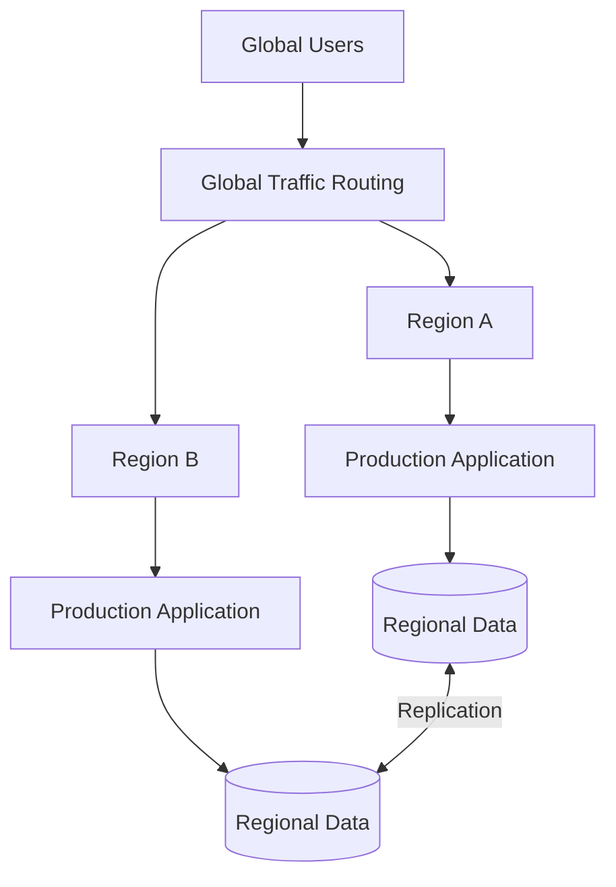
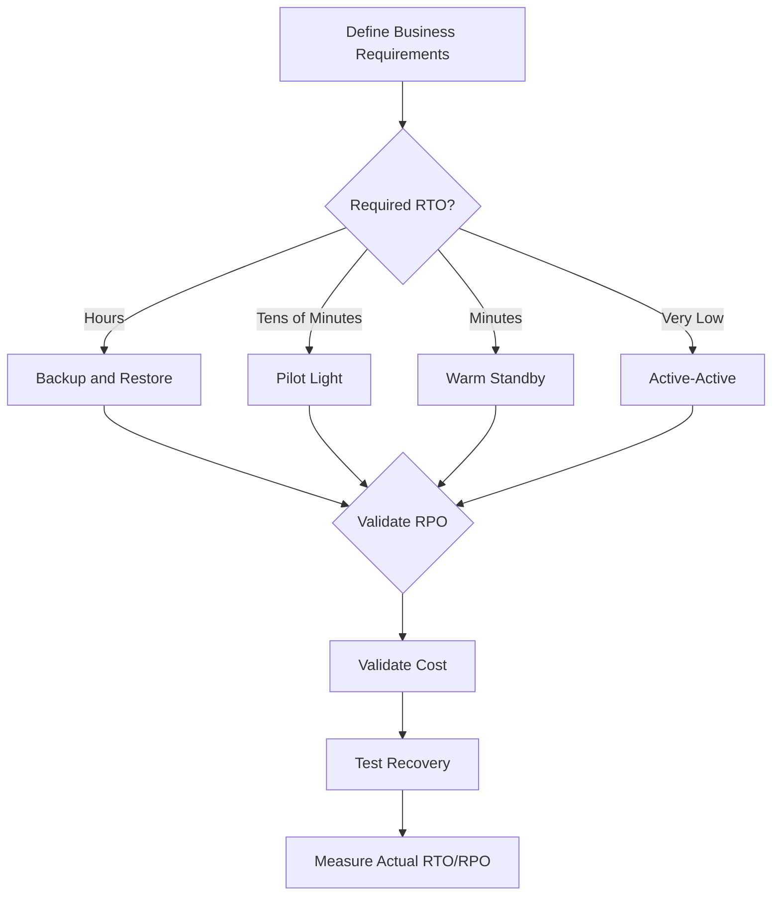
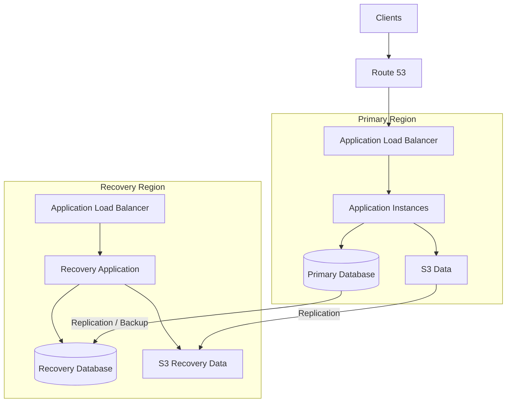

# 14- Disaster Recovery Strategies

## Overview

Disaster Recovery (DR) is the set of architectural, operational, and procedural mechanisms used to restore application functionality and data after a major failure.

High availability primarily attempts to **continue operating through failures**. Disaster recovery assumes that a sufficiently severe failure may make the primary environment unavailable and focuses on restoring service elsewhere or reconstructing it from protected data.

Typical disaster scenarios include:

- Complete AWS Region failure
- Large-scale Availability Zone disruption
- Accidental data deletion
- Database corruption
- Ransomware or destructive administrative actions
- Deployment failures
- Configuration corruption
- Infrastructure misconfiguration
- Loss of critical application dependencies
- Human operational errors

A useful distinction is:

```text
High Availability
       |
       v
Prevent / absorb failures
       |
       v
Keep serving traffic


Disaster Recovery
       |
       v
Recover from major failures
       |
       v
Restore service and data
```

A production DR strategy should be driven by measurable business requirements rather than by simply creating a second AWS environment.

The most important requirements are:

- **RTO — Recovery Time Objective:** maximum acceptable recovery time.
- **RPO — Recovery Point Objective:** maximum acceptable data loss measured in time.

---

## Disaster Recovery vs High Availability

HA and DR are complementary.

| Characteristic | High Availability | Disaster Recovery |
|---|---|---|
| Primary goal | Continue service | Restore service |
| Typical failure | Instance, AZ, component | Region, corruption, major disaster |
| Multi-AZ | Common | Can contribute |
| Multi-Region | Optional | Common |
| Backups | Helpful | Fundamental |
| Failover | Often automatic | Often automated or procedural |
| RTO | Usually very low | Requirement-dependent |
| RPO | Usually very low | Requirement-dependent |
| Operational complexity | Moderate | Potentially high |

For example:

```text
EC2 instance failure
        |
        v
Auto Scaling replacement
        |
        v
Service continues
```

This is primarily HA.

By contrast:

```text
Region failure
        |
        v
Recovery Region
        |
        v
Database recovery
        |
        v
Application activation
        |
        v
Traffic failover
```

This is DR.

---

## Disaster Recovery Objectives

### Recovery Time Objective

RTO defines the maximum acceptable duration of service unavailability.

For example:

```text
RTO = 30 minutes
```

means the recovery process should restore the service within approximately 30 minutes for the defined disaster scenario.

RTO affects architecture directly.

A system requiring:

```text
RTO < 5 minutes
```

usually cannot depend on a slow, heavily manual restoration process.

---

### Recovery Point Objective

RPO defines the maximum acceptable amount of data loss.

For example:

```text
RPO = 15 minutes
```

means the business accepts the possibility of losing up to approximately 15 minutes of data for the defined disaster scenario.

Conceptually:

```text
Last recoverable state
        |
        |---- acceptable data-loss window ----|
        |
     Disaster
```

RPO determines how frequently data must be replicated, backed up, or otherwise protected.

---

## RTO and RPO Together

RTO and RPO answer different questions:

| Requirement | Question |
|---|---|
| RTO | How quickly must the service recover? |
| RPO | How much recent data can be lost? |

Example:

```text
RTO = 10 minutes
RPO = 1 minute
```

This requires:

- rapid recovery infrastructure
- highly available or rapidly restorable data
- frequent replication or backups
- automated recovery procedures
- fast traffic redirection
- tested operational processes

A backup system can satisfy an RPO requirement while still failing the RTO requirement if restoring the backup takes several hours.

---

## Disaster Recovery Is a System Property

DR should not be designed only around the database.

Consider a backend system:

```text
                    API
                     |
       +-------------+-------------+
       |             |             |
    Database       Redis         Kafka
       |             |             |
    Storage       Sessions       Events
       |
   Backups
```

If the database can be restored but:

- application artifacts are unavailable
- secrets cannot be recovered
- infrastructure cannot be recreated
- Kafka events are lost
- DNS cannot be changed
- configuration is missing

then the system may still be unable to recover.

DR therefore covers the complete service dependency graph.

---

## Disaster Recovery Strategies

The major AWS DR strategies are commonly described as:

- Backup and Restore
- Pilot Light
- Warm Standby
- Multi-Site Active-Active

They represent increasing levels of:

- recovery speed
- operational complexity
- infrastructure cost
- architectural sophistication

```text
Recovery Speed
     ^
     |
     |                         Active-Active
     |                    Warm Standby
     |              Pilot Light
     |        Backup & Restore
     |
     +------------------------------------>
                 Cost / Complexity
```

There is no universally best strategy.

---

## Backup and Restore

Backup and Restore is the simplest DR strategy.

Production data is continuously or periodically backed up, while the recovery environment is created when needed.

```text
                 Production
                     |
                     v
                  Backups
                     |
                     v
               Backup Storage
                     |
                Disaster
                     |
                     v
             Recovery Environment
                     |
                     v
              Restore Data
                     |
                     v
              Start Application
```

Examples include:

- database backups
- snapshots
- object storage replication
- application artifacts
- infrastructure definitions
- configuration backups

---

## When to Use Backup and Restore

Use this strategy when:

- RTO can be relatively high
- the workload is not mission-critical
- cost must remain low
- occasional downtime is acceptable
- infrastructure can be recreated quickly

Typical examples:

- development environments
- internal tools
- low-priority applications
- workloads with relaxed recovery requirements

---

## Advantages of Backup and Restore

- Lowest infrastructure cost
- Simple operational model
- Strong data protection when backups are designed correctly
- Easy to implement incrementally
- Recovery environment does not need to run continuously

---

## Limitations of Backup and Restore

The primary limitation is recovery time.

A recovery may require:

```text
Provision infrastructure
        |
        v
Deploy application
        |
        v
Restore database
        |
        v
Restore configuration
        |
        v
Validate application
        |
        v
Switch traffic
```

If each operation takes several minutes or hours, the overall RTO may be unacceptable.

---

## Backup Design

A production backup strategy should address:

- backup frequency
- retention period
- encryption
- backup immutability where appropriate
- cross-account protection
- cross-region protection
- restoration procedures
- access controls
- deletion protection
- monitoring

A useful principle is:

> A backup that has never been restored is an assumption, not a proven recovery mechanism.

---

## Backup vs Snapshot

Snapshots and backups are related but not interchangeable concepts.

A snapshot is typically a point-in-time representation of a storage resource.

A backup strategy is broader and includes:

- retention
- recovery procedures
- multiple recovery points
- geographic protection
- access controls
- restoration testing

For production systems, design around the recovery requirement rather than simply creating snapshots.

---

## Pilot Light

Pilot Light keeps a minimal version of the recovery environment running continuously.

The core idea is:

```text
Primary Region
    |
    | Replication
    v
Recovery Region
    |
    +-- Minimal infrastructure
    +-- Data replication
    +-- Essential configuration
```

The recovery environment is not necessarily capable of serving the complete production workload immediately.

During a disaster:

```text
Disaster
   |
   v
Scale recovery environment
   |
   v
Promote / activate data
   |
   v
Deploy or scale application
   |
   v
Route traffic
```

---

## Why Pilot Light Exists

Pilot Light reduces recovery time compared with rebuilding everything from zero.

The most important components remain ready.

Typical candidates include:

- database replication
- core networking
- IAM configuration
- infrastructure definitions
- critical configuration
- essential application artifacts

---

## Advantages of Pilot Light

- Lower cost than fully active infrastructure
- Faster recovery than backup-only approaches
- Data can remain continuously replicated
- Good balance between cost and recovery speed

---

## Limitations of Pilot Light

- Recovery still requires operational steps
- Capacity may need to be provisioned during the disaster
- Configuration drift can occur
- Scaling time affects RTO
- Recovery procedures must be automated and tested

---

## Warm Standby

Warm Standby maintains a scaled-down but functional copy of the production environment.

```text
Region A
--------
Full Production
    |
    | Replication
    v
Region B
--------
Reduced Production
```

The secondary Region is already running.

During failure:

```text
Disaster
   |
   v
Scale secondary environment
   |
   v
Promote / validate data
   |
   v
Route traffic
```

---

## Warm Standby vs Pilot Light

| Characteristic | Pilot Light | Warm Standby |
|---|---|---|
| Application running | Minimal | Yes |
| Capacity | Very low | Reduced |
| Recovery speed | Faster than backup | Faster |
| Cost | Lower | Higher |
| Scaling during recovery | Significant | Moderate |
| Operational complexity | Medium | Medium/High |

Warm Standby is useful when the application requires a relatively short recovery time but running full production capacity in a second Region is too expensive.

---

## Multi-Site Active-Active

Multi-Site Active-Active runs production workloads in multiple Regions simultaneously.



Both Regions actively serve users.

If one Region fails:

```text
Region A
    X

Region B
    |
    v
Continues serving traffic
```

---

## Advantages of Active-Active

- Very low regional recovery time
- Both Regions provide useful capacity
- Better global latency
- Strong geographic resilience
- No need to activate a completely cold environment

---

## Limitations of Active-Active

The largest challenge is state.

The architecture must solve:

- multi-region writes
- replication
- conflict resolution
- consistency
- distributed locking
- session management
- event ordering
- regional ownership
- deployment coordination

Active-active is therefore not simply "run the same application twice."

---

## Strategy Comparison

| Strategy | Infrastructure Cost | RTO | RPO Potential | Complexity |
|---|---:|---:|---:|---:|
| Backup & Restore | Low | High | Medium/High | Low |
| Pilot Light | Low/Medium | Medium | Low/Medium | Medium |
| Warm Standby | Medium/High | Low | Low | High |
| Active-Active | High | Very Low | Very Low | Very High |

The actual RTO and RPO depend on implementation.

These categories should be treated as architectural patterns, not guaranteed performance levels.

---

## AWS Services Commonly Used for DR

AWS provides multiple services that can participate in a DR architecture.

| Requirement | Common AWS Services |
|---|---|
| Compute recovery | EC2, Auto Scaling, ECS, EKS |
| Database recovery | Amazon RDS, Aurora, DynamoDB |
| Object data | Amazon S3 |
| DNS failover | Route 53 |
| Traffic distribution | Route 53, Elastic Load Balancing |
| Infrastructure recovery | CloudFormation, CDK |
| Configuration | Systems Manager, Parameter Store |
| Secrets | Secrets Manager |
| Backups | AWS Backup |
| Monitoring | CloudWatch |
| Audit | CloudTrail |
| Container artifacts | ECR |
| Messaging | SQS, SNS, EventBridge, MSK |

The correct service depends on the workload and recovery requirements.

---

## Infrastructure as Code

Infrastructure should be reproducible.

Instead of manually rebuilding:

```text
VPC
Subnets
Security Groups
Load Balancer
EC2/ECS/EKS
Database
IAM
```

define infrastructure using:

- AWS CloudFormation
- AWS CDK
- Terraform

Conceptually:

```text
Infrastructure Code
        |
        v
Version Control
        |
        v
CI/CD
        |
        v
Recovery Region
```

This reduces manual recovery work and configuration drift.

---

## Application Artifact Recovery

The application itself must also be recoverable.

For containerized workloads:

```text
Source Code
    |
    v
CI/CD
    |
    v
Container Image
    |
    v
Amazon ECR
    |
    v
Recovery Region
```

Do not assume the recovery environment can build the application from source during an incident.

Pre-built, versioned artifacts are preferable for predictable recovery.

---

## Configuration Recovery

Configuration is part of the application.

Important recovery data can include:

- environment configuration
- database endpoints
- feature flags
- service endpoints
- encryption configuration
- IAM policies
- infrastructure parameters

Secrets should not be stored directly in application source code.

Use appropriate secret-management mechanisms and ensure that required secrets are available in the recovery environment.

---

## Database Recovery

Database recovery is usually the most critical part of DR.

Possible strategies include:

```text
Primary
   |
   +---- Automated Backup
   |
   +---- Point-in-Time Recovery
   |
   +---- Read Replica
   |
   +---- Cross-Region Replica
   |
   +---- Multi-Region Database
```

The correct approach depends on:

- RPO
- RTO
- database size
- write volume
- consistency requirements
- recovery complexity
- cost

---

## Point-in-Time Recovery

Point-in-time recovery allows a database to be restored to a specific recoverable point.

This is particularly useful for:

- accidental deletion
- bad deployments
- corrupted data
- incorrect SQL operations

For example:

```text
09:00 ---- 10:00 ---- 11:00 ---- 12:00
                       ^
                       |
                Desired restore point
```

It is different from simply restoring the latest full backup.

---

## Cross-Region Recovery

For regional disaster recovery, maintain recoverable data outside the primary Region.

Conceptually:

```text
Region A
--------
Primary Database
       |
       | Replication / Backup
       v
Region B
--------
Recovery Data
```

This protects against a disaster that affects the primary Region.

However, cross-region replication can introduce:

- latency
- replication lag
- additional cost
- consistency considerations

---

## RPO and Replication Lag

For asynchronous replication:

```text
Primary
   |
   | Write
   v
Primary Data
   |
   | asynchronous replication
   v
Secondary
```

There may be a window in which the secondary database does not contain the latest writes.

If:

```text
Replication lag = 30 seconds
```

then the effective recoverable data point may be approximately 30 seconds behind the primary at the moment of failure.

Monitoring replication lag is therefore essential.

---

## Data Recovery Validation

Recovery should not stop when a database becomes available.

Validate:

- schema
- migrations
- indexes
- row counts where appropriate
- application connectivity
- critical business records
- replication state
- permissions
- application behavior

A database can be technically "restored" while the application is still unusable.

---

## DNS and Traffic Recovery

A common DR flow is:

```text
                    Route 53
                       |
             +---------+---------+
             |                   |
             v                   v
        Primary Region      Recovery Region
             |                   |
             v                   v
         Application         Application
```

During normal operation:

```text
Users -> Primary
```

During failover:

```text
Users -> Recovery
```

DNS-based failover is not instantaneous for every client because cached DNS responses may continue to be used until their TTL expires.

For strict RTO requirements, account for DNS propagation behavior and client-side caching.

---

## Failover vs Failback

Failover moves the workload from the primary environment to the recovery environment.

```text
Primary
   X
   |
   v
Recovery
```

Failback moves the workload back after the primary environment has been repaired.

```text
Recovery
   |
   v
Repaired Primary
```

Failback is frequently overlooked.

A complete DR plan should define:

- when failback is appropriate
- how data is synchronized
- how traffic is switched
- how consistency is verified
- how rollback works

---

## DR Runbook

A production DR runbook should provide explicit operational steps.

Example:

```text
1. Detect incident
2. Declare disaster scenario
3. Identify affected Region
4. Stop conflicting operations
5. Verify recovery data
6. Promote recovery database
7. Activate application capacity
8. Validate dependencies
9. Change traffic routing
10. Run smoke tests
11. Monitor recovery environment
12. Communicate status
13. Stabilize workload
14. Plan failback
```

The runbook should identify:

- responsible teams
- escalation contacts
- required permissions
- exact commands or procedures
- validation checks
- rollback steps

---

## Automating Recovery

Manual recovery increases RTO and introduces human error.

Automate wherever practical:

- infrastructure provisioning
- application deployment
- database promotion
- configuration loading
- secret retrieval
- health validation
- DNS changes
- smoke tests

A useful architecture is:

```text
Disaster Detection
        |
        v
Recovery Automation
        |
        +--> Infrastructure
        +--> Database
        +--> Application
        +--> Configuration
        +--> Traffic
        |
        v
Validation
```

Automation should still include safeguards for destructive operations.

---

## DR Testing

The most important DR practice is testing.

A recovery strategy that exists only in documentation is unverified.

Test:

- database restoration
- application deployment
- infrastructure recreation
- DNS failover
- cross-region replication
- secret availability
- IAM permissions
- object recovery
- event/message recovery
- application smoke tests

Measure:

```text
Actual RTO
Actual RPO
Recovery success rate
Manual intervention
Replication lag
Data integrity
```

---

## Types of DR Tests

### Backup Restoration Test

Restore a backup into an isolated environment.

Verify:

- data integrity
- application compatibility
- restoration duration

### Failover Test

Move traffic to the recovery environment.

Verify:

- routing
- application health
- database availability
- dependency behavior

### Full Disaster Simulation

Simulate a major failure.

Verify the complete recovery process.

### Game Day

A controlled exercise where engineering teams execute the recovery procedure under realistic conditions.

Game days are particularly valuable for discovering undocumented dependencies.

---

## Backup Strategy

A robust backup strategy should consider multiple dimensions:

```text
Backup
 |
 +-- Frequency
 +-- Retention
 +-- Encryption
 +-- Geographic isolation
 +-- Account isolation
 +-- Immutability
 +-- Access control
 +-- Restoration testing
```

A single backup copy in the same Region and account as production provides limited protection against large-scale destructive events.

---

## Security and Backup Isolation

Backups should be protected from the same compromise that could destroy production data.

Consider:

- separate AWS accounts
- restrictive IAM policies
- encryption
- backup vault controls
- immutable retention mechanisms where appropriate
- CloudTrail auditing
- restricted deletion permissions

The principle is:

```text
Production Credentials
        X
        |
        X
Should not freely delete
all recovery data
```

This reduces the blast radius of compromised credentials.

---

## Disaster Recovery for Redis

Redis is commonly used as a cache, session store, rate limiter, or temporary state store.

The DR strategy depends on its role.

If Redis is purely a cache:

```text
Redis Failure
     |
     v
Cache Miss
     |
     v
Database
```

The application may recover without restoring the cache.

If Redis contains critical state:

```text
Redis Failure
     |
     v
Business Data Loss
```

then Redis must be treated as a stateful dependency and protected accordingly.

This distinction should be explicit in the architecture.

---

## Disaster Recovery for Kafka

Kafka recovery requires considering:

- topic configuration
- partitions
- replication
- consumer offsets
- message retention
- schema compatibility
- producer/consumer deployment
- cross-region replication strategy

A recovery architecture should answer:

```text
What happens to messages produced
during the disaster?

What happens to consumer offsets?

Can consumers resume safely?

Can duplicate messages occur?

Can message ordering be preserved?
```

Kafka consumers should generally be designed with idempotency because replay and duplicate processing are common concerns in recovery scenarios.

---

## Disaster Recovery for Celery

For Celery-based background processing, DR should consider:

- broker availability
- task durability
- task acknowledgements
- retry behavior
- idempotency
- worker deployment
- scheduled tasks
- duplicate execution

For example:

```text
API
 |
 v
Message Broker
 |
 v
Celery Workers
 |
 v
Database
```

If the broker fails, determine whether queued tasks can be recovered.

If a task executes successfully but the worker crashes before acknowledgement, the task may be delivered again depending on the configuration.

Therefore, production tasks should be designed to tolerate retries and duplicate execution where possible.

---

## Disaster Recovery for Object Storage

Object storage can be a critical source of application data.

Protect against:

- accidental deletion
- overwrite
- regional failure
- malicious deletion
- application bugs

Depending on requirements, use mechanisms such as:

- versioning
- lifecycle policies
- replication
- backups
- restricted deletion permissions

Recovery should preserve the ability to retrieve required historical versions where the business requires it.

---

## Disaster Recovery and Kubernetes

For Kubernetes-based workloads, the cluster itself is often reproducible through Infrastructure as Code.

A DR architecture should separate:

```text
Application State
        |
        v
Persistent Data
```

from:

```text
Kubernetes Control Plane
        |
        v
Reproducible Infrastructure
```

Containers are relatively easy to recreate.

Persistent state is the difficult part.

Therefore:

> DR for Kubernetes is primarily a data and dependency recovery problem, not merely a cluster recreation problem.

---

## Disaster Recovery and CI/CD

CI/CD must support recovery.

A recovery pipeline should be capable of:

```text
Source / Artifact
       |
       v
Recovery Environment
       |
       v
Deployment
       |
       v
Validation
```

The deployment process should be:

- version controlled
- repeatable
- auditable
- environment-aware
- tested

Avoid relying on an engineer's laptop as the only way to rebuild production.

---

## Monitoring DR Readiness

Monitor not only production health but also recovery readiness.

Useful indicators include:

- backup success
- backup age
- replication lag
- restore test success
- recovery environment health
- infrastructure drift
- artifact availability
- secret availability
- DNS configuration
- RTO test results

Example:

```text
DR Dashboard
|
+-- Latest Backup: Healthy
+-- Replication Lag: 2 sec
+-- Recovery Region: Healthy
+-- Artifact Replication: Healthy
+-- Restore Test: Passed
+-- Last DR Exercise: Passed
```

---

## Disaster Recovery Maturity

Organizations can evolve their DR maturity progressively.

### Basic

```text
Backups
+
Manual restoration
```

### Intermediate

```text
Backups
+
Infrastructure as Code
+
Documented Runbook
+
Restore Testing
```

### Advanced

```text
Cross-Region Replication
+
Automated Recovery
+
Warm Standby
+
Regular Game Days
```

### Highly Resilient

```text
Multi-Region Active-Active
+
Automated Failover
+
Distributed Data Strategy
+
Continuous Validation
```

Higher maturity also means higher engineering and operational complexity.

---

## Choosing a Strategy

A practical decision framework is:



Do not select a strategy before defining:

- business impact
- RTO
- RPO
- acceptable downtime
- acceptable data loss
- budget
- compliance requirements
- operational maturity

---

## Example Backend DR Architecture

Consider a Django or FastAPI API running in AWS.

A practical active-passive architecture could look like:



Normal operation:

```text
Users
  |
  v
Route 53
  |
  v
Primary Region
```

During disaster recovery:

```text
Primary Region
      X
      |
      v
Recovery Region
      |
      v
Route 53
      |
      v
Users
```

The exact implementation depends on the AWS services and consistency requirements of the application.

---

## Production Checklist

Before considering a production system DR-ready, verify:

### Business Requirements

- [ ] RTO is documented.
- [ ] RPO is documented.
- [ ] Critical workloads are identified.
- [ ] Recovery priorities are defined.

### Infrastructure

- [ ] Infrastructure is defined as code.
- [ ] Recovery infrastructure can be recreated.
- [ ] Networking is reproducible.
- [ ] IAM permissions are reproducible.

### Data

- [ ] Databases are backed up.
- [ ] Critical data is geographically protected where required.
- [ ] Replication lag is monitored.
- [ ] Point-in-time recovery is available where required.
- [ ] Object storage recovery is tested.

### Application

- [ ] Application artifacts are versioned.
- [ ] Container images are available in the recovery environment.
- [ ] Configuration can be restored.
- [ ] Secrets can be retrieved securely.
- [ ] Background jobs can be recovered.

### Operations

- [ ] DR runbook exists.
- [ ] Ownership is defined.
- [ ] Failover procedure is documented.
- [ ] Failback procedure is documented.
- [ ] Communication procedures exist.

### Validation

- [ ] Backups have been restored successfully.
- [ ] Recovery environment has been tested.
- [ ] DNS failover has been tested.
- [ ] Actual RTO has been measured.
- [ ] Actual RPO has been measured.
- [ ] DR exercises are performed periodically.

---

## Common Mistakes

### Treating Backups as a Complete DR Strategy

Backups protect data but do not automatically provide a running application.

Recovery also requires:

- infrastructure
- application artifacts
- configuration
- secrets
- networking
- traffic routing

### Never Testing Restoration

A successful backup job does not prove that restoration works.

Always perform restoration tests.

### Ignoring RTO

Teams may create backups without measuring how long restoration actually takes.

If:

```text
Required RTO = 30 minutes
Actual restore time = 3 hours
```

the strategy does not satisfy the requirement.

### Ignoring RPO

A daily backup cannot satisfy a requirement for near-zero data loss.

Backup frequency must correspond to the business-defined RPO.

### Forgetting Failback

Failover is only half of the recovery lifecycle.

The architecture must also define how the workload returns to the primary environment.

### Recovery Environment Drift

A secondary environment can become stale.

Keep:

- infrastructure
- application versions
- configuration
- security policies

aligned with production.

### Storing Recovery Credentials in Production

If production credentials can destroy both production and recovery data, one compromised credential set can eliminate the entire recovery strategy.

Use isolation and least privilege.

### Making DR Too Complex

Active-active Multi-Region is not automatically better.

If the business can tolerate a one-hour recovery, building a complex active-active architecture may introduce unnecessary cost and operational risk.

---

## Interview Traps

### Is Backup the Same as Disaster Recovery?

No.

Backup is one component of a DR strategy.

DR includes the complete process of recovering:

- infrastructure
- application
- data
- configuration
- dependencies
- traffic
- operations

### What Determines the DR Strategy?

Primarily:

```text
RTO
RPO
Business Criticality
Cost
Consistency Requirements
Operational Complexity
```

### Which DR Strategy Is Cheapest?

Generally, Backup and Restore has the lowest continuously running infrastructure cost.

However, total cost should include recovery engineering, testing, storage, transfer, and operational effort.

### Which Strategy Has the Lowest Recovery Time?

Active-Active can provide the lowest recovery time because multiple Regions are already serving traffic.

It also has the highest complexity.

### Does Multi-Region Automatically Mean Disaster Recovery?

No.

A second Region without:

- replicated data
- deployable infrastructure
- recoverable configuration
- tested failover

is not a complete DR strategy.

---

## Key Takeaways

- Disaster recovery is a complete recovery capability covering data, infrastructure, applications, configuration, dependencies, traffic, and operational procedures.
- RTO determines how quickly the system must recover, while RPO determines how much recent data the business can tolerate losing.
- Backup and Restore, Pilot Light, Warm Standby, and Active-Active provide progressively faster recovery at increasing cost and operational complexity.
- DR is only credible when restoration and failover are regularly tested and actual RTO/RPO are measured against business requirements.
- The best DR architecture is the simplest strategy that reliably satisfies the application's availability, recovery, data-loss, security, and business requirements.