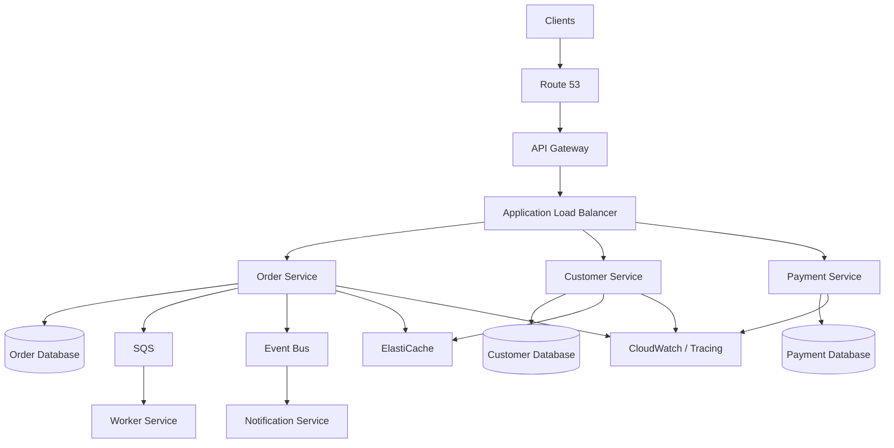
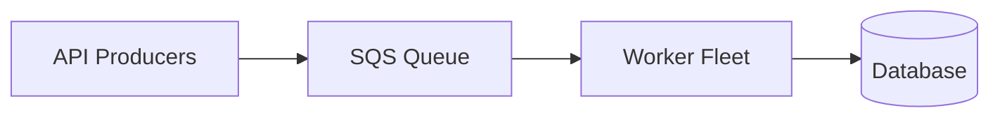
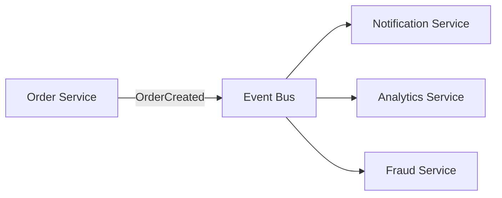
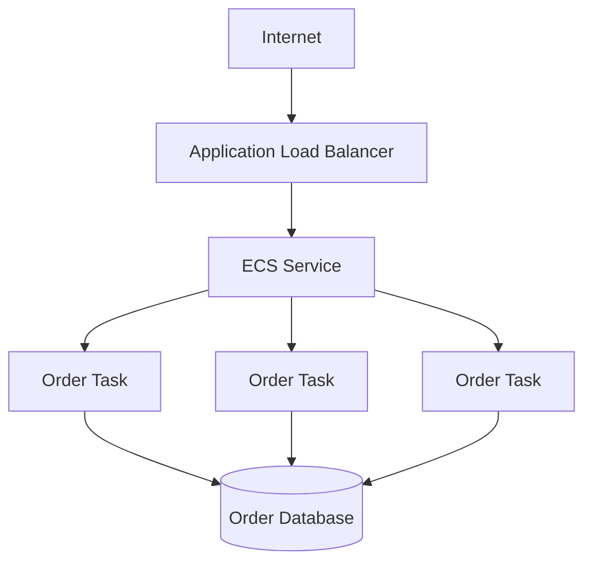

# 15- Microservices Architecture on AWS

## Overview

Microservices architecture decomposes a backend system into independently deployable services, where each service owns a focused business capability and communicates with other services through well-defined interfaces.

On AWS, microservices are not a single service or product. They are an architectural composition of networking, compute, service discovery, API management, messaging, data stores, observability, security, and deployment mechanisms.

A production architecture may combine:

- Amazon VPC for network isolation
- Application Load Balancer for HTTP traffic
- Amazon API Gateway for public API management
- Amazon ECS or Amazon EKS for service execution
- AWS Lambda for event-driven workloads
- Amazon RDS or Aurora for relational data
- DynamoDB for selected distributed workloads
- ElastiCache for caching
- Amazon SQS for asynchronous processing
- Amazon SNS and EventBridge for event distribution
- Amazon MSK or self-managed Kafka for high-throughput streaming
- Route 53 for DNS
- CloudWatch and X-Ray-compatible observability tooling for monitoring and tracing
- IAM for service authorization
- AWS Secrets Manager or Systems Manager Parameter Store for configuration and secrets
- ECR for container images
- CloudFormation, CDK, or Terraform for infrastructure as code

The central architectural challenge is not creating many services. It is controlling **distributed-system complexity** while gaining independent scalability, deployment, ownership, and fault isolation.

---

## What Microservices Architecture Means

A microservice should represent a meaningful business or domain capability rather than an arbitrary technical layer.

A poor decomposition might look like:

```text
user-controller-service
user-service
user-database-service
user-validation-service
```

A stronger decomposition is based on business boundaries:

```text
Customer Service
Order Service
Payment Service
Inventory Service
Notification Service
```

Each service should have:

- a clear responsibility
- an explicit API contract
- an ownership boundary
- independently deployable code
- controlled dependencies
- appropriate data ownership
- isolated failure behavior

A useful mental model is:

```text
                Microservices Platform

       +-------------+-------------+
       |             |             |
       v             v             v
   Customers       Orders       Payments
       |             |             |
       v             v             v
  Customer DB     Order DB     Payment DB
```

The goal is **independent change**, not simply smaller codebases.

---

## Why Microservices Exist

Microservices are primarily useful when a system has organizational, scaling, deployment, or domain boundaries that justify independent services.

Common motivations include:

| Driver | Benefit |
|---|---|
| Independent deployments | Teams deploy without coordinating the entire application |
| Independent scaling | Scale expensive workloads separately |
| Fault isolation | Failure in one capability does not necessarily stop everything |
| Domain ownership | Teams can own business capabilities end-to-end |
| Technology flexibility | Services can use different technologies when justified |
| Faster development at scale | Multiple teams can work independently |
| Deployment isolation | Risk can be limited to individual services |

Microservices do not automatically make a system:

- faster
- cheaper
- more reliable
- easier to operate

They trade application-level simplicity for distributed-system complexity.

---

## Monolith vs Microservices

| Characteristic | Monolith | Microservices |
|---|---|---|
| Deployment | Whole application | Per service |
| Database | Often shared | Prefer service ownership |
| Network calls | Mostly in-process | Frequently network-based |
| Scaling | Application-level | Service-level |
| Failure modes | Mostly local | Distributed |
| Observability | Simpler | More complex |
| Transactions | Easier | Distributed transactions are difficult |
| Infrastructure | Simpler | More infrastructure |
| Team autonomy | Limited at large scale | Higher |
| Operational cost | Lower initially | Higher |

A modular monolith can often provide many benefits of good domain separation without immediately introducing distributed-system complexity.

---

## When Microservices Are Appropriate

Microservices are more appropriate when:

- multiple teams need independent ownership
- different components scale differently
- deployments need to be isolated
- domain boundaries are reasonably understood
- failure isolation is important
- the organization can operate distributed systems
- service boundaries have meaningful business value

They are less appropriate when:

- the application is small
- the domain is poorly understood
- there is only one small development team
- operational maturity is low
- every operation requires synchronous calls across many services
- services would share the same database tables
- independent deployment provides little value

---

## AWS Microservices Architecture

A typical AWS architecture can be structured as:



This is an example architecture, not a mandatory AWS pattern.

The correct architecture depends on traffic, latency, consistency, workload type, team structure, and operational requirements.

---

## Service Boundaries

The most important microservices decision is determining service boundaries.

A service boundary should ideally align with a business capability.

For example, an e-commerce platform could contain:

```text
Customer
Order
Payment
Inventory
Shipping
Notification
```

A request might flow through:

```text
Client
  |
  v
Order Service
  |
  +----> Inventory Service
  |
  +----> Payment Service
  |
  +----> Notification Service
```

Every additional network dependency introduces:

- latency
- timeout behavior
- retries
- failure propagation
- observability requirements
- deployment dependencies

Therefore, service boundaries should minimize unnecessary synchronous communication.

---

## Bounded Contexts

Domain-driven design provides a useful way to reason about service boundaries.

A bounded context defines a domain boundary within which:

- terminology is consistent
- business rules are owned
- models have a specific meaning
- data has a clear ownership boundary

For example, `Order` may mean something different from `Payment`.

```text
Order Context
-------------
Order
OrderItem
OrderStatus


Payment Context
---------------
Payment
PaymentMethod
PaymentStatus
```

Avoid creating a single global domain model shared by every service.

---

## Database per Service

A core microservices principle is that each service should own its data.

```text
Order Service
     |
     v
Order Database

Payment Service
     |
     v
Payment Database

Customer Service
     |
     v
Customer Database
```

This provides stronger ownership and deployment independence.

It also creates a major consequence:

> Cross-service joins and ACID transactions are no longer simple local database operations.

---

## Shared Database Anti-Pattern

Consider:

```text
Order Service ----+
                  |
Payment Service --+--> PostgreSQL
                  |
Customer Service -+
```

Although operationally simple, this creates coupling.

One service can potentially:

- modify another service's tables
- depend on another service's schema
- create cross-service transactions
- block independent database migrations

A stronger design is:

```text
Order Service ------> Order DB
Payment Service ----> Payment DB
Customer Service ---> Customer DB
```

---

## Database Ownership Does Not Necessarily Mean Different Database Technologies

Each service can own a separate logical database while using the same database technology.

For example:

```text
Order Service ------> PostgreSQL
Payment Service ----> PostgreSQL
Customer Service ---> PostgreSQL
```

The important boundary is ownership.

You do not need DynamoDB for one service and PostgreSQL for another simply because the architecture is microservices.

Technology selection should be driven by workload requirements.

---

## Synchronous Communication

Synchronous communication means the caller waits for a response.

Common technologies include:

- REST
- HTTP
- gRPC

Example:

```text
Order Service
      |
      | POST /payments
      v
Payment Service
      |
      | response
      v
Order Service
```

Synchronous calls are useful when the caller cannot continue without the result.

Examples:

- retrieving customer authorization
- validating payment
- retrieving current inventory
- executing a synchronous business operation

---

## REST Between Services

REST is useful when:

- APIs are externally exposed
- interoperability matters
- HTTP semantics are sufficient
- service contracts should be easy to inspect
- teams need broad tooling compatibility

Example:

```http
POST /payments
Content-Type: application/json

{
  "order_id": "ord_123",
  "amount": 12500,
  "currency": "INR"
}
```

For internal APIs, define:

- request schemas
- response schemas
- error formats
- timeout policies
- authentication
- versioning strategy
- idempotency behavior

---

## gRPC Between Services

gRPC can be effective for internal service-to-service communication where:

- low latency matters
- strongly typed contracts are valuable
- high-throughput communication is required
- streaming is useful
- services are controlled by the same organization

A common architecture is:

```text
External Clients
       |
       v
REST / HTTP API
       |
       v
Service A
       |
       | gRPC
       v
Service B
```

Do not introduce gRPC merely because it is technically sophisticated. REST may be simpler and entirely sufficient for many internal systems.

---

## Asynchronous Communication

Asynchronous communication allows a service to publish work or events without waiting for every downstream consumer.

Example:

```text
Order Service
      |
      v
    SQS
      |
      +----> Notification Worker
      |
      +----> Fulfillment Worker
```

This reduces synchronous coupling.

It also introduces:

- eventual consistency
- duplicate delivery
- retry behavior
- message ordering concerns
- dead-letter handling
- observability complexity

---

## Queue-Based Load Leveling

Queues are particularly useful when downstream capacity is lower or more variable than incoming traffic.



Instead of forcing the database to handle every incoming request immediately, the queue absorbs bursts.

For example:

```text
Incoming requests
10000/sec
     |
     v
   Queue
     |
     v
Workers
500/sec
     |
     v
Database
```

The queue does not eliminate the workload. It smooths it over time.

---

## Event-Driven Architecture

In event-driven systems, services publish facts about things that happened.

Example:

```text
OrderCreated
PaymentCompleted
OrderShipped
CustomerRegistered
```

Consumers react independently.



AWS services commonly used for event-driven designs include:

- Amazon EventBridge
- Amazon SNS
- Amazon SQS
- Amazon MSK

---

## Queue vs Event Bus vs Streaming Platform

| Technology | Primary Model | Typical Use |
|---|---|---|
| SQS | Queue | Work distribution |
| SNS | Pub/Sub | Fan-out notifications |
| EventBridge | Event bus | Event routing between producers and consumers |
| Kafka/MSK | Distributed log | High-throughput event streaming |

Selection should be based on delivery semantics, ordering, throughput, replay requirements, filtering, consumer behavior, and operational needs.

---

## Service Discovery

Microservices need a mechanism to locate one another.

Possible approaches include:

- ECS Service Connect
- AWS Cloud Map
- Kubernetes Services
- internal load balancers
- API Gateway
- DNS-based discovery

Avoid hardcoding infrastructure addresses:

```python
PAYMENT_SERVICE = "10.0.3.17:8080"
```

Infrastructure changes should not require application code changes.

A service should resolve dependencies through stable service identities.

---

## API Gateway

Amazon API Gateway can act as an external API boundary.

Typical responsibilities include:

- request routing
- authentication integration
- throttling
- rate limiting
- API lifecycle management
- request validation
- observability
- usage controls

A common design is:

```text
Internet
   |
   v
API Gateway
   |
   +----> Order Service
   +----> Customer Service
   +----> Payment Service
```

Do not expose every internal service directly to the public internet.

---

## Application Load Balancer

An Application Load Balancer is useful for distributing HTTP/HTTPS traffic among service instances.

Example:

```text
Client
  |
  v
ALB
  |
  +----> ECS Task 1
  +----> ECS Task 2
  +----> ECS Task 3
```

ALB can support:

- path-based routing
- host-based routing
- health checks
- TLS termination
- target-group-based service isolation

For example:

```text
/api/orders/*      -> Order Service
/api/customers/*   -> Customer Service
/api/payments/*    -> Payment Service
```

---

## ECS vs EKS

AWS provides multiple container orchestration approaches.

| Characteristic | ECS | EKS |
|---|---|---|
| Orchestration | AWS-native | Kubernetes |
| Operational complexity | Lower | Higher |
| Kubernetes ecosystem | No | Yes |
| AWS integration | Strong | Strong |
| Portability | Moderate | High |
| Learning curve | Lower | Higher |
| Best fit | AWS-centric container workloads | Kubernetes-based platforms |

Choose based on organizational requirements.

Do not use Kubernetes solely because the architecture contains multiple services.

---

## ECS-Based Architecture

A typical ECS architecture might look like:



ECS services can automatically maintain the desired number of running tasks and integrate with load balancing and deployment mechanisms.

---

## EKS-Based Architecture

With Kubernetes:

```text
AWS VPC
 |
 +-- EKS Cluster
      |
      +-- Order Deployment
      |     +-- Pod
      |     +-- Pod
      |
      +-- Payment Deployment
      |     +-- Pod
      |     +-- Pod
      |
      +-- Customer Deployment
            +-- Pod
            +-- Pod
```

Kubernetes provides service discovery, scheduling, scaling, rolling deployments, and a large ecosystem.

However, operating Kubernetes introduces substantial platform complexity.

---

## Lambda-Based Microservices

Not every microservice needs containers.

A business capability can be implemented with Lambda:

```text
API Gateway
     |
     v
Lambda
     |
     v
DynamoDB
```

Lambda is particularly effective for:

- event-driven processing
- irregular workloads
- lightweight APIs
- scheduled processing
- integrations
- automation

Containers are often more suitable for:

- long-running processes
- custom runtime requirements
- predictable workloads
- workloads requiring more control over execution

---

## Service Communication Failure

Distributed calls fail.

Consider:

```text
Order Service
     |
     | HTTP
     v
Payment Service
     |
     X
   Timeout
```

The Order Service must decide what to do.

Possible strategies include:

- timeout
- retry
- exponential backoff
- jitter
- circuit breaker
- fallback
- asynchronous processing
- compensation

Never assume a network request either succeeds immediately or fails cleanly.

---

## Timeouts

Every network dependency should have an explicit timeout.

Without timeouts:

```text
Request
  |
  v
Service A
  |
  v
Service B
  |
  X
No response
  |
  v
Thread remains occupied
```

Enough concurrent failures can exhaust:

- application workers
- connection pools
- memory
- CPU
- sockets

Timeouts prevent indefinite resource consumption.

---

## Retries

Retries are useful for transient failures.

A common strategy is exponential backoff:

```text
Attempt 1 -> immediate
Attempt 2 -> 100ms
Attempt 3 -> 200ms
Attempt 4 -> 400ms
Attempt 5 -> 800ms
```

Add jitter to avoid synchronized retry storms.

Retries should not be blindly applied to all errors.

For example:

```text
HTTP 400 -> usually do not retry
HTTP 401 -> usually do not retry
HTTP 404 -> usually do not retry
HTTP 429 -> retry according to policy
HTTP 503 -> potentially retry
Timeout -> potentially retry
```

The exact policy depends on the API contract.

---

## Circuit Breakers

A circuit breaker prevents repeated calls to an unhealthy dependency.

Conceptually:

```text
Closed
  |
  | failures exceed threshold
  v
Open
  |
  | cooldown
  v
Half-Open
  |
  +---- success ---> Closed
  |
  +---- failure ---> Open
```

This prevents a failing downstream service from consuming all upstream resources.

Circuit breakers are especially useful for synchronous microservice calls.

---

## Bulkheads

Bulkhead isolation prevents one dependency from consuming all resources.

For example:

```text
Order Service
 |
 +-- Payment Connection Pool
 |
 +-- Inventory Connection Pool
 |
 +-- Customer Connection Pool
```

If the Payment Service becomes slow, it should not consume every available connection and prevent inventory operations from executing.

Isolation can be implemented using:

- separate connection pools
- bounded worker pools
- separate queues
- concurrency limits
- separate workloads

---

## Idempotency

Distributed systems frequently retry operations.

Therefore, important operations should often be idempotent.

Example:

```http
POST /payments
Idempotency-Key: 6d9f...
```

If the request is retried:

```text
Attempt 1 -> Payment created
Attempt 2 -> Same idempotency key
Attempt 3 -> Same idempotency key
```

The payment service should avoid charging the customer multiple times.

Idempotency is essential for:

- payment operations
- order creation
- message consumers
- webhook processing
- distributed workflows

---

## Distributed Transactions

Traditional local transactions are straightforward:

```text
BEGIN
  Update Order
  Update Payment
COMMIT
```

Across services:

```text
Order DB
   |
   +---- network ----> Payment DB
```

A single ACID transaction cannot generally span independent service databases without introducing distributed transaction machinery and tight coupling.

Microservices commonly use patterns such as:

- Saga
- transactional outbox
- compensating transactions
- eventual consistency

---

## Saga Pattern

A Saga represents a distributed business transaction as a sequence of local transactions.

Example:

```text
Create Order
    |
    v
Reserve Inventory
    |
    v
Process Payment
    |
    v
Confirm Order
```

If payment fails:

```text
Process Payment
      X
      |
      v
Release Inventory
      |
      v
Cancel Order
```

Each compensation reverses the business effect of an earlier step.

---

## Transactional Outbox

A service can store business data and an outgoing event in the same local transaction.

```text
BEGIN
  INSERT order
  INSERT outbox_event
COMMIT
```

A background publisher then sends the event.

```text
Order DB
   |
   v
Outbox Table
   |
   v
Publisher
   |
   v
Event Bus
```

This prevents the classic failure:

```text
Database commit succeeds
        |
        X
Event publish fails
```

Without an outbox, the database state and event stream can become inconsistent.

---

## Data Consistency

Microservices often accept eventual consistency.

For example:

```text
Order Created
     |
     v
Payment Pending
     |
     v
Payment Completed
     |
     v
Order Confirmed
```

Different services may temporarily observe different states.

The architecture must define which data requires:

- strong consistency
- eventual consistency
- read-after-write consistency
- asynchronous propagation

Do not introduce distributed synchronization for data that does not require it.

---

## Caching

Caching can reduce latency and database load.

A common architecture is:

```text
Service
  |
  +----> Redis
  |
  +----> PostgreSQL
```

Cache only data where stale results are acceptable or cache invalidation is explicitly controlled.

Microservices increase cache invalidation complexity because the source of truth may live in another service.

---

## Authentication and Authorization

Microservices need consistent identity handling.

A common external flow is:

```text
Client
  |
  v
API Gateway
  |
  v
Authentication
  |
  v
Service
```

Services should distinguish:

- authentication — who is calling?
- authorization — what can they do?

Internal service-to-service authentication should also be considered.

Do not assume that traffic inside a VPC is automatically trusted.

---

## IAM and AWS Security

Use least privilege.

Examples:

```text
Order Service Role
    |
    +--> Order Database
    +--> SQS Order Queue
    +--> Required Secrets
```

It should not automatically have:

```text
AdministratorAccess
```

Service identities should receive only the permissions they require.

Use:

- IAM roles
- security groups
- private subnets
- VPC endpoints where appropriate
- encryption
- Secrets Manager
- CloudTrail
- centralized logging

---

## Network Architecture

A production microservices platform typically separates public and private resources.

```text
Internet
   |
   v
Public Subnets
   |
   +-- ALB / API boundary
   |
   v
Private Subnets
   |
   +-- Application services
   +-- Databases
   +-- Internal infrastructure
```

Databases should generally not be directly reachable from the public internet.

Security groups should define explicit traffic relationships.

---

## VPC Design

A production VPC may contain:

```text
VPC
 |
 +-- Public Subnets
 |    +-- Load Balancers
 |
 +-- Private Application Subnets
 |    +-- ECS / EKS / EC2
 |
 +-- Private Data Subnets
      +-- RDS
      +-- Cache
```

Use multiple Availability Zones for production workloads requiring high availability.

---

## Observability

Distributed systems require distributed observability.

At minimum, capture:

- logs
- metrics
- traces
- request IDs
- correlation IDs
- service-level indicators
- dependency latency
- error rates

A request might travel through:

```text
Client
  |
  v
API Gateway
  |
  v
Order Service
  |
  +--> Inventory Service
  |
  +--> Payment Service
  |
  +--> Notification Service
```

Without tracing, identifying where latency originates becomes difficult.

---

## Correlation IDs

A request identifier should propagate through services.

Example:

```text
X-Request-ID: 7f31...
```

Flow:

```text
API Gateway
    |
    | request-id
    v
Order Service
    |
    | request-id
    v
Payment Service
    |
    | request-id
    v
Notification Service
```

Logs from all services can then be correlated.

---

## Metrics

Important service metrics include:

### Traffic

- requests per second
- messages per second

### Latency

- p50
- p95
- p99

### Errors

- 4xx rate
- 5xx rate
- dependency failures

### Saturation

- CPU
- memory
- connection pools
- queue depth
- thread count
- worker utilization

### Dependency Health

- database latency
- cache hit ratio
- downstream error rate
- replication lag

---

## Distributed Tracing

Tracing helps identify request paths.

Example:

```text
Trace
 |
 +-- API Gateway       10ms
 |
 +-- Order Service     40ms
 |    |
 |    +-- Inventory    20ms
 |    |
 |    +-- Payment      150ms
 |
 +-- Response
```

This immediately highlights Payment Service as a latency contributor.

Tracing becomes increasingly important as service count grows.

---

## Deployment Strategy

Microservices should be independently deployable.

A typical CI/CD flow is:

```text
Git Push
   |
   v
CI
   |
   +-- Tests
   +-- Security Checks
   +-- Build
   |
   v
Container Image
   |
   v
ECR
   |
   v
Deployment
   |
   v
ECS / EKS
```

A service should ideally be deployable without requiring simultaneous deployment of unrelated services.

---

## Rolling Deployments

A rolling deployment gradually replaces old instances.

```text
Before:

v1 v1 v1 v1

During:

v1 v1 v1 v2

Later:

v1 v2 v2 v2

After:

v2 v2 v2 v2
```

This reduces deployment interruption.

Ensure that API contracts remain compatible during the transition.

---

## Blue/Green Deployments

Blue/green deployment maintains two environments:

```text
Blue -> Current
Green -> New
```

Traffic can switch from:

```text
Users -> Blue
```

to:

```text
Users -> Green
```

If validation fails, traffic can potentially be returned to Blue.

This is useful when rapid rollback is important.

---

## Canary Deployments

Canary deployments expose a small percentage of traffic to a new version.

```text
Users
  |
  +-- 95% -> v1
  |
  +-- 5%  -> v2
```

Monitor:

- errors
- latency
- business metrics
- dependency behavior

Then gradually increase traffic.

---

## Backward-Compatible APIs

Independent deployment requires compatibility.

Suppose Service A is upgraded before Service B.

If Service A changes:

```json
{
  "customer_id": "123"
}
```

to:

```json
{
  "customer": {
    "id": "123"
  }
}
```

and Service B still expects the old format, deployment can break.

Prefer additive changes:

```json
{
  "customer_id": "123",
  "customer": {
    "id": "123"
  }
}
```

Then migrate consumers before removing the old field.

---

## API Versioning

Version APIs when incompatible changes are unavoidable.

Possible approaches include:

```text
/api/v1/orders
/api/v2/orders
```

or content negotiation.

Avoid creating versions for every minor change.

Prefer backward-compatible evolution whenever possible.

---

## Configuration Management

Configuration should be externalized.

For Python applications:

```python
import os

DATABASE_URL = os.environ["DATABASE_URL"]
```

Secrets should be retrieved through appropriate secret-management mechanisms rather than committed to Git.

For AWS deployments, common choices include:

- Secrets Manager
- Systems Manager Parameter Store
- workload identity / IAM roles

---

## Health Checks

Services should expose health endpoints appropriate to their runtime.

For example:

```http
GET /health/live
GET /health/ready
```

Liveness asks:

> Is the process alive?

Readiness asks:

> Can this instance safely receive traffic?

These are not necessarily the same question.

---

## Graceful Shutdown

When ECS, Kubernetes, or another orchestrator terminates a service instance, the application should stop accepting new work while allowing in-flight work to complete where practical.

Conceptually:

```text
Running
   |
   v
Shutdown Signal
   |
   v
Stop New Requests
   |
   v
Complete In-Flight Work
   |
   v
Close Connections
   |
   v
Exit
```

This reduces dropped requests and partially processed operations.

---

## Autoscaling

Microservices enable independent scaling.

For example:

```text
Order Service
2 -> 10 instances

Notification Service
2 -> 50 workers
```

Scaling should be based on meaningful signals.

Depending on the workload:

- CPU
- memory
- request count
- latency
- queue depth
- custom business metrics

Queue consumers should often scale according to queue backlog rather than CPU alone.

---

## Cost Considerations

Microservices introduce infrastructure overhead.

Costs may include:

- compute
- load balancers
- API Gateway
- NAT gateways
- databases
- caches
- message brokers
- observability
- container registries
- data transfer
- cross-AZ traffic
- cross-Region traffic

A system with 30 services can be significantly more expensive to operate than a well-designed modular monolith.

Cost should be considered at the architecture level.

---

## Reliability Architecture

A resilient microservices platform should combine:

```text
Timeouts
   +
Retries
   +
Jitter
   +
Circuit Breakers
   +
Bulkheads
   +
Queues
   +
Idempotency
   +
Health Checks
   +
Autoscaling
   +
Multi-AZ
   +
Observability
```

No single pattern provides resilience by itself.

---

## Failure Isolation

A major benefit of microservices is the possibility of containing failures.

Consider:

```text
Payment Service
      X
      |
      v
Order Service
      |
      v
Order remains available
```

This only works if the architecture avoids synchronous chains where every dependency is mandatory.

A better design might be:

```text
Order Created
     |
     v
SQS / EventBridge
     |
     +----> Payment
     |
     +----> Notification
```

The order operation can complete independently when business requirements permit.

---

## Avoiding Distributed Monoliths

A distributed monolith has multiple deployable services but behaves like a single tightly coupled application.

Warning signs include:

- every request crosses multiple services
- services must deploy together
- shared database tables
- shared internal libraries containing business logic
- long synchronous call chains
- tightly coupled schemas
- one service cannot function without many others
- no clear ownership

Example:

```text
A -> B -> C -> D -> E -> F
```

A request may fail even when only Service F has a problem.

This is often worse than a modular monolith because operational complexity is higher without gaining meaningful independence.

---

## The Synchronous Call Chain Problem

Consider:

```text
API
 |
 v
Order
 |
 v
Customer
 |
 v
Inventory
 |
 v
Payment
 |
 v
Fraud
```

If each dependency takes 100 ms:

```text
Total latency ≈ 500 ms
```

Actual latency can be worse because of:

- network overhead
- retries
- queueing
- database access
- serialization
- contention

If the calls are sequential, downstream latency compounds.

Prefer parallel calls where dependencies are independent, or asynchronous workflows where business requirements permit.

---

## Service Mesh Considerations

A service mesh can provide infrastructure-level capabilities such as:

- service-to-service traffic management
- encryption
- observability
- retries
- traffic splitting
- policy enforcement

However, it adds significant operational complexity.

Do not introduce a service mesh simply because the system uses microservices.

First determine whether the platform actually needs the capabilities.

---

## Microservices and Python

Python works well for microservices using frameworks such as:

- Django
- Django REST Framework
- FastAPI

A typical FastAPI service might be structured as:

```text
order-service/
├── app/
│   ├── api/
│   ├── domain/
│   ├── services/
│   ├── repositories/
│   ├── models/
│   └── main.py
├── tests/
├── Dockerfile
├── requirements.txt
└── pyproject.toml
```

The exact structure should reflect service complexity rather than become a universal template.

---

## FastAPI Service Example

A minimal production-oriented endpoint might look like:

```python
from fastapi import FastAPI, HTTPException
from pydantic import BaseModel

app = FastAPI()


class CreateOrderRequest(BaseModel):
    customer_id: str
    amount: int


@app.post("/orders", status_code=201)
async def create_order(request: CreateOrderRequest) -> dict:
    if request.amount <= 0:
        raise HTTPException(
            status_code=400,
            detail="amount must be greater than zero",
        )

    return {
        "status": "created",
        "customer_id": request.customer_id,
        "amount": request.amount,
    }
```

In a real service, domain logic, persistence, authorization, idempotency, observability, and error handling should be separated appropriately.

---

## Dockerized Microservices

A containerized Python service commonly uses a slim runtime image.

```dockerfile
FROM python:3.12-slim

ENV PYTHONDONTWRITEBYTECODE=1 \
    PYTHONUNBUFFERED=1

WORKDIR /app

COPY pyproject.toml .
COPY uv.lock .

RUN pip install --no-cache-dir uv \
    && uv sync --frozen --no-dev

COPY app ./app

EXPOSE 8000

CMD ["uv", "run", "uvicorn", "app.main:app", "--host", "0.0.0.0", "--port", "8000"]
```

The exact dependency-management approach depends on the project tooling.

---

## Production Deployment Flow

A typical AWS deployment pipeline is:


The pipeline should include:

- unit tests
- integration tests
- static analysis
- dependency/security scanning
- image scanning
- deployment validation
- rollback capability

---

## Disaster Recovery

Microservices must also be designed for regional and infrastructure failure.

Consider:

```text
Primary Region
 |
 +-- Services
 +-- Databases
 +-- Queues
 +-- Object Storage
 |
 | DR
 v
Recovery Region
 |
 +-- Services
 +-- Data
 +-- Dependencies
```

The recovery strategy should define:

- RTO
- RPO
- database recovery
- event recovery
- infrastructure recreation
- traffic failover
- secret availability
- service activation order

Microservices do not automatically provide disaster recovery.

---

## Testing Strategy

Testing should exist at multiple levels.

| Test | Purpose |
|---|---|
| Unit | Validate local business logic |
| Integration | Validate service dependencies |
| Contract | Validate API compatibility |
| End-to-end | Validate complete workflows |
| Load | Validate scalability |
| Failure | Validate resilience |
| Security | Validate access and attack surfaces |

Contract testing is particularly valuable because independently deployed services depend on API compatibility.

---

## Contract Testing

Suppose:

```text
Order Service
      |
      v
Payment Service
```

The Order Service depends on the Payment API contract.

Contract tests validate that:

```text
Producer contract
       =
Consumer expectation
```

This reduces integration failures caused by incompatible deployments.

---

## Database Migration Strategy

Database migrations become more complex when services are independently deployed.

Prefer backward-compatible migrations.

A safe migration can follow:

```text
Add new column
      |
      v
Deploy code that writes both
      |
      v
Backfill data
      |
      v
Switch reads
      |
      v
Remove old dependency
      |
      v
Remove old column
```

Avoid destructive schema changes that require every service instance to update simultaneously.

---

## Operational Ownership

Every service should have clear ownership.

Ownership should include:

- code
- deployment
- database
- alerts
- dashboards
- on-call responsibility
- runbooks
- security
- capacity planning

A service without ownership becomes an operational liability.

---

## Production Checklist

Before deploying a microservice to production, verify:

### Architecture

- [ ] Service boundary represents a meaningful capability.
- [ ] Responsibilities are clearly defined.
- [ ] Data ownership is explicit.
- [ ] Dependencies are documented.

### Networking

- [ ] Service endpoints are not hardcoded.
- [ ] Network paths are private where appropriate.
- [ ] Security groups are restrictive.
- [ ] TLS is used where required.

### Reliability

- [ ] Timeouts are configured.
- [ ] Retries have bounded limits.
- [ ] Exponential backoff and jitter are used where appropriate.
- [ ] Circuit breakers or equivalent protection exist for critical dependencies.
- [ ] Operations are idempotent where retries are possible.

### Data

- [ ] Database ownership is clear.
- [ ] Backups exist.
- [ ] Migrations are backward-compatible.
- [ ] Recovery procedures are documented.

### Security

- [ ] IAM follows least privilege.
- [ ] Secrets are externalized.
- [ ] Encryption is configured.
- [ ] Public exposure is minimized.
- [ ] Audit logging is enabled.

### Observability

- [ ] Centralized logs exist.
- [ ] Metrics exist.
- [ ] Distributed tracing exists where appropriate.
- [ ] Correlation IDs are propagated.
- [ ] Alerts have clear ownership.

### Deployment

- [ ] CI/CD is automated.
- [ ] Images are versioned.
- [ ] Rollback is possible.
- [ ] Health checks are configured.
- [ ] Graceful shutdown is implemented.

---

## Common Mistakes

### Splitting the Monolith Too Early

Creating dozens of services before understanding domain boundaries usually produces excessive coupling.

Start with meaningful boundaries.

### Sharing a Database

A shared database can turn independently deployed services into a tightly coupled system.

Prefer clear data ownership.

### Too Many Synchronous Calls

Long request chains amplify latency and failures.

Use asynchronous patterns where business requirements allow them.

### Retrying Everything

Retries can amplify outages.

Use bounded retries and only retry operations that are safe to retry.

### Ignoring Idempotency

Retries and duplicate messages are normal in distributed systems.

Important operations must handle duplicate execution safely.

### Treating VPC Isolation as Security

Private networking reduces exposure but does not replace authentication and authorization.

Internal services still need identity and access controls.

### Using Kubernetes by Default

Kubernetes provides powerful capabilities but introduces substantial operational complexity.

Use ECS, Lambda, or other simpler mechanisms when they satisfy the requirements.

### Creating One Database Per Service Without Considering the Domain

Database separation does not automatically create good boundaries.

The service and data ownership model must correspond to business responsibilities.

### Building a Distributed Monolith

If every service must communicate synchronously with every other service and deploy together, the architecture has retained monolithic coupling while adding distributed-system overhead.

### Ignoring Operational Cost

Microservices increase:

- infrastructure count
- deployment pipelines
- monitoring requirements
- network traffic
- operational incidents
- debugging complexity

Architecture decisions must account for these costs.

---

## Interview Traps

### Are Microservices Always Better Than Monoliths?

No.

Microservices are an architectural tradeoff. A well-designed modular monolith can be the better choice for many systems.

### Should Every Microservice Have Its Own Database Technology?

No.

The important principle is data ownership, not technology diversity.

### Should Services Communicate Only Through Kafka?

No.

Synchronous REST or gRPC is appropriate when an immediate response is required. Messaging is appropriate for asynchronous workflows and event-driven communication.

### Is an API Gateway Required?

No.

It is useful for many architectures, particularly for public API management, but internal systems can use other routing mechanisms.

### Does Microservices Mean No Transactions?

No.

Each service can still use normal local ACID transactions. What becomes difficult is coordinating one transaction across multiple independent services.

### Why Is Idempotency Important?

Because distributed systems can retry requests and redeliver messages.

An operation must be safe when executed more than once when duplicate execution is possible.

### Why Is a Shared Database Dangerous?

Because it creates schema, deployment, ownership, and transaction coupling between services.

### What Is the Biggest Microservices Challenge?

Managing distributed-system complexity:

```text
Network Failures
+
Latency
+
Consistency
+
Observability
+
Deployment Compatibility
+
Data Ownership
+
Operational Complexity
```

The technical challenge is not creating services. It is maintaining independent, reliable services at scale.

---

## Key Takeaways

- Microservices should be organized around meaningful business capabilities and clear ownership boundaries, not arbitrary technical components.
- AWS provides multiple implementation choices including ECS, EKS, Lambda, API Gateway, ALB, SQS, EventBridge, SNS, and managed databases; architecture should be driven by workload and operational requirements.
- Independent service ownership requires careful handling of data consistency, API compatibility, distributed transactions, idempotency, retries, timeouts, and failure isolation.
- A production microservices platform requires strong observability, automated CI/CD, least-privilege security, resilient networking, health checks, and explicit operational ownership.
- Microservices are a tradeoff: they can improve independent scaling and deployment, but they also introduce distributed-system complexity that a modular monolith may avoid.