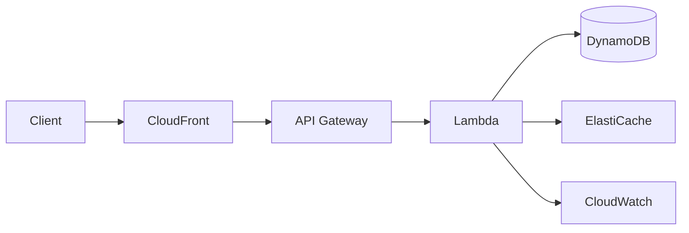
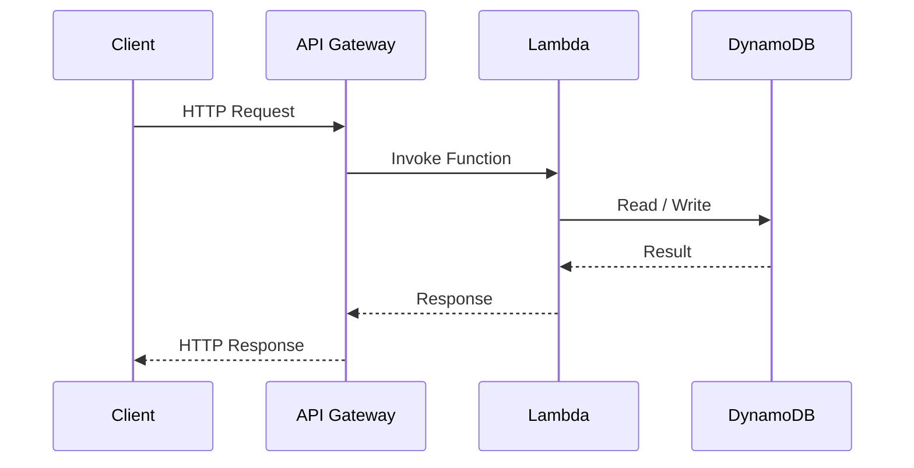
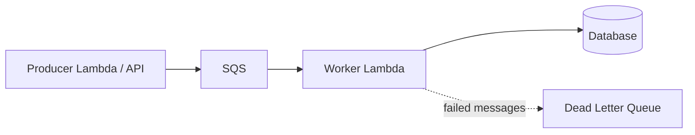
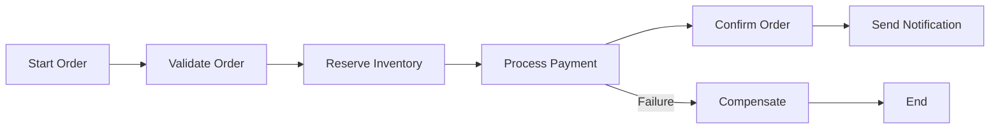
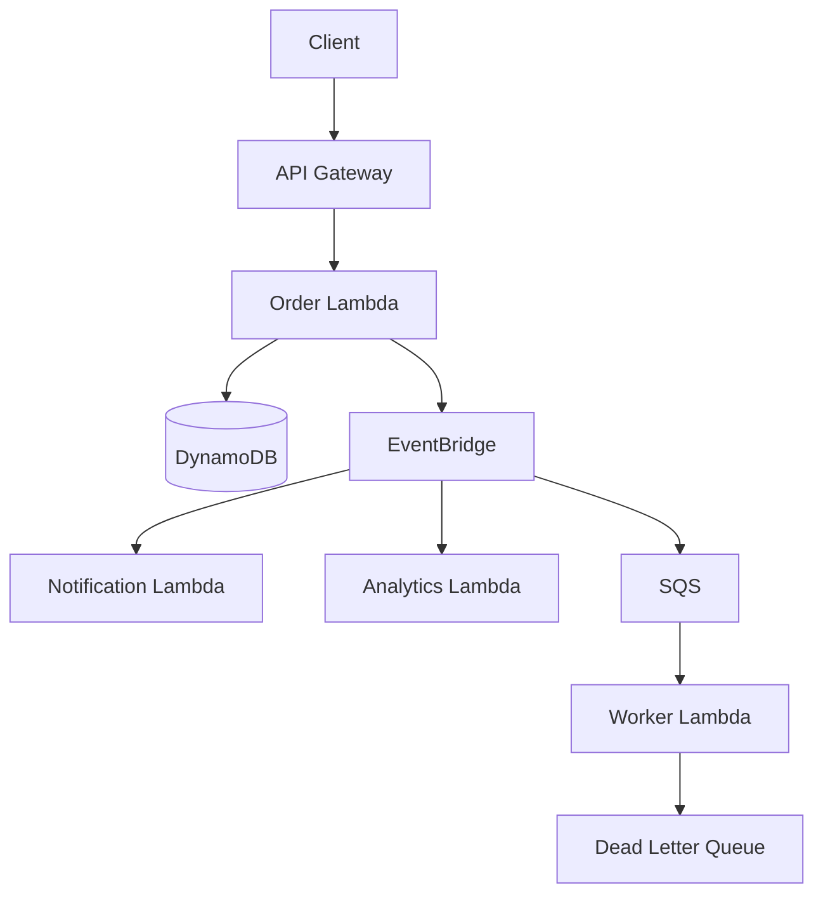
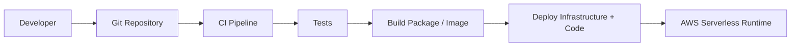
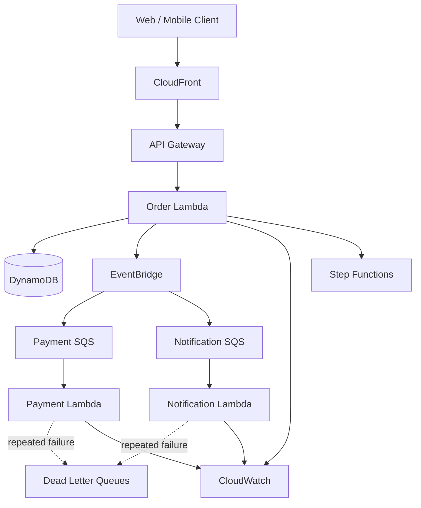

# 16- Serverless Architecture Patterns and Trade-offs

## Overview

Serverless architecture is an application architecture in which the cloud provider manages the underlying server infrastructure, while the engineering team focuses primarily on application code, events, APIs, and data.

In AWS, serverless does **not** mean that servers do not exist. Servers, operating systems, networking, and execution infrastructure still exist, but AWS manages their provisioning, patching, scaling, and much of the operational lifecycle.

Common AWS serverless building blocks include:

| Service | Primary Role |
|---|---|
| AWS Lambda | Event-driven compute |
| API Gateway | Managed HTTP/API entry point |
| DynamoDB | Serverless NoSQL database |
| S3 | Object storage and event source |
| SQS | Asynchronous queues |
| SNS | Pub/sub messaging |
| EventBridge | Event routing and integration |
| Step Functions | Workflow orchestration |
| EventBridge Scheduler | Scheduled event invocation |
| CloudWatch | Logs, metrics, alarms, observability |
| IAM | Identity and authorization |
| Secrets Manager | Secret storage |
| CloudFront | CDN and edge delivery |

A production serverless architecture usually combines several of these services rather than using Lambda in isolation.

The major architectural benefit is reduced infrastructure management and elastic scaling. The major trade-offs are execution constraints, distributed-system complexity, observability challenges, cold starts, vendor coupling, and potentially unpredictable costs.

---

## What Serverless Means

Serverless generally has four characteristics:

- Infrastructure provisioning is abstracted away.
- Capacity can scale automatically.
- Billing is closely tied to usage for many services.
- The application is composed around managed services and events.

A traditional deployment might look like:

```text
Client
  |
  v
Load Balancer
  |
  v
EC2 / Kubernetes
  |
  v
Application
  |
  v
Database
```

A serverless architecture might look like:

```text
Client
  |
  v
API Gateway
  |
  v
Lambda
  |
  v
DynamoDB
```

The application still executes on compute infrastructure, but infrastructure management is delegated to AWS.

---

## Why Serverless Exists

Serverless addresses several operational problems associated with traditional infrastructure.

With manually managed compute, engineering teams must consider:

- instance provisioning
- operating system patching
- capacity planning
- autoscaling configuration
- instance failures
- load balancing
- server utilization
- deployment infrastructure

Serverless moves much of this responsibility to the cloud provider.

The architectural trade is:

```text
Less infrastructure management
            +
Automatic elasticity
            +
Managed services
            -
Less runtime control
            -
Execution constraints
            -
Higher distributed-system complexity
            -
Greater cloud-provider coupling
```

---

## Serverless Is Not the Same as FaaS

Function as a Service (FaaS) is one component of serverless architecture.

AWS Lambda is FaaS.

Serverless architecture is broader:

```text
                 Serverless Architecture

      +-------------+-------------+-------------+
      |             |             |             |
      v             v             v             v
   Lambda       API Gateway      S3          DynamoDB
      |             |             |             |
      +-------------+-------------+-------------+
                    |
                    v
              EventBridge / SQS
                    |
                    v
              Step Functions
```

A serverless system can contain Lambda functions, managed databases, queues, object storage, API management, workflow engines, and event buses.

---

## Traditional Compute vs Serverless

| Characteristic | EC2 | ECS | EKS | Lambda |
|---|---|---|---|---|
| Server management | High | Low | Medium/High | Very low |
| Scaling | Configured by team | Managed/configured | Kubernetes-based | Automatic |
| Runtime control | High | High | High | Lower |
| Long-running process | Excellent | Excellent | Excellent | Not ideal |
| Startup behavior | Predictable | Predictable | Depends on workload | Cold starts possible |
| Operational complexity | Higher | Medium | High | Lower infrastructure overhead |
| Billing model | Instance/resource time | Resource usage | Resource usage | Invocation/compute usage |
| Best fit | Persistent workloads | Containers | Kubernetes platforms | Event-driven workloads |

There is no universally superior compute model.

---

## When Serverless Is a Good Fit

Serverless is particularly effective for:

- event-driven processing
- APIs with variable traffic
- asynchronous workloads
- scheduled jobs
- file processing
- lightweight integrations
- automation
- notification workflows
- data transformation
- bursty workloads
- workloads with long idle periods

Examples:

```text
S3 upload
   |
   v
Lambda
   |
   v
Image processing
```

```text
API Gateway
   |
   v
Lambda
   |
   v
DynamoDB
```

```text
SQS
 |
 v
Lambda
 |
 v
Background processing
```

---

## When Serverless May Be a Poor Fit

Serverless may be less suitable when applications require:

- continuously running processes
- extremely predictable low latency
- specialized operating-system control
- custom networking requirements
- long-running workloads
- persistent local state
- specialized hardware
- workloads where Lambda execution limits become restrictive

In those cases, ECS, EKS, EC2, or another compute model may be more appropriate.

---

## Core Serverless Architecture

A common API architecture is:



The exact components depend on the application.

For a simple CRUD API, CloudFront may not be necessary. ElastiCache may also be unnecessary if DynamoDB provides sufficient performance.

---

## Lambda

AWS Lambda executes application code in response to events.

A Lambda function can be invoked by:

- API Gateway
- S3
- SQS
- SNS
- EventBridge
- DynamoDB Streams
- Kinesis
- EventBridge Scheduler
- Step Functions
- direct SDK invocation

Conceptually:

```text
Event Source
     |
     v
Lambda Invocation
     |
     v
Execution Environment
     |
     v
Application Code
     |
     v
Response / Side Effect
```

Lambda is most useful when the execution model naturally maps to discrete units of work.

---

## Lambda Execution Lifecycle

A Lambda invocation can involve several stages:

```text
Request
  |
  v
Find / Create Execution Environment
  |
  +---- Existing environment
  |          |
  |          v
  |       Handler
  |
  +---- New environment
             |
             v
        Initialization
             |
             v
          Handler
             |
             v
          Response
```

A reused environment can reduce startup overhead.

A newly created environment may require initialization before the handler executes.

---

## Cold Starts

A cold start occurs when Lambda must initialize a new execution environment before processing the invocation.

Initialization can include:

- runtime startup
- dependency loading
- application initialization
- SDK initialization
- network setup
- framework startup

For a Python service, importing a large dependency tree can increase initialization time.

Poor:

```python
import_application_framework()
load_large_ml_library()
initialize_many_clients()
```

Better:

```python
import boto3

dynamodb = boto3.resource("dynamodb")
```

Keep initialization intentional and avoid unnecessary work during module import.

---

## Warm Invocations

A reused execution environment can process subsequent requests without repeating the complete initialization phase.

This means:

```text
First invocation
    |
    v
Initialization + Handler

Subsequent invocation
    |
    v
Handler
```

However, applications must never depend on a specific execution environment being reused.

Treat reuse as an optimization rather than a correctness guarantee.

---

## Lambda Handler Design

A Python Lambda handler commonly looks like:

```python
import json


def lambda_handler(event, context):
    return {
        "statusCode": 200,
        "headers": {
            "Content-Type": "application/json",
        },
        "body": json.dumps({
            "message": "request processed",
        }),
    }
```

Production handlers should also consider:

- structured logging
- input validation
- authorization
- idempotency
- timeout behavior
- exception handling
- downstream timeouts
- observability
- dependency management

---

## API Gateway + Lambda

A common serverless API architecture is:

```text
Client
  |
  v
API Gateway
  |
  v
Lambda
  |
  v
DynamoDB
```

The request lifecycle is:



API Gateway handles the HTTP-facing concerns while Lambda executes business logic.

---

## API Gateway Responsibilities

API Gateway can provide:

- routing
- authentication integration
- authorization integration
- throttling
- request validation
- API lifecycle management
- usage controls
- monitoring
- integration with Lambda and other backends

A useful architectural boundary is:

```text
Internet
   |
   v
API Gateway
   |
   v
Private Application Logic
```

Do not treat API Gateway as a replacement for all application-level authorization.

The Lambda application must still enforce business authorization where required.

---

## Lambda Event Sources

Lambda can be integrated with many AWS services.

| Event Source | Typical Workload |
|---|---|
| API Gateway | HTTP APIs |
| S3 | File/object processing |
| SQS | Background jobs |
| SNS | Notification fan-out |
| EventBridge | Event-driven integration |
| DynamoDB Streams | Data-change processing |
| Kinesis | Streaming workloads |
| Scheduler | Periodic jobs |
| Step Functions | Workflow steps |

The choice of event source strongly influences failure handling and delivery semantics.

---

## Synchronous Serverless APIs

For synchronous APIs:

```text
Client
  |
  v
API Gateway
  |
  v
Lambda
  |
  v
Database
```

The client waits for Lambda to finish.

This is appropriate when the operation must return a result immediately.

Examples:

```text
GET /customers/123
POST /orders
GET /products/456
```

Avoid turning every backend operation into a synchronous request.

---

## Asynchronous Serverless Architecture

For asynchronous processing:

```text
Client
  |
  v
API Gateway
  |
  v
Lambda
  |
  v
SQS
  |
  v
Worker Lambda
  |
  v
Database
```

The API can acknowledge the request before the expensive processing completes.

This improves resilience and absorbs traffic spikes.

---

## Queue-Based Lambda Processing

SQS and Lambda form a common serverless worker architecture.



This architecture provides natural buffering.

If incoming work increases:

```text
Traffic
  |
  v
SQS backlog increases
  |
  v
Lambda concurrency increases
  |
  v
Backlog decreases
```

Scaling policies must still respect downstream capacity.

---

## Queue Backpressure

Automatic Lambda scaling can become dangerous if the downstream database cannot scale at the same rate.

For example:

```text
SQS
 |
 +---> Lambda x 1000
 |
 v
PostgreSQL
```

The queue may protect the API from traffic spikes while simultaneously overwhelming PostgreSQL.

Therefore, production architectures should control concurrency.

Useful controls include:

- reserved concurrency
- event-source maximum concurrency
- database connection limits
- queue visibility timeout
- batch size
- batch window
- downstream rate limiting

---

## Lambda Concurrency

Concurrency represents how many Lambda execution environments are processing invocations simultaneously.

Conceptually:

```text
100 requests
     |
     v
100 concurrent executions
```

unless concurrency is constrained.

Concurrency must be designed around downstream capacity.

If a database supports a safe number of concurrent connections, Lambda concurrency should not be allowed to create an uncontrolled number of database connections.

---

## Reserved Concurrency

Reserved concurrency can be used to control a function's concurrency.

Conceptually:

```text
Incoming Work
     |
     v
Lambda
     |
     +-- maximum concurrent executions
```

This can provide:

- workload isolation
- protection for downstream dependencies
- predictable resource usage

It can also become a bottleneck if configured too aggressively.

---

## Provisioned Concurrency

Provisioned concurrency keeps execution environments initialized and ready to respond.

It can reduce cold-start impact for latency-sensitive workloads.

The trade-off is additional cost.

Use it selectively for:

- user-facing APIs
- latency-sensitive workloads
- predictable traffic
- functions where cold-start latency materially affects SLAs

Do not enable it indiscriminately for every Lambda function.

---

## Lambda and Databases

Traditional connection handling can become problematic in highly concurrent Lambda systems.

Consider:

```text
Lambda x 500
    |
    v
PostgreSQL
    |
    X
Connection exhaustion
```

A Lambda function should reuse connections when possible, but connection reuse is not guaranteed across execution environments.

For relational databases, consider:

- Amazon RDS Proxy
- connection pooling strategies
- reserved concurrency
- efficient query design
- short-lived transactions
- database capacity planning

Serverless compute does not remove database bottlenecks.

---

## DynamoDB as a Serverless Database

DynamoDB is frequently paired with Lambda because both support elastic, managed workloads.

Typical architecture:

```text
API Gateway
    |
    v
Lambda
    |
    v
DynamoDB
```

Advantages include:

- managed infrastructure
- high scalability
- predictable access patterns when properly modeled
- no traditional connection pool
- integration with Lambda
- DynamoDB Streams for change events

The major architectural requirement is correct data modeling.

DynamoDB design begins with access patterns rather than normalized relational schemas.

---

## Serverless Caching

Caching can still be valuable in serverless systems.

Possible architecture:

```text
Lambda
  |
  +----> Cache
  |
  +----> Database
```

However, adding Redis or ElastiCache introduces:

- network latency
- connection management
- subnet/VPC considerations
- additional operational cost
- another failure dependency

Do not introduce caching simply because the architecture is serverless.

Use it when measurements show that caching provides meaningful value.

---

## S3 Event-Driven Processing

S3 can act as an event source.

Example:

```text
User Upload
    |
    v
S3 Bucket
    |
    v
Object Created Event
    |
    v
Lambda
    |
    +----> Image Processing
    |
    +----> Metadata
    |
    +----> Database
```

This is useful for:

- image processing
- document processing
- file validation
- metadata extraction
- ETL triggers

Avoid placing expensive processing directly in a synchronous upload request when asynchronous processing is sufficient.

---

## EventBridge

EventBridge provides event routing between producers and consumers.

Example:

```text
Order Service
      |
      v
EventBridge
      |
      +----> Fraud Service
      |
      +----> Notification Service
      |
      +----> Analytics
```

This reduces direct coupling between producers and consumers.

The producer does not need to know every consumer.

---

## SNS Fan-Out

SNS is useful when one published message should reach multiple subscribers.

```text
Publisher
    |
    v
  SNS
 / | \
v  v  v
SQS SQS SQS
```

Each queue can then be processed independently.

For example:

```text
OrderCreated
     |
     v
    SNS
     |
     +----> Notification Queue
     |
     +----> Analytics Queue
     |
     +----> Fulfillment Queue
```

This provides independent consumer scaling and failure isolation.

---

## EventBridge vs SNS vs SQS

| Capability | SQS | SNS | EventBridge |
|---|---|---|---|
| Primary model | Queue | Pub/Sub | Event bus |
| Consumer model | Workers | Subscribers | Event targets |
| Message buffering | Yes | Limited | Event routing |
| Fan-out | Indirect | Strong | Strong |
| Filtering | Limited compared with event routing | Subscription filtering | Strong event-pattern filtering |
| Typical use | Work processing | Notifications/fan-out | Event-driven integration |
| Consumer pull model | Yes | No | No |

These services can also be combined.

---

## Step Functions

Step Functions are useful when a business workflow contains multiple steps.

Example:



Step Functions can provide:

- state management
- retries
- error handling
- branching
- parallel execution
- workflow visibility
- integration with AWS services

This is often preferable to implementing complex orchestration entirely inside one Lambda function.

---

## Lambda vs Step Functions

A Lambda function should generally perform a bounded unit of work.

Step Functions should coordinate multiple operations when the workflow itself has meaningful state.

Poor:

```text
One Lambda
 |
 +-- Validate
 +-- Reserve
 +-- Charge
 +-- Notify
 +-- Retry everything
 +-- Handle compensation
```

Better:

```text
Step Functions
 |
 +-- Lambda: Validate
 |
 +-- Lambda: Reserve
 |
 +-- Lambda: Payment
 |
 +-- Lambda: Notify
```

This separates orchestration from individual business operations.

---

## Event-Driven Serverless Architecture

A larger architecture might look like:



This architecture minimizes direct synchronous dependencies.

---

## Serverless and Eventual Consistency

Event-driven serverless systems frequently introduce eventual consistency.

Example:

```text
Order Created
     |
     v
Event Published
     |
     +----> Notification
     |
     +----> Analytics
```

The notification and analytics systems may process the event later.

Therefore, applications should explicitly model states such as:

```text
PENDING
PROCESSING
COMPLETED
FAILED
```

Do not assume every downstream side effect happens immediately.

---

## Idempotency

At-least-once delivery means duplicate processing can occur.

For example:

```text
OrderCreated
    |
    v
Lambda
    |
    X
Temporary failure
    |
    v
Retry
    |
    v
Same OrderCreated
```

The consumer must safely handle the event again.

Possible approaches include:

- idempotency keys
- unique database constraints
- processed-event tables
- conditional writes
- deterministic state transitions

Example:

```python
def process_event(event_id: str) -> None:
    if event_already_processed(event_id):
        return

    process_business_operation(event_id)
    record_event_as_processed(event_id)
```

The recording mechanism itself must be atomic enough to prevent concurrent duplicate processing.

---

## Dead Letter Queues

Failed asynchronous processing should not retry forever.

A common architecture is:

```text
SQS
 |
 v
Lambda
 |
 +---- success
 |
 +---- repeated failure
          |
          v
         DLQ
```

A DLQ provides operational isolation for messages that repeatedly fail.

Operations teams can inspect:

- message payload
- error context
- retry count
- timestamps
- affected entity

The DLQ should have an operational recovery process rather than becoming a permanent message graveyard.

---

## Error Handling

Serverless applications should distinguish:

### Expected business errors

```text
Invalid request
Unauthorized
Insufficient balance
Missing resource
```

### Transient infrastructure errors

```text
Timeout
Temporary service unavailable
Throttling
Network failure
```

### Permanent processing errors

```text
Malformed event
Invalid schema
Unsupported operation
```

Retry policies should primarily target transient failures.

---

## Retries and Retry Storms

Retries can amplify outages.

Consider:

```text
Dependency fails
     |
     v
1000 Lambda invocations retry
     |
     v
Dependency receives another 1000 requests
     |
     v
Failure becomes worse
```

Use:

- exponential backoff
- jitter
- bounded retries
- DLQs
- concurrency controls
- circuit-breaking behavior where appropriate

Serverless scaling can make retry storms particularly severe because compute can scale rapidly.

---

## Timeouts

Every Lambda function should have a deliberately chosen timeout.

The timeout should reflect:

- expected execution duration
- downstream timeout
- retry strategy
- business SLA

Avoid blindly setting extremely long timeouts.

For synchronous workflows, the combined timeout chain must also fit within the client's expected response window.

---

## Security Architecture

A production serverless system should use least privilege.

Example:

```text
Order Lambda Role
    |
    +--> Read/Write Order Table
    +--> Publish Order Event
    +--> Read Required Secret
```

It should not have unrestricted permissions such as:

```text
Action: "*"
Resource: "*"
```

Use IAM policies with the narrowest practical permissions.

---

## Secrets Management

Do not hardcode credentials:

```python
DATABASE_PASSWORD = "production-password"
```

Use managed secret storage.

For example:

```text
Lambda
  |
  v
IAM Role
  |
  v
Secrets Manager
```

The Lambda execution role should have only the required secret access.

---

## VPC Considerations

Lambda does not automatically need to run inside a VPC.

Do not place every Lambda function into a VPC by default.

A VPC may be required when Lambda needs private access to resources such as:

- private RDS databases
- private internal services
- private caches

Public AWS services can often be accessed without putting Lambda into a VPC.

When VPC connectivity is required, consider:

- private subnets
- security groups
- subnet sizing
- NAT Gateway requirements
- VPC endpoints
- DNS configuration

---

## NAT Gateway Considerations

A Lambda function in a private subnet that needs internet access may require NAT connectivity.

Architecture:

```text
Lambda
  |
  v
Private Subnet
  |
  v
NAT Gateway
  |
  v
Internet
```

NAT Gateways can become a significant cost component at scale.

Where possible, use VPC endpoints for AWS services that support them and avoid unnecessary internet traversal.

---

## Observability

Serverless applications require strong observability because there are fewer traditional servers to inspect.

Monitor:

- invocation count
- errors
- duration
- throttles
- concurrency
- cold-start impact
- queue depth
- DLQ messages
- downstream latency
- database errors
- event failures

CloudWatch is the primary AWS-native observability layer.

---

## Structured Logging

Prefer structured logs.

Example:

```python
import json
import logging

logger = logging.getLogger()
logger.setLevel(logging.INFO)


def lambda_handler(event, context):
    logger.info(
        json.dumps({
            "event": "order_processed",
            "request_id": context.aws_request_id,
            "order_id": event.get("order_id"),
        })
    )

    return {"status": "ok"}
```

Structured logs are easier to search and aggregate than arbitrary text.

Avoid logging:

- passwords
- access tokens
- secret values
- payment credentials
- unnecessary personal data

---

## Distributed Tracing

A serverless request may traverse:

```text
API Gateway
   |
   v
Lambda
   |
   v
DynamoDB
   |
   v
EventBridge
   |
   v
Lambda
   |
   v
SQS
   |
   v
Lambda
```

Without tracing and correlation information, debugging becomes difficult.

Use request IDs and distributed tracing where supported and appropriate.

---

## Performance Optimization

Serverless performance depends on more than Lambda execution time.

Consider:

```text
API Gateway
    +
Lambda startup
    +
Lambda execution
    +
Network latency
    +
Database latency
    +
Serialization
```

Optimization areas include:

- reducing package size
- minimizing initialization work
- reusing clients
- reducing unnecessary network calls
- optimizing database access
- selecting appropriate memory allocation
- controlling concurrency
- using provisioned concurrency where justified

---

## Lambda Memory and CPU

Lambda resource allocation affects both memory and available CPU.

Increasing memory can sometimes reduce execution duration substantially.

For example:

```text
512 MB  -> 900 ms
1024 MB -> 450 ms
2048 MB -> 220 ms
```

The exact behavior depends on the workload.

Do not optimize solely for memory cost or execution duration.

Measure:

```text
Cost per invocation
+
Latency
+
Throughput
```

and choose the appropriate configuration.

---

## Cold Start Optimization

Common techniques include:

- minimizing deployment package size
- reducing dependency count
- avoiding unnecessary imports
- keeping initialization lightweight
- using appropriate runtimes
- using provisioned concurrency when justified

Do not prematurely optimize cold starts without measuring their effect on user-facing latency.

---

## Serverless Scalability

One of the major advantages of serverless is elastic scaling.

Conceptually:

```text
Low Traffic
   |
   v
Few Executions

High Traffic
   |
   v
Many Executions
```

However, downstream systems may not scale equally.

For example:

```text
Lambda
10 -> 10,000 concurrent executions
            |
            v
      PostgreSQL
      100 connections
```

The bottleneck has simply moved.

Senior-level serverless architecture means scaling the **whole dependency chain**, not just Lambda.

---

## Throttling

Throttling protects services from excessive load.

Possible limits exist across:

- Lambda concurrency
- API Gateway
- DynamoDB
- SQS
- downstream APIs

Applications should handle throttling gracefully.

Typical strategies include:

- exponential backoff
- jitter
- queueing
- rate limiting
- controlled concurrency

---

## Cost Model

Serverless often changes cost from provisioned capacity to usage-based consumption.

Traditional model:

```text
Pay for provisioned instance capacity
```

Serverless model:

```text
Pay primarily according to requests,
execution/resource usage, and managed-service consumption
```

This can be highly cost-efficient for variable workloads.

However, high and sustained traffic can make containerized or reserved infrastructure more economically attractive.

Always model actual workload economics.

---

## Cost Example

Suppose a Lambda function executes frequently and performs expensive downstream operations.

The Lambda execution cost may be small compared with:

```text
API Gateway
+
NAT Gateway
+
DynamoDB
+
CloudWatch Logs
+
Data Transfer
+
Other Managed Services
```

Therefore, serverless cost optimization must evaluate the complete architecture.

---

## Cost Optimization Practices

Useful practices include:

- remove unnecessary Lambda invocations
- batch events where appropriate
- control log volume
- set CloudWatch retention intentionally
- avoid unnecessary NAT traffic
- use VPC endpoints where economically justified
- optimize Lambda memory/runtime configuration
- reduce unnecessary API Gateway requests
- select appropriate DynamoDB capacity modes
- monitor cost by workload

Do not optimize only the Lambda bill.

---

## High Availability

Serverless managed services can reduce infrastructure-level availability concerns, but application-level dependencies still matter.

A production architecture should consider:

```text
API
 |
 v
Lambda
 |
 +----> Database
 |
 +----> Queue
 |
 +----> External API
```

The external API can still become the system's availability bottleneck.

Use:

- retries
- timeouts
- queues
- fallbacks
- multi-AZ managed services
- regional recovery strategies where required

---

## Disaster Recovery

Serverless does not automatically mean multi-Region disaster recovery.

A DR architecture may require:

```text
Region A
 |
 +-- API Gateway
 +-- Lambda
 +-- DynamoDB
 +-- EventBridge
 |
 | Failover
 v
Region B
 |
 +-- API Gateway
 +-- Lambda
 +-- DynamoDB
 +-- EventBridge
```

The correct design depends on:

- RTO
- RPO
- data replication requirements
- operational complexity
- business criticality
- cost

For lower criticality workloads, backup-and-restore may be sufficient.

---

## Serverless Monolith vs Serverless Microservices

Serverless does not require microservices.

A single application can use multiple Lambda functions while maintaining a relatively cohesive architecture.

For example:

```text
API Gateway
 |
 +-- Lambda: Orders
 +-- Lambda: Customers
 +-- Lambda: Payments
```

This does not automatically mean those functions should become independently owned microservices.

Serverless and microservices are separate architectural decisions.

---

## Serverless and Django

Django is designed around a long-running application process and a traditional request/response lifecycle.

It can be adapted to serverless environments, but doing so may introduce:

- startup overhead
- framework initialization costs
- database connection challenges
- deployment complexity
- runtime constraints

For new serverless APIs, FastAPI or direct Lambda handlers may sometimes be a better fit.

That does not mean Django is incompatible with serverless; it means the architectural trade-offs should be evaluated against the application's requirements.

---

## Serverless and FastAPI

FastAPI can be deployed behind an API Gateway/Lambda integration or through other AWS compute models.

Conceptually:

```text
Client
  |
  v
API Gateway
  |
  v
Lambda
  |
  v
FastAPI Application
```

For a small API with variable traffic, this can be effective.

For high-throughput, continuously busy APIs, ECS or EKS may provide a more predictable execution model.

---

## Serverless and Celery

Traditional Celery workers typically run as persistent processes.

A serverless architecture can replace some Celery workloads with:

```text
SQS
 |
 v
Lambda
```

or:

```text
EventBridge
 |
 v
Lambda
```

However, Lambda is not a universal replacement for Celery.

Persistent workers may remain more appropriate for:

- long-running tasks
- complex worker processes
- specialized concurrency models
- workloads requiring persistent processes

The workload should determine the architecture.

---

## Serverless and Kafka

Kafka and serverless functions can work together.

For example:

```text
Kafka
  |
  v
Lambda
  |
  v
Business Processing
```

However, Kafka introduces its own operational and scaling model.

For straightforward asynchronous workloads, SQS may be significantly simpler.

Use Kafka when requirements such as:

- high-throughput streaming
- ordered partitions
- replayable event logs
- consumer groups
- stream processing

justify its complexity.

---

## Deployment Architecture

A typical serverless CI/CD pipeline is:



Infrastructure should be defined as code using tools such as:

- AWS CDK
- CloudFormation
- Terraform

Avoid manually configuring production resources through the console.

---

## Infrastructure as Code

A serverless stack should be reproducible.

A conceptual CloudFormation structure might define:

```yaml
Resources:
  OrdersFunction:
    Type: AWS::Lambda::Function
    Properties:
      Runtime: python3.12
      Handler: app.lambda_handler
      Role: !GetAtt OrdersRole.Arn
```

Production infrastructure definitions should also cover:

- IAM
- API routes
- environment configuration
- alarms
- queues
- DLQs
- permissions
- encryption
- deployment configuration

---

## Environment Separation

Use separate environments:

```text
Development
    |
    v
Staging
    |
    v
Production
```

Avoid sharing production databases or secrets with development.

Environment-specific resources should be isolated where practical.

---

## Deployment Safety

Serverless deployments should support:

- versioning
- aliases
- gradual traffic shifting
- rollback
- automated tests
- health validation

A deployment failure should not require manually rebuilding infrastructure.

---

## Common Mistakes

### Treating Serverless as Free

Usage-based pricing does not mean zero cost.

API Gateway, CloudWatch, NAT, DynamoDB, data transfer, and other services can generate significant charges.

### Putting Every Lambda in a VPC

VPC integration should be driven by actual network requirements.

Unnecessary VPC configuration can add complexity and networking dependencies.

### Opening Database Access to the Internet

A serverless application does not justify public database exposure.

Use private networking and controlled access.

### Creating Unlimited Lambda Concurrency

Lambda can scale faster than downstream databases.

Always consider dependency capacity.

### Ignoring Idempotency

Retries and duplicate events are normal.

Important operations should be designed for safe repeated execution.

### Using Lambda for Long-Running Work

Long-running workloads may be better suited to ECS, EKS, Batch, or other compute models.

### Putting the Entire Workflow in One Lambda

Large Lambda functions can become difficult to test, retry, observe, and recover.

Use queues and Step Functions when workflow complexity warrants them.

### Ignoring Cold Starts

Cold starts may matter for latency-sensitive APIs.

Measure first, then consider optimization or provisioned concurrency.

### Logging Everything

Excessive logging increases cost and can expose sensitive information.

Use structured, useful logs.

### Assuming Automatic Scaling Means Unlimited Scaling

Scaling is constrained by service quotas, concurrency limits, downstream capacity, and architecture.

### Using DynamoDB Like PostgreSQL

DynamoDB requires access-pattern-driven modeling.

Do not blindly reproduce normalized relational schemas.

---

## Production Pitfalls

| Pitfall | Result | Mitigation |
|---|---|---|
| Unbounded concurrency | Database overload | Concurrency controls |
| Missing timeout | Resource exhaustion | Explicit timeouts |
| Aggressive retries | Retry storm | Backoff + jitter |
| No idempotency | Duplicate side effects | Idempotency keys/state |
| Large dependencies | Cold-start latency | Minimize package |
| Excessive logs | High cost | Structured logging |
| Public database | Security exposure | Private networking |
| No DLQ | Lost operational visibility | DLQ + replay process |
| One huge Lambda | Difficult maintenance | Decompose workflow |
| No IaC | Configuration drift | CDK/CloudFormation/Terraform |
| No alarms | Slow incident detection | Operational monitoring |
| Uncontrolled downstream calls | Cascading failures | Timeouts/concurrency limits |

---

## Interview Traps

### Does Serverless Mean There Are No Servers?

No. Servers still exist; AWS manages the underlying infrastructure.

### Is Lambda the Same as Serverless?

No. Lambda is a FaaS compute service. Serverless architecture also includes managed databases, messaging, storage, APIs, workflows, and other services.

### Does Lambda Scale Infinitely?

No. Lambda has concurrency and service quotas, and downstream dependencies impose additional limits.

### Does Serverless Eliminate Operations?

No.

The operational focus shifts from:

```text
Server provisioning
```

toward:

```text
Events
+
IAM
+
Quotas
+
Observability
+
Distributed failures
+
Data consistency
+
Cost
```

### Should Every API Be Built with Lambda?

No.

Lambda is a strong fit for many workloads, but ECS, EKS, or EC2 may be more appropriate for persistent, highly predictable, or specialized workloads.

### Is DynamoDB Required for Serverless?

No.

Serverless applications can use DynamoDB, Aurora, RDS, S3, and other storage systems depending on workload requirements.

### Is Serverless Always Cheaper?

No.

Serverless is often economically attractive for variable or low-utilization workloads, but sustained high-volume workloads can favor provisioned compute.

### Does Serverless Automatically Provide High Availability?

Managed services can reduce infrastructure-level failure concerns, but the overall architecture can still contain single points of failure such as external dependencies, poor data design, or incorrectly configured regional dependencies.

---

## Serverless Architecture Decision Framework

Evaluate serverless using these dimensions:

| Question | Serverless Advantage | Potential Concern |
|---|---|---|
| Traffic variability | Strong | — |
| Idle periods | Strong | — |
| Infrastructure management | Strong | — |
| Long-running execution | — | Lambda limits |
| Low predictable latency | Possible | Cold starts |
| Database-heavy workload | Possible | Connection/capacity limits |
| Event-driven workload | Strong | Distributed complexity |
| High sustained throughput | Possible | Cost model |
| Custom runtime control | Limited | Containers may be better |
| Operational simplicity | Strong infrastructure abstraction | More managed-service dependencies |
| Cloud portability | Lower | Provider-specific architecture |
| Rapid development | Strong | Service sprawl risk |

A useful decision process is:

```text
Workload
   |
   v
Is it event-driven or bursty?
   |
   +-- Yes --> Evaluate Serverless
   |
   +-- No
        |
        v
Does it require persistent/custom compute?
        |
        +-- Yes --> Evaluate ECS/EKS/EC2
        |
        +-- No --> Compare economics and operational needs
```

---

## Practical Production Architecture

A realistic serverless order-processing system might look like:



Characteristics of this architecture include:

- synchronous API handling for request acceptance
- DynamoDB for order state
- EventBridge for event distribution
- SQS for workload buffering
- Lambda for independent processing
- DLQs for repeated failures
- Step Functions where workflow orchestration requires explicit state
- CloudWatch for operational visibility

The architecture intentionally separates request handling from asynchronous side effects.

---

## Production Design Principles

### Keep Functions Focused

A Lambda function should ideally represent a bounded unit of work.

### Design for Duplicate Delivery

Assume events can be delivered more than once.

### Control Concurrency

Protect databases and external dependencies from uncontrolled scaling.

### Prefer Asynchronous Processing for Slow Work

Use SQS, EventBridge, or Step Functions when immediate completion is unnecessary.

### Keep State in Durable Systems

Do not depend on Lambda's local filesystem or execution environment for persistent state.

### Make Infrastructure Reproducible

Use infrastructure as code.

### Monitor the Entire Dependency Graph

Lambda metrics alone are insufficient.

### Design for Failure

Timeouts, retries, DLQs, idempotency, and compensation are architectural features, not optional implementation details.

---

## Key Takeaways

- Serverless is an infrastructure operating model and architectural style, not simply the use of AWS Lambda; it combines managed compute, APIs, storage, messaging, databases, and workflow services.
- Lambda provides strong elasticity for event-driven and variable workloads, but concurrency, cold starts, execution constraints, quotas, and downstream capacity must be designed explicitly.
- Production serverless systems depend heavily on asynchronous patterns, idempotency, bounded retries, DLQs, concurrency controls, and observability to handle distributed failures safely.
- Serverless can reduce infrastructure operations and improve elasticity, but it can increase vendor coupling, distributed-system complexity, and usage-based cost unpredictability.
- The correct architecture depends on workload characteristics; ECS, EKS, EC2, and serverless services should be evaluated based on latency, execution model, scalability, control, reliability, and total cost.