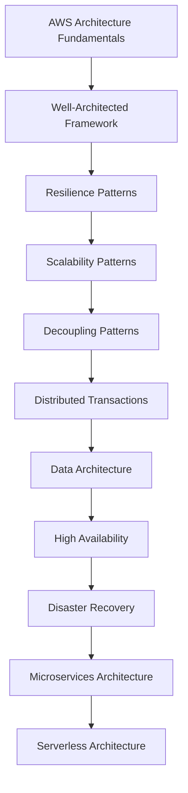

# README

## Overview

This section covers the core architectural patterns required to design resilient, scalable, highly available, and production-ready systems on AWS.

The focus is not on individual AWS services in isolation. Instead, these documents explain how backend engineers combine compute, networking, storage, databases, messaging, workflows, and distributed-system patterns to build systems that remain reliable under failures and traffic growth.

The material progresses from foundational AWS architecture principles to advanced distributed-system and serverless architecture patterns.

---

## AWS Architecture

The section covers the following architectural areas:

| File | Topic | Primary Focus |
|---|---|---|
| [01- Introduction](./01-%20Introduction.md) | AWS Architecture Fundamentals | Core AWS architecture concepts, building blocks, and architectural thinking |
| [02- The AWS Well-Architected Framework](./02-%20The%20AWS%20Well-Architected%20Framework.md) | Well-Architected Framework | Operational excellence, security, reliability, performance, cost, and sustainability |
| [03- Resilience Patterns - Retries, Backoff and Jitter](./03-%20Resilience%20Patterns%20-%20Retries%2C%20Backoff%20and%20Jitter.md) | Retry Patterns | Transient failures, exponential backoff, jitter, and retry storms |
| [04- Resilience Patterns - Circuit Breaker and Bulkhead](./04-%20Resilience%20Patterns%20-%20Circuit%20Breaker%20and%20Bulkhead.md) | Failure Isolation | Circuit breakers, bulkheads, cascading failures, and dependency isolation |
| [05- Resilience Patterns - Dead Letter Queues and Failure Isolation](./05-%20Resilience%20Patterns%20-%20Dead%20Letter%20Queues%20and%20Failure%20Isolation.md) | Failure Handling | DLQs, poison messages, asynchronous failure isolation, and recovery |
| [06- Scalability Patterns - Horizontal Scaling and Auto Scaling](./06-%20Scalability%20Patterns%20-%20Horizontal%20Scaling%20and%20Auto%20Scaling.md) | Compute Scaling | Horizontal scaling, elasticity, autoscaling, and capacity management |
| [07- Scalability Patterns - Caching Strategies](./07-%20Scalability%20Patterns%20-%20Caching%20Strategies.md) | Caching | Cache-aside, TTLs, invalidation, Redis, and distributed caching |
| [08- Scalability Patterns - Database Scaling](./08-%20Scalability%20Patterns%20-%20Database%20Scaling.md) | Database Scaling | Read replicas, partitioning, sharding, connection management, and database bottlenecks |
| [09- Decoupling Patterns - Event-Driven Architecture and Queue-Based Load Leveling](./09-%20Decoupling%20Patterns%20-%20Event-Driven%20Architecture%20and%20Queue-Based%20Load%20Leveling.md) | Decoupling | Events, queues, asynchronous processing, buffering, and load leveling |
| [10- Decoupling Patterns - Pub-Sub and Fan-Out](./10-%20Decoupling%20Patterns%20-%20Pub-Sub%20and%20Fan-Out.md) | Pub/Sub | SNS, EventBridge, fan-out, independent consumers, and event distribution |
| [11- Distributed Transactions - The Saga Pattern](./11-%20Distributed%20Transactions%20-%20The%20Saga%20Pattern.md) | Distributed Transactions | Saga orchestration, choreography, compensation, and eventual consistency |
| [12- Data Architecture Patterns - CQRS and Event Sourcing](./12-%20Data%20Architecture%20Patterns%20-%20CQRS%20and%20Event%20Sourcing.md) | Data Architecture | CQRS, event sourcing, projections, command/query separation, and event logs |
| [13- High Availability - Multi-AZ vs Multi-Region](./13-%20High%20Availability%20-%20Multi-AZ%20vs%20Multi-Region.md) | High Availability | Multi-AZ architecture, Multi-Region architecture, failover, RTO, and RPO |
| [14- Disaster Recovery Strategies](./14-%20Disaster%20Recovery%20Strategies.md) | Disaster Recovery | Backup and restore, pilot light, warm standby, active-active, RTO, and RPO |
| [15- Microservices Architecture on AWS](./15-%20Microservices%20Architecture%20on%20AWS.md) | Microservices | Service boundaries, communication, discovery, deployment, observability, and AWS infrastructure |
| [16- Serverless Architecture Patterns and Trade-offs](./16-%20Serverless%20Architecture%20Patterns%20and%20Trade-offs.md) | Serverless | Lambda, API Gateway, event-driven systems, serverless scaling, and architectural trade-offs |

---

## Architecture Progression

The material follows a deliberate progression:



The progression moves from **architectural principles** toward **distributed-system design and production architecture**.

---

## Core Architecture Themes

### Resilience

Resilience focuses on keeping systems operational despite partial failures.

Key patterns covered include:

- retries
- exponential backoff
- jitter
- circuit breakers
- bulkheads
- dead letter queues
- failure isolation
- timeout management
- graceful degradation

The objective is not to prevent every failure. The objective is to prevent a localized failure from becoming a system-wide outage.

---

### Scalability

Scalability focuses on handling increasing workload without proportional degradation in system performance.

Major concepts include:

- horizontal scaling
- autoscaling
- caching
- database scaling
- read replicas
- partitioning
- sharding
- connection management
- queue-based load leveling

A critical principle is:

> Scaling the application layer does not automatically scale its dependencies.

For example:

```text
100 Lambda instances
       |
       v
PostgreSQL
       |
       X
Connection exhaustion
```

Architecture must account for the entire dependency chain.

---

### Decoupling

Decoupling reduces direct dependencies between system components.

Common mechanisms include:

- SQS
- SNS
- EventBridge
- Kafka
- asynchronous processing
- event-driven architecture
- pub-sub
- fan-out

Instead of:

```text
Service A
   |
   v
Service B
   |
   v
Service C
```

a decoupled system may use:

```text
             Event Bus
                |
       +--------+--------+
       |        |        |
       v        v        v
   Service A Service B Service C
```

This improves independent scaling and failure isolation but introduces eventual consistency and operational complexity.

---

### Distributed Transactions

Once a system is decomposed into multiple services, traditional database transactions cannot always span the complete business operation.

The Saga Pattern provides a way to coordinate distributed business transactions using:

- local transactions
- events
- orchestration
- choreography
- compensating actions
- eventual consistency

The key architectural shift is:

```text
Atomic database transaction
            |
            v
Distributed business transaction
            |
            v
State + events + compensation
```

---

### Data Architecture

CQRS and Event Sourcing address systems where the standard CRUD model becomes insufficient.

Key concepts include:

- command models
- query models
- projections
- event streams
- immutable events
- rebuilding state
- eventual consistency

These patterns provide powerful capabilities but introduce significant complexity.

They should be adopted because the workload requires them, not simply because they are architecturally interesting.

---

### High Availability

High availability focuses on reducing service interruption.

The section distinguishes between:

```text
Multi-AZ
    |
    v
Protect against localized infrastructure failures
```

and:

```text
Multi-Region
    |
    v
Protect against regional failures
```

The correct architecture depends on business requirements, particularly:

- RTO
- RPO
- availability objectives
- geographic requirements
- operational complexity
- cost

---

### Disaster Recovery

Disaster recovery focuses on restoring service after a significant failure.

Common strategies include:

| Strategy | Recovery Speed | Cost | Complexity |
|---|---|---|---|
| Backup and Restore | Low | Low | Low |
| Pilot Light | Medium | Medium | Medium |
| Warm Standby | High | Higher | Higher |
| Active-Active | Very High | High | High |

The appropriate strategy should be selected based on business impact rather than technical preference.

---

### Microservices

Microservices architecture applies service decomposition to large backend systems.

Important considerations include:

- service boundaries
- ownership
- API contracts
- REST
- gRPC
- asynchronous messaging
- service discovery
- authentication
- authorization
- observability
- deployment independence
- data ownership

A microservices architecture introduces distributed-system problems that do not exist in a monolith.

Therefore:

```text
More services
    !=
Automatically better architecture
```

---

### Serverless

Serverless architecture moves infrastructure management toward AWS-managed services.

Typical components include:

```text
API Gateway
     |
     v
Lambda
     |
     +----> DynamoDB
     |
     +----> SQS
     |
     +----> EventBridge
     |
     +----> Step Functions
```

Serverless is particularly useful for:

- event-driven workloads
- bursty traffic
- asynchronous processing
- APIs with variable traffic
- scheduled jobs
- file processing
- automation

It introduces trade-offs around:

- cold starts
- concurrency
- execution limits
- observability
- distributed failures
- vendor coupling
- cost predictability

---

## Cross-Cutting AWS Architecture Principles

The documents repeatedly apply several principles.

### Design for Failure

Assume that:

- instances fail
- containers fail
- Lambda executions fail
- networks fail
- dependencies timeout
- messages are duplicated
- deployments fail
- regions can become unavailable

Reliable systems assume failure rather than treating it as an exceptional theoretical scenario.

---

### Control Failure Propagation

A failure should remain contained whenever possible.

Useful mechanisms include:

```text
Timeouts
   +
Retries
   +
Backoff
   +
Circuit Breakers
   +
Bulkheads
   +
Queues
   +
DLQs
```

These patterns work together to prevent cascading failures.

---

### Prefer Asynchronous Processing Where Appropriate

Synchronous communication is useful when an immediate response is required.

Asynchronous processing is often preferable for:

- notifications
- analytics
- background processing
- file processing
- long-running workflows
- independent side effects

A queue can absorb traffic spikes:

```text
Producer
   |
   v
Queue
   |
   v
Consumers
```

---

### Protect Dependencies

A service is only as resilient as its critical dependencies.

Consider:

```text
API
 |
 +--> Redis
 |
 +--> PostgreSQL
 |
 +--> Payment API
 |
 +--> Kafka
```

Each dependency introduces:

- latency
- failure modes
- capacity constraints
- operational requirements

Dependency protection is therefore a core architecture concern.

---

### Measure Before Optimizing

Architecture decisions should be driven by:

- traffic
- latency
- throughput
- error rate
- database utilization
- cache hit rate
- queue depth
- concurrency
- cost
- availability requirements

Avoid introducing distributed patterns without a concrete engineering reason.

---

## Technology Mapping

The patterns in this section map naturally to technologies commonly used in backend systems.

| Architecture Concern | AWS / Backend Technologies |
|---|---|
| HTTP entry point | API Gateway, Nginx, ALB |
| Compute | Lambda, EC2, ECS, EKS |
| Containers | Docker, ECS, EKS |
| Caching | Redis, ElastiCache |
| Relational data | RDS, Aurora, PostgreSQL |
| NoSQL | DynamoDB |
| Object storage | S3 |
| Queuing | SQS, Celery |
| Pub/Sub | SNS, EventBridge, Kafka |
| Streaming | Kinesis, Kafka |
| Workflow orchestration | Step Functions, Airflow |
| Service communication | REST, gRPC |
| Observability | CloudWatch, tracing, structured logs |
| CI/CD | GitHub Actions, AWS deployment tooling |
| Identity | IAM |
| Secrets | Secrets Manager |
| Networking | VPC, subnets, security groups |
| CDN / Edge | CloudFront |

---

## Recommended Reading Order

For a systematic study path, follow the files in numerical order.

```text
01
 |
 v
AWS Architecture Fundamentals
 |
 v
02
Well-Architected Framework
 |
 v
03-05
Resilience
 |
 v
06-08
Scalability
 |
 v
09-10
Decoupling
 |
 v
11
Distributed Transactions
 |
 v
12
Data Architecture
 |
 v
13-14
Availability + Disaster Recovery
 |
 v
15
Microservices
 |
 v
16
Serverless
```

This order builds architectural reasoning progressively rather than treating each pattern as an isolated technique.

---

## Architecture Decision Checklist

When designing an AWS backend system, evaluate:

| Area | Questions |
|---|---|
| Requirements | What are the functional and non-functional requirements? |
| Traffic | What are average, peak, and burst traffic levels? |
| Latency | What are the latency requirements and SLAs? |
| Availability | What availability target is required? |
| Failure | What happens when each dependency fails? |
| Scaling | Which component becomes the bottleneck first? |
| Data | Who owns each piece of data? |
| Consistency | Is strong consistency required everywhere? |
| Communication | Should communication be synchronous or asynchronous? |
| Security | What identities and permissions are required? |
| Observability | How will failures be detected and debugged? |
| Recovery | What are the RTO and RPO requirements? |
| Cost | What is the expected cost at normal and peak load? |
| Operations | How will the system be deployed, monitored, and recovered? |

---

## Common Architecture Mistakes

### Choosing Services Before Understanding Requirements

Starting with:

```text
"We should use Lambda + DynamoDB + EventBridge."
```

is weaker than starting with:

```text
"What are the workload, consistency, latency,
availability, scaling, and operational requirements?"
```

Services should implement architectural requirements rather than define them.

### Overengineering

Not every application needs:

- microservices
- Kafka
- event sourcing
- CQRS
- multi-Region deployment
- Kubernetes
- complex event orchestration

Complexity should be justified by requirements.

### Ignoring Operational Complexity

A design can be technically scalable while being difficult to operate.

Always consider:

- debugging
- deployment
- monitoring
- incident response
- recovery
- cost
- team expertise

### Treating Distributed Systems Like Local Code

Network calls can:

- timeout
- fail
- duplicate
- reorder
- become slow
- partially succeed

Distributed-system boundaries must therefore be treated as failure boundaries.

---

## Architecture Mental Model

A useful senior-level mental model is:

```text
Requirements
     |
     v
Constraints
     |
     v
Architecture
     |
     +------------------+
     |                  |
     v                  v
Data                 Compute
     |                  |
     v                  v
Communication       Scaling
     |                  |
     +--------+---------+
              |
              v
          Resilience
              |
              v
       High Availability
              |
              v
       Disaster Recovery
              |
              v
         Observability
              |
              v
             Cost
```

A strong AWS architecture balances these dimensions rather than optimizing one dimension independently.

---

## Key Takeaways

- AWS architecture is primarily about engineering trade-offs across reliability, scalability, security, performance, cost, and operational complexity—not simply selecting AWS services.
- Resilience, scalability, decoupling, distributed transactions, high availability, and disaster recovery are interconnected architectural concerns that must be designed as a system.
- Managed AWS services reduce infrastructure management but do not eliminate distributed-system problems such as retries, duplicate events, eventual consistency, dependency failures, and capacity bottlenecks.
- The right architecture depends on workload characteristics and business requirements; avoid introducing microservices, serverless, event sourcing, Kafka, or Multi-Region infrastructure without a concrete engineering justification.
- A production-ready AWS architecture must account for the complete lifecycle: design, deployment, scaling, observability, failure handling, security, cost management, and recovery.