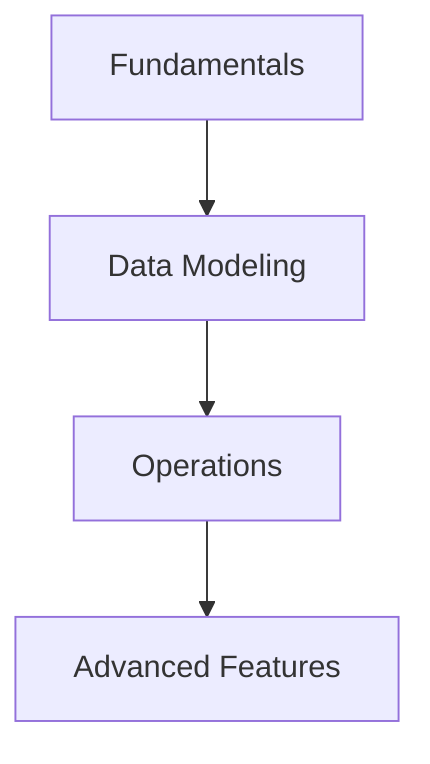

# 01- Concepts (DynamoDB)

## Overview

This section covers the fundamental building blocks and theoretical concepts of Amazon DynamoDB.

## 01- Concepts (DynamoDB) Files

| File | Topic | Primary Focus |
|---|---|---|
| [01- Introduction](./01-%20Introduction.md) | Introduction | Amazon DynamoDB is a **fully managed, distributed NoSQL d... |
| [02- NoSQL Fundamentals](./02-%20NoSQL%20Fundamentals.md) | NoSQL Fundamentals | Before understanding DynamoDB, it is essential to underst... |
| [03- Tables, Items and Attributes](./03-%20Tables%2C%20Items%20and%20Attributes.md) | Tables, Items and Attributes | Every database requires a way to organize data |
| [04- Data Types](./04-%20Data%20Types.md) | Data Types | Every database stores information in a specific format |
| [05- Primary Keys](./05-%20Primary%20Keys.md) | Primary Keys | A database is only useful if it can locate data efficiently |
| [06- Partition Keys and Sort Keys](./06-%20Partition%20Keys%20and%20Sort%20Keys.md) | Partition Keys and Sort Keys | In the previous chapter, we learned that every DynamoDB t... |
| [07- Partitions and Data Distribution](./07-%20Partitions%20and%20Data%20Distribution.md) | Partitions and Data Distribution | One of DynamoDB's defining characteristics is its ability... |
| [08- Read Consistency Models](./08-%20Read%20Consistency%20Models.md) | Read Consistency Models | One of the defining characteristics of distributed databa... |
| [09- Read Capacity Units (RCU) and Write Capacity Units (WCU)](./09-%20Read%20Capacity%20Units%20%28RCU%29%20and%20Write%20Capacity%20Units%20%28WCU%29.md) | Read Capacity Units (RCU) and Write Capacity Units (WCU) | One of the biggest misconceptions about DynamoDB is that ... |
| [10- Capacity Modes](./10-%20Capacity%20Modes.md) | Capacity Modes | In the previous chapter, we learned that every read and w... |
| [11- CRUD Operations](./11-%20CRUD%20Operations.md) | CRUD Operations | At its core, every application performs four fundamental ... |
| [12- Adaptive Capacity](./12-%20Adaptive%20Capacity.md) | Adaptive Capacity | One of the most common misconceptions about DynamoDB is t... |
| [13- Hot Partitions](./13-%20Hot%20Partitions.md) | Hot Partitions | One of the biggest reasons DynamoDB applications experien... |
| [14- Auto Scaling](./14-%20Auto%20Scaling.md) | Auto Scaling | One of the primary goals of cloud computing is to elimina... |
| [15- DynamoDB Architecture Deep Dive](./15-%20DynamoDB%20Architecture%20Deep%20Dive.md) | DynamoDB Architecture Deep Dive | Most developers interact with DynamoDB through simple API... |
| [16- Best Practices and Anti-Patterns](./16-%20Best%20Practices%20and%20Anti-Patterns.md) | Patterns | Building a DynamoDB application is not difficult |

## Progression

The documentation in this section builds conceptually according to the following flow:



## Core Concepts

### NoSQL Paradigms
Understanding how DynamoDB diverges from relational models is critical.

### Partitioning Mechanics
Data is distributed across storage nodes based on the partition key hash.

## Engineering Patterns

Embracing eventual consistency for high throughput.
Designing for access patterns rather than entity normalization.

## Practical Considerations

Provisioning capacity vs using on-demand mode based on workload predictability.
Handling throttling exceptions elegantly with exponential backoff.

## Common Mistakes

- Attempting to normalize data across multiple tables.
- Failing to understand the difference between Scan and Query.
- Choosing a partition key with low cardinality.

## Recommended Reading Order

To maximize comprehension, study the files in this sequence:

1. [01- Introduction](./01-%20Introduction.md)
2. [02- NoSQL Fundamentals](./02-%20NoSQL%20Fundamentals.md)
3. [03- Tables, Items and Attributes](./03-%20Tables%2C%20Items%20and%20Attributes.md)
4. [04- Data Types](./04-%20Data%20Types.md)
5. [05- Primary Keys](./05-%20Primary%20Keys.md)
6. [06- Partition Keys and Sort Keys](./06-%20Partition%20Keys%20and%20Sort%20Keys.md)
7. [07- Partitions and Data Distribution](./07-%20Partitions%20and%20Data%20Distribution.md)
8. [08- Read Consistency Models](./08-%20Read%20Consistency%20Models.md)
9. [09- Read Capacity Units (RCU) and Write Capacity Units (WCU)](./09-%20Read%20Capacity%20Units%20%28RCU%29%20and%20Write%20Capacity%20Units%20%28WCU%29.md)
10. [10- Capacity Modes](./10-%20Capacity%20Modes.md)
11. [11- CRUD Operations](./11-%20CRUD%20Operations.md)
12. [12- Adaptive Capacity](./12-%20Adaptive%20Capacity.md)
13. [13- Hot Partitions](./13-%20Hot%20Partitions.md)
14. [14- Auto Scaling](./14-%20Auto%20Scaling.md)
15. [15- DynamoDB Architecture Deep Dive](./15-%20DynamoDB%20Architecture%20Deep%20Dive.md)
16. [16- Best Practices and Anti-Patterns](./16-%20Best%20Practices%20and%20Anti-Patterns.md)

## Decision Checklist

- [ ] Are all access patterns documented?
- [ ] Is the partition key highly distributed?
- [ ] Do we need strong consistency, or is eventual consistency acceptable?

## Mental Model

Think of DynamoDB as a massive, distributed hash table where the Hash Key determines the server, and the Sort Key acts as a B-tree index on that specific server.

## Key Takeaways

- Master the concepts before writing code.
- Understand the capacity implications of your designs.
- Continuously monitor production metrics.

## Folder Structure

```text
01- Concepts/
    01- Introduction.md
    02- NoSQL Fundamentals.md
    03- Tables, Items and Attributes.md
    04- Data Types.md
    05- Primary Keys.md
    06- Partition Keys and Sort Keys.md
    07- Partitions and Data Distribution.md
    08- Read Consistency Models.md
    09- Read Capacity Units (RCU) and Write Capacity Units (WCU).md
    10- Capacity Modes.md
    11- CRUD Operations.md
    12- Adaptive Capacity.md
    13- Hot Partitions.md
    14- Auto Scaling.md
    15- DynamoDB Architecture Deep Dive.md
    16- Best Practices and Anti-Patterns.md
    README.md
```

---

## Repository Navigation

- [AWS Concepts](../../../01-%20Concepts/README.md)
- [AWS Architecture](../../../02-%20Architecture/README.md)
- [AWS Operations](../../../04-%20Operations/README.md)
- [AWS Security](../../../05-%20Security/README.md)
- [AWS Troubleshooting](../../../07-%20Troubleshooting/README.md)
- [AWS Interview Questions](../../../08-%20Interview%20Questions/README.md)
- [AWS Integrations](../../../09-%20Integrations/README.md)
