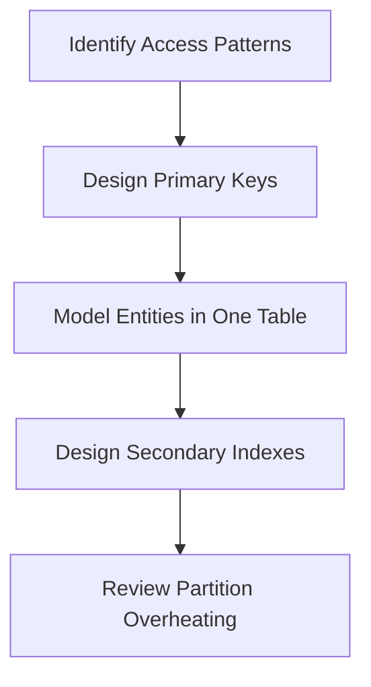

# 02- Data Modelling (DynamoDB)

## Overview

This section explores advanced NoSQL data modeling techniques, focusing on Single-Table Design, adjacency lists, and satisfying complex access patterns.

## 02- Data Modelling (DynamoDB) Files

| File | Topic | Primary Focus |
|---|---|---|
| [01- Data Modeling Principles](./01-%20Data%20Modeling%20Principles.md) | Data Modeling Principles | Designing a DynamoDB database is fundamentally different ... |
| [02- Access Patterns First Design](./02-%20Access%20Patterns%20First%20Design.md) | Access Patterns First Design | If there is one principle that defines successful DynamoD... |
| [03- Single Table Design](./03-%20Single%20Table%20Design.md) | Single Table Design | If there is one DynamoDB topic that separates **junior de... |
| [04- One-to-One Relationships](./04-%20One-to-One%20Relationships.md) | One Relationships | In relational databases, one-to-one relationships are usu... |
| [05- One-to-Many Relationships](./05-%20One-to-Many%20Relationships.md) | Many Relationships | One-to-many relationships are among the most common data ... |
| [06- Many-to-Many Relationships](./06-%20Many-to-Many%20Relationships.md) | Many Relationships | Many-to-many relationships are among the most challenging... |
| [07- Composite Key Design Patterns](./07-%20Composite%20Key%20Design%20Patterns.md) | Composite Key Design Patterns | The **Partition Key** and **Sort Key** together form the ... |
| [08- Adjacency List Pattern](./08-%20Adjacency%20List%20Pattern.md) | Adjacency List Pattern | Many real-world systems contain **graph-like relationship... |
| [09- Sparse Index Pattern](./09-%20Sparse%20Index%20Pattern.md) | Sparse Index Pattern | One of the biggest advantages of DynamoDB is that **Globa... |
| [10- Time-Series Data Modeling](./10-%20Time-Series%20Data%20Modeling.md) | Series Data Modeling | Many modern applications continuously generate data over ... |
| [11- Multi-Tenant Data Modeling](./11-%20Multi-Tenant%20Data%20Modeling.md) | Tenant Data Modeling | Many SaaS (Software-as-a-Service) applications serve **mu... |
| [12- Version Control Pattern](./12-%20Version%20Control%20Pattern.md) | Version Control Pattern | Many production applications need to maintain the **histo... |
| [13- Materialized Graph Pattern](./13-%20Materialized%20Graph%20Pattern.md) | Materialized Graph Pattern | The **Adjacency List Pattern** allows applications to eff... |
| [14- Write Sharding Pattern](./14-%20Write%20Sharding%20Pattern.md) | Write Sharding Pattern | One of the biggest performance challenges in DynamoDB is ... |
| [15- Event Sourcing Pattern](./15-%20Event%20Sourcing%20Pattern.md) | Event Sourcing Pattern | Traditional applications store the **current state** of a... |
| [16- Data Modeling Best Practices](./16-%20Data%20Modeling%20Best%20Practices.md) | Data Modeling Best Practices | Designing an efficient DynamoDB schema is fundamentally d... |

## Progression

The documentation in this section builds conceptually according to the following flow:



## Core Concepts

### Single-Table Design (1TD)
Consolidating multiple entity types into a single table to enable retrieving complex relational data in a single request.

### Access Patterns
The queries your application needs to execute, which must be defined before the schema is designed.

## Engineering Patterns

- **Adjacency Lists:** Modeling many-to-many relationships.
- **Composite Sort Keys:** Filtering hierarchical data.
- **Write Sharding:** Appending random suffixes to hot partition keys to distribute write load.

## Practical Considerations

Single-table design makes schemas rigid. If access patterns change frequently, the schema may need complex migrations.

## Common Mistakes

- Designing the table before knowing the queries.
- Creating a table per entity (like a relational database).
- Using sequential IDs (like auto-increment) as partition keys.

## Recommended Reading Order

To maximize comprehension, study the files in this sequence:

1. [01- Data Modeling Principles](./01-%20Data%20Modeling%20Principles.md)
2. [02- Access Patterns First Design](./02-%20Access%20Patterns%20First%20Design.md)
3. [03- Single Table Design](./03-%20Single%20Table%20Design.md)
4. [04- One-to-One Relationships](./04-%20One-to-One%20Relationships.md)
5. [05- One-to-Many Relationships](./05-%20One-to-Many%20Relationships.md)
6. [06- Many-to-Many Relationships](./06-%20Many-to-Many%20Relationships.md)
7. [07- Composite Key Design Patterns](./07-%20Composite%20Key%20Design%20Patterns.md)
8. [08- Adjacency List Pattern](./08-%20Adjacency%20List%20Pattern.md)
9. [09- Sparse Index Pattern](./09-%20Sparse%20Index%20Pattern.md)
10. [10- Time-Series Data Modeling](./10-%20Time-Series%20Data%20Modeling.md)
11. [11- Multi-Tenant Data Modeling](./11-%20Multi-Tenant%20Data%20Modeling.md)
12. [12- Version Control Pattern](./12-%20Version%20Control%20Pattern.md)
13. [13- Materialized Graph Pattern](./13-%20Materialized%20Graph%20Pattern.md)
14. [14- Write Sharding Pattern](./14-%20Write%20Sharding%20Pattern.md)
15. [15- Event Sourcing Pattern](./15-%20Event%20Sourcing%20Pattern.md)
16. [16- Data Modeling Best Practices](./16-%20Data%20Modeling%20Best%20Practices.md)

## Decision Checklist

- [ ] Have all business access patterns been collected?
- [ ] Are we minimizing the number of requests per access pattern?
- [ ] Is the item size optimized to consume minimal RCUs?

## Mental Model

Instead of linking tables via JOINs at read time, you pre-join data by storing related items contiguously under the same partition key.

## Key Takeaways

- Master the concepts before writing code.
- Understand the capacity implications of your designs.
- Continuously monitor production metrics.

## Folder Structure

```text
02- Data Modelling/
    01- Data Modeling Principles.md
    02- Access Patterns First Design.md
    03- Single Table Design.md
    04- One-to-One Relationships.md
    05- One-to-Many Relationships.md
    06- Many-to-Many Relationships.md
    07- Composite Key Design Patterns.md
    08- Adjacency List Pattern.md
    09- Sparse Index Pattern.md
    10- Time-Series Data Modeling.md
    11- Multi-Tenant Data Modeling.md
    12- Version Control Pattern.md
    13- Materialized Graph Pattern.md
    14- Write Sharding Pattern.md
    15- Event Sourcing Pattern.md
    16- Data Modeling Best Practices.md
    README.md
```

---

## Repository Navigation

- [AWS Concepts](../../../01-%20Concepts/README.md)
- [AWS Architecture](../../../02-%20Architecture/README.md)
- [AWS Operations](../../../04-%20Operations/README.md)
- [AWS Security](../../../05-%20Security/README.md)
- [AWS Troubleshooting](../../../07-%20Troubleshooting/README.md)
- [AWS Interview Questions](../../../08-%20Interview%20Questions/README.md)
- [AWS Integrations](../../../09-%20Integrations/README.md)
