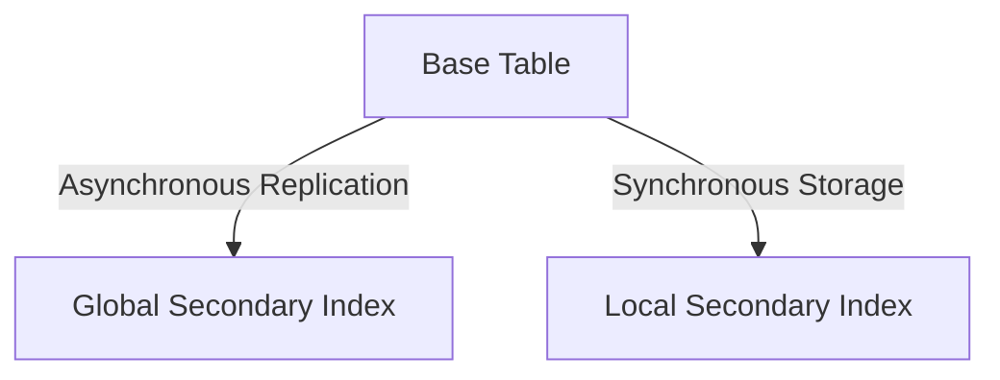

# 03- Indexes (DynamoDB)

## Overview

This section covers Secondary Indexes (GSI and LSI), how they enable flexible querying, and the cost/performance implications of index projections.

## 03- Indexes (DynamoDB) Files

| File | Topic | Primary Focus |
|---|---|---|
| [01- Introduction to Indexes](./01-%20Introduction%20to%20Indexes.md) | Introduction to Indexes | One of the biggest misconceptions developers have when le... |
| [02- Global Secondary Index (GSI)](./02-%20Global%20Secondary%20Index%20%28GSI%29.md) | Global Secondary Index (GSI) | A **Global Secondary Index (GSI)** is the most commonly u... |
| [03- Local Secondary Index (LSI)](./03-%20Local%20Secondary%20Index%20%28LSI%29.md) | Local Secondary Index (LSI) | A **Local Secondary Index (LSI)** is a secondary index th... |
| [04- GSI vs LSI](./04-%20GSI%20vs%20LSI.md) | GSI vs LSI | One of the most common DynamoDB interview questions is: |
| [05- Sparse Indexes](./05-%20Sparse%20Indexes.md) | Sparse Indexes | A **Sparse Index** is one of the most powerful optimizati... |
| [06- Composite Index Design](./06-%20Composite%20Index%20Design.md) | Composite Index Design | A **Composite Index** in DynamoDB is a secondary index th... |
| [07- Index Projection Types](./07-%20Index%20Projection%20Types.md) | Index Projection Types | Creating a secondary index in DynamoDB is not just about ... |
| [08- Consistency Model of Indexes](./08-%20Consistency%20Model%20of%20Indexes.md) | Consistency Model of Indexes | One of the most misunderstood aspects of Amazon DynamoDB ... |
| [09- Index Capacity & Cost](./09-%20Index%20Capacity%20%26%20Cost.md) | Index Capacity & Cost | Secondary indexes dramatically improve query flexibility ... |
| [10- Index Performance & Optimization](./10-%20Index%20Performance%20%26%20Optimization.md) | Index Performance & Optimization | Creating a secondary index is only the first step |
| [11- Common Index Design Patterns](./11-%20Common%20Index%20Design%20Patterns.md) | Common Index Design Patterns | Indexes are not created randomly in production systems |
| [12- Index Anti-Patterns](./12-%20Index%20Anti-Patterns.md) | Patterns | Knowing how to design a good index is only half of the eq... |
| [13- Production Best Practices](./13-%20Production%20Best%20Practices.md) | Production Best Practices | Secondary indexes are one of the most powerful features i... |

## Progression

The documentation in this section builds conceptually according to the following flow:



## Core Concepts

### Global Secondary Indexes (GSI)
Indexes with a different partition key and sort key, spanning all base table partitions.

### Index Projections
The specific attributes copied from the base table into the index.

## Engineering Patterns

- **Sparse Indexes:** Only projecting items that meet a specific condition (e.g., `is_active = 1`).
- **GSI Overloading:** Storing multiple types of indexes in a single GSI by using generic `GSI1PK` and `GSI1SK` attributes.

## Practical Considerations

GSIs consume their own read and write capacity. Writing to a base table with 3 GSIs consumes capacity on all 4 structures.

## Common Mistakes

- Projecting `ALL` attributes when only a few are needed, doubling storage and write costs.
- Assuming GSIs offer strong consistency (they only offer eventual consistency).

## Recommended Reading Order

To maximize comprehension, study the files in this sequence:

1. [01- Introduction to Indexes](./01-%20Introduction%20to%20Indexes.md)
2. [02- Global Secondary Index (GSI)](./02-%20Global%20Secondary%20Index%20%28GSI%29.md)
3. [03- Local Secondary Index (LSI)](./03-%20Local%20Secondary%20Index%20%28LSI%29.md)
4. [04- GSI vs LSI](./04-%20GSI%20vs%20LSI.md)
5. [05- Sparse Indexes](./05-%20Sparse%20Indexes.md)
6. [06- Composite Index Design](./06-%20Composite%20Index%20Design.md)
7. [07- Index Projection Types](./07-%20Index%20Projection%20Types.md)
8. [08- Consistency Model of Indexes](./08-%20Consistency%20Model%20of%20Indexes.md)
9. [09- Index Capacity & Cost](./09-%20Index%20Capacity%20%26%20Cost.md)
10. [10- Index Performance & Optimization](./10-%20Index%20Performance%20%26%20Optimization.md)
11. [11- Common Index Design Patterns](./11-%20Common%20Index%20Design%20Patterns.md)
12. [12- Index Anti-Patterns](./12-%20Index%20Anti-Patterns.md)
13. [13- Production Best Practices](./13-%20Production%20Best%20Practices.md)

## Decision Checklist

- [ ] Can this query be satisfied by the base table instead?
- [ ] Are we projecting only the required attributes?
- [ ] Have we accounted for GSI write capacity limits?

## Mental Model

A GSI is effectively a hidden, managed replica of your table, constantly updated in the background, organized by a different set of keys.

## Key Takeaways

- Master the concepts before writing code.
- Understand the capacity implications of your designs.
- Continuously monitor production metrics.

## Folder Structure

```text
03- Indexes/
    01- Introduction to Indexes.md
    02- Global Secondary Index (GSI).md
    03- Local Secondary Index (LSI).md
    04- GSI vs LSI.md
    05- Sparse Indexes.md
    06- Composite Index Design.md
    07- Index Projection Types.md
    08- Consistency Model of Indexes.md
    09- Index Capacity & Cost.md
    10- Index Performance & Optimization.md
    11- Common Index Design Patterns.md
    12- Index Anti-Patterns.md
    13- Production Best Practices.md
    README.md
```

---

## Repository Navigation

- [AWS Concepts](../../../01-%20Concepts/README.md)
- [AWS Architecture](../../../02-%20Architecture/README.md)
- [AWS Operations](../../../04-%20Operations/README.md)
- [AWS Security](../../../05-%20Security/README.md)
- [AWS Troubleshooting](../../../07-%20Troubleshooting/README.md)
- [AWS Interview Questions](../../../08-%20Interview%20Questions/README.md)
- [AWS Integrations](../../../09-%20Integrations/README.md)
