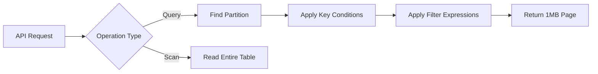

# 04 - Querying & Data Access (DynamoDB)

## Overview

This section details the mechanisms for retrieving data from DynamoDB, covering Queries, Scans, Filters, Pagination, and Batch operations.

## 04 - Querying & Data Access (DynamoDB) Files

| File | Topic | Primary Focus |
|---|---|---|
| [01- Query vs Scan](./01-%20Query%20vs%20Scan.md) | Query vs Scan | One of the biggest differences between **Amazon DynamoDB*... |
| [02- Query Operation](./02-%20Query%20Operation.md) | Query Operation | The **Query** operation is the primary method for retriev... |
| [03- Scan Operation](./03-%20Scan%20Operation.md) | Scan Operation | The **Scan** operation reads **every item** in a DynamoDB... |
| [04- Key Condition Expressions](./04-%20Key%20Condition%20Expressions.md) | Key Condition Expressions | A **Key Condition Expression** is the most important part... |
| [05- Filter Expressions](./05-%20Filter%20Expressions.md) | Filter Expressions | A **Filter Expression** is used to remove unwanted items ... |
| [06- Projection Expressions](./06-%20Projection%20Expressions.md) | Projection Expressions | A **Projection Expression** allows an application to retr... |
| [07- Condition Expressions](./07-%20Condition%20Expressions.md) | Condition Expressions | A **Condition Expression** allows DynamoDB to perform an ... |
| [08- Pagination](./08-%20Pagination.md) | Pagination | DynamoDB is designed to scale to **billions of items** wh... |
| [09- Reading Data](./09-%20Reading%20Data.md) | Reading Data | Reading data is one of the most fundamental operations in... |
| [10- Writing Data](./10-%20Writing%20Data.md) | Writing Data | Writing data is one of the most critical aspects of desig... |
| [11- BatchGetItem](./11-%20BatchGetItem.md) | BatchGetItem | `BatchGetItem` is a DynamoDB operation that allows an app... |
| [12- BatchWriteItem](./12-%20BatchWriteItem.md) | BatchWriteItem | `BatchWriteItem` is a DynamoDB operation that allows an a... |
| [13- TransactGetItems](./13-%20TransactGetItems.md) | TransactGetItems | `TransactGetItems` is a DynamoDB operation that retrieves... |
| [14- TransactWriteItems](./14-%20TransactWriteItems.md) | TransactWriteItems | `TransactWriteItems` is DynamoDB's transactional write op... |
| [15- Conditional Writes](./15-%20Conditional%20Writes.md) | Conditional Writes | A **Conditional Write** is a write operation that is exec... |
| [16- Atomic Counters](./16-%20Atomic%20Counters.md) | Atomic Counters | An **Atomic Counter** is a DynamoDB feature that allows n... |
| [17- Optimistic Locking](./17-%20Optimistic%20Locking.md) | Optimistic Locking | Instead of locking an item while it is being modified, Dy... |
| [18- Error Handling & Retries](./18-%20Error%20Handling%20%26%20Retries.md) | Error Handling & Retries | Distributed systems are designed with the assumption that... |
| [19- Query Performance Best Practices](./19-%20Query%20Performance%20Best%20Practices.md) | Query Performance Best Practices | One of DynamoDB's biggest strengths is its ability to ser... |

## Progression

The documentation in this section builds conceptually according to the following flow:



## Core Concepts

### Query vs Scan
Queries are targeted and efficient O(1)/O(log N) operations. Scans are O(N) operations that read the entire table.

### Filter Expressions
Client-side-like filtering applied *after* the database reads the data but *before* returning it, saving bandwidth but not read capacity.

## Engineering Patterns

- **Keyset Pagination:** Using `ExclusiveStartKey` to fetch subsequent pages of data.
- **Parallel Scans:** Dividing a table into segments to scan it rapidly using multiple workers.

## Practical Considerations

DynamoDB limits query results to 1MB per request. Your application must handle pagination natively.

## Common Mistakes

- Using Scans for application workflows.
- Believing Filter Expressions reduce Read Capacity Unit (RCU) consumption.
- Failing to implement pagination loops.

## Recommended Reading Order

To maximize comprehension, study the files in this sequence:

1. [01- Query vs Scan](./01-%20Query%20vs%20Scan.md)
2. [02- Query Operation](./02-%20Query%20Operation.md)
3. [03- Scan Operation](./03-%20Scan%20Operation.md)
4. [04- Key Condition Expressions](./04-%20Key%20Condition%20Expressions.md)
5. [05- Filter Expressions](./05-%20Filter%20Expressions.md)
6. [06- Projection Expressions](./06-%20Projection%20Expressions.md)
7. [07- Condition Expressions](./07-%20Condition%20Expressions.md)
8. [08- Pagination](./08-%20Pagination.md)
9. [09- Reading Data](./09-%20Reading%20Data.md)
10. [10- Writing Data](./10-%20Writing%20Data.md)
11. [11- BatchGetItem](./11-%20BatchGetItem.md)
12. [12- BatchWriteItem](./12-%20BatchWriteItem.md)
13. [13- TransactGetItems](./13-%20TransactGetItems.md)
14. [14- TransactWriteItems](./14-%20TransactWriteItems.md)
15. [15- Conditional Writes](./15-%20Conditional%20Writes.md)
16. [16- Atomic Counters](./16-%20Atomic%20Counters.md)
17. [17- Optimistic Locking](./17-%20Optimistic%20Locking.md)
18. [18- Error Handling & Retries](./18-%20Error%20Handling%20%26%20Retries.md)
19. [19- Query Performance Best Practices](./19-%20Query%20Performance%20Best%20Practices.md)

## Decision Checklist

- [ ] Are all read operations using Query instead of Scan?
- [ ] Is pagination fully implemented in the application layer?
- [ ] Are filter expressions used only for minor refinements?

## Mental Model

Data retrieval in DynamoDB is like a physical filing cabinet. A Query goes straight to the correct drawer (Partition) and grabs a contiguous block of files (Sort Key). A Scan empties the entire cabinet.

## Key Takeaways

- Master the concepts before writing code.
- Understand the capacity implications of your designs.
- Continuously monitor production metrics.

## Folder Structure

```text
04 - Querying & Data Access/
    01- Query vs Scan.md
    02- Query Operation.md
    03- Scan Operation.md
    04- Key Condition Expressions.md
    05- Filter Expressions.md
    06- Projection Expressions.md
    07- Condition Expressions.md
    08- Pagination.md
    09- Reading Data.md
    10- Writing Data.md
    11- BatchGetItem.md
    12- BatchWriteItem.md
    13- TransactGetItems.md
    14- TransactWriteItems.md
    15- Conditional Writes.md
    16- Atomic Counters.md
    17- Optimistic Locking.md
    18- Error Handling & Retries.md
    19- Query Performance Best Practices.md
    README.md
```

---

## Repository Navigation

- [AWS Concepts](../../../01-%20Concepts/README.md)
- [AWS Architecture](../../../02-%20Architecture/README.md)
- [AWS Operations](../../../04-%20Operations/README.md)
- [AWS Security](../../../05-%20Security/README.md)
- [AWS Troubleshooting](../../../07-%20Troubleshooting/README.md)
- [AWS Interview Questions](../../../08-%20Interview%20Questions/README.md)
- [AWS Integrations](../../../09-%20Integrations/README.md)
