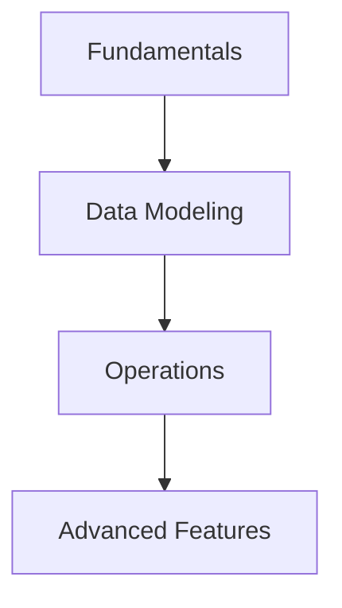

# 09- AWS DynamoDB

## Overview

This section covers the fundamental building blocks and theoretical concepts of Amazon DynamoDB.

## Progression

The documentation in this section builds conceptually according to the following flow:



## Core Concepts

### NoSQL Paradigms
Understanding how DynamoDB diverges from relational models is critical.

### Partitioning Mechanics
Data is distributed across storage nodes based on the partition key hash.

## Engineering Patterns

Embracing eventual consistency for high throughput.
Designing for access patterns rather than entity normalization.

## Practical Considerations

Provisioning capacity vs using on-demand mode based on workload predictability.
Handling throttling exceptions elegantly with exponential backoff.

## Common Mistakes

- Attempting to normalize data across multiple tables.
- Failing to understand the difference between Scan and Query.
- Choosing a partition key with low cardinality.

## Decision Checklist

- [ ] Are all access patterns documented?
- [ ] Is the partition key highly distributed?
- [ ] Do we need strong consistency, or is eventual consistency acceptable?

## Mental Model

Think of DynamoDB as a massive, distributed hash table where the Hash Key determines the server, and the Sort Key acts as a B-tree index on that specific server.

## Key Takeaways

- Master the concepts before writing code.
- Understand the capacity implications of your designs.
- Continuously monitor production metrics.

## Folder Structure

```text
09- AWS DynamoDB/
    01- Concepts/
    02- Data Modelling/
    03- Indexes/
    04 - Querying & Data Access/
    README.md
```

---

## Repository Navigation

- [AWS Concepts](../../01-%20Concepts/README.md)
- [AWS Architecture](../../02-%20Architecture/README.md)
- [AWS Operations](../../04-%20Operations/README.md)
- [AWS Security](../../05-%20Security/README.md)
- [AWS Troubleshooting](../../07-%20Troubleshooting/README.md)
- [AWS Interview Questions](../../08-%20Interview%20Questions/README.md)
- [AWS Integrations](../../09-%20Integrations/README.md)
