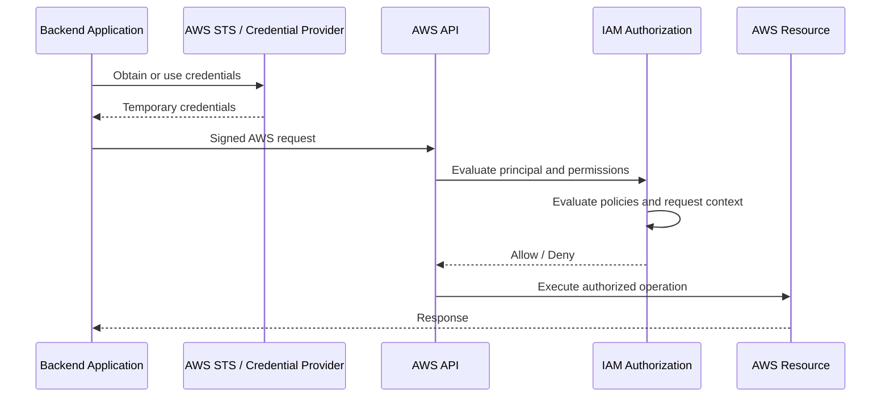
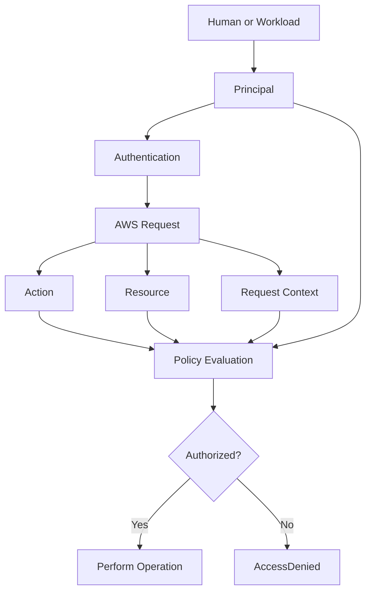

Yes. For your **Backend Engineering Playbook**, I would make IAM less about memorizing AWS features and more about understanding **identity, authorization, policy evaluation, and real production access patterns**.

### Recommended topic progression

**1. IAM Fundamentals**

* Authentication vs authorization
* IAM users, groups, roles
* Principals
* Resources and actions
* ARN fundamentals
* Identity-based vs resource-based policies
* Explicit deny vs allow
* Policy evaluation flow

**2. IAM Policies — make this a major section**

* Policy JSON structure
* Effect, Action, Resource
* Principal
* Conditions
* Wildcards
* Policy variables
* Managed vs inline policies
* AWS managed vs customer managed policies
* Identity-based policies
* Resource-based policies
* Session policies
* Permissions boundaries
* Organizations SCPs
* Policy evaluation order

This is probably the **most important IAM area for your backend/system-design preparation**.

**3. IAM Roles and STS**

* Why roles are preferred for workloads
* AssumeRole
* Trust policies
* Permission policies
* Temporary credentials
* STS
* Cross-account access
* Role chaining
* Session duration
* External IDs
* Instance profiles
* Roles for Lambda/ECS/EC2 workloads
* Web identity federation

**4. Human vs Workload Identity**  
This distinction is worth documenting separately:

```
Human users
    IAM Identity Center
    Federation
    MFA
    Temporary credentials

Applications / workloads
    IAM roles
    STS
    Instance profiles
    Task roles
    Lambda execution roles
```

That will make your notes much more useful for architecture discussions.

**5. IAM Security**

* Root account protection
* MFA
* Access keys
* Credential rotation
* Least privilege
* Temporary credentials
* Secrets vs IAM credentials
* Privilege escalation
* Credential exposure risks
* Access Analyzer
* Unused permissions/access

**6. Advanced Authorization**  
I would definitely include:

* Permission boundaries
* SCPs
* ABAC
* Resource-based policies
* Conditions
* Tag-based authorization
* Cross-account authorization
* Service-linked roles
* Delegated administration

These topics differentiate basic IAM knowledge from senior-level IAM knowledge.

**7. IAM + AWS Services**  
Focus on the services you are actually learning:

```
Human users
    IAM Identity Center
    Federation
    MFA
    Temporary credentials

Applications / workloads
    IAM roles
    STS
    Instance profiles
    Task roles
    Lambda execution roles
```

The important question should be:

> **Who is making the request, what are they allowed to do, and which policy grants or denies it?**

**8. CLI**  
For your separate CLI notes, emphasize **hands-on investigation**, not generic AWS CLI learning:

* `aws iam`
* `aws sts`
* user/role/policy inspection
* policy listing
* role assumption
* identity verification
* credential/profile handling
* querying/filtering output
* debugging `AccessDenied`

**9. Troubleshooting**  
This deserves strong coverage because IAM failures are extremely common:

```
EC2 → Instance Roles
Lambda → Execution Roles
ECS → Task Roles / Execution Roles
S3 → Bucket Policies + IAM Policies
CloudFormation → Service Roles
CloudWatch → IAM Permissions
ECR → Repository Permissions
Secrets Manager → IAM Access
SQS/SNS → Resource Policies
VPC → IAM permissions for infrastructure management
```

I would make **policy evaluation + AccessDenied troubleshooting** one of the strongest sections in the entire IAM playbook.

**10. Interview / Senior-Level**  
Prioritize questions such as:

* IAM User vs IAM Role
* Role vs Policy
* Trust Policy vs Permission Policy
* Identity-based vs Resource-based policy
* Permissions Boundary vs SCP
* IAM Role vs Access Key
* How cross-account access works
* Why workloads should use roles
* Why an apparently correct policy still produces `AccessDenied`
* How IAM policy evaluation works
* How to implement least privilege
* How to design IAM for a multi-account AWS environment
* How to debug a production authorization failure

### One structural adjustment I would make

Your current structure is good, but I would add **STS explicitly to concepts**, because it connects IAM roles, temporary credentials, federation, and cross-account access:

```
EC2 → Instance Roles
Lambda → Execution Roles
ECS → Task Roles / Execution Roles
S3 → Bucket Policies + IAM Policies
CloudFormation → Service Roles
CloudWatch → IAM Permissions
ECR → Repository Permissions
Secrets Manager → IAM Access
SQS/SNS → Resource Policies
VPC → IAM permissions for infrastructure management
```

For **your level**, I would treat these as the core IAM pillars:

**Policy Evaluation → Roles → STS → Temporary Credentials → Cross-Account Access → Least Privilege → Permissions Boundaries/SCPs → Troubleshooting**

That gives you much stronger coverage for backend engineering and system-design interviews than simply documenting all IAM resources.
```
IAM Topic Guidance

1. IAM Fundamentals
   - Authentication vs Authorization
   - IAM Users
   - IAM Groups
   - IAM Roles
   - IAM Principals
   - AWS Resources
   - Actions and Permissions
   - ARNs
   - IAM global vs regional concepts
   - Human identities vs workload identities

2. IAM Policies
   - Policy JSON structure
   - Version
   - Statement
   - Effect
   - Action
   - Resource
   - Principal
   - Condition
   - Policy variables
   - Wildcards
   - Identity-based policies
   - Resource-based policies
   - Managed policies
   - AWS managed policies
   - Customer managed policies
   - Inline policies
   - Session policies

3. Policy Evaluation
   - Default deny
   - Explicit allow
   - Explicit deny
   - Policy evaluation order
   - Multiple policy sources
   - Identity policies vs resource policies
   - Permissions boundaries
   - Service Control Policies
   - Session policies
   - Conditions and contextual evaluation
   - Common policy evaluation mistakes

4. IAM Roles
   - What an IAM role is
   - Role trust policy
   - Role permission policy
   - AssumeRole
   - Temporary credentials
   - Role sessions
   - Role chaining
   - Maximum session duration
   - External IDs
   - Instance profiles
   - Service roles
   - Service-linked roles

5. AWS STS
   - STS fundamentals
   - Temporary security credentials
   - GetCallerIdentity
   - AssumeRole
   - AssumeRoleWithWebIdentity
   - Federated identities
   - Session credentials
   - Session duration
   - ExternalId
   - Cross-account temporary access
   - Workload identity patterns

6. Cross-Account Access
   - Cross-account IAM roles
   - Trusting another AWS account
   - Trust policy design
   - Permission policy design
   - Role assumption flow
   - External IDs
   - Cross-account resource access
   - Common cross-account failures
   - Multi-account AWS architecture patterns

7. Human Identity Management
   - IAM users and why they should be minimized
   - IAM Identity Center
   - Federation
   - SSO
   - MFA
   - Temporary credentials
   - Workforce identities
   - Permission assignment
   - Account access patterns

8. Workload Identity
   - EC2 instance roles
   - ECS task roles
   - ECS execution roles
   - Lambda execution roles
   - EKS workload identity
   - Application roles
   - Service-to-service authorization
   - Temporary credentials for applications
   - Avoiding hard-coded access keys

9. IAM Security
   - Root account security
   - MFA
   - Access keys
   - Credential rotation
   - Least privilege
   - Temporary credentials
   - Credential exposure risks
   - Unused permissions
   - Privilege escalation risks
   - IAM Access Analyzer
   - Access reviews
   - Security best practices

10. Advanced Authorization
    - Permissions boundaries
    - Service Control Policies
    - Resource-based policies
    - Session policies
    - Attribute-Based Access Control
    - Tag-based authorization
    - Policy conditions
    - aws:PrincipalArn
    - aws:SourceArn
    - aws:SourceAccount
    - aws:userid
    - IP and network conditions
    - MFA-based conditions
    - Time-based conditions
    - Organization-based conditions

11. IAM and AWS Service Integrations
    - S3 IAM policies
    - S3 bucket policies
    - EC2 IAM roles
    - Lambda execution roles
    - ECS task roles
    - ECR permissions
    - SQS resource policies
    - SNS resource policies
    - Secrets Manager permissions
    - CloudWatch permissions
    - CloudFormation service roles
    - VPC-related IAM permissions

12. IAM CLI
    - AWS IAM CLI basics
    - Identity inspection
    - User inspection
    - Group inspection
    - Role inspection
    - Policy inspection
    - Policy attachment
    - Role assumption
    - STS commands
    - Access key management
    - MFA-related commands
    - Profile and credential usage
    - Filtering and querying CLI output
    - IAM diagnostic commands

13. IAM Troubleshooting
    - IAM troubleshooting methodology
    - AccessDenied errors
    - Authentication failures
    - Authorization failures
    - Policy syntax issues
    - Policy evaluation issues
    - Explicit deny troubleshooting
    - AssumeRole failures
    - Trust policy issues
    - Permissions boundary issues
    - SCP issues
    - Resource policy issues
    - Condition mismatches
    - Credential and profile issues
    - CLI authentication problems
    - STS failures
    - Cross-account access failures
    - Diagnostic commands and tools

14. IAM Operations
    - IAM credential reports
    - Access Advisor
    - Permission reviews
    - Unused access identification
    - Access key lifecycle management
    - Role lifecycle management
    - Policy lifecycle management
    - Auditability
    - Operational IAM best practices

15. IAM Architecture
    - Single-account IAM architecture
    - Multi-account IAM architecture
    - Centralized identity
    - IAM Identity Center architecture
    - Cross-account role architecture
    - Workload identity architecture
    - Least-privilege architecture
    - Production IAM design
    - IAM for microservices
    - IAM for CI/CD pipelines
    - IAM for serverless workloads

16. IAM Interview Preparation
    - Core IAM questions
    - Identity and role questions
    - Policy questions
    - Policy evaluation scenarios
    - STS and temporary credential questions
    - Cross-account scenarios
    - Security scenarios
    - Troubleshooting scenarios
    - Architecture scenarios
    - Comparison questions
    - IAM vs resource-based authorization
    - IAM role vs access key
    - Trust policy vs permission policy
    - Permissions boundary vs SCP
    - IAM user vs IAM role
    - Common IAM misconceptions
    - Common interview traps
    - Senior-level IAM reasoning
    - Production incident scenarios

17. Core Senior-Level Focus
    - Understand policy evaluation deeply
    - Understand roles and temporary credentials deeply
    - Understand STS and AssumeRole
    - Understand cross-account access
    - Understand least-privilege design
    - Understand permissions boundaries and SCPs
    - Understand workload identity
    - Understand AccessDenied debugging
    - Design IAM for production systems
    - Explain authorization decisions step by step
```
```
# 01- IAM Basics

## Overview

AWS Identity and Access Management (IAM) controls **who can authenticate to AWS, what they are allowed to do, and which AWS resources they can access**. It is the foundation for access control across AWS services and is used by both human operators and workloads such as EC2 instances, Lambda functions, ECS tasks, CI/CD pipelines, and Kubernetes workloads.

For backend engineers, IAM is not primarily about creating users. The important engineering model is:

```text
Principal
    +
Authentication
    +
Permissions
    +
Target Resource
    +
Request Context
    =
Authorization Decision
```

IAM answers questions such as:

- Which identity is making this request?
- Is the identity authenticated?
- Which AWS action is being attempted?
- Which resource is being accessed?
- Which permissions apply to the request?
- What context does the request contain?
- Is the request allowed or denied?

The distinction between **identity** and **permissions** is fundamental. A role or user represents an identity; policies describe what that identity can or cannot do.

---

## Authentication vs Authorization

Authentication and authorization are separate concerns.

| Concern | Question | AWS IAM responsibility |
|---|---|---|
| Authentication | Who are you? | Identity verification and credentials |
| Authorization | What are you allowed to do? | Policy evaluation |
| Resource targeting | What are you accessing? | ARN/resource matching |
| Context evaluation | Under what conditions? | Policy conditions and request context |

For example, when a backend service reads an object from Amazon S3:

```text
Application
    ↓
AWS credentials
    ↓
AWS API request
    ↓
IAM identifies the principal
    ↓
IAM evaluates applicable policies
    ↓
S3 evaluates the authorized request
    ↓
Allow or Deny
```

A successful authentication does not automatically mean the request is authorized.

An application can have valid AWS credentials and still receive:

```text
AccessDenied
```

because the authenticated principal lacks permission for the requested action.

---

## IAM Core Entities

The main IAM building blocks are users, groups, roles, policies, principals, actions, and resources.

| Entity | Purpose | Typical usage |
|---|---|---|
| IAM User | Long-lived AWS identity | Legacy or limited human access |
| IAM Group | Collection of users | Managing permissions for groups of users |
| IAM Role | Identity with temporary credentials | Applications, services, federation, cross-account access |
| Policy | Defines permissions | Allowing or denying actions |
| Principal | Identity making a request | User, role, account, federated identity, service |
| Action | Operation being requested | `s3:GetObject`, `ec2:DescribeInstances` |
| Resource | AWS object being accessed | S3 bucket, object, queue, role, secret |
| ARN | Globally identifies an AWS resource | Used in policies and API operations |

The most important practical distinction is between **users and roles**.

For modern workloads, roles are generally preferred because they provide temporary credentials instead of requiring applications to store long-lived access keys.

---

## IAM Users

An IAM user represents an AWS identity with credentials associated with a specific user.

A user can have:

- Console credentials
- Access keys
- Permissions through policies
- Membership in IAM groups
- MFA configuration

Example:

```text
Developer
    ↓
IAM User
    ↓
Console / CLI
    ↓
AWS API
```

### When IAM Users Are Appropriate

IAM users still exist and can be useful in specific scenarios, but they should not normally be the default identity mechanism for production workloads.

Use cases may include:

- Legacy integrations
- Specialized service accounts that cannot use role-based authentication
- Specific administrative or operational scenarios where temporary credentials are not practical

For workforce access, AWS environments commonly use centralized identity and federation rather than creating a separate IAM user for every employee.

### Common Mistake

A common design mistake is embedding an IAM user's access key and secret key directly into:

- Application source code
- Docker images
- Environment files committed to Git
- CI/CD repositories
- Configuration files

This creates long-lived credentials that are difficult to control and rotate.

Prefer role-based access whenever the workload supports it.

---

## IAM Groups

An IAM group is a collection of IAM users.

Groups simplify permission management when multiple users need the same permission set.

Example:

```text
Backend Developers
    ├── User A
    ├── User B
    └── User C

            ↓

      Shared Permissions
```

A group does not authenticate and cannot be assumed as a role. It exists primarily as a way to organize user permissions.

For example, a development group might receive permissions to inspect CloudWatch logs and interact with development resources.

Groups are primarily relevant to IAM users; modern workforce identity architectures often use IAM Identity Center and centrally managed permission sets instead.

---

## IAM Roles

An IAM role is an AWS identity that does not have long-lived credentials permanently attached to it.

Instead, a trusted principal assumes the role and receives **temporary security credentials**.

This makes roles especially useful for backend systems.

Typical examples include:

- EC2 instance roles
- Lambda execution roles
- ECS task roles
- CI/CD roles
- Cross-account roles
- Federated workforce access
- Kubernetes workload identities

Basic flow:

```text
Trusted Principal
      ↓
Assume Role
      ↓
STS
      ↓
Temporary Credentials
      ↓
AWS API
```

A role has two important policy concepts:

### Trust Policy

The trust policy defines **who or what is allowed to assume the role**.

### Permissions Policy

The permissions policy defines **what the role can do after it has been assumed**.

This distinction is critical.

```text
Trust Policy
    "Who can assume this role?"

Permission Policy
    "What can this role do?"
```

A role can have correct permissions but still fail because its trust policy does not allow the requesting principal to assume it.

---

## IAM Principals

A principal is the identity making an AWS request.

Depending on the service and request type, principals can include:

- IAM users
- IAM roles
- AWS accounts
- Federated identities
- AWS services
- Certain resource-based policy principals

For example:

```text
Django API
    ↓
EC2 Instance Role
    ↓
AWS STS credentials
    ↓
S3 API
```

The effective principal for the S3 request is the role-based identity rather than the application developer who wrote the code.

This distinction becomes especially important when debugging authorization failures.

---

## Workload Identity vs Human Identity

A production AWS environment normally has two broad identity categories.

### Human Identity

Humans need access to operate AWS environments.

Typical mechanisms include:

- IAM Identity Center
- Federation
- Single sign-on
- MFA
- Temporary credentials

### Workload Identity

Applications and infrastructure need AWS permissions without using human credentials.

Typical mechanisms include:

- EC2 instance roles
- Lambda execution roles
- ECS task roles
- EKS workload identities
- CI/CD IAM roles
- Cross-account roles

The architectural principle is:

> Humans authenticate as humans; workloads authenticate as workloads.

A backend service should not use a developer's personal AWS access key.

---

## AWS Resources

A resource is an AWS object on which an action can operate.

Examples:

```text
S3 bucket
S3 object
EC2 instance
DynamoDB table
SQS queue
SNS topic
Secrets Manager secret
IAM role
CloudWatch log group
```

IAM permissions frequently reference resources using Amazon Resource Names (ARNs).

For example:

```text
arn:aws:s3:::company-assets
```

An S3 object has a more specific ARN:

```text
arn:aws:s3:::company-assets/uploads/report.pdf
```

Resource support varies by AWS service and action. Some API operations are resource-specific, while others operate at the account or service level.

---

## AWS Actions and Permissions

An AWS action represents an API-level operation that a principal may attempt to perform.

Examples:

```text
s3:GetObject
s3:PutObject
sqs:SendMessage
secretsmanager:GetSecretValue
ec2:DescribeInstances
iam:PassRole
```

Permissions are typically expressed as:

```text
Effect + Action + Resource
```

For example:

```json
{
    "Effect": "Allow",
    "Action": "s3:GetObject",
    "Resource": "arn:aws:s3:::company-assets/*"
}
```

This means the policy statement allows the specified action against the matching S3 objects.

An authorization decision depends on more than just the requested action. Resource matching, conditions, identity, and other applicable policy controls can also affect the final result.

---

## Amazon Resource Names

An Amazon Resource Name (ARN) uniquely identifies many AWS resources.

A common ARN structure is:

```text
arn:partition:service:region:account-id:resource
```

Example:

```text
arn:aws:iam::123456789012:role/BackendApplicationRole
```

Another example:

```text
arn:aws:sqs:ap-south-1:123456789012:order-events
```

The exact ARN structure differs between AWS services.

### ARN Components

| Component | Meaning |
|---|---|
| `arn` | ARN identifier |
| `aws` | AWS partition |
| `iam` / `sqs` / `s3` | AWS service |
| Region | AWS region when applicable |
| Account ID | Owning AWS account when applicable |
| Resource | Specific AWS resource |

Not every AWS ARN contains every logical component.

For example, IAM is a global service, so IAM resource ARNs do not use a region in the same way regional services do.

---

## Global vs Regional AWS Services

IAM is a **global AWS service**.

Resources managed by IAM, such as:

- Users
- Groups
- Roles
- Policies

are not created independently in each AWS region.

This differs from regional services such as:

- EC2
- ECS
- RDS
- Lambda
- VPC

For example, a role created in an AWS account can be used by supported resources across regions.

```text
AWS Account
    │
    ├── ap-south-1
    │    ├── EC2
    │    └── Lambda
    │
    ├── us-east-1
    │    ├── EC2
    │    └── Lambda
    │
    └── Global IAM
         ├── Roles
         ├── Users
         └── Policies
```

This distinction matters when designing multi-region systems and when reasoning about IAM failures. A regional deployment problem does not necessarily imply a regional IAM configuration.

---

## IAM Policies

A policy is a JSON document that describes permissions.

A basic permission statement looks like this:

```json
{
    "Version": "2012-10-17",
    "Statement": [
        {
            "Effect": "Allow",
            "Action": "s3:GetObject",
            "Resource": "arn:aws:s3:::company-assets/*"
        }
    ]
}
```

At a high level:

```text
Version
    ↓
Statement
    ↓
Effect
Action
Resource
Condition
```

Policy structure and policy evaluation are covered in greater depth in the dedicated IAM policy documentation.

For IAM fundamentals, remember:

> An identity does not automatically have permission to perform an action. Permissions must be granted through applicable authorization policies and controls.

---

## Identity-Based vs Resource-Based Access

Two important authorization models are common in AWS.

### Identity-Based Policies

The policy is attached to an identity such as:

- User
- Group
- Role

Conceptually:

```text
Role
  ↓
Policy
  ↓
s3:GetObject
```

### Resource-Based Policies

The policy is attached to the resource itself.

Common examples include:

- S3 bucket policies
- SQS queue policies
- SNS topic policies
- Secrets Manager resource policies where supported

Conceptually:

```text
Resource
  ↓
Resource Policy
  ↓
Principal
```

These models can interact, and the final authorization decision depends on the complete policy context.

---

## IAM Request Model

A backend engineer should be able to reason about an AWS request as a sequence.



The exact internal implementation differs by AWS service, but this model is useful when debugging production access problems.

For example, if a Django application returns an S3 `AccessDenied` error, investigate:

1. Which AWS principal is being used?
2. Which S3 action is being requested?
3. Which resource ARN is being accessed?
4. Which policies should grant access?
5. Is any explicit deny or higher-level restriction involved?
6. Is the request using the expected account, role, region, and credentials?

---

## IAM in Backend Applications

A production backend should normally rely on the AWS credential provider chain rather than hard-coded credentials.

For a Python service using `boto3`, application code can request an AWS client without embedding an access key:

```python
import boto3

s3 = boto3.client("s3")

response = s3.get_object(
    Bucket="company-assets",
    Key="uploads/report.pdf",
)

content = response["Body"].read()
```

The SDK obtains credentials from the environment appropriate to the runtime.

Depending on the deployment environment, credentials may come from:

- Local AWS profiles
- Environment variables
- ECS task roles
- EC2 instance roles
- Lambda execution roles
- EKS workload identity
- Other supported AWS credential providers

The application should not need to know whether credentials came from an EC2 role, ECS task role, or another supported provider.

---

## IAM with Common Backend Workloads

| Workload | Preferred identity pattern |
|---|---|
| Local development | AWS profile / federated credentials |
| EC2 application | EC2 instance role |
| Lambda | Lambda execution role |
| ECS task | ECS task role |
| EKS workload | Kubernetes workload identity with IAM integration |
| CI/CD pipeline | Dedicated IAM role |
| Cross-account service | Assumable IAM role |
| Human AWS access | IAM Identity Center / federation |

### ECS Task Role vs Execution Role

These are often confused.

The **task role** provides AWS permissions to the application running inside the ECS task.

The **execution role** is used by the ECS infrastructure for operations such as pulling images or publishing logs when required by the configured task.

Do not give the application permissions merely because the execution role has them.

---

## IAM and Microservices

Consider a microservice architecture:

```text
Order Service
    │
    ├── SQS: SendMessage
    │
    └── DynamoDB: PutItem

Worker Service
    │
    ├── SQS: ReceiveMessage
    └── S3: PutObject
```

A strong IAM design gives each workload its own role with only the permissions required by that workload.

```text
Order Service Role
    ├── sqs:SendMessage
    └── dynamodb:PutItem

Worker Role
    ├── sqs:ReceiveMessage
    └── s3:PutObject
```

Avoid giving both services a broad policy such as:

```text
Action: "*"
Resource: "*"
```

Even when that makes initial development easier, it expands the blast radius of a compromised workload.

---

## Least Privilege

Least privilege means granting only the permissions required to perform the intended job.

For example, if a worker only uploads generated reports:

```json
{
    "Version": "2012-10-17",
    "Statement": [
        {
            "Effect": "Allow",
            "Action": "s3:PutObject",
            "Resource": "arn:aws:s3:::company-reports/generated/*"
        }
    ]
}
```

This is preferable to granting broad S3 access when the application has no reason to:

- Delete objects
- Modify bucket configuration
- Read unrelated objects
- Access other buckets

Least privilege improves security and also improves operational clarity because each role has an understandable responsibility boundary.

---

## Human Access vs Workload Access

A useful production rule is:

```text
Human
    → Identity Center / Federation
    → Temporary access
    → AWS Console / CLI

Workload
    → IAM Role
    → Temporary credentials
    → AWS API
```

Do not design application authentication around a developer's AWS identity.

For example, this is a poor production pattern:

```text
Developer IAM User
        ↓
Access Key
        ↓
Docker Environment Variable
        ↓
Django Application
```

A preferred production pattern is:

```text
ECS Task
    ↓
Task Role
    ↓
Temporary Credentials
    ↓
AWS API
```

This separates application authorization from employee identity.

---

## Root User

The AWS account root user is different from normal IAM identities.

The root user has exceptional account-level privileges and should not be used for routine application or operational work.

Production practices include:

- Enable MFA for the root user
- Avoid using root credentials for routine operations
- Do not create application access keys for the root user
- Protect root credentials separately from normal operational identities
- Use appropriate delegated or role-based access for day-to-day administration

The root account is an account-level recovery and administrative identity, not a normal application identity.

---

## IAM Security Principles

### Prefer Temporary Credentials

Temporary credentials reduce the lifetime of exposed credentials and are the normal choice for supported AWS workloads.

### Avoid Long-Lived Secrets

Do not store access keys in:

- Git repositories
- Dockerfiles
- Container images
- Application source code
- Shared configuration files

### Separate Roles by Workload

Use separate roles for materially different workloads and trust boundaries.

### Scope Resources Precisely

Prefer:

```text
arn:aws:s3:::company-reports/generated/*
```

over unnecessarily broad:

```text
*
```

### Treat IAM as Part of Application Security

IAM permissions can expose:

- Databases
- Object storage
- Secrets
- Queues
- Messaging systems
- Compute resources
- Infrastructure APIs

An insecure IAM role can therefore become an application-level security vulnerability.

---

## Common Mistakes

| Mistake | Why it is a problem | Better approach |
|---|---|---|
| Hard-coded access keys | Long-lived credentials can leak | Use IAM roles or federated credentials |
| `Action: "*"` | Excessive privileges | Grant required actions only |
| `Resource: "*"` everywhere | Large blast radius | Scope resources where supported |
| Using a developer's credentials in production | Couples workload access to a human identity | Use workload roles |
| Confusing trust and permission policies | Role assumption still fails | Separate "who can assume" from "what can be done" |
| Giving every service the same role | Weak isolation | Create workload-specific roles |
| Ignoring MFA for privileged human access | Increased account compromise risk | Enforce strong authentication |
| Assuming authentication means authorization | Valid credentials can still be denied | Investigate policy evaluation |
| Giving ECS applications the execution role | Can expose infrastructure permissions to the application | Use the ECS task role |
| Treating IAM as an afterthought | Authorization becomes inconsistent and difficult to audit | Design IAM with the application architecture |

---

## Production Engineering Guidance

For production systems:

- Prefer IAM roles over long-lived access keys for workloads.
- Prefer centralized human identity management over large collections of IAM users.
- Create roles around workload responsibilities and trust boundaries.
- Apply least privilege at the action and resource level where practical.
- Keep trust policies and permission policies conceptually separate.
- Use temporary credentials whenever the platform supports them.
- Audit unused permissions and credentials regularly.
- Treat `AccessDenied` as an authorization debugging problem rather than immediately changing permissions.
- Avoid solving authorization failures by broadly granting `AdministratorAccess` or wildcard permissions.
- Keep IAM changes reviewable through infrastructure-as-code and controlled deployment processes where appropriate.
- Consider IAM dependencies when designing disaster recovery, cross-account architectures, and CI/CD pipelines.

---

## IAM in CI/CD

CI/CD systems frequently need AWS permissions for operations such as:

```text
Build
    ↓
Authenticate to AWS
    ↓
Assume deployment role
    ↓
Deploy infrastructure / application
```

A deployment pipeline should use a dedicated deployment identity instead of a developer's personal access key.

The deployment role should have permissions matching the deployment responsibility.

For example:

```text
CI/CD Role
    ├── ECR permissions
    ├── ECS deployment permissions
    └── CloudFormation permissions
```

Avoid giving the CI/CD pipeline broad administrative access merely because it simplifies deployment.

The required permissions should be driven by the actual resources the pipeline manages.

---

## Operational Debugging Checklist

When a backend service receives an IAM authorization error, collect the following information first:

```text
Principal
    ↓
AWS Account
    ↓
Action
    ↓
Resource ARN
    ↓
Region
    ↓
Credential source
    ↓
Applicable policies
    ↓
Trust relationship (if assuming a role)
    ↓
Higher-level restrictions
```

For CLI-based investigation, verify the active identity:

```bash
aws sts get-caller-identity
```

Example output:

```json
{
    "UserId": "AROAXXXXXXXXXXXXX:backend-service",
    "Account": "123456789012",
    "Arn": "arn:aws:sts::123456789012:assumed-role/BackendServiceRole/backend-service"
}
```

This is one of the first commands to run when the application appears to be using the wrong AWS identity.

---

## Design Mental Model

A useful IAM mental model for backend engineering is:



When debugging or designing IAM, always work backward from the authorization decision:

```text
Who?
    ↓
What action?
    ↓
Which resource?
    ↓
Under what context?
    ↓
Which permissions apply?
    ↓
Why Allow or Deny?
```

This model scales from simple IAM users to large multi-account AWS environments with federated users, workload identities, cross-account roles, CI/CD pipelines, and microservices.

## Key Takeaways

- IAM separates **authentication** from **authorization**; valid AWS credentials do not imply permission to perform every action.
- Modern AWS workloads should generally use **IAM roles and temporary credentials** instead of embedding long-lived access keys.
- A role's **trust policy** controls who can assume it, while its permission policies control what the assumed identity can do.
- Backend systems should use **workload-specific, least-privilege identities** for EC2, Lambda, ECS, EKS, CI/CD, and cross-account access.
- When an AWS operation fails with `AccessDenied`, start by identifying the **actual principal, action, resource, credentials, and applicable authorization controls** before changing permissions.
```