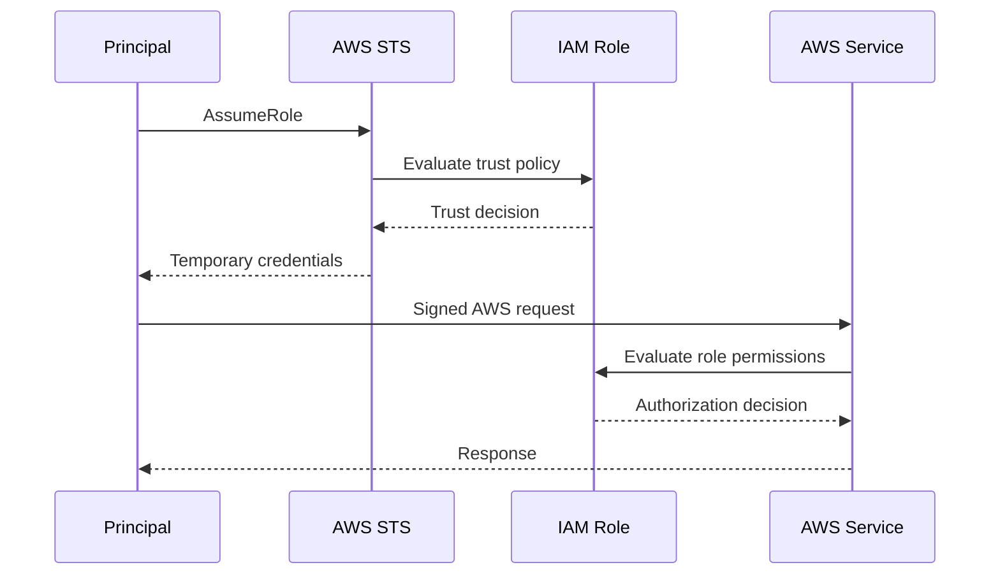
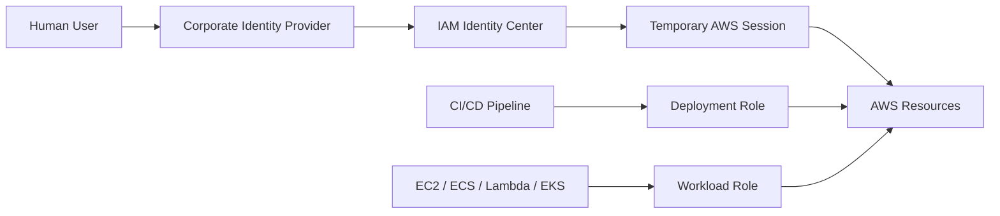

# 02- Users, Groups and Roles

## Overview

AWS IAM provides several identity primitives for controlling access to AWS resources. The three foundational identity objects are **users, groups, and roles**.

They solve different problems:

| IAM entity | Represents | Credentials | Primary use |
|---|---|---|---|
| User | A persistent IAM identity | Long-lived credentials can exist | Legacy or specialized human/service access |
| Group | A collection of users | None | Organizing user permissions |
| Role | An assumable identity | Temporary credentials | Workloads, federation, cross-account access |

The important distinction is that **users and roles are identities, while groups are primarily a permission-management mechanism for users**.

For modern backend systems, roles are usually the most important of the three because they support temporary credentials and clean separation between the workload and the human who operates it.

A practical mental model is:

```text
Human or Workload
        |
        v
     Identity
        |
        +-------------------+
        |                   |
      User                Role
        |                   |
      Group              AssumeRole
        |                   |
        +--------+----------+
                 |
                 v
              Policies
                 |
                 v
          AWS Authorization
```

---

## IAM Users

An IAM user is a persistent identity inside an AWS account.

A user can have permissions through:

- Policies attached directly to the user
- Group membership
- Other applicable IAM authorization mechanisms

A user may also have authentication credentials such as:

- AWS Management Console password
- Access keys
- MFA configuration

The presence of a user does not itself grant permissions. The user still requires appropriate authorization policies.

---

## Why IAM Users Exist

IAM users predate many of the centralized identity and federation capabilities commonly used today.

They remain useful for:

- Legacy integrations
- Specialized environments
- Certain automation systems that cannot use role-based authentication
- Specific administrative workflows where a persistent IAM identity is explicitly required

However, creating an IAM user for every employee or application is generally not the preferred modern architecture.

For human access, organizations commonly prefer centralized identity with IAM Identity Center or an external identity provider.

For workloads, IAM roles are generally preferred.

---

## User Authentication vs User Authorization

A user can have valid credentials and still be unable to perform an AWS action.

For example:

```text
IAM User
    |
    +--> Access Key
    |
    v
AWS API Request
    |
    v
Policy Evaluation
    |
    +--> Allow
    |
    +--> Deny
```

Authentication answers:

> Can AWS verify this identity?

Authorization answers:

> Is this identity allowed to perform this operation?

Keeping these concepts separate is essential when troubleshooting IAM.

---

## IAM User Access Keys

Access keys provide programmatic access to AWS APIs.

A credential pair contains:

```text
Access Key ID
Secret Access Key
```

Applications can use these credentials to authenticate API requests.

A typical SDK-based application might use them through the AWS credential provider chain:

```python
import boto3

s3 = boto3.client("s3")

response = s3.list_buckets()

for bucket in response["Buckets"]:
    print(bucket["Name"])
```

The code does not need to explicitly contain the access key.

That is important because application code should not be tightly coupled to a specific credential source.

### Why Long-Lived Access Keys Are Risky

Long-lived credentials create an operational burden:

- They must be protected.
- They may be copied into multiple systems.
- They may remain valid after a developer leaves a team.
- They can leak through logs or source control.
- Rotation can require application changes.
- Their effective lifetime can be difficult to control.

For supported workloads, temporary role credentials are generally preferable.

---

## IAM Groups

An IAM group is a collection of IAM users.

Groups are useful for assigning common permissions to multiple users without attaching the same policy separately to every user.

Example:

```text
Backend Developers
    |
    +-- Alice
    +-- Bob
    +-- Charlie
```

A policy can be attached to the group:

```text
Backend Developers Group
          |
          v
   ReadOnly Policies
          |
          +-- Alice
          +-- Bob
          +-- Charlie
```

This simplifies permission administration when many IAM users need the same access.

---

## Why Groups Exist

Without groups, common permissions would have to be managed user by user.

For example:

```text
Alice  ---> DeveloperPolicy
Bob    ---> DeveloperPolicy
Charlie --> DeveloperPolicy
David  ---> DeveloperPolicy
```

Changing the permission model then requires managing many user relationships.

With a group:

```text
Backend Developers
        |
        v
DeveloperPolicy
        |
        +-- Alice
        +-- Bob
        +-- Charlie
        +-- David
```

The permission boundary becomes easier to reason about.

---

## Groups Do Not Authenticate

A group is not an identity that can:

- Sign in to AWS
- Assume a role
- Obtain AWS credentials
- Call AWS APIs

Groups exist to organize IAM users and their permissions.

This distinction is frequently tested in interviews because groups look like identities from an administrative perspective but behave differently from users and roles.

---

## IAM Roles

An IAM role is an identity that can be assumed by a trusted principal.

Unlike an IAM user, a role does not have a permanent username/password credential pair or a permanent access key used directly by the workload.

Instead, a principal assumes the role and receives temporary security credentials.

```text
Principal
    |
    | AssumeRole
    v
IAM Role
    |
    v
Temporary Credentials
    |
    v
AWS API
```

Roles are fundamental to modern AWS backend architecture.

---

## Why Roles Exist

Roles solve several problems that become difficult with static credentials.

They provide:

- Temporary credentials
- Separation between identity and credential lifetime
- Cross-account access
- Workload identity
- Federation
- Service integration
- Fine-grained authorization boundaries

A role allows the same logical permission model to be used by different workloads without embedding a permanent credential inside the application.

---

## Role Trust Policy

Every role has a trust policy that defines **who is allowed to assume the role**.

Example:

```json
{
    "Version": "2012-10-17",
    "Statement": [
        {
            "Effect": "Allow",
            "Principal": {
                "Service": "ec2.amazonaws.com"
            },
            "Action": "sts:AssumeRole"
        }
    ]
}
```

This trust relationship says that EC2 is trusted to assume the role.

The trust policy answers:

> Who can become this role?

It does not answer:

> What can the role do after it is assumed?

That second question is handled by the role's permissions policies.

---

## Role Permissions Policy

A role also needs permissions describing what the assumed identity can do.

Example:

```json
{
    "Version": "2012-10-17",
    "Statement": [
        {
            "Effect": "Allow",
            "Action": [
                "s3:GetObject",
                "s3:ListBucket"
            ],
            "Resource": [
                "arn:aws:s3:::company-assets",
                "arn:aws:s3:::company-assets/*"
            ]
        }
    ]
}
```

The two policies work together:

```text
Trust Policy
    |
    | Who can assume?
    v
IAM Role
    |
    | What can it do?
    v
Permission Policies
```

A role assumption can therefore fail even when the role has the correct permissions, because the trust relationship is incorrect.

---

## IAM Role Lifecycle

A simplified role lifecycle looks like this:



The exact implementation varies by AWS service, but the conceptual separation is useful:

1. A trusted principal obtains role credentials.
2. AWS issues temporary credentials.
3. The principal uses those credentials.
4. AWS evaluates the role's effective permissions for each request.

---

## Temporary Credentials

Temporary credentials typically consist of:

```text
Access Key ID
Secret Access Key
Session Token
Expiration
```

They are short-lived compared with permanent access keys.

This reduces the operational impact of accidental exposure because the credentials naturally expire.

However, temporary credentials are not automatically safe. An attacker who obtains valid temporary credentials can use them until they expire or are otherwise invalidated through the available controls.

Temporary credentials therefore complement, rather than replace, least-privilege design.

---

## Role Sessions

When a principal assumes a role, AWS creates a role session.

Conceptually:

```text
Role
    |
    +-- Session A
    |
    +-- Session B
    |
    +-- Session C
```

Different callers can assume the same role and create separate sessions.

Session metadata can be used for:

- Auditing
- Identifying callers
- Session restrictions
- Operational diagnostics

The effective permissions of a role session are determined by the applicable role permissions and any additional authorization controls that constrain the session.

---

## Role Chaining

Role chaining occurs when a principal assumes one role and then uses that role session to assume another role.

Conceptually:

```text
Principal
    |
    v
Role A
    |
    v
Role B
    |
    v
AWS Resource
```

Role chaining can be useful in specialized multi-account or delegated-access architectures, but excessive chaining increases operational complexity.

Long role chains can make it difficult to answer:

- Who originally initiated the request?
- Which trust relationship failed?
- Which session is currently active?
- Where did the effective permissions originate?

Prefer clear trust relationships and minimize unnecessary role hops.

---

## IAM Roles for AWS Services

AWS services commonly use IAM roles to obtain permissions without embedding long-lived credentials.

### EC2

An EC2 instance can receive an IAM role through an instance profile.

```text
EC2 Instance
     |
     v
Instance Profile
     |
     v
IAM Role
     |
     v
Temporary Credentials
```

The application running on the instance can then use the role through the AWS SDK.

### Lambda

A Lambda function uses an execution role.

```text
Lambda Function
      |
      v
Execution Role
      |
      v
AWS Permissions
```

For example, a Lambda function might need:

```text
logs:CreateLogGroup
logs:CreateLogStream
logs:PutLogEvents
```

in addition to permissions required for the application workload.

### ECS

ECS distinguishes between the **task role** and **task execution role**.

| Role | Used by |
|---|---|
| Task role | Application containers |
| Task execution role | ECS infrastructure operations |

A container that needs to read S3 should receive that access through the task role.

Do not grant application permissions to the execution role simply because the task already uses it.

---

## Service-Linked Roles

A service-linked role is a special IAM role that is directly linked to an AWS service.

It allows AWS services to perform actions in an AWS account on behalf of the service.

Examples of use cases include AWS services managing resources required for their own operation.

Service-linked roles have special lifecycle semantics and are managed in coordination with the associated service.

They should not be treated as general-purpose application roles.

---

## IAM Users vs Groups vs Roles

| Characteristic | User | Group | Role |
|---|---|---|---|
| Represents an identity | Yes | No | Yes |
| Can authenticate directly | Yes | No | No |
| Can have access keys | Yes | No | No |
| Can be assumed | Not in the same way as a role | No | Yes |
| Has trust policy | No | No | Yes |
| Supports temporary credentials | Not inherently | No | Yes |
| Useful for workload identity | Limited | No | Yes |
| Useful for grouping users | No | Yes | No |
| Cross-account usage | Limited | No | Strong fit |
| Typical modern workload choice | No | No | Yes |

---

## Human Identity Architecture

For human users, a modern architecture often separates workforce identity from AWS account-local IAM identities.

```text
Employee
    |
    v
Corporate Identity Provider
    |
    v
IAM Identity Center / Federation
    |
    v
Temporary AWS Session
    |
    +--> Development Account
    +--> Staging Account
    +--> Production Account
```

This provides a clearer separation between:

- Employee identity
- AWS account access
- Permission assignment
- Session lifetime

A user changing teams or leaving the organization can be handled through centralized identity controls rather than manually rotating credentials scattered across AWS accounts.

---

## Workload Identity Architecture

Production applications should normally authenticate using workload-specific roles.

For example:

```text
                    AWS Account
                         |
        +----------------+----------------+
        |                                 |
        v                                 v
   Order Service                    Payment Service
        |                                 |
        v                                 v
 OrderServiceRole                  PaymentServiceRole
        |                                 |
        v                                 v
  SQS + DynamoDB                  Secrets Manager
```

Each service receives only the permissions needed for its own responsibilities.

This is much easier to audit than a single shared application credential.

---

## Backend Example: Django

Suppose a Django service generates invoices and stores them in S3.

A poor design is:

```text
Django
   |
   v
Access Key stored in .env
   |
   v
S3
```

A better design is:

```text
Django on ECS
      |
      v
ECS Task Role
      |
      v
S3 PutObject
```

The Django code remains credential-source agnostic:

```python
import boto3

s3 = boto3.client("s3")

s3.upload_file(
    "invoice.pdf",
    "company-invoices",
    "generated/invoice.pdf",
)
```

The infrastructure provides the identity; application code requests the AWS operation.

This improves portability between local development, ECS, Lambda, and other supported runtimes.

---

## Backend Example: FastAPI

A FastAPI service can use the same role-based pattern.

```python
import boto3
from fastapi import FastAPI

app = FastAPI()
s3 = boto3.client("s3")


@app.get("/reports/{report_name}")
def get_report(report_name: str):
    response = s3.get_object(
        Bucket="company-reports",
        Key=f"generated/{report_name}",
    )

    return {
        "content_length": response["ContentLength"],
    }
```

The application does not need to contain AWS access keys.

The runtime supplies credentials through the environment-specific AWS credential provider.

---

## Roles and Microservices

For a microservice architecture, avoid assigning one highly privileged role to every service.

Instead:

```text
User Service Role
    └── DynamoDB UserTable access

Order Service Role
    ├── SQS SendMessage
    └── DynamoDB OrderTable access

Worker Service Role
    ├── SQS ReceiveMessage
    └── S3 PutObject
```

This limits the blast radius if one service is compromised.

It also produces a clearer authorization model:

```text
Service
   ↓
Role
   ↓
Specific AWS actions
   ↓
Specific resources
```

---

## Cross-Account Roles

Roles are also the standard mechanism for many cross-account access designs.

Example:

```text
Account A
CI/CD Pipeline
     |
     | AssumeRole
     v
Account B
DeploymentRole
     |
     v
Production Resources
```

The target role's trust policy determines whether the source principal can assume it.

The target role's permissions determine what the caller can do after assumption.

This separation allows AWS accounts to establish controlled trust boundaries.

---

## When to Use Users

Use IAM users only when there is a clear reason that role-based or centralized identity does not adequately solve the problem.

Potential cases include:

- Legacy systems
- Specialized integrations
- Explicitly controlled automation requirements

Before creating a user, ask:

```text
Can this workload use an IAM role?
Can this human use IAM Identity Center or federation?
Can temporary credentials solve the requirement?
```

If the answer is yes, a long-lived IAM user credential may be unnecessary.

---

## When to Use Groups

Groups make sense when multiple IAM users have materially similar access requirements.

Examples:

```text
Developers
Operations
ReadOnlyAuditors
SecurityTeam
```

Groups are less relevant when the organization uses centralized workforce identity and permission sets through IAM Identity Center.

In that architecture, access management moves toward identity-provider groups and permission assignments rather than large collections of account-local IAM users.

---

## When to Use Roles

Roles are generally the preferred identity mechanism for:

- EC2 applications
- Lambda functions
- ECS tasks
- EKS workloads
- CI/CD systems
- Cross-account access
- Federated users
- Service-to-service AWS authorization

A useful production rule is:

> If a process needs AWS API access and can use a role, prefer the role over a long-lived access key.

---

## Security Considerations

### Separate Trust From Permissions

Treat these as two independent questions:

```text
Trust Policy
    Who can assume this role?

Permission Policy
    What can the role do?
```

Incorrectly broad trust can allow an unintended principal to obtain powerful credentials.

Incorrectly broad permissions can allow a legitimate principal to perform dangerous actions.

Both need independent review.

### Avoid Shared Credentials

Do not distribute a single IAM user's access key to multiple applications.

Shared credentials make:

- Ownership unclear
- Auditing harder
- Rotation harder
- Incident response slower

Create workload-specific identities instead.

### Apply Least Privilege

A service that needs:

```text
s3:GetObject
```

should not automatically receive:

```text
s3:*
```

A role that only writes generated files should not automatically receive permissions to delete production data.

---

## Common Mistakes and Pitfalls

### Giving Applications IAM Users

```text
Application
   |
   v
IAM User Access Key
```

This creates long-lived credentials.

Prefer:

```text
Application
   |
   v
IAM Role
   |
   v
Temporary Credentials
```

### Confusing Role Trust With Role Permissions

A role can contain the correct S3 permissions and still fail to be assumed.

Check the trust policy first when `AssumeRole` fails.

### Using One Role for Everything

A role such as:

```text
EverythingInAWSRole
```

creates excessive blast radius.

Use narrowly scoped roles based on workload responsibility.

### Treating Groups as Roles

A group cannot be assumed and cannot provide temporary credentials.

Groups organize users; roles represent assumable identities.

### Hard-Coding Credentials in Containers

This pattern is risky:

```dockerfile
ENV AWS_ACCESS_KEY_ID=...
ENV AWS_SECRET_ACCESS_KEY=...
```

Credentials should not be baked into the image.

Use the runtime's identity mechanism instead.

### Reusing Human Credentials for Automation

A CI/CD pipeline should not depend on the access key belonging to an engineer.

Use a dedicated deployment identity with controlled permissions.

---

## Operational Troubleshooting

When access fails, identify which identity is actually making the request.

For a CLI environment:

```bash
aws sts get-caller-identity
```

Example:

```json
{
    "UserId": "AROAXXXXXXXXXXXXX:deployment",
    "Account": "123456789012",
    "Arn": "arn:aws:sts::123456789012:assumed-role/DeploymentRole/deployment"
}
```

This immediately answers important questions:

- Which AWS account is active?
- Is the caller an IAM user or assumed role?
- Is the expected role being used?
- Is a local developer credential accidentally being used?
- Is the CI/CD environment authenticated as expected?

For a role-related failure, reason through:

```text
Who is calling?
    ↓
Which role is being requested?
    ↓
Does the trust policy allow the caller?
    ↓
Was the role successfully assumed?
    ↓
Which permissions does the role have?
    ↓
Is the requested action allowed?
    ↓
Is another policy or condition restricting the request?
```

This avoids the common mistake of immediately broadening permissions without identifying the actual failure.

---

## Production Design Guidelines

For a production AWS environment:

- Use centralized workforce identity for human access where practical.
- Prefer IAM roles for application workloads.
- Use separate roles for materially different services and trust boundaries.
- Keep role trust policies narrow.
- Keep permissions policies scoped to required actions and resources.
- Use temporary credentials rather than distributing long-lived access keys.
- Avoid shared IAM users across teams or applications.
- Review and remove unused identities regularly.
- Treat identity design as part of system architecture, not as an infrastructure afterthought.
- Make IAM changes auditable through controlled infrastructure and deployment processes.
- Design cross-account trust explicitly rather than relying on broad account-level access.

---

## Interview Perspective

### User vs Role

The key distinction is credential lifecycle and assumption model.

```text
User
    Persistent identity
    Often associated with long-lived credentials

Role
    Assumable identity
    Temporary credentials
    Designed for workloads and delegated access
```

### User vs Group

A user is an identity.

A group is a collection used to manage permissions for users.

### Group vs Role

A group:

```text
Organizes users
```

A role:

```text
Provides an assumable identity
```

### Trust Policy vs Permission Policy

Trust policy:

```text
Who can assume the role?
```

Permission policy:

```text
What can the role do?
```

### Why Roles Are Preferred for Workloads

Roles provide a cleaner identity boundary and temporary credentials, avoiding the operational burden and exposure risk associated with distributing long-lived access keys.

---

## Senior-Level Design Pattern

A mature AWS identity architecture often looks like this:



The resulting design separates three different trust relationships:

```text
Human Identity
    ≠
Deployment Identity
    ≠
Application Identity
```

That separation is important for security, auditing, incident response, and long-term maintainability.

---

## Key Takeaways

- **IAM users** are persistent identities, **groups** organize user permissions, and **roles** are assumable identities designed heavily around temporary credentials and delegated access.
- A role has two distinct authorization concerns: its **trust policy** determines who can assume it, while its permission policies determine what the assumed identity can do.
- Modern backend workloads should generally use **role-based workload identity** instead of embedding long-lived IAM user access keys in applications, containers, or CI/CD systems.
- Separate identities by workload and trust boundary so that a compromise of one service does not automatically grant unrelated AWS permissions.
- When debugging IAM, first identify the **actual principal** being used; `aws sts get-caller-identity` is a useful starting point before changing policies.