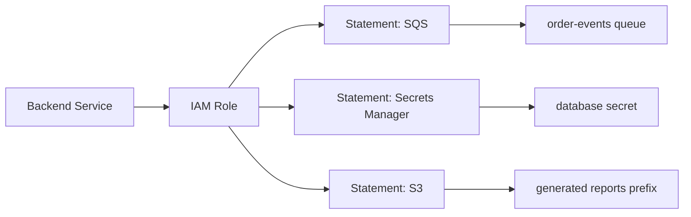
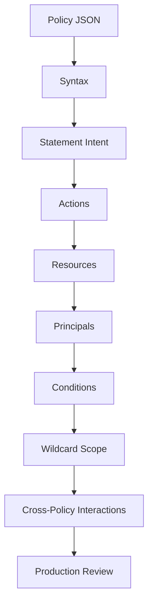

# 05- IAM Policy Structure

## Overview

An AWS IAM policy is a structured JSON document that describes an authorization rule. The structure is simple enough to read directly, but the interaction between its elements becomes increasingly important as policies support multiple actions, resources, principals, conditions, and wildcard patterns.

A useful abstraction is:

```text
Policy
    |
    +-- Version
    |
    +-- Statement[]
            |
            +-- Sid
            +-- Effect
            +-- Principal
            +-- Action / NotAction
            +-- Resource / NotResource
            +-- Condition
```

A policy statement can be read as:

```text
Who
  +
What operation
  +
On which resource
  +
Under which conditions
  +
Allow or deny
```

For example:

```json
{
    "Version": "2012-10-17",
    "Statement": [
        {
            "Sid": "ReadReports",
            "Effect": "Allow",
            "Action": "s3:GetObject",
            "Resource": "arn:aws:s3:::company-reports/reports/*"
        }
    ]
}
```

The JSON structure itself does not determine the final authorization result. AWS evaluates the policy together with the principal, request context, other applicable policies, and service-specific authorization rules.

---

## Policy Document Grammar

At the structural level, an IAM policy consists of a policy-level `Version` and one or more `Statement` objects.

Conceptually:

```text
Policy
    Version
    Statement
        Statement
            Effect
            Action
            Resource
            ...
```

The policy can contain a single statement:

```json
{
    "Version": "2012-10-17",
    "Statement": {
        "Effect": "Allow",
        "Action": "s3:GetObject",
        "Resource": "arn:aws:s3:::company-reports/*"
    }
}
```

or an array of statements:

```json
{
    "Version": "2012-10-17",
    "Statement": [
        {
            "Effect": "Allow",
            "Action": "s3:GetObject",
            "Resource": "arn:aws:s3:::company-reports/*"
        },
        {
            "Effect": "Allow",
            "Action": "s3:ListBucket",
            "Resource": "arn:aws:s3:::company-reports"
        }
    ]
}
```

For maintainable production policies, multiple statements are usually preferable when different permissions have different purposes.

---

## Policy-Level Elements

The primary policy-level elements are:

| Element | Required | Purpose |
|---|---:|---|
| `Version` | Yes | Policy language version |
| `Statement` | Yes | One or more authorization statements |

The `Statement` object then contains the actual authorization rules.

---

## Version

The policy `Version` specifies the version of the IAM policy language.

Use:

```json
"Version": "2012-10-17"
```

for current policy documents.

Do not confuse this with managed policy revisioning.

```text
Policy language version
    Version: "2012-10-17"

Managed policy revisions
    v1
    v2
    v3
    ...
```

These are separate concepts.

The language version belongs inside the policy document. Managed policy versions are IAM objects representing different revisions of a managed policy.

---

## Statement

`Statement` contains the policy's authorization rules.

Each statement should represent a coherent permission decision.

Example:

```json
{
    "Sid": "PublishOrderEvents",
    "Effect": "Allow",
    "Action": "sqs:SendMessage",
    "Resource": "arn:aws:sqs:ap-south-1:123456789012:order-events"
}
```

A policy with several unrelated statements might look like:

```json
{
    "Version": "2012-10-17",
    "Statement": [
        {
            "Sid": "PublishOrders",
            "Effect": "Allow",
            "Action": "sqs:SendMessage",
            "Resource": "arn:aws:sqs:ap-south-1:123456789012:order-events"
        },
        {
            "Sid": "ReadSecrets",
            "Effect": "Allow",
            "Action": "secretsmanager:GetSecretValue",
            "Resource": "arn:aws:secretsmanager:ap-south-1:123456789012:secret:prod/order-service/*"
        }
    ]
}
```

The separation makes policy intent much easier to review.

---

## Statement ID

`Sid` is an optional statement identifier.

Example:

```json
{
    "Sid": "ReadDatabaseSecret",
    "Effect": "Allow",
    "Action": "secretsmanager:GetSecretValue",
    "Resource": "arn:aws:secretsmanager:ap-south-1:123456789012:secret:prod/order-service/db-*"
}
```

A useful `Sid` should communicate intent rather than implementation details.

Prefer:

```text
ReadDatabaseSecret
PublishOrderEvents
WriteGeneratedReports
```

over:

```text
Statement1
PolicyRuleA
TempPermission
```

Meaningful `Sid` values improve:

- Code review
- Infrastructure diffs
- Troubleshooting
- Operational documentation

---

## Effect

`Effect` determines whether a matching statement allows or denies the requested operation.

Valid values:

```text
Allow
Deny
```

Example allow:

```json
{
    "Effect": "Allow",
    "Action": "s3:GetObject",
    "Resource": "arn:aws:s3:::company-reports/*"
}
```

Example explicit deny:

```json
{
    "Effect": "Deny",
    "Action": "s3:DeleteObject",
    "Resource": "arn:aws:s3:::company-reports/*"
}
```

An explicit deny is different from simply not having an allow.

```text
No applicable Allow
    → implicit deny

Applicable Allow
    → permission may be granted

Applicable explicit Deny
    → permission denied
```

Detailed policy evaluation across multiple policy sources is a separate concern, but the distinction between implicit and explicit deny is fundamental to IAM reasoning.

---

## Action

`Action` identifies the AWS operation to which the statement applies.

Examples:

```text
s3:GetObject
s3:PutObject
sqs:SendMessage
dynamodb:GetItem
secretsmanager:GetSecretValue
ec2:DescribeInstances
iam:PassRole
```

A single statement can specify multiple actions:

```json
{
    "Effect": "Allow",
    "Action": [
        "s3:GetObject",
        "s3:PutObject"
    ],
    "Resource": "arn:aws:s3:::company-reports/generated/*"
}
```

The JSON type can therefore be either:

```text
string
```

or:

```text
array of strings
```

Both are valid representations.

---

## Action Wildcards

IAM supports wildcard matching for actions.

Example:

```json
{
    "Effect": "Allow",
    "Action": "logs:Describe*",
    "Resource": "*"
}
```

Another example:

```json
{
    "Effect": "Allow",
    "Action": "s3:Get*",
    "Resource": "arn:aws:s3:::company-reports/*"
}
```

Wildcards should be used only when the entire action family is actually required.

Avoid broad patterns such as:

```text
s3:*
iam:*
ec2:*
```

for normal application roles.

A useful principle is:

```text
Specific action
    ↓
Small justified action family
    ↓
Broad wildcard only when explicitly required
```

---

## `NotAction`

`NotAction` is the inverse-style action element.

Instead of listing actions that the statement applies to, it specifies actions that should be excluded.

Conceptually:

```json
{
    "Effect": "Deny",
    "NotAction": [
        "s3:GetObject"
    ],
    "Resource": "arn:aws:s3:::company-reports/*"
}
```

This form can be powerful, but it is also easier to misunderstand because the effective scope changes when AWS adds new API actions or when the policy's resource and conditions change.

For application permissions, explicit `Action` lists are usually easier to reason about.

Use `NotAction` deliberately for scenarios where its inverse semantics are actually useful.

---

## Resource

`Resource` identifies the AWS resource targeted by the statement.

Example:

```json
{
    "Effect": "Allow",
    "Action": "sqs:SendMessage",
    "Resource": "arn:aws:sqs:ap-south-1:123456789012:order-events"
}
```

The resource can be:

- A single ARN
- Multiple ARNs
- A wildcard
- A service-defined ARN pattern

Example with multiple resources:

```json
{
    "Effect": "Allow",
    "Action": "sqs:SendMessage",
    "Resource": [
        "arn:aws:sqs:ap-south-1:123456789012:order-events",
        "arn:aws:sqs:ap-south-1:123456789012:retry-events"
    ]
}
```

Resource scope is one of the most important controls for least privilege.

---

## `NotResource`

`NotResource` is the inverse-style resource element.

It specifies resources that the statement does not apply to.

For example:

```json
{
    "Effect": "Deny",
    "Action": "s3:DeleteObject",
    "NotResource": [
        "arn:aws:s3:::company-reports/archive/*"
    ]
}
```

Conceptually:

```text
Apply the statement to
everything except the specified resource set
```

`NotResource` can be difficult to review because it defines scope negatively.

For most application authorization, explicit `Resource` values are easier to understand and maintain.

---

## Resource Wildcards

Wildcards can be used to cover resource families.

Example:

```json
{
    "Effect": "Allow",
    "Action": "s3:GetObject",
    "Resource": "arn:aws:s3:::company-reports/generated/*"
}
```

This limits object access to the specified prefix.

Prefer:

```text
arn:aws:s3:::company-reports/generated/*
```

over:

```text
arn:aws:s3:::company-reports/*
```

when the application has no reason to read every object.

The wildcard is part of the authorization boundary, not merely a convenience for writing shorter JSON.

---

## Principal

`Principal` identifies the entity to which a resource-based policy statement applies.

Example:

```json
{
    "Effect": "Allow",
    "Principal": {
        "AWS": "arn:aws:iam::123456789012:role/ReportingRole"
    },
    "Action": "s3:GetObject",
    "Resource": "arn:aws:s3:::company-reports/*"
}
```

`Principal` is commonly used in:

- Resource-based policies
- IAM role trust policies

It is not normally included in an identity-based permission policy attached to a user, group, or role.

The policy location determines whether the principal is explicit or implicit.

```text
Identity-based policy
    Principal is implicit

Resource-based policy
    Principal is explicit
```

---

## Principal Types

A `Principal` can represent different supported entity types.

Examples:

```json
{
    "Principal": {
        "AWS": "arn:aws:iam::123456789012:role/OrderServiceRole"
    }
}
```

```json
{
    "Principal": {
        "Service": "lambda.amazonaws.com"
    }
}
```

```json
{
    "Principal": {
        "AWS": "123456789012"
    }
}
```

Wildcards are also supported in certain resource-based policy scenarios:

```json
{
    "Principal": "*"
}
```

However, a wildcard principal should be treated as a deliberate security decision, not as a default.

---

## Condition

`Condition` adds contextual requirements to a statement.

Example:

```json
{
    "Effect": "Allow",
    "Action": "s3:GetObject",
    "Resource": "arn:aws:s3:::company-reports/*",
    "Condition": {
        "StringEquals": {
            "aws:RequestedRegion": "ap-south-1"
        }
    }
}
```

The statement is applicable only when the condition evaluates as required.

Conditions can constrain requests using context such as:

- Region
- Principal attributes
- Source identity
- IP address
- MFA state
- Resource tags
- Organization membership
- Request attributes
- Time
- Transport security context

Conditions are particularly useful when static `Action` and `Resource` matching is insufficient.

---

## Condition Structure

A condition has the general form:

```text
Condition
    ↓
Condition Operator
    ↓
Condition Key
    ↓
Expected Value
```

Example:

```json
{
    "Condition": {
        "StringEquals": {
            "aws:RequestedRegion": "ap-south-1"
        }
    }
}
```

Another example:

```json
{
    "Condition": {
        "Bool": {
            "aws:SecureTransport": "true"
        }
    }
}
```

The meaning of a condition depends on the selected operator and condition key.

---

## Condition Operators

Common operator families include:

| Operator family | Typical purpose |
|---|---|
| `StringEquals` | Exact string matching |
| `StringLike` | Pattern-based string matching |
| `ArnEquals` | Exact ARN matching |
| `ArnLike` | ARN pattern matching |
| `Bool` | Boolean context |
| `IpAddress` | IP-based restriction |
| `NotIpAddress` | Exclude IP ranges |
| `NumericEquals` | Exact numeric comparison |
| `DateEquals` | Exact date comparison |

Example:

```json
{
    "Condition": {
        "IpAddress": {
            "aws:SourceIp": [
                "203.0.113.0/24"
            ]
        }
    }
}
```

Do not select operators based only on their names. Condition keys have specific data types and evaluation semantics.

---

## Multiple Conditions

A statement can contain multiple condition operators and keys.

Example:

```json
{
    "Condition": {
        "Bool": {
            "aws:SecureTransport": "true"
        },
        "StringEquals": {
            "aws:RequestedRegion": "ap-south-1"
        }
    }
}
```

The authorization meaning depends on how the operators and keys are combined.

When policies become condition-heavy, keep the intent explicit and avoid creating authorization logic that is difficult to test.

---

## Policy Arrays and Strings

IAM JSON accepts either a scalar string or an array for several policy elements.

Single action:

```json
{
    "Action": "s3:GetObject"
}
```

Multiple actions:

```json
{
    "Action": [
        "s3:GetObject",
        "s3:PutObject"
    ]
}
```

Single resource:

```json
{
    "Resource": "arn:aws:s3:::company-reports/*"
}
```

Multiple resources:

```json
{
    "Resource": [
        "arn:aws:s3:::company-reports/*",
        "arn:aws:s3-archive:::company-reports/*"
    ]
}
```

Use arrays when multiple values share the same:

- Effect
- Statement intent
- Conditions
- Authorization semantics

If two permissions have materially different intent or conditions, separate them into separate statements.

---

## Grouping Actions in Statements

This is reasonable:

```json
{
    "Sid": "ReadOrderEvents",
    "Effect": "Allow",
    "Action": [
        "sqs:ReceiveMessage",
        "sqs:DeleteMessage",
        "sqs:GetQueueAttributes"
    ],
    "Resource": "arn:aws:sqs:ap-south-1:123456789012:order-events"
}
```

The actions form one coherent responsibility:

```text
Consume messages from order-events
```

However, this is harder to maintain:

```json
{
    "Sid": "EverythingForApplication",
    "Effect": "Allow",
    "Action": [
        "sqs:ReceiveMessage",
        "sqs:DeleteMessage",
        "s3:GetObject",
        "dynamodb:GetItem",
        "secretsmanager:GetSecretValue",
        "ec2:DescribeInstances"
    ],
    "Resource": "*"
}
```

Unrelated responsibilities should normally be expressed as separate statements or separate policies.

---

## Statement Design

A useful production principle is:

> One statement should represent one coherent authorization intent.

For example:

```text
Statement A
    Read order events

Statement B
    Publish order events

Statement C
    Read database secret
```

rather than:

```text
Statement A
    Everything required by the entire application
```

This improves:

- Code review
- Security analysis
- Troubleshooting
- Change isolation
- Auditability

---

## A Production-Grade Policy Example

Consider an order-processing worker that:

- Reads messages from one SQS queue
- Deletes successfully processed messages
- Reads one application secret
- Writes generated reports to one S3 prefix

A structured policy might look like:

```json
{
    "Version": "2012-10-17",
    "Statement": [
        {
            "Sid": "ConsumeOrderEvents",
            "Effect": "Allow",
            "Action": [
                "sqs:ReceiveMessage",
                "sqs:DeleteMessage",
                "sqs:GetQueueAttributes"
            ],
            "Resource": "arn:aws:sqs:ap-south-1:123456789012:order-events"
        },
        {
            "Sid": "ReadDatabaseSecret",
            "Effect": "Allow",
            "Action": "secretsmanager:GetSecretValue",
            "Resource": "arn:aws:secretsmanager:ap-south-1:123456789012:secret:prod/order-worker/db-*"
        },
        {
            "Sid": "WriteGeneratedReports",
            "Effect": "Allow",
            "Action": "s3:PutObject",
            "Resource": "arn:aws:s3:::company-reports/generated/*"
        }
    ]
}
```

The policy is easier to reason about because each statement maps to a concrete backend responsibility.

---

## Policy Structure and Backend Architecture

IAM policy structure becomes particularly useful when aligned with service architecture.



The mapping becomes:

```text
Application responsibility
        ↓
IAM permission
        ↓
AWS action
        ↓
Specific resource
```

This is much easier to review than a generic application role with hundreds of unrelated permissions.

---

## Policy Structure in CI/CD

IAM policies are frequently generated or managed through infrastructure-as-code.

A typical repository layout might be:

```text
infrastructure/
    iam/
        roles/
            order-service-role
        policies/
            order-service-policy.json
        trust/
            ecs-task-trust.json
```

A policy change then follows:

```text
Policy Source
    ↓
Version Control
    ↓
Code Review
    ↓
Validation
    ↓
CI/CD
    ↓
AWS
```

This provides a controlled change history for authorization rules.

Avoid making significant production policy changes directly in the console without recording the resulting configuration in the infrastructure source of truth.

---

## Policy Structure for Python Applications

A Python application normally should not contain IAM policy logic in business code.

For example:

```python
import boto3

sqs = boto3.client("sqs")

sqs.send_message(
    QueueUrl="https://sqs.ap-south-1.amazonaws.com/123456789012/order-events",
    MessageBody='{"order_id": "ORD-12345"}',
)
```

The Python application requests an AWS operation.

The infrastructure and IAM configuration determine whether that operation is authorized.

```text
Python Application
        ↓
boto3
        ↓
AWS Credential Provider
        ↓
IAM Principal
        ↓
IAM Policies
        ↓
AWS Service
```

This separation keeps application code independent from the exact IAM policy implementation.

---

## Policy Variables

IAM supports policy variables that allow runtime context values to be incorporated into supported policy elements.

Example:

```json
{
    "Version": "2012-10-17",
    "Statement": [
        {
            "Effect": "Allow",
            "Action": "s3:*",
            "Resource": "arn:aws:s3:::company-home/${aws:username}/*"
        }
    ]
}
```

Variables can be useful for identity-dependent authorization patterns.

However, they increase policy dynamism and should be used only when they make the authorization model clearer.

For application workloads, explicit role-to-resource mappings are often easier to reason about than highly dynamic policies.

---

## ARN Construction Inside Policies

Resource ARNs are often the most error-prone part of a policy.

Examples:

```text
IAM role
arn:aws:iam::123456789012:role/OrderServiceRole

SQS queue
arn:aws:sqs:ap-south-1:123456789012:order-events

Lambda function
arn:aws:lambda:ap-south-1:123456789012:function:invoice-generator

DynamoDB table
arn:aws:dynamodb:ap-south-1:123456789012:table/Orders
```

Do not assume every AWS service uses the same ARN pattern.

A policy should use the exact resource identifier expected by the target service.

---

## Global and Regional Policy Targets

Policy structure does not imply that all resources are regional.

For example, an IAM role ARN is global:

```text
arn:aws:iam::123456789012:role/OrderServiceRole
```

An SQS queue ARN is regional:

```text
arn:aws:sqs:ap-south-1:123456789012:order-events
```

This matters when generating policies programmatically.

A deployment system may need:

```text
Account
    +
Region
    +
Resource Name
    ↓
Exact ARN
```

while IAM resources may omit the region component.

---

## Advanced Statement Elements

IAM supports additional statement elements beyond the common `Action`, `Resource`, and `Condition` model.

These include:

```text
NotAction
NotResource
NotPrincipal
```

They are useful for specialized deny and inverse-matching patterns.

However, they should be treated as advanced policy constructs.

For most application roles, the default engineering preference should be:

```text
Explicit Action
+
Explicit Resource
+
Explicit Principal where required
+
Specific Conditions where useful
```

Inverse constructs are more difficult to reason about and can become dangerous when service APIs evolve.

---

## Structural Patterns

### Narrow Application Permission

```json
{
    "Effect": "Allow",
    "Action": "s3:GetObject",
    "Resource": "arn:aws:s3:::company-reports/generated/*"
}
```

### Resource-Based Access

```json
{
    "Effect": "Allow",
    "Principal": {
        "AWS": "arn:aws:iam::123456789012:role/ReportingRole"
    },
    "Action": "s3:GetObject",
    "Resource": "arn:aws:s3:::company-reports/exports/*"
}
```

### Conditional Access

```json
{
    "Effect": "Allow",
    "Action": "s3:GetObject",
    "Resource": "arn:aws:s3:::company-reports/*",
    "Condition": {
        "Bool": {
            "aws:SecureTransport": "true"
        }
    }
}
```

### Explicit Deny

```json
{
    "Effect": "Deny",
    "Action": "s3:DeleteObject",
    "Resource": "arn:aws:s3:::company-reports/archive/*"
}
```

---

## Common Structural Mistakes

| Mistake | Problem | Better approach |
|---|---|---|
| Using `Principal` in an identity policy | Wrong policy model | Let the attached identity be the principal |
| Combining unrelated permissions into one statement | Intent becomes unclear | Split by authorization responsibility |
| Using `Action: "*"` unnecessarily | Excessive permissions | Explicit actions |
| Using `Resource: "*"` when resource-level control exists | Large blast radius | Exact ARN or justified ARN pattern |
| Using `NotAction` casually | Inverse semantics are easy to misunderstand | Prefer explicit actions |
| Using `NotResource` casually | Permission scope becomes hard to inspect | Prefer explicit resources |
| Overusing conditions | Policy becomes difficult to debug | Use conditions where they materially improve security |
| Confusing policy `Version` with managed policy versions | Incorrect operational reasoning | Treat them as separate concepts |
| Writing extremely long statements | Changes become difficult to review | Group by responsibility |
| Treating JSON validity as authorization correctness | Valid JSON can still be insecure | Review semantics and scope |

---

## Policy Review Workflow

A practical policy review should happen in layers.



Review each statement with these questions:

1. What exact capability does this statement provide?
2. Which principal receives it?
3. Which API operations are allowed or denied?
4. Which resources are affected?
5. Are wildcards justified?
6. Are conditions necessary?
7. Could a narrower resource or action scope work?
8. Is the statement reusable, or should it be identity-specific?
9. Does it create an unexpected privilege escalation path?
10. Can another engineer understand the intent without reverse-engineering it?

---

## Security and Operational Considerations

Policy structure directly influences security posture.

### Least Privilege

Scope:

```text
Action
    +
Resource
    +
Condition
```

rather than relying on broad wildcards.

### Blast Radius

A broad policy can turn one compromised workload into an account-wide security problem.

For example:

```text
Compromised Service
    ↓
Broad IAM Role
    ↓
Unrelated AWS Resources
```

A scoped role limits the accessible surface:

```text
Compromised Service
    ↓
Scoped IAM Role
    ↓
Required Resources Only
```

### Maintainability

A policy should remain understandable as the system grows.

Adding a new service should normally produce a deliberate permission change rather than silently expanding a generic policy.

### Auditability

Statement IDs, clear resource names, infrastructure-as-code, and small policy units make permission changes easier to review in source control and investigate during incidents.

---

## Interview Perspective

### What Is the Difference Between `Action` and `Resource`?

```text
Action
    The AWS operation

Resource
    The AWS object on which the operation applies
```

Example:

```text
Action:
    sqs:SendMessage

Resource:
    arn:aws:sqs:ap-south-1:123456789012:order-events
```

### Why Is `Principal` Missing From an Identity-Based Policy?

Because the policy is already attached to the identity that receives the permission.

### Why Split Statements?

Because different permissions often have different:

- Resources
- Actions
- Conditions
- Security implications
- Business responsibilities

Separate statements make authorization intent easier to review.

### Why Avoid `NotAction` and `NotResource` Unless Necessary?

They express permissions through inverse matching, which can be harder to reason about and maintain than explicit allow/deny scope.

### What Is the Most Important Part of a Policy?

There is no single field. Security depends on the relationship between:

```text
Effect
Action
Resource
Principal
Condition
```

A policy with precise actions but a broad principal or resource can still create excessive access.

---

## Practical Mental Model

For every statement, read it as a sentence:

```text
[Principal]
can/cannot
[Action]
against
[Resource]
when
[Condition]
```

For an identity-based policy:

```text
[Attached identity]
can
[s3:GetObject]
against
[company-reports/generated/*]
when
[conditions match]
```

For a resource-based policy:

```text
[ReportingRole]
can
[s3:GetObject]
against
[company-reports/exports/*]
when
[conditions match]
```

This mental model scales from a simple IAM user policy to complex production authorization designs.

---

## Key Takeaways

- An IAM policy is structured around a **policy language version and one or more statements**, with each statement expressing a coherent authorization rule.
- The core statement elements are **Effect, Action, Resource, Principal, and Condition**; the exact elements used depend on the policy type.
- **Action defines what AWS operation is involved, Resource defines the target, Principal defines who receives resource-based access, and Condition adds request-context constraints.**
- Prefer explicit actions and narrowly scoped resources, and use inverse constructs such as `NotAction` or `NotResource` only when their semantics are clearly justified.
- Treat policy JSON as **security-sensitive infrastructure code**: review structure, wildcard scope, resource boundaries, conditions, and statement intent together rather than validating syntax alone.