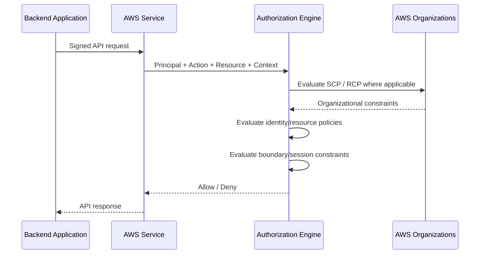
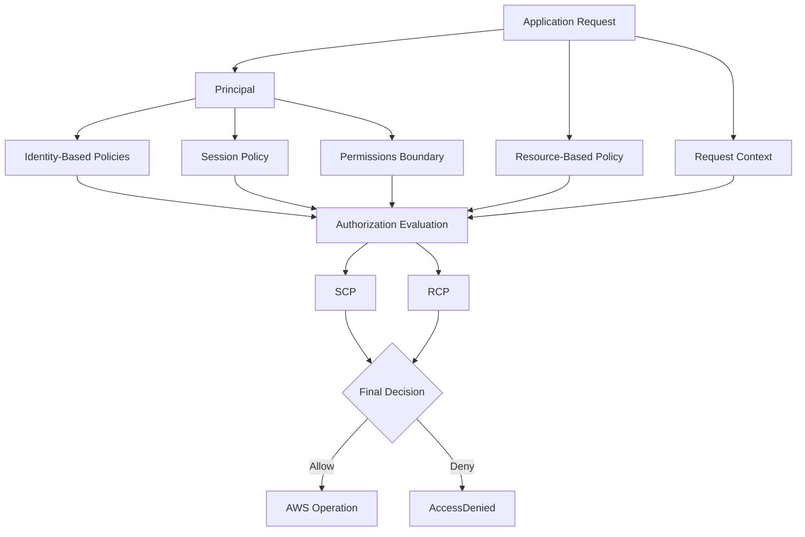

# 06- Policy Evaluation Logic

## Overview

AWS IAM policy evaluation determines whether an authenticated principal is allowed to perform a specific action against a specific resource under a specific request context.

The most important production concept is that AWS does **not** simply find one policy containing `Allow` and stop. The final decision can depend on multiple policy types and authorization controls.

A useful conceptual model is:

```text
Principal
    +
Action
    +
Resource
    +
Request Context
    ↓
Applicable Policies
    ↓
Explicit Deny Check
    ↓
Applicable Allow Check
    ↓
Additional Policy Boundaries
    ↓
Final Decision
    ├── Allow
    └── Deny
```

AWS states that requests are implicitly denied by default. An applicable explicit `Deny` overrides an `Allow`. If there is no explicit deny, AWS evaluates the applicable permissions and authorization boundaries to determine whether the request can be allowed. :contentReference[oaicite:0]{index=0}

For backend engineers, IAM evaluation should be treated as an authorization pipeline rather than a collection of isolated JSON documents.

---

## The Core Authorization Model

Every AWS API request can be reasoned about using four primary inputs:

```text
Who?
    Principal

What?
    Action

Against what?
    Resource

Under what circumstances?
    Request Context
```

Example:

```text
Principal:
    arn:aws:iam::123456789012:role/OrderServiceRole

Action:
    sqs:SendMessage

Resource:
    arn:aws:sqs:ap-south-1:123456789012:order-events

Context:
    Region, source identity, tags, organization state, MFA state, etc.
```

AWS compares the request context against all applicable policies and evaluates whether the requested operation is allowed. :contentReference[oaicite:1]{index=1}

---

## Implicit Deny

Every request starts from an implicit deny.

This means:

```text
No applicable Allow
        ↓
Denied
```

An empty policy does not mean:

```text
Everything allowed
```

It means:

```text
Nothing allowed
```

For example, suppose an ECS task role has no permission for:

```text
s3:GetObject
```

and the application attempts:

```text
GetObject(company-reports/report.pdf)
```

The request is denied because there is no applicable permission granting that action.

This default-deny model is the foundation of least-privilege authorization.

---

## Explicit Allow

An explicit `Allow` is required for a request to become authorized when the applicable authorization model otherwise denies it.

Example:

```json
{
    "Version": "2012-10-17",
    "Statement": [
        {
            "Effect": "Allow",
            "Action": "s3:GetObject",
            "Resource": "arn:aws:s3:::company-reports/*"
        }
    ]
}
```

If this policy is attached to a role and the role is the principal making the request, the policy can provide the required permission.

However, an `Allow` does not automatically guarantee the final result.

Other applicable controls can still restrict the request.

---

## Explicit Deny

An explicit `Deny` has priority over an applicable `Allow`.

Example:

```json
{
    "Version": "2012-10-17",
    "Statement": [
        {
            "Sid": "DenyProductionDelete",
            "Effect": "Deny",
            "Action": "s3:DeleteObject",
            "Resource": "arn:aws:s3:::company-reports/production/*"
        }
    ]
}
```

Suppose another policy contains:

```json
{
    "Effect": "Allow",
    "Action": "s3:DeleteObject",
    "Resource": "arn:aws:s3:::company-reports/production/*"
}
```

The final result is still:

```text
Deny
```

because an applicable explicit deny overrides the allow. :contentReference[oaicite:2]{index=2}

This is one of the most important IAM interview and production-debugging rules.

---

## Implicit Deny vs Explicit Deny

| Type | Meaning | Can an Allow override it? |
|---|---|---|
| Implicit deny | No applicable permission grants the action | Yes, if the applicable authorization model permits the Allow |
| Explicit deny | A policy explicitly denies the request | No |

This distinction explains many IAM failures.

For example:

```text
No Allow
    ↓
Implicit Deny

Allow + no explicit Deny
    ↓
Potentially Allowed

Allow + Explicit Deny
    ↓
Denied
```

The word **potentially** matters because permissions boundaries, SCPs, RCPs, session policies, and service-specific controls can still restrict an otherwise allowed request.

---

## Applicable Policy Types

AWS can evaluate several policy types depending on the request.

Common policy types include:

| Policy type | Purpose |
|---|---|
| Identity-based policy | Grants permissions to IAM users, groups, or roles |
| Resource-based policy | Grants permissions through a resource policy |
| Permissions boundary | Limits permissions available to an IAM user or role |
| Session policy | Restricts permissions for a temporary session |
| SCP | Sets maximum available permissions for IAM users and roles in organization accounts |
| RCP | Sets maximum available permissions for resources in organization accounts or OUs |
| VPC endpoint policy | Controls access through certain VPC endpoints |
| Service-specific controls | Additional authorization behavior defined by the target AWS service |

AWS currently documents both AWS Organizations service control policies (SCPs) and resource control policies (RCPs) as part of policy evaluation. :contentReference[oaicite:3]{index=3}

Not every request is affected by every policy type.

---

## Identity-Based Policy Evaluation

An identity-based policy is attached to:

- IAM user
- IAM group
- IAM role

Example:

```json
{
    "Version": "2012-10-17",
    "Statement": [
        {
            "Effect": "Allow",
            "Action": "sqs:SendMessage",
            "Resource": "arn:aws:sqs:ap-south-1:123456789012:order-events"
        }
    ]
}
```

For an IAM user, applicable identity-based permissions can come from:

```text
User policies
    +
Group policies
```

For a role:

```text
Role policies
```

If an identity-based policy provides no applicable `Allow`, the request is implicitly denied unless another applicable authorization mechanism grants access in a way permitted by the service and policy model. :contentReference[oaicite:4]{index=4}

---

## Resource-Based Policy Evaluation

A resource-based policy is attached to a supported AWS resource.

Examples include:

- S3 bucket policies
- SQS queue policies
- SNS topic policies
- IAM role trust policies

Example:

```json
{
    "Version": "2012-10-17",
    "Statement": [
        {
            "Effect": "Allow",
            "Principal": {
                "AWS": "arn:aws:iam::123456789012:role/ReportingRole"
            },
            "Action": "s3:GetObject",
            "Resource": "arn:aws:s3:::company-reports/exports/*"
        }
    ]
}
```

Resource-based policies can interact differently with identity-based policies depending on the principal type.

AWS specifically documents different behavior for:

- IAM users
- IAM roles
- Role sessions
- Federated user sessions

Therefore, the simplified rule:

```text
Identity policy OR resource policy
```

is useful only as an introductory model. Production authorization requires understanding the principal-specific evaluation rules. :contentReference[oaicite:5]{index=5}

---

## Same-Account Evaluation

For requests where the principal and resource are in the same AWS account, AWS evaluates the applicable policies for that request.

A useful conceptual model is:

```text
Explicit Deny?
    ├── Yes → Deny
    └── No
         ↓
Applicable Allow?
    ├── No → Deny
    └── Yes
         ↓
Additional boundaries and controls
         ↓
      Allow / Deny
```

AWS documents that identity-based and resource-based policies can both contribute permissions within the same account. In certain same-account cases, an applicable resource-based `Allow` can be sufficient even when an identity-based policy does not explicitly allow the request. The exact result depends on the principal type and the resource policy form. :contentReference[oaicite:6]{index=6}

This is one reason it is dangerous to memorize IAM as a simple Boolean expression without considering the policy type.

---

## Permissions Boundaries

A permissions boundary is a policy that defines the maximum permissions an IAM user or role can receive from identity-based policies.

Conceptually:

```text
Identity-Based Permissions
            ∩
Permissions Boundary
            ↓
Maximum Effective Identity Permissions
```

For example:

```text
Role policy:
    s3:GetObject
    s3:PutObject
    s3:DeleteObject

Boundary:
    s3:GetObject
    s3:PutObject

Effective permissions:
    s3:GetObject
    s3:PutObject
```

The boundary does not grant permissions by itself. The entity still needs an applicable permission policy.

AWS describes the effective permissions for an entity with a permissions boundary as the intersection of its identity-based permissions and the boundary, subject to explicit denies and the behavior of other policy types. :contentReference[oaicite:7]{index=7}

---

## Permissions Boundary Mental Model

A useful mental model is:

```text
Identity Policy
    "What this identity could do"

Boundary
    "What this identity is allowed to receive"

Effective Permissions
    "What survives both"
```

This is particularly useful for delegated administration.

For example:

```text
Platform Team
    ↓
Creates application role

Permissions Boundary
    ↓
Prevents IAM administration

Application Policy
    ↓
Allows S3 + SQS + Secrets Manager

Effective Role
    ↓
Application capabilities only
```

The boundary can constrain what delegated teams or automation are able to grant to identities they create.

---

## Service Control Policies

AWS Organizations service control policies establish maximum permissions for IAM users and IAM roles in member accounts.

A useful model is:

```text
Identity-Based Policy
        ∩
Permissions Boundary
        ∩
SCP
        ↓
Effective Identity Permissions
```

An SCP does not grant permissions to a principal by itself.

For example:

```text
IAM Role
    Allow:
        s3:GetObject
        s3:PutObject

SCP
    Allows:
        Only services approved for this account

Effective result:
    Only permissions allowed by both
```

AWS documents SCPs as organization-level permission guardrails that constrain the maximum permissions available to IAM users and roles in affected accounts. :contentReference[oaicite:8]{index=8}

---

## Resource Control Policies

Resource control policies, or RCPs, are an AWS Organizations control that limits the maximum available permissions for resources within affected accounts or organizational units.

Conceptually:

```text
Resource Policy / Identity Permissions
                ∩
               RCP
                ↓
      Resource-Side Effective Access
```

RCPs are different from SCPs:

| Control | Limits |
|---|---|
| SCP | Maximum permissions available to IAM users and roles |
| RCP | Maximum permissions available to resources |

AWS includes RCPs in its current policy evaluation model. :contentReference[oaicite:9]{index=9}

For backend architecture, the important point is that organization-level controls can exist above application-level IAM policies.

---

## Session Policies

A session policy can further limit the permissions available to a temporary session.

Conceptually:

```text
Identity Permissions
        ∩
Permissions Boundary
        ∩
Session Policy
        ↓
Session Permissions
```

Session policies are passed when creating temporary sessions, such as sessions created through AWS STS.

They are useful when a caller should receive a narrower permission set for one temporary session than the underlying identity normally permits.

AWS documents session policies as additional policies that limit permissions for role or federated-user sessions. :contentReference[oaicite:10]{index=10}

---

## Policy Intersection

Several policy controls behave like permission ceilings.

For example:

```text
Identity Policy
        ↓
    Permissions
        ∩
Permissions Boundary
        ∩
      SCP
        ∩
   Session Policy
        ↓
Potential Effective Permission Set
```

This is a useful mental model, but not every policy type can be reduced to one universal intersection formula.

Resource-based policies have principal-specific behavior, and some services have additional policy mechanisms.

Therefore, use this model for reasoning rather than treating it as the literal internal implementation of every AWS service.

---

## Policy Evaluation by Principal Type

The principal type matters.

### IAM User

A same-account resource-based policy that directly grants to an IAM user can have different interaction with identity policies and boundaries than a role-based request.

### IAM Role

A request made using a role involves the role's session credentials. Resource-based policies referencing the role ARN have specific boundary and session-policy behavior.

### Role Session

A resource policy can directly name a role session principal.

Example:

```text
arn:aws:sts::123456789012:assumed-role/OrderServiceRole/backend
```

Direct permissions granted to the session can behave differently from permissions granted to the role ARN.

### Federated User Session

Federated sessions also have specific evaluation behavior.

AWS recommends using IAM role principals instead of role session principals in resource policies when possible, with conditions used to further constrain access where needed. :contentReference[oaicite:11]{index=11}

---

## Why the Principal Type Matters

Consider:

```text
Application
    ↓
AssumeRole
    ↓
Role Session
    ↓
S3 Request
```

The application is no longer making the request as its original human or external identity. The AWS request uses the temporary role session credentials.

Therefore, when debugging:

```text
Who created the session?
        ≠
Who is the current AWS principal?
```

Use:

```bash
aws sts get-caller-identity
```

to verify the identity actually making the request.

---

## Conditions and Request Context

IAM evaluation uses request context.

Examples include:

- Requested region
- Source IP
- MFA state
- Principal attributes
- Resource tags
- Organization information
- Source account
- Source ARN
- Transport security
- Time-related context

A policy statement with:

```json
{
    "Condition": {
        "StringEquals": {
            "aws:RequestedRegion": "ap-south-1"
        }
    }
}
```

only applies when the relevant request context matches.

AWS evaluates policy conditions by comparing the request context against condition keys and operators defined in applicable policies. :contentReference[oaicite:12]{index=12}

---

## Request Context Flow

The authorization flow can be represented as:



The diagram is a conceptual authorization flow rather than a claim about the exact internal service implementation.

---

## Policy Evaluation Mental Model

For practical troubleshooting, use this sequence:

```text
Request
    ↓
Identify principal
    ↓
Identify account
    ↓
Identify action
    ↓
Identify resource
    ↓
Build request context
    ↓
Find applicable policies
    ↓
Check explicit denies
    ↓
Check required allows
    ↓
Check boundaries and organization controls
    ↓
Check service-specific authorization behavior
    ↓
Final decision
```

The most important phrase is:

> **Find applicable policies.**

A policy that exists in the account but does not apply to the request is irrelevant to the final decision.

---

## Policy Evaluation Example

Suppose a production ECS task uses:

```text
Role:
    OrderWorkerRole

Action:
    s3:GetObject

Resource:
    arn:aws:s3:::company-reports/generated/*
```

Assume the following controls exist.

### Role Policy

```json
{
    "Effect": "Allow",
    "Action": "s3:GetObject",
    "Resource": "arn:aws:s3:::company-reports/generated/*"
}
```

### Permissions Boundary

```json
{
    "Effect": "Allow",
    "Action": [
        "s3:GetObject",
        "s3:PutObject"
    ],
    "Resource": "arn:aws:s3:::company-reports/generated/*"
}
```

### SCP

```json
{
    "Effect": "Allow",
    "Action": [
        "s3:GetObject",
        "s3:PutObject"
    ],
    "Resource": "*"
}
```

### Result

The required action is allowed by:

```text
Role policy
    +
Permissions boundary
    +
SCP
```

So the request can proceed, assuming no other applicable deny or service-specific restriction blocks it.

---

## Explicit Deny Example

Now add an SCP:

```json
{
    "Version": "2012-10-17",
    "Statement": [
        {
            "Sid": "DenyProductionBucketReads",
            "Effect": "Deny",
            "Action": "s3:GetObject",
            "Resource": "arn:aws:s3:::company-reports/production/*"
        }
    ]
}
```

Even though the role policy contains:

```text
Allow s3:GetObject
```

the final result is:

```text
Deny
```

because the SCP contains an applicable explicit deny.

---

## Cross-Account Evaluation

Cross-account access adds another important layer.

Suppose:

```text
Account A
    OrderServiceRole

        ↓ request

Account B
    S3 Bucket
```

The request typically needs authorization on both sides of the trust boundary.

AWS describes cross-account evaluation as requiring an identity-based policy in the requesting account and an appropriate resource-based policy in the resource-owning account, subject to applicable organization-level and service-specific controls. :contentReference[oaicite:13]{index=13}

Conceptually:

```text
Account A
    Principal
       ↓
Identity-Based Allow
       ↓
Cross-Account Request
       ↓
Account B
Resource Policy Allow
       ↓
Final Authorization
```

A role that has permission locally does not automatically gain access to an unrelated AWS account.

---

## Cross-Account Failure Example

Suppose:

```text
Account A:
    ReportingRole
```

has:

```json
{
    "Effect": "Allow",
    "Action": "s3:GetObject",
    "Resource": "arn:aws:s3:::company-reports/*"
}
```

But Account B's bucket policy does not trust the role.

The request fails.

Conversely, if the bucket policy allows the role but the role has no identity-based permission for the required cross-account operation, the request also fails under the normal cross-account authorization model.

This produces a practical rule:

```text
Cross-account access
    =
Source-side authorization
    +
Target-side authorization
```

---

## SCPs Are Not Identity Policies

A common mistake is treating an SCP as if it grants permissions.

An SCP:

```text
Does not grant application permissions
```

It establishes an organizational permission boundary.

Example:

```text
SCP
    Allows S3 + SQS
```

does not mean:

```text
Every role can use S3 + SQS
```

The role still needs applicable permission to perform the action.

A useful mental model is:

```text
IAM policy
    "What can this identity request?"

SCP
    "What is this account allowed to permit?"
```

---

## Permissions Boundaries Are Not Identity Policies

A permissions boundary also does not grant permissions.

For example:

```text
Boundary:
    s3:GetObject
```

does not automatically give the role:

```text
s3:GetObject
```

The role still needs an applicable identity-based or resource-based permission.

Think of the boundary as:

```text
Maximum permission ceiling
```

rather than:

```text
Permission grant
```

AWS documents permissions boundaries as setting the maximum permissions that identity-based policies can grant to the user or role. :contentReference[oaicite:14]{index=14}

---

## Resource-Based Policies Are Not Always Simple Additions

A common oversimplification is:

```text
Identity policy
    +
Resource policy
    =
Combined permissions
```

This is incomplete.

AWS documents special behavior depending on whether the resource policy names:

- IAM user
- IAM role
- Role session
- Federated user session

For some same-account resource-based grants, an implicit deny in an identity-based policy, permissions boundary, or session policy can behave differently depending on the principal form used by the resource policy. :contentReference[oaicite:15]{index=15}

For senior-level IAM work, always inspect the exact principal form.

---

## `aws:PrincipalArn`

Resource policies can sometimes use the `aws:PrincipalArn` condition key to constrain access.

Example:

```json
{
    "Effect": "Allow",
    "Principal": "*",
    "Action": "s3:GetObject",
    "Resource": "arn:aws:s3:::company-reports/*",
    "Condition": {
        "ArnEquals": {
            "aws:PrincipalArn": "arn:aws:iam::123456789012:role/ReportingRole"
        }
    }
}
```

This is an advanced authorization pattern.

Its evaluation behavior differs from directly specifying a role ARN as the principal, especially around permissions boundaries and session policies. AWS documents these distinctions explicitly. :contentReference[oaicite:16]{index=16}

Do not use this pattern simply because it appears shorter than a conventional resource policy.

Use it only when its principal and lifecycle semantics are understood.

---

## Policy Evaluation for Backend Workloads

Consider a FastAPI service running in ECS:

```text
FastAPI
    ↓
ECS Task
    ↓
Task Role
    ↓
STS Temporary Credentials
    ↓
S3 API
```

Suppose the service fails with:

```text
AccessDenied
```

Do not immediately add:

```text
s3:*
```

Instead inspect:

```text
1. Actual principal
2. AWS account
3. Requested action
4. Target resource
5. Role policy
6. Permissions boundary
7. Session policy
8. SCP / RCP where applicable
9. Resource-based policy
10. Request conditions
11. Service-specific authorization rules
```

This is much safer and more reliable than solving an authorization problem through increasingly broad permissions.

---

## Policy Evaluation and `iam:PassRole`

Some IAM failures involve authorization to pass a role to another AWS service.

For example:

```text
CI/CD
   ↓
Create ECS Task Definition
   ↓
Pass execution role
   ↓
ECS
```

The caller may need:

```text
iam:PassRole
```

in addition to the permissions needed for the deployment operation itself.

This means an apparent "ECS permission problem" can actually be an IAM authorization problem involving the role passed to ECS.

The evaluation model remains the same:

```text
Principal
    ↓
Action
    ↓
Resource
    ↓
Applicable policies
    ↓
Authorization decision
```

---

## Common Policy Evaluation Mistakes

### Mistake: Adding Another Allow Without Finding the Deny

If an explicit deny exists, another allow will not override it.

Correct approach:

```text
Find explicit Deny
    ↓
Determine its source
    ↓
Determine why it matches
    ↓
Remove or redesign the deny if appropriate
```

### Mistake: Assuming the Role Policy Is the Complete Authorization Model

Production environments often have:

```text
Role policy
+
Permissions boundary
+
SCP
+
Resource policy
+
Session policy
```

Check all applicable layers.

### Mistake: Assuming an SCP Grants Permissions

It does not.

The role still needs its own permission path.

### Mistake: Ignoring the Actual Principal

A developer may expect:

```text
OrderServiceRole
```

while the application is actually using:

```text
DeveloperRole
```

Always verify with:

```bash
aws sts get-caller-identity
```

### Mistake: Ignoring Cross-Account Requirements

A source account permission does not automatically authorize access to a resource in another account.

---

## Troubleshooting `AccessDenied`

A production troubleshooting workflow can be structured as:

```text
AccessDenied
    ↓
Who is the principal?
    ↓
Which account?
    ↓
Which action?
    ↓
Which resource?
    ↓
Same account or cross-account?
    ↓
Which identity policies apply?
    ↓
Which resource policies apply?
    ↓
Permissions boundary?
    ↓
Session policy?
    ↓
SCP?
    ↓
RCP?
    ↓
Condition mismatch?
    ↓
Service-specific restriction?
    ↓
Explicit Deny?
```

The goal is to locate the first authorization assumption that is incorrect.

---

## CLI Diagnostics

Start by verifying the identity:

```bash
aws sts get-caller-identity
```

For policy and role inspection, useful AWS CLI commands include:

```bash
aws iam get-role \
  --role-name OrderServiceRole
```

```bash
aws iam list-role-policies \
  --role-name OrderServiceRole
```

```bash
aws iam list-attached-role-policies \
  --role-name OrderServiceRole
```

For account organization context:

```bash
aws organizations describe-organization
```

The exact commands available depend on the permissions of the operator and whether the account belongs to an AWS Organization.

The purpose of the investigation is to build the complete authorization picture, not simply to find a policy containing the word `Allow`.

---

## Production Authorization Architecture

A mature AWS environment can have several authorization layers:



This illustrates why IAM debugging should be approached as a system-level problem.

---

## Operational Design Guidance

For production IAM:

- Treat `AccessDenied` as an authorization-path problem, not automatically as a missing permission.
- Keep IAM roles narrowly scoped so the expected policy set remains understandable.
- Avoid unnecessary layers of policy indirection.
- Use permissions boundaries and SCPs as deliberate governance controls.
- Document intentional resource-based permissions, especially cross-account access.
- Review explicit denies carefully before adding additional allows.
- Verify the actual principal from the runtime rather than relying on deployment assumptions.
- Test policy changes through controlled infrastructure deployment and review.
- Monitor authorization failures and investigate repeated `AccessDenied` events.
- Maintain clear ownership for account-level controls such as SCPs and RCPs.

---

## Security Implications

IAM policy evaluation is effectively part of the application's security boundary.

A broad permission can create a large blast radius:

```text
Compromised Service
        ↓
Over-privileged Role
        ↓
Sensitive AWS APIs
        ↓
Secrets / Data / Infrastructure
```

A constrained authorization model reduces the reachable surface:

```text
Compromised Service
        ↓
Scoped Role
        ↓
Required APIs
        ↓
Required Resources
```

However, least privilege is not achieved only by minimizing actions. The complete authorization context matters:

```text
Action scope
+
Resource scope
+
Principal scope
+
Conditions
+
Trust
+
Organization controls
```

---

## Interview Mental Model

A strong way to explain IAM policy evaluation in an interview is:

> AWS starts from an implicit deny, evaluates the policies applicable to the request, and denies the request if any applicable explicit deny exists. The request needs an applicable allow, while additional controls such as permissions boundaries, session policies, SCPs, and RCPs can constrain the effective permissions. Resource-based policies can interact differently depending on the principal type, and cross-account requests require authorization across the account boundary.

Then break the request down into:

```text
Principal
    ↓
Action
    ↓
Resource
    ↓
Request Context
    ↓
Applicable Policies
    ↓
Explicit Deny?
    ↓
Applicable Allow?
    ↓
Boundaries / Organization Controls
    ↓
Final Decision
```

This demonstrates understanding of the authorization model rather than simple memorization of IAM terminology.

---

## Common Interview Traps

### "Any Allow Means Access Is Granted"

Not necessarily.

An explicit deny or another applicable restriction can still produce `Deny`.

### "SCP Grants Permissions"

It does not.

An SCP defines the maximum permissions available to IAM users and roles in affected accounts.

### "Permissions Boundary Grants Permissions"

It does not.

A boundary limits what identity-based policies can grant.

### "Identity Policy and Resource Policy Must Both Allow"

That is an oversimplification for same-account requests. Their interaction depends on the policy types and the principal involved. Cross-account requests have additional requirements. :contentReference[oaicite:17]{index=17}

### "The Role ARN Is Always the Principal Making the Request"

Not exactly.

When a role is assumed, AWS uses a role session principal for the actual request. Resource-based policy behavior differs depending on whether the policy references the role ARN or the session principal. :contentReference[oaicite:18]{index=18}

### "AccessDenied Means Add More Permissions"

Not safely.

The failure may result from:

```text
Explicit Deny
Trust Relationship
Permissions Boundary
SCP
RCP
Session Policy
Resource Policy
Condition
Wrong Principal
Wrong Resource
Cross-Account Configuration
```

---

## Reference Sources

- AWS IAM policy evaluation logic: :contentReference[oaicite:19]{index=19}
- Policy evaluation for requests within a single account: :contentReference[oaicite:20]{index=20}
- Cross-account policy evaluation logic: :contentReference[oaicite:21]{index=21}
- Permissions boundaries: :contentReference[oaicite:22]{index=22}
- Request context and policy evaluation: :contentReference[oaicite:23]{index=23}
- AWS IAM policies and permissions: :contentReference[oaicite:24]{index=24}
- IAM principal behavior: :contentReference[oaicite:25]{index=25}

## Key Takeaways

- IAM authorization starts with an **implicit deny**; an applicable explicit `Deny` overrides an `Allow`.
- The final decision depends on the **actual principal, action, resource, request context, and every applicable policy layer**, not just the role's identity policy.
- **Permissions boundaries, session policies, SCPs, and RCPs constrain effective permissions** rather than simply granting access.
- Resource-based policies have **principal-specific evaluation behavior**, so user, role, role-session, and federated-session requests should not be treated as identical.
- For production `AccessDenied` debugging, verify the **actual caller first**, then trace the request through identity policies, resource policies, boundaries, organization controls, conditions, and cross-account requirements.