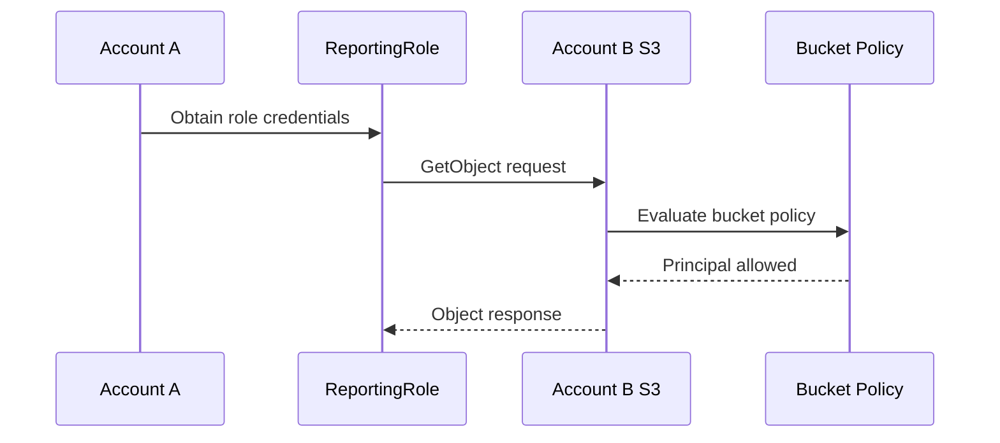
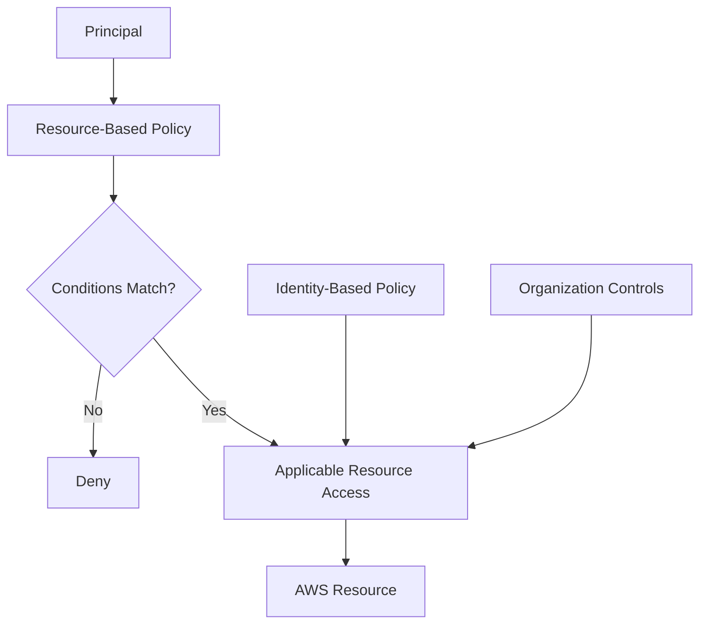

# 08- Resource-Based Policies

## Overview

A resource-based policy is an AWS JSON policy attached directly to a supported AWS resource. Instead of starting from an identity and describing what that identity can do, a resource-based policy starts from the resource and specifies **which principals can access it and which actions they can perform**. AWS documents resource-based policies as one of the two primary permissions policy types, alongside identity-based policies. :contentReference[oaicite:0]{index=0}

The core model is:

```text
Resource
    ↓
Resource-Based Policy
    ↓
Principal + Action + Resource + Condition
    ↓
Authorization Decision
```

For example, an S3 bucket policy can say:

```text
ReportingRole
    ↓
s3:GetObject
    ↓
company-reports/exports/*
```

Resource-based policies are especially useful for:

- Cross-account access
- Sharing an AWS resource with specific principals
- Resource-centric authorization
- Service-specific access controls
- Network entry points such as VPC endpoint policies
- Centralizing access rules on the resource itself

They are supported only by selected AWS services, so the first question when designing one is always:

> **Does the target AWS service support resource-based policies?**

AWS maintains a service-by-service reference showing which services support resource-based policies and which resource types support resource-level permissions. :contentReference[oaicite:1]{index=1}

---

## Resource-Based vs Identity-Based Policies

The fundamental difference is where the policy is attached and what it expresses.

| Characteristic | Identity-Based Policy | Resource-Based Policy |
|---|---|---|
| Attached to | IAM user, group, or role | Supported AWS resource |
| Main question | What can this identity do? | Who can access this resource? |
| `Principal` | Not specified | Explicitly specified |
| Reusable managed form | Yes | No, resource-based policies are inline on the resource |
| Common examples | Role permission policy | S3 bucket policy, SQS queue policy |
| Cross-account usage | Possible | Common |
| Resource ownership focus | Identity-centric | Resource-centric |

AWS states that identity-based policies can be managed or inline, while resource-based policies are inline policies attached directly to resources. :contentReference[oaicite:2]{index=2}

A useful mental model is:

```text
Identity-Based

Role
  ↓
Policy
  ↓
What can the role do?


Resource-Based

Resource
  ↓
Policy
  ↓
Who can access the resource?
```

Both can participate in the same authorization decision.

---

## What Is a Resource-Based Policy?

A resource-based policy is a JSON policy embedded in or associated with a resource supported by the target AWS service.

A typical statement contains:

```text
Effect
Principal
Action
Resource
Condition
```

Example:

```json
{
    "Version": "2012-10-17",
    "Statement": [
        {
            "Sid": "AllowReportingRoleRead",
            "Effect": "Allow",
            "Principal": {
                "AWS": "arn:aws:iam::123456789012:role/ReportingRole"
            },
            "Action": "s3:GetObject",
            "Resource": "arn:aws:s3:::company-reports/exports/*"
        }
    ]
}
```

The policy is attached to the S3 bucket, not to `ReportingRole`.

The statement therefore answers:

```text
Who?
    ReportingRole

What?
    s3:GetObject

Where?
    company-reports/exports/*
```

---

## Why Resource-Based Policies Exist

Resource-based policies solve a different authorization problem from identity-based policies.

Suppose a team owns an S3 bucket and wants to define access centrally on that bucket.

Instead of modifying every consumer role individually:

```text
Consumer Role A
    ↓
Identity Policy

Consumer Role B
    ↓
Identity Policy

Consumer Role C
    ↓
Identity Policy
```

the bucket owner can define:

```text
S3 Bucket
    ↓
Bucket Policy
    ↓
Approved Principals
```

This is particularly useful when:

- A resource has a clear ownership boundary.
- Multiple principals need access.
- Cross-account access is required.
- The resource owner needs direct control over who can access the resource.

S3 bucket policies are a common example of this model. AWS documents them as JSON policies that can allow or deny requests based on principals, actions, resources, and request conditions. :contentReference[oaicite:3]{index=3}

---

## The `Principal` Element

The most important structural difference from identity-based policies is `Principal`.

A resource-based policy uses:

```json
"Principal": {
    "AWS": "arn:aws:iam::123456789012:role/ReportingRole"
}
```

This explicitly identifies who the statement applies to.

AWS documents several supported principal forms, including:

- AWS accounts
- IAM roles
- Role sessions
- IAM users
- Federated principals
- AWS services
- All principals

IAM groups cannot be specified as principals because groups are permission-management constructs, not authenticated entities. :contentReference[oaicite:4]{index=4}

---

## Principal Types

### IAM User

```json
{
    "Principal": {
        "AWS": "arn:aws:iam::123456789012:user/alice"
    }
}
```

This directly identifies an IAM user.

For modern workforce environments, directly coupling resource access to individual users can make lifecycle and auditing harder than using centralized workforce identity or roles.

### IAM Role

```json
{
    "Principal": {
        "AWS": "arn:aws:iam::123456789012:role/ReportingRole"
    }
}
```

This is common for workload and cross-account access.

### AWS Account

```json
{
    "Principal": {
        "AWS": "123456789012"
    }
}
```

or the corresponding account ARN form can be used where supported.

An account principal delegates access to identities in that account; it does not simply mean that only the root user operates the resource. The receiving account must still configure the appropriate identity permissions. :contentReference[oaicite:5]{index=5}

### AWS Service

```json
{
    "Principal": {
        "Service": "lambda.amazonaws.com"
    }
}
```

This pattern is common in trust policies and certain service-integrated resource policies.

### Wildcard Principal

```json
{
    "Principal": "*"
}
```

This represents all principals.

AWS strongly recommends not using a wildcard principal with `Allow` unless public or anonymous access is intentionally required. :contentReference[oaicite:6]{index=6}

---

## Role Principals vs Role Session Principals

A role and an assumed role session are not exactly the same principal.

Role:

```text
arn:aws:iam::123456789012:role/ReportingRole
```

Role session:

```text
arn:aws:sts::123456789012:assumed-role/ReportingRole/reporting-job
```

This distinction can affect policy evaluation.

AWS documents that same-account resource-based policies behave differently depending on whether the policy grants to the IAM role ARN or directly to the role session principal. Permissions boundaries and session policies can also affect role-principal access in ways that differ from direct session-principal grants. :contentReference[oaicite:7]{index=7}

For most resource-policy designs, prefer a role principal unless there is a specific reason to target a role session.

---

## Resource-Based Policy Structure

A production resource-based policy commonly looks like:

```json
{
    "Version": "2012-10-17",
    "Statement": [
        {
            "Sid": "AllowServiceAccess",
            "Effect": "Allow",
            "Principal": {
                "AWS": "arn:aws:iam::123456789012:role/OrderServiceRole"
            },
            "Action": [
                "sqs:SendMessage"
            ],
            "Resource": "arn:aws:sqs:ap-south-1:987654321098:order-events"
        }
    ]
}
```

The structure can be read as:

```text
Principal
    Who gets access?

Action
    What operation?

Resource
    Which resource?

Condition
    Under what circumstances?

Effect
    Allow or Deny?
```

The exact resource policy syntax and supported elements vary by AWS service.

---

## Services That Support Resource-Based Policies

Resource-based policies are not an IAM feature that automatically applies to every AWS resource.

Support is service-specific and sometimes resource-type-specific.

AWS's current IAM service reference identifies which services support resource-based policies. Examples include resource policies for services and resource types such as:

- Amazon S3 buckets
- Amazon SQS queues
- Amazon SNS topics
- AWS KMS keys
- VPC endpoint policies
- Certain other AWS resources

AWS also notes that IAM itself has a resource-based policy in the form of an IAM role trust policy. :contentReference[oaicite:8]{index=8}

Always check the target service's authorization documentation before designing around a resource policy.

---

## Resource-Based Policies Are Not Resource-Level Permissions

These terms are related but different.

### Resource-Level Permissions

This means a policy can specify a particular resource ARN.

Example:

```json
{
    "Action": "s3:GetObject",
    "Resource": "arn:aws:s3:::company-reports/*"
}
```

### Resource-Based Policy

This means the policy itself is attached to the resource.

Example:

```text
S3 Bucket
    ↓
Bucket Policy
```

AWS explicitly distinguishes these concepts. A service can support resource-level permissions without supporting resource-based policies, and vice versa depending on the service and operation. :contentReference[oaicite:9]{index=9}

This distinction is important for IAM interviews and policy design.

---

## S3 Bucket Policies

S3 is one of the most important examples of resource-based authorization.

A bucket policy is attached to the S3 bucket:

```text
S3 Bucket
    ↓
Bucket Policy
```

Example:

```json
{
    "Version": "2012-10-17",
    "Statement": [
        {
            "Sid": "AllowReportingRoleRead",
            "Effect": "Allow",
            "Principal": {
                "AWS": "arn:aws:iam::123456789012:role/ReportingRole"
            },
            "Action": "s3:GetObject",
            "Resource": "arn:aws:s3:::company-reports/exports/*"
        }
    ]
}
```

S3 bucket policies can also use conditions based on request context, source network information, encryption requirements, and other supported keys. :contentReference[oaicite:10]{index=10}

---

## SQS Queue Policies

Amazon SQS supports resource-based policies.

Example:

```json
{
    "Version": "2012-10-17",
    "Statement": [
        {
            "Sid": "AllowProducer",
            "Effect": "Allow",
            "Principal": {
                "AWS": "arn:aws:iam::123456789012:role/OrderServiceRole"
            },
            "Action": "sqs:SendMessage",
            "Resource": "arn:aws:sqs:ap-south-1:987654321098:order-events"
        }
    ]
}
```

This is useful when a queue owner needs to control which producers or consumers can interact with the queue.

A typical microservice architecture might therefore look like:

```text
Order Service
    ↓
OrderServiceRole
    ↓
SQS SendMessage
    ↓
Order Queue
    ↑
Queue Policy
    ↑
Approved Principal
```

---

## SNS Topic Policies

Amazon SNS supports resource-based policies on topics.

Example:

```json
{
    "Version": "2012-10-17",
    "Statement": [
        {
            "Sid": "AllowPublisher",
            "Effect": "Allow",
            "Principal": {
                "AWS": "arn:aws:iam::123456789012:role/NotificationPublisherRole"
            },
            "Action": "sns:Publish",
            "Resource": "arn:aws:sns:ap-south-1:987654321098:notifications"
        }
    ]
}
```

This is useful when the topic owner wants the resource itself to declare which producers are trusted.

---

## KMS Key Policies

AWS KMS has an important special case.

KMS keys use key policies as resource-based policies, but KMS authorization has service-specific semantics and the key policy is a central part of the access model.

Example:

```json
{
    "Version": "2012-10-17",
    "Statement": [
        {
            "Sid": "AllowApplicationRole",
            "Effect": "Allow",
            "Principal": {
                "AWS": "arn:aws:iam::123456789012:role/ApplicationRole"
            },
            "Action": [
                "kms:Decrypt"
            ],
            "Resource": "*"
        }
    ]
}
```

Do not assume that KMS key policies behave exactly like S3 bucket policies.

AWS explicitly identifies KMS key policies as a service-specific exception in policy evaluation behavior and authorization. :contentReference[oaicite:11]{index=11}

---

## IAM Role Trust Policies

IAM itself supports one type of resource-based policy: the **role trust policy**.

The resource is the IAM role:

```text
IAM Role
    ↓
Trust Policy
```

Example:

```json
{
    "Version": "2012-10-17",
    "Statement": [
        {
            "Sid": "AllowECSTasksToAssumeRole",
            "Effect": "Allow",
            "Principal": {
                "Service": "ecs-tasks.amazonaws.com"
            },
            "Action": "sts:AssumeRole"
        }
    ]
}
```

The trust policy answers:

```text
Who can assume this role?
```

The role's identity-based permission policy answers:

```text
What can the role do after it is assumed?
```

AWS explicitly identifies the role trust policy as IAM's resource-based policy type. :contentReference[oaicite:12]{index=12}

---

## Resource Policy Evaluation

Resource-based policies are evaluated together with other applicable policies.

For requests within a single account, AWS checks applicable policy types and evaluates the request based on the principal, action, resource, conditions, and explicit denies. The exact result can vary by principal type, especially for users, roles, and role sessions. :contentReference[oaicite:13]{index=13}

A simplified model is:

```text
Request
    ↓
Identify Principal
    ↓
Identify Resource
    ↓
Find Resource Policy
    ↓
Find Other Applicable Policies
    ↓
Check Explicit Deny
    ↓
Evaluate Applicable Allow
    ↓
Final Decision
```

The simplified flow is useful operationally, but it should not be treated as a universal rule that every policy source must contain `Allow`.

Principal-specific behavior matters.

---

## Same-Account Access

Suppose the role and S3 bucket are in the same AWS account.

```text
Account A
    |
    +── ReportingRole
    |
    +── S3 Bucket
```

The request may be authorized through an identity-based policy, a resource-based policy, or both, depending on the service and principal.

AWS documents that when only permissions policies are relevant in a same-account request, an explicit `Allow` in either an identity-based or resource-based policy can be sufficient in common cases, while explicit denies override allows. The details differ by principal type and policy form. :contentReference[oaicite:14]{index=14}

This is why the statement:

```text
"Both policies must allow"
```

is not a universally correct rule for same-account access.

---

## Cross-Account Access

Cross-account access is different.

Suppose:

```text
Account A
    ReportingRole
        |
        | AWS API request
        v
Account B
    S3 Bucket
```

For cross-account resource access, AWS requires authorization on both sides of the account boundary under the normal resource-policy model:

```text
Account A
    Identity-Based Allow
        +
Account B
    Resource-Based Allow
        ↓
Access
```

AWS documents that the principal's account is the trusted account and the resource-owning account is the trusting account. The principal needs an identity-based policy allowing the requested operation and the resource policy must allow that principal. :contentReference[oaicite:15]{index=15}

---

## Cross-Account S3 Example

### Source Account

```text
123456789012
    ReportingRole
```

The role has:

```json
{
    "Version": "2012-10-17",
    "Statement": [
        {
            "Sid": "ReadReports",
            "Effect": "Allow",
            "Action": "s3:GetObject",
            "Resource": "arn:aws:s3:::company-reports/exports/*"
        }
    ]
}
```

### Target Account

The S3 bucket policy in account `987654321098` grants access to the source role:

```json
{
    "Version": "2012-10-17",
    "Statement": [
        {
            "Sid": "AllowCrossAccountReportingRole",
            "Effect": "Allow",
            "Principal": {
                "AWS": "arn:aws:iam::123456789012:role/ReportingRole"
            },
            "Action": "s3:GetObject",
            "Resource": "arn:aws:s3:::company-reports/exports/*"
        }
    ]
}
```

Conceptually:



The source identity permission and target resource permission form the cross-account authorization path. :contentReference[oaicite:16]{index=16}

---

## Resource-Based Policies and Least Privilege

Resource policies can enforce least privilege from the resource owner's perspective.

Instead of:

```text
S3 Bucket
    ↓
Trust entire AWS account
```

prefer:

```text
S3 Bucket
    ↓
Trust ReportingRole
```

Instead of:

```text
SQS Queue
    ↓
Allow *
```

prefer:

```text
SQS Queue
    ↓
Trust OrderServiceRole
```

The policy should be specific about:

- Principal
- Action
- Resource
- Conditions

This makes the resource's trust boundary explicit.

---

## Conditions in Resource-Based Policies

Conditions can narrow access further.

Example:

```json
{
    "Version": "2012-10-17",
    "Statement": [
        {
            "Sid": "AllowReportingRoleFromApprovedAccount",
            "Effect": "Allow",
            "Principal": {
                "AWS": "arn:aws:iam::123456789012:role/ReportingRole"
            },
            "Action": "s3:GetObject",
            "Resource": "arn:aws:s3:::company-reports/exports/*",
            "Condition": {
                "StringEquals": {
                    "aws:PrincipalAccount": "123456789012"
                }
            }
        }
    ]
}
```

Conditions are useful when the principal alone does not express enough of the security boundary.

Common condition dimensions include:

- Principal account
- Source account
- Source ARN
- Source IP
- VPC or VPC endpoint context
- Organization membership
- Secure transport
- Resource tags
- Request context

Condition keys are service- and context-dependent, so verify support before deploying a policy.

---

## `aws:SourceArn` and `aws:SourceAccount`

AWS services often use resource-based policies together with condition keys such as:

```text
aws:SourceArn
aws:SourceAccount
```

These are particularly important for service-to-service access patterns where an AWS service acts on behalf of a resource.

A common defensive pattern is:

```text
Principal = AWS service
    +
SourceArn = expected resource
    +
SourceAccount = expected account
```

This limits the trust relationship beyond simply allowing an entire service principal.

The exact applicability depends on the AWS service integration.

---

## `aws:PrincipalArn`

Resource-based policies can also use the `aws:PrincipalArn` condition key to identify the requesting principal.

Example:

```json
{
    "Version": "2012-10-17",
    "Statement": [
        {
            "Sid": "AllowReportingRole",
            "Effect": "Allow",
            "Principal": "*",
            "Action": "s3:GetObject",
            "Resource": "arn:aws:s3:::company-reports/*",
            "Condition": {
                "ArnEquals": {
                    "aws:PrincipalArn": "arn:aws:iam::123456789012:role/ReportingRole"
                }
            }
        }
    ]
}
```

This is an advanced pattern and should not be copied mechanically.

AWS documents specific differences between directly specifying role principals and using `aws:PrincipalArn`, especially around role sessions, permissions boundaries, and policy evaluation. :contentReference[oaicite:17]{index=17}

---

## Wildcard Principals

This is extremely important:

```json
{
    "Principal": "*"
}
```

with:

```json
"Effect": "Allow"
```

can make the resource publicly accessible, depending on the service and policy context.

AWS strongly recommends avoiding this unless public or anonymous access is explicitly intended. :contentReference[oaicite:18]{index=18}

Prefer:

```json
{
    "Principal": {
        "AWS": "arn:aws:iam::123456789012:role/ReportingRole"
    }
}
```

or use a deliberately constrained principal plus appropriate `Condition` elements.

---

## `NotPrincipal`

`NotPrincipal` allows an inverse principal match in resource-based policies supported by the service.

Example:

```json
{
    "Effect": "Deny",
    "NotPrincipal": {
        "AWS": "arn:aws:iam::123456789012:role/BreakGlassRole"
    },
    "Action": "s3:*",
    "Resource": [
        "arn:aws:s3:::company-sensitive",
        "arn:aws:s3:::company-sensitive/*"
    ]
}
```

This is an advanced and potentially dangerous construct.

AWS specifically warns against using a resource-based `Deny` with `NotPrincipal` for IAM users or roles that have a permissions boundary attached, because such statements can unintentionally deny those principals. AWS recommends using `aws:PrincipalArn` with an appropriate ARN condition operator instead. :contentReference[oaicite:19]{index=19}

For production policy design, prefer explicit principals or positive condition-based restrictions unless inverse matching is truly required.

---

## Resource Policies in Microservices

Resource-based policies can provide a clean ownership boundary in microservice architectures.

Example:

```text
Account
    |
    +── Order Service
    |      |
    |      └── OrderServiceRole
    |
    +── Shared Event Queue
           |
           └── Queue Policy
                  |
                  ├── OrderServiceRole
                  └── BillingServiceRole
```

The queue owner can define who may publish or consume.

This is especially useful when:

- A shared resource has one owning team.
- Multiple services need access.
- Services span AWS accounts.
- Resource ownership should remain independent of consuming identities.

---

## Resource-Based Policies and CI/CD

CI/CD systems can interact with resource-based policies when deploying or accessing shared infrastructure.

Example:

```text
GitHub Actions
    ↓
Deployment Role
    ↓
ECR / S3 / SQS / other resource
    ↑
Resource Policy where supported
```

A production deployment role should not rely on resource policies alone.

The complete access path can include:

```text
CI/CD role permissions
+
Resource policy
+
Trust policy
+
Organization guardrails
```

This matters particularly in multi-account environments.

---

## Resource Policies and Backend Applications

The application usually does not contain the resource policy itself.

For example, a Django application might upload to S3:

```python
import boto3

s3 = boto3.client("s3")

s3.upload_file(
    "invoice.pdf",
    "company-reports",
    "exports/invoice.pdf",
)
```

The authorization path is:

```text
Django
    ↓
ECS Task Role
    ↓
Identity-Based Permissions
    ↓
S3 Request
    ↓
Bucket Policy
    ↓
S3 Object
```

The application code remains focused on business behavior while resource ownership and authorization remain infrastructure concerns.

---

## Resource-Based Policies and VPC Endpoints

Some AWS VPC endpoints can use endpoint policies to control which actions and resources can be reached through the endpoint.

Conceptually:

```text
Private Workload
    ↓
VPC Endpoint
    ↓
Endpoint Policy
    ↓
AWS Service
```

This is another example of resource-centric authorization.

Endpoint policies are service-specific and should be treated separately from IAM identity permissions. AWS identifies VPC as supporting resource-based policy behavior for VPC endpoint access control. :contentReference[oaicite:20]{index=20}

---

## Common Mistake: Resource Policy vs Resource-Level Permission

These are not the same:

```text
Resource-level permission:
    Policy uses an ARN to target a specific resource.

Resource-based policy:
    Policy is attached directly to the resource.
```

A service can support one without universally supporting the other for every resource type.

Always verify:

```text
Does this action support resource-level permissions?
Does this resource type support a resource-based policy?
```

AWS provides a service matrix for these capabilities. :contentReference[oaicite:21]{index=21}

---

## Common Mistake: Assuming Both Policies Must Always Allow

For cross-account access, both the source identity permission and the target resource policy generally need to authorize the request. :contentReference[oaicite:22]{index=22}

For same-account access, however, the interaction is more nuanced.

AWS documents principal-specific behavior where an applicable resource-based `Allow` can sometimes be sufficient even when an identity-based implicit deny exists. :contentReference[oaicite:23]{index=23}

Do not use a single simplified rule for every resource policy scenario.

---

## Common Mistake: Treating Resource Policies as Managed Policies

Resource-based policies are attached directly to resources and are not managed policies that can be attached independently to multiple resources.

If you need a reusable identity permission set:

```text
Customer Managed Policy
```

may be appropriate.

If you need the resource owner to define who can access a specific resource:

```text
Resource-Based Policy
```

is the relevant model.

---

## Common Mistake: Using Wildcard Principals for Convenience

This is dangerous:

```json
{
    "Effect": "Allow",
    "Principal": "*",
    "Action": "s3:GetObject",
    "Resource": "arn:aws:s3:::company-reports/*"
}
```

Unless the bucket is deliberately intended to be public, this can expose data.

Use the smallest principal scope that satisfies the requirement.

---

## Common Mistake: Ignoring Resource Ownership

Suppose a platform team owns:

```text
shared-events
```

and ten services publish to it.

If all authorization is modeled only through consumer-side identity policies, ownership and access boundaries can become difficult to understand.

A resource policy can make the resource's trust boundary explicit:

```text
Shared Queue
    ↓
Allowed Producers
    ↓
Allowed Actions
```

This can improve operational clarity, particularly across teams and AWS accounts.

---

## Troubleshooting Resource-Based Policies

When a resource access request fails, investigate in this order:

```text
1. Identify the actual principal
        ↓
2. Identify the target resource
        ↓
3. Confirm the service supports resource-based policies
        ↓
4. Inspect the resource policy
        ↓
5. Check the Principal
        ↓
6. Check the Action
        ↓
7. Check the Resource
        ↓
8. Check Conditions
        ↓
9. Check identity-based permissions
        ↓
10. Check boundaries / SCP / RCP / session policy
        ↓
11. Check cross-account requirements
        ↓
12. Check service-specific authorization rules
```

Start with the actual caller:

```bash
aws sts get-caller-identity
```

Then inspect the relevant resource configuration.

For IAM role problems, also inspect the trust relationship:

```bash
aws iam get-role \
    --role-name ReportingRole
```

---

## Production Access Review

For every resource-based policy in production, review:

```text
Principal
    Is the principal still required?

Action
    Is the action set minimal?

Resource
    Is the scope minimal?

Condition
    Can request context further constrain access?

Cross-account
    Is the trust relationship still required?

Wildcard
    Is any wildcard intentional?

Ownership
    Does the resource owner understand the policy?

Auditability
    Is the policy stored and reviewed as infrastructure code?
```

This matters because resource-based policies are often long-lived resource configuration.

A forgotten bucket or queue policy can continue granting access even after the original application has changed.

---

## Security Architecture

A production resource policy should establish a clear trust boundary.



The resource policy is not necessarily the entire authorization model.

The final result can also depend on:

- Identity-based policies
- Permissions boundaries
- Session policies
- SCPs
- RCPs
- Service-specific controls
- Explicit denies

AWS evaluates the policies applicable to the request context rather than treating each policy independently. :contentReference[oaicite:24]{index=24}

---

## Resource-Based Policies in Multi-Account Architecture

Resource policies are particularly useful in multi-account environments.

Example:

```text
AWS Organization

Account A
    Application Account
        OrderServiceRole

Account B
    Shared Services Account
        Event Queue
            ↓
        Queue Policy
            ↓
        OrderServiceRole
```

This lets the resource-owning account define exactly which external principals it trusts.

The design can be expanded:

```text
Account A
    OrderServiceRole
          |
          +------------------+
                             |
Account B                    |
    Shared Queue <-----------+
    Shared S3 Bucket <-------+
    Shared SNS Topic <-------+
```

This creates explicit resource ownership and trust relationships rather than relying on broad account-wide permissions.

---

## Resource-Based Policy vs Role Assumption

Resource policies and role assumption solve related but different problems.

### Direct Resource Access

```text
Principal
    ↓
Resource Policy
    ↓
Resource
```

### Role-Based Delegation

```text
Principal
    ↓
AssumeRole
    ↓
Role Session
    ↓
Identity-Based Policy
    ↓
Resource
```

For cross-account architecture, a common pattern is:

```text
External Account
    ↓
AssumeRole
    ↓
Target Account Role
    ↓
Target Resources
```

This is often easier to centralize when one role needs access to many resources.

A resource policy is often more natural when:

```text
One resource
    ↓
Several specific principals
```

The correct model depends on resource ownership and the desired trust boundary.

---

## When to Prefer a Resource-Based Policy

Resource-based policies are particularly useful when:

- The resource owner should control access.
- Multiple principals need a shared resource.
- Cross-account access is required.
- Access should be explicitly associated with the resource.
- The AWS service exposes resource-based authorization.

Examples:

```text
S3 bucket
SQS queue
SNS topic
KMS key
VPC endpoint
IAM role trust relationship
```

The actual service support should always be verified against the current AWS authorization documentation. :contentReference[oaicite:25]{index=25}

---

## When an Identity-Based Policy Is Often Simpler

Use an identity-based model when the main requirement is:

```text
What can this workload do?
```

For example:

```text
OrderServiceRole
    ↓
s3:PutObject
    ↓
company-orders/generated/*
```

This is often the cleanest approach when one workload owns its own authorization and the resource does not need to maintain an explicit list of consumers.

---

## Interview Perspective

### What Is a Resource-Based Policy?

A JSON permissions policy attached directly to a supported AWS resource that specifies which principals can perform which actions against that resource. :contentReference[oaicite:26]{index=26}

### Why Does It Contain `Principal`?

Because the policy is attached to the resource and must explicitly identify the identities or services to which the statement applies. :contentReference[oaicite:27]{index=27}

### Give Examples

Common examples include:

```text
S3 bucket policy
SQS queue policy
SNS topic policy
KMS key policy
IAM role trust policy
VPC endpoint policy
```

Support is service-specific. :contentReference[oaicite:28]{index=28}

### How Does Cross-Account Access Work?

The source principal needs authorization to make the request, and the destination resource must authorize that principal through its resource policy under the normal cross-account model. :contentReference[oaicite:29]{index=29}

### Are Resource-Based Policies Managed Policies?

No. AWS documents resource-based policies as inline policies attached to resources rather than managed policies that can be independently attached to multiple resources. :contentReference[oaicite:30]{index=30}

### Why Can a Resource-Based Allow Sometimes Behave Differently From an Identity-Based Allow?

Because AWS evaluates resource-based permissions differently depending on the principal type and how the principal is specified. Role principals and role-session principals have different semantics, and permissions boundaries or session policies can affect the result. :contentReference[oaicite:31]{index=31}

---

## Senior-Level Mental Model

Think of resource-based authorization from the perspective of the resource owner:

```text
I own this resource.

Who do I trust?
    ↓
Principal

What may they do?
    ↓
Action

What part of the resource?
    ↓
Resource

Under what context?
    ↓
Condition
```

Then evaluate the full authorization environment:

```text
Resource Policy
       +
Identity Permissions
       +
Trust Relationships
       +
Boundaries
       +
Session Restrictions
       +
Organization Controls
       +
Request Context
       ↓
Final Authorization Decision
```

This model is especially important in multi-account architectures, shared-services environments, and service-to-service integrations.

## Key Takeaways

- **Resource-based policies are attached to supported AWS resources and explicitly define which principals can access those resources.**
- The `Principal` element is central to resource-based policies; supported principals include IAM roles, users, accounts, services, role sessions, and other documented principal types.
- **Same-account and cross-account evaluation differ**; cross-account access generally requires authorization from both the requesting identity and the resource-owning side.
- Resource-based policies are **service-specific and inline**, so always verify that the target service and resource type support them before designing an authorization model around them.
- In production, keep **principals, actions, resources, conditions, and cross-account trust boundaries narrow**, and treat resource policies as security-sensitive infrastructure that requires review and ongoing access auditing.