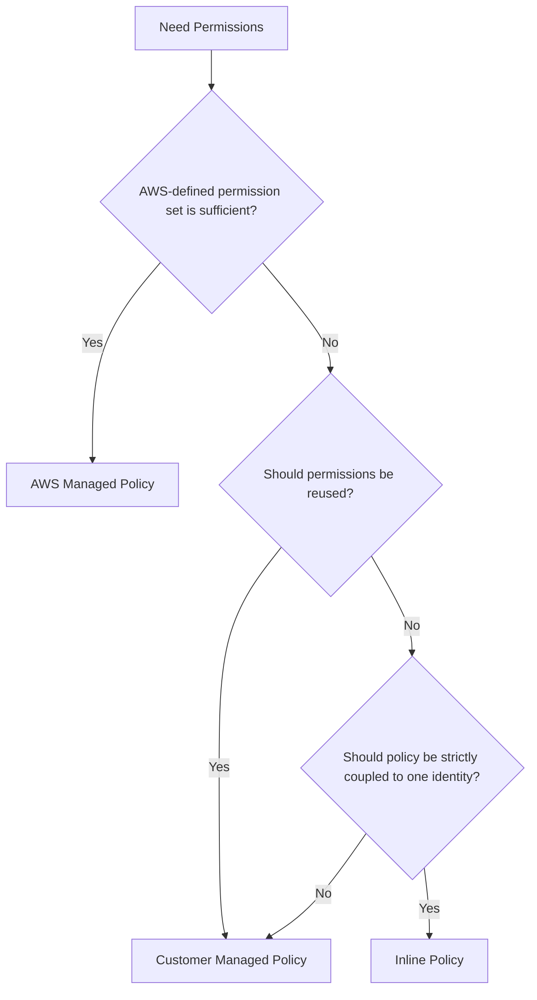
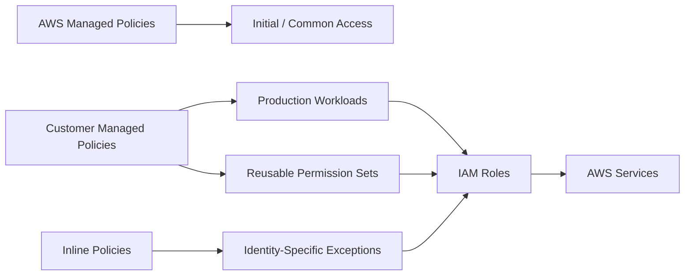

# 09- Managed vs Inline Policies

## Overview

AWS IAM identity permissions can be implemented through three policy forms:

```text
Identity-Based Policies
    ├── AWS Managed Policies
    ├── Customer Managed Policies
    └── Inline Policies
```

All three can define permissions for IAM users, groups, or roles, but they differ in **ownership, reuse, lifecycle, versioning, and change-management behavior**. AWS currently recommends managed policies over inline policies in most cases, while customer managed policies provide the most control for organization-specific least-privilege requirements. :contentReference[oaicite:0]{index=0}

The distinction matters because IAM policy design is also an operational design problem.

A policy attached to ten production roles has a very different change-management risk from ten independent inline policies containing similar permissions.

A practical model is:

```text
AWS Managed Policy
    ↓
AWS owns the permission definition

Customer Managed Policy
    ↓
Your organization owns the permission definition

Inline Policy
    ↓
One identity owns the embedded permission definition
```

For backend engineering, the usual decision should be based on three questions:

```text
Should this permission set be reusable?
        ↓
Should it have an independent lifecycle?
        ↓
Should one change affect multiple identities?
```

---

## Policy Types

| Policy type | Managed by | Reusable | Lifecycle | Typical use |
|---|---|---:|---|---|
| AWS managed | AWS | Yes | AWS controlled | Common AWS access patterns |
| Customer managed | Your organization | Yes | Organization controlled | Production application permissions |
| Inline | Your organization | No | Coupled to one identity | Identity-specific exceptions |

AWS defines an AWS managed policy as a standalone policy administered by AWS, a customer managed policy as a standalone policy administered by the customer, and an inline policy as a policy with a strict one-to-one relationship with an IAM identity. :contentReference[oaicite:1]{index=1}

---

## Managed Policies

A managed policy is a standalone IAM policy with its own ARN.

Example:

```text
arn:aws:iam::aws:policy/ReadOnlyAccess
```

or for a customer managed policy:

```text
arn:aws:iam::123456789012:policy/OrderServicePermissions
```

Managed policies can be attached to multiple principals.

```text
Managed Policy
      |
      +---- Role A
      |
      +---- Role B
      |
      +---- Role C
```

This creates a reusable permission abstraction.

Managed policies are particularly useful when a permission set represents a real organizational capability such as:

```text
ReportingReader
OrderEventPublisher
ApplicationSecretReader
DeploymentOperator
```

---

## AWS Managed Policies

AWS managed policies are created and maintained by AWS.

Example:

```text
arn:aws:iam::aws:policy/ReadOnlyAccess
```

They are designed for common AWS use cases and can be attached to users, groups, and roles. AWS manages their content and you cannot directly modify their policy statements. :contentReference[oaicite:2]{index=2}

### Advantages

AWS managed policies are useful because they provide:

- Immediate access to common permission sets
- No need to maintain the policy document
- Reuse across many identities
- AWS-maintained updates
- Convenient starting points for new environments

For example, during initial AWS adoption, a team may use an AWS managed read-only policy while learning which permissions the workload actually requires.

### Limitations

AWS managed policies have an important tradeoff:

> **They are not designed around your specific workload's least-privilege boundary.**

AWS explicitly notes that AWS managed policies may grant more permissions than a particular workload needs. AWS recommends reducing permissions further with customer managed policies when greater control is required. :contentReference[oaicite:3]{index=3}

Another operational consideration is that AWS can update AWS managed policies. Those changes are then applied to the identities to which the policies are attached. :contentReference[oaicite:4]{index=4}

This is convenient, but it means your application permission set is not completely under your control.

---

## When AWS Managed Policies Make Sense

AWS managed policies are useful for:

- Initial environment setup
- Temporary development access
- Common read-only requirements
- Standard administrative job functions
- Learning and experimentation
- Cases where the AWS-defined permission scope is intentionally acceptable

They can also be useful as a reference when building a customer managed policy.

For production application identities, review the actual permissions instead of assuming an AWS managed policy is sufficiently narrow.

---

## AWS Managed Policies and Permission Drift

Consider:

```text
Django Application
    ↓
AWS Managed Policy
    ↓
S3 / SQS / CloudWatch
```

If AWS later expands the attached managed policy, the application's effective permissions can also expand.

This creates a subtle operational property:

```text
Application permissions
    can change
without
    application code changing
```

That is not necessarily bad. AWS may add permissions needed for the policy's intended purpose.

However, it reinforces the importance of reviewing AWS managed policies before using them for sensitive production workloads.

---

## Customer Managed Policies

Customer managed policies are standalone policies that your organization creates and controls.

Example:

```json
{
    "Version": "2012-10-17",
    "Statement": [
        {
            "Sid": "PublishOrderEvents",
            "Effect": "Allow",
            "Action": "sqs:SendMessage",
            "Resource": "arn:aws:sqs:ap-south-1:123456789012:order-events"
        }
    ]
}
```

The policy can then be attached to one or more identities:

```text
OrderEventPublisher
        |
        +---- OrderServiceRole
        |
        +---- RetryWorkerRole
```

When the policy changes, the updated permission set applies to all attached identities. :contentReference[oaicite:5]{index=5}

---

## Why Customer Managed Policies Are Important

Customer managed policies provide the strongest combination of:

- Reuse
- Control
- Versioning
- Least-privilege design
- Centralized change management
- Infrastructure-as-code compatibility

This makes them particularly suitable for production backend systems.

For example:

```text
OrderService
    ↓
OrderServiceRole
    ↓
Customer Managed Policy
    ↓
Only order-related AWS permissions
```

The permission definition becomes an independently reviewable artifact.

---

## Customer Managed Policy Lifecycle

A customer managed policy has its own lifecycle.

```text
Create
  ↓
Attach
  ↓
Review
  ↓
Update
  ↓
Validate
  ↓
Deploy
  ↓
Monitor
  ↓
Retire
```

This is useful because authorization becomes something the engineering organization can manage as code.

A policy can be:

- Reviewed in Git
- Updated through CI/CD
- Tested before deployment
- Audited independently
- Reused consistently
- Rolled back to an earlier managed policy version when appropriate

AWS supports up to five saved versions of a managed policy, and previous customer managed policy versions can be retained and used as rollback points. :contentReference[oaicite:6]{index=6}

---

## Managed Policy Versioning

Customer managed policies support policy versions.

For example:

```text
OrderServicePermissions
    ├── v1
    ├── v2
    ├── v3
    └── v4
```

A new change creates a new policy version instead of overwriting the existing policy version. IAM allows up to five versions of a managed policy to be retained. :contentReference[oaicite:7]{index=7}

This is operationally useful when a policy change has unintended consequences.

For example:

```text
v1
    Production permissions

v2
    Added S3 permission

v3
    Accidentally broad resource scope

Rollback
    Set v2 as the default version
```

### Important Distinction

Do not confuse:

```json
"Version": "2012-10-17"
```

inside a policy with:

```text
Managed policy version: v1, v2, v3
```

They are different concepts.

The first is the IAM policy language version.

The second is a version of a particular managed policy document.

---

## Inline Policies

An inline policy is embedded directly inside one IAM identity.

```text
OrderServiceRole
    ↓
Inline Policy
```

There is no independent policy object that can be attached to several identities.

AWS defines inline policies as maintaining a strict one-to-one relationship with a single IAM user, group, or role. When that identity is deleted, its inline policies are deleted with it. :contentReference[oaicite:8]{index=8}

---

## Why Inline Policies Exist

Inline policies are useful when a permission set is intentionally unique to one identity.

For example:

```text
LegacyDataMigrationRole
    ↓
Unique one-off permission
```

The permission is not intended to be:

- Reused
- Shared
- Managed independently
- Attached to another identity

This strict coupling can actually be useful when preventing accidental reuse is more important than independent lifecycle management.

AWS specifically identifies this one-to-one relationship as a use case for inline policies. :contentReference[oaicite:9]{index=9}

---

## Inline Policy Example

An inline role policy can be defined as:

```json
{
    "Version": "2012-10-17",
    "Statement": [
        {
            "Sid": "LegacyMigrationAccess",
            "Effect": "Allow",
            "Action": [
                "s3:GetObject",
                "s3:PutObject"
            ],
            "Resource": "arn:aws:s3:::legacy-migration/*"
        }
    ]
}
```

The policy belongs to exactly one role.

```text
LegacyMigrationRole
    |
    └── LegacyMigrationAccess
```

Creating another role with the same policy means creating another independent inline policy, not reusing this policy object.

---

## Managed vs Inline: Core Difference

The most important difference is the policy-to-identity relationship.

### Managed Policy

```text
Policy Object
    |
    +---- Identity A
    |
    +---- Identity B
    |
    +---- Identity C
```

### Inline Policy

```text
Identity A
    |
    └---- Embedded Policy

Identity B
    |
    └---- Different Embedded Policy
```

Managed policies optimize for reuse and centralized lifecycle management.

Inline policies optimize for strict one-to-one coupling.

---

## Centralized Change Management

Suppose ten application roles use:

```text
ApplicationSecretReader
```

as a customer managed policy.

```text
ApplicationSecretReader
    |
    +---- Service A
    +---- Service B
    +---- Service C
    ...
    +---- Service J
```

A change to the managed policy affects all ten identities.

This is powerful, but it is also a potential blast-radius multiplier.

A policy update must therefore be reviewed as a change to every attached principal.

AWS explicitly identifies central change management as a major advantage of managed policies. :contentReference[oaicite:10]{index=10}

---

## Inline Policy Isolation

Inline policies behave differently.

Suppose ten roles each have their own inline copy:

```text
Role A
    └── Inline Policy A

Role B
    └── Inline Policy B

Role C
    └── Inline Policy C
```

Changing Role A's inline policy does not directly change Role B or Role C.

This reduces cross-identity coupling but introduces duplication and makes organization-wide updates more difficult.

The tradeoff is:

```text
Managed
    Reuse + central control
    → higher shared change impact

Inline
    Strong isolation
    → higher duplication and maintenance cost
```

---

## Comparison Table

| Characteristic | AWS Managed | Customer Managed | Inline |
|---|---|---|---|
| Policy owner | AWS | Your organization | Your organization |
| Standalone IAM policy object | Yes | Yes | No |
| Reusable | Yes | Yes | No |
| Directly editable | No | Yes | Yes |
| Versioned by IAM | Yes | Yes | No |
| Independent lifecycle | Yes | Yes | No |
| One-to-one with identity | No | No | Yes |
| Central change management | Yes | Yes | No |
| Best for custom least privilege | Limited | Strong | Strong |
| Best for reusable application permission sets | No | Yes | No |
| Typical production role choice | Sometimes | Often | Exception |
| AWS-controlled changes | Yes | No | No |

AWS documents these differences and recommends managed policies in most cases rather than inline policies. :contentReference[oaicite:11]{index=11}

---

## Choosing a Policy Type

A practical decision model is:



This is not an absolute rule, but it provides a useful default.

### Prefer AWS Managed When

```text
The AWS-defined scope is acceptable
and
customization is unnecessary
```

### Prefer Customer Managed When

```text
Permissions are organization-specific
and
the permission set should be reusable or independently managed
```

### Consider Inline When

```text
Permissions are intentionally unique
and
strict one-to-one coupling is desirable
```

AWS currently recommends managed policies over inline policies in most cases. :contentReference[oaicite:12]{index=12}

---

## Backend Engineering Example

Consider three backend services:

```text
Order Service
Payment Service
Reporting Service
```

Suppose only the order service publishes to an SQS queue.

A clean model is:

```text
OrderEventPublisher
    ↓
OrderServiceRole
```

The permission policy:

```json
{
    "Version": "2012-10-17",
    "Statement": [
        {
            "Sid": "PublishOrderEvents",
            "Effect": "Allow",
            "Action": "sqs:SendMessage",
            "Resource": "arn:aws:sqs:ap-south-1:123456789012:order-events"
        }
    ]
}
```

If the permission is unique to the order service, an inline policy may be technically appropriate.

If several workloads require exactly the same capability, a customer managed policy can be reused.

---

## Backend Engineering Example: Shared Capability

Suppose several workers need permission to read the same application secret:

```text
Order Worker
Payment Worker
Report Worker
```

A reusable customer managed policy can represent the capability:

```text
ApplicationSecretReader
    |
    +---- OrderWorkerRole
    +---- PaymentWorkerRole
    +---- ReportWorkerRole
```

This gives the organization one permission definition.

However, confirm that the shared permission is actually the same responsibility.

If the services have different trust boundaries or future permission requirements, independent policies may be safer.

---

## Avoid "One Policy Per Everything"

Managed policies should be reusable, but reuse does not mean combining every permission into one policy.

Avoid:

```text
BackendPlatformPolicy
    ├── S3
    ├── SQS
    ├── SNS
    ├── DynamoDB
    ├── IAM
    ├── EC2
    ├── KMS
    └── CloudFormation
```

and then attaching that policy to every service.

This creates a large shared authorization surface.

Prefer coherent capabilities:

```text
S3ReportWriter
SQSOrderPublisher
ApplicationSecretReader
```

A policy should have a meaningful ownership and responsibility boundary.

---

## Customer Managed Policies and Least Privilege

AWS explicitly recommends least privilege and identifies customer managed policies as a strong mechanism for implementing custom permission sets. AWS also provides IAM Access Analyzer capabilities to help generate or refine least-privilege policies from observed access activity. :contentReference[oaicite:13]{index=13}

A practical lifecycle is:

```text
Start
    ↓
Observe workload access
    ↓
Identify required actions
    ↓
Create customer managed policy
    ↓
Reduce resource scope
    ↓
Validate
    ↓
Deploy
    ↓
Monitor
    ↓
Review periodically
```

This is more reliable than guessing all permissions up front and permanently granting broad access.

---

## AWS Managed Policies to Customer Managed Policies

A useful migration path is:

```text
Development
    ↓
AWS Managed Policy
    ↓
Observe actual usage
    ↓
IAM Access Analyzer
    ↓
Customer Managed Policy
    ↓
Least Privilege
```

For example:

```text
Initial:
ReadOnlyAccess

Later:
OrderServiceReadPolicy
```

AWS explicitly recommends using AWS managed policies as a starting point when appropriate and then reducing permissions toward least privilege with customer managed policies. :contentReference[oaicite:14]{index=14}

This can be practical when teams are initially unfamiliar with the full AWS API surface.

---

## Inline Policies and Least Privilege

Inline policies can also implement least privilege.

For example:

```text
MigrationRole
    ↓
Inline Policy
    ↓
Specific migration bucket
```

The advantage is strong lifecycle coupling.

The limitation is operational reuse:

```text
Role A
    └── Inline Policy A

Role B
    └── Inline Policy B
```

Even if the permissions are identical, the policies are independent.

This can make organization-wide changes more difficult.

---

## Versioning and Rollback

Customer managed policy versioning is a significant operational difference.

Example:

```text
OrderServicePolicy

v1
    sqs:SendMessage

v2
    sqs:SendMessage
    s3:PutObject

v3
    sqs:SendMessage
    s3:PutObject
    s3:DeleteObject
```

If `v3` is found to be too permissive, an earlier version can be restored as the default policy version.

IAM stores up to five managed policy versions, and policy versions can be removed when the limit is reached. Inline policies do not have managed-policy version history. :contentReference[oaicite:15]{index=15}

---

## CLI: Customer Managed Policy

Create a customer managed policy:

```bash
aws iam create-policy \
    --policy-name OrderServicePermissions \
    --policy-document file://order-service-policy.json
```

The result creates an independent IAM policy object.

List policies:

```bash
aws iam list-policies \
    --scope Local
```

Get a policy:

```bash
aws iam get-policy \
    --policy-arn arn:aws:iam::123456789012:policy/OrderServicePermissions
```

These commands are useful for operational inspection, while production changes are usually better managed through infrastructure-as-code.

---

## CLI: Managed Policy Versioning

Create a new version:

```bash
aws iam create-policy-version \
    --policy-arn arn:aws:iam::123456789012:policy/OrderServicePermissions \
    --policy-document file://order-service-policy-v2.json \
    --set-as-default
```

List versions:

```bash
aws iam list-policy-versions \
    --policy-arn arn:aws:iam::123456789012:policy/OrderServicePermissions
```

Set an earlier version as default:

```bash
aws iam set-default-policy-version \
    --policy-arn arn:aws:iam::123456789012:policy/OrderServicePermissions \
    --version-id v1
```

The five-version limit means policy lifecycle automation should also clean up obsolete versions when necessary. :contentReference[oaicite:16]{index=16}

---

## CLI: Inline Policy

Put an inline policy on a role:

```bash
aws iam put-role-policy \
    --role-name LegacyMigrationRole \
    --policy-name LegacyMigrationAccess \
    --policy-document file://legacy-migration-policy.json
```

Retrieve it:

```bash
aws iam get-role-policy \
    --role-name LegacyMigrationRole \
    --policy-name LegacyMigrationAccess
```

Delete it:

```bash
aws iam delete-role-policy \
    --role-name LegacyMigrationRole \
    --policy-name LegacyMigrationAccess
```

AWS provides separate CLI operations for customer managed policies and inline policies because their lifecycle models are fundamentally different. :contentReference[oaicite:17]{index=17}

---

## Infrastructure as Code

For production systems, both managed and inline policies can be represented in infrastructure-as-code.

A typical structure is:

```text
infrastructure/
    iam/
        policies/
            order-service-policy.json
            reporting-reader-policy.json
        roles/
            order-service-role
            reporting-role
```

A customer managed policy might be represented as an independently managed resource.

An inline policy is instead embedded within the role or identity definition.

Conceptually:

```text
Customer Managed

Policy Resource
      ↓
Role Attachment


Inline

Role Resource
      ↓
Embedded Policy
```

This difference affects how infrastructure changes appear in code review.

---

## Change Management

### Managed Policy Change

Suppose:

```text
Policy P
    attached to
    Role A
    Role B
    Role C
```

Changing `Policy P` affects all three identities.

Therefore:

```text
One policy change
    ↓
Multiple workloads potentially affected
```

This is a major benefit for consistency and a major risk for unintended blast radius.

### Inline Policy Change

Suppose:

```text
Role A
    ↓
Inline Policy A
```

Changing the policy affects only that identity.

This provides stronger isolation but more maintenance overhead.

---

## Production Change Strategy

For a customer managed policy:

```text
1. Identify the affected identities.
2. Identify the permission change.
3. Review the new policy.
4. Validate the policy.
5. Test in a non-production environment where practical.
6. Deploy through the normal infrastructure workflow.
7. Monitor affected workloads.
8. Remove unnecessary older policy versions.
```

For an inline policy:

```text
1. Identify the single identity.
2. Review the embedded permission change.
3. Validate the policy.
4. Deploy through infrastructure-as-code.
5. Verify the identity's runtime behavior.
```

The deployment process should make authorization changes observable and reversible.

---

## Security Considerations

### AWS Managed Policies

Main risk:

```text
Permission scope may be broader than required
```

and:

```text
AWS may update the policy
```

This can be acceptable for common access patterns but should be evaluated for sensitive workloads. :contentReference[oaicite:18]{index=18}

### Customer Managed Policies

Main risk:

```text
A central policy change affects many principals
```

Mitigate through:

- Code review
- Policy validation
- Version control
- Controlled rollout
- Clear ownership
- Access analysis

### Inline Policies

Main risk:

```text
Permissions become duplicated and harder to manage globally
```

Mitigate through:

- Keeping inline policies intentionally narrow
- Avoiding them for reusable permission sets
- Managing them through infrastructure-as-code
- Periodically reviewing embedded permissions

---

## Operational Considerations

### Auditability

Managed policies are easier to audit as standalone objects:

```text
Policy
    ↓
Which identities use it?
    ↓
What permissions does it contain?
```

Inline policies require inspection of the identity itself.

### Scalability

For large organizations:

```text
Customer Managed Policies
    ↓
Reusable permission library
```

is generally easier to scale than thousands of unique inline policies.

### Consistency

A shared customer managed policy provides consistency:

```text
One policy
    ↓
Many identities
```

But that consistency also means a policy mistake can affect many identities.

### Ownership

Every customer managed policy should have an owner.

For example:

```text
S3ReportWriter
    Owner: Reporting Platform
```

This makes permission changes easier to review and retire.

---

## Common Mistakes

| Mistake | Why it happens | Better approach |
|---|---|---|
| Using AWS managed policies for every application | Fast setup | Move sensitive workloads toward customer managed least-privilege policies |
| Creating inline policies for every role | Simple initial configuration | Use customer managed policies for reusable permissions |
| One customer managed policy for every service | Mistaking reuse for good abstraction | Create policies around coherent capabilities |
| Forgetting shared-policy blast radius | Policy appears like one role's configuration | Identify every attached identity before changing it |
| Assuming AWS managed policies are static | Policy looks like normal JSON | Remember AWS controls and can update them |
| Confusing `Version` with managed policy versions | Similar terminology | Treat policy language version and managed-policy revision separately |
| Keeping five obsolete policy versions forever | Version history is mistaken for permanent backup | Remove unnecessary old versions |
| Managing production IAM only in the console | Fast manual changes | Use infrastructure-as-code and review |
| Using inline policies for temporary convenience indefinitely | Prototype becomes production | Refactor reusable permissions into managed policies |
| Sharing one broad customer managed policy | Reduces policy count | Reuse only when the permission set represents the same responsibility |

---

## Choosing Based on Engineering Requirements

| Requirement | AWS Managed | Customer Managed | Inline |
|---|---:|---:|---:|
| Fast setup | High | Medium | High |
| Custom permissions | Low | High | High |
| Reuse | High | High | None |
| Central change management | High | High | None |
| Strict one-to-one ownership | No | No | Yes |
| Least-privilege customization | Limited | Excellent | Excellent |
| Independent lifecycle | Yes | Yes | No |
| Rollback through managed policy versions | Yes, AWS-controlled | Yes | No |
| Operational scalability | High | High | Lower |
| Typical application choice | Sometimes | Usually | Exception |

---

## Practical Decision Guide

Use this sequence when deciding:

```text
Is the AWS-managed permission scope acceptable?
    |
    +-- Yes → AWS Managed Policy
    |
    +-- No
         |
         Is the permission set reusable?
         |
         +-- Yes → Customer Managed Policy
         |
         +-- No
              |
              Is strict one-to-one coupling intentional?
              |
              +-- Yes → Inline Policy
              |
              +-- No → Reconsider the policy boundary
```

This approach keeps the design focused on authorization responsibility rather than policy type alone.

---

## Senior-Level Design Pattern

A mature IAM design often looks like:



The important architectural principle is:

```text
Common AWS-defined access
        ↓
AWS Managed

Organization-defined reusable access
        ↓
Customer Managed

Intentionally unique access
        ↓
Inline
```

This keeps the policy hierarchy understandable as the environment grows.

---

## Interview Perspective

### What Is the Main Difference Between Managed and Inline Policies?

A managed policy is a standalone reusable IAM policy object.

An inline policy is embedded directly in one IAM identity and maintains a strict one-to-one relationship. :contentReference[oaicite:19]{index=19}

### AWS Managed vs Customer Managed

```text
AWS Managed
    AWS owns and updates it

Customer Managed
    Your organization owns and updates it
```

AWS managed policies are convenient but may be broader than workload-specific least privilege. :contentReference[oaicite:20]{index=20}

### Why Prefer Managed Policies in Most Cases?

Managed policies provide:

- Reuse
- Central change management
- Independent lifecycle
- Versioning
- Better operational scalability

AWS recommends managed policies over inline policies in most cases. :contentReference[oaicite:21]{index=21}

### Why Would You Ever Use Inline Policies?

When a permission set is intentionally unique to one identity and strict one-to-one coupling is desirable.

AWS explicitly identifies this as a use case for inline policies. :contentReference[oaicite:22]{index=22}

### What Happens When a Customer Managed Policy Changes?

The updated permissions apply to every principal to which the policy is attached. :contentReference[oaicite:23]{index=23}

### How Many Versions Can a Managed Policy Have?

IAM stores up to five versions of a managed policy. Inline policies do not have managed-policy versioning. :contentReference[oaicite:24]{index=24}

---

## Production Checklist

Before choosing a policy type, verify:

```text
Ownership
    Who controls the policy?

Reuse
    Does multiple identity use it?

Blast Radius
    Who is affected by a change?

Least Privilege
    Is the permission set narrowly scoped?

Lifecycle
    Should policy lifecycle be independent from the identity?

Versioning
    Do rollback and revision history matter?

Automation
    Will this be managed through IaC?

Auditability
    Can engineers determine why the permission exists?

Retirement
    How will the permission eventually be removed?
```

For most production backend workloads, the resulting decision is usually:

```text
Custom + reusable
    → Customer Managed Policy

AWS-standard + acceptable scope
    → AWS Managed Policy

Unique + intentionally coupled
    → Inline Policy
```

## Key Takeaways

- **AWS managed policies** are AWS-owned, reusable policies that provide convenient common permission sets but may be broader than a workload's least-privilege requirements.
- **Customer managed policies** are usually the strongest choice for production application permissions because they provide reusable, organization-controlled, versioned permission sets. :contentReference[oaicite:25]{index=25}
- **Inline policies** maintain a strict one-to-one relationship with a single identity and are best reserved for intentionally unique permission requirements. :contentReference[oaicite:26]{index=26}
- Managed-policy reuse improves consistency and centralized change management, but a shared policy change can affect every attached identity, so policy ownership and review are critical.
- Choose the policy type based on **reuse, lifecycle, least privilege, blast radius, and operational ownership**, rather than simply choosing the easiest option to configure.