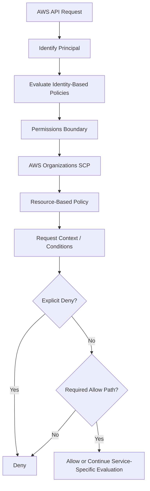
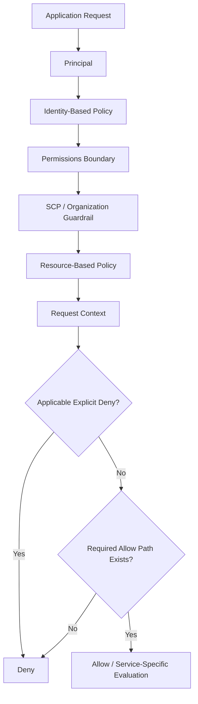

# 10- Permission Boundaries and SCPs

## Overview

AWS IAM permissions can be constrained at multiple layers. Two of the most important guardrails for production AWS environments are:

- **Permissions boundaries** — limit the maximum permissions that an IAM user or role can receive from its identity-based policies.
- **Service control policies (SCPs)** — organization-level guardrails that limit the maximum permissions available to IAM users and roles in member accounts.

Neither mechanism is a normal permission grant.

```text
Identity Policy
    "What this identity is allowed to request"

Permissions Boundary
    "What this identity is allowed to receive"

SCP
    "What this member account is allowed to permit"
```

A simplified model is:

```text
Identity-Based Policy
        ∩
Permissions Boundary
        ∩
SCP
        ↓
Effective Identity Permissions
```

When all three apply, an action must be permitted by the relevant layers, and any applicable explicit deny overrides an allow. AWS documents permissions boundaries as maximum permissions for an IAM user or role and SCPs as maximum permissions for IAM users and roles in member accounts. :contentReference[oaicite:0]{index=0}

The distinction is important:

```text
Permissions Boundary
    Identity-level guardrail

SCP
    Organization/account-level guardrail
```

This makes them particularly useful for delegated administration, multi-account AWS environments, CI/CD governance, and limiting the blast radius of application roles.

---

## Why These Guardrails Exist

A normal IAM permission policy answers:

> What can this identity do?

That becomes insufficient when one team or automation system is allowed to create or modify other identities.

For example:

```text
Platform Team
    ↓
Creates Application Role
    ↓
Attaches Permissions
```

Without a boundary, the platform team might accidentally or intentionally create:

```text
AdministratorAccess
```

for an application role.

A permissions boundary can restrict what that role is ever allowed to receive.

At the organization level:

```text
AWS Organization
    ↓
Accounts
    ↓
OUs
    ↓
Applications
```

an SCP can enforce organization-wide restrictions such as:

```text
Do not use disallowed AWS services
Do not modify protected resources
Do not disable required security controls
```

The result is defense in depth:

```text
Application-level policy
        +
Identity guardrail
        +
Organization guardrail
```

---

## Permissions Boundary

A permissions boundary is a managed IAM policy attached to an IAM **user or role** that defines the maximum permissions the identity-based policies can grant to that entity. AWS states that the entity can perform only actions allowed by both its identity-based policies and its permissions boundary. :contentReference[oaicite:1]{index=1}

Conceptually:

```text
Role Policy
    ↓
Possible Permissions

Boundary
    ↓
Maximum Allowed Permissions

Intersection
    ↓
Effective Identity Permissions
```

A boundary does not itself grant permissions.

AWS explicitly states that a policy used as a permissions boundary does not provide permissions to the identity; a separate permissions policy is still required. :contentReference[oaicite:2]{index=2}

---

## What a Permissions Boundary Controls

A permissions boundary limits what an IAM user or role can receive through identity-based policies.

Example:

```text
Identity Policy
    ├── s3:GetObject
    ├── s3:PutObject
    └── iam:CreateRole

Permissions Boundary
    ├── s3:GetObject
    └── s3:PutObject

Effective Identity Permissions
    ├── s3:GetObject
    └── s3:PutObject
```

The role's policy still contains:

```text
iam:CreateRole
```

but that capability is outside the boundary and therefore cannot become an effective permission through the identity-based policy path.

---

## Permissions Boundary Example

Suppose a platform team allows application teams to create roles for their services.

The organization wants those roles to access:

```text
S3
SQS
Secrets Manager
CloudWatch
```

but not:

```text
IAM administration
Organizations
Billing
Account management
```

A customer managed permissions-boundary policy could look like:

```json
{
    "Version": "2012-10-17",
    "Statement": [
        {
            "Sid": "AllowApprovedApplicationServices",
            "Effect": "Allow",
            "Action": [
                "s3:GetObject",
                "s3:PutObject",
                "sqs:ReceiveMessage",
                "sqs:SendMessage",
                "secretsmanager:GetSecretValue",
                "logs:CreateLogStream",
                "logs:PutLogEvents"
            ],
            "Resource": "*"
        }
    ]
}
```

This is intentionally only a structural example. Production policies should scope resources and actions according to the actual workload.

If an application role receives:

```text
Identity Policy:
    s3:*
    sqs:*
    iam:*
```

but its boundary allows only:

```text
s3:GetObject
s3:PutObject
sqs:ReceiveMessage
sqs:SendMessage
```

the identity-level effective permission set is limited accordingly.

---

## Boundary vs Permission Policy

These are not interchangeable.

| Characteristic | Identity Policy | Permissions Boundary |
|---|---|---|
| Grants permissions | Yes | No |
| Sets maximum permissions | No | Yes |
| Attached to | User, group, role | User or role |
| Reusable managed policy | Yes | Yes |
| Can contain `Allow` | Yes | Yes |
| Can contain `Deny` | Yes | Yes |
| Effective without separate permission policy | No for boundary | No |

The most important mental model is:

```text
Permission Policy
    "You may do X"

Boundary
    "You may receive at most X"
```

---

## Why Permissions Boundaries Matter

Permissions boundaries are especially useful when **permissions are delegated**.

Imagine:

```text
Central Platform Team
        ↓
Creates IAM roles
        ↓
Application Teams
        ↓
Deploy services
```

Without boundaries:

```text
Application Team
    ↓
Create Role
    ↓
Attach AdministratorAccess
    ↓
Potential privilege escalation
```

With a boundary:

```text
Application Team
    ↓
Create Role
    ↓
Attach Application Policy
    ↓
Boundary limits maximum permissions
    ↓
Effective Role
```

The boundary becomes a control plane for delegated IAM administration.

AWS explicitly documents permissions boundaries as a mechanism for delegating responsibility to others while controlling the maximum permissions that created users or roles can receive. :contentReference[oaicite:3]{index=3}

---

## Permissions Boundaries and Privilege Escalation

A poorly designed delegated IAM model can allow a principal to create a new role with more permissions than the original principal should effectively possess.

For example:

```text
DeveloperRole
    |
    +-- iam:CreateRole
    +-- iam:PutRolePolicy
```

If the developer can create a role without a boundary, it may be possible to construct a more privileged role.

A secure delegated model is:

```text
Developer
    ↓
Create Application Role
    ↓
Mandatory Permissions Boundary
    ↓
Maximum Allowed Permission Set
```

The boundary therefore helps constrain delegated IAM administration.

However, the boundary itself must be protected. A principal that can modify or remove its own boundary, or manipulate IAM configuration around it, may undermine the intended control.

---

## Applying a Permissions Boundary

A managed policy can be assigned as the boundary for a user or role.

For example, using the AWS CLI for a role:

```bash
aws iam put-role-permissions-boundary \
    --role-name OrderServiceRole \
    --permissions-boundary \
    arn:aws:iam::123456789012:policy/ApplicationRoleBoundary
```

For a user:

```bash
aws iam put-user-permissions-boundary \
    --user-name ApplicationUser \
    --permissions-boundary \
    arn:aws:iam::123456789012:policy/ApplicationUserBoundary
```

AWS documents separate APIs for user and role permissions boundaries. :contentReference[oaicite:4]{index=4}

Inspect a role boundary:

```bash
aws iam get-role \
    --role-name OrderServiceRole
```

The response includes the role's `PermissionsBoundary` information when one is configured.

---

## Permissions Boundary Limitations

A permissions boundary is powerful, but it is not a universal IAM firewall.

It primarily constrains permissions granted through the identity-based policy path for the IAM user or role.

Resource-based policies can have principal-specific interactions with boundaries. AWS documents cases where a resource-based policy can grant permissions in ways that are not simply reduced to the identity-policy-and-boundary intersection. :contentReference[oaicite:5]{index=5}

Therefore:

```text
Boundary
    ≠
Global restriction on every possible AWS authorization path
```

This is an important senior-level distinction.

Do not assume:

> "The role has a boundary, therefore nothing can grant it access beyond the boundary."

Instead, analyze the complete authorization model.

---

## Service Control Policies

A **service control policy (SCP)** is an AWS Organizations policy that provides central control over the maximum available permissions for IAM users and IAM roles in member accounts. SCPs do not themselves grant permissions. :contentReference[oaicite:6]{index=6}

Conceptually:

```text
AWS Organization
    ↓
SCP
    ↓
Member Account Guardrail
    ↓
IAM Users / Roles
```

A user or role still needs an applicable permission policy.

```text
SCP allows S3
    ≠
User automatically gets S3 access
```

The user still needs an identity-based or other applicable permission path.

AWS explicitly states that SCPs do not grant permissions and that appropriate IAM policies must still grant access. :contentReference[oaicite:7]{index=7}

---

## Why SCPs Exist

SCPs solve an organization-level governance problem.

Without SCPs, every member account could independently grant permissions such as:

```text
All AWS Services
All Regions
All Resources
```

The organization would have limited centralized control.

With SCPs:

```text
Organization
    ↓
Approved permission envelope
    ↓
Member Accounts
```

This allows a central cloud platform or security team to impose guardrails without having to manage every application role directly.

---

## SCP Example

Suppose an organization wants to prevent member accounts from using a specific AWS service.

A deny-style SCP might look like:

```json
{
    "Version": "2012-10-17",
    "Statement": [
        {
            "Sid": "DenyUnsupportedService",
            "Effect": "Deny",
            "Action": [
                "example-service:*"
            ],
            "Resource": "*"
        }
    ]
}
```

The policy is a governance guardrail.

It does not grant anything else.

If an application role contains:

```text
Allow example-service:SomeAction
```

but the SCP denies:

```text
example-service:*
```

the request is denied.

---

## SCPs as Permission Guardrails

A useful model is:

```text
Identity Policy
    "What the role wants to do"

SCP
    "What the organization allows the account to do"

Effective Permission
    "What survives both"
```

For a simple allow path:

```text
Identity Policy
    Allow s3:GetObject
          ↓
SCP
    Allows s3:GetObject
          ↓
Allowed
```

For a restricted path:

```text
Identity Policy
    Allow s3:GetObject
          ↓
SCP
    Explicit Deny s3:GetObject
          ↓
Denied
```

An explicit deny overrides an allow. AWS applies this rule across the relevant policy evaluation logic. :contentReference[oaicite:8]{index=8}

---

## SCP Hierarchy

SCPs are attached in the AWS Organizations hierarchy:

```text
Organization Root
    |
    +── Production OU
    |      |
    |      +── Production Account
    |
    +── Development OU
           |
           +── Development Account
```

A policy attached to an organization root can apply to organizational units and accounts beneath it.

An SCP attached to an OU can affect accounts within that OU.

An account can therefore be subject to SCPs at multiple levels.

```text
Organization Root SCP
        ∩
Production OU SCP
        ∩
Account SCP
        ↓
Applicable SCP Guardrail
```

AWS documents that a permission must remain allowed by the relevant SCPs attached along the account's path. :contentReference[oaicite:9]{index=9}

---

## SCP Allow vs Deny Models

There are two common SCP strategies.

### Allow-List Model

Only explicitly allowed services or actions are available through the SCP layer.

Conceptually:

```text
SCP
    Allow:
        S3
        SQS
        CloudWatch
```

Anything not allowed by the applicable SCP chain is unavailable to member-account principals.

### Deny-List Model

The organization allows broadly but explicitly denies prohibited operations.

Example:

```text
Deny:
    Disable CloudTrail
    Delete required security resources
    Use prohibited services
```

A deny-list approach is often easier to introduce into an existing organization, while an allow-list provides a tighter permission envelope but requires more comprehensive service management.

The decision should be based on organizational maturity, account requirements, and operational tolerance for policy maintenance.

---

## The Default `FullAWSAccess` Policy

New AWS Organizations structures commonly use the default `FullAWSAccess` SCP as part of the initial SCP setup.

Its purpose is to avoid unintentionally blocking all permissions when SCPs are first enabled.

Conceptually:

```text
Root
    ↓
FullAWSAccess
    ↓
OU
    ↓
FullAWSAccess
    ↓
Account
```

An organization can then introduce additional restrictive SCPs.

When using restrictive allow-style SCPs, remember that permissions generally need to remain allowed through every applicable level in the organization hierarchy. :contentReference[oaicite:10]{index=10}

---

## SCPs Do Not Grant Permissions

This is one of the most important interview points.

Consider:

```text
SCP:
    Allow s3:*

IAM Role:
    No S3 permissions
```

Result:

```text
Denied
```

The SCP only says:

```text
S3 is not prohibited by this organizational boundary.
```

The role still needs:

```text
Allow s3:SomeAction
```

from an applicable IAM permission policy or resource-based authorization path.

AWS explicitly states that SCPs do not grant permissions. :contentReference[oaicite:11]{index=11}

---

## Permissions Boundary vs SCP

The most important distinction is **scope**.

| Characteristic | Permissions Boundary | SCP |
|---|---|---|
| AWS feature | IAM | AWS Organizations |
| Scope | User or role | Member accounts / OUs / organization hierarchy |
| Applies to | IAM users and roles with a boundary | IAM users and roles in affected member accounts |
| Grants permissions | No | No |
| Defines maximum permissions | Yes | Yes |
| Primary use | Delegated identity administration | Organization-wide governance |
| Managed policy involved | Yes | Organization policy |
| Typical owner | IAM/platform team | Cloud governance/security team |
| Applies to management account | N/A | No |
| Applies to service-linked roles | Boundary cannot be attached to service-linked role | SCPs do not affect service-linked roles |

AWS documents that permissions boundaries apply to IAM users or roles, while SCPs apply to member-account principals within AWS Organizations. SCPs do not affect users or roles in the organization's management account and do not affect service-linked roles. :contentReference[oaicite:12]{index=12}

---

## Permissions Boundary and SCP Together

A production identity can be affected by both:

```text
IAM Role Policy
       ∩
Permissions Boundary
       ∩
SCP
       ↓
Effective Permissions
```

Example:

```text
Role Policy
    s3:GetObject
    s3:PutObject
    sqs:SendMessage

Boundary
    s3:GetObject
    s3:PutObject

SCP
    s3:GetObject
    s3:PutObject
    sqs:SendMessage

Effective Identity Permissions
    s3:GetObject
    s3:PutObject
```

`SQS:SendMessage` is not available through the role's identity permission path because the boundary does not allow it.

The resulting permission is therefore constrained by the narrowest applicable identity-level boundary.

AWS explicitly documents the intersection behavior when an identity-based policy, permissions boundary, and SCP all apply. :contentReference[oaicite:13]{index=13}

---

## Explicit Deny Across Layers

An explicit deny in any applicable policy can block the request.

Consider:

```text
Role Policy
    Allow s3:GetObject

Boundary
    Allow s3:GetObject

SCP
    Deny s3:GetObject
```

Result:

```text
Deny
```

The deny is decisive.

This gives platform teams a powerful organization-wide control:

```text
Application teams
    ↓
Can define local Allows

Security / Governance
    ↓
Can enforce explicit Denies
```

This separation is one reason SCPs are useful in multi-account organizations.

---

## Permissions Boundaries for Delegated Administration

A common enterprise pattern is:

```text
Platform Team
    ↓
Boundary Policy

Application Team
    ↓
IAM Role Policy

Effective Role
    ↓
Application Permissions
```

The platform team defines the maximum security envelope.

The application team defines permissions inside that envelope.

For example:

```text
Boundary
    ├── S3
    ├── SQS
    ├── Secrets Manager
    └── CloudWatch

Application Policy
    ├── S3 PutObject
    ├── SQS SendMessage
    └── SecretsManager GetSecretValue
```

The application team cannot obtain permissions outside the boundary through the normal identity-based policy path.

This is a clean separation of responsibilities.

---

## CI/CD Use Case

Permissions boundaries are particularly useful for deployment automation.

Consider a platform that allows teams to provision their own IAM roles.

Without a boundary:

```text
GitHub Actions
    ↓
Terraform
    ↓
Create IAM Role
    ↓
Attach arbitrary policy
```

Potentially dangerous policies could be introduced.

With a boundary:

```text
GitHub Actions
    ↓
Terraform
    ↓
Create Role
    ↓
Mandatory Boundary
    ↓
Attach Application Policy
```

The resulting role remains within the approved permission envelope.

A mature platform can enforce the boundary through:

- Infrastructure-as-code modules
- Organization controls
- IAM permissions
- CI/CD checks
- Policy validation
- Resource creation standards

---

## ECS / Lambda Workload Example

Suppose an ECS task role has:

```text
OrderServiceRole
```

Its identity policy allows:

```text
s3:GetObject
sqs:SendMessage
secretsmanager:GetSecretValue
```

Its boundary allows only:

```text
s3:GetObject
sqs:SendMessage
secretsmanager:GetSecretValue
```

The application can perform its intended workload operations.

Now suppose a developer changes the identity policy to:

```text
iam:CreateRole
iam:AttachRolePolicy
```

The boundary still prevents those permissions from becoming effective if they are outside the boundary.

This is useful for reducing the impact of unauthorized or overly broad application policy changes.

---

## SCP Use Case: Restrict Regions

An organization might want to constrain workloads to approved AWS regions.

A conceptual SCP could deny actions outside approved regions.

A simplified pattern is:

```json
{
    "Version": "2012-10-17",
    "Statement": [
        {
            "Sid": "DenyUnapprovedRegions",
            "Effect": "Deny",
            "NotAction": [
                "iam:*",
                "organizations:*",
                "route53:*"
            ],
            "Resource": "*",
            "Condition": {
                "StringNotEquals": {
                    "aws:RequestedRegion": [
                        "ap-south-1",
                        "us-east-1"
                    ]
                }
            }
        }
    ]
}
```

This is a policy-design pattern rather than a universal drop-in policy.

Global services and service-specific exceptions require careful treatment because not every AWS API uses regional resources in the same way.

---

## SCP Use Case: Protect Security Controls

An organization can use SCPs to prevent member-account administrators from disabling required security mechanisms.

For example:

```text
Member Account
    ↓
Local Administrator
    ↓
Attempts to disable security service
    ↓
SCP explicit Deny
    ↓
AccessDenied
```

This is valuable because an account administrator with broad IAM permissions can still be constrained by an organization-level guardrail.

The SCP provides a higher-level governance boundary rather than relying on every individual account administrator to preserve security controls.

---

## SCPs and the Management Account

A critical operational fact:

> SCPs do not restrict users or roles in the AWS Organizations management account. :contentReference[oaicite:14]{index=14}

This is one reason AWS recommends keeping production workloads and resources out of the management account where practical.

Conceptually:

```text
Management Account
    ↓
SCP does not constrain its users/roles

Member Account
    ↓
SCP applies
```

AWS specifically recommends limiting use of the management account to tasks that require it and avoiding production workloads there, partly because SCPs cannot restrict the management account. :contentReference[oaicite:15]{index=15}

---

## SCPs and Service-Linked Roles

SCPs do not restrict service-linked roles.

AWS documents service-linked roles as an exception to SCP restrictions because AWS services need these roles to perform supported service operations. :contentReference[oaicite:16]{index=16}

This means:

```text
SCP
    ↓
IAM User / Role
    → Can be restricted

SCP
    ↓
Service-Linked Role
    → Not restricted by SCP
```

Do not assume an SCP is a universal deny mechanism for every AWS identity.

---

## Permissions Boundaries Cannot Be Attached to Service-Linked Roles

Permissions boundaries are supported for IAM users and normal IAM roles, but AWS states that a boundary cannot be set on a service-linked role. :contentReference[oaicite:17]{index=17}

This is another reason to distinguish:

```text
Normal IAM Role
    ↓
Boundary can be attached

Service-Linked Role
    ↓
Boundary cannot be attached
```

---

## Resource-Based Policy Interaction

Permissions boundaries and SCPs should not be treated as identical.

A permissions boundary primarily limits permissions granted through identity-based policies.

Resource-based policies can have principal-specific behavior. AWS documents cases where a resource-based policy can grant access directly to certain principals in ways that are not simply equivalent to intersecting the resource policy with the permissions boundary. :contentReference[oaicite:18]{index=18}

For example:

```text
Role
    ↓
Permissions Boundary
    ↓
Identity Policy
```

does not mean every resource-based authorization path is automatically identical.

For senior-level IAM troubleshooting, determine:

```text
Who is the principal?
How is the resource policy granting access?
Is the policy same-account or cross-account?
Does a role session participate?
```

before concluding that a boundary is responsible for the denial.

---

## Cross-Account Access

For cross-account access, permissions boundaries and SCPs can affect the request on top of the normal cross-account permission requirements.

Conceptually:

```text
Account A
    Principal
        ↓
    Identity Policy
        ↓
    Boundary
        ↓
    Source Account SCP
        ↓
    Cross-Account Request
        ↓
Account B
    Resource Policy
        ↓
    Target Account Controls
        ↓
    Final Decision
```

AWS states that cross-account requests are evaluated in both the trusted account and the trusting account, and the request is allowed only if both account-level evaluations allow it. :contentReference[oaicite:19]{index=19}

This creates additional troubleshooting dimensions:

```text
Source IAM policy
Source boundary
Source SCP
Target resource policy
Target organization controls
```

---

## Permissions Boundaries vs SCPs vs RCPs

RCPs are another AWS Organizations control that limits the maximum available permissions for resources.

| Control | Limits | Scope |
|---|---|---|
| Permissions Boundary | Identity-based permissions for a user or role | IAM entity |
| SCP | Permissions available to IAM users and roles | Member account / OU / organization |
| RCP | Permissions available to resources | Member account / OU / organization |

RCPs are especially relevant when designing resource-side organization guardrails. AWS documents RCPs as maximum-permission controls for resources in member accounts. :contentReference[oaicite:20]{index=20}

For this topic, the practical distinction is:

```text
Boundary
    "Limit the identity"

SCP
    "Limit the member account"

RCP
    "Limit the resource"
```

---

## Policy Evaluation Model

A conceptual backend-engineering model is:



This is intentionally conceptual. AWS policy evaluation varies based on the policy types that apply, principal type, resource policy behavior, account boundaries, and service-specific authorization rules. :contentReference[oaicite:21]{index=21}

---

## Troubleshooting Permission Boundaries

If a role has an apparently correct policy but receives `AccessDenied`, check whether it has a permissions boundary.

Useful command:

```bash
aws iam get-role \
    --role-name OrderServiceRole
```

Look for:

```text
PermissionsBoundary
```

Then inspect the referenced managed policy.

Conceptually:

```text
Role Policy
    ↓
Allows requested action?

Boundary
    ↓
Allows requested action?

Both?
    ↓
Continue evaluation
```

If the role policy allows:

```text
s3:PutObject
```

but the boundary does not, the effective identity permission is denied.

AWS documents this intersection behavior explicitly. :contentReference[oaicite:22]{index=22}

---

## Troubleshooting SCPs

When an identity has the expected IAM permissions but is still denied:

```text
Check:
    Is the account in AWS Organizations?
    ↓
    Is SCP policy type enabled?
    ↓
    Which OUs contain the account?
    ↓
    Which SCPs are attached at each level?
    ↓
    Is the action allowed through every applicable level?
    ↓
    Is there an explicit Deny?
```

AWS provides service last accessed data that can help organizations understand which services accounts are actually using before refining SCPs. :contentReference[oaicite:23]{index=23}

The identity owner and the Organizations administrator may be different teams, so SCP-related incidents often require coordination between application/platform and central cloud-governance teams.

---

## CLI Investigation

Determine the active principal:

```bash
aws sts get-caller-identity
```

Inspect an IAM role:

```bash
aws iam get-role \
    --role-name OrderServiceRole
```

Inspect attached managed policies:

```bash
aws iam list-attached-role-policies \
    --role-name OrderServiceRole
```

Inspect inline policies:

```bash
aws iam list-role-policies \
    --role-name OrderServiceRole
```

Check whether the current account belongs to an organization:

```bash
aws organizations describe-organization
```

Inspect the policies attached to the account or organization through the AWS Organizations APIs when the caller has the necessary permissions.

The investigation should answer:

```text
Is the identity allowed?
Is the identity boundary allowing it?
Is the organization allowing it?
Is the resource allowing it?
Is anything explicitly denying it?
```

---

## Common Mistake: Treating a Boundary as a Grant

Incorrect mental model:

```text
Boundary
    Allow S3
    ↓
Role automatically gets S3
```

Correct model:

```text
Role Policy
    Allow S3
       ∩
Boundary
    Allow S3
       ↓
Effective S3 permission
```

AWS explicitly states that permissions-boundary policies do not provide permissions by themselves. :contentReference[oaicite:24]{index=24}

---

## Common Mistake: Treating an SCP as a Grant

Incorrect:

```text
SCP
    Allow SQS
    ↓
Every role can use SQS
```

Correct:

```text
SCP
    Allows SQS
       ∩
Role Permission Policy
    Allows SQS
       ↓
SQS access can be allowed
```

SCPs are guardrails, not permission grants. :contentReference[oaicite:25]{index=25}

---

## Common Mistake: Assuming `AdministratorAccess` Bypasses an SCP

Consider:

```text
IAM Policy
    AdministratorAccess
```

and:

```text
SCP
    Deny a specific action
```

The SCP still restricts the member account principal.

AWS explicitly notes that a member-account administrator with an all-powerful IAM policy cannot use permissions that the applicable SCPs prohibit. :contentReference[oaicite:26]{index=26}

This is a central reason organizations use SCPs.

---

## Common Mistake: Attaching Restrictive SCPs Without Testing

A badly designed SCP can affect many accounts simultaneously.

For example:

```text
Organization Root
    ↓
Restrictive SCP
    ↓
All member accounts
```

A missing permission in an allow-style SCP can cause services to stop working across multiple accounts.

AWS strongly recommends testing SCPs before attaching restrictive policies at the organization root. :contentReference[oaicite:27]{index=27}

A safer rollout model is:

```text
Create Test OU
    ↓
Move one account
    ↓
Observe
    ↓
Refine policy
    ↓
Expand rollout
```

---

## Common Mistake: Forgetting the SCP Hierarchy

Suppose:

```text
Root
    FullAWSAccess

Production OU
    Restrictive SCP

Account
    FullAWSAccess
```

The account's local policy does not override a restrictive policy inherited from the OU.

The applicable SCP set is determined by the path through the organization hierarchy.

A policy at an ancestor level can therefore restrict an account even when the account-level SCP appears permissive. :contentReference[oaicite:28]{index=28}

---

## Common Mistake: Using the Management Account as Production

Because SCPs do not restrict the management account:

```text
Management Account
    ↓
No SCP restriction
```

deploying production workloads there can weaken the organization's governance boundary.

AWS recommends keeping resources in member accounts and using the management account primarily for tasks that require management-account access. :contentReference[oaicite:29]{index=29}

---

## Security Considerations

Permissions boundaries and SCPs implement **defense in depth**.

A production environment can use:

```text
Application Policy
    ↓
Workload Role
    ↓
Permissions Boundary
    ↓
Account / OU SCP
    ↓
Resource Policy
```

Each layer controls a different part of the authorization surface.

This means a mistake at one layer does not necessarily grant unrestricted access.

For example:

```text
Developer mistakenly grants:
    s3:*

Boundary:
    Only approved S3 actions

SCP:
    Denies access outside approved regions

Result:
    Effective permissions remain constrained
```

This is the architectural value of guardrails: they limit the impact of permission mistakes.

---

## Operational Considerations

### Ownership

Define clear ownership:

```text
Application Team
    Owns workload policies

Platform / IAM Team
    Owns permission boundaries

Cloud Governance / Security
    Owns SCP strategy
```

This separation reduces conflicting changes and makes incident routing clearer.

### Change Management

Treat boundaries and SCPs as high-impact infrastructure.

Use:

- Version control
- Infrastructure-as-code
- Pull requests
- Validation
- Staged deployment
- Monitoring
- Rollback procedures

### Observability

When permissions fail unexpectedly, inspect:

- CloudTrail events
- IAM policy configuration
- Role boundaries
- Organization SCPs
- Resource policies
- Request context

An application log saying:

```text
AccessDenied
```

is usually not enough to identify which layer denied the request.

---

## Production Architecture

A mature multi-account architecture might look like:

```text
AWS Organization
    |
    +── Security OU
    |      └── Security Accounts
    |
    +── Production OU
    |      ├── Order Account
    |      ├── Payment Account
    |      └── Reporting Account
    |
    +── NonProduction OU
           ├── Development Account
           └── Staging Account
```

SCPs can provide organization-wide or OU-specific guardrails.

Within each account:

```text
Application Role
    ↓
Identity-Based Policy
    ↓
Permissions Boundary
    ↓
Application Resources
```

This creates multiple layers of authorization:

```text
Organization governance
        ↓
Account governance
        ↓
Identity governance
        ↓
Application permissions
        ↓
Resource authorization
```

---

## Interview Perspective

### What Is a Permissions Boundary?

A managed IAM policy that sets the maximum permissions an IAM user or role can receive from identity-based policies. It does not grant permissions by itself. :contentReference[oaicite:30]{index=30}

### What Is an SCP?

An AWS Organizations policy that limits the maximum permissions available to IAM users and roles in member accounts. It does not grant permissions. :contentReference[oaicite:31]{index=31}

### Boundary vs SCP

```text
Permissions Boundary
    Identity-level maximum

SCP
    Organization/member-account maximum
```

### Can a Boundary Be Attached to a Group?

No. Permissions boundaries apply to IAM users and roles, not groups. :contentReference[oaicite:32]{index=32}

### Can an SCP Give Permission?

No.

The IAM identity or resource still needs an applicable permission policy. :contentReference[oaicite:33]{index=33}

### Do SCPs Apply to the Management Account?

No. SCPs affect member accounts, not users or roles in the management account. :contentReference[oaicite:34]{index=34}

### Do SCPs Affect Service-Linked Roles?

No. AWS documents service-linked roles as exempt from SCP restrictions. :contentReference[oaicite:35]{index=35}

### Can a Permissions Boundary Replace Least Privilege?

No.

It is a guardrail, not a substitute for designing the identity's permission policy correctly.

The ideal combination is:

```text
Least-Privilege Identity Policy
        +
Permissions Boundary
        +
Organization Guardrails
```

---

## Senior-Level Mental Model

For backend engineering and system design, think of these layers as independent control planes:

```text
Application Team
    ↓
Identity Policy
    "What does this service need?"

Platform Team
    ↓
Permissions Boundary
    "What may this service identity ever receive?"

Organization Governance
    ↓
SCP
    "What may member accounts ever permit?"

Resource Owner
    ↓
Resource Policy
    "Who can access this specific resource?"
```

The resulting authorization model becomes:



The engineering goal is not to put every restriction into one policy.

The goal is to place each control at the layer where it has the strongest ownership and operational meaning.

## Key Takeaways

- **Permissions boundaries limit the maximum permissions available to an IAM user or role, while SCPs limit the maximum permissions available to IAM users and roles in member accounts.**
- Neither mechanism grants permissions by itself; effective access requires an applicable permission path, and an applicable explicit deny overrides an allow. :contentReference[oaicite:36]{index=36}
- Permissions boundaries are primarily **identity-level guardrails** for delegated IAM administration, while SCPs are **organization-level governance controls** for multi-account environments.
- SCPs do not restrict the AWS Organizations management account or service-linked roles, while permissions boundaries cannot be attached to service-linked roles. :contentReference[oaicite:37]{index=37}
- In production, combine **least-privilege identity policies, carefully designed boundaries, organization guardrails, and resource policies**, and test high-impact SCP changes before broad rollout. :contentReference[oaicite:38]{index=38}